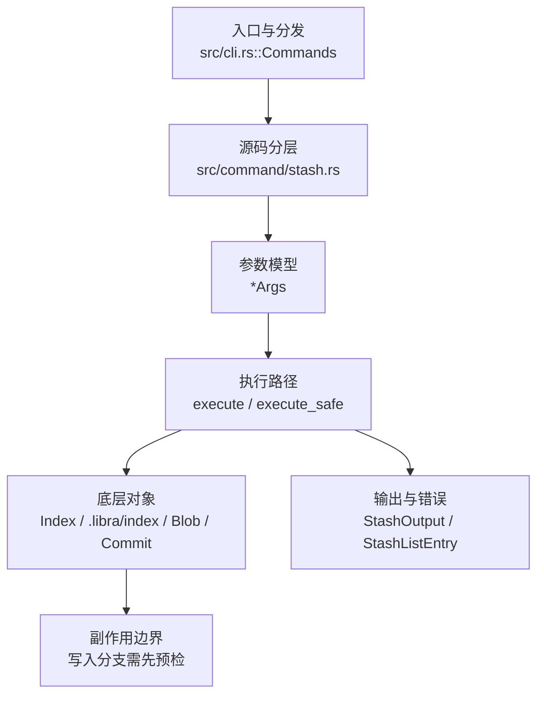

# `libra stash` 开发设计

## 命令实现目标

`libra stash` 的目标是临时保存脏工作区并支持恢复、查看、删除和基于 stash 建分支。实现需要覆盖 push/pop/list/apply/drop/show/branch/clear，其中 `show` 提供文件级摘要（`--name-only` / `--name-status`），`push` 支持 `-u` / `--include-untracked`、`-a` / `--all` 与 `-k` / `--keep-index`（纳入的未跟踪/忽略文件存于第三个 stash parent，并由 `apply` / `pop` 恢复），同时把 patch 级差异（`-p` / `--patch`）以及 create/store 等 plumbing 子命令延后（详见“还未实现的功能”）。

## 对比 Git 与兼容性

- 兼容级别：`partial`。`push` / `pop` / `list` / `apply` / `drop` / `show` / `branch` / `clear` supported; `create` / `store` deferred (see [docs/development/commands/_compatibility.md#d8-stash-create](docs/development/commands/_compatibility.md#d8-stash-create) and [#d9-stash-store](docs/development/commands/_compatibility.md#d9-stash-store))

- 当前矩阵明确仍是部分兼容；未覆盖的 Git surface 必须显式列在“还未实现的功能”。

## 设计方案

- 入口与分发：已公开接入 `src/cli.rs::Commands`；已由 `src/command/mod.rs` 导出。CLI 层在 `src/cli.rs` 把解析后的参数交给命令模块，命令模块负责把领域错误转换为 `CliError` / `CliResult`。
- 源码分层：主要实现文件为 `src/command/stash.rs`。参数/子命令类型包括：源码未暴露独立 `*Args` 类型，参数边界以子命令 enum 或私有 parser 为准；输出、错误或状态类型包括：`StashOutput`、`StashListEntry`、`StashFileChange`、`StashFilesChangedStats`（后两者是嵌入 `StashOutput::Show` 的公开序列化输出类型）；主要执行函数包括：`execute`、`execute_safe`。
- 执行路径：`execute_safe` 负责 CLI 安全包装、错误映射和输出配置；索引路径会加载、比较、刷新或保存 `.libra/index`；对象路径会解析 revision 并读写 blob/tree/commit/tag 等对象；引用路径会读取或更新 SQLite refs、HEAD 与 reflog。

- 流程图：以下流程图按当前源码分层展示主路径和底层对象边界，便于维护者把代码入口、执行函数和副作用范围对应起来。

- 底层操作对象：`Index` / `.libra/index`（暂存区状态、路径条目和刷新/保存边界）；`Blob`（文件内容或 LFS pointer 写入对象库后的 blob 对象）；`Commit`（提交对象、父提交关系和提交消息载荷）；`TreeItem` / `TreeItemMode`（tree 中的路径项和 mode）；`Tree`（由索引或对象遍历生成的目录树对象）；`Branch` / branch store（SQLite refs 上的分支读写、过滤和上游关系）；`Head`（SQLite 中的 HEAD 指向、当前分支和 detached 状态）；`ObjectHash`（SHA-1/SHA-256 对象 ID 和 revision 解析结果）；`ObjectType`（blob/tree/commit/tag 类型分派）；`Signature`（作者/提交者/签名时间等提交身份字段）
- 输出与错误契约：人类输出、`--json` / `--machine` 输出和 quiet/verbose 分支必须继续走现有 `OutputConfig` / `emit_json_data` / `CliError` 路径；新增失败模式要补稳定错误码、用户提示和回归测试。
- 副作用边界：凡是写入索引、对象库、refs/HEAD、reflog、SQLite/D1、工作树或远端的路径，都必须先完成参数校验和 dry-run/预检分支，再执行持久化，避免部分写入后静默成功。

## 实现历史

- 本节依据本地 main 分支提交历史重写，筛选与该命令实现、测试或文档路径直接相关的提交；以下是归纳后的实现脉络。
- 2026-06-06 `99ac8a43`（`feat(stash): add 'stash show -p/--patch' unified diff`）：该提交曾为 `stash show` 引入 `-p` / `--patch` 统一 diff，但该能力已不在当前 HEAD —— `Stash::Show` 枚举只剩 `stash` / `--name-only` / `--name-status`，`run_show` 也只产出文件级摘要，未保留任何 patch 字段（与“还未实现的功能”表一致）。
- 2026-06-12 `57dc1cf8`（`feat(p0-rejection): add -p/--patch flag rejection across add, commit, checkout, restore, reset, rebase, stash`）：该提交的标题列出 stash，但当前 HEAD 的 `Stash` 枚举与 `src/command/stash.rs` 中并不存在任何 `-p` / `--patch` 拒绝逻辑（既无 clap 标志，也无运行期守卫）——就 stash 而言该节点并未扩展可用参数或行为。
- 2026-06-07 `e6fd7f11`（`feat(stash): support untracked and keep-index push`）：功能演进：为 `stash push` 引入 `-u` / `--include-untracked`、`-a` / `--all` 与 `--keep-index`。该提交的内容曾被一次纠缠的 reconcile 误删，于 2026-06-18 针对已分叉的代码重新落地：`Stash::Push` 现含 `include_untracked` / `all` / `keep_index` 字段，纳入的未跟踪/忽略文件写入第三个 stash parent，由 `apply` / `pop` 恢复，`--keep-index` 在 push 后把工作区还原到索引状态。
- 2026-05-31 `30f17a99`（`fix(stash): protect branch from dirty worktree`）：实现修正：protect branch from dirty worktree；该节点把边界行为、错误处理或兼容差异纳入当前实现约束。
- 2026-05-21 `242c6072`（`test(stash): pin StashError stable_code mapping (v0.17.705)`）：测试契约：pin StashError stable_code mapping (v0.17.705)；相关行为已有回归守卫，后续变更需要继续满足。
- 历史结论：当前文档应以这些提交之后的代码、测试和兼容矩阵为准；更早的迁移式文档只保留为背景，不再作为事实来源。

## 当前状态

- 公开状态：已公开；模块状态：已导出。
- 用户文档：`docs/commands/stash.md`。
- Synopsis：`libra stash (push [-m <message>] | pop [<stash>] | list | apply [<stash>] | drop [<stash>] | show [<stash>] [--name-only | --name-status] | branch <branch> [<stash>] | clear [--force])`。
- 公开参数/子命令包括：`push [-m, --message <MESSAGE>] [-u, --include-untracked] [-a, --all] [-k, --keep-index]`、`pop [<stash>]`、`list`、`apply [<stash>]`、`drop [<stash>]`、`show [<stash>] [--name-only] [--name-status]`、`branch <branch> [<stash>]`、`clear [--force]`。

## 还未实现的功能

| 类别 | 未完成项 | 当前处理 |
|---|---|---|
| 兼容矩阵说明 | `push` / `pop` / `list` / `apply` / `drop` / `show` / `branch` / `clear` 支持；`push` 支持 `-m`、`-u` / `--include-untracked`、`-a` / `--all`、`-k` / `--keep-index`；`create` / `store` 延后 (see [docs/development/commands/_compatibility.md#d8-stash-create](docs/development/commands/_compatibility.md#d8-stash-create) and [#d9-stash-store](docs/development/commands/_compatibility.md#d9-stash-store)) | 按当前兼容矩阵保留；实现状态变化时同步 `_compatibility.md` 和测试证据。 |
| 兼容差异项 | Patch 级差异 (stash show) | 原始对照：不支持；相关参数/替代：-p / --patch；当前说明：`stash show` 仅产出文件级摘要（`--name-only` / `--name-status`），不输出统一 diff。 后续实现时需要补对应回归测试并同步兼容矩阵。 |
| 兼容差异项 | Pathspec (部分支持 stash) | 原始对照：不支持；相关参数/替代：-- <pathspec>...；当前说明：不适用。 后续实现时需要补对应回归测试并同步兼容矩阵。 |
| 兼容差异项 | Plumbing create/store | 原始对照：不支持 (延后 — see compatibility/declined.md D8/D9)；相关参数/替代：stash create / stash store；当前说明：不适用。 后续实现时需要补对应回归测试并同步兼容矩阵。 |

## 维护要求

- 改进本命令前，必须先阅读并遵循 [docs/development/commands/_general.md](_general.md)；这是命令设计、实现、测试和文档同步的强制要求。
- 任何行为变更都要先核对实现源码，再同步 `COMPATIBILITY.md`、`docs/commands/<cmd>.md` 和相关测试。
- 新增 Git 兼容参数时必须明确 tier、错误码、JSON/机器输出契约和回归测试。
