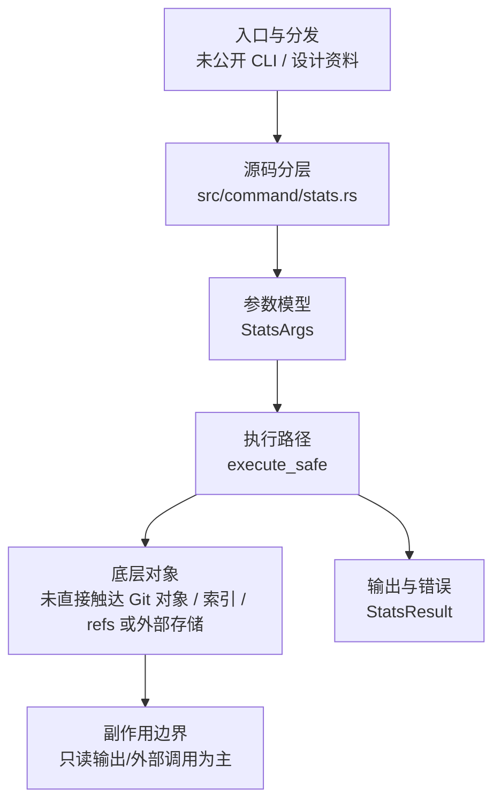

# `libra stats` 开发设计

## 命令实现目标

`libra stats` 的目标是汇总仓库统计信息，为维护和诊断提供对象、引用或工作区级别的只读概览。当前实现资料存在但顶层 CLI 尚未公开接入，后续需要决定是否把它作为稳定用户命令。

## 对比 Git 与兼容性

- 兼容级别：`unpublished`。未进入 COMPATIBILITY.md；以代码接入状态为准。

- 该资料未对应公开 CLI 命令；用户可见状态按未发布处理。

## 设计方案

- 入口与分发：源码资料存在但尚未公开接入 `src/cli.rs::Commands`；当前未由 `src/command/mod.rs` 导出。更准确地说，整个源码树中没有任何 `pub mod stats` 或 `mod stats` 声明（`src/command/mod.rs`、`src/lib.rs` 及其它任何位置都没有），因此 `src/command/stats.rs` 是一个对 Rust 模块系统完全不可见的孤立文件；`cargo check` 之所以仍能干净编译，是因为没有 `mod` 声明引用它的文件不会被纳入编译单元。CLI 层在 `src/cli.rs` 把解析后的参数交给命令模块，命令模块负责把领域错误转换为 `CliError` / `CliResult`。
- 源码分层：主要实现文件为 `src/command/stats.rs`。参数/子命令类型包括：`StatsArgs`；输出、错误或状态类型包括：`StatsResult`；主要执行函数包括：`execute_safe`。
- 执行路径：`execute_safe` 负责 CLI 安全包装、错误映射和输出配置。

- 流程图：以下流程图按当前源码分层展示主路径和底层对象边界，便于维护者把代码入口、执行函数和副作用范围对应起来。

- 底层操作对象：未直接触达 Git 对象、索引、refs 或外部存储；主要副作用集中在 CLI 输出、配置读取或外部进程/浏览器边界。
- 输出与错误契约：人类输出、`--json` 输出和 quiet 分支必须继续走现有 `OutputConfig` / `CliError` 路径；其中 JSON 分支当前直接判断 `output.json_format.is_some()` 并用 `serde_json::to_string_pretty` + `println!` 输出，未调用 `emit_json_data` 辅助函数；新增失败模式要补稳定错误码、用户提示和回归测试。
- 副作用边界：当前实现以读操作、格式化输出或外部服务调用为主；若后续增加写入能力，需要先在设计中补齐持久化对象、回滚语义和测试证据。

## 实现历史

- 本节依据本地 main 分支提交历史重写，筛选与该命令实现、测试或文档路径直接相关的提交；以下是归纳后的实现脉络。
- 2026-06-10 `8483cafd`（`Add stats command (#384)`）：基础实现节点：Add stats command (#384)；当前实现的主要轮廓可追溯到该提交。
- 历史结论：`src/command/stats.rs` 或配套测试/文档已有历史节点，但当前 `src/cli.rs::Commands` 未公开 `stats` 入口；实现历史不改变当前状态章节中的未接入结论。

## 当前状态

- 公开状态：未公开；模块状态：未从 `src/command/mod.rs` 导出，且源码树中无任何 `pub mod stats` / `mod stats` 声明，`src/command/stats.rs` 为对 Rust 模块系统不可见的孤立文件。
- 用户文档：`docs/commands/stats.md`，当前仅作为 unpublished historical design 页面保留，不声明可执行 CLI 合约。
- Synopsis：`libra stats`。
- 公开参数/子命令以用户文档和 CLI help 为准；当前未抽取到独立 Options/Subcommands 小节。

## 还未实现的功能

| 类别 | 未完成项 | 当前处理 |
|---|---|---|
| 模块接入 | 源码树中无任何 `pub mod stats` / `mod stats` 声明，`src/command/stats.rs` 未被任何 `mod` 引用，对 Rust 模块系统完全不可见（不参与编译）。 | 需要先在 `src/command/mod.rs` 增加模块声明并导出 `execute_safe` / `StatsArgs`，否则无法接入 CLI。 |
| 兼容矩阵 | `COMPATIBILITY.md` 尚未登记该命令行。 | 需要决定是否纳入用户可见兼容矩阵和矩阵守卫。 |
| CLI 接入 | `src/cli.rs::Commands` 尚未公开该顶层命令。 | 需要决定接入 CLI、降级为内部设计资料，或移出用户命令文档。 |

## 维护要求

- 改进本命令前，必须先阅读并遵循 [docs/development/commands/_general.md](_general.md)；这是命令设计、实现、测试和文档同步的强制要求。
- 任何行为变更都要先核对实现源码，再同步 `COMPATIBILITY.md`、`docs/commands/<cmd>.md` 和相关测试。
- 新增 Git 兼容参数时必须明确 tier、错误码、JSON/机器输出契约和回归测试。
- 若决定发布该命令，最小闭环是：CLI 变体、`src/command/mod.rs` 导出、dispatch、用户文档、兼容矩阵和测试。
