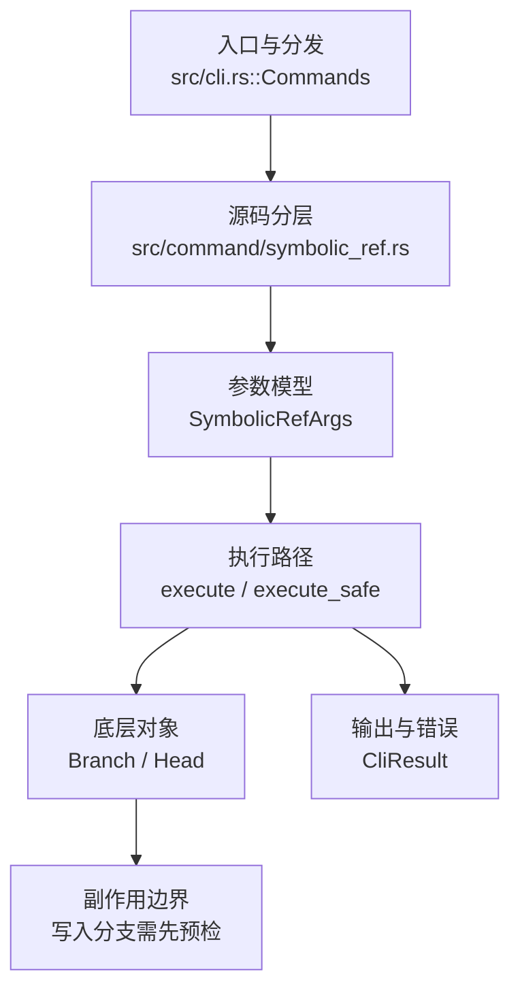

# `libra symbolic-ref` 开发设计

## 命令实现目标

`libra symbolic-ref` 的目标是读取或更新本地 `HEAD` symbolic ref。由于 Libra refs 存储在 SQLite 中，当前实现只支持本地 HEAD，不支持任意 symbolic refs，并需要用明确错误解释这一设计差异。

## 对比 Git 与兼容性

- 兼容级别：`partial`。Supports local `HEAD` only; other symbolic refs are rejected because Libra stores refs in SQLite

- 当前矩阵明确仍是部分兼容；未覆盖的 Git surface 必须显式列在“还未实现的功能”。

## 设计方案

- 入口与分发：已公开接入 `src/cli.rs::Commands`；已由 `src/command/mod.rs` 导出。CLI 层在 `src/cli.rs` 把解析后的参数交给命令模块，命令模块负责把领域错误转换为 `CliError` / `CliResult`。
- 源码分层：主要实现文件为 `src/command/symbolic_ref.rs`。参数/子命令类型包括：`SymbolicRefArgs`；输出、错误或状态类型包括：源码未暴露独立输出/错误类型，错误通过 `CliResult` 或上层命令错误统一传播；主要执行函数包括：`execute`、`execute_safe`。
- 执行路径：`execute_safe` 负责 CLI 安全包装、错误映射和输出配置；引用路径通过 `Head::current_result` 读取、`Head::update_result(Head::Branch(...))` 更新 SQLite 中的 HEAD `reference` 记录，不涉及 reflog。

- 流程图：以下流程图按当前源码分层展示主路径和底层对象边界，便于维护者把代码入口、执行函数和副作用范围对应起来。

- 底层操作对象：`Head`（SQLite 中的 HEAD 指向、当前分支和 detached 状态）；`is_valid_git_branch_name`（`command::branch` 中的分支名校验自由函数）与 `BranchStoreError`（`internal::branch` 的错误枚举，用于映射 HEAD 读写失败）。命令不实例化 `Branch` 结构，也不做分支读写、过滤或上游关系处理。
- 输出与错误契约：人类输出、`--json` / `--machine` 输出和 quiet/verbose 分支必须继续走现有 `OutputConfig` / `emit_json_data` / `CliError` 路径；新增失败模式要补稳定错误码、用户提示和回归测试。
- 副作用边界：凡是写入索引、对象库、refs/HEAD、reflog、SQLite/D1、工作树或远端的路径，都必须先完成参数校验和 dry-run/预检分支，再执行持久化，避免部分写入后静默成功。

## 实现历史

- 本节依据本地 main 分支提交历史重写，筛选与该命令实现、测试或文档路径直接相关的提交；以下是归纳后的实现脉络。
- 2026-05-07 `5e35e112`（`feat(commands): support symbolic-ref (#360)`）：基础实现节点：support symbolic-ref (#360)；当前实现的主要轮廓可追溯到该提交。
- 2026-06-06 `66d34f39`（`feat(symbolic-ref): parse and reject -d/--delete (HEAD-only intentional difference)`）：该提交曾尝试加入 `-d`/`--delete` 解析与拒绝；但当前 main 代码的 `SymbolicRefArgs` 已不含该标志，命令仅暴露 `--quiet`/`--short` 与 `<NAME>`/`<REF>` 两个位置参数，故此节点对当前行为无实际影响。
- 2026-05-08 `19b28be6`（`fix(symbolic-ref): handle repository and quiet errors (#362)`）：实现修正：handle repository and quiet errors (#362)；该节点把边界行为、错误处理或兼容差异纳入当前实现约束。
- 历史结论：当前文档应以这些提交之后的代码、测试和兼容矩阵为准；更早的迁移式文档只保留为背景，不再作为事实来源。

## 当前状态

- 公开状态：已公开；模块状态：已导出。
- 用户文档：`docs/commands/symbolic-ref.md`。
- Synopsis：`libra symbolic-ref [-q | --quiet] [--short] [HEAD [<ref>]]`。
- 公开参数/子命令包括：`-q, --quiet`、`--short`、`<NAME>`（读取/更新的 symbolic ref，当前仅支持 HEAD）、`<REF>`（新的 symbolic 目标，必须为 refs/heads/<branch>）。

## 还未实现的功能

| 类别 | 未完成项 | 当前处理 |
|---|---|---|
| 兼容矩阵说明 | Supports local `HEAD` only; other symbolic refs are rejected because Libra stores refs in SQLite | 按当前兼容矩阵保留；实现状态变化时同步 `_compatibility.md` 和测试证据。 |

## 维护要求

- 改进本命令前，必须先阅读并遵循 [docs/development/commands/_general.md](_general.md)；这是命令设计、实现、测试和文档同步的强制要求。
- 任何行为变更都要先核对实现源码，再同步 `COMPATIBILITY.md`、`docs/commands/<cmd>.md` 和相关测试。
- 新增 Git 兼容参数时必须明确 tier、错误码、JSON/机器输出契约和回归测试。
