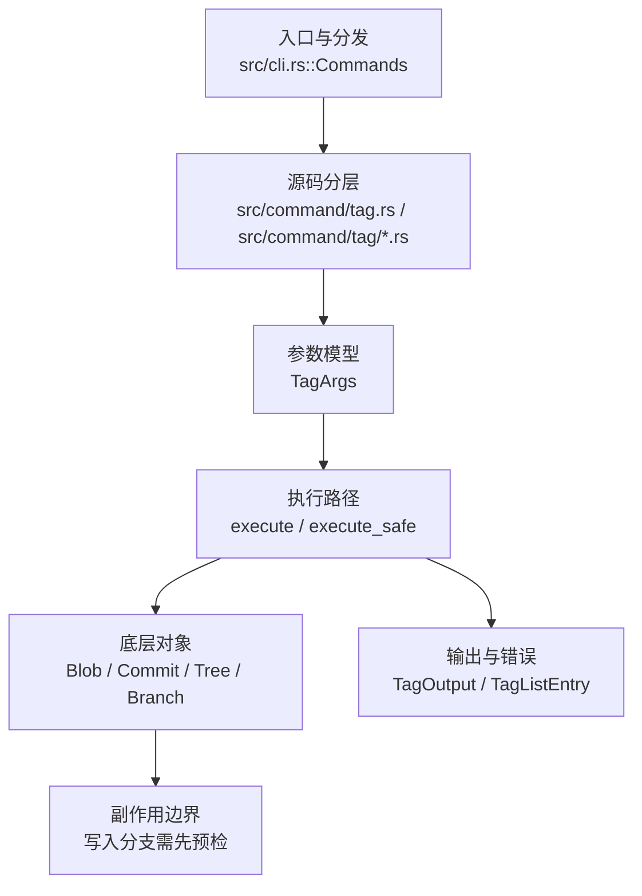

# `libra tag` 开发设计

## 命令实现目标

`libra tag` 的目标是创建、列出、过滤和删除标签。实现需要支持 force、`-n` 展示、annotated tag message 和轻量标签路径，同时把 Git-style `-a` / `--annotate`、`--points-at`、签名与验证等后续能力列为缺口。

## 对比 Git 与兼容性

- 兼容级别：`supported`。

- 当前矩阵承诺常用 Git 行为已支持；新增语义必须同步矩阵、用户文档和测试。

## 设计方案

- 入口与分发：已公开接入 `src/cli.rs::Commands`；已由 `src/command/mod.rs` 导出。CLI 层在 `src/cli.rs` 把解析后的参数交给命令模块，命令模块负责把领域错误转换为 `CliError` / `CliResult`。
- 源码分层：主要实现文件为 `src/command/tag.rs`、`src/command/tag/filters.rs`、`src/command/tag/message.rs`。参数/子命令类型包括：`TagArgs`；输出、错误或状态类型包括：`TagOutput`、`TagListEntry`；主要执行函数包括：`execute`、`execute_safe`。
- 执行路径：`execute_safe` 负责 CLI 安全包装、错误映射和输出配置；对象路径会解析 revision 并读写 blob/tree/commit/tag 等对象；引用路径会读取或更新 SQLite refs、HEAD 与 reflog；网络路径会解析 remote 配置、协商协议并处理 pack/idx 数据；数据库路径会通过 SeaORM/SQLite 或 D1 客户端持久化元数据。

- 流程图：以下流程图按当前源码分层展示主路径和底层对象边界，便于维护者把代码入口、执行函数和副作用范围对应起来。

- 底层操作对象：`Blob`（文件内容或 LFS pointer 写入对象库后的 blob 对象）；`Commit`（提交对象、父提交关系和提交消息载荷）；`Tree`（由索引或对象遍历生成的目录树对象）；`Branch` / branch store（SQLite refs 上的分支读写、过滤和上游关系）；pack / idx 对象（传输包、索引、delta 和完整性校验）；SeaORM / `.libra/libra.db`（配置、refs、reflog、AI/发布元数据等 SQLite 表）；`ObjectHash`（SHA-1/SHA-256 对象 ID 和 revision 解析结果）；`ObjectType`（blob/tree/commit/tag 类型分派）；Vault/libvault（身份、密钥或 vault-backed 签名边界）；`ConfigKv`（配置键值持久化行）
- 输出与错误契约：人类输出、`--json` / `--machine` 输出和 quiet/verbose 分支必须继续走现有 `OutputConfig` / `emit_json_data` / `CliError` 路径；新增失败模式要补稳定错误码、用户提示和回归测试。
- 副作用边界：凡是写入索引、对象库、refs/HEAD、reflog、SQLite/D1、工作树或远端的路径，都必须先完成参数校验和 dry-run/预检分支，再执行持久化，避免部分写入后静默成功。

## 实现历史

- 本节依据本地 main 分支提交历史重写，筛选与该命令实现、测试或文档路径直接相关的提交；以下是归纳后的实现脉络。
- 2025-10-02 `3879a44a`（`feat: add argument -f/--force for tag command`）：基础实现节点：add argument -f/--force for tag command；当前实现的主要轮廓可追溯到该提交。
- 2026-06-07 `8fecc10d`（`feat(tag): add -a/--annotate flag requiring a message (v0.17.1409)`）：历史资料中曾记录 `-a/--annotate`，但当前 `TagArgs` 未公开该 flag；当前事实以源码为准。
- 2026-06-06 `58b0cc16`（`feat(tag): add --points-at list filter (v0.17.1406)`）：历史资料中曾记录 `--points-at`，但当前 `TagArgs` 未公开该 flag；当前事实以源码为准。
- 2026-05-18 `b534c401`（`fix(commit,stash,index-pack,tag): restore Issues URL on internal-invariant paths`）：实现修正：restore Issues URL on internal-invariant paths；该节点把边界行为、错误处理或兼容差异纳入当前实现约束。
- 2026-05-16 `fff9cbb0`（`test(tag): pin Display for 5 static-message TagError variants (v0.17.292)`）：测试契约：pin Display for 5 static-message TagError variants (v0.17.292)；相关行为已有回归守卫，后续变更需要继续满足。
- 历史结论：当前文档应以这些提交之后的代码、测试和兼容矩阵为准；更早的迁移式文档只保留为背景，不再作为事实来源。

## 当前状态

- 公开状态：已公开；模块状态：已导出。
- 用户文档：`docs/commands/tag.md`。
- Synopsis：`libra tag [<name>] [-m <message>] [-f]`。
- 公开参数/子命令包括：`Flag examples`。

## 还未实现的功能

| 类别 | 未完成项 | 当前处理 |
|---|---|---|
| 兼容差异项 | Git-style 显式附注标签 flag | 原始对照：Git 的 annotate flag 加消息创建路径；相关参数/替代：当前 message-based 创建路径已创建 annotated tag，但 `-a` / `--annotate` 未公开。 后续实现时需要补对应回归测试并同步兼容矩阵。 |
| 兼容差异项 | 按对象过滤标签 | 原始对照：git tag --points-at <object>；相关参数/替代：不支持；当前说明：不适用。 后续实现时需要补对应回归测试并同步兼容矩阵。 |
| 兼容差异项 | 签名标签 | 原始对照：git tag -s <name>；相关参数/替代：不支持 (vault-based planned)；当前说明：不适用。 后续实现时需要补对应回归测试并同步兼容矩阵。 |
| 兼容差异项 | 验证标签 | 原始对照：git tag -v <name>；相关参数/替代：不支持 (vault-based planned)；当前说明：不适用。 后续实现时需要补对应回归测试并同步兼容矩阵。 |

## 维护要求

- 改进本命令前，必须先阅读并遵循 [docs/development/commands/_general.md](_general.md)；这是命令设计、实现、测试和文档同步的强制要求。
- 任何行为变更都要先核对实现源码，再同步 `COMPATIBILITY.md`、`docs/commands/<cmd>.md` 和相关测试。
- 新增 Git 兼容参数时必须明确 tier、错误码、JSON/机器输出契约和回归测试。
