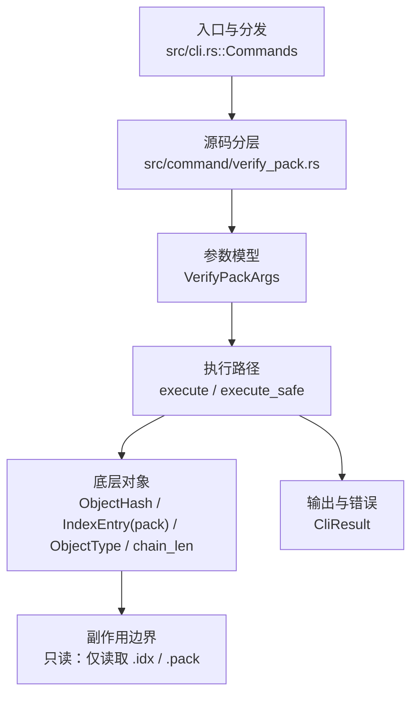

# `libra verify-pack` 开发设计

## 命令实现目标

`libra verify-pack` 的目标是验证 `.idx` 与匹配 `.pack` 的一致性，并输出对象/偏移/校验相关信息。当前实现支持一个或多个 index 验证、单 index 的显式 pack 路径、verbose 对象行、stat-only delta histogram 和与 `fsck` 共享的 pack 完整性检查入口。

## 对比 Git 与兼容性

- 兼容级别：`partial`。validates one or more `.idx` files against matching `.pack` siblings; `-s` / `--stat-only` supported; `--pack` is available for a single explicit pack path

- 当前矩阵明确仍是部分兼容；未覆盖的 Git surface 必须显式列在“还未实现的功能”。

## 设计方案

- 入口与分发：已公开接入 `src/cli.rs::Commands`；已由 `src/command/mod.rs` 导出。CLI 层在 `src/cli.rs` 把解析后的参数交给命令模块，命令模块负责把领域错误转换为 `CliError` / `CliResult`。
- 源码分层：主要入口文件为 `src/command/verify_pack.rs`；idx 解析在 `verify_pack_index.rs` / `verify_pack_index_v2.rs`，pack 解码在 `verify_pack_decode.rs`，输出与统计在 `verify_pack_render.rs`，结构化输出类型在 `verify_pack_types.rs`。参数/子命令类型包括：`VerifyPackArgs`；输出类型包括 `VerifyPackOutput` / `VerifyPackObjectOutput` / `VerifyPackStats`；错误通过 `CliResult` 或上层命令错误统一传播；主要执行函数包括：`execute`、`execute_safe`。
- 执行路径：`execute_safe` 负责 CLI 安全包装、错误映射和输出配置，随后对每个给定 `.idx` 调用 `verify_pack`，再走单结果或批量渲染路径；命令为只读，只读取命令行给定的 `.idx` 与匹配 `.pack`，通过 `Pack::decode` 解码 pack 条目并与解析后的索引比对；`--pack` 与多个 idx 同时出现时返回 `LBR-CLI-002`，避免一个显式 pack 被错误复用到多个 index；`-s/--stat-only` 基于解码条目的 `chain_len` 输出 `non delta:` 与 `chain length = N:` 摘要；不触碰 `.libra/index`，不解析 revision，不读写松散对象，也不走 remote/网络协议路径。

- 流程图：以下流程图按当前源码分层展示主路径和底层对象边界，便于维护者把代码入口、执行函数和副作用范围对应起来。

- 底层操作对象：pack / idx 对象（传输包、索引、delta 和完整性校验）；`ObjectHash`（SHA-1/SHA-256 对象 ID）；`IndexEntry`（pack-index 条目，承载 hash / crc32 / offset，来自 `git_internal::internal::pack::pack_index`，与工作树 `.libra/index` 无关）；`ObjectType`（blob/tree/commit/tag 类型分派）；`Entry::chain_len`（stat-only delta 链统计）
- 输出与错误契约：人类输出、`--json` / `--machine` 输出和 quiet/verbose 分支必须继续走现有 `OutputConfig` / `emit_json_data` / `CliError` 路径；单 idx JSON 保持 `VerifyPackOutput` 原形，多 idx JSON 使用 `{ verified, count, results }` 包装；新增失败模式要补稳定错误码、用户提示和回归测试。
- 副作用边界：凡是写入索引、对象库、refs/HEAD、reflog、SQLite/D1、工作树或远端的路径，都必须先完成参数校验和 dry-run/预检分支，再执行持久化，避免部分写入后静默成功。

## 实现历史

- 本节依据本地 main 分支提交历史重写，筛选与该命令实现、测试或文档路径直接相关的提交；以下是归纳后的实现脉络。
- 2026-06-07 `7d3d9d31`（`feat(fsck): verify pack integrity by reusing verify-pack in-process (v0.17.1407)`）：功能演进：verify pack integrity by reusing verify-pack in-process (v0.17.1407)；该节点扩展了当前命令可用的参数或行为。
- 2026-06-01 `306ee972`（`feat(verify-pack): expose Git -s/--stat-only delta histogram (v0.17.1213)`）：功能演进：expose Git -s/--stat-only delta histogram (v0.17.1213)；当前 `VerifyPackArgs` 保留 `-s`/`--stat-only` 并由回归测试覆盖。
- 2026-05-24 `d7d6212c`（`fix(help): canonical EXAMPLES layout for plumbing trio (fsck/hash-object/verify-pack) (v0.17.918)`）：实现修正：canonical EXAMPLES layout for plumbing trio (fsck/hash-object/verify-pack) (v0.17.918)；该节点把边界行为、错误处理或兼容差异纳入当前实现约束。
- 历史结论：当前文档应以这些提交之后的代码、测试和兼容矩阵为准；更早的迁移式文档只保留为背景，不再作为事实来源。

## 当前状态

- 公开状态：已公开；模块状态：已导出。
- 用户文档：`docs/commands/verify-pack.md`。
- Synopsis：`libra verify-pack [OPTIONS] <IDX_FILE>...`。
- 公开参数/子命令包括：`<IDX_FILE>...`、`--pack <PACK_FILE>`（仅单 idx）、`-v, --verbose`、`-s, --stat-only`。

## 还未实现的功能

| 类别 | 未完成项 | 当前处理 |
|---|---|---|
| 兼容差异项 | 暂无已确认的 Git `verify-pack` 参数级缺口 | 继续保持 `partial` tier，因为 Libra 仍保留 `--json` / `--machine` 扩展和 `--pack` 单 idx 显式路径；后续若发现 Git surface 差异，必须在本表、用户文档和测试中同步。 |

## 维护要求

- 改进本命令前，必须先阅读并遵循 [docs/development/commands/_general.md](_general.md)；这是命令设计、实现、测试和文档同步的强制要求。
- 任何行为变更都要先核对实现源码，再同步 `COMPATIBILITY.md`、`docs/commands/<cmd>.md` 和相关测试。
- 新增 Git 兼容参数时必须明确 tier、错误码、JSON/机器输出契约和回归测试。
