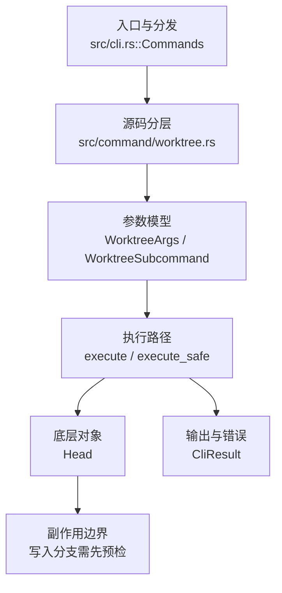

# `libra worktree` 开发设计

## 命令实现目标

`libra worktree` 的目标是管理同一仓库状态的附加工作目录。实现需要明确 Libra worktree 与 Git 不同：多个 worktree 共享同一个 `.libra` 数据库、HEAD、refs 和索引；remove 默认保留磁盘目录，只有 `--delete-dir` 执行 Git 风格删除。

## 对比 Git 与兼容性

- 兼容级别：`intentionally-different`。`remove` keeps disk dir by default (no implicit data loss). Use `--delete-dir` for Git-style behavior; the flag refuses on a dirty worktree

- 该命令或行为属于 Libra 扩展/有意差异；重点是清晰边界、结构化输出和可测试错误，而不是 Git 完全同形。

## 设计方案

- 入口与分发：已公开接入 `src/cli.rs::Commands`；已由 `src/command/mod.rs` 导出。CLI 层在 `src/cli.rs` 把解析后的参数交给命令模块，命令模块负责把领域错误转换为 `CliError` / `CliResult`。
- 源码分层：主要实现文件为 `src/command/worktree.rs`。参数/子命令类型包括：`WorktreeArgs`、`WorktreeSubcommand`；输出、错误或状态类型包括：`WorktreeError` 枚举与 `WorktreeResult<T>` 别名，以及输出结构 `WorktreeListOutput`、`WorktreeAddOutput`、`WorktreeLockOutput`、`WorktreeUnlockOutput`、`WorktreeMoveOutput`、`WorktreePruneOutput`、`WorktreeRemoveOutput`、`WorktreeRepairOutput`、`WorktreeUmountOutput`（均为 crate 私有）；主要执行函数包括：`execute`、`execute_safe`。
- 源码意图：源码模块注释说明该命令管理 linked worktree 元数据和文件系统布局，并保护 main worktree 的安全不变量。
- 执行路径：`execute_safe` 负责 CLI 安全包装、错误映射和输出配置；引用路径会读取或更新 SQLite refs、HEAD 与 reflog；工作树路径会显式处理目录、注册表和删除/保留语义。

- 流程图：以下流程图按当前源码分层展示主路径和底层对象边界，便于维护者把代码入口、执行函数和副作用范围对应起来。

- 底层操作对象：worktree registry / filesystem layout（附加工作区登记、路径和删除边界）；`Head`（SQLite 中的 HEAD 指向、当前分支和 detached 状态）
- 输出与错误契约：人类输出、`--json` / `--machine` 输出和 quiet/verbose 分支必须继续走现有 `OutputConfig` / `emit_json_data` / `CliError` 路径；新增失败模式要补稳定错误码、用户提示和回归测试。
- 副作用边界：凡是写入索引、对象库、refs/HEAD、reflog、SQLite/D1、工作树或远端的路径，都必须先完成参数校验和 dry-run/预检分支，再执行持久化，避免部分写入后静默成功。

## 实现历史

- 本节依据本地 main 分支提交历史重写，筛选与该命令实现、测试或文档路径直接相关的提交；以下是归纳后的实现脉络。
- 2026-02-16 `e9d4d3b1`（`feat(worktree): document and wire worktree subcommand (#206)`）：基础实现节点：document and wire worktree subcommand (#206)；当前实现的主要轮廓可追溯到该提交。
- 2026-06-07 `14be6a89`（`feat(worktree): add prune --dry-run (registry-preserving preview, v0.17.1408)`）：该提交尝试为 `prune` 增加 `--dry-run` 预览；当前 HEAD 的 `WorktreeSubcommand::Prune` 仍无该参数、`prune_worktrees()` 也无 dry-run 分支，故该参数尚未进入当前代码事实面。
- 2026-05-15 `6f649767`（`feat(worktree): structure umount output`）：功能演进：structure umount output；该节点扩展了当前命令可用的参数或行为。
- 2026-05-24 `38edd4c9`（`fix(docs): align worktree Alias line with the other 12 aliased command docs (v0.17.932)`）：实现修正：align worktree Alias line with the other 12 aliased command docs (v0.17.932)；该节点把边界行为、错误处理或兼容差异纳入当前实现约束。
- 2026-05-31 `0ba844ee`（`docs(worktree): add zh-CN command docs and harden fuse worktrees`）：文档与兼容口径：add zh-CN command docs and harden fuse worktrees；当前文档按该节点之后的实现状态校准。
- 历史结论：当前文档应以这些提交之后的代码、测试和兼容矩阵为准；更早的迁移式文档只保留为背景，不再作为事实来源。

## 当前状态

- 公开状态：已公开；模块状态：已导出。
- 用户文档：`docs/commands/worktree.md`。
- Synopsis：`libra worktree <subcommand>`（`add | list | lock | unlock | move | prune | remove | umount | repair`）。
- 公开参数/子命令包括：`add <path>`、`list`、`lock <path> [--reason <TEXT>]`、`unlock <path>`、`move <src> <dest>`、`prune`、`remove <path> [--delete-dir]`、`umount <path> [--cleanup]`（Unix，别名 `unmount`）、`repair`。
- 在 `worktree-fuse` 特性下（`src/command/worktree-fuse.rs`），`add` 子命令额外提供：`-f`/`--fuse`、`--branch <BRANCH>`、`-b`/`--create-branch <CREATE_BRANCH>`、`--from <FROM>`、`--privileged`、`--allow-other`。

## 还未实现的功能

| 类别 | 未完成项 | 当前处理 |
|---|---|---|
| 兼容矩阵说明 | `remove` keeps disk dir by default (no implicit data loss). Use `--delete-dir` for Git-style behavior; the flag refuses on a dirty worktree | 按当前兼容矩阵保留；实现状态变化时同步 `_compatibility.md` 和测试证据。 |
| 兼容差异项 | 创建 detached 工作树 | 原始对照：不支持；相关参数/替代：worktree add --detach <path> <commit>；当前说明：不适用。 后续实现时需要补对应回归测试并同步兼容矩阵。 |
| 兼容差异项 | 每 worktree 独立分支 | 原始对照：不支持；相关参数/替代：Automatic (new branch or existing)；当前说明：Automatic (new working copy commit)。 后续实现时需要补对应回归测试并同步兼容矩阵。 |

## 维护要求

- 改进本命令前，必须先阅读并遵循 [docs/development/commands/_general.md](_general.md)；这是命令设计、实现、测试和文档同步的强制要求。
- 任何行为变更都要先核对实现源码，再同步 `COMPATIBILITY.md`、`docs/commands/<cmd>.md` 和相关测试。
- 新增 Git 兼容参数时必须明确 tier、错误码、JSON/机器输出契约和回归测试。
