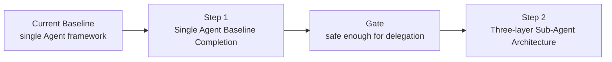
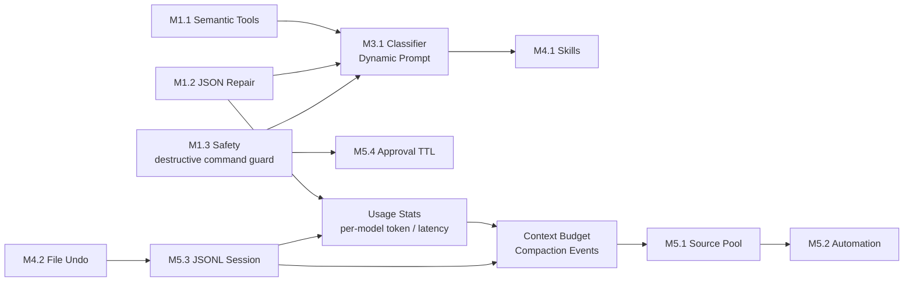
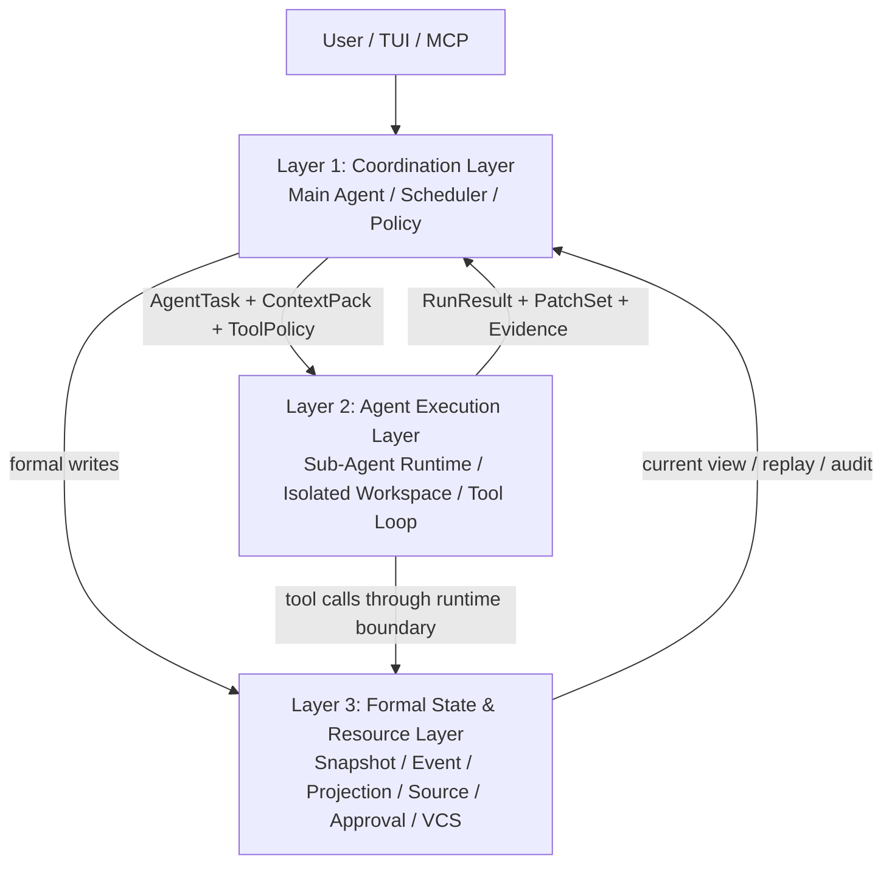

# Agent 子系统改进详细计划

## Context

本文承接 [README.md](README.md) 中的命令改进总览和 [code.md](code.md) 中的 `libra code` Phase Workflow / Snapshot / Event / Projection 设计，专门跟踪 AI Agent 子系统的两步演进计划。

目标是先把当前单 Agent 模式补齐为可靠基线，再在第二步引入 sub-agent 能力。两步之间的边界必须清晰：**第一步不做 sub-agent 并行；第二步不绕过第一步的安全、语义、JSON 容错和状态记录基线。**

### 导航

- [当前单 Agent 基线情况](#当前单-agent-基线情况)
  - [代码基线实现锚点](#代码基线实现锚点)
- [Step 1：单 Agent 基线补齐](#step-1单-agent-基线补齐)
  - [Codex 执行手册](#codex-执行手册)
  - Step 1.0 当前基线收口与测试保护
  - Step 1.1 安全底线优先
  - Step 1.2 LLM JSON repair
  - Step 1.3 代码语义工具集
  - Step 1.4 任务分类器 + 动态系统提示
  - Step 1.5 文件级 Undo
  - Step 1.6 Approval TTL 与细粒度记忆
  - Step 1.7 Skill 系统
  - Step 1.8 JSONL Session 存储
  - Step 1.9 Context Budget 与 Compaction 最小闭环
  - Step 1.10 Source Pool 与 Automation
  - Step 1.11 模型用量与耗时统计
- [Codex 执行手册](#codex-执行手册)
- [Claude Code 执行适配](#claude-code-执行适配)
- [Step 2：三层 Sub-Agent 架构](#step-2三层-sub-agent-架构)
  - Step 2 架构基线
  - Step 2.1 Contracts & Storage
  - Step 2.2 Isolated Workspace & Tool Boundary
  - Step 2.3 Single Sub-Agent Behind Flag
  - Step 2.4 Controlled Parallel Execution
  - Step 2.5 Merge, Review & Validation
  - Step 2.6 UI / MCP Observability
  - Step 2.7 Capability Package / Plugin Trust
  - Step 2.8 Evidence → Memory Distillation 接入点
- [Step 2 之后的 Harness 维度扩展（Step 3 候选）](#step-2-之后的-harness-维度扩展step-3-候选)
- [总时间线建议](#总时间线建议)
- [端到端验证场景](#端到端验证场景)
- [测试策略](#测试策略)
- [风险与缓解](#风险与缓解)
- [Changelog](#changelog)

### 编号约定

| 编号 | 含义 |
|------|------|
| `Step 1.x` / `Step 2.x` | 本文的 Agent 子系统交付顺序。 |
| `M1.1` / `M1.2` / `M3.1` 等 | 来自此前 AtomCode / Craft Agents 对比计划的 milestone 编号，只用于追踪来源，不代表代码运行时 phase。 |
| `code.md Workflow Phase 0-4` | `libra code` 运行时状态机：Intent、Planning、Execution、Validation、Decision。 |
| `code.md Implementation Phase 0-5` | [code.md](code.md) 的重构交付顺序，不等于运行时状态机，也不等于本文 Step 编号。 |
| `Snapshot[S]` / `Event[E]` / `Projection` | 沿用 [code.md](code.md) 的正式状态层边界。 |

### 里程碑索引

本文后续引用时优先使用 `Step X.Y`。`M*` 编号只保留为此前对比计划的来源索引，任何 PR、测试报告和排期沟通都必须同时写明对应 `Step`，避免出现“实现 M1.1 但不知道落在哪一节”的歧义。

| Step | 内部编号 | 主题 | 状态 |
|------|----------|------|------|
| Step 1.0 | — | 当前单 Agent 基线收口与测试保护 | 进行中 |
| Step 1.0.5 | — | `AuditSink` trait + 顶级 `Snapshot` / `Event` 抽象冻结（CEX-00.5）| 未开始（新增，revised 2026-05-01） |
| Step 1.1 | M1.3 | 安全权限门、shell / Libra VCS 安全边界 | 未开始（revised 2026-05-01：估时 2-3w → 3-4w，因 tree-sitter-bash AST 与 `run_libra_vcs` 参数级 dispatch 实为 from-scratch） |
| Step 1.2 | M1.2 | LLM JSON repair | 未开始 |
| Step 1.3 | M1.1 | Rust-first 代码语义工具集 | 未开始 |
| Step 1.4 | M3.1 | 任务分类器 + 动态系统提示 | 未开始 |
| Step 1.5 | M4.2 | 文件级 Undo | 未开始 |
| Step 1.6 | M5.4 | Approval TTL 与细粒度记忆 | 未开始 |
| Step 1.7 | M4.1 | Markdown Skill 系统 | 未开始 |
| Step 1.8 | M5.3 | JSONL Session 存储 | 未开始 |
| Step 1.0.10 | — | sea-orm schema migration runner（CEX-12.5） | 未开始（新增，revised 2026-05-01） |
| Step 1.9 | — | Context Budget、Memory Anchor、Compaction 最小闭环 | 未开始（revised 2026-05-01：拆为 CEX-13a / 13b / 13c，估时 1.5-2w → 3-4w） |
| Step 1.10 | M5.1 / M5.2 | Source Pool 与 Automation | 未开始（revised 2026-05-01：估时 3-4w → 5-6w） |
| Step 1.11 | — | 模型用量与耗时统计（SQLite 聚合，按 provider / model 区分） | 未开始 |
| Step 2.1 - 2.7 | — | 三层 Sub-Agent 架构 | 方案阶段 |

### 术语速览

| 术语 | 本文含义 |
|------|----------|
| blast radius | 一次工具调用或配置变更可能影响的范围，例如当前文件、整个 workspace、远端仓库或系统配置。 |
| Unicode confusable | 外观看起来像普通字符、但 code point 不同的 Unicode 字符，可能用于绕过命令匹配或人工审查。 |
| sparse materialization | 只把 `AgentContextPack` 声明的路径物化到隔离 workspace，而不是复制整个仓库。 |
| MCP supply-chain | 第三方 MCP server / tool / resource 被启用后带来的供应链信任风险。 |
| append-only compaction | 压缩上下文时只追加 compaction event 和 attachment 引用，不重写或删除原始 session 真相源。 |

### 两步总策略

图方向说明：横向表示本文两步演进顺序，不表示运行时调用链。



文字摘要：当前单 Agent 基线先进入 Step 1 补齐，只有通过安全和状态 gate 后，才进入 Step 2 的三层 sub-agent 架构。

| 步骤 | 目标 | 并发策略 | 状态 |
|------|------|----------|------|
| **Step 1** | 按此前方案补齐单 Agent 的代码理解、弱模型兼容、安全底线、意图识别、可恢复编辑和生态基础 | 保持 orchestrator 串行；不启用 sub-agent 并行 | 当前进行中，核心能力大多未落地 |
| **Step 2** | 在 Step 1 基线之上启用 sub-agent，采用三层架构隔离调度、执行和正式状态 | 先单 sub-agent behind flag，再受控并行 | 方案阶段，等待 Step 1 gate |

### 明确暂不做

- Step 1 不启用 sub-agent 并行。
- Step 1 不引入远程 headless server / thin client。
- Step 1 不把 provider transcript 作为系统真相源。
- Step 2 不允许 sub-agent 直接绕过 Runtime 写 Snapshot / Event / Projection。

### 公开分析带来的修订原则

本文只吸收公开分析中的架构经验，不复刻、粘贴或依赖泄露的 proprietary prompt / source 内容。参考材料包括：

| 来源 | 可借鉴结论 | 对本文计划的影响 |
|------|------------|------------------|
| [Varonis: A Look Inside Claude's Leaked AI Coding Agent](https://www.varonis.com/blog/claude-code-leak) | 生产级 coding agent 的安全层不只是 sandbox，还包括 per-tool permission、denial tracking、Unicode / prompt injection 防护和多种 permission mode | Step 1.1 从“命令黑名单”扩展为“权限门 + 输入规范化 + 拒绝记忆 + tool-output 注入防护” |
| [AgenticMarket: Claude Code Source Code Leak](https://agenticmarket.dev/blog/claude-code-leak-mcp-servers) | 工具体系、memory、multi-agent、hooks、MCP server orchestration 会共同形成攻击面；MCP server 与 trusted tool 具有相同 blast radius | Step 1.10 / Step 2.7 增加 Source trust tier、capability manifest、MCP supply-chain 审计 |
| [Palma: What 512K Lines Reveal About MCP](https://palma.ai/blog/claude-code-source-leak-what-it-means-for-mcp) | MCP 需要面向多 agent 并发、session state isolation、event-driven source、agent-aware observability 和 per-agent cost attribution | Step 1.10 的 Source Pool 和 Step 2.4 / 2.6 增加并发、隔离、追踪和成本归因要求 |
| [arXiv: Dive into Claude Code](https://arxiv.org/abs/2604.14228) | coding agent 的核心 loop 很简单，主要工程复杂度在 permission classifier、context compaction、extensibility、subagent worktree isolation、append-oriented session storage | Step 1 增加 context budget / compaction 最小闭环；Step 2 强化 isolated workspace 和 append-only agent event |
| [Claude Code Subagents docs](https://code.claude.com/docs/en/subagents) | subagent 需要独立 context window、明确 description、独立 tool access、模型路由和可管理 UI | Step 2 增加 AgentPermissionProfile、AgentBudget、`/agents` 管理面板和 default-deny tool policy |
| [Claude Code Hooks docs](https://code.claude.com/docs/en/hooks) | PermissionRequest、PreToolUse、SubagentStop 等生命周期事件可用于安全拦截、审计和 verifier agent | Step 1.10 / Step 2.6 增加 SubagentStart / SubagentStop / PermissionRequest 事件和 agent transcript 指针 |
| [Claude Code Skills docs](https://docs.claude.com/en/docs/claude-code/skills) | skill 应采用 progressive disclosure，可声明 allowed tools，并把长参考资料拆成按需加载文件 | Step 1.7 调整 Skill 设计，增加 `allowed-tools`、按需加载、skill scanner 和版本元数据 |
| [arXiv: Measuring the Permission Gate](https://arxiv.org/abs/2604.04978) | 自动权限门在模糊授权、blast radius 不明确的场景中仍会有 false negative，不能只依赖模型分类器 | Step 1.1 / Step 1.6 要求静态规则优先、模糊风险默认升级到人工确认、approval key 必须包含 scope |
| [PandaTalk8: Harness Engineering 维度对比 Claude Code vs OpenClaw](https://x.com/PandaTalk8/status/2048306100882305358) | `Agent = Model + Harness` 公式；Harness 工程 9 维度（架构 / 循环 / 工具 / 指令 / 上下文 / 记忆 / 安全 / 扩展 / 持久化）；纵深型（Claude Code）vs 横向型（OpenClaw）双形态对比；记忆双层（事实日志 + AI 提炼层）+ 渐进式人格学习；hooks 升级为物理拦截而不止 lifecycle 事件源 | Step 2 范围澄清：当前三层 sub-agent 架构属于 Harness 中「Agent Execution」维度（纵深型）；横向型（事件驱动 / Cron / Heartbeat / 跨通道）和 Memory Distillation 归入 Step 3 候选；Step 2.2 加入 PreToolUse / PostToolUse 物理拦截作为 sub-agent permission 第二道屏障；Step 2.8 预留 evidence → memory distillation 接入点 |

---

## 当前单 Agent 基线情况

当前代码已经具备可运行的单 Agent 框架，但还没有达到本文 Step 1 定义的完成态。

### 已落地基础设施

| 能力 | 当前代码状态 | 说明 |
|------|--------------|------|
| Completion Provider 接入 | ✅ 已落地 | Completion provider modules 已包含 Gemini / OpenAI / Anthropic / DeepSeek / Zhipu / Ollama。`CodeProvider::Codex` 是 managed Codex runtime / app-server 路径，不是 `src/internal/ai/providers/` 下的独立 CompletionModel provider。DeepSeek 默认模型为 `deepseek-chat`，使用 `DEEPSEEK_API_KEY` |
| 单 Agent Tool Loop | ✅ 已落地 | `ToolLoopConfig` 已支持 preamble、temperature、thinking、reasoning_effort、stream、hooks、`allowed_tools`、runtime context、repeat warning / abort threshold、`terminal_tools` |
| 工具注册 | ✅ 已落地 | `libra code` 默认注册 `read_file`、`list_dir`、`grep_files`、`search_files`、`web_search`、`apply_patch`、`shell`、plan / IntentSpec 工具和 MCP bridge tools |
| 工具 allow-list | ✅ 已落地 | `allowed_tools` 会同时过滤发给模型的 tool definitions，并在执行期二次拦截 hallucinated tool call |
| 基础 sandbox / approval | ✅ 部分落地 | 已有 `AskForApproval`、`ApprovalStore`、session 级 approval cache、`ApprovedForSession` / `ApprovedForAllCommands` |
| Shell 安全检查 | ⚠️ 名义落地 | `tree-sitter-bash` crate 已 import，但**尚无 parse 调用代码**；read-only command allowlist 与危险命令检测仍以字符串匹配为主，AST 路径属于 Step 1.1 的 from-scratch 工作 |
| 禁止 agent 直接使用 git | ✅ 已落地 | `ShellHandler` 会拒绝 shell 中直接调用 `git`，要求使用 `run_libra_vcs` 或 `libra` 命令 |
| `run_libra_vcs` 命令级 allowlist | ⚠️ 命令级 enum，非参数级 | 当前为枚举式 `status` / `diff` / `branch` / `log` / `show` / `add` / `commit` / `switch`；已有 `normalize_tool_args()` 修正 `status -uall` 等少量参数。**没有参数级黑名单（如 `--force`）和默认拒绝**；Step 1.1 升级为「参数级安全白名单 + 默认 needs-human」是**重写 dispatch 内核**，不是补丁 |
| `AuditSink` / boundary decision 抽象 | ⚠️ 数据结构有，trait 缺 | `hardening.rs` 已有 `PrincipalContext` / `ToolBoundaryPolicy` / `BoundaryDecision` 数据结构；`AuditSink` 作为可注入 trait 尚未定义，多处审计代码各自决定写入位置。Step 1.1 / 1.6 / 1.11 / Step 2 都将依赖该 trait 统一 audit log |
| Provider tool-call 解析失败降级 | ⚠️ 行为不明确 | OpenAI-compat / DeepSeek / Ollama 在 `arguments` 字符串解析失败时**没有公共降级入口**，而非「退化为 raw string」；Step 1.2 需要先抽 provider 公共解析点，否则 7 个 provider 各改一遍 |
| Profile / slash command | ✅ 部分落地 | 已有 `.libra/commands/*.md`、`~/.config/libra/commands/*.md`、`.libra/agents/*.md`、user profiles、embedded profiles。这里的 `.libra/agents` 是 Agent Profile，不是 Step 2 的 sub-agent definition |
| Hooks | ✅ 主体落地 | 已有 `.libra/hooks.json` / user hooks、provider-specific hooks（Claude / Gemini）、lifecycle runtime 和 compaction lifecycle；尚缺 rules / cron / webhook / history 的 automation 层 |
| MCP bridge | ✅ 部分落地 | 已有本地 `LibraMcpServer` 和 `McpBridgeHandler`，包含 `run_libra_vcs` 等工具 |
| Session 存储 | ✅ 基础落地 | 当前为 `.json` blob 全量读写，不是 JSONL append-only |

### 未达到 Step 1 要求的差距

| 改进项 | 当前状态 | 主要缺口 |
|--------|----------|----------|
| 代码语义工具 | ❌ 未落地 | 只有 `tree-sitter` / `tree-sitter-bash`；缺 Rust / TS / JS / Python grammar 和 `list_symbols` / `read_symbol` / `find_references` / `trace_callers` |
| JSON repair | ❌ 未落地 | provider tool-call arguments 解析失败后退化为 raw string，没有 repair retry |
| 破坏性命令黑名单 | ⚠️ 部分落地 | Shell/git 危险检测已有，但缺 OS 级黑名单、Libra 破坏性子命令黑名单、protected branches 配置、`run_libra_vcs` 参数级拦截 |
| 任务分类器 | ❌ 未落地 | 没有 `TaskIntent` 分类器，普通消息不会自动映射到 BugFix / Feature / Question / Review 等 intent |
| 动态系统提示注入 | ❌ 未落地 | `SystemPromptBuilder` 仍以静态 rules/context/extra section 为主，没有 git status、项目结构、规则文件 TTL 缓存注入 |
| Skill 系统 | ❌ 未落地 | 有 commands/profile，但没有 `.libra/skills/*.md`、frontmatter args、模板渲染、`/skill` |
| 文件级 Undo | ❌ 未落地 | `ApplyPatchHandler` 没有编辑前快照、session file history、`/undo` |
| Source Pool | ❌ 未落地 | MCP 连接和外部 REST / local docs 尚未统一为 Source 抽象 |
| Automation | ⚠️ 前置存在 | hooks 可作为 event source，但没有 `.libra/automations.toml`、cron、webhook、history log |
| JSONL session | ❌ 未落地 | 当前 session 是 JSON blob，不支持 append-only、崩溃恢复和附件外部化 |
| Context budget / compaction | ⚠️ 前置存在 | hooks lifecycle 已有 compaction 事件 schema；尚无按 section / tool result / memory 分层的 token budget、`ContextFrame` 重建和可回放 compaction 记录 |
| Approval TTL | ❌ 未落地 | 只有 session 级缓存，没有 TTL、scope、canonical args hash、`/approvals` UI |
| 模型用量统计 | ❌ 未落地 | provider 调用未持久化 token / 耗时 / 估算成本；无法按 `(provider, model)` 聚合，单 Agent 无法回答“今天 deepseek-chat 与 claude-sonnet-4-6 各消耗多少 token / 多少分钟” |
| sea-orm schema migration runner | ❌ 未落地 | `src/internal/db.rs` 没有版本化 migration runner；`sql/sqlite_20260309_init.sql` 只是首次初始化脚本。Step 1.8 (JSONL 链接表)、1.9 (CompactionEvent)、1.10 (automation_log)、1.11 (`agent_usage_stats`) 都需要扩 schema，必须先建统一 migration 管道（见 CEX-12.5），否则 4 处会各自 hack `CREATE TABLE IF NOT EXISTS` |
| 顶级 `Snapshot` / `Event` 抽象 | ❌ 未落地 | `runtime/contracts.rs` 仅有 `MaterializedProjection` / `ProjectionVersions` 等具体类型，没有顶级 `Snapshot` / `Event` trait。Step 1.8 JSONL、1.9 CompactionEvent、1.11 用量记录、Step 2 `AgentRunEvent` 都依赖 append-only 写入语义；不先冻结抽象会导致 4 处重复造轮（见 CEX-00.5） |

### 当前基线风险

| 风险 | 影响 | Step 1 对策 |
|------|------|-------------|
| `run_libra_vcs` 参数只做 allowlisted command + git 参数过滤，缺安全参数白名单和能力降级 | agent 可能通过允许的 Libra 子命令执行高风险状态变更 | 先落 Step 1.1：shell / `libra ...` 走 capability degradation + 黑名单兜底；`run_libra_vcs` 走白名单 + 默认人工确认 / 拒绝；二者共享规范化和审计基础设施 |
| 弱模型 malformed JSON 没有 repair | DeepSeek / Ollama 等 provider 容易因 tool args 不合法导致工具调用失败或降级 | 落 M1.2，所有 provider 解析 tool-call arguments 前统一走 repair retry |
| 没有语义工具 | agent 仍依赖 `read_file` / grep 粗粒度扫描，成本高且容易漏上下文 | 落 M1.1，提供符号级读取和引用追踪 |
| 没有文件级 undo | 用户在未 commit 的脏工作区里缺少轻量回滚能力 | 落 M4.2，`ApplyPatch` 前快照，`/undo` 原子回滚上一轮编辑 |
| 没有上下文预算和压缩记录 | 长 session 中 tool result / rules / memory 会挤占关键上下文，resume 后难以解释模型看到过什么 | 落 Step 1.9，先做 token budget、分层上下文和 append-only compaction event |
| MCP / skill 来源缺少 trust tier | 外部 source、skill、MCP server 一旦被信任，blast radius 接近内置工具 | Step 1.10 增加 capability manifest、trust tier、per-source permissions 和审计 |
| 没有正式 sub-agent 状态边界 | 若现在直接并行，会放大审批、写冲突、上下文污染和审计缺口 | Step 2 必须等 Step 1 gate 后再启用 |
| 缺统一抽象（AuditSink / Snapshot / Event / migration runner） | Step 1.1 / 1.6 / 1.8 / 1.9 / 1.10 / 1.11 / Step 2 各自实现 append-only 写入和 schema 演化，几个 PR 后会出现 4 套并存的“事件流”和“迁移脚本” | 在功能 Step 启动前先冻结抽象：CEX-00.5 (AuditSink + Snapshot/Event)、CEX-12.5 (sea-orm migration runner)；后续所有持久化 / 审计 CEX 复用同一接口 |

### 代码基线实现锚点

下表是 Codex 执行本计划时的代码入口。后续任务卡中的“文件范围”应优先从这里选择；若实现需要越过这些边界，必须在 PR 描述里说明原因。

| 基线模块 | 当前能力 | 计划使用方式 |
|----------|----------|--------------|
| `src/command/code.rs` | `libra code` CLI 参数、provider 选择、默认工具注册、TUI 启动、profile / session 加载入口 | Step 1.0 增加 CLI 行为基线；Step 1.4 接入 intent 分类和 `allowed_tools`；Step 1.7 / 1.10 接入 slash command / source 命令 |
| `src/internal/ai/agent/runtime/tool_loop.rs` | `ToolLoopConfig`、`allowed_tools`、repeat warning / abort、blocked-call abort、observer preflight | Step 1.1 复用重复 blocked action 终止；Step 1.4 复用工具过滤；Step 2 flag-off 回归必须覆盖这里 |
| `src/internal/ai/tools/registry.rs` | 工具注册、dispatch、working_dir 作为 sandbox 真相源、runtime hardening audit、path alias rebase | Step 1.1 安全门最终应收敛到 dispatch / handler preflight；Step 1.3 注册 semantic handlers；Step 2 复用 isolated workspace alias |
| `src/internal/ai/tools/handlers/shell.rs` | shell tool、直接 `git` 调用拒绝、workspace snapshot diff、approval 调用 | Step 1.1 增加 destructive guard、capability profile、workspace mutating 约束 |
| `src/internal/ai/tools/utils.rs` | path boundary、reserved metadata path、`command_invokes_git_version_control()` | Step 1.1 增加命令规范化、OS 级危险命令判定、protected branch helper |
| `src/internal/ai/libra_vcs.rs` | `run_libra_vcs` 的允许命令列表、status 参数规范化和 user-friendly guidance | Step 1.1 从 command-level allowlist 升级为 command + args 级 decision engine |
| `src/internal/ai/tools/handlers/mcp_bridge.rs` | `McpBridgeHandler` 暴露 `LibraMcpServer` tools，`run_libra_vcs` 在这里解析并转发 | Step 1.1 给 `run_libra_vcs` 加参数级 preflight；Step 1.10 迁移为 `McpSource` shim |
| `src/internal/ai/runtime/hardening.rs` | `ToolBoundaryPolicy`、`PrincipalContext`、`AuditSink`、secret redaction、boundary decision | Step 1.1 / 1.6 应优先扩展这里的策略合同，避免在 handler 中散落审批语义 |
| `src/internal/ai/sandbox/` | `AskForApproval`、`ReviewDecision`、session approval cache、shell approval request、Seatbelt policy | Step 1.1 接入 destructive deny；Step 1.6 扩展 TTL / sensitivity / revoke |
| `src/internal/ai/completion/` | provider-neutral `CompletionModel` / `CompletionResponse` / `Message` / `ToolCall` | Step 1.2 新增 `json_repair.rs` 和 provider 解析入口复用函数 |
| `src/internal/ai/providers/openai_compat.rs` | OpenAI-compatible tool call argument string 解析，当前失败时退回 raw string | Step 1.2 的第一批接入口，DeepSeek / OpenAI / Zhipu / Ollama 共享或借鉴这里的 repair helper |
| `src/internal/ai/providers/{deepseek,ollama,openai,zhipu,anthropic,gemini}/completion.rs` | 各 provider request / response 映射和工具调用解析 | Step 1.2 接入 repair；真实 provider 回归只在 release / nightly gate 跑 |
| `src/internal/ai/prompt/` | `SystemPromptBuilder`、rules / context loader、`extra_section` | Step 1.4 / 1.9 增加 intent section、dynamic context、ContextFrame 估算 |
| `src/internal/ai/session/store.rs` | `.json` blob session、atomic write、session file lock / stale lock 清理、legacy metadata backfill | Step 1.8 复用 lock / atomic write 思路实现 JSONL 迁移和并发安全 |
| `src/internal/ai/session/state.rs` | `SessionState` / `SessionMessage`，只保存 user / assistant 文本历史 | Step 1.8 设计 JSONL header / message / attachment schema 时保持旧 state 可迁移 |
| `src/internal/ai/hooks/` | hook config / lifecycle / provider hooks / runtime runner，已有 `Compaction` 事件前置 | Step 1.9 复用 lifecycle 事件，新增 ContextFrame / CompactionEvent 持久化语义；Step 1.10 把 hooks 接入 automation event source |
| `src/internal/ai/completion/`、`src/internal/ai/providers/{...}/completion.rs`、`src/internal/db.rs`、`src/internal/model/`、`sql/sqlite_20260309_init.sql` | provider request / response、token usage 字段、Libra SQLite 初始化与 sea-orm entity；当前未持久化用量数据 | Step 1.11 新增 `agent_usage_stats` 表与 `UsageRecorder`，在 provider 调用前后写入 token / latency / model；与 Step 2 `RunUsage[E]` 共享 `agent_run_id` 字段 |
| `src/internal/ai/intentspec/`、`src/internal/ai/runtime/contracts.rs`、`src/internal/ai/orchestrator/` | IntentSpec、Plan/Task、workflow phase、Scheduler / Runtime contracts | Step 1.4 不重复发明 intent 类型；Step 2 AgentTask 必须引用现有 Task / Evidence / Decision |
| `src/internal/ai/agent/profile/`、`src/internal/ai/commands/` | `.libra/agents/*.md` profile 和 `.libra/commands/*.md` command 已落地，含 embedded defaults | Step 1.7 Skill 系统必须和 command/profile 明确边界，避免把 profile 当 sub-agent definition |
| `src/internal/tui/slash_command.rs`、`src/internal/tui/app.rs`、`src/internal/tui/bottom_pane.rs` | built-in slash command、approval dialog、bottom pane rendering | Step 1.5 / 1.6 / 1.7 / 2.6 的用户交互入口 |
| `tests/helpers/mock_completion_model.rs`、`tests/command/code_test.rs`、`tests/ai_*_test.rs` | provider mock、CLI 参数、runtime / projection / hardening 现有测试基线 | 每个 Codex 任务必须优先添加 focused unit test，再按风险补 integration test |

---

## Step 1：单 Agent 基线补齐

**里程碑**：`libra code` 在单 Agent 串行模式下具备安全底线、弱模型兼容、符号级代码理解、意图识别、动态上下文、轻量恢复能力和可观测的状态记录。

### Step 1 依赖关系

图方向说明：横向箭头表示交付依赖，箭头左侧能力先落地后，右侧能力才能把它当作基线。



文字摘要：安全、JSON repair、语义工具先形成单 Agent 基线；分类器、Undo、JSONL、Context Budget、Source Pool 和 Automation 依次建立在这些基线之上；Usage Stats 在 JSONL 和 provider JSON 解析就绪后接入，反过来为 Context Budget 决策提供历史数据。

### Codex 执行手册

本节把上面的路线图转换成 Codex 可以逐项执行的任务卡。执行规则优先级高于单个 Step 的叙述性说明；如果任务卡与叙述段落冲突，以任务卡的依赖、写入范围和验收为准，并在同一 PR 中修正文档冲突。

**通用执行协议：**
1. 每次只执行一个 `CEX-*` 任务卡；不要把两个任务卡合并到一个 PR。
2. 开工前先读任务卡的 `Read first` 文件和现有测试；不要先写代码。
3. 默认只修改任务卡 `Write set` 中列出的文件；需要越界时先在 PR 描述说明原因，并把新文件补回任务卡或 Changelog。
4. 先写 focused unit test，再写实现；涉及 CLI / session / MCP / TUI 行为时补 integration test。
5. 每个任务完成后至少运行任务卡指定 verification；跨 2-3 个任务后运行一次 Step checkpoint。
6. 不使用真实 provider 凭证作为默认 CI 条件；DeepSeek / Ollama live regression 只作为 nightly / release gate。
7. 遇到当前代码基线与本文描述不一致时，先更新“代码基线实现锚点”和对应任务卡，再继续实现。

**建议给 Codex 的任务提示模板：**

```text
请执行 docs/improvement/agent.md 中的 CEX-XX。
约束：
- 只实现该任务卡，不推进后续任务。
- 默认只修改任务卡 Write set 中的文件。
- 先补测试，再实现。
- 完成后运行任务卡 Verification 中的命令，并在最终回复说明未运行的检查。
```

**Step 1 Codex 任务卡：**

| ID | 目标 | 依赖 | Read first | Write set | Verification | 完成判定 |
|----|------|------|------------|-----------|--------------|----------|
| CEX-00 | 固化当前单 Agent 基线测试 | 无 | `src/command/code.rs`、`src/internal/ai/agent/runtime/tool_loop.rs`、`src/internal/ai/session/store.rs`、`tests/helpers/mock_completion_model.rs` | `tests/command/code_test.rs`、`tests/ai_agent_baseline_test.rs` | `cargo test code_test`；`cargo test ai_agent_baseline` | `allowed_tools`、`git` 拒绝、provider 参数、session resume、basic tool result 都有可重复测试 |
| CEX-00.5 | 冻结 `AuditSink` trait 与顶级 `Snapshot` / `Event` 抽象 | CEX-00 | `src/internal/ai/runtime/hardening.rs`、`src/internal/ai/runtime/contracts.rs`、`src/internal/ai/hooks/lifecycle.rs`、`src/internal/ai/orchestrator/mod.rs`、`src/internal/ai/session/store.rs` | `src/internal/ai/runtime/hardening.rs`、`src/internal/ai/runtime/contracts.rs`、`src/internal/ai/runtime/event.rs`、`src/internal/ai/runtime/snapshot.rs`、`src/internal/ai/runtime/mod.rs`、`tests/ai_runtime_contract_test.rs`、`tests/ai_hardening_contract_test.rs` | `cargo test ai_runtime_contract`；`cargo test ai_hardening_contract`；`cargo test code_test` | `AuditSink` trait 含 `record_decision` / `record_event` / `flush`，可被 `sandbox` / `hardening` / 未来 sub-agent 共享；`Snapshot` / `Event` trait 与 `MaterializedProjection` 兼容；`LifecycleEvent` 实现 `Event`；session store / orchestrator 不破坏既有 API；后续所有持久化 CEX 必须基于这两层 trait |
| CEX-01 | 定义安全决策合同和 fixture corpus | CEX-00 | `src/internal/ai/runtime/hardening.rs`、`src/internal/ai/tools/utils.rs`、`src/internal/ai/libra_vcs.rs` | `src/internal/ai/runtime/hardening.rs`、`src/internal/ai/tools/utils.rs`、`tests/data/ai_safety/`、`tests/ai_command_safety_test.rs` | `cargo test ai_command_safety`；`cargo test ai_hardening_contract` | 有 `SafetyDecision { allow, deny, needs_human }` 等价合同、规则名、原因、blast radius 字段；50 条 fixture 可加载 |
| CEX-02 | `run_libra_vcs` 参数级白名单 / 默认人工确认 | CEX-01 | `src/internal/ai/libra_vcs.rs`、`src/internal/ai/tools/handlers/mcp_bridge.rs`、`tests/mcp_integration_test.rs` | `src/internal/ai/libra_vcs.rs`、`src/internal/ai/tools/handlers/mcp_bridge.rs`、`tests/ai_libra_vcs_safety_test.rs` | `cargo test ai_libra_vcs_safety`；`cargo test mcp_integration` | 只读组合可静默；mutating 可恢复组合返回 approval-required 信号或 user-friendly error；不可恢复组合 deny；未知组合不静默 |
| CEX-03 | Shell destructive guard + capability profile | CEX-01、CEX-02 | `src/internal/ai/tools/handlers/shell.rs`、`src/internal/ai/tools/utils.rs`、`src/internal/ai/sandbox/` | `src/internal/ai/tools/handlers/shell.rs`、`src/internal/ai/tools/utils.rs`、`src/internal/ai/runtime/hardening.rs`、`tests/ai_command_safety_test.rs` | `cargo test ai_command_safety`；`cargo test shell` | OS 危险命令、encoded / quoted bypass、workspace 越界 mutating shell 被拒绝；合法局部清理不误杀 |
| CEX-04 | Provider-neutral JSON repair core | CEX-00 | `src/internal/ai/completion/mod.rs`、`src/internal/ai/completion/message.rs` | `src/internal/ai/completion/json_repair.rs`、`src/internal/ai/completion/mod.rs`、`tests/data/ai_json_repair/`、`tests/ai_json_repair_test.rs` | `cargo test ai_json_repair` | 20+ malformed fixture 修复率达到 gate；不可修复样本返回结构化错误，不 panic |
| CEX-05 | JSON repair 接入 provider tool-call 解析 | CEX-04 | `src/internal/ai/providers/openai_compat.rs`、`src/internal/ai/providers/deepseek/completion.rs`、`src/internal/ai/providers/ollama/completion.rs`、各 provider completion tests | `src/internal/ai/providers/openai_compat.rs`、`src/internal/ai/providers/{deepseek,ollama,openai,zhipu,anthropic,gemini}/completion.rs`、provider 单测 | `cargo test providers`；`cargo test ai_json_repair` | tool-call arguments 解析失败时先 repair 再降级；repair 事件有 `tracing::warn!`，provider mock 覆盖 DeepSeek / Ollama |
| CEX-06 | Rust semantic extractor MVP | CEX-00 | `Cargo.toml`、`src/internal/ai/tools/`、`tests/data/ai_semantic/` | `Cargo.toml`、`src/internal/ai/tools/semantic/{mod.rs,extractor.rs,query/rust.scm}`、`tests/ai_semantic_rust_test.rs` | `cargo test ai_semantic_rust` | Rust `list_symbols` / `read_symbol` 的 extractor 纯函数通过；grammar 失败 fallback 不 panic |
| CEX-07 | Semantic handlers + registry / prompt 引导 | CEX-06 | `src/command/code.rs`、`src/internal/ai/tools/handlers/mod.rs`、`src/internal/ai/tools/registry.rs`、`src/internal/ai/prompt/` | `src/internal/ai/tools/handlers/semantic/`、`src/internal/ai/tools/handlers/mod.rs`、`src/command/code.rs`、`src/internal/ai/prompt/builder.rs`、`tests/ai_semantic_tools_test.rs` | `cargo test ai_semantic_tools`；`cargo test code_test` | `list_symbols` / `read_symbol` / `find_references` / `trace_callers` 注册可用；结果带 confidence / scope / approximate |
| CEX-08 | TaskIntent 分类器合同 | CEX-00、CEX-07 | `src/internal/ai/intentspec/`、`src/internal/ai/runtime/prompt_builders.rs`、`src/internal/ai/agent/profile/router.rs` | `src/internal/ai/agent/classifier.rs`、`src/internal/ai/agent/mod.rs`、`tests/data/classifier_fixtures.jsonl`、`tests/ai_classifier_test.rs` | `cargo test ai_classifier` | enum、prompt、mock model 分类链路可测；显式 `--context` 跳过分类器；不引入 live provider CI |
| CEX-09 | 动态系统提示 + intent tool policy 接入 | CEX-08 | `src/command/code.rs`、`src/internal/ai/prompt/builder.rs`、`src/internal/ai/tools/registry.rs`、`src/internal/ai/agent/runtime/tool_loop.rs` | `src/internal/ai/prompt/dynamic_context.rs`、`src/internal/ai/prompt/mod.rs`、`src/internal/ai/prompt/builder.rs`、`src/command/code.rs`、`src/internal/ai/tools/registry.rs`、`tests/ai_dynamic_prompt_test.rs` | `cargo test ai_dynamic_prompt`；`cargo test code_test` | prompt 含 git status / rules TTL / source trust；Question / Review 下 mutating tools 不可见且执行期不可调用 |
| CEX-10 | 文件级 Undo | CEX-00 | `src/internal/ai/tools/handlers/apply_patch.rs`、`src/internal/ai/session/store.rs`、`src/internal/tui/slash_command.rs`、`src/internal/tui/app.rs` | `src/internal/ai/session/file_history.rs`、`src/internal/ai/tools/handlers/apply_patch.rs`、`src/internal/tui/slash_command.rs`、`src/internal/tui/app.rs`、`tests/ai_file_undo_test.rs` | `cargo test ai_file_undo` | 一轮多文件 patch 前快照；`/undo` 原子回滚；失败不产生半回滚 |
| CEX-11 | Approval TTL store + canonical key | CEX-01、CEX-03 | `src/internal/ai/sandbox/mod.rs`、`src/internal/ai/runtime/hardening.rs`、`src/internal/tui/app.rs`、`src/internal/tui/bottom_pane.rs` | `src/internal/ai/sandbox/mod.rs`、`src/internal/ai/sandbox/command_safety.rs`、`src/internal/tui/app.rs`、`src/internal/tui/bottom_pane.rs`、`tests/ai_approval_ttl_test.rs` | `cargo test ai_approval_ttl`；`cargo test ai_command_safety` | Strict / Directory / Pattern key 生效；撤销生效；黑名单命令不缓存 |
| CEX-12 | JSONL session writer / reader / migration | CEX-00.5 | `src/internal/ai/session/store.rs`、`src/internal/ai/session/state.rs`、`src/internal/ai/runtime/event.rs` | `src/internal/ai/session/jsonl.rs`、`src/internal/ai/session/migration.rs`、`src/internal/ai/session/store.rs`、`tests/ai_session_jsonl_test.rs` | `cargo test ai_session_jsonl`；`cargo test ai_schema_migration` | append-only、truncate recovery、legacy `.json` 并发安全迁移、unknown event skip 均可测；`SessionEvent` 实现 CEX-00.5 的 `Event` trait |
| CEX-12.5 | sea-orm schema migration runner（统一持久化基础） | CEX-00.5 | `src/internal/db.rs`、`sql/sqlite_20260309_init.sql`、`src/internal/model/`、`src/internal/ai/orchestrator/persistence.rs` | `src/internal/db.rs`、`src/internal/db/migration.rs`、`src/internal/model/schema_version.rs`、`sql/migrations/`、`tests/db_migration_test.rs` | `cargo test db_migration`；`cargo test --all` | 提供 `MigrationRunner` 抽象，支持版本号、向上 / 向下迁移、idempotent CREATE；fresh repo 与 existing repo 启动后 schema 完全一致；后续 CEX-13b / CEX-15 / CEX-16 复用同一 runner，不再各自 hack `CREATE TABLE IF NOT EXISTS` |
| CEX-13a | ContextBudget core：分层 token 预算 + provider capability 适配 | CEX-09、CEX-12 | `src/internal/ai/prompt/builder.rs`、`src/internal/ai/runtime/prompt_builders.rs`、`src/internal/ai/hooks/lifecycle.rs` | `src/internal/ai/context_budget/{mod.rs,budget.rs,allocator.rs}`、`src/internal/ai/mod.rs`、`src/internal/ai/prompt/builder.rs`、`tests/ai_context_budget_test.rs` | `cargo test ai_context_budget` | 7 段 token budget（system rules / project memory / MemoryAnchor / recent / tool results / semantic / source）；provider capability 调整；超限时按优先级裁剪，安全规则不可压缩；budget allocation 可单测 |
| CEX-13b | ContextFrame 持久化 + replay | CEX-13a、CEX-12、CEX-12.5 | `src/internal/ai/context_budget/budget.rs`、`src/internal/ai/runtime/prompt_builders.rs`、`src/internal/ai/hooks/lifecycle.rs` | `src/internal/ai/context_budget/{frame.rs,compaction.rs}`、`src/internal/ai/hooks/lifecycle.rs`、`src/internal/ai/session/jsonl.rs`、`tests/ai_context_frame_test.rs` | `cargo test ai_context_frame` | 每轮 prompt 输出 `ContextFrame[E]`，含 source / trust level / token estimate / 裁剪原因；`CompactionEvent[E]` append-only，可 replay；大 tool result attachment 化；删除 projection / cache 后可由 JSONL + attachment 重建 |
| CEX-13c | MemoryAnchor lifecycle：draft / confirm / revoke / supersede | CEX-13b | `src/internal/ai/context_budget/budget.rs`、`src/internal/ai/prompt/builder.rs`、`src/internal/tui/slash_command.rs` | `src/internal/ai/context_budget/memory_anchor.rs`、`src/internal/ai/prompt/builder.rs`、`src/internal/tui/slash_command.rs`、`src/internal/tui/app.rs`、`tests/ai_memory_anchor_test.rs` | `cargo test ai_memory_anchor` | anchor 含 `content` / `source_event_id` / `confidence` / `scope` / `created_by` / `expires_at` / `review_state`；automation 默认只能 draft session scope；`/anchors` 可 list / confirm / revoke；compaction 不丢弃 active anchor；revoke event replay 后生效 |
| CEX-14 | Source Pool MCP shim | CEX-02、CEX-12 | `src/internal/ai/tools/handlers/mcp_bridge.rs`、`src/internal/ai/mcp/`、`src/internal/ai/libra_vcs.rs` | `src/internal/ai/sources/`、`src/internal/ai/tools/handlers/mcp_bridge.rs`、`tests/ai_source_pool_test.rs` | `cargo test ai_source_pool`；`cargo test mcp_integration` | `McpSource` 与旧 bridge 并存；旧工具 schema 兼容；source manifest / trust tier 校验生效 |
| CEX-15 | Automation MVP（hooks event source + history） | CEX-11、CEX-13c、CEX-14、CEX-12.5 | `src/internal/ai/hooks/`、`src/internal/db/migration.rs`、`src/command/mod.rs` | `src/internal/ai/automation/{mod.rs,config.rs,events.rs,scheduler.rs,executor.rs,history.rs}`、`src/internal/ai/mod.rs`、`src/command/automation.rs`、`src/command/mod.rs`、`sql/migrations/`、`tests/ai_automation_test.rs` | `cargo test ai_automation` | TOML rules、cron 模拟、webhook / shell / prompt action、history log 可测；Shell action 复用 Step 1.1 safety；cron 触发的 shell action 命中 CEX-11 Approval TTL，**不绕过** scope / blast radius 检查；`automation_log` 表通过 CEX-12.5 migration 注册 |
| CEX-16 | 模型用量与耗时统计入库（按 provider / model 区分）+ TUI 三层展示（P0） | CEX-05、CEX-09、CEX-12、CEX-12.5 | `src/internal/ai/completion/mod.rs`、`src/internal/ai/providers/{deepseek,openai,anthropic,gemini,zhipu,kimi,ollama}/completion.rs`、`src/internal/db.rs`、`src/internal/db/migration.rs`、`src/internal/model/`、`src/cli.rs`、`src/internal/tui/bottom_pane.rs`、`src/internal/tui/status_indicator.rs`、`src/internal/tui/chatwidget.rs`、`src/internal/tui/history_cell.rs`、`src/internal/tui/app.rs`、`src/internal/tui/app_event.rs`、`src/internal/tui/slash_command.rs` | `sql/migrations/`、`src/internal/model/agent_usage_stats.rs`、`src/internal/model/mod.rs`、`src/internal/ai/usage/{mod.rs,recorder.rs,pricing.rs,query.rs,accumulator.rs}`、`src/internal/ai/mod.rs`、`src/internal/ai/completion/mod.rs`、`src/internal/ai/providers/{deepseek,openai,anthropic,gemini,zhipu,kimi,ollama}/completion.rs`、`src/command/usage.rs`、`src/command/mod.rs`、`src/cli.rs`、`src/internal/tui/usage_widget.rs`、`src/internal/tui/status_indicator.rs`、`src/internal/tui/bottom_pane.rs`、`src/internal/tui/chatwidget.rs`、`src/internal/tui/history_cell.rs`、`src/internal/tui/app.rs`、`src/internal/tui/app_event.rs`、`src/internal/tui/slash_command.rs`、`tests/data/ai_usage/`、`tests/ai_usage_stats_test.rs`、`tests/ai_usage_tui_test.rs` | `cargo test ai_usage_stats`；`cargo test ai_usage_tui`；`cargo test providers`；`cargo test code_test` | (1) `agent_usage_stats` schema 通过 CEX-12.5 migration 落地；7 个 provider 全量提取 `prompt_tokens` / `completion_tokens` / `cached_tokens` / `reasoning_tokens` / `wall_clock_ms`，按 `(provider, model)` 聚合。(2) **TUI 三层展示全部可用**：L1 主聊天面板右上角 header badge（model + session token + wall clock），L2 bottom pane 紧凑 usage 行（last_request + session 合计），L3 `/usage` 弹出详细面板（按 model 拆分 + ESC 关闭）；streaming response 期间 L1 / L2 增量刷新（每 100ms / chunk 节奏）。(3) `libra usage report --by=model` / `/usage` / L1 / L2 / L3 五处数值一致；写入失败、provider 缺 token 字段、model 切换、`hide_cost` / `header=off` / `bottom_pane=off` 配置开关均有 TUI 渲染断言覆盖；`[tui.usage] cost_warn / cost_alert` 阈值切换颜色可断言 |

**Step 1 Checkpoints：**

| Checkpoint | 触发条件 | 必跑验证 | 是否允许进入下一阶段 |
|------------|----------|----------|----------------------|
| CP-1 Safety baseline | CEX-00 到 CEX-03 完成 | `cargo +nightly fmt --all`、`cargo clippy --all-targets --all-features -- -D warnings`、`cargo test ai_command_safety`、`cargo test mcp_integration` | 通过后才能做 approval TTL 和动态 tool policy |
| CP-2 Weak-model baseline | CEX-04 到 CEX-05 完成 | `cargo test ai_json_repair`、provider completion tests、DeepSeek / Ollama mock regression | 通过后才能把分类器接入默认 code path |
| CP-3 Code-understanding baseline | CEX-06 到 CEX-07 完成 | `cargo test ai_semantic_rust`、`cargo test ai_semantic_tools` | 通过后才能要求 Dev preamble 优先使用 semantic tools |
| CP-4 Single-agent gate | CEX-00 / CEX-00.5 / CEX-01 - CEX-12 / CEX-12.5 / CEX-13a / CEX-13b / CEX-13c 完成 | 全量 `cargo test --all` + Step 1 Gate KPI | 通过后才能启动 Step 2 Runtime 任务；Step 2 架构基线任务不受此 gate 阻塞 |
| CP-5 Ecosystem gate | CEX-14 到 CEX-15 完成 | Source / automation tests + docs 更新 | 通过后 Source / automation 可进入 release candidate |
| CP-6 Usage observability gate | CEX-16 完成 | `cargo test ai_usage_stats`；`cargo test ai_usage_tui`；`cargo test providers`；`libra usage report --by=model` 在 fixture session 上输出与 SQLite 聚合结果一致；TUI L1 / L2 / L3 渲染快照测试通过；手动跑 `libra code` 在 streaming session 中观察 token 计数实时增长（截图存档） | 通过后 `libra usage report` / `/usage` / TUI 三层展示可进入 release candidate；为 Step 2 `AgentBudget` / `RunUsage` 提供可信基线 |

**Step 2 架构基线任务卡（现在可执行，不启动 sub-agent runtime）：**

这些任务只冻结架构边界、依赖关系、readiness gate 和验证口径。它们不得创建真正的 sub-agent tool loop，不得修改主执行路径，也不得让 `libra code` 出现新的默认行为。

| ID | 目标 | 依赖 | Write set | Verification | 完成判定 |
|----|------|------|-----------|--------------|----------|
| CEX-S2-00 | 冻结 Step 2 架构基线与不变量 | 无 | `docs/improvement/agent.md` | 文档 review；确认 S2-INV 编号完整 | 明确哪些 Step 2 内容现在可确定、哪些必须等待 CP-4；每条架构约束都有稳定编号 |
| CEX-S2-01 | Step 2 readiness audit | CEX-S2-00 | `docs/improvement/agent.md` | 对照 `src/internal/ai/runtime/contracts.rs`、`src/internal/ai/session/store.rs`、`src/internal/ai/sandbox/mod.rs`、`src/internal/ai/tools/registry.rs` 完成手工核对 | Readiness matrix 标出 Step 1 哪些合同阻塞 runtime 实现，哪些不阻塞架构设计 |
| CEX-S2-02 | Workspace / merge / observability 预研边界 | CEX-S2-00 | `docs/improvement/agent.md` | 对照 `src/command/worktree.rs`、`src/internal/ai/orchestrator/workspace.rs`、`src/internal/tui/app.rs`、`src/internal/ai/projection/scheduler.rs` 完成手工核对 | 记录 worktree、merge candidate、TUI/MCP observability 的现有入口和缺口；不实现 runtime |

**Step 2 Runtime 任务卡（只能在 CP-4 之后启动）：**

| ID | 目标 | 依赖 | Write set | Verification | 完成判定 |
|----|------|------|-----------|--------------|----------|
| CEX-S2-10 | Agent contracts / event schema，不启动 sub-agent | CP-4、CEX-S2-00、CEX-S2-01 | `src/internal/ai/runtime/contracts.rs`、`src/internal/ai/agent_run/`、`tests/ai_subagent_contract_test.rs` | `cargo test ai_subagent_contract`；`cargo test ai_runtime_contract` | AgentTask / AgentRun / AgentPatchSet 引用现有 IntentSpec / Task / Evidence；unknown-event-safe |
| CEX-S2-11 | Isolated workspace abstraction | CEX-S2-10、CEX-S2-02 | `src/internal/ai/orchestrator/workspace.rs`、`src/command/worktree.rs`、`tests/command/worktree_test.rs`、`tests/ai_subagent_workspace_test.rs` | `cargo test ai_subagent_workspace` | worktree / sparse / blocked 策略可测；不全量 copy 大仓库 |
| CEX-S2-12 | Single sub-agent behind flag | CEX-S2-11 | `src/command/code.rs`、`src/internal/ai/agent/runtime/tool_loop.rs`、`src/internal/ai/projection/scheduler.rs`、`tests/ai_subagent_single_test.rs` | `cargo test ai_subagent_single`；`step1-regression` | flag off 完全走 Step 1；flag on `max_sub_agents=1` 可审计、可取消 |
| CEX-S2-13 | Human-gated merge candidate | CEX-S2-12 | `src/internal/ai/runtime/phase3.rs`、`src/internal/ai/runtime/phase4.rs`、`src/internal/tui/app.rs`、`tests/ai_subagent_merge_test.rs` | `cargo test ai_subagent_merge` | 所有 MergeCandidate 默认 `needs-human-review`；用户确认前不 apply 主 worktree |
| CEX-S2-14 | Controlled parallel execution + observability | CEX-S2-13 | `src/internal/ai/projection/scheduler.rs`、`src/internal/tui/app.rs`、`src/internal/ai/tools/handlers/mcp_bridge.rs`、`tests/ai_subagent_parallel_test.rs` | `cargo test ai_subagent_parallel`；`cargo test ai_code_ui_projection` | disjoint scope 可并行；冲突 scope 不覆盖；per-agent cost / trace 可见 |

### Claude Code 执行适配

上文 Codex 执行手册同样适用于 Claude Code（CLI、IDE 扩展、Web 端），但 Claude Code 的工具集、subagent 体系和工作流与 Codex 略有差异。如果使用 Claude Code 执行任务卡，**优先遵守本节规则，再回到 Codex 执行手册的通用约定**。

本节不复制 CEX 任务卡内容，只提供工具映射、执行流程加固、subagent 用法、模型能力分层、UI 验证补充和 Claude Code 专用 prompt 模板。

#### 工具映射

| 操作意图 | Codex 默认工具 | Claude Code 对应 | 备注 |
|----------|---------------|-------------------|------|
| 读取文件 | `read_file` | `Read` | 大文件用 `offset` / `limit` 分段，不要一次读完 |
| 编辑文件 | `apply_patch` | `Edit`（首选）/ `Write`（仅新文件或完整重写） | 多处 small edit 比一次大 Write 更安全 |
| 列目录 | `list_dir` | `Bash ls` 或 `Glob` | 按 glob pattern 找文件优先 `Glob` |
| 搜索代码 | `grep_files` | `Grep`（直接 ripgrep） | 不要 `Bash grep` 模仿 |
| 跨仓库探查 | （无） | `Agent(subagent_type=Explore)` | 见下文「Subagent 使用」 |
| 运行 shell | `shell` | `Bash`（必填 `description`，长任务用 `run_in_background`） | `cargo test` / `cargo build` 长跑必须 background |
| 任务追踪 | （无原生） | `TodoWrite` | 每个 CEX 必须拆 3-7 个 todo |
| 设计先行 | （无原生） | Plan Mode + `ExitPlanMode` | 高风险 CEX 强制使用，见下文 |
| 项目记忆 | `AGENTS.md` 显式读 | `CLAUDE.md` / `AGENTS.md` 自动注入 | 不要在 CEX 中重复 read |

CEX 任务卡 `Verification` 列写的 `cargo test ...` 命令在 Claude Code 中用 `Bash` 工具直接执行即可。

#### 推荐执行流程（每个 CEX 必走）

1. **Preflight（必须，≤ 1 分钟）**
   - `Bash git status`：确认工作区干净；脏工作区**立即停止**并向用户确认是否继续
   - `Bash git log --oneline -10`：确认任务卡 `依赖` 列出的前置 CEX 已 commit
   - `Bash grep -n "CEX-XX" docs/improvement/agent.md`：确认任务卡定义未被修订
2. **Read first 阶段**
   - `Read first` 列出 1-2 个文件 → 直接用 `Read` 顺序读取
   - `Read first` 列出 ≥ 3 个文件，或包含「整个目录」/「所有 provider」等模糊范围 → **必须用 `Agent(subagent_type=Explore)` 并行读取并要求结构化报告**
   - Explore 提示应明确要求：现有结构、可复用的 trait / fn、已有测试模式、命名约定、与本 CEX 相邻的代码风格
3. **Plan Mode 触发条件**
   以下任务卡**强制先进入 Plan Mode**，写计划文件后用 `ExitPlanMode` 请求用户确认：
   - 安全决策类：**CEX-01 / CEX-02 / CEX-03**（错误改动 = 安全门洞）
   - 持久化迁移类：**CEX-12**（JSONL 迁移，破坏现有 session）、**CEX-12.5**（sea-orm migration runner，影响所有后续表）
   - 抽象 / 合同冻结类：**CEX-00.5**（`AuditSink` / `Snapshot` / `Event` trait 一旦冻结，下游所有 CEX 都按此实现）
   - 跨多组件类：**CEX-13a / CEX-13b / CEX-13c**（ContextBudget / ContextFrame / MemoryAnchor 涉及 hooks + runtime + projection + TUI）
   - 影响外部用户类：**CEX-14 / CEX-15**（Source Pool / Automation 改 MCP 与 hooks 兼容性）
   - **CEX-S2-10 至 CEX-S2-14**（所有 Step 2 Runtime 任务）

   中低风险任务卡（CEX-00 / 04 / 06 / 10）可跳过 Plan Mode，直接 TodoWrite 后实现。
4. **TodoWrite 拆分（必须）**
   每个 CEX 拆为 **3 - 7 个 todo item**，固定模板：
   - `读 fixture / 现有测试`
   - `定义类型 / trait / schema`
   - `补 unit test（先于实现）`
   - `主体实现`
   - `补 integration test`（如任务卡涉及 CLI / MCP / TUI）
   - `运行 Verification 命令`
   - `更新 Changelog 行`

   每完成一个 todo **立即** `completed`，不要批量延迟标记。不要在 todo 中混入跨 CEX 的工作。
5. **Test-Driven 实现**
   严格遵守 Codex 执行手册第 4 条：**先 focused unit test，再实现**。任务卡涉及新 trait / 新 enum / 新 schema 时，可主动调用 Claude Code 的 `test-driven-development` skill。
6. **Verification（不可省略）**
   - 至少跑 1 次任务卡 `Verification` 列的 `cargo test`
   - 跨 2-3 个 CEX 后跑 1 次 `Bash cargo +nightly fmt --all && cargo clippy --all-targets --all-features -- -D warnings && cargo test --all`，必须并行用 `run_in_background`
   - **TUI 触达类**（CEX-09 / CEX-10 / CEX-11）：额外用 `Bash` 启动 `libra code --provider <mock>`，触发对应 slash 命令并捕获输出
   - **MCP 触达类**（CEX-02 / CEX-14）：必跑 `cargo test mcp_integration`
7. **Changelog & Commit**
   - 在本文 Changelog 表新增一行：`<日期> | Claude Code | CEX-XX <title> 完成`
   - 再用 Conventional Commit 单独提交：`feat(ai): CEX-XX <title>` 或 `refactor(ai): CEX-XX <title>`
   - **绝不**把多个 CEX 合并到一个 commit；**绝不**用 `--no-verify` 绕过 hook

#### Subagent 使用建议

| Claude Code subagent | 何时使用 | 明确禁止 |
|---------------------|----------|----------|
| `Explore` | CEX `Read first` ≥ 3 文件；需要理解相邻模块结构；查找命名约定 | 不让 Explore 写代码；不让 Explore 跑 `cargo test`（结果污染主上下文） |
| `Plan` | CEX-01 / 12 / 13 / 14 / 15 / S2-10+ 设计阶段，作为 Plan Mode 前置研究 | Plan agent 输出方案后由主 agent 实施；不让 Plan agent 直接 implement |
| `general-purpose` | 不确定文件位置时的探查；多 keyword 搜索 | 不替代 Explore；不在已知文件路径上使用 |

#### 安全与回滚

- 所有 CEX 默认在干净 working tree 起步；实现到一半发现需要新依赖（如 `tree-sitter-rust` crate）未在 `Cargo.toml`，**立即停下** `Bash git stash` 或退回，向用户确认依赖添加是否符合任务边界
- `cargo test` / `cargo clippy` 失败时，**禁止 `--no-verify` 跳过**；必须修复测试或回退实现
- 修改 `src/internal/ai/sandbox/` 或 `src/internal/ai/libra_vcs.rs` 时**额外谨慎**：错误改动 = 安全门绕过，必须 Plan Mode + 100% adversarial fixture 覆盖
- 发现任务卡 `Write set` 不够（需要修改未列出的文件）：**立即停下，先更新任务卡**，再继续实现；不要静默扩大改动范围
- `Bash` 长跑命令（`cargo build` 全量、`cargo test --all`）必须 `run_in_background=true`，禁止 sleep/poll 模式

#### Claude Code 执行任务的 Prompt 模板

替代 Codex 模板，使用以下 Claude Code 优化版本：

```text
请执行 docs/improvement/agent.md 中的 CEX-XX。

约束（按优先级）：
1. 只实现该任务卡，不推进后续任务；越界停下确认
2. Preflight：先 Bash git status / git log 确认依赖 CEX 已完成
3. Read first ≥ 3 文件时用 Agent(subagent_type=Explore) 并行
4. 任务卡标注高风险（见 Claude Code 执行适配 §Plan Mode 触发条件）必须先 Plan Mode + ExitPlanMode
5. TodoWrite 拆 3-7 个子任务，逐项 completed
6. 先补测试，再实现；禁止 --no-verify
7. 长跑 cargo 命令用 run_in_background
8. 完成后运行任务卡 Verification 中的命令
9. 涉及 TUI / MCP 的 CEX 必须额外手动验证
10. 最终回复说明：完成的 todo、运行的命令、未运行的检查、Changelog 已更新

任务卡 ID：CEX-XX
任务卡位置：docs/improvement/agent.md 的 Codex 执行手册节
```

#### CLAUDE.md / AGENTS.md 维护

- CEX-09（动态系统提示）和 CEX-13（MemoryAnchor）会读取 `CLAUDE.md` / `AGENTS.md`；执行这些 CEX 时**先确认**两文件内容最新
- 当 CEX 修改了用户可见行为（新 slash command / 新 config 项 / 新工具），**同步更新项目根 `CLAUDE.md`**，让 Claude Code 在下次 session 自动加载新能力说明
- **不在执行过程中**用 Claude Code 的 memory 系统持久化 CEX 进度（用本文 Changelog 表代替；落到 git 内更可靠、可 review）

#### 模型能力分层

| CEX 范围 | 推荐模型 | 最低模型 | 说明 |
|---------|----------|----------|------|
| CEX-00 / 04 / 06 / 10 | Claude Haiku 4.5 / Sonnet 4.6 | Haiku 4.5 | 范围窄，单文件 / 单 trait 实现 |
| CEX-01 / 02 / 03 / 05 / 07 / 08 / 09 / 11 / 16 | Claude Sonnet 4.6 | Sonnet 4.6 | 跨文件协调、schema 设计 |
| CEX-00.5 / CEX-12.5 | Claude Sonnet 4.6 | Sonnet 4.6 | 抽象 / 迁移合同冻结，影响下游所有持久化 CEX，必须严格控制范围 |
| CEX-12 / 13a / 13b / 13c / 14 / 15 | Claude Opus 4.7 | Sonnet 4.6 | 复杂迁移 / 多组件 / 新生态抽象 |
| CEX-S2-10 至 S2-14 | Claude Opus 4.7（1M context） | Opus 4.7 | sub-agent runtime 涉及并发、隔离边界 |

**强约束**：CEX-01 / 12 / 13 / S2-* 不得用低于推荐模型的版本执行。Haiku 不得跑高风险任务卡。

#### 与 Codex 执行手册的差异点速查

| 项 | Codex 执行手册 | Claude Code 执行适配 |
|----|---------------|---------------------|
| 多文件读取 | 顺序 `read_file` | Explore subagent 并行 |
| 设计先行 | 写在 PR 描述 | Plan Mode + `ExitPlanMode` 写到 `.claude/plans/` |
| 任务追踪 | （依赖 PR / commit） | `TodoWrite` 强制拆分 |
| UI 验证 | （不强制） | TUI / MCP 类必须手动启 `libra code` 验证 |
| 长跑命令 | 默认前台 | 必须 `run_in_background` |
| 项目记忆 | 显式读 `AGENTS.md` | `CLAUDE.md` 自动注入 |
| 失败恢复 | 重新 commit | Plan Mode 重新设计或回退 |

### Step 1.0：当前基线收口与测试保护

**目标**：在开始功能开发前，把当前单 Agent 行为固化成回归基线，避免后续安全和工具变更破坏现有 `libra code`。

**应该完成的功能：**
- 补齐 `libra code --provider deepseek` 的 smoke test / argument validation test。
- 为 `allowed_tools` 的定义过滤和执行期拦截保留回归测试。
- 为 `ShellHandler` 禁止 `git` 的行为保留回归测试。
- 为当前 JSON blob session load/save 保留迁移前基线测试。
- 在 `docs/improvement/agent.md` 维护本计划状态，避免与 `code.md` 的 Phase Workflow 冲突。

**验收：**
- `cargo +nightly fmt --all`
- `cargo clippy --all-targets --all-features -- -D warnings`
- `cargo test --all`
- 新增或确认以下端到端基线测试已存在：
  - `libra code --provider deepseek` 能完成一次只读问答 smoke test；如 CI 不提供真实凭证，则使用 provider mock 固化请求 / 响应合同。
  - `libra code` 中 agent 调用 `read_file`、`list_dir` 后能正常收到 tool result。
  - `libra code` 中 agent 调用 `apply_patch` 后文件确实被修改，且修改可被测试断言。
  - `ShellHandler` 拒绝 `git status`，但 `libra status` / `run_libra_vcs status` 的安全路径可用。
  - 带 `--resume` 的 session 能恢复上一轮对话和已有 tool result。
- 以上测试必须使用 `tempfile::tempdir()` 隔离；涉及共享配置、全局 provider mock 或 session store 的测试标记 `#[serial]`。

### Step 1.1：安全底线优先（M1.3）

**目标**：所有可能执行外部命令或 Libra VCS 状态变更的路径，在 approval 之前先经过不可绕过的安全策略。黑名单只作为兜底，默认策略是能力降级、只读白名单和模糊风险升级人工确认。

**实现现实校准（2026-05-01）**：基线核对显示当前 Shell 安全检查为字符串匹配为主，`tree-sitter-bash` crate 已 import 但**没有 parse 调用代码**；`run_libra_vcs` 的允许命令是**枚举式 enum**（status/diff/branch/log/show/add/commit/switch）+ `normalize_tool_args()` 改写少量参数，**没有参数级黑名单（如 `--force`）和默认拒绝**。因此本步骤的 shell AST 路径是 from-scratch 工作，`run_libra_vcs` 的“升级到参数级安全白名单”实际上是**重写 dispatch 内核**，不是补丁。CEX-01 / CEX-02 / CEX-03 任务卡按 from-scratch 估算。

**应该完成的功能：**
- 新增统一的 `is_destructive_command()` / `reject_destructive_command()`，返回人类可读的拒绝原因、匹配规则名和替代建议。
- 在进入具体规则前执行命令规范化：shell AST / shlex 解析、Unicode confusable / control character 清理、路径归一化、环境变量展开风险标记。**注意：当前没有可复用的 bash AST 调用，必须新建 `tree-sitter-bash` parser wrapper 并配套测试。**
- 引入 shell capability profile：
  - `ReadOnlyShell`：只允许明确只读命令和只读参数组合，可静默执行。
  - `WorkspaceMutatingShell`：只能在项目 workspace / agent workspace 内写入，默认无网络、无 escalated permissions，必须走 approval。
  - `ExternalMutatingShell`：涉及 workspace 外写入、网络发布、系统配置、凭证、设备文件，一律 deny 或人工确认后仍受 sandbox 限制。
- 对 shell metaprogramming 默认保守处理：`eval`、`source`、`bash -c` / `sh -c`、base64 decode 后执行、`xargs sh`、语言运行时 `-c` 执行 shell 等无法静态界定 blast radius 的形式，不进入静默执行路径。
- 覆盖 OS 级危险命令：`rm -rf /`、`rm -rf ~`、`dd if=`、`mkfs`、`shred`、fork bomb、`iptables -F`、`ufw disable`、危险设备重定向、`chmod -R 777 /`、`chown -R`。
- 覆盖 Libra 破坏性子命令：
  - `libra push --force` 到 protected branch
  - `libra reset --hard <ref>`
  - `libra clean -f` / `libra clean -fd`
  - `libra branch -D <protected>`
  - `libra stash clear` / `libra stash drop`
  - `libra reflog expire --expire=now --all`
  - `libra gc --prune=now`
  - `libra tag -d <released>`
  - `libra remote remove origin` / `libra remote set-url`
- protected branches 默认 `main`、`master`、`trunk`、`develop`、`release/*`，允许 `.libra/config.toml` 覆盖。
- Shell path、`libra ...` shell path、`run_libra_vcs` path 共用同一套输入规范化和审计基础设施，但决策引擎分开：
  - 输入规范化层（共用）：shell AST / shlex 解析、Unicode 清理、路径归一化、环境变量展开风险标记。
  - 决策引擎层（独立）：`ShellHandler` / `libra ...` shell path 使用黑名单兜底 + capability degradation；`run_libra_vcs` 使用安全参数白名单 + 默认拒绝 / 人工确认。
  - 审计与日志层（共用）：denial tracking、approval cache 决策、trace / audit event、user-friendly denial reason。
- `run_libra_vcs` 不以“穷举破坏性命令”为主，而是先定义安全参数白名单：
  - 静默允许：`status`、`diff`、`log`、`show`、`show-ref`、`branch --list|--show-current` 等只读组合。
  - 需要 approval：`add`、`commit`、`switch`、非只读 `branch` 等明确有状态变更但可恢复的组合。
  - 直接 deny：protected branch 删除 / force push / hard reset / clean force / reflog expire / gc prune 等不可恢复或 blast radius 过大的组合。
  - 未分类组合默认 `needs-human`，不得静默执行。
- 黑名单命令永不进入 approval cache。
- 增加 denial tracking：同一 turn 内重复尝试相同 blocked action 时注入明确反馈并在达到阈值后终止 tool loop；优先复用现有 `repeat_warning_threshold` / `repeat_abort_threshold` 思路，避免新增平行计数体系。
- 增加 tool-output prompt injection 预检：对来自 repo 文件、MCP、web、tool stdout 的高风险指令片段打标签，进入 prompt 时必须标注为 untrusted data。
- 增加两阶段 permission gate：静态规则先判定 allow / deny / needs-human；仅 allow / needs-human 可进入可选 LLM risk classifier；模糊 scope 或 blast radius 不明确时默认升级到人工确认。

**权限门状态机：**

静态规则是安全边界，LLM risk classifier 只能升级风险，不能降低风险或覆盖静态拒绝。

| 静态规则 | LLM 分类器 | 最终结果 | 说明 |
|----------|------------|----------|------|
| `deny` | 不进入 | `deny` | 黑名单、protected branch、不可恢复破坏操作为绝对禁止，不可被 LLM 覆盖。 |
| `allow` | 未启用 / 不进入 | `allow` | 仅适用于静态规则可证明安全的只读或低风险操作。 |
| `allow` | `safe` | `allow` | 允许静默执行，但仍记录 audit event。 |
| `allow` | `risky` | `needs-human` | LLM 只能把静态 allow 升级为人工确认。 |
| `allow` | `unsafe` / `malicious` | `deny` | 明确风险直接拒绝。 |
| `needs-human` | 未启用 / 不进入 | `needs-human` | 人工确认不可被跳过。 |
| `needs-human` | `safe` | `needs-human` | LLM 不能把人工确认降级为静默 allow。 |
| `needs-human` | `risky` / `unsafe` / `malicious` | `needs-human` 或 `deny` | 默认保持人工确认；若命中不可恢复风险则升级为 deny。 |

**交付优先级：**
- P0：`run_libra_vcs` 安全参数白名单、shell capability profile、workspace 写入约束、黑名单兜底、重复 blocked action 终止。
- P1：Unicode / control character 规范化、tool-output prompt injection 标注、approval scope / blast radius 结构化。
- P2：可选 LLM risk classifier、更多 OS / shell bypass corpus、策略可视化 diagnostics。

**关键文件：**
- `src/internal/ai/tools/utils.rs`
- `src/internal/ai/tools/handlers/shell.rs`
- `src/internal/ai/mcp/resource.rs`
- `src/internal/ai/libra_vcs.rs`
- `tests/ai_command_safety_test.rs`

**验收：**
- 20+ OS 危险命令被拒绝。
- 10+ Libra 破坏性子命令被拒绝。
- 合法局部操作不误杀，例如 `rm -rf ./tmp/generated`、`libra branch -D feat/local-spike`。
- shell quoting / concatenation 绕过用例失败，例如 `"r""m" -rf /`、`libra\ push --force`。
- Unicode confusable、零宽字符、ANSI escape、repo 文件内提示注入样本不会绕过 safety gate。
- 重复 blocked action 会被记录，模型第三次重试同一禁止动作时收到终止性错误。
- `run_libra_vcs` 只有白名单内只读参数组合可静默执行；所有未分类或 mutating 组合必须 approval 或 deny。
- `run_libra_vcs` 传入未在白名单注册的参数组合时，不因为它没有命中 Shell 黑名单就放行；必须进入 `needs-human` 或 `deny`。
- mutating shell 即使通过 approval，也只能在声明 workspace 范围内执行，越界写入被 sandbox 拦截。

### Step 1.2：LLM JSON repair（M1.2）

**目标**：弱模型返回 malformed tool-call arguments 时，agent loop 不因 JSON 小错误中断。

**应该完成的功能：**
- 新增 `src/internal/ai/completion/json_repair.rs`。
- 提供 `repair_json(input: &str) -> Result<Value, RepairError>`。
- 内联实现三轮 repair：
  - trailing comma / 未闭合引号
  - 缺失逗号 / 混合引号
  - `{}` / `[]` 平衡
- OpenAI-compatible、DeepSeek、Ollama、Anthropic、Gemini、Zhipu provider 解析 tool-call arguments 失败时统一 retry repair。
- 每次 repair 通过 `tracing::warn!` 记录 provider、tool name、错误类型、截断原文。

**验收：**
- 20+ malformed 样本修复成功。
- 无法修复时返回带原文片段的 `RepairError`，不 panic。
- DeepSeek / Ollama 回归任务中 malformed tool-call 不再终止 agent loop。

### Step 1.3：代码语义工具集（M1.1）

**目标**：agent 能优先按符号理解代码，而不是靠全文件读取和 grep 拼接上下文。

**应该完成的功能：**
- 首期范围收缩为 **Rust-only MVP**，先验证工具接口、错误模型、fallback 和 prompt 使用习惯：
  - 必做：`tree-sitter-rust`
  - 后续扩展：`tree-sitter-typescript`、`tree-sitter-javascript`、`tree-sitter-python`
- 新增 `src/internal/ai/tools/semantic/`：
  - `mod.rs`：扩展名到 language 的注册表
  - `extractor.rs`：query 驱动的符号 / 引用提取
  - `query/*.scm`：functions / classes / imports
- 新增 4 个 handler：
  - `list_symbols`
  - `read_symbol`
  - `find_references`
  - `trace_callers`
- 默认工具注册路径加入语义工具。
- Dev preamble 中加入“优先用 `list_symbols` / `read_symbol`，避免无目的全文件读取”的规则。
- grammar 失败时 fallback 到 grep，不 panic。
- 明确能力边界：tree-sitter 只提供 AST 级近似理解，不承诺完整跨 crate / 跨语言语义解析；`find_references` 和 `trace_callers` 必须返回 `confidence`、`scope` 和 `approximate` 标记。
- 内置 fallback strategy：
  - 先用语义索引查定义和同文件 / 同模块引用。
  - 跨文件时用受限 `ripgrep` 找候选，再用 tree-sitter 过滤候选上下文。
  - 无法区分定义 / 调用 / 类型引用时返回候选分类和置信度，不伪装成精确答案。
  - 为未来 LSP / LSIF / rust-analyzer backend 预留 trait，但 Rust MVP 不强依赖语言服务器。

**置信度与 scope 定义：**

| 级别 | `approximate` | `confidence` | 判定条件 |
|------|---------------|--------------|----------|
| `Exact` | `false` | `1.0` | 同文件内通过 AST 精确匹配定义、引用和 symbol range。 |
| `SameModule` | `false` | `>= 0.9` | Rust 模块图可确认同模块跨文件关系，例如 `mod` 声明和明确 `use` 路径。 |
| `CrossFileHeuristic` | `true` | `0.5 - 0.9` | `ripgrep` 候选 + tree-sitter 过滤后仍不能完整证明语义绑定。 |
| `Unknown` | `true` | `< 0.5` | 无法区分定义、调用、类型引用或同名 symbol 冲突。 |

`scope` 枚举固定为 `File`、`Module`、`Crate`、`Workspace`、`External`。Rust MVP 只承诺 `File` / `Module` / 部分 `Crate` 级别的结果；`Workspace` / `External` 可以返回候选，但必须标记为近似。

**验收测试示例：**
- `list_symbols` 对 `src/command/code.rs` 返回公开函数签名和行号，结果为 `Exact`。
- `trace_callers` 查找 `CompletionModel::generate` 调用者时，同 crate 内结果可为 `SameModule` 或 `CrossFileHeuristic`，不得返回未标置信度的“精确”结论。
- 两个不同模块中的同名 `fn handle()` 必须分别返回候选，并标记 `approximate=true`、`confidence < 0.8`，除非 AST / 模块路径能证明唯一绑定。

**验收：**
- Rust 基础用例通过，TS / JS / Python 不作为首期 gate。
- 对 `src/command/code.rs` 执行 `list_symbols` 能返回公开函数签名和行号。
- `trace_callers` BFS 深度默认不超过 3。
- 跨文件引用结果标注 `approximate=true` 或置信度；测试覆盖“同名函数 / 同名 method / re-export”导致的模糊场景。
- fallback 到 `ripgrep + tree-sitter filter` 时有 trace 记录，便于后续评估误报率。

### Step 1.4：任务分类器 + 动态系统提示（M3.1）

**目标**：首轮输入自动识别 intent，并按 intent 限制工具、调整 system prompt、注入项目实时上下文。

**应该完成的功能：**
- 新增 `TaskIntent { BugFix, Feature, Question, Refactor, Review, Command }`。
- 新增轻量 `classify(msg, model)`，优先使用同 provider 的小模型；显式 `--context dev/review/research` 时跳过分类器。
- `SystemPromptBuilder` 新增 `with_intent(TaskIntent)`。
- 动态上下文注入：
  - 当前分支、`libra status --short`、未推送 commits 数
  - workspace / pnpm / Cargo workspace / monorepo 检测
  - `CLAUDE.md` / `AGENTS.md` / `.libra/rules/*.md`
  - Libra VCS 能力说明
- 动态上下文 5 min TTL 缓存，固定顺序拼接。
- 动态 prompt 必须输出 context budget 计划：system rules、project memory、recent messages、tool results、semantic snippets 各自占用上限，超限时按优先级裁剪。
- 所有来自文件 / MCP / web / hook 的内容进入 prompt 前都标记 source 和 trust level，避免把 untrusted content 当作系统指令。
- `ToolRegistry::filter_by_intent()`：
  - Question：只读工具 + 语义工具
  - Review：只读工具 + 语义工具，禁 `apply_patch` / mutating shell
  - Command：可使用 shell，但仍受安全黑名单和 approval 约束

**验收：**
- 50 条标注 prompt 分类准确率 >= 85%。
- Question intent 下 `apply_patch` 执行期被 `allowed_tools` 拦截。
- 脏工作区启动后 prompt 含 `libra status --short`。
- 5 min 内重复启动命中 rules 缓存。
- prompt snapshot 中能看到每段动态上下文的 source、trust level 和 token budget。

### Step 1.5：文件级 Undo（M4.2）

**目标**：为未 commit 的 AI 编辑提供轻量回滚能力，降低单 Agent 改动风险。

**应该完成的功能：**
- 新增 `src/internal/ai/session/file_history.rs`。
- `ApplyPatchHandler` 在写入前对 touched files 建立快照。
- 每 session 每文件最多保留 50 个版本。
- 快照存储在 `.libra/sessions/{id}/file_history/{hash}`。
- 新增 `/undo`，回滚上一轮所有 `ApplyPatch` 涉及的文件。
- 若工作区 clean 且已有 Libra commit，提示优先使用 Libra VCS 回滚；`/undo` 聚焦未 commit 脏工作区。

**验收：**
- 一轮编辑 3 个文件后 `/undo` 原子回滚。
- 回滚失败时不产生半回滚状态。
- session 结束后可清理快照。

### Step 1.6：Approval TTL 与细粒度记忆（M5.4）

**目标**：减少重复 approval，同时不削弱安全底线。

**应该完成的功能：**
- `ApprovalMemo { key, decision, expires_at, scope }`。
- `ApprovalKey = hash(tool_name + canonical_args + cwd + sandbox_scope)`。
- shell command canonicalization：按 argv[0] + sorted flags + normalized args 生成 key。
- Approval key 支持敏感度级别，避免“过严导致重复打扰”和“过宽导致误批准”两个极端：
  - `Strict`：argv + flags + 完整 args，适用于首次执行和高风险命令。
  - `Directory`：argv + flags + 父目录，适用于同一目录下的重复构建、清理或测试产物操作。
  - `Pattern`：argv + flags + 用户明确确认的通配模板，适用于项目内重复任务，默认只能是 project scope，不能自动升级到 user scope。
- scope 支持 `session` / `project` / `user`。
- approval key 必须包含作用域和 blast radius：目标路径、protected branch、source slug、network domain、workspace id。任何字段缺失时不得自动复用缓存。
- 对 `allow-all` 增加二次确认和显式风险文案；sub-agent 场景下默认禁用 inherited allow-all。
- 新增 `--approval-ttl <secs>` 和 `.libra/config.toml [approval].ttl_seconds`。
- TUI approval prompt 提供“本次 / 本 session / TTL 内”选项。
- TUI approval prompt 必须把 lifetime 和 key 敏感度分开展示：
  - “仅本次”：`Strict` + current tool call，不写 TTL memo。
  - “本 session 内同一完整命令”：`Strict` + `session` scope。
  - “本 session 内同目录操作”：`Directory` + `session` scope。
  - “本项目内匹配此模板”：`Pattern` + `project` scope，必须展示模板和 blast radius。
- `/approvals` 列出 active memos，支持撤销。
- 黑名单命令永不缓存。

**验收：**
- 同一命令 TTL 内第二次不再弹 approval。
- 撤销后再次请求 approval。
- 黑名单命令无论如何都拒绝且不缓存。

### Step 1.7：Skill 系统（M4.1）

**目标**：把可复用工作流沉淀为项目级和用户级 Markdown skill，而不是散落在 prompt 或 profile 中。

**应该完成的功能：**
- 新增 `.libra/skills/*.md` 和 `~/.config/libra/skills/*.md` 加载。
- frontmatter 使用 TOML schema。
- 正文使用 `handlebars` 模板。
- 支持 `allowed-tools` frontmatter，skill 激活后只能使用声明工具；未声明时不自动继承全部 mutating tools。
- 支持 progressive disclosure：skill 主文件只放触发描述和流程，长参考资料、示例和脚本放在同目录按需加载。
- 支持 skill version / checksum 元数据，便于审计和团队同步。
- 增加 skill scanner：检查危险 shell 片段、外部网络依赖、可疑 credential 读取、过宽 allowed tools。
- 新增 `use_skill` tool 和 `/skill <name>`。
- Profile 可引用 Skill。
- 与现有 commands/profile 规则明确边界：
  - command：用户显式触发的一次 prompt expansion
  - profile：agent persona / tool policy
  - skill：可复用能力片段 + 参数化 prompt / tool chain

**验收：**
- 示例 `pr-description.md` 可用 `/skill pr-description since=HEAD~3` 触发。
- frontmatter 错误有可读报错。
- project skill 覆盖 user skill 时行为可预测。
- read-only skill 无法调用 `apply_patch` / mutating shell。
- 可疑 skill 安装或加载时产生 warning，并可通过 config 设为 hard deny。

### Step 1.8：JSONL Session 存储（M5.3）

**目标**：让单 Agent session 支持 append-only、崩溃恢复和大附件外部化，为 Step 2 多 agent event 写入打基础。

**前置依赖（2026-05-01 修订）**：本步必须在 CEX-00.5 完成后实施。`SessionEvent` / `SessionMessage` 必须实现 CEX-00.5 冻结的 `Event` trait，否则后续 `CompactionEvent`（CEX-13b）、`AgentRunEvent`（Step 2.1）会各自定义一套 append-only 写入语义，造成 4 处重复造轮。CEX-12 任务卡已把依赖从 CEX-00 改为 CEX-00.5。

**应该完成的功能：**
- 新增 `src/internal/ai/session/jsonl.rs`。
- 文件结构：
  - `session.jsonl`：首行 header，后续每行一条消息 / event
  - `attachments/{sha256}`：大 tool result / artifact
- `append_message()` 使用 append-only。
- `read_all()` 跳过最后一行不完整 JSON。
- 旧 `.json` session 首次读取时迁移到 `.jsonl`，迁移前备份。
- 旧 session 迁移必须并发安全：
  - 使用操作系统级文件锁或 atomic lockfile，例如 `.json.migrate.lock`，保证同一 legacy session 只被一个进程迁移。
  - 获取锁失败时等待并重试，默认最多 5 秒；超时后给出“另一 session 正在迁移，请稍后重试”的可读错误。
  - 迁移流程固定为：读取 `.json` -> 写 `.jsonl.tmp` -> flush / fsync -> atomic rename 为 `.jsonl` -> 把旧 `.json` 备份为 `.json.bak.{timestamp}`。
  - 迁移失败时保留原始 `.json`，删除任何部分写入的 `.jsonl.tmp`，不得留下半迁移状态。
- `--resume <thread>` 支持 header + tail N 快速恢复。
- 为 Step 2 预留 `subagents/{agent_id}.jsonl` 目录结构，但 Step 1 不启动 sub-agent。
- schema 兼容：新增 event type 必须按 unknown-event-safe 方式解析；旧客户端读取新 JSONL 时应跳过未知 agent event，不得崩溃。

**验收：**
- 1000 条消息恢复时间 < 原方案 30%。
- 人为 truncate 最后一行时不 panic。
- 旧 session 自动迁移且语义等价。
- 大附件外部化后主 JSONL 体积 <= 原 30%。
- JSONL 中插入未知 future event 时，当前 reader 跳过并记录 warning。

### Step 1.9：Context Budget 与 Compaction 最小闭环

**目标**：不恢复原先被明确排除的“完整鲁棒性 Phase”，但补齐生产 agent 必需的上下文预算、压缩记录和可恢复性边界。

**任务拆分（2026-05-01 修订）**：原 CEX-13 把 ContextBudget / ContextFrame / MemoryAnchor 三个独立特性塞进单卡，估时 1.5-2 周明显低估。本步现拆为：
- **CEX-13a**：ContextBudget core（分层 token 预算 + provider capability 适配）
- **CEX-13b**：ContextFrame 持久化 + replay（依赖 CEX-12.5 sea-orm migration runner）
- **CEX-13c**：MemoryAnchor lifecycle（draft / confirm / revoke / supersede）

三卡可顺序提交，每张 PR 范围单独 review。综合估时 3-4 周。

**应该完成的功能：**
- 复用现有 `hooks/lifecycle.rs` / provider hook 中的 `Compaction` lifecycle 事件作为接入点；新增的是 context budget、ContextFrame、CompactionEvent 持久化和 replay 语义，不重复实现 provider hook 解析。
- 新增 `ContextBudget`：
  - system rules
  - project memory / AGENTS.md / CLAUDE.md
  - recent conversation
  - semantic snippets
  - tool results
  - source / MCP results
- 初始预算分配以 128K context window 为基准，可由 provider capability 覆盖：

  | 类别 | 预算 | 压缩策略 | 优先级 |
  |------|------|----------|--------|
  | system rules / safety policy | 8K | 不可压缩；超限时报错而不是静默裁剪 | P0 |
  | project memory / AGENTS.md / CLAUDE.md / rules | 4K | 超出时按段落和最近确认时间裁剪 | P1 |
  | MemoryAnchor | 4K | 只裁剪低 confidence / expired anchor；active safety anchor 不可裁剪 | P1 |
  | recent conversation | 32K | 保留最近 N 轮原文 | P1 |
  | tool results | 24K | 超限转 attachment，prompt 只保留摘要、hash、读取方式 | P2 |
  | semantic snippets | 16K | 按 symbol 重要性、任务相关性、recency 排序 | P2 |
  | source / MCP results | 剩余预算 | 默认转 attachment 或按 source trust tier 摘要化 | P3 |

  256K 或 1M+ 窗口按比例放大；32K 以下按比例缩小，但 system rules 最低保留 4K，安全策略和 active approval state 不参与压缩。
- 所有 prompt build 输出 `ContextFrame[E]`，记录每段内容的 source、trust level、token estimate、裁剪原因。
- 大 tool result 默认进入 attachment，prompt 中只放摘要、hash、行数、来源和读取方式。
- 实现 deterministic compaction，不使用 LLM summary 作为唯一真相：
  - 最近 N 轮原文保留
  - 旧 tool result 转 attachment 引用
  - 语义片段按 symbol / file / recency 排序
  - dynamic rules 固定顺序拼接
- 引入 `MemoryAnchor`：
  - 类型：user constraint、project invariant、architecture decision、verified finding、long-running TODO。
  - 字段：content、source_event_id、confidence、scope、created_by、expires_at、review_state。
  - 存储：专用 high-priority anchor store / JSONL event，不随普通 compaction 丢弃。
  - 写入策略：agent 可以提出 `MemoryAnchorDraft`；影响项目长期行为或用户偏好的 anchor 需要用户确认后才能提升为 project memory。
  - 回收策略：anchor 有 TTL / superseded_by / manual revoke，避免长期积累错误记忆。
- `MemoryAnchor` 与 [code.md](code.md) 中 `ContextSnapshot` 的边界：
  - `ContextSnapshot` 是 Runtime 层冻结点，用于 replay / determinism，表达“某个时刻工作区和上下文窗口是什么”。
  - `MemoryAnchor` 是应用层语义约束，用于跨 turn / 跨 session 行为塑形，表达“未来仍应遵守或记住什么”。
  - 两者都可以落在 JSONL / Event 基础设施上，但 schema、生命周期和 review 策略不同，不能互相替代。
- `MemoryAnchor` 与 `CLAUDE.md` / `AGENTS.md` / `.libra/rules/*.md` 的关系：
  - `MemoryAnchor` 默认是 Libra session / project 内部记录，不直接改写用户维护的规则文件。
  - 只有用户明确确认“提升为项目规则”时，才生成待审查 patch 或提示用户把内容写入 `AGENTS.md` / `.libra/rules/*.md`。
  - 示例：用户说“本仓库不要用 mock DB 做集成测试”，agent 可创建 `MemoryAnchorDraft(user constraint)`；用户确认后，后续 prompt budget 必须优先加载该 anchor。
- Automation 模式下的 anchor 策略：
  - 由 automation 触发的 session 默认只能创建 `session` scope 的 `MemoryAnchorDraft`。
  - `project` scope anchor 的提升必须进入人工 review；automation 无权自动升级项目长期记忆。
  - `.libra/automations.toml` 可为特定规则显式设置 `allow_auto_anchors = true`，但此类 anchor 必须标记 `source = "automation"`、`confidence = "low"`，并写入 audit log，后续仍可被人工撤销或降级。
- 每次 compaction 追加 `CompactionEvent[E]`，用于 resume 和审计。
- 为未来 LLM-assisted summary 预留接口，但 Step 1 只允许 summary 作为辅助缓存，不能替代原始 JSONL / attachment。

**验收：**
- 长 session 中 prompt 构造不会无界增长。
- 任一 assistant turn 可追溯“模型看到了哪些上下文段”。
- 删除 projection / cache 后可从 JSONL + attachments 重建 context frame。
- compaction 不会吞掉 safety rules、approval state、protected branch 信息。
- 用户在 session 早期设定的关键约束可提升为 `MemoryAnchor`，后续 compaction 后仍会被加载。
- 错误 anchor 可撤销，撤销事件在 replay 后生效。

### Step 1.10：Source Pool 与 Automation（M5.1 / M5.2）

**目标**：在单 Agent 模式下先完成生态抽象，但不引入远程协作或 sub-agent 并发。

**前置依赖（2026-05-01 修订）**：Automation 部分（CEX-15）依赖：
- **CEX-11 Approval TTL**：cron / webhook 触发的 shell action 必须命中 Approval TTL 的 scope / blast radius 检查，**不绕过**人工确认；否则攻击者可通过注入 automation 规则绕过 Step 1.1 安全门。
- **CEX-12.5 sea-orm migration runner**：`automation_log` 等表通过统一 migration 注册，避免与 CEX-13b ContextFrame、CEX-16 用量统计三处各自 hack `CREATE TABLE IF NOT EXISTS`。
- **MCP bridge Phase A→B→C 迁移**：估时由 3-4 周上调到 5-6 周。

**Source Pool 应该完成：**
- 新增 `src/internal/ai/sources/`。
- 抽象 `Source` trait 和 `SourceKind { Mcp, RestApi, LocalDocs }`。
- MCP bridge 迁移为 `McpSource`。
- REST OpenAPI fixture 自动生成 tool spec。
- 工具命名 `{source_slug}__{tool_name}`。
- 每个 source 必须声明 `CapabilityManifest`：
  - tools / resources / prompts
  - filesystem / network / credential access
  - mutating / read-only 分类
  - required approval scope
  - trust tier: builtin / project / user / third-party / untrusted
- 默认不把 third-party MCP source 视为 trusted tool；必须经用户或 project config 显式 enable。
- Source Pool 需要支持多 session 并发和 state isolation：除非 source manifest 声明 shared state，否则 session 间不得共享 mutable state。
- 每次 source tool call 记录 source slug、tool、credential ref、latency、bytes、cost estimate、approval decision。
- `/source list|enable|disable|reload`。

**MCP bridge 迁移路径：**
- Phase A（Step 1.10 初期）：
  - 新增 `McpSource` 实现，建议落在 `src/internal/ai/sources/mcp.rs`。
  - 保留现有 `LibraMcpServer` / `McpBridgeHandler` 注册 API，不做 hard cutover。
  - 旧 `mcp` 配置段自动映射到新的 `sources` 配置视图，加载时打印 deprecation warning，但不改变用户现有行为。
  - 二者共享同一 tool spec 和 handler 适配层，避免 `run_libra_vcs` 出现两套参数校验。
- Phase B（后续 minor release）：
  - 默认注册路径切到 Source Pool；旧 handler 作为 deprecation shim 保留，只转发到 Source Pool。
  - 提供 `libra migrate mcp-config` 命令，将旧 MCP 配置显式迁移到 `.libra/sources/{slug}/config.toml` 或用户级 sources 目录。
- Phase C（Step 2 之后）：
  - 确认 MCP resource、`run_libra_vcs`、hooks / automation 调用和 tests 全部走 Source Pool 后，再移除旧注册路径。
  - 删除前必须有迁移文档和一版 release note，说明旧配置的替代路径。
- 迁移期间工具名和对外 schema 保持兼容；新增 source-prefixed 名称只能作为扩展，不得破坏现有 MCP bridge 用户。

**多 session / 多客户端隔离：**
- Source Pool 进程内可共享连接，但每个 session 必须有独立 capability view、approval scope、credential lease 和 mutable state namespace。
- Web/TUI 多客户端连接同一 thread 时，approval 决策需要绑定 `thread_id + client_id + tool_call_id`，避免另一个客户端误批准。
- automation 触发的 agent run 默认独立 session scope，不继承交互式 session 的 approval memo。

**Automation 应该完成：**
- 新增 `.libra/automations.toml`。
- 统一事件流：hooks lifecycle + VCS events。
- action 支持 Prompt / Webhook / Shell。
- Shell action 复用 Step 1.1 黑名单。
- cron 支持模拟时间测试。
- 执行历史落 `automation_log`。
- lifecycle event 增加 `PermissionRequest`、`SourceEnabled`、`SourceDisabled`、`CompactionCompleted`，为 Step 2 的 `SubagentStart` / `SubagentStop` 预留 schema。

**验收：**
- 两个 session 共享一个 MCP source 连接。
- source hot reload 在下一轮生效。
- third-party source 未启用时不会出现在 tool definitions。
- source manifest 的 mutating tool 没有 approval policy 时加载失败。
- automation 一条失败不影响其他规则。
- `libra automation list / logs` 可见历史。

### Step 1.11：模型用量与耗时统计

**目标**：把每次 provider 调用的 token 消耗、wall clock 耗时、tool call 次数和估算成本持久化到 Libra SQLite 数据库，按 `(provider, model)` 分维度聚合，为 Step 1.4 分类器开销评估、Step 1.9 ContextBudget 决策、Step 1.6 cost-aware approval 提示、Step 2 `AgentBudget` 强制和 `RunUsage[E]` 归因提供唯一聚合真相源。

**为什么放在 Step 1**：单 Agent 阶段就需要回答“今天 deepseek-chat 与 claude-sonnet-4-6 各消耗多少 token / 多少分钟 / 多少美元”，否则进入 Step 2 多 sub-agent 后再做归因会同时叠加“provider 字段缺失”和“跨 agent 归因”两层不确定性。Step 1.11 只解决 provider 调用这一层的可观测性，不替代 Step 2 的 per-agent run-level event。

**应该完成的功能：**

- 新增 SQLite 表 `agent_usage_stats`（schema 写入 `sql/sqlite_20260309_init.sql`，并通过 `sea-orm` 暴露 entity）：

  | 字段 | 类型 | 说明 |
  |------|------|------|
  | `id` | `INTEGER PRIMARY KEY AUTOINCREMENT` | 自增主键 |
  | `session_id` | `TEXT NOT NULL` | Libra session id |
  | `thread_id` | `TEXT` | code.md 中的 canonical thread id，可空以兼容旧 session |
  | `agent_run_id` | `TEXT` | Step 2 sub-agent run id 预留，单 Agent 阶段为 NULL |
  | `provider` | `TEXT NOT NULL` | `gemini` / `openai` / `anthropic` / `deepseek` / `kimi` / `zhipu` / `ollama` |
  | `model` | `TEXT NOT NULL` | 具体模型名（如 `claude-sonnet-4-6`、`deepseek-chat`、`qwen2.5-coder:7b`），不做大小写归一化 |
  | `request_kind` | `TEXT NOT NULL` | `completion` / `tool_call` / `classifier` / `compaction_summary` / `embedding` |
  | `intent` | `TEXT` | Step 1.4 `TaskIntent`，可空 |
  | `prompt_tokens` | `INTEGER NOT NULL DEFAULT 0` | 入参 token |
  | `completion_tokens` | `INTEGER NOT NULL DEFAULT 0` | 输出 token |
  | `cached_tokens` | `INTEGER NOT NULL DEFAULT 0` | provider 报告的命中缓存 token |
  | `reasoning_tokens` | `INTEGER NOT NULL DEFAULT 0` | thinking / reasoning token（如 Anthropic thinking、OpenAI o1） |
  | `total_tokens` | `INTEGER NOT NULL DEFAULT 0` | provider 报告的提交侧 token 总和；客户端必须与 prompt + completion + reasoning 校验，差值通过 `tracing::warn!` 上报 |
  | `tool_call_count` | `INTEGER NOT NULL DEFAULT 0` | 本次响应包含的 tool call 数量 |
  | `wall_clock_ms` | `INTEGER NOT NULL` | 客户端端到端耗时 |
  | `provider_latency_ms` | `INTEGER` | provider 报告的服务端耗时（如有） |
  | `cost_estimate_micro_cents` | `INTEGER` | 按 model price table 估算的成本，单位 1e-6 USD；缺 price 时为 NULL |
  | `usage_estimated` | `INTEGER NOT NULL DEFAULT 0` | 0/1，标记 token 是否由本地 tokenizer 估算 |
  | `started_at` | `TEXT NOT NULL` | ISO8601 |
  | `finished_at` | `TEXT NOT NULL` | ISO8601 |
  | `success` | `INTEGER NOT NULL` | 0/1，区分超时 / 取消 / 错误 |
  | `error_kind` | `TEXT` | `repair_failed` / `timeout` / `cancelled` / `provider_error` / `budget_exceeded` |
  | `schema_version` | `INTEGER NOT NULL DEFAULT 1` | 行级 schema 版本，便于后续扩字段时灰度迁移 |

- 索引：
  - `idx_usage_session(session_id)`
  - `idx_usage_thread_started(thread_id, started_at)`
  - `idx_usage_model(provider, model)`
  - `idx_usage_started(started_at)`

  保证“按 session / 按 thread / 按 (provider, model) / 按时间窗”四类查询都不全表扫。

- 写入路径在 `CompletionModel` 调用层接入 `UsageRecorder`：
  - 每次 provider request 开始记录 `started_at`、`request_kind`、`provider`、`model`、`thread_id`、`session_id`；预生成 row id 供下游附加。
  - response 解析后填 token / latency / cost 估算，commit 到 SQLite。
  - provider 不返回 token 用量时使用 tokenizer 估算，并将 `usage_estimated = 1`。
  - 失败 / 取消 / 超时 / `BudgetExceeded` 仍必须写一行（`success = 0`、`error_kind` 命中预期值），不得静默丢弃；写入与 agent 错误处理在同一逻辑事务里完成。
  - 写入失败（磁盘满 / db 锁定 / migration drift）必须 `tracing::warn!` 并继续 agent loop，不阻塞用户对话；连续 3 次失败时进入“degraded mode”并在 TUI bottom pane 提示。

- price table：
  - 内置默认值（`src/internal/ai/usage/pricing.rs`），按 `(provider, model)` 给出 input / output / cached / reasoning 单价（micro-cents per million token）。
  - 可由 `.libra/config.toml [usage.pricing.<provider>.<model>]` 覆盖；未命中时 `cost_estimate_micro_cents` 留空，不阻塞写入。
  - price table 的更新有版本号；使用了已废弃 price 的历史行通过 `schema_version` 区分，不重写历史数据。

- 与现有 SQLite schema 的协作：
  - `agent_usage_stats` 是新增表，不修改 `config` / `reference` / `reflog` / `rebase_state` / `object_index` 现有 schema。
  - 启用脚本沿用 `sql/sqlite_20260309_init.sql`，`CREATE TABLE IF NOT EXISTS` + 显式 `CREATE INDEX IF NOT EXISTS`，避免 fresh repo 与 existing repo 行为分叉。
  - `schema_version` 列预留独立迁移路径，避免与全库 schema 版本耦合；行级迁移走 `src/internal/model/agent_usage_stats.rs` 的迁移函数。

- 与 JSONL session（Step 1.8）的分工：
  - SQLite 是聚合 / 查询真相源；JSONL 仍可冗余记录单条 `usage` event 用于 replay 和 unknown-event-safe 兼容。
  - SQLite 行 ↔ JSONL event 通过 `(session_id, started_at, request_kind, provider, model)` 关联，不强制要求两边都成功；JSONL 写成功 + SQLite 失败 → 从 JSONL 重放回填；反之 → SQLite 行保留，JSONL 视为退化 trace。

- 与 Step 1.4 / 1.9 / 2 协作：
  - 分类器调用按 `request_kind = classifier` 单独写入，便于评估“分类成本是否值得”。
  - Step 1.9 ContextBudget compaction 触发若调用了模型，按 `request_kind = compaction_summary` 写入，避免被算到主对话里。
  - Step 2 启动后，sub-agent 的 provider 调用必须填 `agent_run_id`，与 `AgentBudget` / `RunUsage[E]` 严格关联；本步只预留字段，不 enforce。

- 对外接入：
  - 新增 `libra usage report` 子命令：`--since=<duration>` / `--until` / `--by=model|provider|intent|day|session` / `--format=table|json|csv` / `--session <id>` / `--thread <id>` / `--include-failed`。默认按 `(provider, model)` 聚合最近 24h。
  - **TUI 用量展示是 P0 强需求**，不是可选可观测插件。当用户在 `libra code` 中打开任意 session 时，必须**始终能在不离开主交互流的前提下**看到「当前模型 / 本轮用量 / 本 session 累计用量 / 估算成本」。落地包含三个层次（默认开启，用户可分别关闭）：

    | 层次 | 位置 | 默认显示内容 | 更新频率 |
    |------|------|--------------|----------|
    | **L1：Header badge** | 主聊天面板右上角常驻徽标，参考 `src/internal/tui/status_indicator.rs` 的实现位置 | `current_model` + `session_total_tokens` + `session_wall_clock`；颜色按 cost / budget 阈值切换（green / yellow / red） | provider 调用结束、`/model` 切换、tool call 结束、每 1s 心跳 |
    | **L2：Bottom pane usage 行** | `src/internal/tui/bottom_pane.rs` 紧凑行，在 status indicator 之下，approval prompt 之上；不与现有元素抢位 | `last_request: provider/model · prompt/completion/reasoning · wall_ms` + `session: total_tokens · total_ms · ~$cost`；`usage_estimated=1` 时附 `~` 前缀 | provider response 解析后立即更新；streaming 模型按 chunk 增量刷新 |
    | **L3：`/usage` 详细面板** | 弹出式 history cell（参考 `history_cell.rs` 模式），覆盖主聊天区域，按 ESC 关闭 | 按 `(provider, model)` 拆分：rows × {prompt / completion / cached / reasoning / tool_calls / wall_ms / cost}；底部一行 session 合计；最近一次失败 / 取消 / 超时显式列出 | 打开瞬间从 SQLite 读取并冻结，不随后续调用刷新（避免读屏抖动） |

  - 实时性要求：
    - L1 / L2 在 streaming response 期间必须**逐 chunk 更新 token 计数**，最少每 100ms 刷一次（与 chat widget 渲染节流同频，不新增 timer）。
    - provider 调用失败 / 取消时 L2 立即切红色并展示 `error_kind`，超时窗 5s 后自动恢复正常配色，避免遮蔽后续对话。
    - 模型在 session 中切换（`/model` 或 provider 故障切换）时，L1 必须**保留按 model 分段**的累计用量；L2 显示 `last_request` 时优先展示新 model，session 行总计仍为跨 model 合并值。
    - 后台 streaming chunk 与 SQLite 写入必须解耦：UI 更新走内存累计器，最终一次 `commit_row` 写 SQLite；UI 不能因 SQLite degraded mode 失去刷新。
  - 配置覆盖（在 `.libra/config.toml` 中）：
    - `[tui.usage] header = "on" | "compact" | "off"`
    - `[tui.usage] bottom_pane = "detailed" | "compact" | "off"`
    - `[tui.usage] cost_warn_micro_cents = 1_000_000`（默认 $1，超过转 yellow）
    - `[tui.usage] cost_alert_micro_cents = 5_000_000`（默认 $5，超过转 red）
    - `[tui.usage] hide_cost = false`（团队 / 离线场景隐藏成本估算）
  - 与 `/usage` slash command 协作：键入 `/usage` 打开 L3 面板；`/usage --since=1h` / `/usage --by=intent` 等参数走与 CLI 相同的解析路径，结果直接渲染为 history cell。
  - 多客户端并发：Web client 与 TUI 同时连接同一 session 时，两端独立从 SQLite 读取累计值并自维护内存累加器；不通过中央广播状态（避免单 client 写阻塞 UI）。

- 数据保留与隐私：
  - 默认保留 90 天，超过后按 day 粒度滚动清理，可通过 `[usage].retention_days` 覆盖；删除走分批 DELETE + 周期 `VACUUM`，避免阻塞 agent loop。
  - 不写入 prompt / completion 原文；只写聚合数值和不含敏感信息的 metadata（provider、model、intent、kind、error_kind）。
  - `libra usage report` 不展示原文；与 JSONL 的关联只通过 `session_id` / `thread_id` / `agent_run_id`。

**关键文件：**

- `sql/sqlite_20260309_init.sql`
- `src/internal/model/agent_usage_stats.rs`、`src/internal/model/mod.rs`
- `src/internal/ai/usage/{mod.rs,recorder.rs,pricing.rs,query.rs,accumulator.rs}`（`accumulator.rs` 维护 TUI 内存累加器，与 SQLite 写入解耦）
- `src/internal/ai/completion/`
- `src/internal/ai/providers/{deepseek,openai,anthropic,gemini,zhipu,kimi,ollama}/completion.rs`
- `src/command/usage.rs`、`src/cli.rs`
- `src/internal/tui/usage_widget.rs`（新增：L1 header badge + L3 `/usage` 详细面板的渲染入口）
- `src/internal/tui/status_indicator.rs`（接入 L1 header badge 渲染位置）
- `src/internal/tui/bottom_pane.rs`（接入 L2 紧凑 usage 行）
- `src/internal/tui/chatwidget.rs`（streaming chunk 触发 L1 / L2 增量刷新）
- `src/internal/tui/history_cell.rs`（L3 详细面板作为 history cell 渲染）
- `src/internal/tui/slash_command.rs`、`src/internal/tui/app.rs`（`/usage` 路由 + 配置加载）
- `src/internal/tui/app_event.rs`（新增 `UsageUpdated` / `UsagePanelOpen` 事件类型）
- `tests/ai_usage_stats_test.rs`、`tests/ai_usage_tui_test.rs`、`tests/data/ai_usage/`

**验收：**

- 同一 session 内分别调用 DeepSeek 与 Anthropic 后，`agent_usage_stats` 出现两条记录，`provider` / `model` 字段不同，可被 `GROUP BY (provider, model)` 正确聚合，跨 model 数据不发生合并。
- provider 不返回 token usage 时仍写入估算值，`usage_estimated = 1` 可被 `libra usage report --include-estimated` 区分。
- `libra usage report --by=model --since=24h` 输出按 model 拆分的 prompt / completion / reasoning / cost 总计；`--format=json`、`--format=table`、`--format=csv` 数值一致。
- 模型调用失败 / 取消 / 超时 / `BudgetExceeded` 各至少 1 条 fixture 写入，`success = 0`、`error_kind` 命中预期值。
- SQLite 写入失败时主 agent loop 不中断，`tracing::warn!` 可断言；连续 3 次失败进入 degraded mode 并提示用户。
- 同一 session 中切换 model（如 `claude-haiku-4-5` → `claude-opus-4-7`）时统计行数与切换次数一致，`(provider, model)` 聚合无 cross-talk。
- 默认 retention 配置下 ≥ 90 天前的数据被清理；`[usage].retention_days = 7` 覆盖后阈值生效；删除不阻塞当前 agent loop。
- `agent_usage_stats` 表与 `sql/sqlite_20260309_init.sql` 在 fresh repo / 已存在 repo 上 idempotent；schema migration 不破坏 `config` / `reference` / `reflog` 等现有表。

**TUI 展示验收（强需求）：**

- `libra code` 启动后，**主聊天面板右上角**始终展示 L1 header badge：current model + session token total + wall clock；模型变更时立即反映。
- 一次 streaming response 进行中，L1 / L2 至少**每 100ms 增量刷新**一次 token 计数；测试通过 mock provider 注入 chunk 节奏后断言渲染帧含递增 token。
- L2 bottom pane usage 行紧贴 status indicator 之下、approval prompt 之上；当 approval prompt 弹出时 L2 自动隐藏并在确认后恢复，**绝不与之挤占同一行**。
- provider 调用失败 / 取消时 L2 立即切红色并展示 `error_kind`，5s 后自动恢复；测试覆盖 `timeout` / `provider_error` / `cancelled` 三种 `error_kind`。
- `usage_estimated = 1` 时 L1 / L2 数值前必须有 `~` 前缀；用户切换 `[tui.usage] hide_cost = true` 后 cost 字段从 L1 / L2 / L3 全部消失但 token / 耗时仍显示。
- 键入 `/usage` 弹出 L3 详细面板，按 `(provider, model)` 拆分行展示 prompt / completion / cached / reasoning / tool_calls / wall_ms / cost；ESC 可关闭，关闭后 L1 / L2 不受影响。
- 在同一 session 中先后用 `claude-sonnet-4-6` / `deepseek-chat` 各发起 1 次请求，L3 必须出现 2 行；session 行合计 = 两行数值之和，**不发生 cross-talk**。
- `[tui.usage] header = "off"` 时 L1 消失但 L2 / L3 仍可用；`bottom_pane = "off"` 时 L2 消失但 L1 / L3 仍可用；三个层次互相独立可关闭。
- TUI 渲染测试断言：mock 注入「streaming 5 chunk × 各 200 token」时，渲染帧序列含 token 单调递增；最终 SQLite 行 `prompt_tokens` + `completion_tokens` 与 UI 最后一帧一致。
- 多客户端并发：同一 session 在 TUI 和 web client 各发一次请求后，两端 L1 / L2 独立累加但 SQLite 中合计正确；不出现“一端写阻塞另一端 UI”的情况。

### Step 1 出口标准

| 类别 | 标准 |
|------|------|
| CI | `cargo +nightly fmt --all`、`cargo clippy --all-targets --all-features -- -D warnings`、`cargo test --all` 全绿 |
| 安全 | 危险 OS 命令、危险 Libra 子命令、`run_libra_vcs` 高风险参数均在 approval 前拒绝 |
| 弱模型 | DeepSeek / Ollama malformed tool-call 不终止 agent loop |
| 代码理解 | 中等 Rust 项目中 `read_file` 调用次数相对当前基线下降 >= 50% |
| 意图识别 | Question / Review intent 下 mutating tools 不可见且执行期不可调用 |
| 恢复能力 | `/undo` 可回滚上一轮编辑；JSONL 可从崩溃后的最后完整行恢复 |
| 上下文 | 每轮 prompt 的 context frame 可审计；compaction 可回放；大 tool result 不直接塞满上下文 |
| Source 安全 | third-party source 默认不可用；source manifest 声明能力、trust tier 和 approval scope |
| 用量可观测 | 任意 session 完成后 `agent_usage_stats` 含按 `(provider, model)` 区分的行；`libra usage report --by=model --since=24h` 输出与 SQLite 聚合一致；**TUI 三层展示全部可用且默认开启**：L1 header badge（current model + session token + wall clock）始终在主聊天面板右上角；L2 bottom pane usage 行紧贴 status indicator；L3 `/usage` 详细面板按 `(provider, model)` 拆分；streaming response 期间 L1 / L2 至少每 100ms 增量刷新；五处数值（SQL / CLI / L1 / L2 / L3）必须一致 |
| 文档 | 更新 `docs/ai/semantic-tools.md`、`docs/ai/sources.md`、`docs/ai/automation.md`、`docs/ai/usage.md`，并同步 README 中 `libra code` / `libra usage` 说明 |

### Step 1.x 与 code.md Implementation Phase 对照

| agent.md Step | 对应 code.md 实施阶段 | 说明 |
|---------------|----------------------|------|
| Step 1.0 | Implementation Phase 0: Contract Stabilization | 基线测试、mock / benchmark / schema 迁移前置保护。 |
| Step 1.1 / 1.6 | Implementation Phase 5: Security / Permission / Diagnostics / Testing Hardening；部分接口在 Phase 1 预留 | 安全权限门、approval TTL、diagnostics 和 audit 属于 hardening，但 `ToolBoundaryPolicy` / approval contract 需早期冻结。 |
| Step 1.2 | Implementation Phase 1: Runtime Foundation + Execution Contract | provider tool-call arguments 解析属于共享 execution contract。 |
| Step 1.3 / 1.4 / 1.9 | Implementation Phase 1 + Phase 2 | prompt assembly、readonly context、ContextFrame、projection / resume 都依赖 runtime contract 和 canonical thread_id。 |
| Step 1.5 / 1.8 | Implementation Phase 2: Thread ID Unification + Projection Resolver | file history、JSONL session、resume 语义依赖 canonical thread / session 存储。 |
| Step 1.7 / 1.10 | Implementation Phase 3 + Phase 5 | skills / sources / automation 需要 UI / MCP read model，也必须经过 security / permission hardening。 |
| Step 1.11 | Implementation Phase 1 + Phase 5 | 用量统计依赖 Runtime Foundation 中的 provider 接入与 SQLite 模型层；CLI / TUI 输出与 retention 行为属于 hardening。 |
| Step 2.1 - 2.7 | Phase 1-5 之后的后续架构演进 | sub-agent 依赖 Runtime、Projection、ArtifactLedger / ValidatorEngine、安全边界均已稳定。 |

### Step 1 Gate 定量 KPI

| 维度 | Gate 指标 |
|------|-----------|
| 安全样本 | 至少 50 条 adversarial shell / Libra VCS 样本，其中 OS 级危险命令 >= 20、Libra VCS 高风险参数 >= 15、Unicode / quoting / encoded execution 绕过 >= 15，全部 deny 或 needs-human，零静默执行。 |
| `run_libra_vcs` 白名单 | 只读白名单组合覆盖 `status` / `diff` / `log` / `show` / `show-ref` / readonly `branch`；未分类组合 100% 进入 needs-human。 |
| JSON repair | 20 条固定 malformed fixture 修复率 >= 95%；无法修复样本 100% 返回结构化 `RepairError`，不 panic。 |
| 弱模型回归 | DeepSeek + Ollama 各跑 10 个固定任务：只读问答 3、bug fix 3、JSON malformed 注入 2、安全拒绝 2；agent loop 非预期终止为 0。 |
| Rust semantic MVP | Rust fixture 上 `list_symbols` / `read_symbol` 基础准确率 >= 95%；跨文件 `find_references` 必须标注 `approximate` / confidence。 |
| Context budget | 1000 message session 恢复时间 < 当前 JSON blob 方案 30%；大 tool result 外部化后主 JSONL <= 原体积 30%。 |
| Approval TTL | 同一 canonical action TTL 内复用率可观测；scope 缺失或变化时复用率为 0。 |
| 模型用量统计 | 7 个 provider（gemini / openai / anthropic / deepseek / kimi / zhipu / ollama）的 mock 回归全部写入 `agent_usage_stats`，token 字段命中率 100%（含 `usage_estimated` 标记）；`libra usage report --by=model` 在 100 行 fixture 上 SQL 聚合 = CLI 输出 = `/usage` 输出，三方一致。 |

---

## Step 2：三层 Sub-Agent 架构

**架构基线状态**：Step 2 的架构基线可以现在冻结，不需要等待 Step 1 全部完成。冻结范围只包括层级边界、不变量、phase 映射、依赖 gate、默认关闭策略和 human-gated merge 原则。

**Runtime 前置 gate**：真正启动 sub-agent runtime、workspace 物化、tool loop 执行、patch merge 和并行调度，必须等 CP-4 Single-agent gate 通过。原因是 sub-agent 会放大工具调用数量、写冲突、approval 请求和上下文污染；如果没有 Step 1 的安全和状态基线，并行只会把风险扩散。

### Harness Engine 视角下的 Step 2 定位

参考 [PandaTalk8 Harness Engineering](https://x.com/PandaTalk8/status/2048306100882305358) 的 `Agent = Model + Harness` 公式和 9 个 Harness 维度。Step 2 的三层 sub-agent 架构是 Harness 中「**Agent Execution**」维度的实现，对标 Claude Code 的**纵深型**架构（单用户、单 thread、深度对话链、并行扇出 worker）。

下表把 9 个 Harness 维度映射到 agent.md 整体计划，澄清 Step 2 的边界和与未来 Step 3 候选的关系：

| Harness 维度 | 现状 | Step 1 范围 | Step 2 范围 | Step 3+ 候选 |
|--------------|------|-------------|-------------|--------------|
| 整体架构 | 单 Agent CLI / TUI + web server | Step 1 全部 | 三层 Coordination / Execution / Formal State | Persistent service daemon、桌面端 |
| 驱动循环 | 同步 ReAct + tool loop hooks | tool loop 已落地 | Sub-agent fan-out（仍是被动响应） | Cron / Heartbeat 自驱循环 |
| 工具与能力 | 工具注册 + MCP bridge | Step 1.3 / 1.7 / 1.10（semantic / skill / source） | sub-agent 角色化工具集 + 物理拦截 | Persona-bound 工具集合 |
| 指令与配置 | embedded profile + `.libra/agents` | Step 1.4 动态注入（空间导向） | AgentPermissionProfile / type-routed system prompt | Persona 长期 system prompt（身份导向） |
| 上下文管理 | 单线程 | Step 1.9 ContextBudget + MemoryAnchor | Step 2.6 per-agent budget / cost attribution | 双层记忆 + 语义检索 |
| 记忆系统 | 无 | Step 1.9 MemoryAnchor（应用层 anchor） | sub-agent evidence 是 anchor 来源（Step 2.8） | JSONL 事实层 + AI 提炼层 + 跨 session 渐进学习 |
| 安全与权限 | sandbox + approval | Step 1.1 / 1.6 | Step 2.2 sub-agent tool boundary + hook 物理拦截 | Hook 升级为 Harness 一等屏障（PreToolUse / PostToolUse / PreSubagentSpawn） |
| 可扩展性 | profile + commands + MCP | Step 1.7 / 1.10 | Step 2.7 capability package | Persona 包、IM 通道包 |
| 会话持久化 | JSON blob | Step 1.8 JSONL + 1.5 file undo | Step 2.1 agent run JSONL | Persistent service mode + cross-channel 路由 |

**Step 2 当前覆盖的维度**（粗体为主战场）：
- ✅ **Agent Execution**（Layer 2 sub-agent runtime）
- ✅ **隔离 / 安全**（Layer 2 workspace + tool boundary + hook 拦截）
- ✅ **观测**（Layer 1 / Layer 3 audit + UI）
- ⚠️ **记忆与持久化**（仅覆盖 agent run event，跨 session 提炼归 Step 3.D）
- ❌ **驱动循环**（Step 2 仍是同步串行 / 并行 fan-out，无自驱）
- ❌ **多通道路由**（Step 1.10 提及多客户端隔离，但未做 Channel 一等抽象）
- ❌ **持久服务**（Step 2 不引入 daemon 模式）

**Step 2 不覆盖维度的处理原则**：

自驱循环、跨通道路由、持久服务、双层记忆这些维度有各自的复杂度，强行塞进 Step 2 会让架构基线膨胀，反而拖慢 sub-agent 落地。统一归入 [Step 2 之后的 Harness 维度扩展](#step-2-之后的-harness-维度扩展step-3-候选)，但 Step 2 设计时**必须预留接入点**，避免未来回头改 schema：

| 接入点 | Step 2 中的不变量 | 用途 |
|--------|------------------|------|
| sub-agent lifecycle event channel-agnostic | S2-INV-11 | 未来任意 channel（cron / IM / web）都可订阅 / 触发 |
| sub-agent evidence 保留 raw fact 链 | S2-INV-12 | 未来 Memory Distillation 可消费 |
| sub-agent tool dispatch 经过 hook 拦截 | S2-INV-13 | 未来 Hook Harness 物理屏障可挂载 |

这 3 条不变量加入下方 S2-INV 表，与 S2-INV-01 至 S2-INV-10 同时生效。

### Step 2 架构基线

本节是当前可完成的阶段二基线。它不依赖 Step 1 完成，但它会约束后续 Step 1 的合同设计：Step 1 的安全、JSONL、ContextFrame、Source Pool、Approval TTL 不应引入会破坏这些不变量的接口。

#### 当前可冻结的不变量

| 编号 | 不变量 | 说明 | 可否现在冻结 |
|------|--------|------|--------------|
| S2-INV-01 | 三层架构固定为 Coordination / Agent Execution / Formal State & Resource | Layer 1 负责调度和最终决策；Layer 2 只执行受限任务；Layer 3 是正式状态和资源边界 | 可以 |
| S2-INV-02 | Runtime 是唯一 formal write 入口 | Snapshot / Event / Projection / Decision 只能经 Runtime 写入；provider transcript 和 sub-agent transcript 不是真相源 | 可以 |
| S2-INV-03 | sub-agent 默认无权写主 worktree | 所有写入先发生在隔离 workspace 或 patch artifact 中，主 worktree 只接受 merge decision 后的 patch | 可以 |
| S2-INV-04 | sub-agent 不拥有最终决策权 | Phase 4 decision 只能由 Layer 1 / human review 产生，sub-agent 只能提供 evidence / patch / review | 可以 |
| S2-INV-05 | sub-agent tool policy 默认 deny | 不继承主 Agent 的全部工具、全部 MCP source 或 allow-all approval；每个 agent type 必须显式声明工具和 Source | 可以 |
| S2-INV-06 | approval 归属 Layer 1 | sub-agent 可以发起 approval request，但不能批准自己的高风险操作，也不能缓存批准 | 可以 |
| S2-INV-07 | 初期 merge 全部 human-gated | 即使无 hunk 冲突，`MergeCandidate` 也默认 `needs-human-review`；auto-merge 必须是后续 feature flag | 可以 |
| S2-INV-08 | Step 2 默认关闭且 flag-off 可回退 | `code.sub_agents.enabled = false` 时，单 Agent 行为和 Step 1 测试保持不变 | 可以 |
| S2-INV-09 | sub-agent 不递归无限 spawn | spawn 本身是受控能力；只有 Layer 1 能根据 policy 创建允许类型的 agent run | 可以 |
| S2-INV-10 | 所有 agent event 必须 unknown-event-safe | 旧 reader 读取新 agent event 时跳过并记录 warning，不崩溃 | 可以 |
| S2-INV-11 | sub-agent lifecycle event channel-agnostic | `AgentRunEvent` 不绑定 TUI / web client；任何 channel（TUI / web / MCP / future cron / future IM bot）都可以订阅状态变更并触发查询、取消；未来 Step 3.A 自驱循环和 Step 3.B Cross-Channel 不需要重新设计 event schema | 可以 |
| S2-INV-12 | sub-agent evidence 保留 raw fact 链 | `AgentEvidence` 必须携带 `source_event_id`、`tool_call_id`、`source_call_id`、`confidence`、`applies_to_scope`，可由未来 Step 3.D Memory Distillation 直接消费，不需要重新解析 transcript | 可以 |
| S2-INV-13 | sub-agent tool dispatch 经过 hook 拦截点 | 在 sub-agent dispatch tool 调用前必触发 `PreToolUse` hook，dispatch 后必触发 `PostToolUse` hook；hook 返回 `deny` 等同于 sandbox 拒绝；hook 异常 / 超时 / 异常 exit code 默认 fail-closed；该接入点不可被任何 sub-agent / capability package 绕过 | 可以 |

#### Step 2 readiness matrix：依赖 Step 1 才能冻结的合同

| 合同 | 依赖的 Step 1 输出 | 暂不冻结的内容 |
|------|-------------------|----------------|
| `AgentPermissionProfile` 具体字段 | Step 1.1 安全权限门、Step 1.6 Approval TTL | approval key、scope、blast radius、source permission 的最终字段名 |
| `AgentContextPack` 具体 schema | Step 1.3 Semantic Tools、Step 1.9 ContextFrame / MemoryAnchor | symbol reference 格式、context budget 分配、anchor 引用方式 |
| `AgentRunEvent` 持久化格式 | Step 1.8 JSONL、Step 1.9 CompactionEvent | JSONL header、attachment ref、unknown event 兼容字段 |
| Source access policy | Step 1.10 Source Pool | source slug、trust tier、credential lease、per-source concurrency 限制 |
| workspace materialization API | Step 1.8 session storage、现有 worktree 命令能力、git-internal worktree 能力 | reservation / cleanup / sparse scope 的具体 Rust API |
| merge validation input | Step 1.5 File Undo、Step 1.9 ContextFrame、Phase 3/4 ValidatorEngine | patch provenance、risk score、validation evidence 的最终字段 |

#### 当前不允许做的事

- 不新增默认启用的 sub-agent CLI / config 行为。
- 不让任何 sub-agent 运行 tool loop。
- 不新增会修改主 worktree 的 sub-agent 写路径。
- 不把 Step 2 的临时 schema 写进不可迁移的持久化格式。
- 不把 Step 2 的 contracts 复制成与现有 `IntentSpec` / `Task` / `Evidence` 平行的业务模型。

#### 架构基线完成定义

Step 2 架构基线完成时，应满足：

- `CEX-S2-00`、`CEX-S2-01`、`CEX-S2-02` 已完成并在 Changelog 记录。
- S2-INV-01 到 S2-INV-10 在 PR review 中可逐条引用。
- Step 2 Runtime 任务卡全部依赖 CP-4，不存在绕过 CP-4 的 runtime 实现任务。
- Readiness matrix 清楚标出哪些合同等待 Step 1 输出，避免 Codex 在阶段一未完成时猜测类型字段。
- 文档中所有 Step 2 runtime 示例都标注为 flag-gated / human-gated，不暗示默认启用。

### Sub-Agent 与 code.md Phase Workflow 的映射

Step 2 采用 **类型化参与 Phase** 的方案，而不是让每个 sub-agent 独立完整运行 Phase 0-4。

| code.md Workflow Phase | 主 Agent / Layer 1 | Sub-agent / Layer 2 |
|------------------------|--------------------|---------------------|
| Phase 0 Intent | 主 Agent 负责 IntentSpec 起草、review、确认和 thread bootstrap | Explorer 可作为只读辅助收集上下文，但不拥有 Intent 决策权 |
| Phase 1 Plan | 主 Agent 负责 dual plan 生成、review、Scheduler projection | Planner / Explorer 可生成候选分析，但最终 Plan / Task 仍由 Layer 1 写入 |
| Phase 2 Execution | Scheduler 分派已确认 Task，创建 `AgentTask` / `AgentContextPack` / `AgentPermissionProfile` | Worker 在隔离 workspace 中执行具体 task，产出 patch / evidence |
| Phase 3 Validation | Layer 1 汇总 artifacts，运行 ValidatorEngine，形成 release candidate | Reviewer / verifier sub-agent 可做只读验证或补充 evidence |
| Phase 4 Decision | Layer 1 / human review 做最终 accept / reject / request-changes | sub-agent 不做最终 release decision |

因此，sub-agent 是 Phase 2 / Phase 3 的执行资源，以及 Phase 0 / Phase 1 的只读辅助资源；它不拥有全局 Scheduler、最终 Decision，也不能直接写正式状态。

### 三层架构总览

图方向说明：纵向表示控制层、执行层、正式状态/资源层的架构分层，不表示 Step 1 / Step 2 的交付顺序。



文字摘要：用户入口只驱动 Layer 1；sub-agent 在 Layer 2 的隔离运行时执行任务；所有正式状态、权限、Source 和 VCS 写入都收敛到 Layer 3 的 Runtime 边界。

| 层 | 职责 | 明确禁止 |
|----|------|----------|
| **Layer 1：Coordination Layer** | 主 Agent、Intent/Plan review、Scheduler、DAG、sub-agent lifecycle、policy routing、merge decision、human review | 不直接写文件；不绕过 Runtime 写正式状态；不持有 provider-private truth |
| **Layer 2：Agent Execution Layer** | Sub-agent 执行单个任务、读取 context pack、调用受限工具、在隔离 workspace 产出 patch/evidence | 不共享可变 transcript；不直接修改主 worktree；不自行批准高风险命令；不直接推进全局 Scheduler |
| **Layer 3：Formal State & Resource Layer** | Snapshot/Event/Projection、JSONL session、Source Pool、CapabilityManifest、approval/sandbox、file history、Libra VCS、audit log | 不嵌入 provider 专属状态机；不把 projection 当不可变历史；不允许非 Runtime 写入口；不把 third-party MCP / skill 当内置可信能力 |

这里的 **Runtime** 沿用 [code.md](code.md) 的定义：Runtime 是唯一 formal write 入口，负责写 Snapshot / Event，并同步推进 SQLite projection / derived records。Layer 1 和 Layer 2 都只能通过 Runtime 写正式状态；provider transcript、sub-agent transcript、UI 状态都不是系统真相源。

### 与 `code.md` 三层状态模型的关系

Step 2 的三层架构不是替代 [code.md](code.md) 的 Snapshot / Event / Projection，而是把它们放入 Layer 3，并明确 Layer 1 / Layer 2 只能通过 Runtime 访问正式状态。

| `code.md` 状态层 | Step 2 所在层 | 使用方式 |
|------------------|---------------|----------|
| Snapshot | Layer 3 | 存 Intent / Plan / Task / Run / PatchSet / ContextSnapshot / Provenance 的不可变定义 |
| Event | Layer 3 | 记录 AgentRunEvent / ToolInvocation / Evidence / Decision / ContextFrame / RunUsage |
| Projection | Layer 3 | 为 TUI / MCP / resume / diagnostics 提供可重建当前视图 |
| Scheduler / Phase workflow | Layer 1 | 决定何时 spawn sub-agent、何时 join、何时 merge、何时 request human review |
| Provider tool loop | Layer 2 | 只执行被 Layer 1 分配的 AgentTask，不拥有全局真相 |

### Step 2 核心对象

| 对象 | 类型 | 说明 |
|------|------|------|
| `AgentTask[S]` | Snapshot | Layer 1 从已确认 Plan/Task 派生出的 sub-agent 执行单元 |
| `AgentContextPack[S]` | Snapshot | 只读上下文包，包含目标、scope、relevant symbols、allowed tools、acceptance criteria |
| `AgentRun[S]` | Snapshot | 一次 sub-agent 运行定义，绑定 provider/model/workspace/tool policy |
| `AgentPermissionProfile[S]` | Snapshot | 每个 sub-agent 的 allowlist / denylist / approval mode / source access / spawn constraints |
| `AgentBudget[S]` | Snapshot | 每个 sub-agent 的 token、tool-call、wall-clock、source-call 和 cost 上限 |
| `AgentRunEvent[E]` | Event | started / tool-call / blocked / completed / failed / cancelled / timed-out |
| `AgentPatchSet[S]` | Snapshot | sub-agent 产出的 patch，不直接写主 worktree |
| `AgentEvidence[E]` | Event | 测试、分析、引用、失败原因、usage |
| `MergeCandidate[S]` | Snapshot | Layer 1 汇总多个 patch 后形成的候选变更 |
| `MergeDecision[E]` | Event | accept / reject / conflict / request-changes / needs-human-review |

### 与现有 IntentSpec / Plan / Task / Evidence 的映射

Step 2 不重新发明一套与 `src/internal/ai/intentspec/` 平行的任务系统。新增 Agent 对象只表达“把已确认任务委派给哪个隔离执行单元，以及该执行单元产生了什么结果”。

| Agent 对象 | 与现有对象的关系 | 设计约束 |
|------------|------------------|----------|
| `AgentTask[S]` | 引用现有 `Plan[S]` / `Task[S]`，增加 assignee、workspace、permission profile、budget、context pack 引用 | 不复制 `IntentSpec` / `Task` 的业务字段；Task 定义仍以现有 Plan/Task 为准 |
| `AgentContextPack[S]` | 从 confirmed Intent / Plan / Task / ContextFrame 派生 | 是执行输入快照，不是新的 project memory |
| `AgentRun[S]` | 对应一次 TaskExecutor attempt | 可引用现有 `Run[S]`，或作为 `Run` 的 agent-scoped subtype；不能和 `Run` 形成两套状态机 |
| `AgentPatchSet[S]` | 复用 / 扩展现有 `PatchSet[S]` | patch 仍进入 ArtifactLedger / ValidatorEngine，不直接 apply |
| `AgentEvidence[E]` | 复用现有 `Evidence[E]` schema，增加 `agent_run_id`、`source_agent_type` 等归属字段 | 不创建无法被 Phase 3 / Phase 4 消费的新 evidence 格式 |
| `MergeDecision[E]` | 属于现有 `Decision[E]` 的 agent merge 子类型 | 最终 release decision 仍由 Phase 4 统一处理 |

### Step 2.1：Contracts & Storage

**目标**：先定义 sub-agent 的正式对象和事件合同，不启动并行。

**执行时机**：这是 Step 2 Runtime 任务，必须等 CP-4 后执行。当前阶段只能冻结对象边界和映射原则，不能在持久化层写入未验证的 runtime schema。

**应该完成的功能：**
- 新增 agent task / run / patch / evidence 的 Rust types。
- 新类型必须优先引用或扩展现有 `intentspec` / Runtime 对象，不得复制 `IntentSpec` / `Task` / `Evidence` 业务字段。
- 扩展 formal write runtime：
  - `write_agent_task`
  - `write_agent_run`
  - `write_agent_permission_profile`
  - `write_agent_budget`
  - `append_agent_run_event`
  - `write_agent_patchset`
  - `append_agent_evidence`
  - `append_merge_decision`
- JSONL session 支持 agent event stream。
- 每个 sub-agent run 有独立 transcript path / JSONL stream，主 session 只保存索引、summary 和 formal event。
- Projection 增加 agent run current view。
- TUI / MCP 可以读取 agent run 状态，但不能直接修改。

**验收：**
- 不启动 sub-agent 的情况下，现有单 Agent flow 行为不变。
- agent event replay 可重建 agent run list。
- 缺失 projection 时可由 Snapshot + Event rebuild。
- agent run 能追溯 permission profile、budget、context pack 和 transcript path。

### Step 2.2：Isolated Workspace & Tool Boundary

**目标**：sub-agent 的写入必须在隔离 workspace 中发生，主 worktree 只接收经过 Layer 1 merge decision 的 patch。

**应该完成的功能：**
- 每个 `AgentRun` 创建独立 workspace：
  - 优先且默认使用 Libra / Git 原生 worktree 或 object-store-aware workspace。
  - 依赖 git-internal crate 提供可恢复的 worktree reservation、checkout materialization、cleanup 和 conflict reporting；缺失能力必须先在 git-internal 层补齐，不在 agent 层手写不完整替代。
  - full copy fallback 只能按下方物化策略阈值触发，默认不得因为 worktree / sparse 实现复杂就复制整个仓库。
  - worktree 不可用时使用 `AgentContextPack` 计算影响范围，执行 sparse checkout / sparse materialization。
  - sparse 仍无法满足写入范围时，任务进入 blocked 状态，而不是偷偷退化为全量 copy。
- Workspace 物化策略必须使用明确阈值，而不是主观判断“大仓库 / 小仓库”：

  | 条件 | 策略 | 说明 |
  |------|------|------|
  | `.git` 小于 1GB 且 worktree 文件数小于 100K | 优先 Libra / Git worktree | 复用 object store，不复制历史。 |
  | worktree 文件数 >= 100K 或 `.git` >= 1GB | sparse checkout / sparse materialization | 只物化 `AgentContextPack` 声明的路径和必要依赖。 |
  | worktree / sparse 都不可用，且用户显式设置 `agent.allow_full_copy = true` | full copy fallback | 仅用于 debug、小 fixture 或紧急兼容；必须记录 warning。 |
  | 任务写入范围超出 sparse 物化范围 | `blocked` | 不偷偷退化为全量 copy，要求 Layer 1 扩展 scope 或重新规划。 |

  每次 workspace 创建都必须向 `AgentRunEvent` 记录 `strategy`、`elapsed_ms`、`materialized_file_count`、`source_repo_size` 和 fallback reason。
- 限制路径访问：
  - file tools 默认只能访问 agent workspace
  - source reads 可通过 Source Pool
  - 禁止 sub-agent 使用主 worktree absolute path
- Tool policy 按角色生成：
  - Explorer：只读工具 + semantic tools
  - Worker：限定 scope 的 `apply_patch` + verification shell
  - Reviewer：只读工具 + test/evidence tools
- sub-agent tool policy 默认 deny；不得默认继承主 Agent 的全部工具、全部 MCP source 或 `allow-all` approval。
- sub-agent 可访问的 Source 必须由 `AgentPermissionProfile` 显式列出 source slug 和 tool pattern。
- sub-agent spawn 也作为工具能力控制：主 Agent 只能创建 policy 允许的 agent type，agent 不能递归无限 spawn。
- 所有 shell 仍经过 Step 1.1 黑名单。
- 所有 approval 仍由 Layer 1 协调，sub-agent 只能发起 request。
- **Hook 物理拦截层**（与 sandbox / approval 并联，不替代）：
  - sub-agent dispatch tool 调用前触发 `PreToolUse` hook event，dispatch 后触发 `PostToolUse` hook event。
  - PreToolUse hook 返回 `deny` 等同于 sandbox 拒绝；返回 `needs-human` 走 Layer 1 approval；返回 `allow` 仅放行不绕过 sandbox 后续检查。
  - PostToolUse hook 用于审计、cost attribution、evidence 收集，不应改变工具结果；如需后置否决（例如 secret detection），用专门的 `PostToolReview` hook 走 Layer 1 review，不直接 mutate result。
  - hook 异常（panic / timeout / 不识别 exit code）默认 **fail-closed**：当作 deny 处理，agent 收到拒绝反馈，AgentRunEvent 记录 `blocked_by_hook_failure`。
  - 用户级 hook（`~/.config/libra/hooks.json`）和项目级 hook（`.libra/hooks.json`）都生效，项目级优先。
  - hook 接入点是 S2-INV-13 的具体落地；Step 3.E Hook Harness 升级时只扩展 hook 类型和 sandbox 模型，不改 sub-agent dispatch path。

**验收：**
- sub-agent patch 不会直接修改主 worktree。
- 越界 path 访问被拒绝。
- mutating tool 在 Explorer / Reviewer policy 下不可见且不可执行。
- 未声明的 MCP source / plugin skill 不会出现在 sub-agent tool definitions。
- 大型 monorepo 场景不会全量复制仓库；workspace 创建记录使用 worktree / sparse / blocked 的原因和耗时。
- sparse workspace 中访问未授权路径时返回可读错误，并提示需要扩展 `AgentContextPack` scope。
- `PreToolUse` hook 返回 `deny` 时，对应 tool call 在 dispatch 之前被拦截，AgentRunEvent 写入 `blocked_by_hook` 含 hook 路径和返回值。
- hook 异常（panic、超时 30s、非 0/2 exit code）按 fail-closed 处理，sub-agent 收到拒绝信号；测试覆盖至少 3 种异常路径。
- 任何 capability package、third-party MCP source、sub-agent definition 都无法关闭 hook 拦截；尝试关闭时加载失败。

### Step 2.3：Single Sub-Agent Behind Flag

**目标**：先支持主 Agent 委派一个 sub-agent，以串行方式验证架构边界。

**应该完成的功能：**
- 新增 feature flag / config：`code.sub_agents.enabled = false` 默认关闭。
- Layer 1 可把一个 approved task 转换为 `AgentTask + AgentContextPack`。
- Layer 2 运行一个 sub-agent tool loop。
- sub-agent 返回 `AgentPatchSet + AgentEvidence + RunUsage`。
- 支持按 agent type 选择模型：Explorer 默认 fast/cheap model，Worker / Reviewer 可 inherit 主模型或显式指定。
- 每个 run 强制执行 `AgentBudget`，超出 token / tool-call / wall-clock 上限时写 `AgentRunEvent::BudgetExceeded`。
- Layer 1 负责：
  - 展示 summary
  - 决定 accept/reject
  - 将 accepted patch apply 到主 workspace
  - 触发验证

**验收：**
- flag 关闭时完全走 Step 1 单 Agent 路径。
- flag 开启但 `max_sub_agents=1` 时，结果可审计、可 replay、可 rollback。
- sub-agent 失败不会破坏主 session。

### Step 2.4：Controlled Parallel Execution

**目标**：在 isolation、approval、formal writes 验证后，允许多个独立 sub-agent 并行处理不冲突任务。

**应该完成的功能：**
- Scheduler 根据 Plan DAG、file scope、resource scope 判断可并行任务。
- 默认并行度保守，例如 `max_sub_agents = 2`。
- 写 scope 冲突时串行化。
- 同文件 patch 冲突进入 merge review，不自动覆盖。
- 支持取消、超时、budget limit。
- Event stream 记录每个 agent 的 lifecycle。
- Source Pool 按 source slug 执行并发限制，避免多个 sub-agent 同时打爆同一 MCP / REST 后端。
- 每个 tool call 追加 trace id：`thread_id -> agent_run_id -> tool_call_id -> source_call_id`。
- per-agent cost attribution：token、tool latency、source bytes、MCP calls 都归属到 agent run。

**验收：**
- 两个 disjoint file scope 的任务可并行。
- 两个相同 file scope 的 worker 自动串行或进入 conflict。
- 任一 sub-agent timeout 不影响其他 agent 完成和主 session 恢复。
- 并发 source 调用受限流控制，超限时排队而不是失败风暴。

### Step 2.5：Merge, Review & Validation

**目标**：sub-agent 的输出必须经过 Layer 1 统一合并和验证，不能把“多个 agent 都说完成”当作完成。

**应该完成的功能：**
- `MergeCandidate` 聚合一个或多个 `AgentPatchSet`。
- Step 2 初期所有 `MergeCandidate` 默认进入 `needs-human-review`，sub-agent patch 被视为内部 Pull Request：
  - 主 Agent 生成 change summary、risk summary、test evidence、conflict summary。
  - 用户确认后才 apply 到主 workspace。
  - Auto-merge 只作为后续 feature flag，必须在稳定期和指标达标后逐步放开。
- 语义冲突检测：
  - 同文件重叠 hunk
  - 修改同一 symbol
  - 测试/配置/lockfile 交叉修改
- Layer 1 触发 test DAG / verification commands。
- Reviewer sub-agent 可作为只读验证者，但最终 decision 仍由 Layer 1 / human review 产生。
- Phase 4 risk score 纳入：
  - sub-agent 数量
  - conflict 次数
  - failed run 次数
  - unverified patch scope

**验收：**
- 任意 `MergeCandidate` 初期都不自动 apply，必须经过用户确认。
- conflict patch 不自动 apply。
- validation fail 可路由回具体 `AgentTask`。
- final decision 写入 `Decision[E]`，不是 provider-private transcript。
- 开启实验性 auto-merge flag 前，必须有连续基准任务的冲突率、回滚率和验证通过率报告。

### Step 2.6：UI / MCP Observability

**目标**：用户能理解 sub-agent 正在做什么、改了什么、为什么被阻塞。

**应该完成的功能：**
- TUI 增加 agent run pane：
  - queued / running / blocked / completed / failed
  - current tool / current file / elapsed / token usage
  - budget remaining / cost estimate / source calls
  - transcript path / context pack hash / permission profile
- `/agents` 显示当前 sub-agent 状态。
- `/agent cancel <id>` 取消单个 agent run。
- MCP resource 增加：
  - `libra://agents/runs`
  - `libra://agents/runs/{id}`
  - `libra://agents/merge-candidates/{id}`
- MCP resource 增加 source / permission 视图：
  - `libra://agents/runs/{id}/permissions`
  - `libra://agents/runs/{id}/budget`
  - `libra://agents/runs/{id}/context`
- blocked approval 请求显示 agent id / task id / command / scope。

**验收：**
- 用户能取消单个 sub-agent，不结束主 session。
- replay 后 UI 可恢复 agent run 状态。
- approval prompt 能看出请求来自哪个 agent。
- 用户能看出每个 sub-agent 消耗的 token、source calls 和失败原因。

### Step 2.7：Capability Package / Plugin Trust

**目标**：把 skills、commands、sources、sub-agent definitions 作为可审计的能力包管理，避免生态扩展绕过 Source Pool 和 permission model。

**应该完成的功能：**
- 新增本地 capability package manifest：
  - package id / version / publisher / checksum
  - bundled skills
  - bundled commands
  - bundled sources / MCP servers
  - bundled sub-agent definitions
  - requested permissions
  - install-time warnings
- 安装或启用 package 时展示 capability diff：新增哪些 tool、source、agent type、hook event、network domain、credential ref。
- package 默认不能启用 mutating source 或 Worker sub-agent；必须由项目配置或用户确认。
- package 更新时重新计算 checksum 和 permission diff。
- package 内的 sub-agent definitions 必须走 Step 2.2 的 `AgentPermissionProfile`，不能通过 frontmatter 继承全部工具。

**验收：**
- 未启用的 package 不会注册 tools / sources / skills / agents。
- package 更新新增 mutating capability 时必须重新确认。
- package 卸载后相关 tool definitions、source connections、agent definitions 消失。

### Step 2.8：Evidence → Memory Distillation 接入点

**目标**：让 sub-agent 产生的 evidence 不止用于当前 Run / Merge Decision，也作为未来 Step 3.D 跨 session Memory Distillation 的可信原料。**Step 2 不实现 distillation 本身**，但必须把 evidence schema 设计成可被未来 distillation 直接消费的形态，避免 Step 3 启动时回头改 evidence schema 破坏 Step 2 出口的兼容性。

这是 S2-INV-12「sub-agent evidence 保留 raw fact 链」的具体落地。

**应该完成的功能（Step 2 范围）：**
- `AgentEvidence` schema 必须携带 raw reference 字段：
  - `source_event_id: EventId` — 指向 JSONL 中的原始事件
  - `tool_call_id: Option<ToolCallId>` — 如来自 tool 调用
  - `source_call_id: Option<SourceCallId>` — 如来自 Source Pool 调用
  - `confidence: Confidence` — sub-agent 自评 + 验证结果
  - `applies_to_scope: AnchorScope` — `session` / `agent_run` / `project`，与 [Step 1.9 MemoryAnchor scope](#step-19context-budget-与-compaction-最小闭环) 对齐
  - `distillable: bool` — sub-agent 显式标记本条 evidence 是否值得作为 future memory anchor 的候选
- 提供 read-only 查询接入点（不实现 distillation 本身）：
  - `evidence_query_by_scope(scope: AnchorScope) -> Vec<AgentEvidence>`
  - `evidence_stream(filter: EvidenceFilter) -> impl Stream<Item = AgentEvidence>`
  - `merge_decision_distillable_evidence(decision_id) -> Vec<EvidenceId>`
- Layer 1 写 `MergeDecision` 时附带「值得提炼的 evidence ID 列表」。Step 2 范围内只是记录该列表，不触发任何 distillation 流程。
- 接入点必须 stable：未来 Step 3.D Memory Distillation 加入时，应只新增订阅者，不修改 schema 字段。

**Step 2 不做的：**
- 自动 distillation pipeline。
- AI 摘要生成 anchor。
- 跨 session 自动加载提炼 anchor。
- 语义检索 / embedding index。

**验收：**
- 任意一个 `AgentEvidence` 都可以追溯到 JSONL 事件源，单元测试覆盖。
- evidence query API 可被 unit test 调用，不依赖 Memory Distillation 实现。
- `MergeDecision` 写入时如果 sub-agent 标记了 `distillable evidence`，记录对应 evidence ID 列表，可由 projection 读出。
- evidence schema 在 sub-agent flag 关闭时不出现在主 session 持久化中（保持 Step 2 兼容性）。

### Step 2 出口标准

| 类别 | 标准 |
|------|------|
| 兼容性 | sub-agent flag 关闭时，Step 1 单 Agent 行为和测试保持不变 |
| 隔离 | sub-agent 默认不写主 worktree；所有 patch 经过 merge decision |
| 状态 | agent task / run / patch / evidence / decision 可由 Snapshot + Event replay |
| 安全 | sub-agent 不能绕过 Step 1.1 黑名单、approval TTL 和 allowed_tools |
| 并发 | disjoint scope 可并行；冲突 scope 不自动覆盖 |
| 可观测性 | TUI / MCP 可查看 agent run、blocked approvals、merge candidates |
| 恢复 | kill -9 后可 resume 到最后完整 agent event |
| Schema 兼容 | sub-agent event / package event 对旧 reader unknown-event-safe；关闭 sub-agent flag 后历史 agent run event 仍可读取为 archived diagnostics |
| 回滚 | `code.sub_agents.enabled=false` 可完全禁用 spawn / merge / UI agent pane 写路径，保留只读历史查看 |
| 生态治理 | capability package / third-party source 默认不可信，启用前有 manifest、checksum 和 permission diff |

**CI 机制：**
- Step 2 开始后新增 required check `step1-regression`，在 `code.sub_agents.enabled = false` 配置下运行完整 `cargo test --all --all-features`。
- 任何修改 `src/internal/ai/` 共享组件（ToolLoop、Session Store、ApprovalStore、Source Pool、Runtime、Projection）的 Step 2 PR，必须证明 flag-off 路径仍满足 Step 1 行为基线。
- 若 Step 2 PR 有意改变 Step 1 行为，必须同时更新 Step 1 回归测试、迁移说明和本文件 Changelog；否则需要架构 review 明确豁免。

---

## Step 2 之后的 Harness 维度扩展（Step 3 候选）

参考 [PandaTalk8 Harness Engineering 9 维度框架](https://x.com/PandaTalk8/status/2048306100882305358)，Step 2 出口后仍有 4 个 Harness 维度未覆盖：自驱循环、跨通道路由、持久服务、双层记忆。Hook 系统也需要从「lifecycle 事件源」升级为「Harness 一等屏障」。

本节是 Step 3 候选的**初步轮廓**，仅作设计预案。本文不冻结字段、API 或交付时间。Step 2 完成时应回头确认这些预案是否仍合理；如启动 Step 3，开新文档（如 `docs/improvement/agent-step3.md`）正式落地。

### Step 3 候选概览

| 候选 | 目标 | 主要依赖 | 优先级 |
|------|------|---------|--------|
| Step 3.A | Event-Driven 自驱循环（Cron / Heartbeat） | Step 1.10 automation + Step 2 sub-agent runtime | P1 |
| Step 3.B | Cross-Channel 路由（TUI / Web / MCP / IM 平等） | Step 2.6 UI/MCP + Step 1.10 多客户端隔离 | P1 |
| Step 3.C | Persistent Service Mode（daemon） | 现有 web server + Step 3.A + Step 3.B | P2 |
| Step 3.D | Memory Distillation（双层记忆） | Step 1.8 JSONL + Step 1.9 MemoryAnchor + Step 2.8 evidence 接入点 | P1 |
| Step 3.E | Hook Harness 物理屏障升级 | Step 2.2 PreToolUse 拦截 + Step 1.10 hook 配置 | **P0** |

### Step 3.A：Event-Driven Harness（自驱循环）

**为什么需要**：Libra 当前所有 agent 行为都是「用户输入 → 响应」。OpenClaw 风格的横向型 Harness 强调 agent 可主动醒来执行任务（凌晨爬数据、每小时检查库存）。

**核心想法**：
- **Cron**：周期性触发已确认的 IntentSpec / Plan / 自动化规则。
- **Heartbeat**：固定间隔（如 5 / 15 / 60 分钟）跑一次 health-check / monitoring agent，自动决定是否需要后续 sub-agent。
- **Webhook**：外部事件（git push、CI 失败、issue 创建）触发 agent run。

**与 Step 2 关系**：
- Step 1.10 automation 的 cron 已覆盖**外部事件触发**。Step 3.A 把 cron / heartbeat 升级为 **agent 自身的驱动循环**——agent 自主醒来后调用 Step 2 sub-agent runtime。
- 必须复用 Step 2 sub-agent 安全边界，不允许 cron 触发的 agent run 绕过 approval / 工具 boundary。
- 接入点：S2-INV-11 channel-agnostic lifecycle event。

### Step 3.B：Cross-Channel Routing（多通道）

**为什么需要**：Libra 已支持 TUI、Web client、MCP stdio。当前 Step 2.6 把 UI/MCP 视为只读观测者，但实际场景中三者是平等的「channel」——任意 channel 都可以发起 agent run、订阅状态、给 approval。

**核心想法**：
- 抽象 **Channel** 概念：TUI、Web、MCP、未来的 IM bot 都是 channel。
- 每个 channel 有独立的 approval handler、消息队列、用户身份验证。
- **Channel Scope 配置**（参考 OpenClaw 的 `sandbox.scope` 和 `dmScope`）：
  - `sandbox.scope = agent | session`：同 agent 多 session 是否共享上下文
  - `channel.scope = unified | per-channel`：同用户多 channel 消息是否合并

**与 Step 2 关系**：
- Step 1.10 「多 session / 多客户端隔离」是雏形。
- Step 2.6 UI / MCP Observability 假设 TUI / MCP 平等，但没有正式 Channel 抽象。Step 3.B 把 Channel 抽象提为一等公民。
- 接入点：S2-INV-11；Step 2.6 的 `libra://agents/runs/{id}` MCP resource 需 channel-aware。

### Step 3.C：Persistent Service Mode（持久在线 daemon）

**为什么需要**：当前 `libra code` 是「关掉终端就停」。横向型 Harness 要求 24/7 在线，多客户端共享 sub-agent runtime、Source Pool、approval store。

**核心想法**：
- daemon 进程托管 sub-agent runtime、Source Pool、approval store。
- 客户端（TUI / Web / IM bot）通过本地 socket / RPC 连接 daemon。
- daemon 内部仍受 Step 1 / Step 2 安全边界约束。
- 只有 daemon 模式下才能跑长时 cron / heartbeat。

**与 Step 2 关系**：
- 当前 `libra code` 的 web server 模式（CLAUDE.md 提及）是雏形。
- Step 3.C 把 web server 升级为正式 daemon 抽象，多客户端可挂载。
- 必须依赖 Step 3.A + Step 3.B 完成。

### Step 3.D：Memory Distillation（双层记忆）

**为什么需要**：当前 [Step 1.9](#step-19context-budget-与-compaction-最小闭环) 的 MemoryAnchor 是「应用层 anchor」，需要用户或 agent 显式 draft / confirm。OpenClaw 风格的双层记忆让 AI 自动从 JSONL 事实日志中渐进提炼，3 个月内化用户风格。

**核心想法**：
- **Layer 1：JSONL 事实日志**（已落地于 [Step 1.8](#step-18jsonl-session-存储m53)）
- **Layer 2：AI 提炼记忆**（扩展 Step 1.9 MemoryAnchor）
  - 触发条件：跨 N 次 session 出现的模式、用户明确的偏好声明、sub-agent evidence 中 `distillable=true` 的条目（来自 Step 2.8 接入点）。
  - distillation 是离线 / 后台任务，不在主 tool loop 同步执行。
  - 提炼出的 anchor 必须保留 `source_event_id` 链，可被人工审计和回滚。
- **Layer 3：语义检索**（新增）
  - 在 JSONL 之上叠加 embedding index。
  - 调用记忆时混合关键词 + 语义相关性。
  - 默认禁用，需用户启用 `[memory.semantic_search] enabled = true`。

**与 Step 2 关系**：
- Step 2.8 已预留 evidence read-only 接入点（S2-INV-12）。
- Step 1.9 MemoryAnchor 的 confidence / scope / review_state 字段是 distillation 输出的目标 schema，无需新建。

**风险红线**：渐进学习容易产生「错误人格」（agent 错误内化用户偶尔的口误）。Step 3.D 必须强制：
- 任何 auto-distilled anchor 默认 `review_state = draft`，需用户确认才能用作 prompt budget。
- distillation pipeline 输出可全量回滚（按 distillation_run_id）。
- 用户可随时把 anchor 强制 `revoke`。

### Step 3.E：Hook Harness 物理屏障（P0）

**为什么需要**：Step 2.2 已经把 PreToolUse / PostToolUse hook 加入 sub-agent dispatch 路径（S2-INV-13）。但 Libra 当前的 hook 配置（`.libra/hooks.json`）仍偏向「lifecycle 事件源」语义。Step 3.E 把 hook 升级为「Harness 一等屏障」，提供企业级强约束。

**核心想法**：
- 用户 / 项目可声明的 hook 类型扩展：
  - `PreToolUse` / `PostToolUse`（已在 Step 2.2 落地）
  - `PreSubagentSpawn` / `PostSubagentStop`（spawn 控制）
  - `PreSourceCall` / `PostSourceCall`（Source Pool 流量审计）
  - `PreCompletion` / `PostCompletion`（provider 调用前后审计）
  - `PreApproval` / `PostApproval`（approval 审计）
- hook 用 shell 脚本 / WASM 实现，stdin 是 event JSON，exit code 决定行为：
  - exit 0 = 通过
  - exit 2 = 拒绝（agent 收到拒绝反馈）
  - 其他 exit code = warn 但通过
- hook 失败 fail-closed（参考 Step 2.2 行为）。
- 这层 hook **独立于 sandbox / approval**，提供企业级强约束（如 secret detection、CC 数据检测、内部网络限制）。

**与 Step 2 关系**：
- Step 2.2 的 PreToolUse 拦截是 Step 3.E 的子集，且 schema 已 stable。
- Step 1.10 automation 的 hook 是 lifecycle 事件源（reactive），Step 3.E 是 active interceptor，两者并联。

**为什么 P0**：Hook Harness 是 sub-agent 安全模型的最后屏障。如果 Step 2 出口后立刻进入 Step 3.A（Event-Driven）或 Step 3.C（Persistent Service），都会扩大攻击面，hook 物理屏障必须**在 Step 3 其他维度之前**完成。

### Step 3 候选与 Step 2 出口的衔接

Step 2 出口标准**不**要求 Step 3 候选完成，但要求：

| 衔接项 | Step 2 出口前必须 | Step 2 出口后状态 |
|--------|------------------|-------------------|
| S2-INV-11 channel-agnostic event | Step 2.1 / 2.6 schema 不绑定 TUI | Step 3.A / 3.B 可直接订阅 |
| S2-INV-12 evidence raw fact 链 | Step 2.8 字段固化 | Step 3.D 直接消费 |
| S2-INV-13 hook 拦截点 | Step 2.2 落地 PreToolUse / PostToolUse | Step 3.E 仅扩展类型，不改 dispatch path |
| Channel 接入预留 | Step 2.6 MCP resource 接受 channel hint | Step 3.B 把 channel 升级为一等公民 |

如发现 Step 2 设计违反这些衔接项，必须先更新 Step 2 设计再进入 Step 2 实现，**不允许**先实现再回头改 schema。

---

## 总时间线建议

下面按 1-2 名熟悉代码库的核心开发者估算。本节经过 2026-05-01 代码基线核对（见 [Changelog](#changelog)）后修订：原 11.5 - 16.5 周属于偏乐观排期；核对发现 `tree-sitter-bash` 实际未做 AST 解析、`run_libra_vcs` 是命令级 enum 而非参数级 dispatch、sea-orm migration runner 与顶级 `Snapshot` / `Event` trait 均未落地，Step 1.1 / 1.9 / 1.10 三项被低估最严重。新建议采用更保守的里程碑，把多语言语义工具拆到 Rust MVP 之后，并在功能 Step 启动前先冻结抽象（CEX-00.5、CEX-12.5）。

单步估算内含 design / implementation / test / docs / self-review，不含外部 code review 排队和跨团队等待时间。表中周数仍按核心开发时间估算；每个里程碑需额外预留 **35% - 45%**（原 20-30%，已上调）用于安全绕过测试、review 修订、README / CLI help / 配置示例同步，以及 Step 1.1、Step 1.6、Step 2.2 的内部安全 review。

| 阶段 | 内容 | 原估时 | 修订估时 | 修订原因 |
|------|------|--------|----------|----------|
| Step 1.0 | 当前基线收口与测试保护 | 0.5 周 | 0.5 周 | — |
| Step 1.0.5 (CEX-00.5) | `AuditSink` trait + 顶级 `Snapshot` / `Event` 抽象冻结 | — | 0.5 - 1 周 | 新增；下游 1.1 / 1.6 / 1.8 / 1.9 / 1.11 / Step 2 都依赖 |
| Step 1.1 | 安全权限门、`run_libra_vcs` 参数级 dispatch、shell AST | 含 1.1-1.2 共 2-3 周 | **3 - 4 周** | tree-sitter-bash 实际未 parse；run_libra_vcs 从 enum 升级为 arg-level 是重写而非补丁 |
| Step 1.2 | LLM JSON repair + provider 公共解析点 | 含 1.1-1.2 共 2-3 周 | 1 - 1.5 周 | 需先抽 provider 公共解析入口，否则 7 个 provider 各改一遍 |
| Step 1.3a | Rust-only Semantic Tools MVP | 1.5 - 2.5 周 | 2 - 3 周 | tree-sitter-rust query + approximate / confidence 标注合同 |
| Step 1.4 | 分类器、动态 prompt、intent tool policy | 1.5 - 2 周 | 2 - 2.5 周 | CEX-09 把分类器调用与动态注入塞同卡，跨度偏大 |
| Step 1.5 | 文件 Undo | 含 1.5-1.8 共 3-4 周 | 1 - 1.5 周 | 边界清晰 |
| Step 1.6 | Approval TTL + canonical key | 含 1.5-1.8 共 3-4 周 | 1.5 - 2 周 | scope / blast radius schema 是新设计 |
| Step 1.7 | Markdown Skill 系统 | 含 1.5-1.8 共 3-4 周 | 2 - 2.5 周 | progressive disclosure / scanner / version 元数据 |
| Step 1.8 | JSONL Session 存储 + 迁移 | 含 1.5-1.8 共 3-4 周 | **3 - 4 周** | 活跃 .json session 迁移、并发锁、unknown-event-safe schema 单独都是 1 周量级 |
| Step 1.0.10 (CEX-12.5) | sea-orm schema migration runner | — | 0.5 - 1 周 | 新增；CEX-13b / CEX-15 / CEX-16 复用，避免 4 处 hack `CREATE TABLE IF NOT EXISTS` |
| Step 1.9 | Context Budget + ContextFrame + MemoryAnchor 最小闭环 | 1.5 - 2 周 | **3 - 4 周** | 拆为 CEX-13a / 13b / 13c 三卡；MemoryAnchor 的 confidence / scope / review_state lifecycle 单独就是 1 周 |
| Step 1.10 | Source Pool / Automation 单 Agent 生态 | 3 - 4 周 | **5 - 6 周** | MCP bridge Phase A→B→C 迁移；automation cron / webhook / shell 三种 action；多客户端 approval 隔离需重审 |
| Step 1.11 | 模型用量与耗时统计 | 1 - 1.5 周 | 1.5 - 2 周 | 7 provider 的 usage 字段映射不一致（Anthropic 有，Ollama 经常没有）；price table 维护是长期债 |
| Step 1.3b | TS / JS / Python semantic expansion 或 LSP / LSIF backend 评估 | 2 - 4 周 | 2 - 4 周（可后移） | — |
| Step 2.1 - 2.3 | 三层合同、worktree / sparse workspace、单 sub-agent flag | 3 - 4 周 | 3 - 4 周 | 依赖 Step 1 抽象冻结 |
| Step 2.4 - 2.7 | 受控并行、human-gated merge、UI/MCP observability、capability package | 4 - 6 周 | 4 - 6 周 | — |

**建议落地顺序**：
1. **抽象冻结优先**：CEX-00 → CEX-00.5（trait）→ CEX-12.5（migration runner）；这两步是后续所有持久化 / 审计 CEX 的硬前置。
2. **Step 2 架构基线并行**：CEX-S2-00 到 CEX-S2-02 可以与抽象冻结并行（不写 runtime）。
3. **安全 / 弱模型基线**：Step 1.1 → Step 1.2 → Step 1.3a → Step 1.4；这条链是 CP-1 / CP-2 / CP-3 的支柱。
4. **持久化与生态**：Step 1.5 → Step 1.6 → Step 1.7 → Step 1.8 → Step 1.9 (a→b→c) → Step 1.10 → Step 1.11；中间 Step 1.7 / Step 1.10 / Step 1.11 是否前置看 release schedule。
5. **Step 2 Runtime** 只能在 CP-4 后启动。多语言 semantic expansion 不应阻塞 Step 1 安全 / 弱模型交付。

**总周期判断（修订后）**：
- Step 1 最小可交付基线（含 CEX-00.5 / CEX-12.5 但不含 1.7 / 1.10 / 1.11 / 1.3b）：约 **15 - 22 周**（原 12-18 周）。
- Step 1 完整生态基线（含全部 CEX-16 与 CEX-12.5，未含 1.3b）：约 **24 - 32 周**（原 18-26 周）。
- Step 2 sub-agent 三层架构：约 10 - 14 周。
- 两步完整落地：约 **34 - 46 周**（原 26-40 周），取决于 Source Pool / Automation、多语言语义工具和安全 review 是否并入同一 release。

**1 - 2 名核心开发者**的实际效果：单人推进按 35-45% buffer 后约 8-11 个月覆盖 Step 1 完整生态；2 人并行（一人安全 / 抽象 / 持久化主线，一人语义 / 分类器 / 用量副线）可压缩到 5-7 个月。

---

## 端到端验证场景

### Step 1 验证

1. **DeepSeek 基线**：`libra code --provider deepseek --model deepseek-chat` 能完成只读问答和简单 bug fix。
2. **JSON 容错**：构造 trailing comma / 单引号 / 缺失逗号 tool args，provider 解析失败后 repair 成功。
3. **安全拦截**：
   - `rm -rf /` 被拒绝。
   - `libra push --force origin main` 被拒绝。
   - `run_libra_vcs { command: "branch", args: ["-D", "main"] }` 被拒绝。
4. **语义理解**：询问 `CompletionModel` trait 的实现者，agent 优先使用 `find_references` / `list_symbols`。
5. **语义边界**：跨文件引用结果显示置信度和 `approximate` 标记，同名 symbol 不被伪装成精确引用。
6. **Memory Anchor**：用户早期约束在 compaction 后仍被加载，撤销 anchor 后 replay 生效。
7. **意图识别**：问“为什么这里要用 Arc？”时只读工具可见，`apply_patch` 不可见。
8. **Undo**：一轮 patch 修改 3 个文件后 `/undo` 全部恢复。
9. **JSONL 恢复**：运行中 kill -9 后 `--resume` 跳过最后不完整行继续。
10. **Context budget**：长 tool result 被外部化为 attachment，prompt 中只保留引用和摘要，`ContextFrame` 可回放。
11. **Source trust**：未启用的 third-party MCP source 不出现在工具列表；启用时显示 capability manifest 和 approval scope。
12. **用量统计**：在同一 session 切换 `claude-sonnet-4-6` → `deepseek-chat` 后，`libra usage report --by=model --since=1h` 与 `/usage` 都能按 model 拆分输出 prompt / completion / reasoning token、wall clock、估算成本；模型调用失败 / 超时各产生一条 `success=0` 记录；retention 配置为 1 天后再次查询历史数据已被清理。
13. **TUI 用量三层展示**：`libra code` 启动后，主聊天面板右上角 L1 header badge 始终展示 `current model + session tokens + wall clock`；发起一次 streaming response 期间 bottom pane L2 行的 token 计数**肉眼可见地实时增长**（每秒至少刷新数次）；调用失败时 L2 立刻切红色显示 `error_kind`，5s 后恢复；键入 `/usage` 弹出 L3 详细面板，可见按 `(provider, model)` 拆分的 prompt / completion / reasoning / cost 行；`[tui.usage] header = "off"` 配置生效后 L1 消失但 L2 / L3 仍可用；`hide_cost = true` 后 cost 字段从三个层次同时消失但 token / 耗时仍显示。

### Step 2 验证

1. **Flag 兼容**：sub-agent disabled 时所有 Step 1 测试保持通过。
2. **单 sub-agent**：主 Agent 委派一个只读 explorer，返回 evidence，不修改主 worktree。
3. **Workspace 创建**：大型 monorepo 使用 worktree / sparse workspace，不全量 copy。
4. **Worker 隔离**：worker sub-agent 修改隔离 workspace，主 worktree 在 merge decision 前无变化。
5. **Human-gated merge**：无冲突 patch 也先进入内部 PR / `needs-human-review`，用户确认后才 apply。
6. **并行 disjoint scope**：两个 worker 修改不同文件，可并行完成。
7. **冲突处理**：两个 worker 修改同一 symbol，进入 merge conflict review，不自动覆盖。
8. **审批归属**：sub-agent 发起 shell approval 时，TUI 显示 agent id / task id / command / scope。
9. **崩溃恢复**：并行运行中 kill -9 后，resume 可恢复 queued / running / completed / failed 状态。
10. **成本归因**：两个 sub-agent 并行执行后，TUI / MCP 可分别看到 token、source calls、tool latency。
11. **Capability package**：安装包含 skill + MCP source + sub-agent 的 package 时显示 permission diff，未确认前不注册 mutating capability。

---

## 测试策略

| 测试层级 | 覆盖范围 | 运行方式 |
|----------|----------|----------|
| Unit tests | JSON repair、command canonicalization、`run_libra_vcs` 参数白名单、semantic extractor、MemoryAnchor lifecycle、CapabilityManifest validation、`UsageRecorder` token 字段映射 / pricing lookup / retention | 默认 CI 必跑 |
| Integration tests | `libra code` tool registry、allowed_tools 执行期拦截、JSONL migration、Source Pool shim、approval TTL、file undo、`agent_usage_stats` 写入与 `libra usage report` 聚合 | 默认 CI 必跑；涉及共享状态的测试标记 serial |
| Adversarial tests | Unicode confusable、零宽字符、ANSI escape、shell quoting、encoded execution、prompt injection in tool output、malicious skill / MCP manifest | 默认 CI 跑固定 fixture；扩展 fuzz corpus 可 nightly 跑 |
| Model regression tests | DeepSeek / Ollama 弱模型 tool-call JSON、拒绝危险命令、只读问答、简单 bug fix | 不进默认 PR CI；release gate 或 nightly 使用真实 provider / local Ollama |
| Performance tests | semantic tools vs grep、JSONL resume、workspace materialization、Source Pool concurrency | benchmark gate；超过阈值需要记录并审批 |
| Replay / compatibility tests | unknown event skip、projection rebuild、sub-agent flag disabled 后历史读取 | schema 变更必跑 |

**测试数据维护：**
- adversarial shell / prompt injection fixtures 放在 `tests/data/ai_safety/`。
- malformed JSON fixtures 放在 `tests/data/ai_json_repair/`。
- model regression prompts 放在 `tests/data/ai_model_regression/`，每条记录 provider、expected tools、expected denial / success。
- semantic fixtures 首期只要求 Rust，放在 `tests/data/ai_semantic/rust/`；TS / JS / Python 扩展不得阻塞 Rust MVP。
- usage stats fixtures 放在 `tests/data/ai_usage/`，每个 provider 至少 1 条 success / 1 条 missing-token-field / 1 条 timeout，并带预期聚合结果。

---

## 风险与缓解

| 风险 | 阶段 | 影响 | 缓解 |
|------|------|------|------|
| 黑名单误杀合法命令 | Step 1.1 | 用户体验下降 | 规则返回 pattern name；提供替代建议；测试合法局部操作 |
| JSON repair 错修 | Step 1.2 | 工具执行参数错误 | repair 后再次 parse；记录 warn；保留原文片段；无法确定时失败而不是猜测 |
| 语义工具 query 不稳定 | Step 1.3 | panic 或错误上下文 | 全路径 fallback；错误转 tool result；不 panic |
| 分类器误判导致工具过窄 | Step 1.4 | agent 无法完成任务 | 用户显式 `--context` 可覆盖；tool-not-allowed 提示如何切换 |
| JSONL 迁移损坏历史 | Step 1.8 | session 丢失 | 迁移前备份旧 JSON；失败回滚；迁移标记幂等 |
| compaction 吞掉关键安全信息 | Step 1.9 | 模型失去边界约束 | safety rules、approval state、protected branches 标为 non-compactable；compaction event 可回放 |
| Memory Anchor 污染长期记忆 | Step 1.9 | 错误假设长期影响 agent 行为 | anchor 带 source / confidence / TTL / review_state；项目级 anchor 需确认；支持 revoke / supersede |
| MCP / skill supply-chain 攻击 | Step 1.7 / 1.10 / 2.7 | 外部 source 获得 trusted tool 等级权限 | trust tier 默认 untrusted；capability manifest；permission diff；mutating capability 二次确认 |
| 大仓库 sub-agent workspace 启动过慢 | Step 2.2 | 并行能力不可用或磁盘爆炸 | worktree / sparse 优先；禁止默认 full copy；记录 workspace 创建耗时和物化文件量 |
| sub-agent 写冲突 | Step 2.2 / 2.4 / 2.5 | 数据丢失或覆盖 | 隔离 workspace；patch merge decision；同 scope 串行化 |
| 无冲突 patch 存在语义冲突 | Step 2.5 | 引入难以检测的逻辑 bug | Step 2 初期所有 MergeCandidate 强制 human review；auto-merge 需稳定性指标和 feature flag |
| approval 被 sub-agent 滥用 | Step 1.6 / 2.2 | 安全边界弱化 | approval 归属 Layer 1；黑名单永不缓存；scope 纳入 ApprovalKey |
| provider transcript 污染真相源 | Step 2.1 / 2.6 | resume / audit 不可靠 | Snapshot + Event + Projection 为唯一正式状态；transcript 仅诊断 |
| 多 agent 成本失控 | Step 2.3 / 2.4 / 2.6 | token / API / MCP 成本不可控 | AgentBudget；per-agent cost attribution；source 并发限流；budget exceeded event |
| 用量统计写入污染主 agent loop | Step 1.11 | provider 调用因 SQLite 写入失败而中断 | recorder 失败仅 `tracing::warn!`；连续失败进入 degraded mode 并提示用户；写入与 agent 错误处理在同一逻辑事务内但失败不冒泡；JSONL 仍冗余 `usage` event 用于回填 |
| price table 漂移导致历史 cost 失真 | Step 1.11 | 跨周期 cost 报表不可比 | price table 带版本号；行级 `schema_version` 记录写入时使用的 price 版本；不重写历史数据；`libra usage report` 提供 `--repricing-version` 解释字段 |
| token 统计估算误差 | Step 1.11 | 估算与 provider 真实计费偏差 | provider 报告的 token 优先；缺失时本地 tokenizer 估算并标 `usage_estimated=1`；`libra usage report` 区分估算与权威；本地 tokenizer 升级时记录版本，不静默改写历史 |

---

## Changelog

| 日期 | 作者 | 变更摘要 |
|------|------|----------|
| 2026-04-27 | Codex | 建立 Agent 子系统两步计划；补充当前单 Agent 基线、Step 1 单 Agent gate、Step 2 三层 sub-agent 架构、公开分析修订、安全权限门、MemoryAnchor、Source Pool / Automation、review 反馈澄清和保守时间线。 |
| 2026-04-27 | Codex | 根据当前代码基线补充实现锚点与 `CEX-*` 执行任务卡，明确 Read first、Write set、Verification、Checkpoint 和 Step 2 启动 gate，使文档可直接作为 Codex 分任务执行入口。 |
| 2026-04-27 | Codex | 将 Step 2 拆分为“当前可冻结的架构基线”和“CP-4 后才能启动的 Runtime 实现”，新增 S2-INV 架构不变量、readiness matrix、CEX-S2-00 到 CEX-S2-02 架构基线任务卡，并把 Runtime 任务重编号为 CEX-S2-10 起。 |
| 2026-04-27 | Claude Code | 新增 Claude Code 执行适配节：工具映射（Codex `apply_patch` ↔ Claude Code `Edit` 等）、preflight / Read first 并行（Explore subagent）/ Plan Mode 触发条件、TodoWrite 强制拆分、UI / MCP verification 补充、模型能力分层（Opus / Sonnet / Haiku）、安全回滚和差异速查；不修改既有 CEX 任务卡内容，仅给 Claude Code 提供并行执行入口。导航中追加 Codex 执行手册与 Claude Code 执行适配两个锚点。 |
| 2026-04-27 | Claude Code | 引入 Harness Engine 视角重定位 Step 2：在「公开分析」节加入 PandaTalk8 文章作为新参考；Step 2 起始处新增 9 维度对照表，明确 Step 2 是 Harness「Agent Execution」维度（纵深型），列出 Step 2 不覆盖的横向型维度并给出 Step 3 候选；新增 S2-INV-11/12/13 三条不变量，分别保证 lifecycle event channel-agnostic、evidence 保留 raw fact 链、tool dispatch 经过 hook 拦截点；Step 2.2 强化 Hook 物理拦截层（PreToolUse / PostToolUse fail-closed），与 sandbox / approval 并联；新增 Step 2.8「Evidence → Memory Distillation 接入点」预留 future Step 3.D 消费 schema；新增「Step 2 之后的 Harness 维度扩展（Step 3 候选）」一节，列出 Step 3.A 自驱循环 / 3.B Cross-Channel / 3.C Persistent Service / 3.D Memory Distillation / 3.E Hook Harness 物理屏障（P0）。 |
| 2026-05-01 | Claude Code | 在 Step 1 中新增 Step 1.11「模型用量与耗时统计」：在 Libra SQLite 中加入 `agent_usage_stats` 表（按 `(provider, model)` 区分，含 `prompt_tokens` / `completion_tokens` / `cached_tokens` / `reasoning_tokens` / `wall_clock_ms` / `provider_latency_ms` / `cost_estimate_micro_cents` / `usage_estimated` / `error_kind` / `agent_run_id` 等字段，索引覆盖 session / thread / model / 时间窗）；在 `CompletionModel` 调用层接入 `UsageRecorder`，7 个 provider 全量映射 token / latency；新增 `libra usage report` 子命令、`/usage` slash command 和 TUI bottom pane 用量行；新增 CEX-16 任务卡（依赖 CEX-05 / CEX-12，模型分层 Sonnet 4.6）、CP-6 Usage observability gate、`tests/data/ai_usage/` fixture 目录、价格 / retention 风险与 Step 2 `RunUsage` / `AgentBudget` 字段对齐，并同步更新里程碑索引、依赖图、模型能力分层、Step 1 出口标准、Gate KPI、E2E 场景、时间线和测试策略。 |
| 2026-05-01 | Claude Code | Step 1 落地可行性核对修订：根据代码基线 audit（hardening / sandbox / completion / providers / session / orchestrator / TUI 实读）发现并修正三处文档与现实不符：(1) `tree-sitter-bash` crate 已 import 但**没有 parse 调用代码**，原“已部分落地”改为“⚠️ 名义落地”；(2) `run_libra_vcs` 是命令级 enum + `normalize_tool_args()`，而非参数级 allowlist，新增锚点行说明 Step 1.1 升级到参数级 dispatch 是**重写内核**；(3) provider tool-call 解析失败**没有公共降级入口**，原“退化为 raw string”改为“行为不明确”。同时新增两条缺失抽象的差距行（sea-orm migration runner、顶级 `Snapshot` / `Event` trait）和对应的当前基线风险。新增 CEX-00.5（`AuditSink` + `Snapshot` / `Event` 抽象冻结）、CEX-12.5（sea-orm schema migration runner）两张前置任务卡，作为后续所有持久化 / 审计 CEX 的硬依赖。把原 CEX-13 拆为 CEX-13a（ContextBudget core）/ 13b（ContextFrame 持久化 + replay）/ 13c（MemoryAnchor lifecycle）三张卡，并修正下游依赖：CEX-12 → CEX-00.5；CEX-13b → CEX-12.5；CEX-15 → 增加 CEX-11、CEX-12.5；CEX-16 → 增加 CEX-12.5。更新 CP-4 触发条件、模型能力分层（CEX-00.5 / CEX-12.5 → Sonnet 4.6；CEX-13a/b/c → Opus 4.7）和 Plan Mode 触发条件。修订总时间线：buffer 由 20-30% 上调到 35-45%；Step 1.1 由 2-3w → 3-4w；Step 1.9 由 1.5-2w → 3-4w；Step 1.10 由 3-4w → 5-6w；Step 1 完整生态基线由 18-26w → **24-32w**；两步完整落地由 26-40w → **34-46w**。在里程碑索引对受影响的 Step 标注 `revised 2026-05-01`，并在 Step 1.1 / 1.8 / 1.9 / 1.10 章节正文添加“实现现实校准” / “前置依赖” / “任务拆分”说明，避免后续 Codex 任务按错误前置假设设计。 |
| 2026-05-01 | Claude Code | 强化 Step 1.11 TUI 展示要求：把「token / 时间统计」从“可选可观测插件”升级为 **P0 强需求**。定义 TUI 三层展示规范：**L1 header badge**（主聊天面板右上角常驻，展示 current model + session token total + wall clock，按 cost / budget 阈值切换 green / yellow / red 颜色）；**L2 bottom pane usage 行**（紧贴 status indicator 之下、approval prompt 之上，展示 last_request 拆分 + session 合计；streaming 期间至少每 100ms 增量刷新；失败 / 取消时切红色显示 `error_kind`）；**L3 `/usage` 弹出详细面板**（按 `(provider, model)` 拆分行，ESC 关闭）。新增配置项 `[tui.usage] header / bottom_pane / cost_warn_micro_cents / cost_alert_micro_cents / hide_cost`。CEX-16 任务卡 Read first / Write set 扩展到 7 个 TUI 模块（`status_indicator.rs` / `chatwidget.rs` / `history_cell.rs` / `app_event.rs` 等），新增 `src/internal/tui/usage_widget.rs` 与 `src/internal/ai/usage/accumulator.rs`（UI 内存累加器与 SQLite 写入解耦），新增 `tests/ai_usage_tui_test.rs`（streaming 增量刷新断言、错误状态颜色断言、配置开关断言、多客户端独立累加断言）。更新 Step 1.11 验收（新增「TUI 展示验收（强需求）」9 条）、CP-6 触发条件（加入 `cargo test ai_usage_tui` + 手动截图存档）、Step 1 出口标准 `用量可观测` 行（强调五处数值 SQL / CLI / L1 / L2 / L3 必须一致）和端到端验证场景 12 / 新增场景 13（TUI 三层展示在 streaming session、模型切换、错误状态、配置开关下的行为）。 |

**变更原则：**
- 每次 PR 修改本计划时，必须同步更新 Changelog。
- 若变更影响已经启动的 Step，需在里程碑索引的状态列标注 `revised`，并在对应 Step 的验收标准中说明旧行为如何迁移。
- 若 `agent.md` 与 [code.md](code.md) 或 [README.md](README.md) 出现冲突，以 Changelog 中最近一次明确修订为准，并在后续 PR 中同步修正其他文档。
