# AI Agent 子系统改进详细计划（Agent + libra code + TUI Automation 三合一）

> **2026-05-02 合并**：原 `docs/improvement/code.md`（`libra code` Phase Workflow / Implementation Phases / Wave 1A-1C）与 `docs/improvement/tui.md`（Local TUI Automation Control）已合入本文档，分别作为 Part B 与 Part C；这两份原文件已删除。本文档现在是 AI Agent 子系统（Agent runtime / `libra code` / TUI automation）的唯一权威计划。

## Context

本文承接 [README.md](README.md) 中的命令改进总览，专门跟踪 AI Agent 子系统的多线演进计划：

- **Part A（Step 1.x / Step 2.x）**：Agent 子系统两步演进——先把单 Agent 模式补齐为可靠基线（Step 1），再引入 sub-agent 能力（Step 2）。两步之间的边界必须清晰：**第一步不做 sub-agent 并行；第二步不绕过第一步的安全、语义、JSON 容错和状态记录基线。**
- **Part B（`libra code` Implementation Phase 0-5 + Wave 1A/1B/1C）**：`libra code` 的 Phase Workflow 状态机、Snapshot/Event/Projection 对象模型、Runtime formal write 层、Codex/通用 provider TaskExecutor 重构、claudecode 清退（**已完成**）、`--resume <thread_id>` 的 phase-aware 恢复合同。
- **Part C（Local TUI Automation Control Phase 0-6）**：让本机自动化脚本、测试 harness、调试工具可观察并受控驱动当前 TUI 会话；包括 `--control` CLI、token / lease 鉴权、HTTP control endpoints、redaction / audit。

### 导航

**Part A：Agent 子系统两步演进**
- [当前单 Agent 基线情况](#当前单-agent-基线情况)
  - [代码基线实现锚点](#代码基线实现锚点)
- [Step 1：单 Agent 基线补齐](#step-1单-agent-基线补齐)
  - [Codex 执行手册](#codex-执行手册)
  - Step 1.0 当前基线收口与测试保护
  - Step 1.1 安全底线优先
  - Step 1.2 LLM JSON repair
  - Step 1.3 代码语义工具集
  - Step 1.4 任务分类器 + 动态系统提示
  - Step 1.5 文件级 Undo
  - Step 1.6 Approval TTL 与细粒度记忆
  - Step 1.7 Skill 系统
  - Step 1.8 JSONL Session 存储
  - Step 1.9 Context Budget 与 Compaction 最小闭环
  - Step 1.10 Source Pool 与 Automation
  - Step 1.11 模型用量与耗时统计
- [Codex 执行手册](#codex-执行手册)
- [Claude Code 执行适配](#claude-code-执行适配)
- [Step 2：三层 Sub-Agent 架构](#step-2三层-sub-agent-架构)
  - Step 2 架构基线（CEX-S2-00 / 01 / 02，不启动 runtime）
  - 从 CEX-00 / Step 1.0 提炼的执行经验（Step 2 必读）
  - Step 2 Runtime 任务卡 CEX-S2-10 至 CEX-S2-18
  - Step 2 Checkpoints CP-S2-1 至 CP-S2-5
  - Step 2 Codex review 协议（双轮强制）
  - Step 2.1 Contracts & Storage（CEX-S2-10）
  - Step 2.2 Isolated Workspace & Tool Boundary（CEX-S2-11）
  - Step 2.3 Single Sub-Agent Behind Flag（CEX-S2-12）
  - Step 2.4 Controlled Parallel Execution（CEX-S2-13 / S2-14）
  - Step 2.5 Merge, Review & Validation（CEX-S2-15）
  - Step 2.6 UI / MCP Observability（CEX-S2-16）
  - Step 2.7 Capability Package / Plugin Trust（CEX-S2-17）
  - Step 2.8 Evidence → Memory Distillation 接入点（CEX-S2-18）
- [Step 2 之后的 Harness 维度扩展（Step 3 候选）](#step-2-之后的-harness-维度扩展step-3-候选)
- [总时间线建议](#总时间线建议)
- [端到端验证场景](#端到端验证场景)
- [测试策略](#测试策略)
- [风险与缓解](#风险与缓解)
- [Changelog](#changelog)

**Part B：`libra code` 实现规格**（合入自原 code.md）
- [Phase Workflow Design（Phase 0-4 运行时状态机）](#part-blibra-code-实现规格原-codemd-合入)
- Implementation-Level Spec（trait 形状、状态流、事件模型、对象模型）
- Implementation Phase 0: Contract Stabilization
- Implementation Phase 1: Runtime Foundation + Execution Contract（含 Wave 1A / 1B / 1C — **claudecode 已完整删除**）
- Implementation Phase 2: Thread ID Unification + Projection Resolver
- Implementation Phase 3: Code UI Source Of Truth Unification
- Implementation Phase 4: ArtifactLedger + ValidatorEngine + DecisionProposal
- Implementation Phase 5: Security / Permission / Diagnostics / Testing Hardening
- dagrs 0.8.1 Migration Notes — **dagrs 已升级到 0.8.1**

**Part C：Local TUI Automation Control**（合入自原 tui.md）
- [Phase 0 — Contract（已交付）](#part-clocal-tui-automation-control原-tuimd-合入)
- Phase 1 — Security Envelope — **已落地**：`ControlMode` / `--control` / token-info-lock 文件 lifecycle / loopback + token gate
- Phase 2 — Automation Lease & HTTP Control Endpoints — **主体已落地**：automation lease、`TuiControlCommand` / `TuiCodeUiAdapter`、submit/respond/cancel/reclaim、body limit
- Phase 3 — `code-control --stdio` shim — **已落地**
- Phase 4 — Diagnostics & Audit — diagnostics、redaction、control audit 和 automation approval scope 隔离均已落地
- Phase 5 — Documentation Deliverables — 用户/开发者文档已有基线，随后续 review-flow scenario 扩展继续更新
- Phase 6 — Cross-Process E2E Testing — Phase 6A fake provider + PTY harness + scenario tests 已落地，复杂 review-flow scenario 待扩展

### 编号约定

| 编号 | 含义 |
|------|------|
| `Step 1.x` / `Step 2.x` | 本文 Part A 的 Agent 子系统交付顺序。 |
| `M1.1` / `M1.2` / `M3.1` 等 | 来自此前 AtomCode / Craft Agents 对比计划的 milestone 编号，只用于追踪来源，不代表代码运行时 phase。 |
| `Workflow Phase 0-4` | `libra code` 运行时状态机：Intent、Planning、Execution、Validation、Decision（详见本文 Part B）。 |
| `Implementation Phase 0-5` | 本文 Part B 的 `libra code` 重构交付顺序，不等于运行时状态机，也不等于本文 Step 编号。 |
| `Wave 1A / 1B / 1C` | Implementation Phase 1 内的三个合入波次；Wave 1C 是 claudecode 的硬删除波次（**已完成**）。 |
| `Snapshot[S]` / `Event[E]` / `Projection` | 正式状态层边界（详见本文 Part B 的 Object Model 段）。 |
| `tui.md Phase 0-6` | 本文 Part C 的 Local TUI Automation Control 交付顺序，独立于 Part A / Part B 的编号。 |

### 里程碑索引

本文后续引用时优先使用 `Step X.Y`。`M*` 编号只保留为此前对比计划的来源索引，任何 PR、测试报告和排期沟通都必须同时写明对应 `Step`，避免出现“实现 M1.1 但不知道落在哪一节”的歧义。

| Step | 内部编号 | 主题 | 状态 |
|------|----------|------|------|
| Step 1.0 | — | 当前单 Agent 基线收口与测试保护 | 已完成（CEX-00，2026-05-01） |
| Step 1.0.5 | — | `AuditSink` trait + 顶级 `Snapshot` / `Event` 抽象冻结（CEX-00.5）| 已完成（2026-05-02：`AuditSink::record_decision` / `record_event` 默认实现 + `Event` / `Snapshot` traits + `LifecycleEvent` 实现 `Event` + `MaterializedProjection` 实现 `Snapshot`） |
| Step 1.1 | M1.3 | 安全权限门、shell / Libra VCS 安全边界 | 已完成（2026-05-02：CEX-01 `SafetyDecision` 合同 + 50+ 条 fixture、CEX-02 `run_libra_vcs` 参数级 safety classifier / MCP preflight、CEX-03 shell destructive guard + needs-human approval path 均已落地；Approval TTL / canonical scope 归 Step 1.6） |
| Step 1.2 | M1.2 | LLM JSON repair | 已完成（2026-05-02：CEX-04 provider-neutral repair core + 29 条 fixture、CEX-05 provider string-argument parse path 接入 + warn + regression 均已落地） |
| Step 1.3 | M1.1 | Rust-first 代码语义工具集 | 已完成（2026-05-02：CEX-06 Rust-only semantic extractor core + CEX-07 handlers / registry / prompt 引导均已落地；多语言 / 跨文件精确解析归后续扩展） |
| Step 1.4 | M3.1 | 任务分类器 + 动态系统提示 | 已完成（2026-05-03：CEX-08 `TaskIntent` 分类器合同、CEX-09a dynamic prompt / 5 min workspace context cache / 显式 `--context` → intent tool policy、CEX-09b 首轮用户输入自动分类 runtime 接线均已落地） |
| Step 1.5 | M4.2 | 文件级 Undo | 已完成（2026-05-03：CEX-10 `FileHistoryStore`、`ApplyPatchHandler` 写前 preimage、TUI `/undo` 和 50-version retention 均已落地） |
| Step 1.6 | M5.4 | Approval TTL 与细粒度记忆 | 已完成（2026-05-03：CEX-11 core + hardening follow-up 均已落地；`ApprovalMemo` TTL store、canonical SHA-256 approval key、`--approval-ttl` / `[approval].ttl_seconds`、TUI / Code UI strict / directory / pattern TTL 选项、allow-all 二次确认、`/approvals revoke`、protected branch / network domain no-cache policy 均可测） |
| Step 1.7 | M4.1 | Markdown Skill 系统 | 核心已完成（2026-05-03：`.libra/skills/*.md` / user skill loader、TOML frontmatter、Handlebars-style `{{arguments}}` / `{{key}}` 模板、`allowed-tools` policy、checksum / version metadata、scanner warning、`/skill <name>` TUI activation 均已落地；长参考资料按需加载留给 capability package / docs 扩展） |
| Step 1.8 | M5.3 | JSONL Session 存储 | 核心已完成（2026-05-03：CEX-12 `SessionEvent` / `SessionJsonlStore`、append-only `events.jsonl`、legacy `.json` 并发安全迁移、truncate-tail recovery 和 unknown-event skip 均已落地；tail index / perf gate 与大附件外部化收敛到 CEX-13b ContextFrame） |
| Step 1.0.10 | — | sea-orm schema migration runner（CEX-12.5） | 已完成（2026-05-02：`MigrationRunner` + `Migration` + `schema_versions` 表 + `INSERT OR IGNORE` / `DELETE`+`changes()` 双向并发安全 + 预校验回滚 + fresh/establish 路径收敛 + 22 集成测试） |
| Step 1.9 | — | Context Budget、Memory Anchor、Compaction 最小闭环 | 核心已完成（2026-05-03：CEX-13a `ContextBudget`、CEX-13b `ContextFrame` JSONL replay / attachment / tool-loop prompt frame、CEX-13c session-scoped `MemoryAnchor` draft / confirm / revoke / supersede 均已落地；automation project-scope auto-promotion policy 归 Step 1.10） |
| Step 1.10 | M5.1 / M5.2 | Source Pool 与 Automation | Source Pool Phase A + Automation MVP core 已完成（2026-05-03：`Source` / `CapabilityManifest` / `SourcePool`、`McpSource`、legacy MCP shim、source-prefixed naming、trust-tier enablement、session namespace/call-record core；Automation TOML rules、cron simulation、prompt/webhook/shell actions、shell safety preflight、failure isolation、`automation_log` migration + CLI `automation list|run|history` 均已落地）；REST/OpenAPI、`/source` hot reload、旧 MCP config migration 和 runtime hook/VCS event-source wiring 仍是后续收敛 |
| Step 1.11 | — | 模型用量与耗时统计（SQLite 聚合，按 provider / model 区分） | 核心+schema follow-up 已完成（2026-05-03：`agent_usage_stats` built-in migration、`UsageRecorder`、provider/model aggregate query、`libra usage report --by=model` with `--since` / `--until` / `--session` / `--thread` / `--include-failed` / `--format`、`libra usage prune --retention-days`、tool-loop 调用耗时写入、missing/failure rows、cached/reasoning/total/tool-call 聚合字段、OpenAI/Anthropic/Gemini usage metadata 映射、TUI usage badge formatter、chat-area header usage badge、compact bottom-pane usage line和 built-in `/usage` transcript view 已落地）；SQLite-backed modal detail panel、streaming 增量 token、pricing table 仍是 CEX-16 follow-up |
| Step 2 架构基线 | CEX-S2-00 / 01 / 02 | 不变量、readiness matrix、依赖图（不启动 runtime） | 已完成（audit closure 落于 "Step 2 audit closure" 节，2026-05-02） |
| Step 2.1 | CEX-S2-10 | Agent contracts / event schema | **Schema 已落地、runtime wiring pending CP-4（2026-05-02）**：`src/internal/ai/agent_run/` 下 `budget.rs` / `context_pack.rs` / `decision.rs` / `event.rs` / `evidence.rs` / `patchset.rs` / `permission.rs` / `run.rs` / `task.rs` 全部存在，**但全部为 schema-only**——尚无 dispatcher、merge pipeline、flag-on 执行路径或 Scheduler 调用入口；runtime wiring 必须等 CP-4 gate 通过后才能启动 |
| Step 2.2 | CEX-S2-11 | Isolated workspace abstraction | 方案阶段（依赖 CP-4） |
| Step 2.3 | CEX-S2-12 | Single sub-agent behind flag | 方案阶段（依赖 CP-4） |
| Step 2.4 | CEX-S2-13 / S2-14 | Human-gated merge + controlled parallel | 方案阶段（依赖 CP-4） |
| Step 2.5 | CEX-S2-15 | Merge / Validation pipeline + risk score | 方案阶段（revised 2026-05-01：新增 CEX-S2-15 任务卡） |
| Step 2.6 | CEX-S2-16 | UI / MCP observability for sub-agent runs | 方案阶段（revised 2026-05-01：新增 CEX-S2-16 任务卡） |
| Step 2.7 | CEX-S2-17 | Capability Package / Plugin Trust | 方案阶段（revised 2026-05-01：新增 CEX-S2-17 任务卡） |
| Step 2.8 | CEX-S2-18 | Evidence → Memory Distillation 接入点 | 方案阶段（revised 2026-05-01：新增 CEX-S2-18 任务卡） |

### Part B / Part C 实施状态索引（2026-05-02 baseline 验证）

| 模块 | 关键交付 | 状态 |
|------|---------|------|
| Part B Implementation Phase 0 | Contract Stabilization | 已完成：`Runtime` / `RuntimeConfig` (`src/internal/ai/runtime/mod.rs:34/47`)、`TaskExecutor` trait (`contracts.rs:312`)、`PromptPackage` / `WorkflowPhase` 已导出 |
| Part B Implementation Phase 1 / Wave 1A | 共享 Runtime + TaskExecutor + dagrs 0.8.1 接入 | **已完成**：`dagrs = "0.8.1"`（`Cargo.toml:76`）、`runtime/` 模块完整 |
| Part B Implementation Phase 1 / Wave 1B | Codex `CodexTaskExecutor` + `CompletionTaskExecutor<M>` 收敛 | **trait 定义已落地、impl 仍待补齐**（2026-05-02）：`pub trait TaskExecutor` 已在 `runtime/contracts.rs:312` 定义；但**未在 `orchestrator/executor.rs` 找到 `impl TaskExecutor for CodexTaskExecutor` 或 `impl<M> TaskExecutor for CompletionTaskExecutor<M>` 块**。Wave 1B "Definition of Done" 第 1 条仍未达成；Phase 2 主循环尚不能完整通过 `TaskExecutor` 驱动单 task attempt |
| Part B Implementation Phase 1 / Wave 1C | claudecode 硬删除 | **已完成**：`src/internal/ai/claudecode/` 不存在；CLI 仅保留 `removed_code_claudecode_hints` 给老用户的迁移提示（`src/cli.rs:522`） |
| Part B Implementation Phase 2 | Thread ID Unification + Projection Resolver | 部分完成：`projection/` 模块存在；canonical thread_id 收敛仍在进行 |
| Part B Implementation Phase 3 | Code UI Source Of Truth Unification | 进行中：`runtime/phase3.rs` 已存在；`CodeUiCommandAdapter` trait 与 `BrowserControllerLease` 已落地（详见 Part C） |
| Part B Implementation Phase 4 | ArtifactLedger + ValidatorEngine + DecisionProposal | 部分完成：`runtime/phase4.rs` 已存在；ValidatorEngine 仍归 planner gate 路径 |
| Part B Implementation Phase 5 | Security / Permission / Diagnostics / Testing Hardening | 进行中：`AuditSink` trait 已落地（`hardening.rs:322`），含 `record_decision` / `record_event` 语义化入口；但 from_env → resolve_env 改造**7 个 provider 仍用 from_env**（`gemini` / `openai` / `anthropic` / `deepseek` / `zhipu` / `ollama` / `kimi`），属于 Phase 5 收尾项 |
| Part C Phase 0 | Contract（v1 HTTP / lease / redaction 表） | 已交付（本文 Part C 即 Phase 0 输出） |
| Part C Phase 1 | Security Envelope（CLI 参数 + token / info / lock 文件 + 校验 helper） | **已落地**：`ControlMode` enum (`code.rs:231`)、`--control` / `--control-token-file` / `--control-info-file` (`code.rs:428`)、`code_control_files.rs` 模块、`ControlInfo` / `ControlPaths` / `ControlLockGuard` 全部已存在 |
| Part C Phase 2 | Automation Lease & HTTP Control Endpoints | **已落地**：`CodeUiControllerKind::Automation`、`X-Libra-Control-Token` 校验、automation lease、`/api/code/control/cancel`、256KiB body limit、`TuiControlCommand` / `TuiCodeUiAdapter`、automation turn approval scope prefix 均存在 |
| Part C Phase 3 | `code-control --stdio` shim | **已落地**：`src/command/code_control.rs` 提供 NDJSON JSON-RPC shim，转发 `session.get` / `controller.attach` / `message.submit` / `interaction.respond` / `turn.cancel` / `diagnostics.get` 等方法 |
| Part C Phase 4 | Diagnostics & Audit | **已落地**：`GET /api/code/diagnostics`、`CodeUiDiagnostics`、redaction test、`ControlAuditRecord` 和 attach/detach/submit/respond/cancel 的 `AuditSink` 写入均已存在；automation turns 通过 `scope_key_prefix = automation:<turn_id>` 与交互式 approval cache 隔离 |
| Part C Phase 5 | Documentation Deliverables | 已有基线：`docs/automation/local-tui-control.md`、`docs/commands/code.md`、`docs/commands/code-control.md` 已存在；后续只随复杂 review-flow scenario 扩展同步更新 |
| Part C Phase 6 | Cross-Process E2E Testing | Phase 6A 已落地：hidden fake provider、PTY `CodeSession` harness、scenario DSL、`code_ui_scenarios`、`harness_self_test`、CI scenario step 已存在；Phase 0/1 review flow 等复杂 scenario 仍是未来扩展 |

### 2026-05-02 代码基线核对（本轮）

以下基线来自当前工作树实读，后续 Codex 任务以此为准；若任务卡叙述与本表冲突，先修文档再实现。

| 领域 | 已确认代码事实 | 未完成边界 |
|------|----------------|------------|
| Safety / VCS | `SafetyDecision` / `SafetyDisposition` / `BlastRadius` / `CommandSafetySurface` 已在 `runtime/hardening.rs` 落地；`classify_ai_command_safety()` 已在 `tools/utils.rs` 提供 fixture classifier；`classify_run_libra_vcs_safety()` 已在 `libra_vcs.rs` 做参数级 allow / needs-human / deny，MCP `run_libra_vcs_impl()` 会在 spawn 前返回结构化 safety error；`ShellHandler` 已在 spawn 前消费 shell `SafetyDecision`，拒绝 destructive / wrapped bypass / workspace 外 mutating target，并把 needs-human shell 命令接入 sandbox approval reason | protected branch 配置和 denial tracking 仍是后续 hardening 收尾项；Approval TTL / canonical scope 已在 Step 1.6 收口 |
| Runtime / formal objects | `Runtime` / `RuntimeConfig`、`TaskExecutor`、`PromptPackage`、`WorkflowPhase`、顶级 `Snapshot` / `Event`、`AuditSink::record_decision` / `record_event` 均存在；`src/internal/ai/agent_run/` 已有 Step 2 schema-only 类型和 `AgentRunEvent` | `agent_run` 仍是 schema-only；没有 sub-agent dispatcher、workspace strategy、hook dispatch runtime、merge pipeline 或 flag-on execution |
| Storage / migration | `src/internal/db/migration.rs`、`schema_versions` entity、`sql/migrations/README.md`、`tests/db_migration_test.rs` 已形成 CEX-12.5 基线；fresh / establish 路径都会运行 migration runner；`automation_log` 与 CEX-16 core 的 `agent_usage_stats` 已通过 built-in migration 注册 | 长期 retention / cleanup、usage failure-row backfill、source telemetry 持久化仍未收口 |
| TUI automation | `ControlMode`、control token / info / lock 文件、automation controller lease、`TuiControlCommand`、`TuiCodeUiAdapter`、`/api/code/control/cancel`、diagnostics endpoint、control audit、automation approval scope 隔离、`code-control --stdio`、fake provider + PTY harness 均存在 | 复杂 Phase 0/1 automation scenario 还未覆盖，作为 Phase 6B 未来扩展；v1 control/audit/approval-scope release gate 已闭环 |
| Provider / JSON / usage | Completion providers 和 hidden fake provider 存在；provider response 里已有 token usage 字段的历史对象路径（如 Codex `RunUsage`）；`completion/json_repair.rs` 已提供 provider-neutral JSON repair core、结构化错误和 fixture gate；OpenAI-compatible 家族（OpenAI / DeepSeek / Kimi / Zhipu）与 Ollama 的 tool-call `arguments` 字符串解析失败时已统一先 repair 再 raw-string fallback，Anthropic / Gemini 的原生结构化 tool input 不需要字符串 repair；CEX-16 core 已新增 `UsageRecorder`、SQLite `agent_usage_stats` 聚合、missing/failure rows、OpenAI/Anthropic/Gemini usage metadata 映射、`libra usage report --by=model` 和 TUI compact bottom-pane usage line | 各 provider `from_env()` 仍分散；完整 TUI L1/L3 实时展示、streaming incremental token、pricing/retention、取消/超时专用 usage 行仍未完成 |

### Part B 模块缺口与 Phase 进度估算（2026-05-02 baseline）

本节补齐"代码基线核对"表未显式列出的具体模块缺口与各 Phase 落地进度，作为 Codex 任务排期与 review checklist 使用。

**已落地的 runtime 子模块**：`mod.rs` / `contracts.rs` / `event.rs` / `snapshot.rs` / `hardening.rs` / `phase3.rs` / `phase4.rs` / `prompt_builders.rs` / `environment.rs` / `derived_records.rs`

**Part B Affected Modules 表中声明应新建但当前不存在**（按合并优先级）：

| 缺失文件 | 在文档中的角色 | 当前状态 | 优先级 |
|---------|---------------|----------|--------|
| `src/internal/ai/runtime/phase0.rs` | Phase 0 Intent 的 formal write helper（`write_intent` / `write_context_snapshot_if_needed`） | 缺失；逻辑分散在 `orchestrator/` | 高（Wave 1B 阻塞项） |
| `src/internal/ai/runtime/phase1.rs` | Phase 1 Plan 的 formal write helper（`write_plan_set` / `advance_scheduler`） | 缺失；逻辑分散在 `orchestrator/planner.rs` | 高（Wave 1B 阻塞项） |
| `src/internal/ai/runtime/phase2.rs` | Phase 2 Execution 的 formal write helper（attempt 生命周期 + formal writes） | 缺失；逻辑分散在 `orchestrator/executor.rs` | 高（Wave 1B 阻塞项） |
| `src/internal/ai/runtime/revision.rs` | 跨 phase 的 revision chain helper | 缺失 | 中 |
| `src/internal/ai/mcp/authz.rs` | Phase 5 安全层 `McpAuthorizer` | 缺失（mcp/ 仅有 `mod.rs` / `resource.rs` / `server.rs`） | 中（Phase 5 收尾项） |
| `impl TaskExecutor for CodexTaskExecutor` 块 | Wave 1B Definition of Done #1 | 缺失（trait 已定义，未实装） | **高（Wave 1B 阻塞项）** |
| `impl<M> TaskExecutor for CompletionTaskExecutor<M>` 块 | Wave 1B Definition of Done #1 | 缺失 | **高（Wave 1B 阻塞项）** |

**各 Phase 实施进度估算**（基于 baseline 验证 + 模块覆盖率，**仅供排期参考**，不替代正式审查）：

| Phase | 设计完整度 | 实装进度 | 主要缺口 |
|-------|-----------|---------|----------|
| Phase 0 Contract Stabilization | 100% | ~60% | `Phase0Input` struct 是否在 contracts.rs 完整定义待核 |
| Phase 1 Wave 1A（Runtime contract + dagrs 0.8.1） | 100% | **100%** | — |
| Phase 1 Wave 1B（TaskExecutor impl 收敛） | 100% | **~40%** | `CodexTaskExecutor` / `CompletionTaskExecutor` impl 缺失 |
| Phase 1 Wave 1C（claudecode 硬删除） | 100% | **100%** | — |
| Phase 2 Thread ID + Projection Resolver | 100% | ~70% | execution → barrier → test 两阶段语义、ExecutionReport / ExecutionTerminated 显式消费待核 |
| Phase 3 Code UI Source Of Truth | 100% | ~40% | `CodeUiCommandAdapter` 已存在；完整 unification（typed delta / gap recovery）仍是后续 |
| Phase 4 ArtifactLedger + ValidatorEngine + DecisionProposal | 100% | ~60% | `ValidationReport` / `RiskScoreBreakdown` 字段是否完整存储待核；`ValidatorEngine` 仍归 planner gate |
| Phase 5 Security / Permission / Diagnostics / Hardening | 100% | ~20% | `mcp/authz.rs` 缺失；7 个 provider `from_env()` 未迁移到 `resolve_env()` |

**Wave 1 / Implementation Phase 1-5 总体**：约 50-65% 落地。设计完整且对外契约清晰，主要缺口是"trait 已定义、impl 未补齐"和"按 phase 拆分模块"的工程纪律。

> **使用方式**：本表帮助新加入的 Codex 快速判断"哪些 trait 可以直接 use、哪些 impl 必须自己写"。如某项已落地状态有变化，**先更新本节再写代码**。

### 术语速览

| 术语 | 本文含义 |
|------|----------|
| blast radius | 一次工具调用或配置变更可能影响的范围，例如当前文件、整个 workspace、远端仓库或系统配置。 |
| Unicode confusable | 外观看起来像普通字符、但 code point 不同的 Unicode 字符，可能用于绕过命令匹配或人工审查。 |
| sparse materialization | 只把 `AgentContextPack` 声明的路径物化到隔离 workspace，而不是复制整个仓库。 |
| MCP supply-chain | 第三方 MCP server / tool / resource 被启用后带来的供应链信任风险。 |
| append-only compaction | 压缩上下文时只追加 compaction event 和 attachment 引用，不重写或删除原始 session 真相源。 |

### 两步总策略

图方向说明：横向表示本文两步演进顺序，不表示运行时调用链。

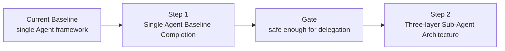

文字摘要：当前单 Agent 基线先进入 Step 1 补齐，只有通过安全和状态 gate 后，才进入 Step 2 的三层 sub-agent 架构。

| 步骤 | 目标 | 并发策略 | 状态 |
|------|------|----------|------|
| **Step 1** | 按此前方案补齐单 Agent 的代码理解、弱模型兼容、安全底线、意图识别、可恢复编辑和生态基础 | 保持 orchestrator 串行；不启用 sub-agent 并行 | v1 核心基线已落地；pricing / source hot reload / event-source wiring 等为后续扩展 |
| **Step 2** | 在 Step 1 基线之上启用 sub-agent，采用三层架构隔离调度、执行和正式状态 | 先单 sub-agent behind flag，再受控并行 | 方案阶段，等待 Step 2 runtime gate；默认不开启 |

### 明确暂不做

- Step 1 不启用 sub-agent 并行。
- Step 1 不引入远程 headless server / thin client。
- Step 1 不把 provider transcript 作为系统真相源。
- Step 2 不允许 sub-agent 直接绕过 Runtime 写 Snapshot / Event / Projection。

### 公开分析带来的修订原则

本文只吸收公开分析中的架构经验，不复刻、粘贴或依赖泄露的 proprietary prompt / source 内容。参考材料包括：

| 来源 | 可借鉴结论 | 对本文计划的影响 |
|------|------------|------------------|
| [Varonis: A Look Inside Claude's Leaked AI Coding Agent](https://www.varonis.com/blog/claude-code-leak) | 生产级 coding agent 的安全层不只是 sandbox，还包括 per-tool permission、denial tracking、Unicode / prompt injection 防护和多种 permission mode | Step 1.1 从“命令黑名单”扩展为“权限门 + 输入规范化 + 拒绝记忆 + tool-output 注入防护” |
| [AgenticMarket: Claude Code Source Code Leak](https://agenticmarket.dev/blog/claude-code-leak-mcp-servers) | 工具体系、memory、multi-agent、hooks、MCP server orchestration 会共同形成攻击面；MCP server 与 trusted tool 具有相同 blast radius | Step 1.10 / Step 2.7 增加 Source trust tier、capability manifest、MCP supply-chain 审计 |
| [Palma: What 512K Lines Reveal About MCP](https://palma.ai/blog/claude-code-source-leak-what-it-means-for-mcp) | MCP 需要面向多 agent 并发、session state isolation、event-driven source、agent-aware observability 和 per-agent cost attribution | Step 1.10 的 Source Pool 和 Step 2.4 / 2.6 增加并发、隔离、追踪和成本归因要求 |
| [arXiv: Dive into Claude Code](https://arxiv.org/abs/2604.14228) | coding agent 的核心 loop 很简单，主要工程复杂度在 permission classifier、context compaction、extensibility、subagent worktree isolation、append-oriented session storage | Step 1 增加 context budget / compaction 最小闭环；Step 2 强化 isolated workspace 和 append-only agent event |
| [Claude Code Subagents docs](https://code.claude.com/docs/en/subagents) | subagent 需要独立 context window、明确 description、独立 tool access、模型路由和可管理 UI | Step 2 增加 AgentPermissionProfile、AgentBudget、`/agents` 管理面板和 default-deny tool policy |
| [Claude Code Hooks docs](https://code.claude.com/docs/en/hooks) | PermissionRequest、PreToolUse、SubagentStop 等生命周期事件可用于安全拦截、审计和 verifier agent | Step 1.10 / Step 2.6 增加 SubagentStart / SubagentStop / PermissionRequest 事件和 agent transcript 指针 |
| [Claude Code Skills docs](https://docs.claude.com/en/docs/claude-code/skills) | skill 应采用 progressive disclosure，可声明 allowed tools，并把长参考资料拆成按需加载文件 | Step 1.7 调整 Skill 设计，增加 `allowed-tools`、按需加载、skill scanner 和版本元数据 |
| [arXiv: Measuring the Permission Gate](https://arxiv.org/abs/2604.04978) | 自动权限门在模糊授权、blast radius 不明确的场景中仍会有 false negative，不能只依赖模型分类器 | Step 1.1 / Step 1.6 要求静态规则优先、模糊风险默认升级到人工确认、approval key 必须包含 scope |
| [PandaTalk8: Harness Engineering 维度对比 Claude Code vs OpenClaw](https://x.com/PandaTalk8/status/2048306100882305358) | `Agent = Model + Harness` 公式；Harness 工程 9 维度（架构 / 循环 / 工具 / 指令 / 上下文 / 记忆 / 安全 / 扩展 / 持久化）；纵深型（Claude Code）vs 横向型（OpenClaw）双形态对比；记忆双层（事实日志 + AI 提炼层）+ 渐进式人格学习；hooks 升级为物理拦截而不止 lifecycle 事件源 | Step 2 范围澄清：当前三层 sub-agent 架构属于 Harness 中「Agent Execution」维度（纵深型）；横向型（事件驱动 / Cron / Heartbeat / 跨通道）和 Memory Distillation 归入 Step 3 候选；Step 2.2 加入 PreToolUse / PostToolUse 物理拦截作为 sub-agent permission 第二道屏障；Step 2.8 预留 evidence → memory distillation 接入点 |

---

## 当前单 Agent 基线情况

当前代码已经具备可运行的单 Agent 框架，并且 Step 1 的 v1 核心基线已经闭环；下表保留尚未纳入 v1 gate 的扩展项，作为后续 release / Step 2 前置 hardening 跟踪。

### 已落地基础设施

| 能力 | 当前代码状态 | 说明 |
|------|--------------|------|
| Completion Provider 接入 | ✅ 已落地 | Completion provider modules 已包含 Gemini / OpenAI / Anthropic / DeepSeek / Zhipu / Ollama。`CodeProvider::Codex` 是 managed Codex runtime / app-server 路径，不是 `src/internal/ai/providers/` 下的独立 CompletionModel provider。DeepSeek 默认模型为 `deepseek-chat`，使用 `DEEPSEEK_API_KEY` |
| 单 Agent Tool Loop | ✅ 已落地 | `ToolLoopConfig` 已支持 preamble、temperature、thinking、reasoning_effort、stream、hooks、`allowed_tools`、runtime context、repeat warning / abort threshold、`terminal_tools` |
| 工具注册 | ✅ 已落地 | `libra code` 默认注册 `read_file`、`list_dir`、`grep_files`、`search_files`、Rust semantic tools（`list_symbols` / `read_symbol` / `find_references` / `trace_callers`）、`web_search`、`apply_patch`、`shell`、plan / IntentSpec 工具和 MCP bridge tools |
| 工具 allow-list | ✅ 已落地 | `allowed_tools` 会同时过滤发给模型的 tool definitions，并在执行期二次拦截 hallucinated tool call |
| 基础 sandbox / approval | ✅ 部分落地 | 已有 `AskForApproval`、`ApprovalStore`、session 级 approval cache、`ApprovedForSession` / `ApprovedForAllCommands` |
| Shell 安全检查 | ✅ 已落地（Step 1.1 范围） | `src/internal/ai/sandbox/command_safety.rs` 已有 `tree-sitter-bash` 解析路径和只读 / 危险命令初筛；CEX-01 已补 `SafetyDecision` 合同与 fixture corpus；CEX-02 已补 `run_libra_vcs` 参数级 safety classifier / MCP preflight；CEX-03 已把 `classify_ai_command_safety(CommandSafetySurface::Shell, ...)` 接成 shell dispatch 的统一 pre-spawn gate：deny 直接拒绝、needs-human 进入 approval prompt、workspace 外 mutating target 拒绝。后续 TTL / canonical scope 归 Step 1.6 |
| 禁止 agent 直接使用 git | ✅ 已落地 | `ShellHandler` 会拒绝 shell 中直接调用 `git`，要求使用 `run_libra_vcs` 或 `libra` 命令 |
| `run_libra_vcs` 参数级 safety | ✅ 已落地 | 当前仍只暴露 `status` / `diff` / `branch` / `log` / `show` / `show-ref` / `add` / `commit` / `switch`（9 项），但 `classify_run_libra_vcs_safety(command, args)` 已按参数组合返回 allow / needs-human / deny：只读组合静默允许，可恢复状态变更返回 approval-required JSON，不可恢复 / 网络破坏性组合直接 deny；MCP `run_libra_vcs_impl()` 会在 spawn 前拦截。needs-human 路径复用统一 approval TTL / scope / audit 基线 |
| `AuditSink` / Snapshot / Event 抽象 | ✅ 已落地 | `runtime/hardening.rs` 已有 `AuditSink::append` / `flush` / `record_decision` / `record_event`，`TracingAuditSink` / `InMemoryAuditSink` 可复用；`runtime/event.rs` / `runtime/snapshot.rs` 已冻结顶级 `Event` / `Snapshot` trait，`LifecycleEvent` 实现 `Event`，`MaterializedProjection` 实现 `Snapshot` |
| Provider tool-call 解析失败降级 | ✅ 已落地（Step 1.2 范围） | CEX-04 已抽出 `parse_json_repaired()` 公共入口；CEX-05 已把 `parse_tool_call_arguments_with_repair()` 接入 OpenAI-compatible 家族（OpenAI / DeepSeek / Kimi / Zhipu）与 Ollama 的 tool-call `arguments` 字符串解析路径。解析失败时先 deterministic repair，repair 成功或最终 raw-string fallback 都记录 `tracing::warn!`；Anthropic / Gemini 继续使用 provider-native 结构化 tool input。 |
| Profile / slash command | ✅ 部分落地 | 已有 `.libra/commands/*.md`、`~/.config/libra/commands/*.md`、`.libra/agents/*.md`、user profiles、embedded profiles。这里的 `.libra/agents` 是 Agent Profile，不是 Step 2 的 sub-agent definition |
| Hooks | ✅ 主体落地 | 已有 `.libra/hooks.json` / user hooks、provider-specific hooks（Claude / Gemini）、lifecycle runtime 和 compaction lifecycle；尚缺 rules / cron / webhook / history 的 automation 层 |
| MCP bridge | ✅ 部分落地 | 已有本地 `LibraMcpServer` 和 `McpBridgeHandler`，包含 `run_libra_vcs` 等工具 |
| Session 存储 | ✅ 核心落地 | CEX-12 已把新 session 写入切到 `.libra/sessions/{session_id}/events.jsonl` append-only snapshot events；旧 `{id}.json` 首次读取时经迁移锁写入 JSONL，legacy blob 保留为非破坏性备份 |
| sea-orm schema migration runner | ✅ 已落地 | `src/internal/db/migration.rs`、`src/internal/model/schema_version.rs`、`schema_versions` 表、`builtin_runner()` 与 fresh / establish 路径收敛已存在；后续 JSONL link table、`agent_usage_stats`、automation history 必须复用该 runner |

### Step 1 后续扩展边界

| 改进项 | 当前状态 | 主要缺口 |
|--------|----------|----------|
| 代码语义工具 | ✅ Rust MVP 已落地 | CEX-06 已新增 `tree-sitter-rust`、`src/internal/ai/tools/semantic/`、Rust query、`extract_rust_symbols()` / `read_rust_symbol()` 纯函数和 fixture gate；CEX-07 已把 `list_symbols` / `read_symbol` / `find_references` / `trace_callers` 接成默认 tool handlers，并在 prompt 中引导优先使用语义工具。关系类工具当前为 file-scope approximate 结果，带 `confidence` / `scope` / `approximate` 元数据 |
| JSON repair | ✅ 已落地 | `completion/json_repair.rs` + `tests/data/ai_json_repair/json_repair.jsonl` 已覆盖 24 个 repairable 样本和 5 个结构化错误样本；provider tool-call `arguments` 字符串解析失败时已统一 retry repair，并在 repair / fallback 时记录 warn 事件。 |
| 破坏性命令黑名单 | ✅ 已落地（Step 1.1 范围） | `run_libra_vcs` 参数级 allow / needs-human / deny 已落地；Shell/git 危险检测已接入 `SafetyDecision` 统一执行路径，覆盖 OS 级 destructive 命令、wrapped / `bash -c` 绕过、workspace 外 mutating target 和 needs-human approval reason。protected branches 配置、denial tracking、audit 和 approval TTL 属后续 Step 1.6 / hardening 收尾 |
| 任务分类器 / intent prompt | ✅ 已落地 | CEX-08 已新增 `src/internal/ai/agent/classifier.rs`、`TaskIntent` enum、JSON-only classifier prompt、provider-neutral `TaskIntentClassifier<M: CompletionModel>` 和 `tests/data/classifier_fixtures.jsonl` / `tests/ai_classifier_test.rs`；CEX-09a 已新增 dynamic prompt section、workspace context cache、`ToolRegistry::filter_by_intent()`，并把 `--context dev/review/research` 映射到 Feature / Review / Question 的 `ToolLoopConfig.allowed_tools`；CEX-09b 已让普通 `libra code` 的首个未 profile 覆盖用户输入自动调用 classifier，显式 `--context` 继续跳过模型分类 |
| 动态系统提示注入 | ✅ 已落地 | `SystemPromptBuilder` 已支持 `with_intent()` / `with_dynamic_context()`，并注入 `libra status --short` / git fallback、workspace detection、AGENTS / CLAUDE / `.libra/rules/*.md` source/trust label、5 min TTL workspace/rules cache 与 context budget plan；CEX-09b 已让首轮自动分类结果重建 prompt intent section，并通过 `TaskIntentClassified` 事件保存到后续 TUI turn 的基础配置 |
| Skill 系统 | ✅ Core 已落地 | 新增 `src/internal/ai/skills/`：project/user skill loader、TOML frontmatter、`allowed-tools`、checksum/version metadata、scanner warning 和 `/skill <name>`；未声明 allowed-tools 的 skill 不继承 mutating tools |
| 文件级 Undo | ✅ 已落地 | CEX-10 已新增 `src/internal/ai/session/file_history.rs`；`ApplyPatchHandler` 在写入前按 TUI turn batch 对 touched files 记录 preimage；快照落在 `.libra/sessions/{id}/file_history/{hash}`，每 session 每文件保留最多 50 个版本；`/undo` 可回滚最近一批 AI 文件编辑，失败 preflight 不产生半回滚 |
| Source Pool | ✅ Phase A core 已落地 | 新增 `src/internal/ai/sources/`：`Source` trait、`SourceKind { Mcp, RestApi, LocalDocs }`、`CapabilityManifest`、trust tier、`SourcePool`、source-prefixed tool naming、per-session state namespace 和 call record core；`McpSource` 已复用旧 MCP tool schema / dispatch，legacy `McpBridgeHandler` 保持旧工具名兼容。REST OpenAPI fixture、`/source list|enable|disable|reload` 和持久化 source telemetry 仍归 Step 1.10 后续 |
| Automation | ✅ MVP core 已落地 | 新增 `src/internal/ai/automation/`：`.libra/automations.toml` parser、cron simulation、prompt/webhook/shell action executor、shell safety preflight、failure isolation、`automation_log` migration/history 和 CLI `automation list|run|history`；runtime hook/VCS event-source wiring 仍需后续接入 |
| JSONL session | ✅ 核心已落地 | `SessionEvent` 实现 CEX-00.5 `Event` trait；reader 跳过未知 future event，完整 malformed 行报错，只有末尾 partial line 作为 crash/truncate recovery 忽略。CEX-13b 已把 `ContextFrame` / `CompactionEvent` 纳入同一 JSONL envelope，并将大 tool result / artifact 内容外部化到 session attachment |
| Context budget / compaction | ✅ CEX-13a/b/c core 已落地 | CEX-13a 已新增 7 段 `ContextBudget` / provider capability 适配 / priority allocator；CEX-13b 已新增 `ContextFrameEvent`、`ContextAttachmentStore`、append-only `CompactionEvent` replay，并在共享 tool loop 为每次 provider request 记录 prompt frame；CEX-13c 已新增 session-scoped `MemoryAnchor` event replay、prompt 注入和 `/anchors` draft / confirm / revoke / supersede |
| Approval TTL | ✅ 已落地 | CEX-11 已把 approval cache 从裸 session map 升级为 `ApprovalMemo { key, decision, expires_at, scope, sensitivity_tier }`；shell approval key 使用包含 sensitivity / scope / canonical args / cwd / sandbox scope / blast-radius 预留字段的 SHA-256；`ApprovedForTtl` 在 TTL 内跳过重复 prompt，`--approval-ttl` 与 `.libra/config.toml [approval].ttl_seconds` 可配置；TUI / Code UI approval prompt 暴露 strict / directory / pattern TTL，allow-all 需要二次确认；`/approvals` 可列出 active memos 并按 key prefix revoke；`[approval].protected_branches` / `allowed_network_domains` / `no_cache_unknown_network` 会对敏感命令禁用缓存复用 |
| 模型用量统计 | ✅ 核心已落地 | `UsageRecorder` 在 tool-loop provider 调用后记录 prompt/completion/cached/reasoning/total token、tool-call count、wall-clock、provider/model 和可选 cost；provider 缺 usage 写 estimated row，provider error 写 failure row；`UsageQuery` / `libra usage report --by=model` 可按 `(provider, model)` 聚合；TUI compact bottom-pane usage line 已接入。完整 L1/L3、streaming 增量、pricing/retention、取消/超时专用行仍是 follow-up |
| 持久化功能表 | ⚠️ 部分落地 | migration runner 已有，JSONL session 文件真相源已落地；`ContextFrame` / `CompactionEvent` 已接入 session JSONL 和 attachments；`automation_log` 与 CEX-16 core `agent_usage_stats` 已通过 built-in migration 接入。source telemetry 持久化、usage retention/failure backfill 仍未完成 |

### 当前基线风险

| 风险 | 影响 | Step 1 对策 |
|------|------|-------------|
| approval TTL hardening 已收口 | shell approval cache 已具备 TTL、canonical key、scope / sensitivity 字段和 revoke；TUI / Code UI 已暴露 Strict / Directory / Pattern TTL 选择；allow-all 需要二次确认；protected branch / non-whitelisted network domain 可配置为 no-cache policy | 保持 Step 2 / automation 路径复用同一 `ToolApprovalContext`，新增 approval surface 必须继续携带 scope / sensitivity / no-cache policy |
| 弱模型 JSON repair 仍缺真实 provider release gate | DeepSeek / Ollama 等弱模型常见 malformed tool args 已有 deterministic repair 基线，但真实 provider 回归仍应在 release / nightly gate 做抽样冒烟 | Step 1.2 已在 provider mock 和 fixture 上闭环；release gate 继续保留 DeepSeek / Ollama 手工或 nightly 冒烟，防止 provider 原始 schema 漂移 |
| 语义工具仍是 Rust/file-scope MVP | CEX-06 / CEX-07 已能在默认工具面按 Rust 符号读取代码，并提供 file-local approximate reference / caller 候选；但还没有 TS/JS/Python、LSP/LSIF、跨文件 re-export / trait impl 精确解析 | 后续多语言 semantic expansion 或 LSP/LSIF backend 评估；跨文件结果必须继续显式标注 `approximate` / `confidence` |
| 文件级 undo 已落地 | 用户在未 commit 的脏工作区里已有轻量回滚能力；剩余风险是跨 session 长期恢复和 VCS rollback 引导 | 继续保持 `ApplyPatch` 前快照、`/undo` 原子回滚和失败 preflight 测试 |
| project-scope anchor 自动提升尚未开放 | CEX-13c 已支持 session-scoped anchor lifecycle 和 confirmed anchor prompt 注入；但 automation / project-scope auto-promotion 涉及 Source Pool、audit policy 和人工 review，不应在 Step 1.9 暗中开放 | Step 1.10 automation / Source Pool 增加 `allow_auto_anchors`、source trust tier 和 project-scope promotion review |
| MCP / skill 来源缺少 trust tier | 外部 source、skill、MCP server 一旦被信任，blast radius 接近内置工具 | Step 1.10 增加 capability manifest、trust tier、per-source permissions 和审计 |
| 没有正式 sub-agent 状态边界 | 若现在直接并行，会放大审批、写冲突、上下文污染和审计缺口 | Step 2 必须等 Step 1 gate 后再启用 |
| 统一抽象已冻结但尚未被功能层全面复用 | JSONL session、ContextFrame、automation、usage stats 如果绕开 `Event` / `AuditSink` / `MigrationRunner`，仍会重新长出平行事件流和 ad-hoc schema | 后续 CEX-12 / 13 / 15 / 16 必须复用 CEX-00.5 与 CEX-12.5 输出；任何 `CREATE TABLE IF NOT EXISTS` hack 都应在 review 中阻断 |

### 代码基线实现锚点

下表是 Codex 执行本计划时的代码入口。后续任务卡中的“文件范围”应优先从这里选择；若实现需要越过这些边界，必须在 PR 描述里说明原因。

| 基线模块 | 当前能力 | 计划使用方式 |
|----------|----------|--------------|
| `src/command/code.rs` | `libra code` CLI 参数、provider 选择、默认工具注册、TUI 启动、profile / session 加载入口 | Step 1.0 增加 CLI 行为基线；Step 1.4 接入 intent 分类和 `allowed_tools`；Step 1.7 / 1.10 接入 slash command / source 命令 |
| `src/internal/ai/agent/runtime/tool_loop.rs` | `ToolLoopConfig`、`allowed_tools`、repeat warning / abort、blocked-call abort、observer preflight | Step 1.1 复用重复 blocked action 终止；Step 1.4 复用工具过滤；Step 2 flag-off 回归必须覆盖这里 |
| `src/internal/ai/tools/registry.rs` | 工具注册、dispatch、working_dir 作为 sandbox 真相源、runtime hardening audit、path alias rebase | Step 1.1 安全门最终应收敛到 dispatch / handler preflight；Step 1.3 已注册 semantic handlers；Step 2 复用 isolated workspace alias |
| `src/internal/ai/tools/handlers/shell.rs` | shell tool、直接 `git` 调用拒绝、workspace snapshot diff、approval 调用 | Step 1.1 增加 destructive guard、capability profile、workspace mutating 约束 |
| `src/internal/ai/tools/utils.rs` | path boundary、reserved metadata path、`command_invokes_git_version_control()` | Step 1.1 增加命令规范化、OS 级危险命令判定、protected branch helper |
| `src/internal/ai/libra_vcs.rs` | `run_libra_vcs` 的允许命令列表、status 参数规范化、参数级 safety classifier、user-friendly safety JSON | Step 1.1 后续只应补 approval / audit / protected-branch 配置边界，不要重新发明另一套 VCS classifier |
| `src/internal/ai/tools/handlers/mcp_bridge.rs` | `McpBridgeHandler` 暴露 `LibraMcpServer` tools，`run_libra_vcs` mutating 判断已复用 `classify_run_libra_vcs_safety()` | Step 1.10 迁移为 `McpSource` shim 时保持旧 schema 兼容和 safety preflight |
| `src/internal/ai/runtime/hardening.rs` | `ToolBoundaryPolicy`、`PrincipalContext`、`BoundaryDecision`、`SafetyDecision`、secret redaction、`AuditSink` trait（含 `append` / `flush` / `record_decision` / `record_event`）+ `TracingAuditSink` / `InMemoryAuditSink` 实现 | Step 1.1 / 1.6 应优先扩展这里的策略合同，避免在 handler 中散落审批语义 |
| `src/internal/ai/sandbox/` | `AskForApproval`、`ReviewDecision`、session approval cache、shell approval request、Seatbelt policy | Step 1.1 接入 destructive deny；Step 1.6 扩展 TTL / sensitivity / revoke |
| `src/internal/ai/completion/` | provider-neutral `CompletionModel` / `CompletionResponse` / `Message` / `ToolCall` | Step 1.2 新增 `json_repair.rs` 和 provider 解析入口复用函数 |
| `src/internal/ai/providers/openai_compat.rs` | OpenAI-compatible tool call argument string 解析，失败时先走 shared JSON repair，再退回 raw string | Step 1.2 的公共解析点；OpenAI / DeepSeek / Kimi / Zhipu 复用这里的 repair helper |
| `src/internal/ai/providers/{deepseek,kimi,ollama,openai,zhipu,anthropic,gemini}/completion.rs` | 各 provider request / response 映射和工具调用解析 | Step 1.2 已接入 string-argument repair；Anthropic / Gemini 的结构化 tool input 维持原生路径；真实 provider 回归只在 release / nightly gate 跑 |
| `src/internal/ai/prompt/` | `SystemPromptBuilder`、rules / context loader、`extra_section` | Step 1.4 / 1.9 增加 intent section、dynamic context、ContextFrame 估算 |
| `src/internal/ai/session/store.rs` | `.json` blob session、atomic write、session file lock / stale lock 清理、legacy metadata backfill | Step 1.8 复用 lock / atomic write 思路实现 JSONL 迁移和并发安全 |
| `src/internal/ai/session/state.rs` | `SessionState` / `SessionMessage`，只保存 user / assistant 文本历史 | Step 1.8 设计 JSONL header / message / attachment schema 时保持旧 state 可迁移 |
| `src/internal/db/migration.rs`、`src/internal/model/schema_version.rs`、`sql/migrations/` | sea-orm migration runner、`schema_versions` bookkeeping、migration README 与测试基线 | Step 1.8 / 1.9 / 1.10 / 1.11 新增 schema 时只注册 migration，不再散落 ad-hoc DDL |
| `src/internal/ai/hooks/` | hook config / lifecycle / provider hooks / runtime runner，已有 `Compaction` 事件前置 | Step 1.9 复用 lifecycle 事件，新增 ContextFrame / CompactionEvent 持久化语义；Step 1.10 把 hooks 接入 automation event source |
| `src/internal/ai/completion/`、`src/internal/ai/providers/{...}/completion.rs`、`src/internal/db.rs`、`src/internal/model/`、`src/internal/ai/usage/` | provider request / response、token usage 字段、Libra SQLite migration runner；CEX-16 core 已通过 `UsageRecorder` 在 tool-loop 调用后持久化 prompt/completion/cached/reasoning/total token、tool-call count、wall-clock、provider/model 和可选 cost；missing usage / provider error 会写入 estimated/failure row；`UsageQuery` / `libra usage report --by=model` 聚合 | Step 1.11 follow-up 补齐 pricing table / retention / CLI filters、TUI L1/L3 与 streaming 增量展示，并与 Step 2 `RunUsage[E]` / `agent_run_id` 归因严格对齐 |
| `src/internal/ai/intentspec/`、`src/internal/ai/runtime/contracts.rs`、`src/internal/ai/orchestrator/` | IntentSpec、Plan/Task、workflow phase、Scheduler / Runtime contracts | Step 1.4 不重复发明 intent 类型；Step 2 AgentTask 必须引用现有 Task / Evidence / Decision |
| `src/internal/ai/agent/profile/`、`src/internal/ai/commands/` | `.libra/agents/*.md` profile 和 `.libra/commands/*.md` command 已落地，含 embedded defaults | Step 1.7 Skill 系统必须和 command/profile 明确边界，避免把 profile 当 sub-agent definition |
| `src/internal/tui/slash_command.rs`、`src/internal/tui/app.rs`、`src/internal/tui/bottom_pane.rs` | built-in slash command、approval dialog、bottom pane rendering | Step 1.5 / 1.6 / 1.7 / 2.6 的用户交互入口 |
| `tests/helpers/mock_completion_model.rs`、`tests/command/code_test.rs`、`tests/ai_*_test.rs` | provider mock、CLI 参数、runtime / projection / hardening 现有测试基线 | 每个 Codex 任务必须优先添加 focused unit test，再按风险补 integration test |

---

## Step 1：单 Agent 基线补齐

**里程碑**：`libra code` 在单 Agent 串行模式下具备安全底线、弱模型兼容、符号级代码理解、意图识别、动态上下文、轻量恢复能力和可观测的状态记录。

### Step 1 依赖关系

图方向说明：横向箭头表示交付依赖，箭头左侧能力先落地后，右侧能力才能把它当作基线。

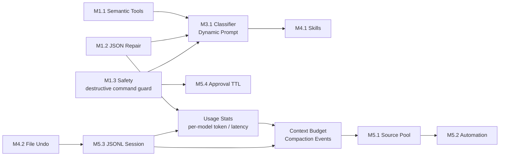

文字摘要：安全、JSON repair、语义工具先形成单 Agent 基线；分类器、Undo、JSONL、Context Budget、Source Pool 和 Automation 依次建立在这些基线之上；Usage Stats 在 JSONL 和 provider JSON 解析就绪后接入，反过来为 Context Budget 决策提供历史数据。

### Codex 执行手册

本节把上面的路线图转换成 Codex 可以逐项执行的任务卡。执行规则优先级高于单个 Step 的叙述性说明；如果任务卡与叙述段落冲突，以任务卡的依赖、写入范围和验收为准，并在同一 PR 中修正文档冲突。

**通用执行协议：**
1. 每次只执行一个 `CEX-*` 任务卡；不要把两个任务卡合并到一个 PR。
2. 开工前先读任务卡的 `Read first` 文件和现有测试；不要先写代码。
3. 默认只修改任务卡 `Write set` 中列出的文件；需要越界时先在 PR 描述说明原因，并把新文件补回任务卡或 Changelog。
4. 先写 focused unit test，再写实现；涉及 CLI / session / MCP / TUI 行为时补 integration test。
5. 每个任务完成后至少运行任务卡指定 verification；跨 2-3 个任务后运行一次 Step checkpoint。
6. 不使用真实 provider 凭证作为默认 CI 条件；DeepSeek / Ollama live regression 只作为 nightly / release gate。
7. 遇到当前代码基线与本文描述不一致时，先更新“代码基线实现锚点”和对应任务卡，再继续实现。

**建议给 Codex 的任务提示模板：**

```text
请执行 docs/improvement/agent.md 中的 CEX-XX。
约束：
- 只实现该任务卡，不推进后续任务。
- 默认只修改任务卡 Write set 中的文件。
- 先补测试，再实现。
- 完成后运行任务卡 Verification 中的命令，并在最终回复说明未运行的检查。
```

**Step 1 Codex 任务卡：**

| ID | 目标 | 依赖 | Read first | Write set | Verification | 完成判定 |
|----|------|------|------------|-----------|--------------|----------|
| CEX-00 | 固化当前单 Agent 基线测试 | 无 | `src/command/code.rs`、`src/internal/ai/agent/runtime/tool_loop.rs`、`src/internal/ai/session/store.rs`、`tests/helpers/mock_completion_model.rs` | `tests/command/code_test.rs`、`tests/ai_agent_baseline_test.rs` | `cargo test code_test`；`cargo test ai_agent_baseline` | `allowed_tools`、`git` 拒绝、provider 参数、session resume、basic tool result 都有可重复测试 |
| CEX-00.5 | 冻结 `AuditSink` trait 与顶级 `Snapshot` / `Event` 抽象 | CEX-00 | `src/internal/ai/runtime/hardening.rs`、`src/internal/ai/runtime/contracts.rs`、`src/internal/ai/hooks/lifecycle.rs`、`src/internal/ai/orchestrator/mod.rs`、`src/internal/ai/session/store.rs` | `src/internal/ai/runtime/hardening.rs`、`src/internal/ai/runtime/contracts.rs`、`src/internal/ai/runtime/event.rs`、`src/internal/ai/runtime/snapshot.rs`、`src/internal/ai/runtime/mod.rs`、`tests/ai_runtime_contract_test.rs`、`tests/ai_hardening_contract_test.rs` | `cargo test --test ai_runtime_contract_test`；`cargo test --test ai_hardening_contract_test`；`cargo test --test command_test code`（`cargo test code_test` 因 cargo 名字过滤规则匹配 0 项，需用 `--test command_test` 选中 binary 后再用 `code` 子串过滤；同样适用于其他 CEX 卡，但本卡作为首个修订示范） | `AuditSink` trait 含 `record_decision` / `record_event` / `flush`，可被 `sandbox` / `hardening` / 未来 sub-agent 共享；`Snapshot` / `Event` trait 与 `MaterializedProjection` 兼容；`LifecycleEvent` 实现 `Event`；session store / orchestrator 不破坏既有 API；后续所有持久化 CEX 必须基于这两层 trait |
| CEX-01 | 定义安全决策合同和 fixture corpus | CEX-00 | `src/internal/ai/runtime/hardening.rs`、`src/internal/ai/tools/utils.rs`、`src/internal/ai/libra_vcs.rs` | `src/internal/ai/runtime/hardening.rs`、`src/internal/ai/tools/utils.rs`、`tests/data/ai_safety/`、`tests/ai_command_safety_test.rs` | `cargo test ai_command_safety`；`cargo test --test ai_hardening_contract_test` | 有 `SafetyDecision { allow, deny, needs_human }` 等价合同、规则名、原因、blast radius 字段；50 条 fixture 可加载 |
| CEX-02 | `run_libra_vcs` 参数级白名单 / 默认人工确认 | CEX-01 | `src/internal/ai/libra_vcs.rs`、`src/internal/ai/tools/handlers/mcp_bridge.rs`、`tests/mcp_integration_test.rs` | `src/internal/ai/libra_vcs.rs`、`src/internal/ai/tools/handlers/mcp_bridge.rs`、`tests/ai_libra_vcs_safety_test.rs` | `cargo test ai_libra_vcs_safety`；`cargo test mcp_integration` | 只读组合可静默；mutating 可恢复组合返回 approval-required 信号或 user-friendly error；不可恢复组合 deny；未知组合不静默 |
| CEX-03 | Shell destructive guard + capability profile | CEX-01、CEX-02 | `src/internal/ai/tools/handlers/shell.rs`、`src/internal/ai/tools/utils.rs`、`src/internal/ai/sandbox/` | `src/internal/ai/tools/handlers/shell.rs`、`src/internal/ai/tools/utils.rs`、`src/internal/ai/runtime/hardening.rs`、`tests/ai_command_safety_test.rs` | `cargo test ai_command_safety`；`cargo test shell` | OS 危险命令、encoded / quoted bypass、workspace 越界 mutating shell 被拒绝；合法局部清理不误杀 |
| CEX-04 | Provider-neutral JSON repair core（已完成 2026-05-02） | CEX-00 | `src/internal/ai/completion/mod.rs`、`src/internal/ai/completion/message.rs` | `src/internal/ai/completion/json_repair.rs`、`src/internal/ai/completion/mod.rs`、`tests/data/ai_json_repair/`、`tests/ai_json_repair_test.rs` | `cargo test ai_json_repair` | 20+ malformed fixture 修复率达到 gate；不可修复样本返回结构化错误，不 panic |
| CEX-05 | JSON repair 接入 provider tool-call 解析（已完成 2026-05-02） | CEX-04 | `src/internal/ai/providers/openai_compat.rs`、`src/internal/ai/providers/deepseek/completion.rs`、`src/internal/ai/providers/ollama/completion.rs`、各 provider completion tests | `src/internal/ai/providers/openai_compat.rs`、`src/internal/ai/providers/{deepseek,kimi,ollama,openai,zhipu}/completion.rs`、provider 单测 | `cargo test providers`；`cargo test ai_json_repair` | OpenAI-compatible 家族与 Ollama 的 tool-call `arguments` 字符串解析失败时先 repair 再降级；repair / fallback 事件有 `tracing::warn!`，provider mock 覆盖 DeepSeek / Ollama / OpenAI-compatible helper；Anthropic / Gemini 原生结构化 tool input 不需要字符串 repair |
| CEX-06 | Rust semantic extractor MVP（已完成 2026-05-02） | CEX-00 | `Cargo.toml`、`src/internal/ai/tools/`、`tests/data/ai_semantic/` | `Cargo.toml`、`src/internal/ai/tools/semantic/{mod.rs,extractor.rs,query/rust.scm}`、`tests/ai_semantic_rust_test.rs` | `cargo test ai_semantic_rust` | Rust `list_symbols` / `read_symbol` 的 extractor 纯函数通过；grammar 失败 fallback 不 panic |
| CEX-07 | Semantic handlers + registry / prompt 引导（已完成 2026-05-02） | CEX-06 | `src/command/code.rs`、`src/internal/ai/tools/handlers/mod.rs`、`src/internal/ai/tools/registry.rs`、`src/internal/ai/prompt/` | `src/internal/ai/tools/handlers/semantic/`、`src/internal/ai/tools/handlers/mod.rs`、`src/command/code.rs`、`src/internal/ai/prompt/embedded/tool_use.md`、`src/internal/ai/prompt/builder.rs`、`tests/ai_semantic_tools_test.rs` | `cargo test --test ai_semantic_tools_test`；`cargo test --test ai_semantic_rust_test`；`cargo test test_tool_use_mentions_semantic_tools` | `list_symbols` / `read_symbol` / `find_references` / `trace_callers` 默认注册可用；prompt 引导优先使用 semantic tools；结果带 confidence / scope / approximate |
| CEX-08 | TaskIntent 分类器合同（已完成 2026-05-03） | CEX-00、CEX-07 | `src/internal/ai/intentspec/`、`src/internal/ai/runtime/prompt_builders.rs`、`src/internal/ai/agent/profile/router.rs` | `src/internal/ai/agent/classifier.rs`、`src/internal/ai/agent/mod.rs`、`tests/data/classifier_fixtures.jsonl`、`tests/ai_classifier_test.rs` | `cargo test ai_classifier` | enum、prompt、mock model 分类链路可测；显式 `--context` 跳过分类器；不引入 live provider CI |
| CEX-09a | 动态系统提示 + 显式 context intent tool policy 接入（已完成 2026-05-03） | CEX-08 | `src/command/code.rs`、`src/internal/ai/prompt/builder.rs`、`src/internal/ai/tools/registry.rs`、`src/internal/tui/app.rs`、`src/internal/ai/agent/runtime/tool_loop.rs` | `src/internal/ai/prompt/dynamic_context.rs`、`src/internal/ai/prompt/mod.rs`、`src/internal/ai/prompt/builder.rs`、`src/command/code.rs`、`src/internal/tui/app.rs`、`src/internal/ai/tools/registry.rs`、`tests/ai_dynamic_prompt_test.rs` | `cargo test ai_dynamic_prompt`；`cargo test code_context_maps_to_task_intent`；`cargo test system_preamble_includes_explicit_context_intent_and_dynamic_context` | `SystemPromptBuilder::with_intent()` / `with_dynamic_context()`；prompt 含 `libra status --short`、workspace detection、rules TTL cache、source/trust label、context budget plan；显式 `--context review/research` 下 mutating tools 经 `allowed_tools` 不可见且执行期不可调用 |
| CEX-09b | 首轮用户输入自动分类 runtime 接入（已完成 2026-05-03） | CEX-09a | `src/internal/tui/app.rs`、`src/command/code.rs`、`src/internal/ai/agent/classifier.rs`、`src/internal/ai/prompt/builder.rs` | `src/internal/tui/app.rs`、`src/internal/tui/app_event.rs`、`src/command/code.rs`、focused TUI/App test | `cargo test --lib first_turn`；`cargo test --test ai_dynamic_prompt_test`；`LIBRA_ENABLE_TEST_PROVIDER=1 cargo test --features test-provider --test code_ui_scenarios` | 普通 `libra code` 第一条未 profile 覆盖用户输入自动调用 classifier；显式 `--context` 继续跳过模型分类；direct chat 分类结果更新 prompt intent section 与 allowed tools，plan 启动路径保留 phase tool allow-list 但更新 intent prompt |
| CEX-10 | 文件级 Undo（已完成 2026-05-03） | CEX-00 | `src/internal/ai/tools/handlers/apply_patch.rs`、`src/internal/ai/session/store.rs`、`src/internal/tui/slash_command.rs`、`src/internal/tui/app.rs` | `src/internal/ai/session/file_history.rs`、`src/internal/ai/tools/handlers/apply_patch.rs`、`src/internal/tui/slash_command.rs`、`src/internal/tui/app.rs`、`src/internal/ai/sandbox/mod.rs`、`src/internal/ai/orchestrator/executor.rs`、`tests/ai_file_undo_test.rs` | `cargo test --test ai_file_undo_test`；`cargo test --lib slash_command`；`cargo test --lib apply_patch` | 一轮多文件 patch 前快照；`/undo` 原子回滚；失败不产生半回滚；50-version retention 可测 |
| CEX-11 | Approval TTL store + canonical key（已完成 2026-05-03；hardening follow-up 同日完成） | CEX-01、CEX-03 | `src/internal/ai/sandbox/mod.rs`、`src/internal/ai/runtime/hardening.rs`、`src/internal/tui/app.rs`、`src/internal/tui/bottom_pane.rs` | `src/internal/ai/sandbox/mod.rs`、`src/internal/tui/app.rs`、`src/internal/tui/bottom_pane.rs`、`src/internal/tui/slash_command.rs`、`src/command/code.rs`、`tests/ai_approval_ttl_test.rs` | `cargo test --test ai_approval_ttl_test`；`cargo test --lib approval`；`cargo test --lib slash_command` | `ApprovedForTtl` TTL memo 生效；canonical shell key 对 flag 顺序稳定且包含 scope / sensitivity / cwd / sandbox scope；`ApprovalStore::revoke` 生效；denied decisions 不写 cache；TUI / Code UI 有 strict / directory / pattern TTL 选项；allow-all 二次确认；protected branch / non-allowlisted domain no-cache policy 生效 |
| CEX-12 | JSONL session writer / reader / migration（已完成 2026-05-03） | CEX-00.5 | `src/internal/ai/session/store.rs`、`src/internal/ai/session/state.rs`、`src/internal/ai/runtime/event.rs` | `src/internal/ai/session/jsonl.rs`、`src/internal/ai/session/migration.rs`、`src/internal/ai/session/store.rs`、`src/internal/ai/session/mod.rs`、`tests/ai_session_jsonl_test.rs` | `cargo test ai_session_jsonl`；`cargo test --test ai_schema_migration_test`；`cargo test --lib session::` | append-only snapshot writer、truncate-tail recovery、complete malformed line error、legacy `.json` 并发安全迁移、unknown event skip 均可测；`SessionEvent` 实现 CEX-00.5 的 `Event` trait |
| CEX-12.5 | sea-orm schema migration runner（统一持久化基础） | CEX-00.5 | `src/internal/db.rs`、`sql/sqlite_20260309_init.sql`、`src/internal/model/`、`src/internal/ai/orchestrator/persistence.rs` | `src/internal/db.rs`、`src/internal/db/migration.rs`、`src/internal/model/schema_version.rs`、`sql/migrations/`、`tests/db_migration_test.rs` | `cargo test db_migration`；`cargo test --all` | 提供 `MigrationRunner` 抽象，支持版本号、向上 / 向下迁移、idempotent CREATE；fresh repo 与 existing repo 启动后 schema 完全一致；后续 CEX-13b / CEX-15 / CEX-16 复用同一 runner，不再各自 hack `CREATE TABLE IF NOT EXISTS` |
| CEX-13a | ContextBudget core：分层 token 预算 + provider capability 适配（已完成 2026-05-03） | CEX-09b、CEX-12 | `src/internal/ai/prompt/builder.rs`、`src/internal/ai/runtime/prompt_builders.rs`、`src/internal/ai/hooks/lifecycle.rs` | `src/internal/ai/context_budget/{mod.rs,budget.rs,allocator.rs}`、`src/internal/ai/mod.rs`、`src/internal/ai/prompt/builder.rs`、`tests/ai_context_budget_test.rs` | `cargo test --test ai_context_budget_test`；`cargo test --test ai_dynamic_prompt_test` | 7 段 token budget（system rules / project memory / MemoryAnchor / recent / tool results / semantic / source）；provider capability 调整；超限时按优先级裁剪，安全规则不可压缩；budget allocation 可单测 |
| CEX-13b | ContextFrame 持久化 + replay（已完成 core，2026-05-03） | CEX-13a、CEX-12、CEX-12.5 | `src/internal/ai/context_budget/budget.rs`、`src/internal/ai/runtime/prompt_builders.rs`、`src/internal/ai/hooks/lifecycle.rs` | `src/internal/ai/context_budget/{frame.rs,compaction.rs}`、`src/internal/ai/hooks/lifecycle.rs`、`src/internal/ai/session/jsonl.rs`、`tests/ai_context_frame_test.rs` | `cargo test ai_context_frame` | 每轮 prompt 输出 `ContextFrame[E]`，含 source / trust level / token estimate / 裁剪原因；`CompactionEvent[E]` append-only，可 replay；大 tool result attachment 化；删除 projection / cache 后可由 JSONL + attachment 重建 |
| CEX-13c | MemoryAnchor lifecycle：draft / confirm / revoke / supersede（已完成 core，2026-05-03） | CEX-13b | `src/internal/ai/context_budget/budget.rs`、`src/internal/ai/prompt/builder.rs`、`src/internal/tui/slash_command.rs` | `src/internal/ai/context_budget/memory_anchor.rs`、`src/internal/ai/prompt/builder.rs`、`src/internal/tui/slash_command.rs`、`src/internal/tui/app.rs`、`tests/ai_memory_anchor_test.rs` | `cargo test ai_memory_anchor` | anchor 含 `content` / `source_event_id` / `confidence` / `scope` / `created_by` / `expires_at` / `review_state`；automation 默认只能 draft session scope；`/anchors` 可 list / confirm / revoke；compaction 不丢弃 active anchor；revoke event replay 后生效 |
| CEX-14 | Source Pool MCP shim（已完成 Phase A core，2026-05-03） | CEX-02、CEX-12 | `src/internal/ai/tools/handlers/mcp_bridge.rs`、`src/internal/ai/mcp/`、`src/internal/ai/libra_vcs.rs` | `src/internal/ai/sources/`、`src/internal/ai/tools/handlers/mcp_bridge.rs`、`tests/ai_source_pool_test.rs` | `cargo test --test ai_source_pool_test`；`cargo test --test ai_libra_vcs_safety_test`；`cargo test --test e2e_mcp_flow` | `McpSource` 与旧 bridge 并存；旧工具 schema 兼容；source manifest / trust tier 校验生效；source-prefixed `{source_slug}__{tool_name}` 作为扩展，不破坏旧 MCP bridge 用户 |
| CEX-15 | Automation MVP（已完成 core，2026-05-03） | CEX-11、CEX-13c、CEX-14、CEX-12.5 | `src/internal/ai/hooks/`、`src/internal/db/migration.rs`、`src/command/mod.rs` | `src/internal/ai/automation/{mod.rs,config.rs,events.rs,scheduler.rs,executor.rs,history.rs}`、`src/internal/ai/mod.rs`、`src/command/automation.rs`、`src/command/mod.rs`、`tests/ai_automation_test.rs` | `cargo test --test ai_automation_test` | TOML rules、cron 模拟、webhook / shell / prompt action、history log 可测；Shell action 复用 Step 1.1 safety；cron 触发的 shell action对 deny / needs-human fail-closed，不绕过 scope / blast radius 检查；`automation_log` 表通过 CEX-12.5 migration 注册；runtime hook/VCS event-source dispatch 留后续接线 |
| CEX-16 | 模型用量与耗时统计入库（core + schema/TUI L1/L2/report filters/retention 已完成，2026-05-03；modal/streaming/pricing follow-up pending） | CEX-05、CEX-09b、CEX-12、CEX-12.5 | `src/internal/ai/completion/mod.rs`、`src/internal/ai/providers/{openai_compat,anthropic,gemini}/`、`src/internal/ai/agent/runtime/tool_loop.rs`、`src/command/{code.rs,usage.rs}`、`src/internal/tui/{app.rs,app_event.rs,bottom_pane.rs,chatwidget.rs,slash_command.rs}`、`src/internal/db/migration.rs`、`src/cli.rs` | `src/internal/ai/usage/{mod.rs,recorder.rs,query.rs,format.rs}`、`src/internal/ai/mod.rs`、`src/command/usage.rs`、`src/command/mod.rs`、`src/cli.rs`、`src/internal/ai/agent/runtime/tool_loop.rs`、`src/command/code.rs`、`tests/ai_usage_stats_test.rs`、`tests/ai_usage_tui_test.rs` | `cargo test --test ai_usage_stats_test`；`cargo test --test ai_usage_tui_test`；`cargo test --lib usage_line_extends_normal_mode_without_affecting_approval_dialog`；`cargo test --lib chat_usage_header_reserves_top_row`；`cargo test --lib usage_report`；`cargo test --lib slash_command`；`cargo clippy --all-targets --all-features -- -D warnings` | Done: `agent_usage_stats` table registered via built-in CEX-12.5 migration; schema includes session/thread/agent_run/request_kind/intent, cached/reasoning/total/tool-call, failure/error and micro-dollar cost fields; usage recorder records success, missing-usage estimated rows and provider-error failure rows; OpenAI-compatible / Anthropic / Gemini usage metadata maps into provider-neutral summary; `UsageQuery` aggregates by `(provider, model)` and supports time/session/thread/success filters; `libra usage report --by=model` emits human/JSON/CSV output with `--since` / `--until` / `--session` / `--thread` / `--include-failed`; `libra usage prune --retention-days` deletes rows before the cutoff; TUI chat-area header badge and compact bottom-pane usage line are driven by usage observer events; built-in `/usage` renders current session usage into the transcript. Follow-up still required for full CEX-16: pricing table, SQLite-backed modal detail panel, streaming incremental refresh, cancel/timeout rows, and config/rendering assertions |

**当前基线后的 Codex 优先队列（2026-05-03）：**

| 顺序 | 任务 | 为什么现在做 | 完成后解锁 |
|------|------|--------------|------------|
| 1 | CEX-16 follow-up：full TUI + usage schema completion | CEX-16 core 已有，但 L1/L2/L3 实时 TUI、failure/cancel rows、pricing/retention、cached/reasoning/tool-call fields 仍未完成 | CP-6 完整通过；Step 2 budget enforcement、parallel cost attribution |
| 2 | Step 1.10 follow-up：source hot reload + runtime event-source wiring | CEX-14 / CEX-15 core 已有，但 `/source reload`、旧 MCP config migration、hook/VCS event-source runtime 接线仍未完成 | Step 2 capability package / source-triggered workflows |
| 3 | CEX-S2-11 起的 Step 2 runtime | 只有 CP-4 通过后才允许 sub-agent runtime；当前 `agent_run/` 只是 schema-only，且 CEX-16 full gate 仍需补齐后才可做依赖 usage TUI 的 Step 2 observability | sub-agent workspace / single-agent flag / controlled parallel |

**Step 1 Checkpoints：**

| Checkpoint | 触发条件 | 必跑验证 | 是否允许进入下一阶段 |
|------------|----------|----------|----------------------|
| CP-1 Safety baseline | CEX-00 到 CEX-03 完成 | `cargo +nightly fmt --all`、`cargo clippy --all-targets --all-features -- -D warnings`、`cargo test ai_command_safety`、`cargo test mcp_integration` | 通过后才能做 approval TTL 和动态 tool policy |
| CP-2 Weak-model baseline | 已完成（CEX-04 到 CEX-05，2026-05-02） | `cargo test ai_json_repair`、`cargo test providers`、DeepSeek / Ollama mock regression | 通过后才能把分类器接入默认 code path |
| CP-3 Code-understanding baseline | 已完成（CEX-06 到 CEX-07，2026-05-02） | `cargo test --test ai_semantic_rust_test`、`cargo test --test ai_semantic_tools_test`、`cargo test test_tool_use_mentions_semantic_tools` | 通过后才能要求 Dev preamble 优先使用 semantic tools |
| CP-4 Single-agent gate | CEX-00 / CEX-00.5 / CEX-01 - CEX-12 / CEX-12.5 / CEX-13a / CEX-13b / CEX-13c 完成 | 全量 `cargo test --all` + Step 1 Gate KPI | 通过后才能启动 Step 2 Runtime 任务；Step 2 架构基线任务不受此 gate 阻塞 |
| CP-5 Ecosystem gate | CEX-14 到 CEX-15 完成 | Source / automation tests + docs 更新 | 通过后 Source / automation 可进入 release candidate |
| CP-6 Usage observability gate | CEX-16 core + full TUI follow-up 完成 | `cargo test --test ai_usage_stats_test`；`cargo test --test ai_usage_tui_test`；`cargo test providers`；`libra usage report --by=model` 在 fixture session 上输出与 SQLite 聚合结果一致；TUI L1 / L2 / L3 渲染快照测试通过；手动跑 `libra code` 在 streaming session 中观察 token 计数实时增长（截图存档） | 通过后 `libra usage report` / `/usage` / TUI 三层展示可进入 release candidate；为 Step 2 `AgentBudget` / `RunUsage` 提供可信基线 |

**Step 2 架构基线任务卡（现在可执行，不启动 sub-agent runtime）：**

这些任务只冻结架构边界、依赖关系、readiness gate 和验证口径。它们不得创建真正的 sub-agent tool loop，不得修改主执行路径，也不得让 `libra code` 出现新的默认行为。

| ID | 目标 | 依赖 | Write set | Verification | 完成判定 |
|----|------|------|-----------|--------------|----------|
| CEX-S2-00 | 冻结 Step 2 架构基线与不变量 | 无 | `docs/improvement/agent.md` | 文档 review；确认 S2-INV 编号完整 | 明确哪些 Step 2 内容现在可确定、哪些必须等待 CP-4；每条架构约束都有稳定编号 |
| CEX-S2-01 | Step 2 readiness audit | CEX-S2-00 | `docs/improvement/agent.md` | 对照 `src/internal/ai/runtime/contracts.rs`、`src/internal/ai/session/store.rs`、`src/internal/ai/sandbox/mod.rs`、`src/internal/ai/tools/registry.rs` 完成手工核对 | Readiness matrix 标出 Step 1 哪些合同阻塞 runtime 实现，哪些不阻塞架构设计 |
| CEX-S2-02 | Workspace / merge / observability 预研边界 | CEX-S2-00 | `docs/improvement/agent.md` | 对照 `src/command/worktree.rs`、`src/internal/ai/orchestrator/workspace.rs`、`src/internal/tui/app.rs`、`src/internal/ai/projection/scheduler.rs` 完成手工核对 | 记录 worktree、merge candidate、TUI/MCP observability 的现有入口和缺口；不实现 runtime |

**Step 2 Runtime 任务卡（只能在 CP-4 之后启动）：**

| ID | 目标 | 依赖 | Read first | Write set | Verification | 完成判定 |
|----|------|------|------------|-----------|--------------|----------|
| CEX-S2-10 | Agent contracts / event schema（不启动 sub-agent） | CP-4、CEX-S2-00、CEX-S2-01、CEX-00.5 | `src/internal/ai/runtime/contracts.rs`、`src/internal/ai/runtime/event.rs`（CEX-00.5 输出）、`src/internal/ai/runtime/snapshot.rs`（CEX-00.5 输出）、`src/internal/ai/intentspec/`、`src/internal/ai/orchestrator/types.rs` | `src/internal/ai/runtime/contracts.rs`、`src/internal/ai/agent_run/{mod.rs,task.rs,run.rs,event.rs,patchset.rs,evidence.rs,decision.rs,permission.rs,budget.rs,context_pack.rs}`、`src/internal/ai/runtime/mod.rs`、`tests/ai_subagent_contract_test.rs` | `cargo test ai_subagent_contract`；`cargo test ai_runtime_contract`；`cargo test --all`（schema-only 主路径无副作用，**`code.sub_agents.enabled` 标志尚未引入**——真实 flag-off 等价检查在 CP-S2-3） | (1) `AgentTask` / `AgentRun` / `AgentPatchSet` / `AgentEvidence` 引用现有 `IntentSpec` / `Plan` / `Task` / `Evidence`，不复制业务字段。(2) 所有新 event 实现 CEX-00.5 的 `Event` trait；**单 run 范围 events** 含 `agent_run_id: AgentRunId` 字段（如 `AgentRunEvent::*`、`AgentEvidence`）；**聚合 events**（覆盖一个 `MergeCandidate` 包含的多个 patchset / agent runs）改用 `merge_candidate_id: MergeCandidateId + agent_run_ids: Vec<AgentRunId>` 字段对（适用于 `MergeDecision[E]` event；`MergeCandidate[S]` 是 Snapshot 而非 Event，但其字段也包含同样的聚合 ID 对以便 projection 关联）；其余 events 至少有 `thread_id` 即可。schema 注释要显式说明每个 event 的 ID 字段集合，避免 dispatcher 把 aggregate 事件错误地用单 run id 写入。(3) JSONL `agents/{run_id}.jsonl` schema 通过 unknown-event-safe 测试（旧 reader 跳过 future event）。(4) `AgentEvidence` 含 `source_event_id` / `tool_call_id` / `source_call_id` / `confidence` / `applies_to_scope` / `distillable` / **`source_agent_type: enum { Explorer, Worker, Reviewer }`**（与 “与现有 IntentSpec 的映射” 表的 `AgentEvidence` 行一致——sub-agent type 必须显式记录，便于 Phase 3 / Phase 4 按 agent type 过滤 evidence） / `agent_run_id` 字段以满足 S2-INV-12 与 Step 2.8 接入点。(5) Hook dispatch 相关 schema 字段在本卡完整冻结以满足 S2-INV-13（dispatch loop 在 CEX-S2-12，但所有 schema 字段都必须在本卡定型，CEX-S2-12 不允许新增字段）：
   - `HookInvocationPayload`：`phase: PreToolUse | PostToolUse`、`tool_name: String`、`tool_call_id: ToolCallId`、`agent_run_id: AgentRunId`、`hook_path: PathBuf`、`hook_checksum: Sha256`、`hook_kind: enum { Builtin, ProjectLocal, UserLocal, CapabilityPackage(PackageId) }`、`stdin_event_json: String`（hook 收到的 event JSON）、`timeout_ms: u32`。**`PackageId` 在本卡同步前向声明**为 newtype `pub struct PackageId(pub String)`（Step 2.7 capability package manifest 的 `package_id` 字段类型），位于 `src/internal/ai/agent_run/mod.rs`；CEX-S2-17 完成时用真实定义替换 newtype 但保持类型签名向后兼容。
   - hook outcome variants（详见 [核心对象表](#step-2-核心对象)）：
     * `hook_passed { invocation, empty_stdout: bool }`
     * `blocked_by_hook { invocation, exit_code: i32, stdout_truncated: String, stderr_truncated: String, hook_reason: Option<String> }`
     * `hook_requested_human { invocation, hook_reason: Option<String>, approval_request_id: ApprovalRequestId }`
     * `blocked_by_hook_failure { invocation, reason: enum { unknown_exit_code(i32), panic, timeout, killed_by_signal(i32), spawn_enoent, spawn_eacces, needs_human_timeout, unspecified }, stdout_truncated, stderr_truncated }` —— `unspecified` 仅作为本 variant 的 fallback reason 使用（例如 hook 进程异常退出但没给出 stdout）；`blocked_by_hook` / `hook_requested_human` 不复用此值，它们用 `hook_reason: None` 表达 “没给原因”（详见 [Step 2.2 Hook exit-code 表](#step-22isolated-workspace--tool-boundary) “exit `2` / `3` 且 stdout 为空” 行）。
     * `post_tool_review_required { invocation, reason: 同 blocked_by_hook_failure.reason 但额外含 hook_deny / hook_needs_human, stdout_truncated, stderr_truncated }`
   - `stdout_truncated` / `stderr_truncated` 字段长度上限：默认 4 KiB，可由 `[hooks].stdout_truncate_bytes` 覆盖（最大 64 KiB）；超限则尾部加 `... [truncated N bytes]`。
   - `PreToolUse` / `PostToolUse` 是 phase 字段值而非独立 event variant。
   - **CEX-S2-12 的 hook dispatch 实现只允许使用本卡声明的字段**；如需新增字段，必须开新 CEX-S2-* 卡或开 R-* finding 走文档变更流程。(6) `cargo test --all` 在本卡完成时（**`code.sub_agents.enabled` 标志尚未引入——此标志由 CEX-S2-12 创建**）按 [CP-S2-3 三类比较](#cp-s2-3-flag-off-等价测试规范)的子集执行：(a) `cargo test --all` 整体 pass/fail 等价（不要求 stdout/stderr 字节级等价；引入新 schema 类型不影响测试结果）；(b) CEX-00 baseline 测试套件（baseline 7 + code_test 4）字节级等价于 `CEX00_BASELINE_COMMIT`（默认 `48ea0ae`）——这是本卡 “主路径无副作用” 的硬约束（如某 Step 1.x CEX 修改了这两个文件，按 R9-1 规则更新 baseline commit hash）；(c) 不跑 mock smoke session（fixture / `code.sub_agents.enabled` 标志都未引入，留给 CEX-S2-12 + CP-S2-3）。真正的全量 “flag-off 等价” 检查在 CP-S2-3 执行 |
| CEX-S2-11 | Isolated workspace abstraction（worktree / sparse / blocked） | CEX-S2-10、CEX-S2-02 | `src/internal/ai/orchestrator/workspace.rs`、`src/command/worktree.rs`、`src/command/worktree-fuse.rs`、`tests/command/worktree_test.rs`、git-internal worktree API | `src/internal/ai/orchestrator/workspace.rs`、`src/internal/ai/agent_run/workspace_strategy.rs`、`src/command/worktree.rs`、`tests/ai_subagent_workspace_test.rs` | `cargo test ai_subagent_workspace`；`cargo test command::worktree_test`；100K-file fixture 物化 < 30s | (1) 三种策略可测：`Worktree`（≤1GB / <100K files）、`Sparse`（>100K files 或 ≥1GB）、`Blocked`（写入越出 sparse scope）。(2) `Full copy fallback` 仅在显式 `agent.allow_full_copy = true` 时启用，并在 audit log 写 warning。(3) 每次 workspace 创建写 `AgentRunEvent::workspace_materialized`（snake_case，与权威 variant 列表一致；之前写过 `WorkspaceMaterialized` 是序列化字符串而非 Rust 类型名）含 `strategy` / `elapsed_ms` / `materialized_file_count` / `source_repo_size` / `fallback_reason`，**写入路径为 `agents/{run_id}.jsonl`，不写入主 session JSONL**（CEX-S2-12 标志尚未引入时，主 session 行为必须满足 CP-S2-2 的 schema-only 子集——CEX-00 baseline 测试对 `CEX00_BASELINE_COMMIT` 字节级等价、cargo test --all pass/fail 等价）。(4) 越界路径访问返回 user-friendly error（mentions extending `AgentContextPack` scope）。(5) cleanup 在 `AgentRun` drop / kill -9 后均能恢复（leak-free） |
| CEX-S2-12 | Single sub-agent behind flag（flag-gated runtime + hook dispatch） | CEX-S2-11、**CEX-S2-10**（PreToolUse / PostToolUse schema） | `src/command/code.rs`、`src/internal/ai/agent/runtime/tool_loop.rs`、`src/internal/ai/projection/scheduler.rs`、`src/internal/ai/orchestrator/executor.rs`、`src/internal/ai/sandbox/mod.rs`、`src/internal/ai/hooks/`、`tests/ai_agent_baseline_test.rs`（flag-off 回归参照） | `src/command/code.rs`、`src/internal/ai/agent/runtime/sub_agent_loop.rs`、`src/internal/ai/projection/scheduler.rs`、`src/internal/ai/orchestrator/executor.rs`、`src/internal/ai/agent_run/dispatcher.rs`、`src/internal/ai/agent_run/hook_dispatch.rs`、`src/internal/ai/hooks/`、`scripts/normalize_session.sh`、`tests/data/flag_off_smoke.json`、`tests/ai_subagent_single_test.rs`、`tests/ai_subagent_flag_off_regression_test.rs`、`tests/ai_subagent_hook_dispatch_test.rs` | `cargo test ai_subagent_single`；`cargo test ai_subagent_flag_off_regression`（必须等价于 CEX-00 baseline 7 测试）；`cargo test ai_subagent_hook_dispatch`；`step1-regression` CI check | (1) `code.sub_agents.enabled = false`（默认）下满足 [CP-S2-3 三类比较](#cp-s2-3-flag-off-等价测试规范)：(a) `cargo test --all` 整体 pass/fail 等价（exit code + failed-test 集合应为空，stdout/stderr 文本可能因 Step 1.x 引入新测试而漂移，**不要求字节级等价**）；(b) CEX-00 baseline 测试套件（`tests/ai_agent_baseline_test.rs` + `tests/command/code_test.rs::code_*`）字节级等价于 `CEX00_BASELINE_COMMIT`（默认 `48ea0ae`）；(c) mock smoke session `.libra` 副作用字节级等价于 `CP4_BASELINE_COMMIT`（CEX-S2-12 完成 commit）。(2) `enabled = true` + `max_sub_agents = 1` 下，主 Agent 可委派 explorer / worker / reviewer 三种 agent type，每种 type 必须显式声明 `AgentPermissionProfile`（默认 deny）。(3) sub-agent 失败、超时、取消、`AgentBudget` 超限分别有 1 条 fixture，`AgentRunEvent` 写入对应 lifecycle event。(4) sub-agent 不能批准自己的 approval（S2-INV-06）；尝试时返回结构化错误。(5) flag-on 时所有 Step 1 hardening（黑名单 / Approval TTL / allowed_tools）仍生效，不被 sub-agent path 绕过；**CEX-S2-12 不允许向主 worktree 写任何 sub-agent patch 内容**（accept-and-apply 路径属于 CEX-S2-13 human-gated merge candidate，必须先实现）；本卡输出的 `AgentPatchSet` 只能落在隔离 workspace 与 `agents/{run_id}.jsonl`；测试 `flag_on_does_not_touch_main_worktree` 必须断言 `git diff --quiet` 在 sub-agent 跑完后退出 0。(6) **Hook dispatch 实现**（落实 S2-INV-13）：sub-agent 每次 tool dispatch 前触发 `PreToolUse` hook，dispatch 后触发 `PostToolUse` hook；exit-code → 决策映射严格按 [Step 2.2 Hook exit-code 权威映射表](#step-22isolated-workspace--tool-boundary)（`0=allow` / `2=deny` / `3=needs-human` / 其他+panic+timeout+signal+spawn 失败=deny fail-closed；PostToolUse 阶段不阻塞已 dispatch 的工具结果，改写 `post_tool_review_required`）；至少 **10 个 fixture** 覆盖 [Step 2.2 Hook exit-code 权威映射表](#step-22isolated-workspace--tool-boundary)的 10 个终止状态：8 个 PostToolUse-capable 状态（exit 0 / exit 0 + 空 stdout / exit 2 / exit 3 / exit 1 unknown / panic / timeout / SIGKILL）+ 2 个 PreToolUse-only 状态（spawn_enoent / spawn_eacces）；**phase 覆盖**：8 个 PostToolUse-capable 状态（exit 0 / exit 0 + 空 stdout / exit 2 / exit 3 / unknown / panic / timeout / SIGKILL）必须各跑 PreToolUse + PostToolUse 两个 phase；`spawn_enoent` / `spawn_eacces` 因 dispatch 前 hook 进程已失败，**只跑 PreToolUse**（PostToolUse 不可达，标 N/A，与 Step 2.2 表一致）；任何 capability package 或 sub-agent profile 都无法关闭 hook 拦截（启动期校验，否则加载失败） |
| CEX-S2-13 | Human-gated merge candidate（内部 PR，只冻结 schema） | CEX-S2-12 | `src/internal/ai/runtime/phase3.rs`、`src/internal/ai/runtime/phase4.rs`、`src/internal/ai/orchestrator/verifier.rs`、`src/internal/tui/app.rs`、`src/internal/tui/bottom_pane.rs`、`src/internal/ai/sandbox/mod.rs` | `src/internal/ai/runtime/phase3.rs`、`src/internal/ai/runtime/phase4.rs`、`src/internal/ai/agent_run/merge_candidate.rs`、`src/internal/ai/agent_run/decision.rs`、`src/internal/tui/app.rs`、`src/internal/tui/merge_review.rs`、`tests/ai_subagent_merge_test.rs` | `cargo test ai_subagent_merge`；`cargo test ai_code_ui_projection`；TUI 手动验证 `/agent merge <run_id>` 流 | (1) 所有 `MergeCandidate` 默认 `review_state = needs_human_review`，主 worktree 在用户确认前 0 字节变化。(2) Patch 冲突（重叠 hunk / 同 symbol / 测试 + lockfile 交叉修改）显式标 `conflict`，不自动合并。(3) `MergeDecision` 写入 `Decision[E]`，**schema 含 fields**: `risk_score: Option<RiskScore>`、`conflict_list: Vec<Conflict>`、`test_evidence: Vec<EvidenceId>`、`distillable_evidence_ids: Vec<EvidenceId>`；本卡只声明字段并以 `None` / 空 `Vec` 写入。**字段填充 ownership**：`risk_score` 与 `test_evidence` 由 CEX-S2-15 ValidatorEngine 完成；`distillable_evidence_ids` 由 CEX-S2-15 在 ValidatorEngine 跑完后**收集本次 merge 涉及的所有 `AgentEvidence` 中标记 `distillable=true` 的条目** ID 写入（read 路径在 CEX-S2-18，但写入主体仍是 CEX-S2-15）；任何字段都**不允许** CEX-S2-13 之外的卡修改 schema 形状。本卡同时冻结 `MergeCandidate.review_evidence: Vec<EvidenceId>` schema（同样以空 `Vec` 写入，CEX-S2-15 reviewer 路径填值）。(4) Reviewer sub-agent 仅产 `AgentEvidence`（read-only），不能直接 `accept`。(5) auto-merge 必须由独立 feature flag 控制，不在本任务卡范围 |
| CEX-S2-14 | Controlled parallel execution + scheduler observability state | CEX-S2-13、**CEX-14**（Source Pool 限流）、**CEX-16**（`agent_usage_stats` schema） | `src/internal/ai/projection/scheduler.rs`、`src/internal/ai/orchestrator/decider.rs`、`src/internal/ai/tools/handlers/mcp_bridge.rs`、`src/internal/ai/sources/`（CEX-14 输出）、`src/internal/ai/usage/`（CEX-16 Step 1 输出） | `src/internal/ai/projection/scheduler.rs`、`src/internal/ai/agent_run/parallel.rs`、`src/internal/ai/tools/handlers/mcp_bridge.rs`、`tests/ai_subagent_parallel_test.rs` | `cargo test ai_subagent_parallel`；`cargo test ai_code_ui_projection`；100 并发 Source-Pool 调用压测脚本 | (1) Disjoint file scope（不同 path tree）的两个 Worker 可并行，wall-clock < 1.5×（取最长者）。(2) 同 file scope 进 conflict 队列，串行化或拒绝并提示用户分裂任务。(3) `code.sub_agents.max_parallel = 2`（默认）；超限时新任务进入 `queued` 不立即 spawn。(4) Source Pool 按 source slug 限流（默认 4 并发，可配），超限时排队 — 复用 CEX-14 Source Pool 抽象，不在本卡重新发明限流逻辑。(5) trace id 链：`thread_id → agent_run_id → tool_call_id → source_call_id` 在 JSONL 与 `agent_usage_stats`（CEX-16 已建表）中均可关联，sub-agent 行通过 `agent_run_id` 字段插入。(6) **TUI agent pane 渲染不在本卡范围**（归 CEX-S2-16）；本卡只产 scheduler-side 状态机 + projection 视图 |
| CEX-S2-15 | Merge / Validation pipeline + risk score 计算（Step 2.5 全量落地，**填充 CEX-S2-13 已声明的字段**） | CEX-S2-13、CEX-S2-14 | `src/internal/ai/runtime/phase3.rs`、`src/internal/ai/runtime/phase4.rs`、`src/internal/ai/orchestrator/verifier.rs`、`src/internal/ai/orchestrator/policy.rs`、`src/internal/ai/agent_run/merge_candidate.rs`（CEX-S2-13 输出）、`src/internal/ai/agent_run/decision.rs`（CEX-S2-13 输出） | `src/internal/ai/runtime/phase4.rs`、`src/internal/ai/agent_run/risk_score.rs`、`src/internal/ai/agent_run/validator.rs`、`src/internal/ai/orchestrator/verifier.rs`、`tests/ai_subagent_validation_test.rs` | `cargo test ai_subagent_validation`；`cargo test ai_runtime_phase4`；fixture 含 5 条 risk-score corpus | (1) Risk score 输入：sub-agent 数量、conflict 次数、failed run 次数、unverified patch scope、`AgentRunEvent::budget_exceeded` 事件总数（按 `dimension` 拆分输入：`token` / `tool_call` / `wall_clock` / `source_call` / `cost` 各自独立计数，`token` / `cost` 超限的权重最高，`wall_clock` 次之）；输出 `RiskScore { level, factors }` **写入 CEX-S2-13 已声明的 `MergeDecision.risk_score` 字段**（`Option<RiskScore>` 从 `None` → `Some(...)`）；`factors` 必须列出每个非零 budget dimension 的命中次数，便于 review 解释。(2) Phase 3 ValidatorEngine 触发 test DAG / verification commands（orchestrator 内建，**不通过 CEX-15 automation 触发**）；产出的 evidence id 写入 `MergeDecision.test_evidence`；失败时路由回具体 `AgentTask`（不向上 escalate 到 Phase 4）。ValidatorEngine 跑完后，在写入 `MergeDecision` 之前，**扫描本次 merge 涉及的所有 `AgentEvidence` 找出 `distillable=true` 的条目并填入 `MergeDecision.distillable_evidence_ids`**（写入 ownership 由 CEX-S2-13 显式分配给本卡）；CEX-S2-18 仅提供该字段的 read API，不参与写入。(3) Reviewer sub-agent 产生的 evidence 必须显示在 `MergeCandidate.review_evidence` 但不替代 Layer 1 decision。(4) auto-merge feature flag `code.sub_agents.auto_merge.enabled = false` 默认；启用前必须满足 30 天 conflict_rate < 5% / rollback_rate < 1% 指标 fixture（在测试中以 mock 数据满足）。(5) **Schema 不变性**：本卡不修改 CEX-S2-13 已冻结的 `MergeDecision` schema 字段名 / 类型；只填充值。如需新增字段，必须开新 CEX-S2-* 卡 |
| CEX-S2-16 | UI / MCP observability for sub-agent runs（Step 2.6 全量） | CEX-S2-12、CEX-S2-14（scheduler state）、CEX-S2-15、CEX-16（usage TUI L1/L2/L3） | `src/internal/tui/app.rs`、`src/internal/tui/bottom_pane.rs`、`src/internal/tui/chatwidget.rs`、`src/internal/tui/slash_command.rs`、`src/internal/ai/mcp/resource.rs`、`src/internal/ai/mcp/server.rs`、`src/internal/ai/projection/scheduler.rs` | `src/internal/tui/agent_pane.rs`、`src/internal/tui/slash_command.rs`、`src/internal/tui/app.rs`、`src/internal/ai/mcp/resource.rs`、`src/internal/ai/mcp/server.rs`、`tests/ai_subagent_ui_test.rs`、`tests/ai_subagent_mcp_test.rs` | `cargo test ai_subagent_ui`；`cargo test ai_subagent_mcp`；`cargo test mcp_integration`；TUI 手动跑 `libra code`，触发 `/agents` / `/agent cancel <id>` | (1) TUI agent pane（`src/internal/tui/agent_pane.rs`，**本卡新建**）列出 queued / running / blocked / completed / failed 五种状态；显示 current tool / current file / elapsed / token usage / budget remaining / cost estimate / source calls / transcript path / context pack hash / permission profile。(2) `/agents` slash 命令打开 agent pane，`/agent cancel <id>` 取消单个 run（不杀主 session）。(3) MCP resources（在现有 `mcp/resource.rs` 内扩展，无 `resources/` 子目录）：`libra://agents/runs`（list）、`libra://agents/runs/{id}`（detail）、`libra://agents/runs/{id}/permissions`、`libra://agents/runs/{id}/budget`、`libra://agents/runs/{id}/context`、`libra://agents/merge-candidates/{id}`，共 6 个 URI 模板。(4) Approval prompt 显示 `agent_id` / `task_id` / `command` / `scope`（与 CEX-11 Approval TTL UI 对齐）。(5) replay：删除 `.libra/cache/` 后从 JSONL 重建 agent pane 状态完全一致（snapshot 测试） |
| CEX-S2-17 | Capability Package / Plugin Trust（Step 2.7 全量） | CEX-S2-12、CEX-14（Source Pool）、CEX-15（automation） | `src/internal/ai/sources/`（CEX-14 输出）、`src/internal/ai/automation/`（CEX-15 输出）、`src/internal/ai/agent/profile/`、`src/internal/ai/commands/`、`src/internal/ai/sandbox/mod.rs` | `src/internal/ai/capability_package/{mod.rs,manifest.rs,checksum.rs,installer.rs,permission_diff.rs}`、`src/command/package.rs`、`src/cli.rs`、`tests/ai_capability_package_test.rs` | `cargo test ai_capability_package`；`libra package install <local-fixture>` / `libra package list` / `libra package diff <id>` smoke | (1) Manifest schema 含 `package_id` / `version` / `publisher` / `checksum` / `bundled.{skills,commands,sources,sub_agents}` / `requested_permissions` / `install_warnings`。(2) `libra package install` 显示 capability diff（新增 tool / source / agent type / hook event / network domain / credential ref）；用户必须显式确认才注册。(3) 默认 deny: package 内 mutating source / Worker sub-agent 必须由项目配置或用户二次确认才能启用。(4) 更新（不同 checksum）必须重新计算 permission diff 并要求确认。(5) 卸载时 tool definitions / source connections / agent definitions 均被清理（`/source reload` 后空，与 Step 1.10 命令拼写一致——单数 `/source`）。(6) Package 内 sub-agent definition 强制走 Step 2.2 `AgentPermissionProfile`，不能 frontmatter 继承 mutating tools |
| CEX-S2-18 | Evidence → Memory Distillation 接入点（Step 2.8 read-only） | CEX-S2-10（evidence schema）、CEX-S2-13（MergeDecision + `distillable_evidence_ids` 字段）、CEX-13c（MemoryAnchor lifecycle） | `src/internal/ai/agent_run/evidence.rs`（CEX-S2-10 输出）、`src/internal/ai/agent_run/decision.rs`（CEX-S2-13 输出）、`src/internal/ai/context_budget/memory_anchor.rs`（CEX-13c 输出）、`src/internal/ai/runtime/contracts.rs` | `src/internal/ai/agent_run/evidence_query.rs`、`src/internal/ai/runtime/contracts.rs`、`tests/ai_subagent_evidence_query_test.rs` | `cargo test ai_subagent_evidence_query`；`cargo test ai_memory_anchor`（CEX-13c 联动） | (1) `evidence_query_by_scope(scope)` / `evidence_stream(filter)` / `merge_decision_distillable_evidence(decision_id)` 三个 read-only API 实现，单元测试覆盖。(2) `MergeDecision.distillable_evidence_ids` 由 CEX-S2-13 已落地，本卡只新增**读路径**而不修改写路径。(3) **Flag-off 不持久化测试**（重写为可测条件）：在 `code.sub_agents.enabled = false` 下跑一次完整 session，断言 `.libra/sessions/{id}/session.jsonl` **不**含任何 `AgentEvidence` / `MergeDecision` event 记录，且 `evidence_query_by_scope(...)` 返回空集而非 panic。具体测试：`tests/ai_subagent_evidence_query_test.rs::flag_off_session_does_not_persist_agent_evidence`。(4) 字段 stable 性测试：在 evidence schema 上加新字段 → 旧 reader 跳过；删除字段 → 测试 fail（防止破坏 Step 3.D 兼容性）。(5) **不实现** distillation pipeline / AI 摘要 / 跨 session 自动加载，仅 read-only API + 字段冻结 |

**Step 2 Checkpoints：**

| Checkpoint | 触发条件 | 必跑验证 | 是否允许进入下一阶段 |
|------------|----------|----------|----------------------|
| CP-S2-1 Architecture baseline | CEX-S2-00 / 01 / 02 完成 | 文档 review；S2-INV-01 至 S2-INV-13 编号完整；readiness matrix 标出 Step 1 阻塞项 | 通过后 Step 2 Runtime 任务卡的 Read first 列稳定，可与 Step 1 并行设计；不解锁 runtime 实现 |
| CP-S2-2 Contracts gate | CP-4 + CEX-S2-10 + CEX-S2-11 完成 | `cargo +nightly fmt --all`、`cargo clippy --all-targets --all-features -- -D warnings`、`cargo test ai_subagent_contract`、`cargo test ai_subagent_workspace`、按 [CP-S2-3 三类比较](#cp-s2-3-flag-off-等价测试规范)的子集执行：(a) `cargo test --all` 整体 pass/fail 等价（exit 0 + 失败集合空，不要求 stdout/stderr 字节级等价）；(b) **CEX-00 baseline 测试套件（baseline 7 + code_test 4）字节级等价于 `CEX00_BASELINE_COMMIT`（默认 `48ea0ae`）** —— 这是本 gate 的硬约束（如 Step 1.x 修改了这两个文件，按 R9-1 规则更新 baseline commit hash 并在 Changelog 记录）；(c) **暂不跑 mock smoke**（`code.sub_agents.enabled` 标志由 CEX-S2-12 创建，CP-S2-3 才完整跑）；本 gate 检查的是 “新类型 / workspace 抽象引入后主路径无副作用”，**不是** flag-off 等价 | 通过后才能开 sub-agent runtime（CEX-S2-12）；新 schema / workspace 抽象不能产生任何主路径副作用 |
| CP-S2-3 Single sub-agent gate（含 flag-off 字节级等价） | CEX-S2-12 + CEX-S2-13 完成 | `cargo test ai_subagent_single`、`cargo test ai_subagent_flag_off_regression`、`cargo test ai_subagent_hook_dispatch`、`cargo test ai_subagent_merge`、`step1-regression` CI check；**`code.sub_agents.enabled = false`（默认）下 flag-off 字节级等价测试**（[实施细则见下方 “CP-S2-3 flag-off 等价测试规范”](#cp-s2-3-flag-off-等价测试规范)）；TUI 手动验证 explorer / worker / reviewer 三种 agent type 各跑一次 | 通过后才能开 controlled parallel（CEX-S2-14）；human-gated merge 必须默认开启 |
| CP-S2-4 Parallel gate | CEX-S2-14 + CEX-S2-15 完成；**前置 Step 1 gate**：CEX-14（Source Pool）+ CEX-16（usage stats）必须已落地，否则 CEX-S2-14 完成判定 (4)/(5) 无法验证 | `cargo test ai_subagent_parallel`、`cargo test ai_subagent_validation`、`cargo test ai_runtime_phase4`、`cargo test ai_code_ui_projection`；并发压测脚本 100 source-pool calls 不超时 | 通过后才能进入 ecosystem CEX-S2-16 / 17 / 18；auto-merge feature flag 仍默认关 |
| CP-S2-5 Step 2 exit gate | CEX-S2-16 / 17 / 18 全部完成；**前置 Step 1 gate**：CEX-14 / CEX-15 / CEX-16 必须已落地（CEX-S2-16 依赖 CEX-16 usage TUI；CEX-S2-17 依赖 CEX-14 Source Pool + CEX-15 automation） | 全量 `cargo test --all`、`cargo test mcp_integration`、`cargo test ai_capability_package`、`cargo test ai_subagent_evidence_query`；TUI 手动跑 `/agents` / `/agent cancel` / `/usage`；MCP `libra://agents/*` **6 个 resource**（`runs` list、`runs/{id}` detail、`runs/{id}/permissions`、`runs/{id}/budget`、`runs/{id}/context`、`merge-candidates/{id}`）在 stdio mode 全部可读 | 通过后 Step 2 出口标准达成；为 Step 3 候选解锁 |

#### CP-S2-3 flag-off 等价测试规范

“字节级等价于 baseline”（按比较产物分别使用 `CEX00_BASELINE_COMMIT` 或 `CP4_BASELINE_COMMIT`）不是手工肉眼比较——必须有可重放、可 CI 的实施步骤。本节是 CP-S2-3 唯一的 flag-off 检查 source of truth。

**baseline commit 选择（两个独立 baseline）**：CP-S2-3 跑在 CP-4 之后；CP-4 必含 CEX-12（JSONL session）+ CEX-12.5（sea-orm migration）。CEX-16（`agent_usage_stats`）按 release schedule 可能在 CP-4 内或在 CEX-S2-12 之后落地：CP-S2-3 不强求 CEX-16 已完成，但**`CP4_BASELINE_COMMIT` 必须指向一个候选树 flag-off 行为可被字节级复刻的 commit**——通常就是 CEX-S2-12 完成那次 commit。规则按比较产物**分两个 baseline**：

| 比较产物 | baseline 来源 | 默认值 | 更新规则 |
|----------|--------------|--------|----------|
| `cargo test --all` 整体 | `CP4_BASELINE_COMMIT` | 同下 | 只做 pass/fail 比较（exit 0 + failed 集合空，不要求 stdout/stderr 字节级等价），但 status/failed 仍需与 CP-4 baseline 等价 |
| CEX-00 baseline 测试套件（`ai_agent_baseline_test.rs` + `code_test.rs::code_*`） | `CEX00_BASELINE_COMMIT` | **`48ea0ae`** | 这两个文件从 CEX-00 起稳定，不应被任何 Step 1.x CEX 修改；如某 CEX 必须修改它们，按 R9-1 规则更新 `CEX00_BASELINE_COMMIT` 并在 Changelog 显式记录 |
| mock smoke session `.libra` 产物（`smoke.libra.normalized` / `test.libra.normalized`） | `CP4_BASELINE_COMMIT` | 由 CEX-S2-12 实施时确定，应取 “CEX-S2-12 完成那次 commit” 的 hash（无论 CEX-16 是否已落地，该 commit 的 schema 与候选树同源） | 任何修改 mock smoke 行为或 `.libra` schema 的 CEX（CEX-12 / CEX-12.5 / CEX-13c / CEX-15 / CEX-16 等）→ 更新 `CP4_BASELINE_COMMIT` 并在 Changelog 显式记录 |

> 为什么不能共用一个 baseline：`48ea0ae` 是 CEX-00 commit（pre-CEX-12），其 session 用 JSON blob 存储、没有 sea-orm migrations、可能没有 CEX-16 引入的 `agent_usage_stats` 表。CP-S2-3 跑在 CP-4 之后，候选树至少已经用 JSONL session + sea-orm migrations，因此 mock smoke `.libra` 与 `48ea0ae` 永远不会字节级等价。但 baseline 测试文件本身（`tests/ai_agent_baseline_test.rs` 等）是 CEX-00 起冻结的源代码，候选树该文件**未被修改**时与 `48ea0ae` 字节级等价仍然成立。两个 baseline 互不替代。

**比较的产物（artifact set，必须全部捕获并按上面分类比较）：**

1. **`cargo test --all` 全量结果**：捕获退出码、failed-test 集合；**只比 status + failed**（pass/fail 等价），不比 normalized stdout/stderr——Step 1.x 之间的合理输出差异不应被算作 flag-off 副作用。
2. **`tests/ai_agent_baseline_test.rs` 全部 7 个测试**：normalized stdout / stderr 逐一字节级等价于 `CEX00_BASELINE_COMMIT`（默认 `48ea0ae`）。
3. **`tests/command/code_test.rs::code_*` 全部 4 个测试**：normalized stdout 逐一字节级等价于 `CEX00_BASELINE_COMMIT`。
4. **mock-driven `libra code` smoke session**（用 `--provider fake --fake-fixture flag_off_smoke.json`；baseline 来源是 `CP4_BASELINE_COMMIT`——CEX-S2-12 完成那次 commit，包含完整 CEX-12 JSONL + CEX-12.5 sea-orm migrations（CEX-16 `agent_usage_stats` 已落地时也包含；release schedule 决定）；**fixture 由 CEX-S2-12 入库**；**fixture 设计必须保证 happy path 退出码为 0**——任何会触发非零 exit 的 mock turn 都不能放进 `flag_off_smoke.json`，否则 R7-1 去掉 `|| true` 后会让脚本误判失败）：
   - `.libra/sessions/{id}/session.jsonl`（主 session 真相源）
   - `.libra/sessions/{id}/file_history/`（CEX-10 Step 1.5 输出）
   - `.libra/libra.db` 中 `reflog` / `config` 表（schema + rows）；`agent_usage_stats` 仅当 `CP4_BASELINE_COMMIT` 包含 CEX-16 时才比较（脚本通过 `sqlite3 .libra/libra.db ".tables"` 检测；缺表两边都 skip 而不是其中一边失败）

**Normalization 规则（diff 前必须执行，由 `scripts/normalize_session.sh` 实现）：**

| 字段 | 规则 |
|------|------|
| 时间戳（`ts`、`started_at`、`finished_at`、`expires_at` 等 ISO8601 字段） | 替换为 `<TS>` 占位符 |
| UUID（session_id、thread_id、tool_call_id、agent_run_id、trace_id） | 替换为 `<UUID-1>`、`<UUID-2>` 顺序占位符（按首次出现编号） |
| 临时路径（`/tmp/...`、`tempdir` 路径） | 替换为 `<TMP>` |
| `wall_clock_ms` / `provider_latency_ms` 等延迟字段 | 替换为 `<DURATION>` |
| 进程 PID | 替换为 `<PID>` |
| 文件遍历顺序 | 输出按 **lexicographic relative path** 排序（`find ... \| sort`），跨平台一致 |
| SQLite 行序 | 每个表导出时**强制 `ORDER BY <stable_pkey>`**；不依赖 SQLite 隐式行序；schema 用 `.schema` 导出后 normalize（去 ROWID） |
| JSONL 字段顺序 | 每行经 `jq -S .` canonicalize（key 字典序、空白统一）后再 diff |
| Cargo test 输出 | 失败测试集合排序后比较；`finished in N.NNs` 时间正则替换为 `<DUR>` |

**比较脚本（CI-safe，避免固定 `/tmp/...` 路径冲突 + 修正 env-assignment 语法 + 强制每个 worktree 用自己 build 的 binary）：**

```sh
#!/usr/bin/env bash
set -euo pipefail

# 0. Two independent baselines (R12-1 split):
#    - CEX00_BASELINE_COMMIT: source-level baseline for CEX-00 baseline tests.
#      Default 48ea0ae. Updated by R9-1 rule whenever a CEX edits those files.
#    - CP4_BASELINE_COMMIT:   runtime-level baseline for mock smoke .libra
#      artifacts. Must include CEX-12 JSONL + CEX-12.5 sea-orm migrations（CEX-16 `agent_usage_stats` 已落地时也包含；release schedule 决定）.
#      Set by CEX-S2-12 to its own completion commit; updated by any later
#      CEX that modifies smoke behavior or .libra schema.
: "${CEX00_BASELINE_COMMIT:=48ea0ae}"
# CP4_BASELINE_COMMIT default: CEX-S2-12 must hard-code its own completion commit
# here when the script ships, so the gate works out-of-the-box. CI can override
# via env to point at a later commit if a Step 1.x CEX updates the smoke schema.
: "${CP4_BASELINE_COMMIT:=__FILL_IN_AT_CEX_S2_12_COMPLETION__}"
test "$CP4_BASELINE_COMMIT" != "__FILL_IN_AT_CEX_S2_12_COMPLETION__" || \
  { echo "CP4_BASELINE_COMMIT not initialized — CEX-S2-12 must replace placeholder with its completion commit hash"; exit 2; }

# Fixtures live ONLY in the candidate worktree (HEAD).  Capture absolute
# paths from the working tree NOW so we can copy them into all three worktrees
# after `git worktree add --detach HEAD` (HEAD checkout could be stale
# relative to the working copy used to launch the script).
REPO=$(git rev-parse --show-toplevel)
FIXTURE_SRC="$REPO/tests/data/flag_off_smoke.json"     # CEX-S2-12 output
NORMALIZER="$REPO/scripts/normalize_session.sh"        # CEX-S2-12 output
test -f "$FIXTURE_SRC" || { echo "missing fixture"; exit 2; }
test -x "$NORMALIZER"  || { echo "missing normalizer"; exit 2; }

# 1. three unique tempdirs (CEX-00 baseline, CP-4 baseline, candidate) + cleanup
CEX00_TREE=$(mktemp -d -t libra-cex00.XXXXXX)
CP4_TREE=$(mktemp -d -t libra-cp4.XXXXXX)
CANDIDATE=$(mktemp -d -t libra-candidate.XXXXXX)
WORK=$(mktemp -d -t libra-cps2-3.XXXXXX)
trap 'git worktree remove --force "$CEX00_TREE" 2>/dev/null || true; \
      git worktree remove --force "$CP4_TREE"   2>/dev/null || true; \
      git worktree remove --force "$CANDIDATE"  2>/dev/null || true; \
      rm -rf "$WORK"' EXIT

# 2. checkout three trees: CEX-00 baseline (source-level diff), CP-4 baseline
#    (runtime-level smoke diff), candidate (HEAD).  Copy fixture+normalizer
#    into all three because none of them necessarily contain the latest
#    fixture/normalizer (CEX-00 commit predates them; CP-4 commit may predate
#    later normalizer fixes; HEAD may lag the working tree).
#    Propagate Cargo.lock to candidate so the build matches what the reviewer
#    is actually evaluating.
git worktree add --detach "$CEX00_TREE" "$CEX00_BASELINE_COMMIT"
git worktree add --detach "$CP4_TREE"   "$CP4_BASELINE_COMMIT"
git worktree add --detach "$CANDIDATE"  HEAD
for TREE in "$CEX00_TREE" "$CP4_TREE" "$CANDIDATE"; do
  mkdir -p "$TREE/tests/data" "$TREE/scripts"
  cp "$FIXTURE_SRC" "$TREE/tests/data/flag_off_smoke.json"
  cp "$NORMALIZER"  "$TREE/scripts/normalize_session.sh"
done
# Propagate uncommitted Cargo.lock to candidate; baselines keep their own locks.
if [ -f "$REPO/Cargo.lock" ]; then
  cp "$REPO/Cargo.lock" "$CANDIDATE/Cargo.lock"
fi

# 3. build per-worktree binary (NEVER use $PATH `libra`).
#    The `fake` provider used in step 4d for the smoke session is gated behind
#    the `test-provider` Cargo feature AND a `LIBRA_ENABLE_TEST_PROVIDER=1`
#    runtime env. Build with the feature flag here so the binary even contains
#    the provider; the env is set per-invocation in run_artifacts() below.
#    CEX00_TREE has no smoke binary use; only CP4 + candidate run smoke.
CEX00_BIN="$CEX00_TREE/target/release/libra"
CP4_BIN="$CP4_TREE/target/release/libra"
CANDIDATE_BIN="$CANDIDATE/target/release/libra"
( cd "$CEX00_TREE" && cargo build --release --features test-provider --bin libra )
( cd "$CP4_TREE"   && cargo build --release --features test-provider --bin libra )
( cd "$CANDIDATE"  && cargo build --release --features test-provider --bin libra )

# 4. run artifact sets per worktree. Each invocation gets ITS OWN $HOME and
#    $XDG_CONFIG_HOME so cargo test --all cannot leak any .libra/* state from
#    the user shell or between baseline and candidate. Mode controls scope:
#    - mode="source": run only the CEX-00 baseline test suite (frozen source
#      files); no cargo test --all, no smoke, no .libra capture.
#    - mode="full":   cargo test --all + baseline 7 + code_test 4 + mock smoke
#      + .libra capture.
#    The CEX-00 worktree runs mode="source" because its .libra schema (no JSONL,
#    no agent_usage_stats) is fundamentally incompatible with post-CP-4 schemas.
run_artifacts() {
  local TREE="$1" BIN="$2" OUT="$3" CFG="$4" MODE="$5"
  mkdir -p "$OUT" "$OUT/home_test/.config"

  # 4a. CEX-00 baseline test suite (always; isolated $HOME) — normalized for diff
  (
    cd "$TREE" && \
    HOME="$OUT/home_test" XDG_CONFIG_HOME="$OUT/home_test/.config" \
    LIBRA_CONFIG_OVERRIDE="$CFG" \
    cargo test --test ai_agent_baseline_test --quiet > "$OUT/baseline7.stdout" 2>&1
  )
  "$TREE/scripts/normalize_session.sh" "$OUT/baseline7.stdout" > "$OUT/baseline7.stdout.normalized"
  (
    cd "$TREE" && \
    HOME="$OUT/home_test" XDG_CONFIG_HOME="$OUT/home_test/.config" \
    LIBRA_CONFIG_OVERRIDE="$CFG" \
    cargo test --test command_test code_test --quiet > "$OUT/code4.stdout" 2>&1
  )
  "$TREE/scripts/normalize_session.sh" "$OUT/code4.stdout" > "$OUT/code4.stdout.normalized"

  if [ "$MODE" = "source" ]; then
    return 0
  fi

  # 4b. cargo test --all (isolated $HOME) — pass/fail-only artifacts
  (
    cd "$TREE" && \
    HOME="$OUT/home_test" XDG_CONFIG_HOME="$OUT/home_test/.config" \
    LIBRA_CONFIG_OVERRIDE="$CFG" \
    cargo test --all --quiet > "$OUT/cargo_all.stdout" 2> "$OUT/cargo_all.stderr"
  ) && echo "exit=0" > "$OUT/cargo_all.status" || echo "exit=$?" > "$OUT/cargo_all.status"
  # `grep` returns 1 when the test suite has no FAILED lines (the happy path);
  # `set -e` would abort here, so swallow that single-failure case explicitly.
  ( grep -E '^test .* FAILED$' "$OUT/cargo_all.stdout" || true ) | LC_ALL=C sort > "$OUT/cargo_all.failed"

  # 4c. mock-driven smoke session (separate $HOME so it does not contaminate
  #     the cargo-test home). `fake` provider requires both the `test-provider`
  #     Cargo feature (compiled into the binary at step 3) AND the runtime env
  #     `LIBRA_ENABLE_TEST_PROVIDER=1` — without the env the CLI rejects
  #     `--provider=fake`. We deliberately do NOT use `|| true` to swallow
  #     errors here; if the smoke session fails the script must propagate exit.
  mkdir -p "$OUT/home_smoke/.config"
  HOME="$OUT/home_smoke" XDG_CONFIG_HOME="$OUT/home_smoke/.config" \
    LIBRA_CONFIG_OVERRIDE="$CFG" \
    LIBRA_ENABLE_TEST_PROVIDER=1 \
    "$BIN" code --provider fake --fake-fixture "$TREE/tests/data/flag_off_smoke.json" \
    > "$OUT/smoke.stdout" 2>&1

  # 4d. normalize the .libra dirs from BOTH cargo-test home and smoke home so
  #     any flag-off side effect anywhere in .libra/* shows up in the diff
  "$TREE/scripts/normalize_session.sh" "$OUT/home_test/.libra"  > "$OUT/test.libra.normalized"  2>/dev/null || echo "<empty>" > "$OUT/test.libra.normalized"
  "$TREE/scripts/normalize_session.sh" "$OUT/home_smoke/.libra" > "$OUT/smoke.libra.normalized" 2>/dev/null || echo "<empty>" > "$OUT/smoke.libra.normalized"
}
run_artifacts "$CEX00_TREE" "$CEX00_BIN"     "$WORK/cex00"     ""                                "source"  # source-level only
run_artifacts "$CP4_TREE"   "$CP4_BIN"       "$WORK/cp4"       ""                                "full"    # CP-4 runtime baseline
run_artifacts "$CANDIDATE"  "$CANDIDATE_BIN" "$WORK/candidate" "code.sub_agents.enabled=false"   "full"    # candidate

# 5. compare artifacts against the correct baseline:
#    - cargo test --all status + failed set: candidate vs CP-4 baseline
#      (pass/fail only; stdout/stderr text drift across Step 1.x is OK).
#    - CEX-00 baseline tests (baseline7 + code4): candidate vs CEX-00
#      baseline byte-for-byte (these files are frozen since CEX-00).
#    - Mock smoke .libra dirs: candidate vs CP-4 baseline byte-for-byte
#      (CEX-12 JSONL + CEX-12.5 sea-orm migrations（CEX-16 `agent_usage_stats` 已落地时也包含；release schedule 决定） both present in both).
diff -u "$WORK/cp4/cargo_all.status"               "$WORK/candidate/cargo_all.status"
diff -u "$WORK/cp4/cargo_all.failed"               "$WORK/candidate/cargo_all.failed"
diff -u "$WORK/cex00/baseline7.stdout.normalized"  "$WORK/candidate/baseline7.stdout.normalized"
diff -u "$WORK/cex00/code4.stdout.normalized"      "$WORK/candidate/code4.stdout.normalized"
diff -u "$WORK/cp4/smoke.libra.normalized"         "$WORK/candidate/smoke.libra.normalized"
diff -u "$WORK/cp4/test.libra.normalized"          "$WORK/candidate/test.libra.normalized"
echo "CP-S2-3 flag-off equivalence: PASS"
```

任一 `diff` 非空、任一 `cargo build` 失败、normalizer 不存在、fixture 不存在、`CP4_BASELINE_COMMIT` 未设置都视为 CP-S2-3 失败。CEX-S2-12 必须把 `scripts/normalize_session.sh`、`tests/data/flag_off_smoke.json` 与上面的比较脚本一并入库（参见 CEX-S2-12 Write set），不能依赖手写脚本，并必须在 CEX-S2-12 完成时把 `CP4_BASELINE_COMMIT` 默认值固化到脚本（指向 CEX-S2-12 那次 commit）。**字节级等价的强制点是步骤 5 的 6 个 `diff -u`**：`cargo_all.status` / `cargo_all.failed`（candidate vs CP-4 baseline，pass/fail-only）+ `baseline7.stdout.normalized` / `code4.stdout.normalized`（candidate vs `CEX00_BASELINE_COMMIT`，CEX-00 源代码字节级等价）+ `smoke.libra.normalized` / `test.libra.normalized`（candidate vs `CP4_BASELINE_COMMIT`，CEX-12 JSONL + CEX-12.5 sea-orm migrations（含 CEX-16 当其落地时）字节级等价）。任何主路径 / `.libra` 副作用都会被 normalizer 抹掉非确定性字段后呈现在 diff 中。

### Step 2 Codex review 协议（每张 CEX-S2-* 必走）

CEX-00 实施过程证明 Codex 双轮 review 能在 1 轮内捕获约 80% 的“弱断言 / 缺测试 / 抽象不一致”问题，第 2 轮捕获剩余 “acceptance criterion 直接对应的测试缺口”。Step 2 sub-agent runtime 涉及并发、隔离边界、formal write，错过 review 的代价远高于 Step 1，因此把双轮 review 写成强制流程：

1. **Round 1（实现完成后立即跑）**：以 `Agent(subagent_type=codex:codex-rescue)` 提交 review 请求，必须包含：(1) 任务卡 ID 与 acceptance-criterion 列表，(2) 已应用的标准检查输出（fmt / clippy / 任务卡 Verification 命令），(3) 明确要求 Codex 按 P0 / P1 / P2 优先级输出 finding，(4) 列出 review 不应再 rewrite code 的边界。
2. **应用 Round 1 反馈**：P0 / P1 必须修复；P2 视成本择优。修复时**逐条引用 finding 编号**，避免 silent drift。
3. **Round 2（修复后立即跑）**：用 `--fresh` 启动新的 Codex thread，提交：(1) Round 1 finding 编号 → 修复方法的对照表，(2) 重新跑过的标准检查输出，(3) 显式要求 Codex 在“无更多有意义建议”时回复 `No further changes recommended` 字样以触发 loop exit。
4. **如果 Round 2 仍有 P0 / P1**：重复 2 → 3 直到 Codex 回复 exit 字样；P2 可在 commit message 中作为 follow-up TODO 记录。
5. **Commit 前最后跑一次 fmt + clippy + 任务卡 Verification**；不依赖 review 通过判定就跳过。

> **CEX-00 实测数据**：Round 1 找到 1 个 P0（unused `mod helpers;`）+ 4 个 P1（list_dir / observer / seen_tools 弱断言、metadata round-trip 缺失），Round 2 找到 1 个 P1（session resume 未走 tool loop）+ 2 个 nit（CONTRACT 注释一致性），Round 3 回复 `No further changes recommended`，loop exit。最终 7 个 baseline + 4 个 code_test 全绿。

### Claude Code 执行适配

上文 Codex 执行手册同样适用于 Claude Code（CLI、IDE 扩展、Web 端），但 Claude Code 的工具集、subagent 体系和工作流与 Codex 略有差异。如果使用 Claude Code 执行任务卡，**优先遵守本节规则，再回到 Codex 执行手册的通用约定**。

本节不复制 CEX 任务卡内容，只提供工具映射、执行流程加固、subagent 用法、模型能力分层、UI 验证补充和 Claude Code 专用 prompt 模板。

#### 工具映射

| 操作意图 | Codex 默认工具 | Claude Code 对应 | 备注 |
|----------|---------------|-------------------|------|
| 读取文件 | `read_file` | `Read` | 大文件用 `offset` / `limit` 分段，不要一次读完 |
| 编辑文件 | `apply_patch` | `Edit`（首选）/ `Write`（仅新文件或完整重写） | 多处 small edit 比一次大 Write 更安全 |
| 列目录 | `list_dir` | `Bash ls` 或 `Glob` | 按 glob pattern 找文件优先 `Glob` |
| 搜索代码 | `grep_files` | `Grep`（直接 ripgrep） | 不要 `Bash grep` 模仿 |
| 跨仓库探查 | （无） | `Agent(subagent_type=Explore)` | 见下文「Subagent 使用」 |
| 运行 shell | `shell` | `Bash`（必填 `description`，长任务用 `run_in_background`） | `cargo test` / `cargo build` 长跑必须 background |
| 任务追踪 | （无原生） | `TodoWrite` | 每个 CEX 必须拆 3-7 个 todo |
| 设计先行 | （无原生） | Plan Mode + `ExitPlanMode` | 高风险 CEX 强制使用，见下文 |
| 项目记忆 | `AGENTS.md` 显式读 | `CLAUDE.md` / `AGENTS.md` 自动注入 | 不要在 CEX 中重复 read |

CEX 任务卡 `Verification` 列写的 `cargo test ...` 命令在 Claude Code 中用 `Bash` 工具直接执行即可。

#### 推荐执行流程（每个 CEX 必走）

1. **Preflight（必须，≤ 1 分钟）**
   - `Bash git status`：确认工作区干净；脏工作区**立即停止**并向用户确认是否继续
   - `Bash git log --oneline -10`：确认任务卡 `依赖` 列出的前置 CEX 已 commit
   - `Bash grep -n "CEX-XX" docs/improvement/agent.md`：确认任务卡定义未被修订
2. **Read first 阶段**
   - `Read first` 列出 1-2 个文件 → 直接用 `Read` 顺序读取
   - `Read first` 列出 ≥ 3 个文件，或包含「整个目录」/「所有 provider」等模糊范围 → **必须用 `Agent(subagent_type=Explore)` 并行读取并要求结构化报告**
   - Explore 提示应明确要求：现有结构、可复用的 trait / fn、已有测试模式、命名约定、与本 CEX 相邻的代码风格
3. **Plan Mode 触发条件**
   以下任务卡**强制先进入 Plan Mode**，写计划文件后用 `ExitPlanMode` 请求用户确认：
   - 安全决策类：**CEX-01 / CEX-02 / CEX-03**（错误改动 = 安全门洞）
   - 持久化迁移类：**CEX-12**（JSONL 迁移，破坏现有 session）、**CEX-12.5**（sea-orm migration runner，影响所有后续表）
   - 抽象 / 合同冻结类：**CEX-00.5**（`AuditSink` / `Snapshot` / `Event` trait 一旦冻结，下游所有 CEX 都按此实现）
   - 跨多组件类：**CEX-13a / CEX-13b / CEX-13c**（ContextBudget / ContextFrame / MemoryAnchor 涉及 hooks + runtime + projection + TUI）
   - 影响外部用户类：**CEX-14 / CEX-15**（Source Pool / Automation 改 MCP 与 hooks 兼容性）
   - **CEX-S2-10 至 CEX-S2-18**（所有 Step 2 Runtime 任务，包括 Step 2.5 / 2.6 / 2.7 / 2.8 全量落地）

   中低风险任务卡（CEX-00 / 04 / 06 / 10）可跳过 Plan Mode，直接 TodoWrite 后实现。
4. **TodoWrite 拆分（必须）**
   每个 CEX 拆为 **3 - 7 个 todo item**，固定模板：
   - `读 fixture / 现有测试`
   - `定义类型 / trait / schema`
   - `补 unit test（先于实现）`
   - `主体实现`
   - `补 integration test`（如任务卡涉及 CLI / MCP / TUI）
   - `运行 Verification 命令`
   - `更新 Changelog 行`

   每完成一个 todo **立即** `completed`，不要批量延迟标记。不要在 todo 中混入跨 CEX 的工作。
5. **Test-Driven 实现**
   严格遵守 Codex 执行手册第 4 条：**先 focused unit test，再实现**。任务卡涉及新 trait / 新 enum / 新 schema 时，可主动调用 Claude Code 的 `test-driven-development` skill。
6. **Verification（不可省略）**
   - 至少跑 1 次任务卡 `Verification` 列的 `cargo test`
   - 跨 2-3 个 CEX 后跑 1 次 `Bash cargo +nightly fmt --all && cargo clippy --all-targets --all-features -- -D warnings && cargo test --all`，必须并行用 `run_in_background`
   - **TUI 触达类**（CEX-09 / CEX-10 / CEX-11）：额外用 `Bash` 启动 `libra code --provider <mock>`，触发对应 slash 命令并捕获输出
   - **MCP 触达类**（CEX-02 / CEX-14）：必跑 `cargo test mcp_integration`
7. **Changelog & Commit**
   - 在本文 Changelog 表新增一行：`<日期> | Claude Code | CEX-XX <title> 完成`
   - 再用 Conventional Commit 单独提交：`feat(ai): CEX-XX <title>` 或 `refactor(ai): CEX-XX <title>`
   - **绝不**把多个 CEX 合并到一个 commit；**绝不**用 `--no-verify` 绕过 hook

#### Subagent 使用建议

| Claude Code subagent | 何时使用 | 明确禁止 |
|---------------------|----------|----------|
| `Explore` | CEX `Read first` ≥ 3 文件；需要理解相邻模块结构；查找命名约定 | 不让 Explore 写代码；不让 Explore 跑 `cargo test`（结果污染主上下文） |
| `Plan` | CEX-01 / 12 / 13 / 14 / 15 / S2-10+ 设计阶段，作为 Plan Mode 前置研究 | Plan agent 输出方案后由主 agent 实施；不让 Plan agent 直接 implement |
| `general-purpose` | 不确定文件位置时的探查；多 keyword 搜索 | 不替代 Explore；不在已知文件路径上使用 |

#### 安全与回滚

- 所有 CEX 默认在干净 working tree 起步；实现到一半发现需要新依赖（如 `tree-sitter-rust` crate）未在 `Cargo.toml`，**立即停下** `Bash git stash` 或退回，向用户确认依赖添加是否符合任务边界
- `cargo test` / `cargo clippy` 失败时，**禁止 `--no-verify` 跳过**；必须修复测试或回退实现
- 修改 `src/internal/ai/sandbox/` 或 `src/internal/ai/libra_vcs.rs` 时**额外谨慎**：错误改动 = 安全门绕过，必须 Plan Mode + 100% adversarial fixture 覆盖
- 发现任务卡 `Write set` 不够（需要修改未列出的文件）：**立即停下，先更新任务卡**，再继续实现；不要静默扩大改动范围
- `Bash` 长跑命令（`cargo build` 全量、`cargo test --all`）必须 `run_in_background=true`，禁止 sleep/poll 模式

#### Claude Code 执行任务的 Prompt 模板

替代 Codex 模板，使用以下 Claude Code 优化版本：

```text
请执行 docs/improvement/agent.md 中的 CEX-XX。

约束（按优先级）：
1. 只实现该任务卡，不推进后续任务；越界停下确认
2. Preflight：先 Bash git status / git log 确认依赖 CEX 已完成
3. Read first ≥ 3 文件时用 Agent(subagent_type=Explore) 并行
4. 任务卡标注高风险（见 Claude Code 执行适配 §Plan Mode 触发条件）必须先 Plan Mode + ExitPlanMode
5. TodoWrite 拆 3-7 个子任务，逐项 completed
6. 先补测试，再实现；禁止 --no-verify
7. 长跑 cargo 命令用 run_in_background
8. 完成后运行任务卡 Verification 中的命令
9. 涉及 TUI / MCP 的 CEX 必须额外手动验证
10. 最终回复说明：完成的 todo、运行的命令、未运行的检查、Changelog 已更新

任务卡 ID：CEX-XX
任务卡位置：docs/improvement/agent.md 的 Codex 执行手册节
```

#### CLAUDE.md / AGENTS.md 维护

- CEX-09（动态系统提示）和 CEX-13（MemoryAnchor）会读取 `CLAUDE.md` / `AGENTS.md`；执行这些 CEX 时**先确认**两文件内容最新
- 当 CEX 修改了用户可见行为（新 slash command / 新 config 项 / 新工具），**同步更新项目根 `CLAUDE.md`**，让 Claude Code 在下次 session 自动加载新能力说明
- **不在执行过程中**用 Claude Code 的 memory 系统持久化 CEX 进度（用本文 Changelog 表代替；落到 git 内更可靠、可 review）

#### 模型能力分层

| CEX 范围 | 推荐模型 | 最低模型 | 说明 |
|---------|----------|----------|------|
| CEX-00 / 04 / 06 / 10 | Claude Haiku 4.5 / Sonnet 4.6 | Haiku 4.5 | 范围窄，单文件 / 单 trait 实现 |
| CEX-01 / 02 / 03 / 05 / 07 / 08 / 09 / 11 / 16 | Claude Sonnet 4.6 | Sonnet 4.6 | 跨文件协调、schema 设计 |
| CEX-00.5 / CEX-12.5 | Claude Sonnet 4.6 | Sonnet 4.6 | 抽象 / 迁移合同冻结，影响下游所有持久化 CEX，必须严格控制范围 |
| CEX-12 / 13a / 13b / 13c / 14 / 15 | Claude Opus 4.7 | Sonnet 4.6 | 复杂迁移 / 多组件 / 新生态抽象 |
| CEX-S2-10 至 S2-18 | Claude Opus 4.7（1M context） | Opus 4.7 | sub-agent runtime 涉及并发、隔离边界、capability trust、evidence 字段冻结 |

**强约束**：CEX-01 / 12 / 13 / S2-* 不得用低于推荐模型的版本执行。Haiku 不得跑高风险任务卡。CEX-S2-17（Capability Package）/ CEX-S2-18（Evidence schema）虽然单点改动量小，但下游 Step 3.D 与第三方 plugin trust 模型都依赖其字段稳定性，仍需 Opus 4.7。

#### 与 Codex 执行手册的差异点速查

| 项 | Codex 执行手册 | Claude Code 执行适配 |
|----|---------------|---------------------|
| 多文件读取 | 顺序 `read_file` | Explore subagent 并行 |
| 设计先行 | 写在 PR 描述 | Plan Mode + `ExitPlanMode` 写到 `.claude/plans/` |
| 任务追踪 | （依赖 PR / commit） | `TodoWrite` 强制拆分 |
| UI 验证 | （不强制） | TUI / MCP 类必须手动启 `libra code` 验证 |
| 长跑命令 | 默认前台 | 必须 `run_in_background` |
| 项目记忆 | 显式读 `AGENTS.md` | `CLAUDE.md` 自动注入 |
| 失败恢复 | 重新 commit | Plan Mode 重新设计或回退 |

### Step 1.0：当前基线收口与测试保护

**目标**：在开始功能开发前，把当前单 Agent 行为固化成回归基线，避免后续安全和工具变更破坏现有 `libra code`。

**应该完成的功能：**
- 补齐 `libra code --provider deepseek` 的 smoke test / argument validation test。
- 为 `allowed_tools` 的定义过滤和执行期拦截保留回归测试。
- 为 `ShellHandler` 禁止 `git` 的行为保留回归测试。
- 为当前 JSON blob session load/save 保留迁移前基线测试。
- 在 `docs/improvement/agent.md` 维护本计划状态，避免与本文 Part B 的 Phase Workflow 冲突。

**验收：**
- `cargo +nightly fmt --all`
- `cargo clippy --all-targets --all-features -- -D warnings`
- `cargo test --all`
- 新增或确认以下端到端基线测试已存在：
  - `libra code --provider deepseek` 能完成一次只读问答 smoke test；如 CI 不提供真实凭证，则使用 provider mock 固化请求 / 响应合同。
  - `libra code` 中 agent 调用 `read_file`、`list_dir` 后能正常收到 tool result。
  - `libra code` 中 agent 调用 `apply_patch` 后文件确实被修改，且修改可被测试断言。
  - `ShellHandler` 拒绝 `git status`，但 `libra status` / `run_libra_vcs status` 的安全路径可用。
  - 带 `--resume` 的 session 能恢复上一轮对话和已有 tool result。
- 以上测试必须使用 `tempfile::tempdir()` 隔离；涉及共享配置、全局 provider mock 或 session store 的测试标记 `#[serial]`。

### Step 1.1：安全底线优先（M1.3）

**目标**：所有可能执行外部命令或 Libra VCS 状态变更的路径，在 approval 之前先经过不可绕过的安全策略。黑名单只作为兜底，默认策略是能力降级、只读白名单和模糊风险升级人工确认。

**实现现实校准（2026-05-02）**：当前 Shell 安全检查已有 `src/internal/ai/sandbox/command_safety.rs` 的 `tree-sitter-bash` 解析路径和只读 / 危险命令初筛，CEX-01 已在 `runtime/hardening.rs` / `tools/utils.rs` 冻结 `SafetyDecision` 三态合同、规则名、原因和 blast radius，并把 50+ 条 fixture 放入 `tests/data/ai_safety/`。CEX-02 也已把 `run_libra_vcs` 从单纯命令枚举推进到参数级 safety classifier：`classify_run_libra_vcs_safety()` 对只读组合返回 `allow`，对 `add` / `commit` / `switch` / 非只读 branch 等返回 `needs-human`，对 reset / clean / force / protected branch delete / push 等高风险组合返回 `deny`，MCP direct path 会在 spawn 前返回结构化 safety JSON。CEX-03 已把 shell path 统一接入 `classify_ai_command_safety(CommandSafetySurface::Shell, ...)`：deny 在 spawn 前失败，needs-human 写入 sandbox approval reason，wrapped destructive bypass / `bash -c` destructive command / workspace 外 mutating target 均有回归测试。剩余安全收尾集中在 Step 1.6 的 Approval TTL / canonical scope、denial tracking 和更完整的 audit。

**应该完成的功能：**
- 新增统一的 `is_destructive_command()` / `reject_destructive_command()`，返回人类可读的拒绝原因、匹配规则名和替代建议。
- 在进入具体规则前执行命令规范化：复用或收敛 `sandbox/command_safety.rs` 的 bash AST 路径与 `shlex` 解析、Unicode confusable / control character 清理、路径归一化、环境变量展开风险标记。
- 引入 shell capability profile：
  - `ReadOnlyShell`：只允许明确只读命令和只读参数组合，可静默执行。
  - `WorkspaceMutatingShell`：只能在项目 workspace / agent workspace 内写入，默认无网络、无 escalated permissions，必须走 approval。
  - `ExternalMutatingShell`：涉及 workspace 外写入、网络发布、系统配置、凭证、设备文件，一律 deny 或人工确认后仍受 sandbox 限制。
- 对 shell metaprogramming 默认保守处理：`eval`、`source`、`bash -c` / `sh -c`、base64 decode 后执行、`xargs sh`、语言运行时 `-c` 执行 shell 等无法静态界定 blast radius 的形式，不进入静默执行路径。
- 覆盖 OS 级危险命令：`rm -rf /`、`rm -rf ~`、`dd if=`、`mkfs`、`shred`、fork bomb、`iptables -F`、`ufw disable`、危险设备重定向、`chmod -R 777 /`、`chown -R`。
- 覆盖 Libra 破坏性子命令：
  - `libra push --force` 到 protected branch
  - `libra reset --hard <ref>`
  - `libra clean -f` / `libra clean -fd`
  - `libra branch -D <protected>`
  - `libra stash clear` / `libra stash drop`
  - `libra reflog expire --expire=now --all`
  - `libra gc --prune=now`
  - `libra tag -d <released>`
  - `libra remote remove origin` / `libra remote set-url`
- protected branches 默认 `main`、`master`、`trunk`、`develop`、`release/*`，允许 `.libra/config.toml` 覆盖。
- Shell path、`libra ...` shell path、`run_libra_vcs` path 共用同一套输入规范化和审计基础设施，但决策引擎分开：
  - 输入规范化层（共用）：shell AST / shlex 解析、Unicode 清理、路径归一化、环境变量展开风险标记。
  - 决策引擎层（独立）：`ShellHandler` / `libra ...` shell path 使用黑名单兜底 + capability degradation；`run_libra_vcs` 使用安全参数白名单 + 默认拒绝 / 人工确认。
  - 审计与日志层（共用）：denial tracking、approval cache 决策、trace / audit event、user-friendly denial reason。
- `run_libra_vcs` 不以“穷举破坏性命令”为主，而是先定义安全参数白名单：
  - 静默允许：`status`、`diff`、`log`、`show`、`show-ref`、`branch --list|--show-current` 等只读组合。
  - 需要 approval：`add`、`commit`、`switch`、非只读 `branch` 等明确有状态变更但可恢复的组合。
  - 直接 deny：protected branch 删除 / force push / hard reset / clean force / reflog expire / gc prune 等不可恢复或 blast radius 过大的组合。
  - 未分类组合默认 `needs-human`，不得静默执行。
- 黑名单命令永不进入 approval cache。
- 增加 denial tracking：同一 turn 内重复尝试相同 blocked action 时注入明确反馈并在达到阈值后终止 tool loop；优先复用现有 `repeat_warning_threshold` / `repeat_abort_threshold` 思路，避免新增平行计数体系。
- 增加 tool-output prompt injection 预检：对来自 repo 文件、MCP、web、tool stdout 的高风险指令片段打标签，进入 prompt 时必须标注为 untrusted data。
- 增加两阶段 permission gate：静态规则先判定 allow / deny / needs-human；仅 allow / needs-human 可进入可选 LLM risk classifier；模糊 scope 或 blast radius 不明确时默认升级到人工确认。

**权限门状态机：**

静态规则是安全边界，LLM risk classifier 只能升级风险，不能降低风险或覆盖静态拒绝。

| 静态规则 | LLM 分类器 | 最终结果 | 说明 |
|----------|------------|----------|------|
| `deny` | 不进入 | `deny` | 黑名单、protected branch、不可恢复破坏操作为绝对禁止，不可被 LLM 覆盖。 |
| `allow` | 未启用 / 不进入 | `allow` | 仅适用于静态规则可证明安全的只读或低风险操作。 |
| `allow` | `safe` | `allow` | 允许静默执行，但仍记录 audit event。 |
| `allow` | `risky` | `needs-human` | LLM 只能把静态 allow 升级为人工确认。 |
| `allow` | `unsafe` / `malicious` | `deny` | 明确风险直接拒绝。 |
| `needs-human` | 未启用 / 不进入 | `needs-human` | 人工确认不可被跳过。 |
| `needs-human` | `safe` | `needs-human` | LLM 不能把人工确认降级为静默 allow。 |
| `needs-human` | `risky` / `unsafe` / `malicious` | `needs-human` 或 `deny` | 默认保持人工确认；若命中不可恢复风险则升级为 deny。 |

**交付优先级：**
- P0：`run_libra_vcs` 安全参数白名单、shell capability profile、workspace 写入约束、黑名单兜底、重复 blocked action 终止。
- P1：Unicode / control character 规范化、tool-output prompt injection 标注、approval scope / blast radius 结构化。
- P2：可选 LLM risk classifier、更多 OS / shell bypass corpus、策略可视化 diagnostics。

**关键文件：**
- `src/internal/ai/tools/utils.rs`
- `src/internal/ai/tools/handlers/shell.rs`
- `src/internal/ai/mcp/resource.rs`
- `src/internal/ai/libra_vcs.rs`
- `tests/ai_command_safety_test.rs`

**验收：**
- 20+ OS 危险命令被拒绝。
- 10+ Libra 破坏性子命令被拒绝。
- 合法局部操作不误杀，例如 `rm -rf ./tmp/generated`、`libra branch -D feat/local-spike`。
- shell quoting / concatenation 绕过用例失败，例如 `"r""m" -rf /`、`libra\ push --force`。
- Unicode confusable、零宽字符、ANSI escape、repo 文件内提示注入样本不会绕过 safety gate。
- 重复 blocked action 会被记录，模型第三次重试同一禁止动作时收到终止性错误。
- `run_libra_vcs` 只有白名单内只读参数组合可静默执行；所有未分类或 mutating 组合必须 approval 或 deny。
- `run_libra_vcs` 传入未在白名单注册的参数组合时，不因为它没有命中 Shell 黑名单就放行；必须进入 `needs-human` 或 `deny`。
- mutating shell 即使通过 approval，也只能在声明 workspace 范围内执行，越界写入被 sandbox 拦截。

### Step 1.2：LLM JSON repair（M1.2）

**目标**：弱模型返回 malformed tool-call arguments 时，agent loop 不因 JSON 小错误中断。

**实现现实校准（2026-05-02）**：CEX-04 已完成 provider-neutral core：`src/internal/ai/completion/json_repair.rs` 提供 `parse_json_repaired(input: &str) -> Result<JsonRepairOutcome, JsonRepairError>`，返回 repair 后的 `serde_json::Value`、可重新 parse 的 `repaired_source`、`repaired` 标志和 `JsonRepairFixKind` 列表；`JsonRepairErrorKind` 覆盖 `empty_input` / `no_json_candidate` / `parse_failed`。`tests/data/ai_json_repair/json_repair.jsonl` 固定 29 条样本（24 个 repairable、5 个 structured error），`tests/ai_json_repair_test.rs` 验证 corpus gate、修复值、fix kind 和 valid JSON no-op。CEX-05 已把 `parse_tool_call_arguments_with_repair()` 接入 OpenAI-compatible 家族（OpenAI / DeepSeek / Kimi / Zhipu）与 Ollama 的 tool-call `arguments` 字符串路径，repair 成功与最终 fallback 都记录 `tracing::warn!`；Anthropic / Gemini 使用原生结构化 tool input，不需要字符串 repair。

**应该完成的功能：**
- ✅ 新增 `src/internal/ai/completion/json_repair.rs`。
- ✅ 提供 `parse_json_repaired(input: &str) -> Result<JsonRepairOutcome, JsonRepairError>`。
- ✅ 内联实现确定性 repair：
  - trailing comma / 未闭合引号
  - 混合引号 / 单引号
  - 未引用 key / Python literal / comment / code fence / prose 包裹
  - `{}` / `[]` 平衡
- ✅ OpenAI-compatible、DeepSeek、Kimi、Ollama、Zhipu provider 解析 tool-call `arguments` 字符串失败时统一 retry repair（CEX-05）。
- ✅ 每次 repair / fallback 通过 `tracing::warn!` 记录 provider、tool name、原始解析错误、fix list 或 repair error kind，以及截断原文（CEX-05）。

**验收：**
- ✅ 20+ malformed 样本修复成功。
- ✅ 无法修复时返回结构化 `JsonRepairError`，不 panic。
- ✅ DeepSeek / Ollama 回归任务中 malformed tool-call 不再终止 agent loop（CEX-05）。

### Step 1.3：代码语义工具集（M1.1）

**目标**：agent 能优先按符号理解代码，而不是靠全文件读取和 grep 拼接上下文。

**实现现实校准（2026-05-02）**：CEX-06 已完成 Rust-only semantic extractor core：`tree-sitter-rust` 依赖已加入；`src/internal/ai/tools/semantic/` 暴露 `language_for_path()`、`extract_rust_symbols()` 和 `read_rust_symbol()`；`query/rust.scm` 覆盖 Rust function / method / struct / enum / trait / module / const / static / type alias；结果包含 `qualified_name`、`signature`、`range`、`scope`、`confidence`、`approximate` 和 `container`。`tests/data/ai_semantic/rust/sample.rs` 与 `tests/ai_semantic_rust_test.rs` 覆盖精确 range、qualified symbol 读取、同名函数 ambiguity（`approximate=true` / `confidence < 0.8`）和 parse error textual fallback。CEX-07 已把这些 pure functions 接成默认 tool handlers、registry entries 和 prompt guidance：`list_symbols` / `read_symbol` 返回 Rust file symbol evidence；`find_references` / `trace_callers` 当前为 file-scope approximate candidate search，显式返回 `confidence` / `scope` / `approximate`。

**应该完成的功能：**
- 首期范围收缩为 **Rust-only MVP**，先验证工具接口、错误模型、fallback 和 prompt 使用习惯：
  - 必做：`tree-sitter-rust`
  - 后续扩展：`tree-sitter-typescript`、`tree-sitter-javascript`、`tree-sitter-python`
- 新增 `src/internal/ai/tools/semantic/`：
  - ✅ `mod.rs`：扩展名到 language 的注册表（CEX-06）
  - ✅ `extractor.rs`：query 驱动的 Rust 符号提取 / 读取（CEX-06）
  - ✅ `query/rust.scm`：Rust functions / methods / structs / enums / traits / modules / const / static / type alias（CEX-06）
- 新增 4 个 handler：
  - ✅ `list_symbols`（CEX-07）
  - ✅ `read_symbol`（CEX-07）
  - ✅ `find_references`（CEX-07；file-scope approximate candidates）
  - ✅ `trace_callers`（CEX-07；file-scope approximate caller trace，depth cap = 3）
- ✅ 默认工具注册路径加入语义工具（CEX-07）。
- ✅ Tool-use prompt 中加入“优先用 `list_symbols` / `read_symbol`，关系类 semantic 结果需按 confidence/scope 验证”的规则（CEX-07）。
- ✅ grammar 失败时 fallback 到 textual candidates，不 panic（CEX-06）。
- 明确能力边界：tree-sitter 只提供 AST 级近似理解，不承诺完整跨 crate / 跨语言语义解析；`find_references` 和 `trace_callers` 必须返回 `confidence`、`scope` 和 `approximate` 标记。
- 内置 fallback strategy：
  - ✅ 先用语义索引查定义和同文件引用（CEX-06 / CEX-07）。
  - ⏳ 跨文件时用受限 `ripgrep` 找候选，再用 tree-sitter 过滤候选上下文（后续扩展；Rust MVP 目前只返回 file-scope approximate 关系）。
  - 无法区分定义 / 调用 / 类型引用时返回候选分类和置信度，不伪装成精确答案。
  - 为未来 LSP / LSIF / rust-analyzer backend 预留 trait，但 Rust MVP 不强依赖语言服务器。

**置信度与 scope 定义：**

| 级别 | `approximate` | `confidence` | 判定条件 |
|------|---------------|--------------|----------|
| `Exact` | `false` | `1.0` | 同文件内通过 AST 精确匹配定义、引用和 symbol range。 |
| `SameModule` | `false` | `>= 0.9` | Rust 模块图可确认同模块跨文件关系，例如 `mod` 声明和明确 `use` 路径。 |
| `CrossFileHeuristic` | `true` | `0.5 - 0.9` | `ripgrep` 候选 + tree-sitter 过滤后仍不能完整证明语义绑定。 |
| `Unknown` | `true` | `< 0.5` | 无法区分定义、调用、类型引用或同名 symbol 冲突。 |

`scope` 枚举固定为 `File`、`Module`、`Crate`、`Workspace`、`External`。Rust MVP 只承诺 `File` / `Module` / 部分 `Crate` 级别的结果；`Workspace` / `External` 可以返回候选，但必须标记为近似。

**验收测试示例：**
- `list_symbols` 对 `src/command/code.rs` 返回公开函数签名和行号，结果为 `Exact`。
- `trace_callers` 查找 `CompletionModel::generate` 调用者时，同 crate 内结果可为 `SameModule` 或 `CrossFileHeuristic`，不得返回未标置信度的“精确”结论。
- 两个不同模块中的同名 `fn handle()` 必须分别返回候选，并标记 `approximate=true`、`confidence < 0.8`，除非 AST / 模块路径能证明唯一绑定。

**验收：**
- ✅ Rust 基础用例通过，TS / JS / Python 不作为首期 gate（CEX-06）。
- ✅ `list_symbols` / `read_symbol` handler gate 通过，并返回 symbol range、scope、confidence、approximate（CEX-07）。
- ✅ `trace_callers` 深度默认不超过 3，超限入参会 cap 到 3（CEX-07）。
- ✅ 同名函数 ambiguity 已在 extractor 层标注 `approximate=true` / `confidence < 0.8`；关系类 handler 输出也显式标注 approximate。
- ⚠️ 跨文件引用、re-export、trait impl 精确绑定、`ripgrep + tree-sitter filter` trace 仍属后续 semantic expansion，不属于 Rust MVP gate。

### Step 1.4：任务分类器 + 动态系统提示（M3.1）

**目标**：首轮输入自动识别 intent，并按 intent 限制工具、调整 system prompt、注入项目实时上下文。

**实现现实校准（2026-05-03）**：CEX-08 已完成分类器合同层。`src/internal/ai/agent/classifier.rs` 定义 `TaskIntent { BugFix, Feature, Question, Review, Refactor, Test, Documentation, Command, Chore, Unknown }`、`ExplicitCodeContext { Dev, Review, Research }`、`TaskIntentClassificationRequest`、`TaskIntentDecision`、`TaskIntentDecisionSource` 和 `TaskIntentClassifier<M: CompletionModel>`；classifier 使用 provider-neutral `CompletionModel`，发送 JSON-only preamble、把用户输入包在 `<user_request_untrusted>` 中且不暴露 tools，响应解析复用 deterministic JSON repair。`tests/ai_classifier_test.rs` + `tests/data/classifier_fixtures.jsonl` 覆盖 6 条 fixture、prompt 合同、mock model 请求捕获和显式 `--context` skip（不调用模型）。CEX-09a 已把显式 `--context` 路径接入 `SystemPromptBuilder` dynamic context 和 `ToolLoopConfig.allowed_tools`：`src/internal/ai/prompt/dynamic_context.rs` 生成固定顺序的 source/trust/budget workspace section，5 min 内复用 workspace/rules snapshot；`ToolRegistry::filter_by_intent()` 收敛 Question / Review / Command 工具面；`src/internal/tui/app.rs` 现在优先使用启动配置中的 intent-filtered allow-list。CEX-09b 已把首轮未 profile 覆盖的普通用户输入接入 runtime：direct chat 在模型调用前自动分类并更新 prompt + `allowed_tools`；plain-message plan 启动路径自动分类并更新 phase prompt，同时保留 plan phase 自身的 `submit_intent_draft` allow-list；显式 `--context` 与 managed provider runtime 继续跳过模型分类。

**应该完成的功能：**
- ✅ 新增 `TaskIntent { BugFix, Feature, Question, Review, Refactor, Test, Documentation, Command, Chore, Unknown }`。
- ✅ 新增轻量 `TaskIntentClassifier::classify(request)` provider-neutral 合同；显式 `--context dev/review/research` 时跳过分类器；普通首轮用户输入由 CEX-09b 接入同 provider 模型分类，失败时 warn 并保留启动 prompt / tool policy。
- ✅ `SystemPromptBuilder` 新增 `with_intent(TaskIntent)` / `with_dynamic_context()`。
- 动态上下文注入：
  - 当前分支、`libra status --short`、未推送 commits 数
  - workspace / pnpm / Cargo workspace / monorepo 检测
  - `CLAUDE.md` / `AGENTS.md` / `.libra/rules/*.md`
  - Libra VCS 能力说明
- ✅ 动态上下文 5 min TTL 缓存，固定顺序拼接（workspace section / project rules snapshot）。
- ✅ 动态 prompt 输出 provider-aware context budget 计划：system rules、project memory、MemoryAnchor、recent messages、tool results、semantic snippets、source context。
- ✅ 来自文件的 AGENTS / CLAUDE / `.libra/rules/*.md` 内容进入 prompt 前标记 `source=file` / `trust=untrusted`；runtime / filesystem / status section 标记 source 与 trust level。MCP / web / hook 动态 frame 的统一 source/trust pipeline 仍归 CEX-13b 后续收敛。
- ✅ `ToolRegistry::filter_by_intent()`：
  - Question：只读工具 + 语义工具
  - Review：只读工具 + 语义工具，禁 `apply_patch` / `shell`
  - Command：可使用 shell，但仍受安全黑名单和 approval 约束；默认禁 `apply_patch`
- ✅ 普通首轮用户输入自动分类已接入：`src/internal/tui/app.rs` 在 direct chat 和 plain-message plan 启动路径调用 classifier；`src/internal/tui/app_event.rs` 的 `TaskIntentClassified` 事件把分类后的 prompt / direct-chat tool policy 保存回 TUI 基础配置；profile-level tool override、显式 `--context`、resume history、managed provider runtime 均不触发自动分类。

**验收：**
- 50 条标注 prompt 分类准确率 >= 85%。
- Question intent 下 `apply_patch` 执行期被 `allowed_tools` 拦截。
- 脏工作区启动后 prompt 含 `libra status --short`。
- 5 min 内重复启动命中 rules 缓存。
- prompt snapshot 中能看到每段动态上下文的 source、trust level 和 token budget。

### Step 1.5：文件级 Undo（M4.2）

**目标**：为未 commit 的 AI 编辑提供轻量回滚能力，降低单 Agent 改动风险。

**实现现实校准（2026-05-03）**：CEX-10 已完成文件级 Undo 的最小闭环。`src/internal/ai/session/file_history.rs` 提供 `FileHistoryStore`，按 TUI turn 级 `batch_id` 记录 touched files 的写前 preimage，manifest 与内容快照落在 `.libra/sessions/{id}/file_history/`，内容文件名使用 SHA-256 hash；每 session 每文件最多保留 50 个版本。`ToolRuntimeContext.file_history` 把 session root + turn batch 传给 tool handler；direct chat、plain-message plan 和执行 workflow 都会为该 turn 注入 file history context，orchestrator task runtime 继续继承该 context。`ApplyPatchHandler` 在所有路径校验和 approval 后、实际写入前记录 preimage；TUI 内置 `/undo` 调用 `SessionStore::file_history(session.id).undo_latest_batch()` 回滚最近一批 AI 文件编辑。Undo 先对所有目标做 preflight，再备份当前文件；如果恢复过程中失败，会尽力恢复调用前状态，避免已测试场景出现半回滚。

**应该完成的功能：**
- ✅ 新增 `src/internal/ai/session/file_history.rs`。
- ✅ `ApplyPatchHandler` 在写入前对 touched files 建立快照。
- ✅ 每 session 每文件最多保留 50 个版本。
- ✅ 快照存储在 `.libra/sessions/{id}/file_history/{hash}`。
- ✅ 新增 `/undo`，回滚上一轮所有 `ApplyPatch` 涉及的文件。
- ✅ 若工作区 clean 且已有 Libra commit，提示优先使用 Libra VCS 回滚；`/undo` 聚焦未 commit 脏工作区。

**验收：**
- ✅ 一轮编辑多文件后 `/undo` 原子回滚：`tests/ai_file_undo_test.rs::file_history_undo_restores_multi_file_batch_atomically`。
- ✅ 回滚失败时不产生半回滚状态：`tests/ai_file_undo_test.rs::file_history_undo_preflights_failures_without_half_rollback`。
- ✅ session 结束后可清理快照：`FileHistoryStore::clear()` 已提供；retention 由 `file_history_keeps_at_most_50_versions_per_file` 覆盖。

### Step 1.6：Approval TTL 与细粒度记忆（M5.4）

**目标**：减少重复 approval，同时不削弱安全底线。

**实现现实校准（2026-05-03）**：CEX-11 core 与 hardening follow-up 均已落地。`ApprovalStore` 现在保存带 `expires_at`、`scope`、`sensitivity_tier` 的 `ApprovalMemo`，只缓存 `ApprovedForSession` / `ApprovedForTtl`，拒绝类 decision 不写 cache；shell approval key 已从 raw string 改为 SHA-256，输入包含 `sensitivity_tier`、`scope`、`tool_name`、canonical args、`cwd`、sandbox scope 以及 target / protected branch / source / network / workspace 预留字段。TUI / Code UI prompt 已暴露 Strict session / Strict TTL / Directory TTL / Pattern TTL，并对 allow-all 增加二次确认；`/approvals [list|revoke <key-prefix>]` 可观察和撤销 active memo；`libra code --approval-ttl <secs>` 与 `.libra/config.toml [approval].ttl_seconds` 可控制 TTL；`[approval].protected_branches`、`allowed_network_domains`、`no_cache_unknown_network` 可让敏感分支或非白名单网络域名命令每次重新询问且不复用缓存。

**应该完成的功能：**
- `ApprovalMemo { key, decision, expires_at, scope }`。
- **`ApprovalKey`（权威定义，不可省略字段）**：
  ```
  ApprovalKey = hash(
      sensitivity_tier        // Strict / Directory / Pattern（见下方分级）
      + scope                 // session / project / user
      + tool_name
      + canonical_args        // argv[0] + sorted flags + normalized args
      + cwd                   // 或 Directory tier 下的父目录
      + sandbox_scope
      + target_path           // 受影响文件路径
      + protected_branch      // 涉及 protected branch 时（否则空）
      + source_slug           // 涉及 Source Pool 时（否则空）
      + network_domain        // 涉及外发请求时（否则空）
      + workspace_id          // 隔离 workspace 时（否则空）
  )
  ```
  任何字段缺失或变化都视为新 key，旧 cache 不命中。Step 2 sub-agent hook approval 在此基础上再叠加 `hook_path + hook_checksum + hook_reason_hash` 三字段（详见 Step 2.2 “needs-human (exit 3) Approval 集成约束”）。
- shell command canonicalization：按 argv[0] + sorted flags + normalized args 生成 key。
- Approval key 支持敏感度级别，避免“过严导致重复打扰”和“过宽导致误批准”两个极端：
  - `Strict`：argv + flags + 完整 args，适用于首次执行和高风险命令。
  - `Directory`：argv + flags + 父目录，适用于同一目录下的重复构建、清理或测试产物操作。
  - `Pattern`：argv + flags + 用户明确确认的通配模板，适用于项目内重复任务，默认只能是 project scope，不能自动升级到 user scope。
- scope 支持 `session` / `project` / `user`（已包含在权威 key 公式中，此处仅作语义说明）。
- ✅ 对 `allow-all` 增加二次确认和显式风险文案；sub-agent 场景下默认禁用 inherited allow-all。
- ✅ 新增 `--approval-ttl <secs>` 和 `.libra/config.toml [approval].ttl_seconds`。
- ✅ TUI / Code UI approval prompt 提供“本次 / 本 session / TTL 内 / Directory TTL / Pattern TTL”选项；no-cache 命令只展示一次性 approve / deny / abort。
- TUI approval prompt 必须把 lifetime 和 key 敏感度分开展示：
  - “仅本次”：`Strict` + current tool call，不写 TTL memo。
  - “本 session 内同一完整命令”：`Strict` + `session` scope。
  - “本 session 内同目录操作”：`Directory` + `session` scope。
  - “本项目内匹配此模板”：`Pattern` + `project` scope，必须展示模板和 blast radius。
- ✅ `/approvals` 列出 active memos，支持撤销。
- **No-cache 名单**（永不写入 ApprovalTTL cache，每次都重新询问）：
  - Step 1.1 黑名单命令（OS 危险命令、Libra 破坏性子命令）。
  - 涉及 protected branch（`main` / `master` / `trunk` / `develop` / `release/*` 与 `[approval].protected_branches` 配置）的所有 mutating 操作——即使 `Pattern` 模板看起来匹配也不缓存。
  - blast-radius 字段含外发网络域名（`network_domain` 非空）且未在 `[approval].allowed_network_domains` 白名单内的请求。
  - Step 2 sub-agent hook approval reason 中含 `secret_leak` / `cred_exposure` / `pii` 关键字的请求（与 Step 2.2 “needs-human Approval 集成约束” 一致）。

**验收：**
- ✅ 同一命令 TTL 内第二次不再弹 approval：`tests/ai_approval_ttl_test.rs::ttl_approval_skips_second_prompt_within_ttl`。
- ✅ Directory TTL 可复用同目录同命令族：`internal::ai::sandbox::tests::directory_ttl_approval_reuses_for_same_command_family_in_cwd`。
- ✅ protected branch no-cache 每次重新询问且不写 memo：`internal::ai::sandbox::tests::protected_branch_policy_disables_approval_cache_reuse`。
- ✅ non-allowlisted network domain 可触发 no-cache：`internal::ai::sandbox::tests::approval_cache_policy_flags_non_allowlisted_network_domains`。
- ✅ 撤销后再次请求 approval：`tests/ai_approval_ttl_test.rs::approval_store_revocation_removes_active_memo`。
- ✅ 黑名单命令无论如何都拒绝且不缓存：Step 1.1 `tests/ai_command_safety_test.rs` / shell hardening gate 覆盖。

### Step 1.7：Skill 系统（M4.1）

**目标**：把可复用工作流沉淀为项目级和用户级 Markdown skill，而不是散落在 prompt 或 profile 中。

**应该完成的功能：**
- ✅ 新增 `.libra/skills/*.md` 和 `~/.config/libra/skills/*.md` 加载；project skill 优先覆盖 user skill。
- ✅ frontmatter 使用 TOML schema。
- ✅ 正文支持 Handlebars-style `{{arguments}}` / `{{ARGUMENTS}}` / `{{key}}` 变量和 legacy `$ARGUMENTS` 替换。
- ✅ 支持 `allowed-tools` frontmatter，skill 激活后只能使用声明工具；未声明时不自动继承全部 mutating tools。
- ⚠️ progressive disclosure：core loader 保留 source path / checksum / metadata，长参考资料、示例和脚本按需加载的深层导航留给后续 capability package / docs 扩展。
- ✅ 支持 skill version / checksum 元数据，便于审计和团队同步。
- ✅ 增加 skill scanner：检查危险 shell 片段、外部网络依赖、可疑 credential 读取、过宽 allowed tools。
- ✅ 新增 `/skill <name>` TUI activation；`use_skill` tool 暂未暴露给模型，避免技能绕过 TUI / source trust review。
- Profile 可引用 Skill。
- 与现有 commands/profile 规则明确边界：
  - command：用户显式触发的一次 prompt expansion
  - profile：agent persona / tool policy
  - skill：可复用能力片段 + 参数化 prompt / tool chain

**验收：**
- ✅ 示例 `pr-description.md` 形态可用 `/skill pr-description since=HEAD~3` 触发；`tests/ai_skill_test.rs` 覆盖 `{{since}}` 与 raw args 渲染。
- ✅ frontmatter 错误有可读报错（`SkillParseError`）。
- ✅ project / same-dir first definition 覆盖后续同名 skill，行为可预测。
- ✅ read-only skill 无法调用 `apply_patch` / mutating shell；未声明 allowed-tools 时传入空 allow-list。
- ✅ 可疑 skill 加载时产生 scanner warning / deny marker；hard deny 配置留给 Step 2.7 capability package policy。

### Step 1.8：JSONL Session 存储（M5.3）

**目标**：让单 Agent session 支持 append-only、崩溃恢复和大附件外部化，为 Step 2 多 agent event 写入打基础。

**前置依赖（2026-05-01 修订）**：本步必须在 CEX-00.5 完成后实施。`SessionEvent` 必须实现 CEX-00.5 冻结的 `Event` trait，否则后续 `CompactionEvent`（CEX-13b）、`AgentRunEvent`（Step 2.1）会各自定义一套 append-only 写入语义，造成 4 处重复造轮。CEX-12 任务卡已把依赖从 CEX-00 改为 CEX-00.5。

**实现现实校准（2026-05-03）**：CEX-12 core 已落地。新 session 不再写 `{id}.json` blob，而是追加 `.libra/sessions/{session_id}/events.jsonl`；当前事件为 `session_snapshot`，用于在不打破既有 `SessionState` resume surface 的前提下切换到 append-only 真相源。`SessionJsonlStore` 只把末尾 partial JSON line 视作 crash/truncate recovery；完整 malformed line 返回 `InvalidData`，避免静默吞掉中间损坏。未知 `kind` 的 future event 会 warn 后跳过。旧 `{id}.json` 首次读取时通过 per-session `migration.lock` 并发安全写入 JSONL，legacy blob 保留为非破坏性备份。大 tool result / artifact attachment 外部化与 1000-message tail index / perf gate 未在 CEX-12 core 中完成，收敛到 CEX-13b `ContextFrame` / attachment replay 一并实现。

**应该完成的功能：**
- 新增 `src/internal/ai/session/jsonl.rs`。
- 文件结构：
  - `.libra/sessions/{session_id}/events.jsonl`：每行一个 envelope event，当前 CEX-12 core 写 `session_snapshot`，后续 CEX-13b 可追加 `ContextFrame` / `CompactionEvent`。
  - `.libra/sessions/{session_id}/attachments/{sha256}`：大 tool result / artifact（CEX-13b 收尾）。
- `SessionStore::save()` 使用 append-only snapshot event，不再为新 session 写 `{id}.json` blob。
- `SessionJsonlStore::load_events()` 跳过最后一行不完整 JSON；完整 malformed line 必须报错。
- 旧 `.json` session 首次读取时迁移到 `events.jsonl`，原 `.json` 保留为非破坏性备份。
- 旧 session 迁移必须并发安全：
  - 使用操作系统级文件锁或 atomic lockfile，例如 `.json.migrate.lock`，保证同一 legacy session 只被一个进程迁移。
  - 获取锁失败时等待并重试，默认最多 5 秒；超时后给出“另一 session 正在迁移，请稍后重试”的可读错误。
  - 迁移流程固定为：获取 `{session_id}/migration.lock` -> recheck `events.jsonl` -> 读取 `.json` -> append `session_snapshot` -> 保留旧 `.json` 作为 legacy backup。
  - 迁移失败时保留原始 `.json`；后续读取仍可重试迁移，不得重复 append snapshot。
- `--resume <thread>` 支持 header + tail N 快速恢复。
- 为 Step 2 预留 `agents/{run_id}.jsonl` 目录结构（与 Step 2 任务卡 CEX-S2-10 / CEX-S2-11 / CEX-S2-12 引用的路径完全一致 — `agent_run_id` 是 `AgentRun[S]` 的主键），但 Step 1 不启动 sub-agent。
- schema 兼容：新增 event type 必须按 unknown-event-safe 方式解析；旧客户端读取新 JSONL 时应跳过未知 agent event，不得崩溃。

**验收：**
- 1000 条消息恢复时间 < 原方案 30%（CEX-13b tail index / ContextFrame replay gate）。
- 人为 truncate 最后一行时不 panic。
- 旧 session 自动迁移且语义等价。
- 大附件外部化后主 JSONL 体积 <= 原 30%（CEX-13b attachment gate）。
- JSONL 中插入未知 future event 时，当前 reader 跳过并记录 warning。

### Step 1.9：Context Budget 与 Compaction 最小闭环

**目标**：不恢复原先被明确排除的“完整鲁棒性 Phase”，但补齐生产 agent 必需的上下文预算、压缩记录和可恢复性边界。

**任务拆分（2026-05-01 修订）**：原 CEX-13 把 ContextBudget / ContextFrame / MemoryAnchor 三个独立特性塞进单卡，估时 1.5-2 周明显低估。本步现拆为：
- **CEX-13a**：ContextBudget core（分层 token 预算 + provider capability 适配）——已完成（2026-05-03）
- **CEX-13b**：ContextFrame 持久化 + replay（依赖 CEX-12.5 sea-orm migration runner）——已完成 core（2026-05-03）
- **CEX-13c**：MemoryAnchor lifecycle（draft / confirm / revoke / supersede）——已完成 core（2026-05-03）

三卡可顺序提交，每张 PR 范围单独 review。综合估时 3-4 周。

**实现现实校准（2026-05-03）**：CEX-13a 已新增 `src/internal/ai/context_budget/`，将先前 `dynamic_context.rs` 中硬编码的 budget 文案收敛为 `ContextBudget` / `ContextSegmentBudget` / `ProviderContextCapability` / `ContextBudgetAllocator`。当前 core 固定 7 个 segment（system rules、project memory、MemoryAnchor、recent messages、tool results、semantic snippets、source context），provider capability 会给 prompt 标注 `max_context_tokens` / `reserved_output_tokens` / `max_prompt_tokens` 并在小窗口 provider 下按比例裁剪可压缩段；system rules 使用 `TruncationPolicy::Never` 与 `non_compressible=true`，allocator 即使超出总预算也保留安全规则并返回 `budget_exceeded_by`，其余候选按 segment priority 裁剪。`SystemPromptBuilder::with_context_budget()` 已接入 `libra code` provider / model 默认值，动态 prompt 不再输出旧的 `dynamic_workspace_context` / `untrusted_sources` 两段预算名。

**CEX-13b core（2026-05-03）**：`ContextFrameEvent` / `CompactionEvent` 已实现 CEX-00.5 `Event` trait，并作为 `SessionEvent` envelope 追加到 `.libra/sessions/{session_id}/events.jsonl`。`ContextFrameBuilder` 会对 prompt preamble、recent messages、assistant tool calls 和 tool results 标注 segment / source / trust / token estimate / omission reason；超阈值 tool result 进入 `.libra/sessions/{session_id}/attachments/{sha256}`，prompt frame 只保留摘要、hash、行数和 read hint。共享 tool loop 在每次 provider request 前记录 `ContextFrame`，如果出现 attachment / omission / budget overrun，同步追加 deterministic `CompactionEvent`，删除 projection / cache 后可由 JSONL + attachment replay。CEX-13c 仍负责 MemoryAnchor lifecycle。

**CEX-13c core（2026-05-03）**：`MemoryAnchorEvent` 已实现 CEX-00.5 `Event` trait，并作为 `SessionEvent` envelope 追加到 session JSONL。Replay 输出当前 anchor projection，支持 `draft` / `confirm` / `revoke` / `supersede`，字段覆盖 `content` / `source_event_id` / `confidence` / `scope` / `created_by` / `expires_at` / `review_state` / `superseded_by`。`SystemPromptBuilder::with_memory_anchors()` 和 TUI tool-loop preamble 会只注入 confirmed + active anchors；draft / revoked / expired / superseded anchor 不进入 prompt。TUI 新增 `/anchors list|draft|confirm|revoke|supersede`。当前 UI 只创建 session-scoped user constraint draft；project-scope auto-promotion 和 automation `allow_auto_anchors` 策略留给 Step 1.10 Source Pool / Automation，不在 Step 1.9 隐式开放。

**应该完成的功能：**
- 复用现有 `hooks/lifecycle.rs` / provider hook 中的 `Compaction` lifecycle 事件作为接入点；新增的是 context budget、ContextFrame、CompactionEvent 持久化和 replay 语义，不重复实现 provider hook 解析。
- 新增 `ContextBudget`：
  - system rules
  - project memory / AGENTS.md / CLAUDE.md
  - recent conversation
  - semantic snippets
  - tool results
  - source / MCP results
- 初始预算分配以 128K context window 为基准，可由 provider capability 覆盖：

  | 类别 | 预算 | 压缩策略 | 优先级 |
  |------|------|----------|--------|
  | system rules / safety policy | 8K | 不可压缩；超限时报错而不是静默裁剪 | P0 |
  | project memory / AGENTS.md / CLAUDE.md / rules | 4K | 超出时按段落和最近确认时间裁剪 | P1 |
  | MemoryAnchor | 4K | 只裁剪低 confidence / expired anchor；active safety anchor 不可裁剪 | P1 |
  | recent conversation | 32K | 保留最近 N 轮原文 | P1 |
  | tool results | 24K | 超限转 attachment，prompt 只保留摘要、hash、读取方式 | P2 |
  | semantic snippets | 16K | 按 symbol 重要性、任务相关性、recency 排序 | P2 |
  | source / MCP results | 剩余预算 | 默认转 attachment 或按 source trust tier 摘要化 | P3 |

  256K 或 1M+ 窗口按比例放大；32K 以下按比例缩小，但 system rules 最低保留 4K，安全策略和 active approval state 不参与压缩。
- 所有 prompt build 输出 `ContextFrame[E]`，记录每段内容的 source、trust level、token estimate、裁剪原因。
- 大 tool result 默认进入 attachment，prompt 中只放摘要、hash、行数、来源和读取方式。
- 实现 deterministic compaction，不使用 LLM summary 作为唯一真相：
  - 最近 N 轮原文保留
  - 旧 tool result 转 attachment 引用
  - 语义片段按 symbol / file / recency 排序
  - dynamic rules 固定顺序拼接
- 引入 `MemoryAnchor`：
  - 类型：user constraint、project invariant、architecture decision、verified finding、long-running TODO。
  - 字段：content、source_event_id、confidence、scope、created_by、expires_at、review_state。
  - 存储：专用 high-priority anchor store / JSONL event，不随普通 compaction 丢弃。
  - 写入策略：agent 可以提出 `MemoryAnchorDraft`；影响项目长期行为或用户偏好的 anchor 需要用户确认后才能提升为 project memory。
  - 回收策略：anchor 有 TTL / superseded_by / manual revoke，避免长期积累错误记忆。
- `MemoryAnchor` 与本文 Part B 中 `ContextSnapshot` 的边界：
  - `ContextSnapshot` 是 Runtime 层冻结点，用于 replay / determinism，表达“某个时刻工作区和上下文窗口是什么”。
  - `MemoryAnchor` 是应用层语义约束，用于跨 turn / 跨 session 行为塑形，表达“未来仍应遵守或记住什么”。
  - 两者都可以落在 JSONL / Event 基础设施上，但 schema、生命周期和 review 策略不同，不能互相替代。
- `MemoryAnchor` 与 `CLAUDE.md` / `AGENTS.md` / `.libra/rules/*.md` 的关系：
  - `MemoryAnchor` 默认是 Libra session / project 内部记录，不直接改写用户维护的规则文件。
  - 只有用户明确确认“提升为项目规则”时，才生成待审查 patch 或提示用户把内容写入 `AGENTS.md` / `.libra/rules/*.md`。
  - 示例：用户说“本仓库不要用 mock DB 做集成测试”，agent 可创建 `MemoryAnchorDraft(user constraint)`；用户确认后，后续 prompt budget 必须优先加载该 anchor。
- Automation 模式下的 anchor 策略：
  - 由 automation 触发的 session 默认只能创建 `session` scope 的 `MemoryAnchorDraft`。
  - `project` scope anchor 的提升必须进入人工 review；automation 无权自动升级项目长期记忆。
  - `.libra/automations.toml` 可为特定规则显式设置 `allow_auto_anchors = true`，但此类 anchor 必须标记 `source = "automation"`、`confidence = "low"`，并写入 audit log，后续仍可被人工撤销或降级。
- 每次 compaction 追加 `CompactionEvent[E]`，用于 resume 和审计。
- 为未来 LLM-assisted summary 预留接口，但 Step 1 只允许 summary 作为辅助缓存，不能替代原始 JSONL / attachment。

**验收：**
- ✅ CEX-13a core：7 段 budget、provider capability 缩放、优先级裁剪和安全规则不可压缩均有 `tests/ai_context_budget_test.rs` 覆盖。
- ✅ CEX-13b core：`tests/ai_context_frame_test.rs` 覆盖 ContextFrame / attachment / CompactionEvent JSONL replay；tool-loop 单测覆盖每次 provider request 写入 prompt frame、大 tool result attachment 化和 compaction replay。
- ✅ 长 session 中大 tool result 不再无界写入主 JSONL；超阈值内容外部化为 attachment。
- ✅ 任一 recorded provider request 可追溯“模型看到了哪些上下文段”（preamble、recent messages、assistant tool calls、tool results）及 source / trust / token estimate。
- ✅ 删除 projection / cache 后可从 JSONL + attachments 重建 context frame。
- ✅ compaction 不会吞掉 safety rules / protected branch prompt section；这些 segment 标记为 non-compressible 并进入 `protected_segment_ids`。
- ✅ CEX-13c core：`tests/ai_memory_anchor_test.rs` 覆盖 MemoryAnchor JSONL replay、draft / confirm / revoke / supersede、confirmed active anchor prompt 注入和 draft / revoked / expired anchor 排除。
- ✅ `/anchors` 可 list / draft / confirm / revoke / supersede；当前只暴露 session-scoped user constraint draft，避免绕过人工 review 写入 project memory。
- 用户在 session 早期设定的关键约束可提升为 `MemoryAnchor`，后续 compaction 后仍会被加载。
- 错误 anchor 可撤销，撤销事件在 replay 后生效。

### Step 1.10：Source Pool 与 Automation（M5.1 / M5.2）

**目标**：在单 Agent 模式下先完成生态抽象，但不引入远程协作或 sub-agent 并发。

**前置依赖（2026-05-01 修订）**：Automation 部分（CEX-15）依赖：
- **CEX-11 Approval TTL**：cron / webhook 触发的 shell action 必须命中 Approval TTL 的 scope / blast radius 检查，**不绕过**人工确认；否则攻击者可通过注入 automation 规则绕过 Step 1.1 安全门。
- **CEX-12.5 sea-orm migration runner**：`automation_log` 等表通过统一 migration 注册，避免与 CEX-13b ContextFrame、CEX-16 用量统计三处各自 hack `CREATE TABLE IF NOT EXISTS`。
- **MCP bridge Phase A→B→C 迁移**：估时由 3-4 周上调到 5-6 周。

**Source Pool 应该完成：**
- [x] 新增 `src/internal/ai/sources/`（CEX-14 Phase A core，2026-05-03）。
- [x] 抽象 `Source` trait 和 `SourceKind { Mcp, RestApi, LocalDocs }`。
- [x] MCP bridge 迁移为 `McpSource`；legacy `McpBridgeHandler::all_handlers()` 保持旧工具名并委托共享 source adapter。
- [ ] REST OpenAPI fixture 自动生成 tool spec。
- [x] 工具命名 `{source_slug}__{tool_name}`（当前作为 Source Pool 扩展名；legacy MCP 工具名保持不变）。
- [x] 每个 source 必须声明 `CapabilityManifest`：
  - tools / resources / prompts
  - filesystem / network / credential access
  - mutating / read-only 分类
  - required approval scope
  - trust tier: builtin / project / user / third-party / untrusted
- [x] 默认不把 third-party MCP source 视为 trusted tool；必须经用户或 project config 显式 enable。
- [x] Source Pool 需要支持多 session 并发和 state isolation：除非 source manifest 声明 shared state，否则 session 间不得共享 mutable state（当前通过 per-session capability view + state namespace 表达）。
- [x] 每次 source tool call 记录 source slug、tool、credential ref、latency、bytes、cost estimate、approval decision（当前为 `SourcePool` 内存 call log；持久化 telemetry / usage 聚合归 CEX-16）。
- [ ] `/source list|enable|disable|reload`。

**MCP bridge 迁移路径：**
- Phase A（Step 1.10 初期）：
  - [x] 新增 `McpSource` 实现，落在 `src/internal/ai/sources/mcp.rs`。
  - [x] 保留现有 `LibraMcpServer` / `McpBridgeHandler` 注册 API，不做 hard cutover。
  - [ ] 旧 `mcp` 配置段自动映射到新的 `sources` 配置视图，加载时打印 deprecation warning，但不改变用户现有行为。
  - [x] 二者共享同一 tool spec 和 handler 适配层，避免 `run_libra_vcs` 出现两套参数校验。
- Phase B（后续 minor release）：
  - 默认注册路径切到 Source Pool；旧 handler 作为 deprecation shim 保留，只转发到 Source Pool。
  - 提供 `libra migrate mcp-config` 命令，将旧 MCP 配置显式迁移到 `.libra/sources/{slug}/config.toml` 或用户级 sources 目录。
- Phase C（Step 2 之后）：
  - 确认 MCP resource、`run_libra_vcs`、hooks / automation 调用和 tests 全部走 Source Pool 后，再移除旧注册路径。
  - 删除前必须有迁移文档和一版 release note，说明旧配置的替代路径。
- 迁移期间工具名和对外 schema 保持兼容；新增 source-prefixed 名称只能作为扩展，不得破坏现有 MCP bridge 用户。

**多 session / 多客户端隔离：**
- Source Pool 进程内可共享连接，但每个 session 必须有独立 capability view、approval scope、credential lease 和 mutable state namespace。
- Web/TUI 多客户端连接同一 thread 时，approval 决策需要绑定 `thread_id + client_id + tool_call_id`，避免另一个客户端误批准。
- automation 触发的 agent run 默认独立 session scope，不继承交互式 session 的 approval memo。

**Automation 应该完成：**
- [x] 新增 `.libra/automations.toml`。
- [ ] 统一事件流：hooks lifecycle + VCS events（schema / trigger types 已有，runtime dispatch 接线未完成）。
- [x] action 支持 Prompt / Webhook / Shell。
- [x] Shell action 复用 Step 1.1 黑名单。
- [x] cron 支持模拟时间测试。
- [x] 执行历史落 `automation_log`。
- [x] lifecycle event 增加 `PermissionRequest`、`SourceEnabled`、`SourceDisabled`、`CompactionCompleted`，为 Step 2 的 `SubagentStart` / `SubagentStop` 预留 schema。

**验收：**
- [x] 两个 session 共享一个 source 连接，同时各自得到独立 state namespace。
- [ ] source hot reload 在下一轮生效。
- [x] third-party source 未启用时不会出现在 tool definitions。
- [x] source manifest 的 mutating tool 没有 approval policy 时加载失败。
- [x] automation 一条失败不影响其他规则。
- `libra automation list / logs` 可见历史。

### Step 1.11：模型用量与耗时统计

**目标**：把每次 provider 调用的 token 消耗、wall clock 耗时、tool call 次数和估算成本持久化到 Libra SQLite 数据库，按 `(provider, model)` 分维度聚合，为 Step 1.4 分类器开销评估、Step 1.9 ContextBudget 决策、Step 1.6 cost-aware approval 提示、Step 2 `AgentBudget` 强制和 `RunUsage[E]` 归因提供唯一聚合真相源。

**为什么放在 Step 1**：单 Agent 阶段就需要回答“今天 deepseek-chat 与 claude-sonnet-4-6 各消耗多少 token / 多少分钟 / 多少美元”，否则进入 Step 2 多 sub-agent 后再做归因会同时叠加“provider 字段缺失”和“跨 agent 归因”两层不确定性。Step 1.11 只解决 provider 调用这一层的可观测性，不替代 Step 2 的 per-agent run-level event。

**当前实现状态（2026-05-03，CEX-16 core）**：

- [x] `agent_usage_stats` 通过 CEX-12.5 built-in migration 注册，fresh / existing repo 启动会走同一 runner；schema 已包含 session/thread/agent_run/request_kind/intent、cached/reasoning/total/tool-call、failure/error、micro-dollar cost 和 schema_version 字段。
- [x] 新增 `src/internal/ai/usage/`：`UsageRecorder`、`UsageQuery`、`UsageDisplaySnapshot` / `format_usage_badge()`。
- [x] `ToolLoopConfig` 可携带 `UsageRecorder` / `UsageContext`，`libra code` 在 session 建立后注入 provider、model、session_id、thread_id，并在每次 provider response 后记录 usage summary 与 wall-clock；provider 缺 usage 时写 estimated row，provider error 时写 failure row。
- [x] `libra usage report --by=model` 可读取 SQLite aggregate，支持 human / JSON / CSV 输出和 `--since` / `--until` / `--session` / `--thread` / `--include-failed` 过滤。
- [x] `UsageRecorder::prune_before()` 与 `libra usage prune --retention-days <days>` 可按 cutoff 删除旧 usage rows。
- [x] TUI compact usage line：`ToolLoopObserver::on_model_usage_recorded()` 推送 usage update，TUI session 累加 provider/model token、wall-clock、cost，并在 bottom pane status 上方显示 compact line；approval dialog 期间不挤占同一行。
- [x] TUI chat-area header badge：chat main area 顶部保留一行右对齐 compact usage badge，和 bottom pane 使用同一 session 累加快照。
- [x] Built-in `/usage` transcript view 可显示当前 session provider/model、prompt/completion/total token、wall-clock 和 cost estimate。
- [x] Targeted tests：`cargo test --test ai_usage_stats_test`、`cargo test --test ai_usage_tui_test`、`cargo test --lib usage_line_extends_normal_mode_without_affecting_approval_dialog`、`cargo test --lib chat_usage_header_reserves_top_row`、`cargo test --lib usage_report`、`cargo test --lib slash_command`、`cargo clippy --all-targets --all-features -- -D warnings`。
- [ ] pricing table / config override、cancel/timeout 专用 error_kind 仍待补齐。
- [ ] full TUI 仍待补齐：SQLite-backed modal detail panel、streaming incremental refresh、配置开关与渲染快照。

**应该完成的功能：**

- 新增 SQLite 表 `agent_usage_stats`（schema **必须通过 CEX-12.5 sea-orm migration runner 注册**——即在 `sql/migrations/` 下加新 migration 文件，不再直接写入 `sql/sqlite_20260309_init.sql`，避免与 CEX-13b / CEX-15 等其它表迁移各自 hack `CREATE TABLE IF NOT EXISTS`），并通过 `sea-orm` 暴露 entity：

  | 字段 | 类型 | 说明 |
  |------|------|------|
  | `id` | `INTEGER PRIMARY KEY AUTOINCREMENT` | 自增主键 |
  | `session_id` | `TEXT NOT NULL` | Libra session id |
  | `thread_id` | `TEXT` | 本文 Part B 中的 canonical thread id，可空以兼容旧 session |
  | `agent_run_id` | `TEXT` | Step 2 sub-agent run id 预留，单 Agent 阶段为 NULL |
  | `provider` | `TEXT NOT NULL` | `gemini` / `openai` / `anthropic` / `deepseek` / `kimi` / `zhipu` / `ollama` |
  | `model` | `TEXT NOT NULL` | 具体模型名（如 `claude-sonnet-4-6`、`deepseek-chat`、`qwen2.5-coder:7b`），不做大小写归一化 |
  | `request_kind` | `TEXT NOT NULL` | `completion` / `tool_call` / `classifier` / `compaction_summary` / `embedding` |
  | `intent` | `TEXT` | Step 1.4 `TaskIntent`，可空 |
  | `prompt_tokens` | `INTEGER NOT NULL DEFAULT 0` | 入参 token |
  | `completion_tokens` | `INTEGER NOT NULL DEFAULT 0` | 输出 token |
  | `cached_tokens` | `INTEGER NOT NULL DEFAULT 0` | provider 报告的命中缓存 token |
  | `reasoning_tokens` | `INTEGER NOT NULL DEFAULT 0` | thinking / reasoning token（如 Anthropic thinking、OpenAI o1） |
  | `total_tokens` | `INTEGER NOT NULL DEFAULT 0` | provider 报告的提交侧 token 总和；客户端必须与 prompt + completion + reasoning 校验，差值通过 `tracing::warn!` 上报 |
  | `tool_call_count` | `INTEGER NOT NULL DEFAULT 0` | 本次响应包含的 tool call 数量 |
  | `wall_clock_ms` | `INTEGER NOT NULL` | 客户端端到端耗时 |
  | `provider_latency_ms` | `INTEGER` | provider 报告的服务端耗时（如有） |
  | `cost_estimate_micro_dollars` | `INTEGER` | 按 model price table 估算的成本，**单位 1e-6 USD（micro-dollars，不是 micro-cents——1e-6 USD = 1 micro-dollar = 0.0001 cent）**；缺 price 时为 NULL |
  | `usage_estimated` | `INTEGER NOT NULL DEFAULT 0` | 0/1，标记 token 是否由本地 tokenizer 估算 |
  | `started_at` | `TEXT NOT NULL` | ISO8601 |
  | `finished_at` | `TEXT NOT NULL` | ISO8601 |
  | `success` | `INTEGER NOT NULL` | 0/1，区分超时 / 取消 / 错误 |
  | `error_kind` | `TEXT` | `repair_failed` / `timeout` / `cancelled` / `provider_error` / `budget_exceeded` |
  | `schema_version` | `INTEGER NOT NULL DEFAULT 1` | 行级 schema 版本，便于后续扩字段时灰度迁移 |

- 索引：
  - `idx_usage_session(session_id)`
  - `idx_usage_thread_started(thread_id, started_at)`
  - `idx_usage_model(provider, model)`
  - `idx_usage_started(started_at)`

  保证“按 session / 按 thread / 按 (provider, model) / 按时间窗”四类查询都不全表扫。

- 写入路径在 `CompletionModel` 调用层接入 `UsageRecorder`：
  - 每次 provider request 开始记录 `started_at`、`request_kind`、`provider`、`model`、`thread_id`、`session_id`；预生成 row id 供下游附加。
  - response 解析后填 token / latency / cost 估算，commit 到 SQLite。
  - provider 不返回 token 用量时使用 tokenizer 估算，并将 `usage_estimated = 1`。
  - 失败 / 取消 / 超时 / `BudgetExceeded` 仍必须写一行（`success = 0`、`error_kind` 命中预期值），不得静默丢弃；写入与 agent 错误处理在同一逻辑事务里完成。
  - 写入失败（磁盘满 / db 锁定 / migration drift）必须 `tracing::warn!` 并继续 agent loop，不阻塞用户对话；连续 3 次失败时进入“degraded mode”并在 TUI bottom pane 提示。

- price table：
  - 内置默认值（`src/internal/ai/usage/pricing.rs`），按 `(provider, model)` 给出 input / output / cached / reasoning 单价（**micro-dollars per million tokens**，单位 1e-6 USD/MTok）。
  - 可由 `.libra/config.toml [usage.pricing.<provider>.<model>]` 覆盖；未命中时 `cost_estimate_micro_dollars` 留空，不阻塞写入。
  - price table 的更新有版本号；使用了已废弃 price 的历史行通过 `schema_version` 区分，不重写历史数据。

- 与现有 SQLite schema 的协作：
  - `agent_usage_stats` 是新增表，不修改 `config` / `reference` / `reflog` / `rebase_state` / `object_index` 现有 schema。
  - **schema 装载**走 CEX-12.5 sea-orm migration runner（`sql/migrations/<timestamp>_create_agent_usage_stats.sql` + `down` 文件），不直接 mutate `sql/sqlite_20260309_init.sql`；fresh repo 启动期跑全量 migration，existing repo 跑增量；migration runner 自身保证 idempotent。
  - `schema_version` 列预留独立迁移路径，避免与全库 schema 版本耦合；行级迁移走 `src/internal/model/agent_usage_stats.rs` 的迁移函数。

- 与 JSONL session（Step 1.8）的分工：
  - SQLite 是聚合 / 查询真相源；JSONL 仍可冗余记录单条 `usage` event 用于 replay 和 unknown-event-safe 兼容。
  - SQLite 行 ↔ JSONL event 通过 `(session_id, started_at, request_kind, provider, model)` 关联，不强制要求两边都成功；JSONL 写成功 + SQLite 失败 → 从 JSONL 重放回填；反之 → SQLite 行保留，JSONL 视为退化 trace。

- 与 Step 1.4 / 1.9 / 2 协作：
  - 分类器调用按 `request_kind = classifier` 单独写入，便于评估“分类成本是否值得”。
  - Step 1.9 ContextBudget compaction 触发若调用了模型，按 `request_kind = compaction_summary` 写入，避免被算到主对话里。
  - Step 2 启动后，sub-agent 的 provider 调用必须填 `agent_run_id`，与 `AgentBudget` / `RunUsage[E]` 严格关联；本步只预留字段，不 enforce。

- 对外接入：
  - 新增 `libra usage report` 子命令：`--since=<duration>` / `--until` / `--by=model|provider|intent|day|session` / `--format=table|json|csv` / `--session <id>` / `--thread <id>` / `--include-failed`。默认按 `(provider, model)` 聚合最近 24h。
  - **TUI 用量展示是 P0 强需求**，不是可选可观测插件。当用户在 `libra code` 中打开任意 session 时，必须**始终能在不离开主交互流的前提下**看到「当前模型 / 本轮用量 / 本 session 累计用量 / 估算成本」。落地包含三个层次（默认开启，用户可分别关闭）：

    | 层次 | 位置 | 默认显示内容 | 更新频率 |
    |------|------|--------------|----------|
    | **L1：Header badge** | 主聊天面板右上角常驻徽标，参考 `src/internal/tui/status_indicator.rs` 的实现位置 | `current_model` + `session_total_tokens` + `session_wall_clock`；颜色按 cost / budget 阈值切换（green / yellow / red） | provider 调用结束、`/model` 切换、tool call 结束、每 1s 心跳 |
    | **L2：Bottom pane usage 行** | `src/internal/tui/bottom_pane.rs` 紧凑行，在 status indicator 之下，approval prompt 之上；不与现有元素抢位 | `last_request: provider/model · prompt/completion/reasoning · wall_ms` + `session: total_tokens · total_ms · ~$cost`；`usage_estimated=1` 时附 `~` 前缀 | provider response 解析后立即更新；streaming 模型按 chunk 增量刷新 |
    | **L3：`/usage` 详细面板** | 弹出式 history cell（参考 `history_cell.rs` 模式），覆盖主聊天区域，按 ESC 关闭 | 按 `(provider, model)` 拆分：rows × {prompt / completion / cached / reasoning / tool_calls / wall_ms / cost}；底部一行 session 合计；最近一次失败 / 取消 / 超时显式列出 | 打开瞬间从 SQLite 读取并冻结，不随后续调用刷新（避免读屏抖动） |

  - 实时性要求：
    - L1 / L2 在 streaming response 期间必须**逐 chunk 更新 token 计数**，最少每 100ms 刷一次（与 chat widget 渲染节流同频，不新增 timer）。
    - provider 调用失败 / 取消时 L2 立即切红色并展示 `error_kind`，超时窗 5s 后自动恢复正常配色，避免遮蔽后续对话。
    - 模型在 session 中切换（`/model` 或 provider 故障切换）时，L1 必须**保留按 model 分段**的累计用量；L2 显示 `last_request` 时优先展示新 model，session 行总计仍为跨 model 合并值。
    - 后台 streaming chunk 与 SQLite 写入必须解耦：UI 更新走内存累计器，最终一次 `commit_row` 写 SQLite；UI 不能因 SQLite degraded mode 失去刷新。
  - 配置覆盖（在 `.libra/config.toml` 中）：
    - `[tui.usage] header = "on" | "compact" | "off"`
    - `[tui.usage] bottom_pane = "detailed" | "compact" | "off"`
    - `[tui.usage] cost_warn_micro_dollars = 1_000_000`（默认 $1，超过转 yellow；单位 1e-6 USD = micro-dollar）
    - `[tui.usage] cost_alert_micro_dollars = 5_000_000`（默认 $5，超过转 red；单位 1e-6 USD = micro-dollar）
    - `[tui.usage] hide_cost = false`（团队 / 离线场景隐藏成本估算）
  - 与 `/usage` slash command 协作：键入 `/usage` 打开 L3 面板；`/usage --since=1h` / `/usage --by=intent` 等参数走与 CLI 相同的解析路径，结果直接渲染为 history cell。
  - 多客户端并发：Web client 与 TUI 同时连接同一 session 时，两端独立从 SQLite 读取累计值并自维护内存累加器；不通过中央广播状态（避免单 client 写阻塞 UI）。

- 数据保留与隐私：
  - 默认保留 90 天，超过后按 day 粒度滚动清理，可通过 `[usage].retention_days` 覆盖；删除走分批 DELETE + 周期 `VACUUM`，避免阻塞 agent loop。
  - 不写入 prompt / completion 原文；只写聚合数值和不含敏感信息的 metadata（provider、model、intent、kind、error_kind）。
  - `libra usage report` 不展示原文；与 JSONL 的关联只通过 `session_id` / `thread_id` / `agent_run_id`。

**关键文件：**

- `sql/migrations/<timestamp>_create_agent_usage_stats.sql`（CEX-12.5 migration runner 注册；不直接写 `sql/sqlite_20260309_init.sql`）
- `src/internal/model/agent_usage_stats.rs`、`src/internal/model/mod.rs`
- `src/internal/ai/usage/{mod.rs,recorder.rs,pricing.rs,query.rs,accumulator.rs}`（`accumulator.rs` 维护 TUI 内存累加器，与 SQLite 写入解耦）
- `src/internal/ai/completion/`
- `src/internal/ai/providers/{deepseek,openai,anthropic,gemini,zhipu,kimi,ollama}/completion.rs`
- `src/command/usage.rs`、`src/cli.rs`
- `src/internal/tui/usage_widget.rs`（新增：L1 header badge + L3 `/usage` 详细面板的渲染入口）
- `src/internal/tui/status_indicator.rs`（接入 L1 header badge 渲染位置）
- `src/internal/tui/bottom_pane.rs`（接入 L2 紧凑 usage 行）
- `src/internal/tui/chatwidget.rs`（streaming chunk 触发 L1 / L2 增量刷新）
- `src/internal/tui/history_cell.rs`（L3 详细面板作为 history cell 渲染）
- `src/internal/tui/slash_command.rs`、`src/internal/tui/app.rs`（`/usage` 路由 + 配置加载）
- `src/internal/tui/app_event.rs`（新增 `UsageUpdated` / `UsagePanelOpen` 事件类型）
- `tests/ai_usage_stats_test.rs`、`tests/ai_usage_tui_test.rs`、`tests/data/ai_usage/`

**验收：**

- 同一 session 内分别调用 DeepSeek 与 Anthropic 后，`agent_usage_stats` 出现两条记录，`provider` / `model` 字段不同，可被 `GROUP BY (provider, model)` 正确聚合，跨 model 数据不发生合并。
- provider 不返回 token usage 时仍写入估算值，`usage_estimated = 1` 可被 `libra usage report --include-estimated` 区分。
- `libra usage report --by=model --since=24h` 输出按 model 拆分的 prompt / completion / reasoning / cost 总计；`--format=json`、`--format=table`、`--format=csv` 数值一致。
- 模型调用失败 / 取消 / 超时 / `BudgetExceeded` 各至少 1 条 fixture 写入，`success = 0`、`error_kind` 命中预期值。
- SQLite 写入失败时主 agent loop 不中断，`tracing::warn!` 可断言；连续 3 次失败进入 degraded mode 并提示用户。
- 同一 session 中切换 model（如 `claude-haiku-4-5` → `claude-opus-4-7`）时统计行数与切换次数一致，`(provider, model)` 聚合无 cross-talk。
- 默认 retention 配置下 ≥ 90 天前的数据被清理；`[usage].retention_days = 7` 覆盖后阈值生效；删除不阻塞当前 agent loop。
- `agent_usage_stats` 表通过 CEX-12.5 migration runner 注册（参见 `sql/migrations/`），fresh repo / 已存在 repo 上 idempotent；schema migration 不破坏 `config` / `reference` / `reflog` 等现有表；不直接写入 `sql/sqlite_20260309_init.sql`。

**TUI 展示验收（强需求）：**

- `libra code` 启动后，**主聊天面板右上角**始终展示 L1 header badge：current model + session token total + wall clock；模型变更时立即反映。
- 一次 streaming response 进行中，L1 / L2 至少**每 100ms 增量刷新**一次 token 计数；测试通过 mock provider 注入 chunk 节奏后断言渲染帧含递增 token。
- L2 bottom pane usage 行紧贴 status indicator 之下、approval prompt 之上；当 approval prompt 弹出时 L2 自动隐藏并在确认后恢复，**绝不与之挤占同一行**。
- provider 调用失败 / 取消时 L2 立即切红色并展示 `error_kind`，5s 后自动恢复；测试覆盖 `timeout` / `provider_error` / `cancelled` 三种 `error_kind`。
- `usage_estimated = 1` 时 L1 / L2 数值前必须有 `~` 前缀；用户切换 `[tui.usage] hide_cost = true` 后 cost 字段从 L1 / L2 / L3 全部消失但 token / 耗时仍显示。
- 键入 `/usage` 弹出 L3 详细面板，按 `(provider, model)` 拆分行展示 prompt / completion / cached / reasoning / tool_calls / wall_ms / cost；ESC 可关闭，关闭后 L1 / L2 不受影响。
- 在同一 session 中先后用 `claude-sonnet-4-6` / `deepseek-chat` 各发起 1 次请求，L3 必须出现 2 行；session 行合计 = 两行数值之和，**不发生 cross-talk**。
- `[tui.usage] header = "off"` 时 L1 消失但 L2 / L3 仍可用；`bottom_pane = "off"` 时 L2 消失但 L1 / L3 仍可用；三个层次互相独立可关闭。
- TUI 渲染测试断言：mock 注入「streaming 5 chunk × 各 200 token」时，渲染帧序列含 token 单调递增；最终 SQLite 行 `prompt_tokens` + `completion_tokens` 与 UI 最后一帧一致。
- 多客户端并发：同一 session 在 TUI 和 web client 各发一次请求后，两端 L1 / L2 独立累加但 SQLite 中合计正确；不出现“一端写阻塞另一端 UI”的情况。

### Step 1 出口标准

| 类别 | 标准 |
|------|------|
| CI | `cargo +nightly fmt --all`、`cargo clippy --all-targets --all-features -- -D warnings`、`cargo test --all` 全绿 |
| 安全 | 危险 OS 命令、危险 Libra 子命令、`run_libra_vcs` 高风险参数均在 approval 前拒绝 |
| 弱模型 | DeepSeek / Ollama malformed tool-call 不终止 agent loop |
| 代码理解 | 中等 Rust 项目中 `read_file` 调用次数相对当前基线下降 >= 50% |
| 意图识别 | Question / Review intent 下 mutating tools 不可见且执行期不可调用 |
| 恢复能力 | `/undo` 可回滚上一轮编辑；JSONL 可从崩溃后的最后完整行恢复 |
| 上下文 | 每轮 prompt 的 context frame 可审计；compaction 可回放；大 tool result 不直接塞满上下文 |
| Source 安全 | third-party source 默认不可用；source manifest 声明能力、trust tier 和 approval scope |
| 用量可观测 | 任意 session 完成后 `agent_usage_stats` 含按 `(provider, model)` 区分的行；`libra usage report --by=model --since=24h` 输出与 SQLite 聚合一致；**TUI 三层展示全部可用且默认开启**：L1 header badge（current model + session token + wall clock）始终在主聊天面板右上角；L2 bottom pane usage 行紧贴 status indicator；L3 `/usage` 详细面板按 `(provider, model)` 拆分；streaming response 期间 L1 / L2 至少每 100ms 增量刷新；五处数值（SQL / CLI / L1 / L2 / L3）必须一致 |
| 文档 | 更新 `docs/ai/semantic-tools.md`、`docs/ai/sources.md`、`docs/ai/automation.md`、`docs/ai/usage.md`，并同步 README 中 `libra code` / `libra usage` 说明 |

### Step 1.x 与 Part B Implementation Phase 对照

| Part A Step | 对应 Part B 实施阶段 | 说明 |
|---------------|----------------------|------|
| Step 1.0 | Implementation Phase 0: Contract Stabilization | 基线测试、mock / benchmark / schema 迁移前置保护。 |
| Step 1.1 / 1.6 | Implementation Phase 5: Security / Permission / Diagnostics / Testing Hardening；部分接口在 Phase 1 预留 | 安全权限门、approval TTL、diagnostics 和 audit 属于 hardening，但 `ToolBoundaryPolicy` / approval contract 需早期冻结。 |
| Step 1.2 | Implementation Phase 1: Runtime Foundation + Execution Contract | provider tool-call arguments 解析属于共享 execution contract。 |
| Step 1.3 / 1.4 / 1.9 | Implementation Phase 1 + Phase 2 | prompt assembly、readonly context、ContextFrame、projection / resume 都依赖 runtime contract 和 canonical thread_id。 |
| Step 1.5 / 1.8 | Implementation Phase 2: Thread ID Unification + Projection Resolver | file history、JSONL session、resume 语义依赖 canonical thread / session 存储。 |
| Step 1.7 / 1.10 | Implementation Phase 3 + Phase 5 | skills / sources / automation 需要 UI / MCP read model，也必须经过 security / permission hardening。 |
| Step 1.11 | Implementation Phase 1 + Phase 5 | 用量统计依赖 Runtime Foundation 中的 provider 接入与 SQLite 模型层；CLI / TUI 输出与 retention 行为属于 hardening。 |
| Step 2.1 - 2.8 | Phase 1-5 之后的后续架构演进 | sub-agent 依赖 Runtime、Projection、ArtifactLedger / ValidatorEngine、安全边界均已稳定；Step 2.8 evidence 接入点 read-only，不引入新 phase。 |

### Step 1 Gate 定量 KPI

| 维度 | Gate 指标 |
|------|-----------|
| 安全样本 | 至少 50 条 adversarial shell / Libra VCS 样本，其中 OS 级危险命令 >= 20、Libra VCS 高风险参数 >= 15、Unicode / quoting / encoded execution 绕过 >= 15，全部 deny 或 needs-human，零静默执行。 |
| `run_libra_vcs` 白名单 | 只读白名单组合覆盖 `status` / `diff` / `log` / `show` / `show-ref` / readonly `branch`；未分类组合 100% 进入 needs-human。 |
| JSON repair | 20 条固定 malformed fixture 修复率 >= 95%；无法修复样本 100% 返回结构化 `RepairError`，不 panic。 |
| 弱模型回归 | DeepSeek + Ollama 各跑 10 个固定任务：只读问答 3、bug fix 3、JSON malformed 注入 2、安全拒绝 2；agent loop 非预期终止为 0。 |
| Rust semantic MVP | Rust fixture 上 `list_symbols` / `read_symbol` 基础准确率 >= 95%；跨文件 `find_references` 必须标注 `approximate` / confidence。 |
| Context budget | 1000 message session 恢复时间 < 当前 JSON blob 方案 30%；大 tool result 外部化后主 JSONL <= 原体积 30%。 |
| Approval TTL | 同一 canonical action TTL 内复用率可观测；scope 缺失或变化时复用率为 0。 |
| 模型用量统计 | 7 个 provider（gemini / openai / anthropic / deepseek / kimi / zhipu / ollama）的 mock 回归全部写入 `agent_usage_stats`，token 字段命中率 100%（含 `usage_estimated` 标记）；`libra usage report --by=model` 在 100 行 fixture 上 SQL 聚合 = CLI 输出 = `/usage` 输出，三方一致。 |

---

## Step 2：三层 Sub-Agent 架构

**架构基线状态**：Step 2 的架构基线可以现在冻结，不需要等待 Step 1 全部完成。冻结范围只包括层级边界、不变量、phase 映射、依赖 gate、默认关闭策略和 human-gated merge 原则。

**Runtime 前置 gate**：真正启动 sub-agent runtime、workspace 物化、tool loop 执行、patch merge 和并行调度，必须等 CP-4 Single-agent gate 通过。原因是 sub-agent 会放大工具调用数量、写冲突、approval 请求和上下文污染；如果没有 Step 1 的安全和状态基线，并行只会把风险扩散。

### Harness Engine 视角下的 Step 2 定位

参考 [PandaTalk8 Harness Engineering](https://x.com/PandaTalk8/status/2048306100882305358) 的 `Agent = Model + Harness` 公式和 9 个 Harness 维度。Step 2 的三层 sub-agent 架构是 Harness 中「**Agent Execution**」维度的实现，对标 Claude Code 的**纵深型**架构（单用户、单 thread、深度对话链、并行扇出 worker）。

下表把 9 个 Harness 维度映射到 agent.md 整体计划，澄清 Step 2 的边界和与未来 Step 3 候选的关系：

| Harness 维度 | 现状 | Step 1 范围 | Step 2 范围 | Step 3+ 候选 |
|--------------|------|-------------|-------------|--------------|
| 整体架构 | 单 Agent CLI / TUI + web server | Step 1 全部 | 三层 Coordination / Execution / Formal State | Persistent service daemon、桌面端 |
| 驱动循环 | 同步 ReAct + tool loop hooks | tool loop 已落地 | Sub-agent fan-out（仍是被动响应） | Cron / Heartbeat 自驱循环 |
| 工具与能力 | 工具注册 + MCP bridge | Step 1.3 / 1.7 / 1.10（semantic / skill / source） | sub-agent 角色化工具集 + 物理拦截 | Persona-bound 工具集合 |
| 指令与配置 | embedded profile + `.libra/agents` | Step 1.4 动态注入（空间导向） | AgentPermissionProfile / type-routed system prompt | Persona 长期 system prompt（身份导向） |
| 上下文管理 | 单线程 | Step 1.9 ContextBudget + MemoryAnchor | Step 2.6 per-agent budget / cost attribution | 双层记忆 + 语义检索 |
| 记忆系统 | 无 | Step 1.9 MemoryAnchor（应用层 anchor） | sub-agent evidence 是 anchor 来源（Step 2.8） | JSONL 事实层 + AI 提炼层 + 跨 session 渐进学习 |
| 安全与权限 | sandbox + approval | Step 1.1 / 1.6 | Step 2.2 sub-agent tool boundary + hook 物理拦截 | Hook 升级为 Harness 一等屏障（PreToolUse / PostToolUse / PreSubagentSpawn） |
| 可扩展性 | profile + commands + MCP | Step 1.7 / 1.10 | Step 2.7 capability package | Persona 包、IM 通道包 |
| 会话持久化 | JSON blob | Step 1.8 JSONL + 1.5 file undo | Step 2.1 agent run JSONL | Persistent service mode + cross-channel 路由 |

**Step 2 当前覆盖的维度**（粗体为主战场）：
- ✅ **Agent Execution**（Layer 2 sub-agent runtime）
- ✅ **隔离 / 安全**（Layer 2 workspace + tool boundary + hook 拦截）
- ✅ **观测**（Layer 1 / Layer 3 audit + UI）
- ⚠️ **记忆与持久化**（仅覆盖 agent run event，跨 session 提炼归 Step 3.D）
- ❌ **驱动循环**（Step 2 仍是同步串行 / 并行 fan-out，无自驱）
- ❌ **多通道路由**（Step 1.10 提及多客户端隔离，但未做 Channel 一等抽象）
- ❌ **持久服务**（Step 2 不引入 daemon 模式）

**Step 2 不覆盖维度的处理原则**：

自驱循环、跨通道路由、持久服务、双层记忆这些维度有各自的复杂度，强行塞进 Step 2 会让架构基线膨胀，反而拖慢 sub-agent 落地。统一归入 [Step 2 之后的 Harness 维度扩展](#step-2-之后的-harness-维度扩展step-3-候选)，但 Step 2 设计时**必须预留接入点**，避免未来回头改 schema：

| 接入点 | Step 2 中的不变量 | 用途 |
|--------|------------------|------|
| sub-agent lifecycle event channel-agnostic | S2-INV-11 | 未来任意 channel（cron / IM / web）都可订阅 / 触发 |
| sub-agent evidence 保留 raw fact 链 | S2-INV-12 | 未来 Memory Distillation 可消费 |
| sub-agent tool dispatch 经过 hook 拦截 | S2-INV-13 | 未来 Hook Harness 物理屏障可挂载 |

这 3 条不变量加入下方 S2-INV 表，与 S2-INV-01 至 S2-INV-10 同时生效。

### Step 2 架构基线

本节是当前可完成的阶段二基线。它不依赖 Step 1 完成，但它会约束后续 Step 1 的合同设计：Step 1 的安全、JSONL、ContextFrame、Source Pool、Approval TTL 不应引入会破坏这些不变量的接口。

#### 当前可冻结的不变量

| 编号 | 不变量 | 说明 | 可否现在冻结 |
|------|--------|------|--------------|
| S2-INV-01 | 三层架构固定为 Coordination / Agent Execution / Formal State & Resource | Layer 1 负责调度和最终决策；Layer 2 只执行受限任务；Layer 3 是正式状态和资源边界 | 可以 |
| S2-INV-02 | Runtime 是唯一 formal write 入口 | Snapshot / Event / Projection / Decision 只能经 Runtime 写入；provider transcript 和 sub-agent transcript 不是真相源 | 可以 |
| S2-INV-03 | sub-agent 默认无权写主 worktree | 所有写入先发生在隔离 workspace 或 patch artifact 中，主 worktree 只接受 merge decision 后的 patch | 可以 |
| S2-INV-04 | sub-agent 不拥有最终决策权 | Phase 4 decision 只能由 Layer 1 / human review 产生，sub-agent 只能提供 evidence / patch / review | 可以 |
| S2-INV-05 | sub-agent tool policy 默认 deny | 不继承主 Agent 的全部工具、全部 MCP source 或 allow-all approval；每个 agent type 必须显式声明工具和 Source | 可以 |
| S2-INV-06 | approval 归属 Layer 1 | sub-agent 可以发起 approval request，但不能批准自己的高风险操作，也不能缓存批准 | 可以 |
| S2-INV-07 | 初期 merge 全部 human-gated | 即使无 hunk 冲突，`MergeCandidate` 也默认 `needs_human_review`；auto-merge 必须是后续 feature flag | 可以 |
| S2-INV-08 | Step 2 默认关闭且 flag-off 可回退 | `code.sub_agents.enabled = false` 时，单 Agent 行为和 Step 1 测试保持不变 | 可以 |
| S2-INV-09 | sub-agent 不递归无限 spawn | spawn 本身是受控能力；只有 Layer 1 能根据 policy 创建允许类型的 agent run | 可以 |
| S2-INV-10 | 所有 agent event 必须 unknown-event-safe | 旧 reader 读取新 agent event 时跳过并记录 warning，不崩溃 | 可以 |
| S2-INV-11 | sub-agent lifecycle event channel-agnostic | `AgentRunEvent` 不绑定 TUI / web client；任何 channel（TUI / web / MCP / future cron / future IM bot）都可以订阅状态变更并触发查询、取消；未来 Step 3.A 自驱循环和 Step 3.B Cross-Channel 不需要重新设计 event schema | 可以 |
| S2-INV-12 | sub-agent evidence 保留 raw fact 链 | `AgentEvidence` 必须携带 `source_event_id`、`tool_call_id`、`source_call_id`、`confidence`、`applies_to_scope`，可由未来 Step 3.D Memory Distillation 直接消费，不需要重新解析 transcript | 可以 |
| S2-INV-13 | sub-agent tool dispatch 经过 hook 拦截点 | 在 sub-agent dispatch tool 调用前必触发 `PreToolUse` hook，dispatch 后必触发 `PostToolUse` hook；exit code → 决策映射严格按 [Step 2.2 Hook exit-code 权威映射表](#step-22isolated-workspace--tool-boundary)（覆盖 10 种终止状态：8 个 PostToolUse-capable + 2 个 PreToolUse-only spawn 失败，fail-closed 默认）；该接入点不可被任何 sub-agent / capability package 绕过 | 可以 |

#### Step 2 readiness matrix：依赖 Step 1 才能冻结的合同

| 合同 | 依赖的 Step 1 输出 | 暂不冻结的内容 |
|------|-------------------|----------------|
| `AgentPermissionProfile` 具体字段 | Step 1.1 安全权限门、Step 1.6 Approval TTL | approval key、scope、blast radius、source permission 的最终字段名 |
| `AgentContextPack` 具体 schema | Step 1.3 Semantic Tools、Step 1.9 ContextFrame / MemoryAnchor | symbol reference 格式、context budget 分配、anchor 引用方式 |
| `AgentRunEvent` 持久化格式 | Step 1.8 JSONL、Step 1.9 CompactionEvent | JSONL header、attachment ref、unknown event 兼容字段 |
| Source access policy | Step 1.10 Source Pool | source slug、trust tier、credential lease、per-source concurrency 限制 |
| workspace materialization API | Step 1.8 session storage、现有 worktree 命令能力、git-internal worktree 能力 | reservation / cleanup / sparse scope 的具体 Rust API |
| merge validation input | Step 1.5 File Undo、Step 1.9 ContextFrame、Phase 3/4 ValidatorEngine | patch provenance、risk score、validation evidence 的最终字段 |

#### 当前不允许做的事

- 不新增默认启用的 sub-agent CLI / config 行为。
- 不让任何 sub-agent 运行 tool loop。
- 不新增会修改主 worktree 的 sub-agent 写路径。
- 不把 Step 2 的临时 schema 写进不可迁移的持久化格式。
- 不把 Step 2 的 contracts 复制成与现有 `IntentSpec` / `Task` / `Evidence` 平行的业务模型。

#### Step 2 audit closure（CEX-S2-00 / 01 / 02，2026-05-02）

本节是 CEX-S2-00 / 01 / 02 三张架构基线任务卡的 audit closure。所有 file:line 引用均针对当前 worktree（commit `192a88a` 之后），用于把已冻结的不变量、readiness matrix、workspace / merge / observability 边界与现有代码绑定。后续 PR 修改这些锚点对应文件时必须同时更新本节，否则视为破坏 CP-S2-1 baseline。

**审计输入：**

- 代码：`src/internal/ai/{runtime, orchestrator, sandbox, session, hooks, mcp, agent, tools, libra_vcs.rs}` 与 `src/command/{worktree.rs, worktree-fuse.rs, code.rs}`、`src/internal/tui/`。
- 文档：本文 “代码基线实现锚点” 与 Step 2.1–2.8 描述。
- 排除：CEX-00.5 输出（`runtime/event.rs` / `runtime/snapshot.rs`）尚未生成；任何引用这两文件的描述按 “未来文件” 处理，不算 audit miss。

##### CEX-S2-00：S2-INV-01..13 现状审计

| 不变量 | 当前代码状态（file:line 锚点） | 审计结论 |
|--------|-------------------------------|---------|
| S2-INV-01 三层架构 | Layer 1 入口：`src/command/code.rs` 与 `src/internal/ai/orchestrator/mod.rs:1`；Layer 3 现有：`src/internal/ai/runtime/contracts.rs:97` (`MaterializedProjection`) + `src/internal/ai/runtime/hardening.rs:202` (`ToolBoundaryRuntime`)；Layer 2 (`agent_run/`) **不存在** | 可冻结。Layer 2 模块在 CEX-S2-10 创建，与现有 Layer 1/3 不冲突 |
| S2-INV-02 Runtime 唯一 formal write | `runtime/contracts.rs:107` (`SchedulerMutation`) + `runtime/contracts.rs:299` (`TaskExecutor` trait) 已是写入合同源；但缺顶级 `Event` trait 让 `LifecycleEvent` 等 event 类型形成统一 append-only 语义 | 可冻结。CEX-00.5 引入 `Event` / `Snapshot` 后通过 trait bound 把 “write through Runtime” 形式化 |
| S2-INV-03 sub-agent 默认无主 worktree 写权 | 主 worktree 当前可变路径有三类：(a) `tools/handlers/apply_patch.rs`（直接落盘）、(b) `tools/handlers/shell.rs`（shell 命令，已拒 `git`）、(c) `tools/handlers/mcp_bridge.rs:309-313` `McpBridgeHandler::is_mutating()` 对 `run_libra_vcs` 返回 `true`，进而通过 `libra_vcs.rs:7` 9 项 ALLOWED_COMMANDS 中的 `add` / `commit` / `switch` 改 worktree / 仓库状态；三类都过 `runtime/hardening.rs` boundary（具体：`src/internal/ai/tools/registry.rs:79` 的 `hardening: Option<ToolBoundaryRuntime>` 字段在 `:211-218` 每次 dispatch 前 `decide(&operation)`+ `append_audit`，由 `src/command/code.rs:1003` `.hardening(ToolBoundaryRuntime::system(...))` 在 `libra code` 启动期注入；如未注入则 fall-through 即不强制 boundary）；workspace 隔离（`orchestrator/workspace.rs:118` `FuseProvisionState`）目前只在 worktree-fuse 路径上 | 可冻结。CEX-S2-11 在 `agent_run/workspace_strategy.rs` 强制隔离；CEX-S2-12 dispatcher 必须把 (a) / (b) / (c) 三类入口的 sub-agent 调用都重定向到隔离 workspace（`run_libra_vcs add/commit/switch` 不能直接打到主 worktree），并保证 sub-agent 维度的 registry 永不在 `hardening = None` 状态下运行 |
| S2-INV-04 sub-agent 不拥决策权 | 当前 `runtime/phase4.rs` 是 final decision 入口；`orchestrator/types.rs:597` `OrchestratorObserver` 仅观察，不写决策 | 可冻结。Reviewer sub-agent 的 evidence 路径在 CEX-S2-13 / S2-15 落实 |
| S2-INV-05 sub-agent tool default deny | `agent/runtime/tool_loop.rs` 已有 `allowed_tools` 通过过滤 hallucinated tool calls；缺 sub-agent 维度的 `AgentPermissionProfile` | 可冻结。CEX-S2-10 冻结 `AgentPermissionProfile` schema，CEX-S2-12 enforce |
| S2-INV-06 approval 归 Layer 1 | `sandbox/mod.rs:73` `ApprovalStore` 当前 session-scoped，只有一个 owner；缺 `agent_run_id ≠ approver_id` 的结构化拒绝 | 可冻结。CEX-S2-12 “sub-agent 不能批准自己的 approval” 测试需要在 dispatcher 层实现 |
| S2-INV-07 merge 默认 human-gated | 当前无 `MergeCandidate` 类型，主 worktree 唯一 merge 是用户直接 `apply_patch`；不会出现自动 sub-agent merge | 可冻结。CEX-S2-13 引入 `review_state = needs_human_review` 默认值时不会触碰现有 apply_patch 路径 |
| S2-INV-08 flag-off 行为不变 | `code.sub_agents.enabled` 配置键**尚不存在**（CEX-S2-12 创建）；当前所有 cargo test 套件不感知 sub-agent | 可冻结。CP-S2-3 三类比较的 baseline commit 选择规则在 [CP-S2-3 等价测试规范](#cp-s2-3-flag-off-等价测试规范) 已写明 |
| S2-INV-09 不递归 spawn | 当前没有 spawn 路径；CEX-S2-12 dispatcher 是唯一 spawn 入口 | 可冻结。dispatcher 必须显式拒绝 sub-agent 调用 spawn 工具（white-list 排除） |
| S2-INV-10 unknown-event-safe | 当前 `hooks/lifecycle.rs:34` `LifecycleEventKind` 是 closed enum，新增 variant 会导致旧 reader 反序列化失败；session JSON blob 无 forward-compat 测试 | **存在缺口**。R-A3：CEX-00.5 的 `Event` trait 必须强制 `#[serde(other)]` 或 envelope-with-typed-payload pattern；CEX-S2-10 unknown-event-safe 测试沿用此 pattern，否则同名约束在 LifecycleEventKind 上同样要求适用 |
| S2-INV-11 channel-agnostic lifecycle | `hooks/lifecycle.rs:65` `LifecycleEvent` 字段不绑 TUI / web；MCP server (`ai/mcp/server.rs`) 通过相同 lifecycle 路径触发 | 可冻结。CEX-S2-10 `AgentRunEvent` 沿用 envelope 形态即可 |
| S2-INV-12 evidence raw fact 链 | **持久化 `Evidence[E]` schema** 实际由 git-internal 提供（`git_internal::internal::object::evidence::{Evidence, EvidenceKind}`，本 crate 通过 `src/internal/ai/mcp/resource.rs:33` 重导入使用）；与之对照的 `src/internal/ai/runtime/contracts.rs:170` `EvidenceKind` 是**运行时分类枚举**（`Test` / `Lint` / `Build` / `ToolPolicyViolation` 等），不是持久化 Snapshot；两者都尚未含 `agent_run_id` / `source_event_id` / `tool_call_id` / `source_call_id` 字段 | 可冻结。CEX-S2-10 在 `agent_run/evidence.rs` 必须**扩展 + 引用 git-internal 的持久化 `Evidence[E]`**（增加 raw-fact-chain 字段），同时引用 `runtime/contracts.rs:170` 运行时 `EvidenceKind` 作为分类；不能复制 `evidence` 业务字段或新建 parallel snapshot 对象（与“与现有 IntentSpec 的映射”表 `AgentEvidence` 行约束一致） |
| S2-INV-13 hook 拦截点 | `hooks/lifecycle.rs:34` 已含 `ToolUse` 事件，可作 PreToolUse / PostToolUse 物理基础；hook **runner 仍为 lifecycle 事件源**而非 dispatch-blocking 屏障；exit-code → 决策映射尚未实现 | 可冻结但有依赖。CEX-S2-12 在 `agent_run/hook_dispatch.rs` 实现表中 10 个终止状态映射；CEX-S2-10 **必须**先冻结 `HookInvocationPayload` 与 5 个 outcome variants schema（见 CEX-S2-10 完成判定 (5)，本节上方 “Step 2 Runtime 任务卡” 段落） |

##### CEX-S2-01：readiness matrix 锚点

| 合同 | 现状锚点 | Step 1 阻塞输出 | 阻塞原因 |
|------|---------|----------------|----------|
| `AgentPermissionProfile` 字段 | `sandbox/mod.rs:73` `ApprovalStore` 已为 session 级 cache；`runtime/hardening.rs:51` `ToolBoundaryPolicy` 已有 `decide()` | Step 1.1 OS 黑名单 + 参数白名单；Step 1.6 Approval TTL canonical key | profile 字段需引用最终 `ApprovalKey` 形态（含 `sensitivity_tier` / `scope` / `blast_radius`），未冻结前任何字段都可能改名 |
| `AgentContextPack` schema | `intentspec/` 下已有 `IntentSpec` / `Plan` / `Task`；`prompt/` 已有 `SystemPromptBuilder` 但只取静态 rules | Step 1.3 `list_symbols` / `read_symbol`；Step 1.9 `ContextFrame` / `MemoryAnchor` | symbol reference 字段格式未冻结；anchor scope 与 confidence schema 未定，`AgentContextPack` 无法引用 |
| `AgentRunEvent` 持久化 | `session/store.rs:23` 当前为 JSON blob；`hooks/lifecycle.rs:65` 是 in-memory 结构 | Step 1.8 JSONL append + lock；Step 1.9 CompactionEvent envelope | JSONL header / attachment / replay 语义未定，sub-agent run 直接生成 JSONL 会与未来 schema 冲突 |
| Source access policy | `tools/handlers/mcp_bridge.rs` 已挂 `LibraMcpServer`；外部 MCP source 通过 `ai/mcp/server.rs` 调用 | Step 1.10 `Source` 抽象 + trust tier + per-source concurrency | sub-agent profile 必须显式 source slug；slug 命名空间未冻结 |
| Workspace materialization API | `orchestrator/workspace.rs:118` `FuseProvisionState`（worktree-fuse）+ `src/command/worktree.rs:43` `WorktreeSubcommand`；git-internal 暴露 reservation 但无 sparse | Step 1.8 session storage（lock 复用）；git-internal worktree 增强（CEX-S2-11 RFC） | sparse / blocked 策略需读 `AgentContextPack` scope；后者依赖 Step 1.3/1.9 |
| Merge validation 输入 | `runtime/phase3.rs` / `runtime/phase4.rs` 已是 validator 入口；`orchestrator/verifier.rs` 已有 verify 函数；缺 `risk_score` / `conflict_list` 计算 | Step 1.5 file undo（patch provenance）；Step 1.9 ContextFrame；Phase 3 ValidatorEngine | `MergeDecision` 字段类型在 CEX-S2-13 由 `Option<MergeDecisionPayloadV0>` 占位，CEX-S2-15 才填值 |
| `AgentBudget` / `RunUsage[E]` 字段 | provider 层（`src/internal/ai/completion/`、各 `providers/*/completion.rs`）已能提取 `prompt_tokens` / `completion_tokens` / `cached_tokens` / `reasoning_tokens` / `wall_clock_ms`，但**未持久化**；`src/internal/db.rs` 无版本化 migration runner | Step 1.11 / CEX-16（`agent_usage_stats` schema + `UsageRecorder`）；CEX-12.5（sea-orm migration runner） | 与 Step 2 `RunUsage[E]` 共享 `prompt_tokens` / `completion_tokens` / `cached_tokens` / `reasoning_tokens` / `wall_clock_ms` / `provider_latency_ms` / `cost_estimate_micro_dollars` / `tool_call_count` 字段（详见 “Step 2 核心对象” 表 `RunUsage[E]` 行）；schema 未冻结前 `AgentBudget` 五个 dimension（`token` / `tool_call` / `wall_clock` / `source_call` / `cost`）的字段名 / 类型可能改名，CEX-S2-10 不应单独定义 |

##### CEX-S2-02：workspace / merge / observability 现状

| 维度 | 现状 | 接入 Step 2 时的缺口 |
|------|------|---------------------|
| Workspace（worktree） | `src/command/worktree.rs:43` `WorktreeSubcommand` 含 9 个 variant：`Add` / `List` / `Lock` / `Unlock` / `Move` / `Prune` / `Remove` / `Umount`(`#[cfg(unix)]`) / `Repair`；`worktree-fuse.rs` 提供 FUSE-based provision；`orchestrator/workspace.rs:118` `FuseProvisionState` + `:160` `FuseAttemptOutcome` 描述 fallback | 缺三档物化策略（Worktree / Sparse / Blocked）的 dispatch 表与 100K-file fixture；缺 `AgentRunEvent::workspace_materialized` 写入 hook |
| Merge | 主 worktree 唯一变更入口 = `tools/handlers/apply_patch.rs`（直接落盘）+ git commit；不存在 `MergeCandidate` snapshot | CEX-S2-13 需在 `agent_run/merge_candidate.rs` 引入 staging 区 + `review_evidence`；TUI 端缺 `merge_review.rs` 渲染面板 |
| TUI observability | `src/internal/tui/app.rs:409` `App<M>` 主循环；`src/internal/tui/bottom_pane.rs` 用于 approval prompt；现有 `slash_command.rs` 已含 builtin 命令但无 `/agents`、`/agent cancel <id>` | CEX-S2-16 新建 `agent_pane.rs`（5 状态 + budget/cost 显示），扩展 `slash_command.rs`；approval prompt 增加 `agent_id` / `task_id` 字段 |
| MCP observability | `src/internal/ai/mcp/server.rs:65-69` `list_resources_impl` 注册 **2 个 resource**：`libra://history/latest`、`libra://context/active`；`:351-379` `list_resource_templates` 注册 **2 个 template**：`libra://object/{object_id}`、`libra://objects/{object_type}`；read 路径在 `:73-149` 处理 4 种 URI 形态 | CEX-S2-16 在同一文件扩展 **6 个新 URI 模板**（与 CEX-S2-16 任务卡 (3) 一致——见本节上方 “Step 2 Runtime 任务卡” 段落）：`libra://agents/runs`（list）、`libra://agents/runs/{id}`（detail）、`libra://agents/runs/{id}/permissions`、`libra://agents/runs/{id}/budget`、`libra://agents/runs/{id}/context`、`libra://agents/merge-candidates/{id}` |
| Scheduler / projection | `src/internal/ai/projection/scheduler.rs:29` `SchedulerState` + `:156` `SchedulerStateRepository`（CAS 写入）；现有 `SchedulerMutation`（`runtime/contracts.rs:107-142`，并由 `:147-154` 的 `expected_versions()` 匹配）共 **8 个 expected-version 写入变体**：`SeedThread` / `SetCurrentPlanHeads` / `SelectPlanSet` / `StartStage` / `MarkTaskActive` / `ClearActiveRun` / `MarkProjectionStale` / `ApplyRebuild`——**没有 enable / disable 节点变体**，sub-agent 的“暂停/恢复”能力需 CEX-S2-14 新增 | CEX-S2-14 需扩 scheduler 状态机：新增节点级 enable/disable、disjoint scope detection、`max_parallel = 2`、queued/running/blocked/completed/failed 五态；新增节点级写入必须保持 `expected: ProjectionVersions` 不变量（与既有 8 个 variant 一致）；trace id 链 `thread_id → agent_run_id → tool_call_id → source_call_id` 在现有 `usage` (TBD CEX-16) 无字段 |

##### Audit revision items（必须随 PR 一并落地）

- **R-A1（已修）**：基线表第 162 行原写 “`AuditSink` 作为可注入 trait 尚未定义” 与代码不符。`runtime/hardening.rs:196` 已有 `pub trait AuditSink: Send + Sync` 含 `append` + `flush`。已更新为 “trait 已存在但形态需 CEX-00.5 演化”。
- **R-A2（已修）**：基线表第 161 行原写 8 个 `run_libra_vcs` 命令（漏 `show-ref`），已补齐到 9 个，并加 `src/internal/ai/libra_vcs.rs:7` 锚点。
- **R-A3（待 CEX-00.5 / CEX-S2-10 落地）**：`hooks/lifecycle.rs:34` `LifecycleEventKind` 为 closed enum，未来 sub-agent event 加新 variant 时旧 reader 会失败。CEX-00.5 的 `Event` trait 必须强制 envelope-with-typed-payload（如 `{ "kind": "<known-or-unknown>", "payload": <json> }` + `#[serde(other)]` 兜底分支），CEX-S2-10 的 `AgentRunEvent` 与 `LifecycleEventKind` 在迁移中按相同模式重构。否则 S2-INV-10 会被 LifecycleEventKind 自身打破。
- **R-A4（CEX-S2-10 收口，已修订）**：持久化 `Evidence[E]` schema **由 git-internal 提供**（`git_internal::internal::object::evidence::{Evidence, EvidenceKind}`，本 crate 通过 `src/internal/ai/mcp/resource.rs:33` 导入），**不是** `src/internal/ai/runtime/contracts.rs:170` 的运行时 `EvidenceKind` 枚举。CEX-S2-10 新增 `agent_run/evidence.rs` 必须**扩展 + 引用 git-internal 的 `Evidence[E]` Snapshot**，并把 `runtime/contracts.rs:170` 运行时 `EvidenceKind` 当成 *分类标签* 引用（不是 schema 来源）；不能新建与 `Evidence[E]` 平行的 snapshot（避免 “与现有 IntentSpec 的映射” 表 `AgentEvidence` 行约束违例）。R-A4 修订前曾错误指向 `runtime/contracts.rs:170`，现已澄清。**命名碰撞警告**：两个 `EvidenceKind` 同名不同 path，CEX-S2-10 在 `agent_run/evidence.rs` 同时使用时必须显式 `as` 别名（推荐 `use git_internal::internal::object::evidence::EvidenceKind as PersistentEvidenceKind;` 与 `use crate::internal::ai::runtime::contracts::EvidenceKind as RuntimeEvidenceKind;`），避免编译期歧义和 review 时的视觉混淆。
- **R-A5（文档约束）**：本节所有 file:line 锚点是 “2026-05-02 audit” 时间戳。任何 Step 1.x / Step 2 PR 修改这些文件时，必须在同一 PR 内更新本节锚点；CI 暂无自动校验，CP-S2-1 review 必须人工核对。
- **R-A6（已修）**：原 CEX-S2-02 Scheduler 行写 “`SchedulerMutation` 已含 disable/enable 节点”，与 `runtime/contracts.rs:107-142` 实际 variants 不符；现实际为 **8 个 expected-version 写入变体**（`SeedThread` / `SetCurrentPlanHeads` / `SelectPlanSet` / `StartStage` / `MarkTaskActive` / `ClearActiveRun` / `MarkProjectionStale` / `ApplyRebuild`，由 `:147-154` `expected_versions()` 匹配确认），无 enable/disable；Codex round 2 发现初版 R-A6 还漏列 `MarkProjectionStale` / `ApplyRebuild` 两个变体，已补全；并把 enable/disable 标为 “CEX-S2-14 新增” 缺口。
- **R-A7（已修）**：原 MCP observability 行写 “`mcp/server.rs:67-73` 注册 4 个 resource”，但实际 `list_resources_impl` (`:65-69`) 只注册 2 个 resource（`libra://history/latest`、`libra://context/active`），另外 2 个 (`libra://object/{object_id}`、`libra://objects/{object_type}`) 是 `list_resource_templates` (`:351-379`) 的 template；planned URI 列表也漏掉了 5 个的 `libra://agents/` 前缀。已修正为 “2 resources + 2 templates + 4 read 形态”，6 个新 URI 完整带 `libra://agents/` 前缀。
- **R-A8（已修）**：原 CEX-S2-02 Workspace 行的 `WorktreeSubcommand` 列表 (`Add` / `List` / `Remove` / `Mount` / `Umount`) 不准确——实际 `src/command/worktree.rs:43-90` 含 9 个 variant：`Add` / `List` / `Lock` / `Unlock` / `Move` / `Prune` / `Remove` / `Umount`(`#[cfg(unix)]`) / `Repair`，**没有 `Mount` variant**（FUSE provision 在 `worktree-fuse.rs` 内部完成，不通过子命令暴露）。已更正。
- **R-A9（CEX-S2-10 收口）**：新增 readiness matrix 行 `AgentBudget` / `RunUsage[E]` 字段 — Step 1.11 / CEX-16（`agent_usage_stats` schema + `UsageRecorder`）+ CEX-12.5（sea-orm migration runner）是阻塞输出。CEX-S2-10 不应在这两输出落地前单独冻结 budget 字段名 / 类型；与 “Step 2 核心对象” 表 `RunUsage[E]` 行的字段列表共享。

##### CP-S2-1 满足度（自检表）

> ⚠️ 本表是 **bot 自检 + 证据导览**，不是 CP-S2-1 的最终通过判定。CP-S2-1 验收第一项 “文档 review” 必须由人类 reviewer 在 PR 合并前确认；自动化 review（Codex / Claude bot）只起减少漏审作用，不替代人类签字。本表 “状态” 列写明 “bot 已通过 / 待人类 review” 两个层次。

| CP-S2-1 验收项 | 本节如何满足（bot 层） | 状态 | 证据位置 |
|----------------|---------------------|------|----------|
| 文档 review | 本审计经过多轮 bot review，按时序消化全部 finding：Codex r1（6 项 P1/P2 → R-A4..R-A9）→ Claude r1（3 项 → boundary 路径具体化、broken anchor 修复、CP-S2-1 自检表）→ Codex r2（2 项 → scheduler 变体补全、自检表免责声明）→ Claude r2（1 项 → R-A4 命名碰撞 `as` 别名）→ Codex r3（3 项 → 第 215 行 R-A1 同步、R-A6 8 变体补全、Changelog 增补 R-A5）→ Claude r3（1 项 → 本行历次评审枚举完整性）→ Codex r4（1 项 → 同样的枚举完整性 meta-finding，已通过改用时序枚举消除回归）。**Codex r4 输出 “Verdict: converged” 即视为 bot 层收敛**；后续若再触发评审，新增 finding 须按 R-A* 编号继续登记，不再修改本行历史 | bot 已通过；**待人类 PR review 签字** | Changelog 末尾 2026-05-02 Claude Code 行；本节 R-A4..R-A9 |
| S2-INV-01 至 S2-INV-13 编号完整 | 本节 “CEX-S2-00” 表逐条覆盖 13 条不变量，每条含 file:line 锚点和审计结论；S2-INV-10 标 “存在缺口” 并经 R-A3 给出 CEX-00.5 envelope-with-typed-payload 解决方案 | bot 已通过 | 本节 “CEX-S2-00：S2-INV-01..13 现状审计” 表 |
| Readiness matrix 标出 Step 1 阻塞项 | 本节 “CEX-S2-01” 表 7 行（含新增 `AgentBudget` / `RunUsage[E]` 行 R-A9）标出每个 Step 2 合同对应的 Step 1 阻塞输出和原因 | bot 已通过 | 本节 “CEX-S2-01：readiness matrix 锚点” 表 |

后 2 项 bot 层即可定终；第 1 项 “文档 review” 在 PR 合并前需要至少一名人类 reviewer 复核本节锚点和修订项编号的正确性后，CP-S2-1 才算真正通过。

#### 架构基线完成定义

Step 2 架构基线完成时，应满足：

- `CEX-S2-00`、`CEX-S2-01`、`CEX-S2-02` 已完成并在 Changelog 记录。
- S2-INV-01 到 S2-INV-13 在 PR review 中可逐条引用。
- Step 2 Runtime 任务卡全部依赖 CP-4，不存在绕过 CP-4 的 runtime 实现任务。
- Readiness matrix 清楚标出哪些合同等待 Step 1 输出，避免 Codex 在阶段一未完成时猜测类型字段。
- 文档中所有 Step 2 runtime 示例都标注为 flag-gated / human-gated，不暗示默认启用。

#### 从 CEX-00 / Step 1.0 提炼的执行经验（Step 2 必读）

Step 1.0 / CEX-00（commit `48ea0ae`）的实施过程暴露了几个 generic 教训，**Step 2 每张 CEX-S2-* 任务卡的实施都必须复用这些模式**，否则会重复同样的 review-failure 循环：

1. **Acceptance criterion 必须直接被测试，不能通过“相关测试”近似覆盖。**
   CEX-00 的 “带 `--resume` 的 session 能恢复上一轮对话” 一开始只用 store-level round-trip 测试覆盖，Codex 第二轮 review 直接指出 “store 测试不能证明 tool loop 也走对了 resume 路径”。Step 2 中类似的高风险 mapping：
   - “sub-agent 不写主 worktree” → 必须有测试在 sub-agent 跑完后断言主 worktree `git diff` 为空，**不能只测 patch generation**
   - “MergeCandidate 默认 needs_human_review” → 必须有测试模拟用户拒绝 → 主 worktree 不变，**不能只测 review_state 字段值**
   - “sub-agent flag 关闭时 Step 1 行为不变” → 必须有专用 `ai_subagent_flag_off_regression_test.rs` 跑 CEX-00 的全部 7 个测试（拷贝 fixture 而非引用），**不能依赖 `cargo test --all` 隐式覆盖**

2. **`Read first` 与 `Write set` 都列出已存在的文件路径**（不止新建文件），让 Codex review 能用同一组路径定位语境。CEX-00 的 Read-first 列出 `mock_completion_model.rs` 即使它最后没被用，因为 review 仍可参考它的 mock 模式。Step 2 任务卡每张都已按此格式补齐。

3. **CONTRACT / INVARIANT 注释挂在易变断言上**，标明跨 CEX 的耦合点。CEX-00 在 `ReadFileHandler` 的 `L<n>:` 前缀、`ApplyPatchHandler` 的文件名 echo、`allowed_tools` 的错误字符串、Mutex unwrap 处都加了注释。Step 2 等价位置：
   - sub-agent dispatcher 的 trace id 格式 → `// CONTRACT: format is "thread_id/agent_run_id/tool_call_id/source_call_id" — used by CEX-S2-14 trace assertions and agent_usage_stats join`
   - `MergeCandidate.review_state` 默认值 → `// INVARIANT: must default to needs_human_review per S2-INV-07; auto-merge is a separate flag`
   - hook fail-closed 行为 → `// INVARIANT: hook exit code mapped per Step 2.2 Hook exit-code 权威映射表 (S2-INV-13); 0=allow, 2=deny, 3=needs-human, all else (incl. signals/spawn errors)=deny fail-closed`

4. **CLI / runtime preflight 顺序经常出乎意料。**
   CEX-00 的 DeepSeek auth-bootstrap 测试一开始会被 `LBR-REPO-001` preflight 截断，因为 `command_preflight_storage` 在 `validate_mode_args` 之前跑。Step 2 等价坑：
   - sub-agent 的 `AgentBudget` enforcement 必须在 tool dispatch **之前**检查，否则 token 已经花掉了
   - workspace materialization 必须在 `AgentRun` 写第一条 event **之后** 才能开始（防止 leak），但 cleanup 在 drop 时**不能依赖 event flush 完成**
   - Plan Mode 触发：所有 CEX-S2-10 至 CEX-S2-18 任务卡都强制 Plan Mode，因为它们的 preflight / dispatch 顺序不能靠 grep 找出来，必须显式画出来

5. **Codex review 的两个 round 不是冗余。**
   Round 1 主要找 “弱断言 + 抽象不一致”（CEX-00 的 P0 是未使用的 `mod helpers`，P1 是 4 处弱断言）；Round 2 主要找 “acceptance criterion 直接对应的测试缺口”（CEX-00 的是 session resume 没穿过 tool loop）。两轮的 finding 类型不同，跳过任意一轮都会留下 review gap。Step 2 的 CEX-S2-12 / S2-13 / S2-15 / S2-17 都是高风险卡，**强制双轮**。

6. **`code.sub_agents.enabled = false` 默认下满足 [CP-S2-3 三类比较](#cp-s2-3-flag-off-等价测试规范)。**
   CEX-S2-12 的核心验收按 CP-S2-3 三类比较：(a) `cargo test --all` 整体 pass/fail 等价（不要求 stdout/stderr 文本完全一致——Step 1.x 引入新测试会让全量输出漂移）；(b) **CEX-00 baseline 测试套件**（baseline 7 + code_test 4）字节级一致于 `CEX00_BASELINE_COMMIT`（默认 `48ea0ae`）——这是不可妥协的硬约束；(c) mock smoke session `.libra` 副作用字节级一致于 `CP4_BASELINE_COMMIT`。这意味着 sub-agent 相关的 schema 写入、JSONL 文件创建、TUI 渲染全部必须 lazy / flag-gated；任何在 flag-off 时仍然 emit 到 main session JSONL 或 baseline 测试观察到的代码路径都视为破坏 S2-INV-08。CEX-S2-18 的 evidence_query API 之所以是 read-only，也是为了不破坏这个不变量。

### Sub-Agent 与 Part B Phase Workflow 的映射

Step 2 采用 **类型化参与 Phase** 的方案，而不是让每个 sub-agent 独立完整运行 Phase 0-4。

| Part B Workflow Phase | 主 Agent / Layer 1 | Sub-agent / Layer 2 |
|------------------------|--------------------|---------------------|
| Phase 0 Intent | 主 Agent 负责 IntentSpec 起草、review、确认和 thread bootstrap | Explorer 可作为只读辅助收集上下文，但不拥有 Intent 决策权 |
| Phase 1 Plan | 主 Agent 负责 dual plan 生成、review、Scheduler projection | Planner / Explorer 可生成候选分析，但最终 Plan / Task 仍由 Layer 1 写入 |
| Phase 2 Execution | Scheduler 分派已确认 Task，创建 `AgentTask` / `AgentContextPack` / `AgentPermissionProfile` | Worker 在隔离 workspace 中执行具体 task，产出 patch / evidence |
| Phase 3 Validation | Layer 1 汇总 artifacts，运行 ValidatorEngine，形成 release candidate | Reviewer / verifier sub-agent 可做只读验证或补充 evidence |
| Phase 4 Decision | Layer 1 / human review 做最终 accept / reject / request_changes | sub-agent 不做最终 release decision |

因此，sub-agent 是 Phase 2 / Phase 3 的执行资源，以及 Phase 0 / Phase 1 的只读辅助资源；它不拥有全局 Scheduler、最终 Decision，也不能直接写正式状态。

### 三层架构总览

图方向说明：纵向表示控制层、执行层、正式状态/资源层的架构分层，不表示 Step 1 / Step 2 的交付顺序。

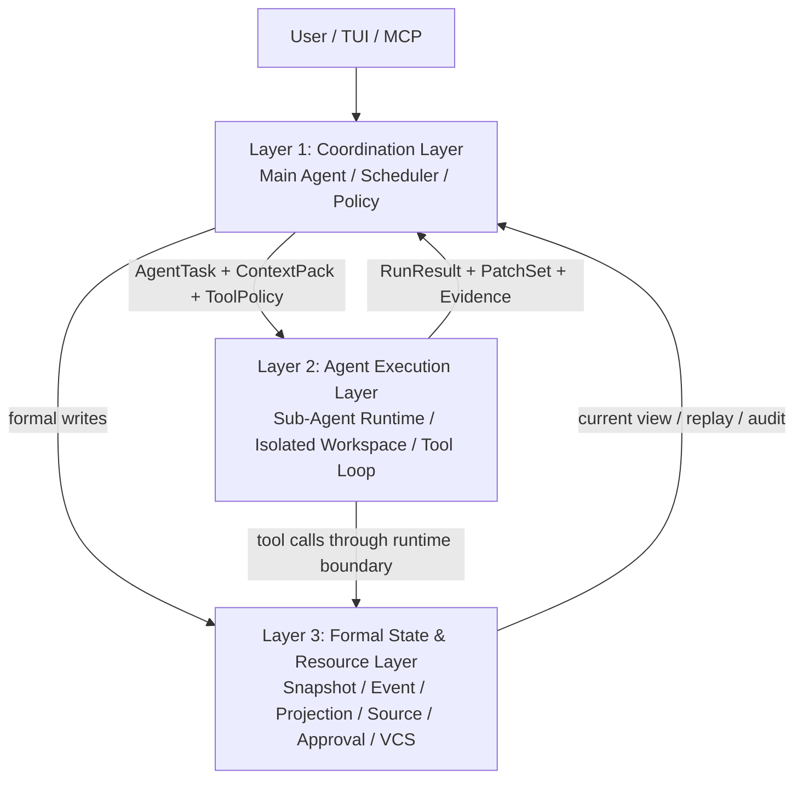

文字摘要：用户入口只驱动 Layer 1；sub-agent 在 Layer 2 的隔离运行时执行任务；所有正式状态、权限、Source 和 VCS 写入都收敛到 Layer 3 的 Runtime 边界。

| 层 | 职责 | 明确禁止 |
|----|------|----------|
| **Layer 1：Coordination Layer** | 主 Agent、Intent/Plan review、Scheduler、DAG、sub-agent lifecycle、policy routing、merge decision、human review | 不直接写文件；不绕过 Runtime 写正式状态；不持有 provider-private truth |
| **Layer 2：Agent Execution Layer** | Sub-agent 执行单个任务、读取 context pack、调用受限工具、在隔离 workspace 产出 patch/evidence | 不共享可变 transcript；不直接修改主 worktree；不自行批准高风险命令；不直接推进全局 Scheduler |
| **Layer 3：Formal State & Resource Layer** | Snapshot/Event/Projection、JSONL session、Source Pool、CapabilityManifest、approval/sandbox、file history、Libra VCS、audit log | 不嵌入 provider 专属状态机；不把 projection 当不可变历史；不允许非 Runtime 写入口；不把 third-party MCP / skill 当内置可信能力 |

这里的 **Runtime** 沿用本文 Part B 的定义：Runtime 是唯一 formal write 入口，负责写 Snapshot / Event，并同步推进 SQLite projection / derived records。Layer 1 和 Layer 2 都只能通过 Runtime 写正式状态；provider transcript、sub-agent transcript、UI 状态都不是系统真相源。

### 与 Part B 三层状态模型的关系

Step 2 的三层架构不是替代 Part B 的 Snapshot / Event / Projection，而是把它们放入 Layer 3，并明确 Layer 1 / Layer 2 只能通过 Runtime 访问正式状态。

| Part B 状态层 | Step 2 所在层 | 使用方式 |
|------------------|---------------|----------|
| Snapshot | Layer 3 | 存 Intent / Plan / Task / Run / PatchSet / ContextSnapshot / Provenance 的不可变定义 |
| Event | Layer 3 | 记录 AgentRunEvent / ToolInvocation / Evidence / Decision / ContextFrame / RunUsage |
| Projection | Layer 3 | 为 TUI / MCP / resume / diagnostics 提供可重建当前视图 |
| Scheduler / Phase workflow | Layer 1 | 决定何时 spawn sub-agent、何时 join、何时 merge、何时 request human review |
| Provider tool loop | Layer 2 | 只执行被 Layer 1 分配的 AgentTask，不拥有全局真相 |

### Step 2 核心对象

| 对象 | 类型 | 说明 |
|------|------|------|
| `AgentTask[S]` | Snapshot | Layer 1 从已确认 Plan/Task 派生出的 sub-agent 执行单元 |
| `AgentContextPack[S]` | Snapshot | 只读上下文包，包含目标、scope、relevant symbols、allowed tools、acceptance criteria |
| `AgentRun[S]` | Snapshot | 一次 sub-agent 运行定义，绑定 provider/model/workspace/tool policy |
| `AgentPermissionProfile[S]` | Snapshot | 每个 sub-agent 的 allowlist / denylist / approval mode / source access / spawn constraints |
| `AgentBudget[S]` | Snapshot | 每个 sub-agent 的 token、tool-call、wall-clock、source-call 和 cost 上限 |
| `AgentRunEvent[E]` | Event | started / tool_call / blocked / completed / failed / cancelled / timed_out / **budget_exceeded**（CEX-S2-12 完成判定 (3) 输出，含 `dimension` 字段：`token` / `tool_call` / `wall_clock` / `source_call` / `cost`） / **hook_passed** / **blocked_by_hook** / **hook_requested_human** / **blocked_by_hook_failure**（含 `reason` 字段：`unknown_exit_code` / `panic` / `timeout` / `killed_by_signal:<signo>` / `spawn_enoent` / `spawn_eacces` / `needs_human_timeout` / `unspecified`） / **post_tool_review_required**（PostToolUse 阶段所有异常都通过此 variant 表达，由 `reason` 区分） / **workspace_materialized**（CEX-S2-11 输出）。**所有变体都按 unknown-event-safe 序列化** —— 旧 reader 跳过未知 variant，新增 variant 不破坏 replay |
| `AgentPatchSet[S]` | Snapshot | sub-agent 产出的 patch，不直接写主 worktree |
| `AgentEvidence[E]` | Event | 测试、分析、引用、失败原因、usage |
| `RunUsage[E]` | Event | per-`agent_run_id` token / wall-clock / tool-call / cost 聚合事件，与 Step 1.11 `agent_usage_stats` 表共享 schema 字段（`prompt_tokens` / `completion_tokens` / `cached_tokens` / `reasoning_tokens` / `wall_clock_ms` / `provider_latency_ms` / `cost_estimate_micro_dollars` / `tool_call_count`）；ownership：CEX-S2-10 声明 schema + `append_run_usage` Runtime API；CEX-S2-12 在 sub-agent provider 调用结束后写入；CEX-S2-15 risk score 可读取此事件的 dimension 数值（与 `budget_exceeded` 配合） |
| `MergeCandidate[S]` | Snapshot | Layer 1 汇总多个 patch 后形成的候选变更 |
| `MergeDecision[E]` | Event | accept / reject / conflict / request_changes / needs_human_review（snake_case 与其他 variants 一致） |

### 与现有 IntentSpec / Plan / Task / Evidence 的映射

Step 2 不重新发明一套与 `src/internal/ai/intentspec/` 平行的任务系统。新增 Agent 对象只表达“把已确认任务委派给哪个隔离执行单元，以及该执行单元产生了什么结果”。

| Agent 对象 | 与现有对象的关系 | 设计约束 |
|------------|------------------|----------|
| `AgentTask[S]` | 引用现有 `Plan[S]` / `Task[S]`，增加 assignee、workspace、permission profile、budget、context pack 引用 | 不复制 `IntentSpec` / `Task` 的业务字段；Task 定义仍以现有 Plan/Task 为准 |
| `AgentContextPack[S]` | 从 confirmed Intent / Plan / Task / ContextFrame 派生 | 是执行输入快照，不是新的 project memory |
| `AgentRun[S]` | 对应一次 TaskExecutor attempt | 可引用现有 `Run[S]`，或作为 `Run` 的 agent-scoped subtype；不能和 `Run` 形成两套状态机 |
| `AgentPatchSet[S]` | 复用 / 扩展现有 `PatchSet[S]` | patch 仍进入 ArtifactLedger / ValidatorEngine，不直接 apply |
| `AgentEvidence[E]` | 复用现有 `Evidence[E]` schema，增加 `agent_run_id`、`source_agent_type` 等归属字段 | 不创建无法被 Phase 3 / Phase 4 消费的新 evidence 格式 |
| `MergeDecision[E]` | 属于现有 `Decision[E]` 的 agent merge 子类型 | 最终 release decision 仍由 Phase 4 统一处理 |

### Step 2.1：Contracts & Storage

**对应任务卡**：CEX-S2-10（详见上方 Step 2 Runtime 任务卡表，含 Read first / Write set / Verification / 完成判定）。

**目标**：先定义 sub-agent 的正式对象和事件合同，不启动并行。

**执行时机**：这是 Step 2 Runtime 任务，必须等 CP-4 后执行。当前阶段只能冻结对象边界和映射原则，不能在持久化层写入未验证的 runtime schema。

**应该完成的功能：**
- 新增 agent task / run / patch / evidence 的 Rust types。
- 新类型必须优先引用或扩展现有 `intentspec` / Runtime 对象，不得复制 `IntentSpec` / `Task` / `Evidence` 业务字段。
- 扩展 formal write runtime：
  - `write_agent_task`
  - `write_agent_run`
  - `write_agent_permission_profile`
  - `write_agent_budget`
  - `append_agent_run_event`
  - `write_agent_patchset`
  - `append_agent_evidence`
  - `append_merge_decision`（**ownership 分两层**：CEX-S2-13 owns the `MergeDecision[E]` **event-body 字段 schema**（不是 Snapshot——`MergeDecision[E]` 是 Event；这里说的 “schema” 仅指 Event payload 的 field shape：`risk_score` / `conflict_list` / `test_evidence` / `distillable_evidence_ids`），同时 CEX-S2-13 owns 关联的 `MergeCandidate[S]` Snapshot 中的 `review_evidence: Vec<EvidenceId>` 字段（`review_evidence` 属于 `MergeCandidate` Snapshot，不属于 `MergeDecision` Event，但 schema 同卡冻结）；CEX-S2-10 owns the **Runtime write API signature** （即 `append_merge_decision` 函数声明 + `MergeDecision[E]` Event variant 名 + 聚合 ID 字段 `merge_candidate_id + agent_run_ids`），但 event payload 字段类型在 CEX-S2-13 完成前为 stub `Option<MergeDecisionPayloadV0>` 占位；CEX-S2-13 完成后用真实 payload schema 替换。CEX-S2-15 只填值，不改字段名/类型。
- JSONL session 支持 agent event stream。
- 每个 sub-agent run 有独立 transcript path / JSONL stream，主 session 只保存索引、summary 和 formal event。
- Projection 增加 agent run current view。
- TUI / MCP 可以读取 agent run 状态，但不能直接修改。

**验收：**
- 不启动 sub-agent 的情况下，现有单 Agent flow 行为不变。
- agent event replay 可重建 agent run list。
- 缺失 projection 时可由 Snapshot + Event rebuild。
- agent run 能追溯 permission profile、budget、context pack 和 transcript path。

### Step 2.2：Isolated Workspace & Tool Boundary

**对应任务卡**：CEX-S2-11（workspace materialization 三种策略 + 越界拦截）。

**目标**：sub-agent 的写入必须在隔离 workspace 中发生，主 worktree 只接收经过 Layer 1 merge decision 的 patch。

**应该完成的功能：**
- 每个 `AgentRun` 创建独立 workspace：
  - 优先且默认使用 Libra / Git 原生 worktree 或 object-store-aware workspace。
  - 依赖 git-internal crate 提供可恢复的 worktree reservation、checkout materialization、cleanup 和 conflict reporting；缺失能力必须先在 git-internal 层补齐，不在 agent 层手写不完整替代。
  - full copy fallback 只能按下方物化策略阈值触发，默认不得因为 worktree / sparse 实现复杂就复制整个仓库。
  - worktree 不可用时使用 `AgentContextPack` 计算影响范围，执行 sparse checkout / sparse materialization。
  - sparse 仍无法满足写入范围时，任务进入 blocked 状态，而不是偷偷退化为全量 copy。
- Workspace 物化策略必须使用明确阈值，而不是主观判断“大仓库 / 小仓库”：

  | 条件 | 策略 | 说明 |
  |------|------|------|
  | `.git` 小于 1GB 且 worktree 文件数小于 100K | 优先 Libra / Git worktree | 复用 object store，不复制历史。 |
  | worktree 文件数 >= 100K 或 `.git` >= 1GB | sparse checkout / sparse materialization | 只物化 `AgentContextPack` 声明的路径和必要依赖。 |
  | worktree / sparse 都不可用，且用户显式设置 `agent.allow_full_copy = true` | full copy fallback | 仅用于 debug、小 fixture 或紧急兼容；必须记录 warning。 |
  | 任务写入范围超出 sparse 物化范围 | `blocked` | 不偷偷退化为全量 copy，要求 Layer 1 扩展 scope 或重新规划。 |

  每次 workspace 创建都必须向 `AgentRunEvent` 记录 `strategy`、`elapsed_ms`、`materialized_file_count`、`source_repo_size` 和 fallback reason。
- 限制路径访问：
  - file tools 默认只能访问 agent workspace
  - source reads 可通过 Source Pool
  - 禁止 sub-agent 使用主 worktree absolute path
- Tool policy 按角色生成：
  - Explorer：只读工具 + semantic tools
  - Worker：限定 scope 的 `apply_patch` + verification shell
  - Reviewer：只读工具 + test/evidence tools
- sub-agent tool policy 默认 deny；不得默认继承主 Agent 的全部工具、全部 MCP source 或 `allow-all` approval。
- sub-agent 可访问的 Source 必须由 `AgentPermissionProfile` 显式列出 source slug 和 tool pattern。
- sub-agent spawn 也作为工具能力控制：主 Agent 只能创建 policy 允许的 agent type，agent 不能递归无限 spawn。
- 所有 shell 仍经过 Step 1.1 黑名单。
- 所有 approval 仍由 Layer 1 协调，sub-agent 只能发起 request。
- **Hook 物理拦截层**（与 sandbox / approval 并联，不替代）：
  - sub-agent dispatch tool 调用前触发 `PreToolUse` hook event，dispatch 后触发 `PostToolUse` hook event。
  - PostToolUse hook 用于审计、cost attribution、evidence 收集，不应改变工具结果；如需后置否决（例如 secret detection），**仍只通过 PostToolUse + `post_tool_review_required` 事件路径走 Layer 1 review**——本文不引入独立的 `PostToolReview` hook 类型。Step 3.E Hook Harness 升级时若需要专门的 review hook（如 secret-detection 专用 daemon），按 Step 3.E 设计另行加入；Step 2 范围内 PostToolUse 异常 / 拒绝统一通过 `post_tool_review_required` 表达，不存在 `PostToolReview` hook 类型。
  - 用户级 hook（`~/.config/libra/hooks.json`）和项目级 hook（`.libra/hooks.json`）都生效，项目级优先。
  - hook 接入点是 S2-INV-13 的具体落地；Step 3.E Hook Harness 升级时只扩展 hook 类型和 sandbox 模型，不改 sub-agent dispatch path 和下表的 exit-code 语义。

  **Hook exit-code 权威映射表（Step 2 / Step 3 共享，不可单方面修改）：**

  > ⚠️ **作用域**：本表的 “dispatch 被阻止 / 暂停” 语义**只适用于 `PreToolUse`** hook（dispatch 之前触发，可拦截）。`PostToolUse` 失败时 dispatch 已经发生，故 `deny` / `needs-human` 不再阻塞工具结果——而是写 `post_tool_review_required` event 走 Layer 1 review 路径，并将 `reason` 暴露给 UI。

  > **AgentRunEvent 命名约定**（消除 PostToolUse 歧义，**唯一权威规则**）：dispatch 之前的拦截结果一律写 `blocked_by_hook` 系列（`blocked_by_hook` / `hook_requested_human` / `blocked_by_hook_failure`）；dispatch 之后的 PostToolUse 异常或拒绝**不能阻止已发生的工具结果**，统一写 `post_tool_review_required` 并把 `reason` 字段标注异常类型。`blocked_by_hook_failure` 永不出现在 PostToolUse 阶段；PostToolUse 的所有异常（panic / timeout / signal / 等）都通过 `post_tool_review_required` 表达，由 `reason` 字段区分原因。每行最后一列分两段：`PreToolUse 阶段事件 / PostToolUse 阶段事件`。

  | 终止状态 | PreToolUse 决策 | PreToolUse 后续路径 | PostToolUse 决策 | AgentRunEvent / `reason`（Pre / Post） |
  |---------|-----------------|---------------------|------------------|----------------------------------------|
  | exit `0` | `allow` | dispatch 继续；后续 sandbox / approval 仍按各自规则执行 | 通过：审计成功 | `hook_passed` / `hook_passed` |
  | exit `2` | `deny` | dispatch 被阻止；agent 收到结构化拒绝反馈 | `post_tool_review_required`（不撤销已 dispatch 的结果） | `blocked_by_hook` / `post_tool_review_required` (`reason=hook_deny`) |
  | exit `3` | `needs-human` | dispatch 暂停；走 Layer 1 approval（详见下方 Approval 集成约束） | `post_tool_review_required` 同上 | `hook_requested_human` / `post_tool_review_required` (`reason=hook_needs_human`) |
  | exit 其他（含 `1`、负数、`>3`） | `deny`（**fail-closed**） | 等同 exit 2，不视为 “warn 但通过”；安全边界永远偏向拒绝 | dispatch 已发生；只能写 `post_tool_review_required` 转 review，不写 `blocked_by_hook_failure`（仅 Pre 阶段使用） | `blocked_by_hook_failure` (`reason=unknown_exit_code`) / `post_tool_review_required` (`reason=unknown_exit_code`) |
  | panic（process abort / unhandled exception） | `deny`（**fail-closed**） | 同上 | dispatch 已发生；同上 | `blocked_by_hook_failure` (`reason=panic`) / `post_tool_review_required` (`reason=panic`) |
  | timeout（默认 30s，可由 `[hooks].timeout_ms` 覆盖） | `deny`（**fail-closed**） | 同上 | dispatch 已发生；同上 | `blocked_by_hook_failure` (`reason=timeout`) / `post_tool_review_required` (`reason=timeout`) |
  | SIGKILL / SIGTERM / 任何 OS 信号杀死（无 exit code） | `deny`（**fail-closed**） | 同上；不区分被谁杀死 | dispatch 已发生；同上 | `blocked_by_hook_failure` (`reason=killed_by_signal:<signo>`) / `post_tool_review_required` (`reason=killed_by_signal:<signo>`) |
  | spawn 失败：ENOENT（hook 二进制未找到） | `deny`（**fail-closed**） | 同上；启动期 / 运行期均按 deny 处理 | spawn 失败 = 永远不会进入 PostToolUse 阶段（dispatch 前已失败）;**N/A** | `blocked_by_hook_failure` (`reason=spawn_enoent`) / N/A |
  | spawn 失败：EACCES（不可执行） | `deny`（**fail-closed**） | 同上 | 同 spawn_enoent;**N/A** | `blocked_by_hook_failure` (`reason=spawn_eacces`) / N/A |
  | exit `0` 且 stdout 为空 | `allow` | 等同标准 exit 0；hook 不必输出内容即可放行 | 通过 | `hook_passed` (`empty_stdout=true`) / `hook_passed` (`empty_stdout=true`) |
  | exit `2` / `3` 且 stdout 为空 | 仍按 exit code | `deny` / `needs-human`；缺少原因时 `hook_reason: Option<String>` 字段写 `None`（不引入 `reason=unspecified` 关键字——`unspecified` 只在 `blocked_by_hook_failure.reason` 枚举中作为 fallback；`blocked_by_hook` / `hook_requested_human` 用 `hook_reason: None` 表达），UI 提示 “hook 未给出原因” | 同 exit 2/3 行 | PreToolUse: `blocked_by_hook { hook_reason: None }` / `hook_requested_human { hook_reason: None }`；PostToolUse: `post_tool_review_required (reason=hook_deny / hook_needs_human, stdout_truncated="")` |

  - 所有 sub-agent dispatch path 的 hook 处理都按此表执行；Step 3.E Hook Harness 扩展新 hook 类型时必须复用此表，**不允许**对“其他 exit code”、信号终止或 spawn 失败重新定义为 `warn but pass`。
  - 测试覆盖：`tests/ai_subagent_hook_dispatch_test.rs` 至少 **10 个 fixture**：exit 0 / exit 0 + 空 stdout / exit 2 / exit 3 / exit 1（unknown）/ panic / timeout / SIGKILL / spawn_enoent / spawn_eacces（spawn_eacces 可与 spawn_enoent 共享 setup 但断言 `reason=spawn_eacces`，确保表中列出的所有 `reason` 值都有对应断言）。每条 fixture 断言对应 `AgentRunEvent` 类型与 `reason` 字段；**phase 覆盖**：能进入 PostToolUse 的 8 种状态（exit 0 / exit 0 + 空 stdout / exit 2 / exit 3 / unknown exit / panic / timeout / SIGKILL）必须各跑一次 PreToolUse 与一次 PostToolUse；`spawn_enoent` / `spawn_eacces` 因 dispatch 前 hook 进程已失败，**只跑 PreToolUse**（PostToolUse phase 不可达，标 N/A），且断言尝试以 PostToolUse 模式跑时 dispatcher 立即进入 PreToolUse 失败路径，不会出现 `post_tool_review_required` event。

  **needs-human (exit 3) Approval 集成约束**（**仅适用于 PreToolUse exit 3**——这是唯一进入 Approval 路径的 hook outcome；PostToolUse exit 3 因 dispatch 已发生不阻止工具结果，按表内规则写 `post_tool_review_required` (`reason=hook_needs_human`)，**不进入 Approval cache 或 Approval 流**，由 Layer 1 review UI 单独处理；其他 exit code 不命中 cache）：

  - **ApprovalKey 必须包含 hook 身份 + Step 1.6 全部 scope / blast-radius 字段**，避免一个 hook 的批准被另一个 hook 或不同 scope 复用。最终 key 形式：
    ```
    ApprovalKey = hash(
        // Step 1.6 mandatory fields (不可省略 — 详见 Step 1.6 Approval TTL 与细粒度记忆 节)
        sensitivity_tier        // Strict / Directory / Pattern
        + scope                 // session / project / user
        + tool_name
        + canonical_args        // argv[0] + sorted flags + normalized args
        + cwd                   // 或 Directory tier 下的父目录
        + sandbox_scope
        + target_path           // 受影响文件路径
        + protected_branch      // 涉及 protected branch 时
        + source_slug           // 涉及 Source Pool 时
        + network_domain        // 涉及外发请求时
        + workspace_id          // 隔离 workspace 时
        // Step 2 hook-specific 扩展
        + hook_path             // PreToolUse hook 路径
        + hook_checksum         // 二进制 SHA-256
        + hook_reason_hash      // hook stdout 摘要
    )
    ```
  - 含义：(1) **Step 1.6 字段不可省略**——hook approval 仍受 Strict/Directory/Pattern 敏感度分级、scope、blast-radius 约束；任何一个字段缺失或变化都视为新 key。(2) **hook 字段在 Step 1.6 之上叠加**：`hook_path` / `hook_checksum` 任一变化都视为新 key（即使 Step 1.6 字段全部相同），保证一个 hook 的批准不会被另一个 hook 复用。
  - **Notification fan-out**：`hook_requested_human` 事件同时投递到 (1) TUI（active session）的 approval prompt、(2) Web client（如果连接同 thread）、(3) MCP client 通过 `libra://agents/runs/{id}/permissions` 资源；三处 UI 都展示 `agent_id` / `task_id` / `tool_call` / `hook_path` / `hook_reason`（截断 stdout）。
  - **等待超时**：默认 `[hooks].needs_human_timeout_ms = 600000`（10 分钟）。超时未响应视为 `deny`（fail-closed），写入 `AgentRunEvent::blocked_by_hook_failure / reason=needs_human_timeout`。可由 config 覆盖，但**最大值不得超过 1 小时**——超过 1 小时只能通过手动取消 / 重启 sub-agent 处理。
  - **多 client 并发**：第一个响应（accept / deny）赢；其他 client 收到 `approval_resolved_by_other` 通知，UI 关闭对应 prompt。Sub-agent 不能批准自己的 approval（S2-INV-06），`agent_run_id` 与 approval requester 不能相同。
  - **No-cache 名单**（**与 [Step 1.6 No-cache 名单](#step-16approval-ttl-与细粒度记忆m54)字段顺序与措辞一致，下面 4 条逐字复用 Step 1.6 文本**，仅追加 `（含 hook approval）` 注释说明 Step 2 hook approval 同样适用）：
    - Step 1.1 黑名单命令（OS 危险命令、Libra 破坏性子命令）。
    - 涉及 protected branch（`main` / `master` / `trunk` / `develop` / `release/*` 与 `[approval].protected_branches` 配置）的所有 mutating 操作（含 hook approval）——即使 `Pattern` 模板看起来匹配也不缓存。
    - blast-radius 字段含外发网络域名（`network_domain` 非空）且未在 `[approval].cacheable_domains` 白名单内的请求。
    - Step 2 sub-agent hook approval reason 中含 `secret_leak` / `cred_exposure` / `pii` 关键字的请求。

    任何一类 No-cache 触发都不进入 `ApprovalMemo`，即使 `ApprovalKey` 完全匹配旧 cache。

**验收：**
- sub-agent patch 不会直接修改主 worktree。
- 越界 path 访问被拒绝。
- mutating tool 在 Explorer / Reviewer policy 下不可见且不可执行。
- 未声明的 MCP source / plugin skill 不会出现在 sub-agent tool definitions。
- 大型 monorepo 场景不会全量复制仓库；workspace 创建记录使用 worktree / sparse / blocked 的原因和耗时。
- sparse workspace 中访问未授权路径时返回可读错误，并提示需要扩展 `AgentContextPack` scope。
- `PreToolUse` hook 返回 `deny` 时，对应 tool call 在 dispatch 之前被拦截，AgentRunEvent 写入 `blocked_by_hook` 含 hook 路径和返回值。
- PreToolUse hook 的 exit code 严格按 [Step 2.2 权威映射表](#step-22isolated-workspace--tool-boundary)处理（dispatch-blocking 语义只适用于 PreToolUse；PostToolUse 见下方分相说明）；测试覆盖 **10 个终止状态**（表中独立 fixture 行 10 行，外加 “exit 2/3 + 空 stdout” 是这两个 fixture 的边界子用例不计入 fixture 数）：exit 0 / exit 0 + 空 stdout / exit 2 / exit 3 / exit 1（unknown）/ panic / timeout / SIGKILL / spawn_enoent / spawn_eacces，每条断言 `AgentRunEvent` 类型与 `reason` 字段。
- 任何 capability package、third-party MCP source、sub-agent definition 都无法关闭 hook 拦截；尝试关闭时加载失败。

### Step 2.3：Single Sub-Agent Behind Flag

**对应任务卡**：CEX-S2-12（flag-gated runtime + flag-off 字节级回归）。

**目标**：先支持主 Agent 委派一个 sub-agent，以串行方式验证架构边界。

**应该完成的功能：**
- 新增 feature flag / config：`code.sub_agents.enabled = false` 默认关闭。
- Layer 1 可把一个 approved task 转换为 `AgentTask + AgentContextPack`。
- Layer 2 运行一个 sub-agent tool loop。
- sub-agent 返回 `AgentPatchSet + AgentEvidence + RunUsage`。
- 支持按 agent type 选择模型：Explorer 默认 fast/cheap model，Worker / Reviewer 可 inherit 主模型或显式指定。
- 每个 run 强制执行 `AgentBudget`，超出 5 个 dimension（`token` / `tool_call` / `wall_clock` / `source_call` / `cost`）任一上限时写 `AgentRunEvent::budget_exceeded`（snake_case，与权威 variant 名一致）含 `dimension` 字段。
- Layer 1 负责（**注意：apply-to-main 路径属于 CEX-S2-13，不是本 Step**）：
  - 展示 summary（本 Step 完成）
  - 决定 accept/reject 调用 Runtime API 的入口（本 Step 完成）；**`Decision[E]` / `MergeDecision[E]` event payload 字段形状（`risk_score` / `conflict_list` / `test_evidence` / `distillable_evidence_ids`）+ `MergeCandidate[S]` Snapshot 中的 `review_evidence` 字段由 CEX-S2-13 owns**——CEX-S2-12 / CEX-S2-15 都不允许 mutate 字段名/类型，只填值；CEX-S2-12 完成时 schema 字段在 stub 形态（`Option<MergeDecisionPayloadV0>`，与 line 1579 的 ownership 备注一致），CEX-S2-13 后用真实 payload schema 替换
  - **`accepted patch apply 到主 workspace` 必须等 CEX-S2-13 human-gated merge candidate 实现后才启用**——CEX-S2-12 范围内 accepted 状态只是写入 schema，主 worktree 0 字节变化（断言 `git diff --quiet`）
  - 触发验证（验证产物属于 CEX-S2-15 ValidatorEngine）

**验收：**
- flag 关闭时完全走 Step 1 单 Agent 路径。
- flag 开启但 `max_sub_agents=1` 时，结果可审计、可 replay、可 rollback。
- sub-agent 失败不会破坏主 session。

### Step 2.4：Controlled Parallel Execution

**对应任务卡**：CEX-S2-13（human-gated MergeCandidate）+ CEX-S2-14（disjoint scope 并行 + observability）。

**目标**：在 isolation、approval、formal writes 验证后，允许多个独立 sub-agent 并行处理不冲突任务。

**应该完成的功能：**
- Scheduler 根据 Plan DAG、file scope、resource scope 判断可并行任务。
- 默认并行度保守，例如 `max_sub_agents = 2`。
- 写 scope 冲突时串行化。
- 同文件 patch 冲突进入 merge review，不自动覆盖。
- 支持取消、超时、budget limit。
- Event stream 记录每个 agent 的 lifecycle。
- Source Pool 按 source slug 执行并发限制，避免多个 sub-agent 同时打爆同一 MCP / REST 后端。
- 每个 tool call 追加 trace id：`thread_id -> agent_run_id -> tool_call_id -> source_call_id`。
- per-agent cost attribution：token、tool latency、source bytes、MCP calls 都归属到 agent run。

**验收：**
- 两个 disjoint file scope 的任务可并行。
- 两个相同 file scope 的 worker 自动串行或进入 conflict。
- 任一 sub-agent timeout 不影响其他 agent 完成和主 session 恢复。
- 并发 source 调用受限流控制，超限时排队而不是失败风暴。

### Step 2.5：Merge, Review & Validation

**对应任务卡**：CEX-S2-15（Validation pipeline + risk score corpus + auto-merge feature flag 默认关）。

**目标**：sub-agent 的输出必须经过 Layer 1 统一合并和验证，不能把“多个 agent 都说完成”当作完成。

**应该完成的功能：**
- `MergeCandidate` 聚合一个或多个 `AgentPatchSet`。
- Step 2 初期所有 `MergeCandidate` 默认进入 `needs_human_review`，sub-agent patch 被视为内部 Pull Request：
  - 主 Agent 生成 change summary、risk summary、test evidence、conflict summary。
  - 用户确认后才 apply 到主 workspace。
  - Auto-merge 只作为后续 feature flag，必须在稳定期和指标达标后逐步放开。
- 语义冲突检测：
  - 同文件重叠 hunk
  - 修改同一 symbol
  - 测试/配置/lockfile 交叉修改
- Layer 1 触发 test DAG / verification commands。
- Reviewer sub-agent 可作为只读验证者，但最终 decision 仍由 Layer 1 / human review 产生。
- Phase 4 risk score 纳入（**与 CEX-S2-15 完成判定 (1) 一致**）：
  - sub-agent 数量
  - conflict 次数
  - failed run 次数
  - unverified patch scope
  - `AgentRunEvent::budget_exceeded` 事件总数（按 `dimension` 拆分：`token` / `tool_call` / `wall_clock` / `source_call` / `cost`，权重 token/cost 最高，wall_clock 次之）

**验收：**
- 任意 `MergeCandidate` 初期都不自动 apply，必须经过用户确认。
- conflict patch 不自动 apply。
- validation fail 可路由回具体 `AgentTask`。
- final decision 写入 `Decision[E]`，不是 provider-private transcript。
- 开启实验性 auto-merge flag 前，必须有连续基准任务的冲突率、回滚率和验证通过率报告。

### Step 2.6：UI / MCP Observability

**对应任务卡**：CEX-S2-16（agent pane + `/agents` slash + 6 个 MCP resource）。

**目标**：用户能理解 sub-agent 正在做什么、改了什么、为什么被阻塞。

**应该完成的功能：**
- TUI 增加 agent run pane：
  - queued / running / blocked / completed / failed
  - current tool / current file / elapsed / token usage
  - budget remaining / cost estimate / source calls
  - transcript path / context pack hash / permission profile
- `/agents` 显示当前 sub-agent 状态。
- `/agent cancel <id>` 取消单个 agent run。
- MCP resource 增加：
  - `libra://agents/runs`
  - `libra://agents/runs/{id}`
  - `libra://agents/merge-candidates/{id}`
- MCP resource 增加 source / permission 视图：
  - `libra://agents/runs/{id}/permissions`
  - `libra://agents/runs/{id}/budget`
  - `libra://agents/runs/{id}/context`
- blocked approval 请求显示 agent id / task id / command / scope。

**验收：**
- 用户能取消单个 sub-agent，不结束主 session。
- replay 后 UI 可恢复 agent run 状态。
- approval prompt 能看出请求来自哪个 agent。
- 用户能看出每个 sub-agent 消耗的 token、source calls 和失败原因。

### Step 2.7：Capability Package / Plugin Trust

**对应任务卡**：CEX-S2-17（manifest schema + permission diff + 二次确认 + 卸载清理）。

**目标**：把 skills、commands、sources、sub-agent definitions 作为可审计的能力包管理，避免生态扩展绕过 Source Pool 和 permission model。

**应该完成的功能：**
- 新增本地 capability package manifest：
  - package id / version / publisher / checksum
  - bundled skills
  - bundled commands
  - bundled sources / MCP servers
  - bundled sub-agent definitions
  - requested permissions
  - install-time warnings
- 安装或启用 package 时展示 capability diff：新增哪些 tool、source、agent type、hook event、network domain、credential ref。
- package 默认不能启用 mutating source 或 Worker sub-agent；必须由项目配置或用户确认。
- package 更新时重新计算 checksum 和 permission diff。
- package 内的 sub-agent definitions 必须走 Step 2.2 的 `AgentPermissionProfile`，不能通过 frontmatter 继承全部工具。

**验收：**
- 未启用的 package 不会注册 tools / sources / skills / agents。
- package 更新新增 mutating capability 时必须重新确认。
- package 卸载后相关 tool definitions、source connections、agent definitions 消失。

### Step 2.8：Evidence → Memory Distillation 接入点

**对应任务卡**：CEX-S2-18（read-only evidence query API + 字段冻结 + flag-off 不持久化）。

**目标**：让 sub-agent 产生的 evidence 不止用于当前 Run / Merge Decision，也作为未来 Step 3.D 跨 session Memory Distillation 的可信原料。**Step 2 不实现 distillation 本身**，但必须把 evidence schema 设计成可被未来 distillation 直接消费的形态，避免 Step 3 启动时回头改 evidence schema 破坏 Step 2 出口的兼容性。

这是 S2-INV-12「sub-agent evidence 保留 raw fact 链」的具体落地。

**应该完成的功能（Step 2 范围）：**
- `AgentEvidence` schema 必须携带 raw reference 字段：
  - `source_event_id: EventId` — 指向 JSONL 中的原始事件
  - `tool_call_id: Option<ToolCallId>` — 如来自 tool 调用
  - `source_call_id: Option<SourceCallId>` — 如来自 Source Pool 调用
  - `confidence: Confidence` — sub-agent 自评 + 验证结果
  - `applies_to_scope: AnchorScope` — `session` / `agent_run` / `project`，与 [Step 1.9 MemoryAnchor scope](#step-19context-budget-与-compaction-最小闭环) 对齐
  - `distillable: bool` — sub-agent 显式标记本条 evidence 是否值得作为 future memory anchor 的候选
- 提供 read-only 查询接入点（不实现 distillation 本身）：
  - `evidence_query_by_scope(scope: AnchorScope) -> Vec<AgentEvidence>`
  - `evidence_stream(filter: EvidenceFilter) -> impl Stream<Item = AgentEvidence>`
  - `merge_decision_distillable_evidence(decision_id) -> Vec<EvidenceId>`
- Layer 1 写 `MergeDecision` 时附带「值得提炼的 evidence ID 列表」。Step 2 范围内只是记录该列表，不触发任何 distillation 流程。
- 接入点必须 stable：未来 Step 3.D Memory Distillation 加入时，应只新增订阅者，不修改 schema 字段。

**Step 2 不做的：**
- 自动 distillation pipeline。
- AI 摘要生成 anchor。
- 跨 session 自动加载提炼 anchor。
- 语义检索 / embedding index。

**验收：**
- 任意一个 `AgentEvidence` 都可以追溯到 JSONL 事件源，单元测试覆盖。
- evidence query API 可被 unit test 调用，不依赖 Memory Distillation 实现。
- `MergeDecision` 写入时如果 sub-agent 标记了 `distillable evidence`，记录对应 evidence ID 列表，可由 projection 读出。
- evidence schema 在 sub-agent flag 关闭时不出现在主 session 持久化中（保持 Step 2 兼容性）。

### Step 2 出口标准

每条出口标准都映射到 1-2 张 CEX-S2-* 任务卡和一个 CP-S2-* checkpoint。CP-S2-5 通过即视为 Step 2 整体出口达成。

| 类别 | 标准 | 对应 CEX-S2-* | 对应 Checkpoint |
|------|------|---------------|----------------|
| 兼容性 | sub-agent flag 关闭时，Step 1 单 Agent 行为和测试保持不变（**[CP-S2-3 三类比较](#cp-s2-3-flag-off-等价测试规范)**：cargo test --all pass/fail 等价 vs `CP4_BASELINE_COMMIT`；CEX-00 baseline 测试套件字节级等价 vs `CEX00_BASELINE_COMMIT`（默认 `48ea0ae`）；mock smoke `.libra` 字节级等价 vs `CP4_BASELINE_COMMIT`） | CEX-S2-12（flag-off regression） | **CP-S2-3（真实 flag-off 等价）**；CP-S2-2 仅保证 schema-only 字节级等价（标志尚未引入），不视为本行验收依据 |
| 隔离 | sub-agent 默认不写主 worktree；所有 patch 经过 merge decision | CEX-S2-11、CEX-S2-13 | CP-S2-3 |
| 状态 | agent task / run / patch / evidence / decision 可由 Snapshot + Event replay | CEX-S2-10、CEX-S2-15 | CP-S2-2 / CP-S2-4 |
| 安全 | sub-agent 不能绕过 Step 1.1 黑名单、approval TTL 和 allowed_tools；hook 严格按 [Step 2.2 Hook exit-code 权威映射表](#step-22isolated-workspace--tool-boundary)处理（fail-closed 默认） | CEX-S2-10（PreToolUse / PostToolUse schema）、CEX-S2-12（flag-on hardening + dispatch + needs-human 集成） | CP-S2-3 |
| 并发 | disjoint scope 可并行；冲突 scope 不自动覆盖；source slug 限流 | CEX-S2-14 | CP-S2-4 |
| 可观测性 | TUI / MCP 可查看 agent run、blocked approvals、merge candidates；与 CEX-16 用量 TUI 三层展示对齐 | CEX-S2-16 | CP-S2-5 |
| 恢复 | kill -9 后可 resume 到最后完整 agent event；删除 cache 后可 rebuild | CEX-S2-10（unknown-event-safe）、CEX-S2-16（snapshot test） | CP-S2-2 / CP-S2-5 |
| Schema 兼容 | sub-agent event / package event 对旧 reader unknown-event-safe；关闭 sub-agent flag 后历史 agent run event 仍可读取为 archived diagnostics | CEX-S2-10、CEX-S2-18 | CP-S2-2 / CP-S2-5 |
| 回滚 | `code.sub_agents.enabled=false` 可完全禁用 spawn / merge / UI agent pane 写路径，保留只读历史查看 | CEX-S2-12 | CP-S2-3 |
| 生态治理 | capability package / third-party source 默认不可信，启用前有 manifest、checksum 和 permission diff | CEX-S2-17 | CP-S2-5 |
| Step 3.D 衔接 | sub-agent evidence 字段 stable，read-only query API 可消费；不实现 distillation | CEX-S2-18 | CP-S2-5 |

**CI 机制：**
- Step 2 开始后新增 required check `step1-regression`，在 `code.sub_agents.enabled = false` 配置下运行完整 `cargo test --all --all-features`。
- 任何修改 `src/internal/ai/` 共享组件（ToolLoop、Session Store、ApprovalStore、Source Pool、Runtime、Projection）的 Step 2 PR，必须证明 flag-off 路径仍满足 Step 1 行为基线。
- 若 Step 2 PR 有意改变 Step 1 行为，必须同时更新 Step 1 回归测试、迁移说明和本文件 Changelog；否则需要架构 review 明确豁免。

---

## Step 2 之后的 Harness 维度扩展（Step 3 候选）

参考 [PandaTalk8 Harness Engineering 9 维度框架](https://x.com/PandaTalk8/status/2048306100882305358)，Step 2 出口后仍有 4 个 Harness 维度未覆盖：自驱循环、跨通道路由、持久服务、双层记忆。Hook 系统也需要从「lifecycle 事件源」升级为「Harness 一等屏障」。

本节是 Step 3 候选的**初步轮廓**，仅作设计预案。本文不冻结字段、API 或交付时间。Step 2 完成时应回头确认这些预案是否仍合理；如启动 Step 3，开新文档（如 `docs/improvement/agent-step3.md`）正式落地。

### Step 3 候选概览

| 候选 | 目标 | 主要依赖 | 优先级 |
|------|------|---------|--------|
| Step 3.A | Event-Driven 自驱循环（Cron / Heartbeat） | Step 1.10 automation + Step 2 sub-agent runtime | P1 |
| Step 3.B | Cross-Channel 路由（TUI / Web / MCP / IM 平等） | Step 2.6 UI/MCP + Step 1.10 多客户端隔离 | P1 |
| Step 3.C | Persistent Service Mode（daemon） | 现有 web server + Step 3.A + Step 3.B | P2 |
| Step 3.D | Memory Distillation（双层记忆） | Step 1.8 JSONL + Step 1.9 MemoryAnchor + Step 2.8 evidence 接入点 | P1 |
| Step 3.E | Hook Harness 物理屏障升级 | Step 2.2 PreToolUse 拦截 + Step 1.10 hook 配置 | **P0** |

### Step 3.A：Event-Driven Harness（自驱循环）

**为什么需要**：Libra 当前所有 agent 行为都是「用户输入 → 响应」。OpenClaw 风格的横向型 Harness 强调 agent 可主动醒来执行任务（凌晨爬数据、每小时检查库存）。

**核心想法**：
- **Cron**：周期性触发已确认的 IntentSpec / Plan / 自动化规则。
- **Heartbeat**：固定间隔（如 5 / 15 / 60 分钟）跑一次 health-check / monitoring agent，自动决定是否需要后续 sub-agent。
- **Webhook**：外部事件（git push、CI 失败、issue 创建）触发 agent run。

**与 Step 2 关系**：
- Step 1.10 automation 的 cron 已覆盖**外部事件触发**。Step 3.A 把 cron / heartbeat 升级为 **agent 自身的驱动循环**——agent 自主醒来后调用 Step 2 sub-agent runtime。
- 必须复用 Step 2 sub-agent 安全边界，不允许 cron 触发的 agent run 绕过 approval / 工具 boundary。
- 接入点：S2-INV-11 channel-agnostic lifecycle event。

### Step 3.B：Cross-Channel Routing（多通道）

**为什么需要**：Libra 已支持 TUI、Web client、MCP stdio。当前 Step 2.6 把 UI/MCP 视为只读观测者，但实际场景中三者是平等的「channel」——任意 channel 都可以发起 agent run、订阅状态、给 approval。

**核心想法**：
- 抽象 **Channel** 概念：TUI、Web、MCP、未来的 IM bot 都是 channel。
- 每个 channel 有独立的 approval handler、消息队列、用户身份验证。
- **Channel Scope 配置**（参考 OpenClaw 的 `sandbox.scope` 和 `dmScope`）：
  - `sandbox.scope = agent | session`：同 agent 多 session 是否共享上下文
  - `channel.scope = unified | per-channel`：同用户多 channel 消息是否合并

**与 Step 2 关系**：
- Step 1.10 「多 session / 多客户端隔离」是雏形。
- Step 2.6 UI / MCP Observability 假设 TUI / MCP 平等，但没有正式 Channel 抽象。Step 3.B 把 Channel 抽象提为一等公民。
- 接入点：S2-INV-11；Step 2.6 的 `libra://agents/runs/{id}` MCP resource 需 channel-aware。

### Step 3.C：Persistent Service Mode（持久在线 daemon）

**为什么需要**：当前 `libra code` 是「关掉终端就停」。横向型 Harness 要求 24/7 在线，多客户端共享 sub-agent runtime、Source Pool、approval store。

**核心想法**：
- daemon 进程托管 sub-agent runtime、Source Pool、approval store。
- 客户端（TUI / Web / IM bot）通过本地 socket / RPC 连接 daemon。
- daemon 内部仍受 Step 1 / Step 2 安全边界约束。
- 只有 daemon 模式下才能跑长时 cron / heartbeat。

**与 Step 2 关系**：
- 当前 `libra code` 的 web server 模式（CLAUDE.md 提及）是雏形。
- Step 3.C 把 web server 升级为正式 daemon 抽象，多客户端可挂载。
- 必须依赖 Step 3.A + Step 3.B 完成。

### Step 3.D：Memory Distillation（双层记忆）

**为什么需要**：当前 [Step 1.9](#step-19context-budget-与-compaction-最小闭环) 的 MemoryAnchor 是「应用层 anchor」，需要用户或 agent 显式 draft / confirm。OpenClaw 风格的双层记忆让 AI 自动从 JSONL 事实日志中渐进提炼，3 个月内化用户风格。

**核心想法**：
- **Layer 1：JSONL 事实日志**（已落地于 [Step 1.8](#step-18jsonl-session-存储m53)）
- **Layer 2：AI 提炼记忆**（扩展 Step 1.9 MemoryAnchor）
  - 触发条件：跨 N 次 session 出现的模式、用户明确的偏好声明、sub-agent evidence 中 `distillable=true` 的条目（来自 Step 2.8 接入点）。
  - distillation 是离线 / 后台任务，不在主 tool loop 同步执行。
  - 提炼出的 anchor 必须保留 `source_event_id` 链，可被人工审计和回滚。
- **Layer 3：语义检索**（新增）
  - 在 JSONL 之上叠加 embedding index。
  - 调用记忆时混合关键词 + 语义相关性。
  - 默认禁用，需用户启用 `[memory.semantic_search] enabled = true`。

**与 Step 2 关系**：
- Step 2.8 已预留 evidence read-only 接入点（S2-INV-12）。
- Step 1.9 MemoryAnchor 的 confidence / scope / review_state 字段是 distillation 输出的目标 schema，无需新建。

**风险红线**：渐进学习容易产生「错误人格」（agent 错误内化用户偶尔的口误）。Step 3.D 必须强制：
- 任何 auto-distilled anchor 默认 `review_state = draft`，需用户确认才能用作 prompt budget。
- distillation pipeline 输出可全量回滚（按 distillation_run_id）。
- 用户可随时把 anchor 强制 `revoke`。

### Step 3.E：Hook Harness 物理屏障（P0）

**为什么需要**：Step 2.2 已经把 PreToolUse / PostToolUse hook 加入 sub-agent dispatch 路径（S2-INV-13）。但 Libra 当前的 hook 配置（`.libra/hooks.json`）仍偏向「lifecycle 事件源」语义。Step 3.E 把 hook 升级为「Harness 一等屏障」，提供企业级强约束。

**核心想法**：
- 用户 / 项目可声明的 hook 类型扩展：
  - `PreToolUse` / `PostToolUse`（已在 Step 2.2 落地）
  - `PreSubagentSpawn` / `PostSubagentStop`（spawn 控制）
  - `PreSourceCall` / `PostSourceCall`（Source Pool 流量审计）
  - `PreCompletion` / `PostCompletion`（provider 调用前后审计）
  - `PreApproval` / `PostApproval`（approval 审计）
- hook 用 shell 脚本 / WASM 实现，stdin 是 event JSON，exit code 决定行为；**完整映射见 [Step 2.2 Hook exit-code 权威映射表](#step-22isolated-workspace--tool-boundary)**：
  - `0` = `allow`（dispatch 继续）
  - `2` = `deny`（显式拒绝）
  - `3` = `needs-human`（走 Layer 1 approval）
  - 其他 exit code（含 1）= `deny`（**fail-closed**）；Step 3.E 沿用 Step 2.2 安全语义，不引入“warn 但通过”
- panic / timeout 同上 fail-closed（参考 Step 2.2 表）。
- 这层 hook **独立于 sandbox / approval**，提供企业级强约束（如 secret detection、CC 数据检测、内部网络限制）。

**与 Step 2 关系**：
- Step 2.2 的 PreToolUse 拦截是 Step 3.E 的子集，且 schema 已 stable。
- Step 1.10 automation 的 hook 是 lifecycle 事件源（reactive），Step 3.E 是 active interceptor，两者并联。

**为什么 P0**：Hook Harness 是 sub-agent 安全模型的最后屏障。如果 Step 2 出口后立刻进入 Step 3.A（Event-Driven）或 Step 3.C（Persistent Service），都会扩大攻击面，hook 物理屏障必须**在 Step 3 其他维度之前**完成。

### Step 3 候选与 Step 2 出口的衔接

Step 2 出口标准**不**要求 Step 3 候选完成，但要求：

| 衔接项 | Step 2 出口前必须 | Step 2 出口后状态 |
|--------|------------------|-------------------|
| S2-INV-11 channel-agnostic event | Step 2.1 / 2.6 schema 不绑定 TUI | Step 3.A / 3.B 可直接订阅 |
| S2-INV-12 evidence raw fact 链 | Step 2.8 字段固化 | Step 3.D 直接消费 |
| S2-INV-13 hook 拦截点 | Step 2.2 落地 PreToolUse / PostToolUse | Step 3.E 仅扩展类型，不改 dispatch path |
| Channel 接入预留 | Step 2.6 MCP resource 接受 channel hint | Step 3.B 把 channel 升级为一等公民 |

如发现 Step 2 设计违反这些衔接项，必须先更新 Step 2 设计再进入 Step 2 实现，**不允许**先实现再回头改 schema。

---

## 总时间线建议

下面按 1-2 名熟悉代码库的核心开发者估算。本节经过 2026-05-02 代码基线核对（见 [Changelog](#changelog)）后修订：CEX-00.5、CEX-02、CEX-03、CEX-12.5 已经降低了抽象冻结、shell / `run_libra_vcs` safety gate 与 migration runner 的不确定性，但 Step 1.8 / 1.9 仍要承担 JSONL append-only 与 ContextFrame / MemoryAnchor 的持久化复杂度，Step 1.10 仍有 Source Pool、automation history 和 approval scope 的组合风险。原 11.5 - 16.5 周仍属于偏乐观排期；保守里程碑继续把多语言语义工具拆到 Rust MVP 之后，并要求后续功能 Step 复用已冻结的 CEX-00.5 / CEX-12.5 抽象。

单步估算内含 design / implementation / test / docs / self-review，不含外部 code review 排队和跨团队等待时间。表中周数仍按核心开发时间估算；每个里程碑需额外预留 **35% - 45%**（原 20-30%，已上调）用于安全绕过测试、review 修订、README / CLI help / 配置示例同步，以及 Step 1.1、Step 1.6、Step 2.2 的内部安全 review。

| 阶段 | 内容 | 原估时 | 修订估时 | 修订原因 |
|------|------|--------|----------|----------|
| Step 1.0 | 当前基线收口与测试保护 | 0.5 周 | 0.5 周 | — |
| Step 1.0.5 (CEX-00.5) | `AuditSink` trait + 顶级 `Snapshot` / `Event` 抽象冻结 | — | 0.5 - 1 周 | 新增；下游 1.1 / 1.6 / 1.8 / 1.9 / 1.11 / Step 2 都依赖 |
| Step 1.1 | 安全权限门、`run_libra_vcs` 参数级 safety、shell AST / capability profile | 含 1.1-1.2 共 2-3 周 | **已完成（CEX-01/02/03）** | CEX-02 已完成 `run_libra_vcs` classifier；CEX-03 已完成 shell dispatch gate 与 needs-human approval reason；audit / approval scope 串联继续归 Step 1.6 hardening |
| Step 1.2 | LLM JSON repair + provider 公共解析点 | 含 1.1-1.2 共 2-3 周 | **已完成（CEX-04/05）** | provider-neutral repair core 已抽出；OpenAI-compatible 家族与 Ollama 的 string-argument tool-call parse path 已统一接入 repair，Anthropic / Gemini 保持结构化 tool input |
| Step 1.3a | Rust-only Semantic Tools MVP | 1.5 - 2.5 周 | **已完成（CEX-06/07）** | tree-sitter-rust query + approximate / confidence 标注合同、default tool handlers、registry 接入和 prompt 引导已落地；跨文件 / 多语言语义扩展后移到 Step 1.3b |
| Step 1.4 | 分类器、动态 prompt、intent tool policy | 1.5 - 2 周 | 2 - 2.5 周 | CEX-09 把分类器调用与动态注入塞同卡，跨度偏大 |
| Step 1.5 | 文件 Undo | 含 1.5-1.8 共 3-4 周 | 1 - 1.5 周 | 边界清晰 |
| Step 1.6 | Approval TTL + canonical key | 含 1.5-1.8 共 3-4 周 | 1.5 - 2 周 | scope / blast radius schema 是新设计 |
| Step 1.7 | Markdown Skill 系统 | 含 1.5-1.8 共 3-4 周 | 2 - 2.5 周 | progressive disclosure / scanner / version 元数据 |
| Step 1.8 | JSONL Session 存储 + 迁移 | 含 1.5-1.8 共 3-4 周 | **3 - 4 周** | 活跃 .json session 迁移、并发锁、unknown-event-safe schema 单独都是 1 周量级 |
| Step 1.0.10 (CEX-12.5) | sea-orm schema migration runner | — | 0.5 - 1 周 | 新增；CEX-13b / CEX-15 / CEX-16 复用，避免 4 处 hack `CREATE TABLE IF NOT EXISTS` |
| Step 1.9 | Context Budget + ContextFrame + MemoryAnchor 最小闭环 | 1.5 - 2 周 | **3 - 4 周** | 拆为 CEX-13a / 13b / 13c 三卡；MemoryAnchor 的 confidence / scope / review_state lifecycle 单独就是 1 周 |
| Step 1.10 | Source Pool / Automation 单 Agent 生态 | 3 - 4 周 | **5 - 6 周** | MCP bridge Phase A→B→C 迁移；automation cron / webhook / shell 三种 action；多客户端 approval 隔离需重审 |
| Step 1.11 | 模型用量与耗时统计 | 1 - 1.5 周 | 1.5 - 2 周 | 7 provider 的 usage 字段映射不一致（Anthropic 有，Ollama 经常没有）；price table 维护是长期债 |
| Step 1.3b | TS / JS / Python semantic expansion 或 LSP / LSIF backend 评估 | 2 - 4 周 | 2 - 4 周（可后移） | — |
| Step 2.1 - 2.3 | 三层合同、worktree / sparse workspace、单 sub-agent flag | 3 - 4 周 | 3 - 4 周 | 依赖 Step 1 抽象冻结 |
| Step 2.4 - 2.8 | 受控并行、human-gated merge、validation pipeline、UI/MCP observability、capability package、evidence 接入点 | 4 - 6 周 | 5 - 7 周 | revised 2026-05-01：新增 Step 2.5 / 2.6 / 2.7 / 2.8 task-card detail（CEX-S2-15 / 16 / 17 / 18）后估时上调约 1 周 |

**建议落地顺序**：
1. **抽象冻结优先**：CEX-00 → CEX-00.5（trait）→ CEX-12.5（migration runner）；这两步是后续所有持久化 / 审计 CEX 的硬前置。
2. **Step 2 架构基线并行**：CEX-S2-00 到 CEX-S2-02 可以与抽象冻结并行（不写 runtime）。
3. **安全 / 弱模型基线**：Step 1.1 → Step 1.2 → Step 1.3a → Step 1.4；这条链是 CP-1 / CP-2 / CP-3 的支柱。
4. **持久化与生态**：Step 1.5 → Step 1.6 → Step 1.7 → Step 1.8 → Step 1.9 (a→b→c) → Step 1.10 → Step 1.11；中间 Step 1.7 / Step 1.10 / Step 1.11 是否前置看 release schedule。
5. **Step 2 Runtime** 只能在 CP-4 后启动。多语言 semantic expansion 不应阻塞 Step 1 安全 / 弱模型交付。

**总周期判断（修订后）**：
- Step 1 最小可交付基线（含 CEX-00.5 / CEX-12.5 但不含 1.7 / 1.10 / 1.11 / 1.3b）：约 **15 - 22 周**（原 12-18 周）。
- Step 1 完整生态基线（含全部 CEX-16 与 CEX-12.5，未含 1.3b）：约 **24 - 32 周**（原 18-26 周）。
- Step 2 sub-agent 三层架构（含 CEX-S2-15..18 完整 task-card）：约 11 - 15 周（原 10-14 周；新增 4 张 runtime 卡 + Codex review 协议提升约 1 周）。
- 两步完整落地：约 **35 - 47 周**（原 34-46 周），取决于 Source Pool / Automation、多语言语义工具和安全 review 是否并入同一 release。

**1 - 2 名核心开发者**的实际效果：单人推进按 35-45% buffer 后约 8-11 个月覆盖 Step 1 完整生态；2 人并行（一人安全 / 抽象 / 持久化主线，一人语义 / 分类器 / 用量副线）可压缩到 5-7 个月。

---

## 端到端验证场景

### Step 1 验证

1. **DeepSeek 基线**：`libra code --provider deepseek --model deepseek-chat` 能完成只读问答和简单 bug fix。
2. **JSON 容错**：构造 trailing comma / 单引号 / 缺失逗号 tool args，provider 解析失败后 repair 成功。
3. **安全拦截**：
   - `rm -rf /` 被拒绝。
   - `libra push --force origin main` 被拒绝。
   - `run_libra_vcs { command: "branch", args: ["-D", "main"] }` 被拒绝。
4. **语义理解**：询问 `CompletionModel` trait 的实现者，agent 优先使用 `find_references` / `list_symbols`。
5. **语义边界**：跨文件引用结果显示置信度和 `approximate` 标记，同名 symbol 不被伪装成精确引用。
6. **Memory Anchor**：用户早期约束在 compaction 后仍被加载，撤销 anchor 后 replay 生效。
7. **意图识别**：问“为什么这里要用 Arc？”时只读工具可见，`apply_patch` 不可见。
8. **Undo**：一轮 patch 修改 3 个文件后 `/undo` 全部恢复。
9. **JSONL 恢复**：运行中 kill -9 后 `--resume` 跳过最后不完整行继续。
10. **Context budget**：长 tool result 被外部化为 attachment，prompt 中只保留引用和摘要，`ContextFrame` 可回放。
11. **Source trust**：未启用的 third-party MCP source 不出现在工具列表；启用时显示 capability manifest 和 approval scope。
12. **用量统计**：在同一 session 切换 `claude-sonnet-4-6` → `deepseek-chat` 后，`libra usage report --by=model --since=1h` 与 `/usage` 都能按 model 拆分输出 prompt / completion / reasoning token、wall clock、估算成本；模型调用失败 / 超时各产生一条 `success=0` 记录；retention 配置为 1 天后再次查询历史数据已被清理。
13. **TUI 用量三层展示**：`libra code` 启动后，主聊天面板右上角 L1 header badge 始终展示 `current model + session tokens + wall clock`；发起一次 streaming response 期间 bottom pane L2 行的 token 计数**肉眼可见地实时增长**（每秒至少刷新数次）；调用失败时 L2 立刻切红色显示 `error_kind`，5s 后恢复；键入 `/usage` 弹出 L3 详细面板，可见按 `(provider, model)` 拆分的 prompt / completion / reasoning / cost 行；`[tui.usage] header = "off"` 配置生效后 L1 消失但 L2 / L3 仍可用；`hide_cost = true` 后 cost 字段从三个层次同时消失但 token / 耗时仍显示。

### Step 2 验证

1. **Flag 兼容**：sub-agent disabled 时所有 Step 1 测试保持通过。
2. **单 sub-agent**：主 Agent 委派一个只读 explorer，返回 evidence，不修改主 worktree。
3. **Workspace 创建**：大型 monorepo 使用 worktree / sparse workspace，不全量 copy。
4. **Worker 隔离**：worker sub-agent 修改隔离 workspace，主 worktree 在 merge decision 前无变化。
5. **Human-gated merge**：无冲突 patch 也先进入内部 PR / `needs_human_review`，用户确认后才 apply。
6. **并行 disjoint scope**：两个 worker 修改不同文件，可并行完成。
7. **冲突处理**：两个 worker 修改同一 symbol，进入 merge conflict review，不自动覆盖。
8. **审批归属**：sub-agent 发起 shell approval 时，TUI 显示 agent id / task id / command / scope。
9. **崩溃恢复**：并行运行中 kill -9 后，resume 可恢复 queued / running / completed / failed 状态。
10. **成本归因**：两个 sub-agent 并行执行后，TUI / MCP 可分别看到 token、source calls、tool latency。
11. **Capability package**：安装包含 skill + MCP source + sub-agent 的 package 时显示 permission diff，未确认前不注册 mutating capability。
12. **Evidence 接入点（CEX-S2-18）**：sub-agent 标记 `distillable=true` 的 evidence 在 `MergeDecision.distillable_evidence_ids` 中可读出；`evidence_query_by_scope(AnchorScope::AgentRun)` 返回该 run 的全量 evidence；`evidence_stream(filter)` 支持按 confidence / scope 过滤；删除字段时旧 reader 不崩溃但测试 fail（schema 兼容性回归）；sub-agent flag 关闭后 `.libra/sessions/{id}/session.jsonl` 不含任何 `AgentEvidence` / `MergeDecision` event。
13. **Flag-off 等价**（CP-S2-3 三类比较，CP-S2-2 是 schema-only 等价）：`code.sub_agents.enabled = false` 下 (a) `cargo test --all` 整体 pass/fail 等价；(b) CEX-00 baseline 测试套件（baseline 7 + code_test 4）输出字节级一致于 `CEX00_BASELINE_COMMIT`（默认 `48ea0ae`）；(c) mock smoke session `.libra` 副作用字节级一致于 `CP4_BASELINE_COMMIT`。具体见 [#cp-s2-3-flag-off-等价测试规范](#cp-s2-3-flag-off-等价测试规范)。
14. **Hook fail-closed**：sub-agent dispatch 时 PreToolUse hook 跑 **10 个终止状态**各一次（exit 0=allow → dispatch / exit 0 + 空 stdout=allow / exit 2=deny / exit 3=needs-human / exit 1=deny fail-closed / panic=deny fail-closed / timeout=deny fail-closed / SIGKILL=deny fail-closed / spawn_enoent=deny fail-closed / spawn_eacces=deny fail-closed — `spawn_eacces` 可与 `spawn_enoent` 共享 setup 但单独断言 `reason`），全部按 [Step 2.2 权威映射表](#step-22isolated-workspace--tool-boundary)处理；能进入 PostToolUse 的 8 状态各跑一次 PostToolUse fixture（spawn_enoent/spawn_eacces 因 dispatch 前已失败标 N/A，不进入 PostToolUse），PostToolUse 异常只写 `post_tool_review_required` 不阻塞 dispatch；任何 capability package 或 sub-agent profile 试图关闭 hook 拦截时加载失败。

---

## 测试策略

| 测试层级 | 覆盖范围 | 运行方式 |
|----------|----------|----------|
| Unit tests | JSON repair、command canonicalization、`run_libra_vcs` 参数白名单、semantic extractor、MemoryAnchor lifecycle、CapabilityManifest validation、`UsageRecorder` token 字段映射 / pricing lookup / retention | 默认 CI 必跑 |
| Integration tests | `libra code` tool registry、allowed_tools 执行期拦截、JSONL migration、Source Pool shim、approval TTL、file undo、`agent_usage_stats` 写入与 `libra usage report` 聚合 | 默认 CI 必跑；涉及共享状态的测试标记 serial |
| Adversarial tests | Unicode confusable、零宽字符、ANSI escape、shell quoting、encoded execution、prompt injection in tool output、malicious skill / MCP manifest | 默认 CI 跑固定 fixture；扩展 fuzz corpus 可 nightly 跑 |
| Model regression tests | DeepSeek / Ollama 弱模型 tool-call JSON、拒绝危险命令、只读问答、简单 bug fix | 不进默认 PR CI；release gate 或 nightly 使用真实 provider / local Ollama |
| Performance tests | semantic tools vs grep、JSONL resume、workspace materialization、Source Pool concurrency | benchmark gate；超过阈值需要记录并审批 |
| Replay / compatibility tests | unknown event skip、projection rebuild、sub-agent flag disabled 后历史读取 | schema 变更必跑 |

**测试数据维护：**
- adversarial shell / prompt injection fixtures 放在 `tests/data/ai_safety/`。
- malformed JSON fixtures 放在 `tests/data/ai_json_repair/`。
- model regression prompts 放在 `tests/data/ai_model_regression/`，每条记录 provider、expected tools、expected denial / success。
- semantic fixtures 首期只要求 Rust，放在 `tests/data/ai_semantic/rust/`；TS / JS / Python 扩展不得阻塞 Rust MVP。
- usage stats fixtures 放在 `tests/data/ai_usage/`，每个 provider 至少 1 条 success / 1 条 missing-token-field / 1 条 timeout，并带预期聚合结果。

---

## 风险与缓解

| 风险 | 阶段 | 影响 | 缓解 |
|------|------|------|------|
| 黑名单误杀合法命令 | Step 1.1 | 用户体验下降 | 规则返回 pattern name；提供替代建议；测试合法局部操作 |
| JSON repair 错修 | Step 1.2 | 工具执行参数错误 | repair 后再次 parse；记录 warn；保留原文片段；无法确定时失败而不是猜测 |
| 语义工具 query 不稳定 | Step 1.3 | panic 或错误上下文 | 全路径 fallback；错误转 tool result；不 panic |
| 分类器误判导致工具过窄 | Step 1.4 | agent 无法完成任务 | 用户显式 `--context` 可覆盖；tool-not-allowed 提示如何切换 |
| JSONL 迁移损坏历史 | Step 1.8 | session 丢失 | 迁移前备份旧 JSON；失败回滚；迁移标记幂等 |
| compaction 吞掉关键安全信息 | Step 1.9 | 模型失去边界约束 | safety rules、approval state、protected branches 标为 non-compactable；compaction event 可回放 |
| Memory Anchor 污染长期记忆 | Step 1.9 | 错误假设长期影响 agent 行为 | anchor 带 source / confidence / TTL / review_state；项目级 anchor 需确认；支持 revoke / supersede |
| MCP / skill supply-chain 攻击 | Step 1.7 / 1.10 / 2.7 | 外部 source 获得 trusted tool 等级权限 | trust tier 默认 untrusted；capability manifest；permission diff；mutating capability 二次确认 |
| 大仓库 sub-agent workspace 启动过慢 | Step 2.2 | 并行能力不可用或磁盘爆炸 | worktree / sparse 优先；禁止默认 full copy；记录 workspace 创建耗时和物化文件量 |
| sub-agent 写冲突 | Step 2.2 / 2.4 / 2.5 | 数据丢失或覆盖 | 隔离 workspace；patch merge decision；同 scope 串行化 |
| 无冲突 patch 存在语义冲突 | Step 2.5 | 引入难以检测的逻辑 bug | Step 2 初期所有 MergeCandidate 强制 human review；auto-merge 需稳定性指标和 feature flag |
| approval 被 sub-agent 滥用 | Step 1.6 / 2.2 | 安全边界弱化 | approval 归属 Layer 1；黑名单永不缓存；scope 纳入 ApprovalKey |
| provider transcript 污染真相源 | Step 2.1 / 2.6 | resume / audit 不可靠 | Snapshot + Event + Projection 为唯一正式状态；transcript 仅诊断 |
| 多 agent 成本失控 | Step 2.3 / 2.4 / 2.6 | token / API / MCP 成本不可控 | AgentBudget；per-agent cost attribution；source 并发限流；budget exceeded event |
| 用量统计写入污染主 agent loop | Step 1.11 | provider 调用因 SQLite 写入失败而中断 | recorder 失败仅 `tracing::warn!`；连续失败进入 degraded mode 并提示用户；写入与 agent 错误处理在同一逻辑事务内但失败不冒泡；JSONL 仍冗余 `usage` event 用于回填 |
| price table 漂移导致历史 cost 失真 | Step 1.11 | 跨周期 cost 报表不可比 | price table 带版本号；行级 `schema_version` 记录写入时使用的 price 版本；不重写历史数据；`libra usage report` 提供 `--repricing-version` 解释字段 |
| token 统计估算误差 | Step 1.11 | 估算与 provider 真实计费偏差 | provider 报告的 token 优先；缺失时本地 tokenizer 估算并标 `usage_estimated=1`；`libra usage report` 区分估算与权威；本地 tokenizer 升级时记录版本，不静默改写历史 |

---

## Changelog

| 日期 | 作者 | 变更摘要 |
|------|------|----------|
| 2026-05-04 | Claude Code | 本轮 Step 1 安全审计修订：修复 `branch --delete=<protected>`/`-D=<protected>` 内联值绕过 protected-branch deny 的回归（`libra_vcs::branch_delete_targets_protected_branch` 现额外解析 `--delete=` / `-d=` / `-D=` inline value），加入对应 `tests/ai_libra_vcs_safety_test.rs` 回归 fixture；为 `ApprovalStore::ApprovedForAllCommands` 增补 `revoke_allow_all_for_scope` / `active_allow_all_scopes` 与 `/approvals revoke allow-all <scope>` TUI 入口，避免一次 allow-all 投票导致整个 session 不可撤销；将 `ApprovalMemo::ttl` 的 `Duration::MAX`/overflow 路径硬上限到 7 天，避免静默退化为永久 memo；`network_domain_from_token` 在 scheme-qualified URL 上返回 `__non_ascii__:<host>` sentinel，使 IDN/非 ASCII 主机不再绕过 `no_cache_unknown_network` / `allowed_network_domains` 策略。已知未处理的 follow-up（按优先级登记，非本轮 ship 阻塞）：(a) `ApprovalStore::revoke` 仍对 scoped-prefix key 不感知；(b) shell 突变 guard 对 `ln -s` / `tee` / `dd of=` / `>/path` 重定向尚不覆盖；(c) JSON repair 中 `normalize_smart_quotes` 未跟踪 in_string 状态，可能改写字符串字面量内的 `“` / `”`；(d) deepseek/kimi streaming `is_complete` 与 `parse_json_repaired` 的 salvage 边界不一致；(e) `ContextBudgetAllocator` priority 同分项目使用调用者 index 作 tie-break，对 HashMap 来源的候选不稳定；(f) `MemoryAnchorReplay::apply_event` 不校验 `recorded_at` 单调性，重复/重放事件可能回退状态；(g) agent_run 模块多个 enum 缺 `#[non_exhaustive]`；(h) `AgentTaskId::default()`/`AgentBudget::default()`/`MergeDecisionPayloadV0::default()` 的语义陷阱；以上将在后续 CEX-* 跟进卡处理。 |
| 2026-05-04 | Codex | 本轮验收修订：按当前代码实况更新 Part C 状态，确认 diagnostics、redaction、control audit 和 automation approval scope 隔离已接入（automation attach / detach / submit / respond / cancel 写入 `ControlAuditRecord` redacted summary；automation turn 使用 `automation:<turn_id>` approval scope prefix）；将剩余 Part C 缺口收敛为复杂 Phase 0/1 automation scenario 的 Phase 6B 未来扩展；同步修正顶部索引、Part C 状态表、v1 基线和 Phase 4 实现状态。 |
| 2026-05-02 | Codex | 本轮整合基线更新：按当前工作树重新核对 `agent.md` / Part B / Part C 与代码实现，修正文档中 CEX-02、CEX-00.5、CEX-12.5、Part C Phase 2/3/6 的过期状态；新增“2026-05-02 代码基线核对”表，明确 Safety / Runtime / Storage / TUI automation / Provider usage 的已落地事实和未完成边界；更新当前单 Agent 基线、Step 1.1 实现现实校准、Part C v1 基线与剩余缺口，并给出当前基线后的 Codex 优先队列（CEX-04/05 → CEX-06/07 → CEX-08/09 → CEX-10/11 → CEX-12 → CEX-13 → CEX-14/15 → CEX-16 → Step 2 runtime；CEX-03 已在同日后续提交完成）。 |
| 2026-04-27 | Codex | 建立 Agent 子系统两步计划；补充当前单 Agent 基线、Step 1 单 Agent gate、Step 2 三层 sub-agent 架构、公开分析修订、安全权限门、MemoryAnchor、Source Pool / Automation、review 反馈澄清和保守时间线。 |
| 2026-04-27 | Codex | 根据当前代码基线补充实现锚点与 `CEX-*` 执行任务卡，明确 Read first、Write set、Verification、Checkpoint 和 Step 2 启动 gate，使文档可直接作为 Codex 分任务执行入口。 |
| 2026-04-27 | Codex | 将 Step 2 拆分为“当前可冻结的架构基线”和“CP-4 后才能启动的 Runtime 实现”，新增 S2-INV 架构不变量、readiness matrix、CEX-S2-00 到 CEX-S2-02 架构基线任务卡，并把 Runtime 任务重编号为 CEX-S2-10 起。 |
| 2026-04-27 | Claude Code | 新增 Claude Code 执行适配节：工具映射（Codex `apply_patch` ↔ Claude Code `Edit` 等）、preflight / Read first 并行（Explore subagent）/ Plan Mode 触发条件、TodoWrite 强制拆分、UI / MCP verification 补充、模型能力分层（Opus / Sonnet / Haiku）、安全回滚和差异速查；不修改既有 CEX 任务卡内容，仅给 Claude Code 提供并行执行入口。导航中追加 Codex 执行手册与 Claude Code 执行适配两个锚点。 |
| 2026-04-27 | Claude Code | 引入 Harness Engine 视角重定位 Step 2：在「公开分析」节加入 PandaTalk8 文章作为新参考；Step 2 起始处新增 9 维度对照表，明确 Step 2 是 Harness「Agent Execution」维度（纵深型），列出 Step 2 不覆盖的横向型维度并给出 Step 3 候选；新增 S2-INV-11/12/13 三条不变量，分别保证 lifecycle event channel-agnostic、evidence 保留 raw fact 链、tool dispatch 经过 hook 拦截点；Step 2.2 强化 Hook 物理拦截层（PreToolUse / PostToolUse fail-closed），与 sandbox / approval 并联；新增 Step 2.8「Evidence → Memory Distillation 接入点」预留 future Step 3.D 消费 schema；新增「Step 2 之后的 Harness 维度扩展（Step 3 候选）」一节，列出 Step 3.A 自驱循环 / 3.B Cross-Channel / 3.C Persistent Service / 3.D Memory Distillation / 3.E Hook Harness 物理屏障（P0）。 |
| 2026-05-01 | Claude Code | 在 Step 1 中新增 Step 1.11「模型用量与耗时统计」：在 Libra SQLite 中加入 `agent_usage_stats` 表（按 `(provider, model)` 区分，含 `prompt_tokens` / `completion_tokens` / `cached_tokens` / `reasoning_tokens` / `wall_clock_ms` / `provider_latency_ms` / `cost_estimate_micro_cents` / `usage_estimated` / `error_kind` / `agent_run_id` 等字段，索引覆盖 session / thread / model / 时间窗）；在 `CompletionModel` 调用层接入 `UsageRecorder`，7 个 provider 全量映射 token / latency；新增 `libra usage report` 子命令、`/usage` slash command 和 TUI bottom pane 用量行；新增 CEX-16 任务卡（依赖 CEX-05 / CEX-12，模型分层 Sonnet 4.6）、CP-6 Usage observability gate、`tests/data/ai_usage/` fixture 目录、价格 / retention 风险与 Step 2 `RunUsage` / `AgentBudget` 字段对齐，并同步更新里程碑索引、依赖图、模型能力分层、Step 1 出口标准、Gate KPI、E2E 场景、时间线和测试策略。 |
| 2026-05-01 | Claude Code | Step 1 落地可行性核对修订：根据代码基线 audit（hardening / sandbox / completion / providers / session / orchestrator / TUI 实读）发现并修正三处文档与现实不符：(1) `tree-sitter-bash` crate 已 import 但**没有 parse 调用代码**，原“已部分落地”改为“⚠️ 名义落地”；(2) `run_libra_vcs` 是命令级 enum + `normalize_tool_args()`，而非参数级 allowlist，新增锚点行说明 Step 1.1 升级到参数级 dispatch 是**重写内核**；(3) provider tool-call 解析失败**没有公共降级入口**，原“退化为 raw string”改为“行为不明确”。同时新增两条缺失抽象的差距行（sea-orm migration runner、顶级 `Snapshot` / `Event` trait）和对应的当前基线风险。新增 CEX-00.5（`AuditSink` + `Snapshot` / `Event` 抽象冻结）、CEX-12.5（sea-orm schema migration runner）两张前置任务卡，作为后续所有持久化 / 审计 CEX 的硬依赖。把原 CEX-13 拆为 CEX-13a（ContextBudget core）/ 13b（ContextFrame 持久化 + replay）/ 13c（MemoryAnchor lifecycle）三张卡，并修正下游依赖：CEX-12 → CEX-00.5；CEX-13b → CEX-12.5；CEX-15 → 增加 CEX-11、CEX-12.5；CEX-16 → 增加 CEX-12.5。更新 CP-4 触发条件、模型能力分层（CEX-00.5 / CEX-12.5 → Sonnet 4.6；CEX-13a/b/c → Opus 4.7）和 Plan Mode 触发条件。修订总时间线：buffer 由 20-30% 上调到 35-45%；Step 1.1 由 2-3w → 3-4w；Step 1.9 由 1.5-2w → 3-4w；Step 1.10 由 3-4w → 5-6w；Step 1 完整生态基线由 18-26w → **24-32w**；两步完整落地由 26-40w → **34-46w**。在里程碑索引对受影响的 Step 标注 `revised 2026-05-01`，并在 Step 1.1 / 1.8 / 1.9 / 1.10 章节正文添加“实现现实校准” / “前置依赖” / “任务拆分”说明，避免后续 Codex 任务按错误前置假设设计。 |
| 2026-05-01 | Claude Code | 强化 Step 1.11 TUI 展示要求：把「token / 时间统计」从“可选可观测插件”升级为 **P0 强需求**。定义 TUI 三层展示规范：**L1 header badge**（主聊天面板右上角常驻，展示 current model + session token total + wall clock，按 cost / budget 阈值切换 green / yellow / red 颜色）；**L2 bottom pane usage 行**（紧贴 status indicator 之下、approval prompt 之上，展示 last_request 拆分 + session 合计；streaming 期间至少每 100ms 增量刷新；失败 / 取消时切红色显示 `error_kind`）；**L3 `/usage` 弹出详细面板**（按 `(provider, model)` 拆分行，ESC 关闭）。新增配置项 `[tui.usage] header / bottom_pane / cost_warn_micro_cents / cost_alert_micro_cents / hide_cost`。CEX-16 任务卡 Read first / Write set 扩展到 7 个 TUI 模块（`status_indicator.rs` / `chatwidget.rs` / `history_cell.rs` / `app_event.rs` 等），新增 `src/internal/tui/usage_widget.rs` 与 `src/internal/ai/usage/accumulator.rs`（UI 内存累加器与 SQLite 写入解耦），新增 `tests/ai_usage_tui_test.rs`（streaming 增量刷新断言、错误状态颜色断言、配置开关断言、多客户端独立累加断言）。更新 Step 1.11 验收（新增「TUI 展示验收（强需求）」9 条）、CP-6 触发条件（加入 `cargo test ai_usage_tui` + 手动截图存档）、Step 1 出口标准 `用量可观测` 行（强调五处数值 SQL / CLI / L1 / L2 / L3 必须一致）和端到端验证场景 12 / 新增场景 13（TUI 三层展示在 streaming session、模型切换、错误状态、配置开关下的行为）。 |
| 2026-05-01 | Codex | 完成 CEX-00 / Step 1.0 单 Agent 基线收口：新增 `tests/ai_agent_baseline_test.rs`，以 scripted model 固化 `read_file` / `list_dir` tool result、`apply_patch` 写入、`allowed_tools` 定义过滤与执行期拦截、Shell 拒绝直接 `git status` 以及 JSON blob session 通过 canonical `thread_id` 恢复历史；在 `tests/command/code_test.rs` 增加 DeepSeek provider flags 的 CLI auth-smoke 和跨 provider 参数拒绝回归。 |
| 2026-05-01 | Claude Code | CEX-00 review hardening pass（双轮 Codex 评审 + 修复）：(1) 修复 `code_test.rs` 中两个 DeepSeek 测试在临时目录无 `.libra/` 时被 `LBR-REPO-001` preflight 提前截断的问题，改为先调用 `init_repo_via_cli` 让请求达到 flag 校验 / auth bootstrap 阶段。(2) 删除 `ai_agent_baseline_test.rs` 中未使用的 `mod helpers;` 声明。(3) 强化 `list_dir` 断言：除 `lib.rs` substring 外额外校验 `Absolute path:` 前缀以及无 `error` 关键字，避免错误信息伪装成功。(4) 强化 `apply_patch` 观察者断言：先 `assert_eq!(observer.results.len(), 1)`，再 match `Ok` / panic on `Err`，与文件名子检查分离，并加 CONTRACT 注释指向 Step 1.5。(5) 强化 `allowed_tools` 断言：迭代 `seen_tools()` 全部快照而非仅 `[0]`，防止后续 turn 重新暴露 `apply_patch`。(6) 新增 session_store metadata 回环断言（`thread_id` round-trip）和负向测试 `session_store_does_not_resume_when_thread_id_is_unrelated`，明确 `load_for_thread_id` 不会回退为按 workspace 匹配。(7) 新增 `resumed_session_history_flows_into_the_tool_loop`：把 store 中的历史经 `to_history()` 注入 `run_tool_loop_with_history_and_observer`，断言 prior + new prompt + reply = 4 条，对齐 Step 1.0 验收 “带 `--resume` 的 session 能恢复上一轮对话”。(8) 在 DeepSeek auth bootstrap 测试中钉住 `LBR-AUTH-001` 错误码。(9) 为 `ScriptedToolModel` 三处 `Mutex::lock().unwrap()`、`ReadFileHandler` `L<n>:` 前缀、`apply_patch` 文件名子串以及 allowed_tools 错误字符串补 `// INVARIANT:` / `// CONTRACT:` 注释，便于 Step 1.1 / 1.5 / 1.8 后续修改时定位。最终 7 个 baseline + 4 个 code_test 全绿，`cargo +nightly fmt`、`cargo clippy --all-targets --all-features -- -D warnings`、`cargo test --test ai_agent_baseline_test`、`cargo test --test command_test code_test` 均通过。 |
| 2026-05-01 | Claude Code | Step 2 改造为可执行标准（基于 CEX-00 实施经验）：(1) **新增 4 张 Step 2 Runtime 任务卡 CEX-S2-15 / S2-16 / S2-17 / S2-18**，分别覆盖 Step 2.5 Merge / Validation pipeline + risk score、Step 2.6 UI / MCP observability（`/agents` / `/agent cancel` / 6 个 MCP resource）、Step 2.7 Capability Package / Plugin Trust（manifest + permission diff + 卸载清理）、Step 2.8 Evidence read-only query API + 字段冻结（read-only，不实现 distillation）。原 Step 2.5-2.8 仅有叙述章节、无 CEX 任务卡，导致无 Read first / Write set / Verification / 完成判定可对照。(2) **强化 CEX-S2-10 至 CEX-S2-14** 的任务卡 schema：从 5 列（ID / 目标 / 依赖 / Write set / Verification / 完成判定）扩为 6 列（增加 Read first），并把每张完成判定从 1 句扩展为 **5-6 条编号子项**（按任务复杂度差异化），每条子项可被一个测试断言验证。当前各卡子项数：S2-10=6, S2-11=5, S2-12=6（含 hook dispatch）, S2-13=5, S2-14=6, S2-15=5, S2-16=5, S2-17=6, S2-18=5。(3) **新增 5 个 Step 2 Checkpoints** CP-S2-1 至 CP-S2-5，逐 Checkpoint 列出触发条件 / 必跑验证 / 是否解锁下一阶段；CP-S2-2（Contracts gate）强制要求 flag-off `cargo test --all` 与 CEX-00 commit 字节级一致。(4) **新增 “Step 2 Codex review 协议”** 一节，把 CEX-00 实测的双轮 Codex review 流程写成 Step 2 强制流程，含 round 1 / round 2 / loop exit 字样 / commit-前最后跑标准检查。(5) **新增 “从 CEX-00 / Step 1.0 提炼的执行经验（Step 2 必读）”** 一节，6 条具体经验：acceptance criterion 必须直接被测试、Read first / Write set 列出已存在文件、CONTRACT / INVARIANT 注释挂在易变断言上、CLI 顺序经常出乎意料、Codex 双轮 review 不冗余、flag-off 字节级一致是硬约束。(6) **更新里程碑索引**：把 “Step 2.1 - 2.7” 单行扩为 8 行（架构基线 + Step 2.1-2.8），每行标注 `revised 2026-05-01：新增 CEX-S2-* 任务卡`。(7) **更新模型能力分层**：CEX-S2-15 至 S2-18 加入 Opus 4.7 推荐区，强约束说明 CEX-S2-17 / S2-18 即使单点改动量小但下游 trust / Step 3.D 兼容性都依赖其字段稳定性。(8) **更新 Plan Mode 触发条件**：从 “CEX-S2-10 至 CEX-S2-14” 扩为 “CEX-S2-10 至 CEX-S2-18”。(9) **更新 Step 2 出口标准**：每条标准映射到 1-2 张 CEX-S2-* 任务卡和一个 CP-S2-* checkpoint，新增 “Step 3.D 衔接” 一行（CEX-S2-18 字段冻结 + CP-S2-5）。(10) **每个 Step 2.x 章节** 新增 “对应任务卡” 第一行交叉引用 CEX-S2-* ID，避免读章节叙述时找不到执行入口。(11) **更新导航索引**：Step 2 子条目从 8 行扩为 14 行，含架构基线 / 经验 / 任务卡 / Checkpoint / Codex 协议 / 8 个 Step 2.x 子节。 |
| 2026-05-01 | Claude Code | Step 2 改造修订（self-review 5 处不一致修复）：基于 `git ls` 实际比对 agent.md 中引用的源文件路径，并按 CEX-00 review 范式逐条扫描新任务卡的 schema 一致性，修复以下 5 个文档与代码不一致项：(1) **CEX-S2-10 Read first** 标注 `runtime/event.rs` / `runtime/snapshot.rs` 为 `（CEX-00.5 输出）`，澄清这两个文件目前不存在、依赖 CEX-00.5 抽象冻结后才落地。(2) **CEX-S2-14 → CEX-S2-16 ownership** 修正：原 CEX-S2-14 Write set 中包含 `src/internal/tui/agent_pane.rs`，CEX-S2-16 引用为 “CEX-S2-14 已建”；按 Step 2.4 vs Step 2.6 narrative，TUI agent pane 渲染面板属 Step 2.6 范围，将 `agent_pane.rs` 从 CEX-S2-14 移到 CEX-S2-16 Write set，并在 CEX-S2-14 完成判定 (6) 显式声明 “TUI agent pane 渲染不在本卡范围”；CEX-S2-14 目标更名为 “Controlled parallel execution + scheduler observability state”。(3) **CEX-S2-15 移除对 CEX-15 的依赖**：原依赖列出 `CEX-15（automation event source）`，但 Step 2.5 Phase 3 ValidatorEngine 是 orchestrator 内建（参考 `src/internal/ai/orchestrator/verifier.rs`），不需要 automation 触发；依赖修订为 `CEX-S2-13、CEX-S2-14`，并在完成判定 (2) 显式声明 “**不通过 CEX-15 automation 触发**”。(4) **CEX-S2-16 MCP 路径修正**：原 Write set 列出 `src/internal/ai/mcp/resources/agents.rs`，但仓库实际结构为 `src/internal/ai/mcp/resource.rs`（单数，无 `resources/` 子目录）；修订为在现有 `mcp/resource.rs` 内扩展，并在完成判定 (3) 显式说明 “无 `resources/` 子目录”。(5) **CEX-S2-18 依赖修正**：原依赖列出 `CEX-S2-10、CEX-S2-15`，但 `MergeDecision.distillable_evidence_ids` 字段在 CEX-S2-13 已落地（CEX-S2-13 完成判定 (3)），CEX-S2-18 仅新增**读路径**；依赖修订为 `CEX-S2-10、CEX-S2-13、CEX-13c`，并在完成判定 (2) 显式说明 “由 CEX-S2-13 已落地，本卡只新增读路径而不修改写路径”。Codex review CLI 暂时不可用，本次改动以 self-review 替代，仍通过 `cargo +nightly fmt --all -- --check` / `cargo test --test ai_agent_baseline_test` / `cargo test --test command_test code_test` 三项标准检查。 |
| 2026-05-01 | Codex | Step 2 改造 Codex review 第十九轮（1 处 finding 修复）：第十九轮 `--fresh` 评审，找出 1 个 P1 finding 修复完毕。**R19-1 (P1)** R18-2 把 stub 类型 `Option<MergeDecisionV0>` 改为 `Option<MergeDecisionPayloadV0>` 但只更新了 line 1579，line 1717 Step 2.3 narrative 的同名 stub 类型还是旧名称。两处类型名同步为 `Option<MergeDecisionPayloadV0>`，并在 Step 2.3 narrative 显式注解 “与 line 1579 的 ownership 备注一致”，避免实施者按字面读到两个不同的占位类型名而产生分歧。同时把 narrative 中混淆的 “`Decision[E]` / `MergeDecision[E]` schema” 措辞细化为 “`Decision[E]` / `MergeDecision[E]` event payload 字段形状 + `MergeCandidate[S]` Snapshot 中的 `review_evidence` 字段”，保持 R18-2 的 Event-vs-Snapshot 分类一致性。 |
| 2026-05-01 | Codex | Step 2 改造 Codex review 第十八轮（3 处 finding 修复）：第十八轮 `--fresh` 评审，找出 2 个 P1、1 个 P2 finding，全部修复。**R18-1 (P1)** Provider tool-call parse failure 行为在 line 163（差距表）和 line 174（实读说明）之间不一致——前者写 “没有公共降级入口，**而非「退化为 raw string」**”，后者写 “退化为 raw string”。line 174 改为 “没有公共降级入口（与 line 163 实读一致——并非统一 ‘退化为 raw string’，而是 7 个 provider 各自不一致地处理），也没有 repair retry”。**R18-2 (P1)** R11-2 写 `MergeDecision[E]` 是 Event 但 ownership 备注里又称为 `Snapshot/value schema`——`MergeDecision[E]` 是 Event，不是 Snapshot。改为 “**event-body 字段 schema**（不是 Snapshot——`MergeDecision[E]` 是 Event；这里说的 ‘schema’ 仅指 Event payload 的 field shape）”，stub 类型从 `Option<MergeDecisionV0>` 改为 `Option<MergeDecisionPayloadV0>`。**R18-3 (P2)** R17-2 把 AgentRunEvent + MergeDecision[E] variant 列表统一为 snake_case，但 7 处其他位置仍有 kebab-case `needs-human-review` / `request-changes` 残留（CEX-S2-13 clause 1、S2-INV-07、Lessons 节、Phase 4 mapping、Step 2.5 narrative、E2E 5）。全部改为 snake_case `needs_human_review` / `request_changes`。 |
| 2026-05-01 | Codex | Step 2 改造 Codex review 第十七轮（7 处 finding 修复）：第十七轮 `--fresh` 评审，找出 6 个 MED、1 个 LOW finding，全部修复。**R17-1 (MED)** `RunUsage[E]` 在 “与 IntentSpec 映射” 表与 Step 2.3 narrative 都引用，但核心对象表没定义其 schema。新增条目 “`RunUsage[E]` | Event | per-agent_run_id token / wall-clock / tool-call / cost 聚合事件，与 Step 1.11 `agent_usage_stats` 表共享 schema 字段”，明确 ownership：CEX-S2-10 声明 schema + `append_run_usage` Runtime API，CEX-S2-12 在 sub-agent provider 调用结束后写入，CEX-S2-15 risk score 可读取。**R17-2 (MED)** AgentRunEvent variant 列表混 kebab-case (`tool-call` / `timed-out`) 与 snake_case (`budget_exceeded` / `workspace_materialized`)。统一为 snake_case：`tool_call` / `timed_out`；`MergeDecision[E]` 的 `request-changes` / `needs_human_review` 同步改为 `request_changes` / `needs_human_review`。**R17-3 (MED)** CEX-S2-10 完成判定 (2) 把 `MergeCandidate[S]` 列在 “聚合 events” 内，但它是 Snapshot 不是 Event。澄清：聚合 IDs 字段对适用于 `MergeDecision[E]` event；`MergeCandidate[S]` 是 Snapshot 但其字段也包含同样的聚合 ID 对以便 projection 关联。**R17-4 (MED)** Step 2.3 narrative “Layer 1 负责 ... 决定 accept/reject 的 schema 字段（本 Step 完成；Decision 写 Decision[E]）” 与 CEX-S2-13 的 schema ownership 冲突。改为 “决定 accept/reject 调用 Runtime API 的入口由本卡完成；schema 字段形状由 CEX-S2-13 owns，CEX-S2-12 完成时 schema 在 stub 形态”。**R17-5 (MED)** `AgentEvidence` 在映射表写有 `source_agent_type` 字段，但 CEX-S2-10 frozen schema 未列。在 CEX-S2-10 完成判定 (4) 加上 `source_agent_type: enum { Explorer, Worker, Reviewer }` 字段。**R17-6 (MED)** Step 1.11 用 `cost_estimate_micro_cents` 字段名 + “1e-6 USD” 单位说明，但 1e-6 USD 实际是 **micro-dollar**（百万分之一美元），不是 micro-cent。同时 `cost_warn_micro_cents = 1_000_000` 注释 “默认 $1” 也只能在 micro-dollar 单位下成立。把字段名 / 配置键 / 价格表单位全部改为 `micro_dollars`，加单位说明 “1e-6 USD = 1 micro-dollar = 0.0001 cent”。**R17-7 (LOW)** CP-S2-3 脚本用 `${CP4_BASELINE_COMMIT:?...}` 强制 env 必填，但 prose 说 “CEX-S2-12 完成时把 `CP4_BASELINE_COMMIT` 默认值固化到脚本”——env 强必填和 “固化默认值” 矛盾。改为 `${CP4_BASELINE_COMMIT:=__FILL_IN_AT_CEX_S2_12_COMPLETION__}` + 启动期 sanity check，CEX-S2-12 实施时把占位符替换为真实 commit hash；CI 仍可通过 env 覆盖。 |
| 2026-05-01 | Codex | Step 2 改造 Codex review 第十六轮（2 处 finding 修复）：第十六轮 `--fresh` 评审，找出 1 个 MED、1 个 LOW finding，全部修复。**R16-1 (MED)** R15-3 把 `unspecified` 加到 `blocked_by_hook_failure.reason` 枚举，但 hook 表 “exit `2` / `3` 且 stdout 为空” 行说该状态走 `blocked_by_hook` / `hook_requested_human`——这两个 variant schema 没 `reason` 字段（只有 `hook_reason: Option<String>`），按字面会序列化失败。改为：`blocked_by_hook` / `hook_requested_human` 用 `hook_reason: None` 表达 “没给原因”；`unspecified` 只在 `blocked_by_hook_failure.reason` 作为 fallback 用。Hook 表行同步：PreToolUse 写 `blocked_by_hook { hook_reason: None }` / `hook_requested_human { hook_reason: None }`；PostToolUse 写 `post_tool_review_required (reason=hook_deny / hook_needs_human, stdout_truncated="")`；CEX-S2-10 clause (5) 加交叉引用说明。**R16-2 (LOW)** CEX-S2-11 完成判定 (3) 写 `AgentRunEvent::WorkspaceMaterialized`（PascalCase），但权威 variant 列表是 `workspace_materialized`（snake_case）。改为 `workspace_materialized` 并加注释 “之前写过 PascalCase 是序列化字符串而非 Rust 类型名”。 |
| 2026-05-01 | Codex | Step 2 改造 Codex review 第十五轮（5 处 finding 修复）：第十五轮 `--fresh` 评审，找出 1 个 HIGH、3 个 MED、1 个 LOW finding，全部修复。**R15-1 (HIGH)** R14-1 已经把 CEX-16 schema 改为 “release schedule 决定”，但 CP-S2-3 第 4 条 artifact set 仍硬要求比较 `agent_usage_stats` 表（CEX-16 输出）。改为 “`reflog` / `config` 表无条件比较；`agent_usage_stats` 仅当 `CP4_BASELINE_COMMIT` 包含 CEX-16 时才比较，脚本通过 `sqlite3 .libra/libra.db ".tables"` 检测，缺表则两边都 skip 而非其中一边失败”。**R15-2 (MED)** Step 2 出口标准 “兼容性” 行还说 “与 CEX-00 commit `48ea0ae` 字节级一致”，与 CP-S2-3 三类比较矛盾。改写为 “CP-S2-3 三类比较：cargo test --all pass/fail 等价 vs `CP4_BASELINE_COMMIT`；CEX-00 baseline 测试套件字节级等价 vs `CEX00_BASELINE_COMMIT`（默认 `48ea0ae`）；mock smoke `.libra` 字节级等价 vs `CP4_BASELINE_COMMIT`”。**R15-3 (MED)** Hook 表 “exit `2` / `3` 且 stdout 为空” 行写 “缺少 reason 时记 `reason=unspecified`”，但 CEX-S2-10 hook outcome variants schema 没列 `unspecified` 这个 reason 值。在 `blocked_by_hook_failure.reason` 与 AgentRunEvent 变体说明都加入 `unspecified`，并交叉引用 hook 表的 “exit `2` / `3` 且 stdout 为空” 行。**R15-4 (MED)** CEX-S2-10 ownership 备注把 `review_evidence` 列在 `MergeDecision` schema 字段里，但 CEX-S2-13 完成判定 (3) 明确该字段属于 `MergeCandidate.review_evidence` 而非 `MergeDecision`。修正：`MergeDecision` field shape = `risk_score` / `conflict_list` / `test_evidence` / `distillable_evidence_ids`；`MergeCandidate.review_evidence` 单独说明，仍由 CEX-S2-13 同卡冻结。**R15-5 (LOW)** Step 2.2 narrative 引入了 “`PostToolReview` hook” 名字但全文没有 schema / 任务卡 / Step 3 hook 列表定义它。澄清：Step 2 范围内不引入独立的 `PostToolReview` hook 类型；PostToolUse 阶段的所有异常 / 拒绝统一通过 `post_tool_review_required` 事件 + Layer 1 review 表达；如需专门 review hook（如 secret detection daemon），按 Step 3.E Hook Harness 单独设计。 |
| 2026-05-01 | Codex | Step 2 改造 Codex review 第十四轮（3 处 finding 修复）：第十四轮 `--fresh` 评审，找出 1 个 HIGH、1 个 MED、1 个 LOW finding，全部修复。**R14-1 (HIGH)** R13-2 已经放宽 “CP4_BASELINE_COMMIT 必须含 CEX-16 schema” 但 prose / 脚本注释还有 4 处残留 “CEX-12 JSONL + CEX-12.5 / CEX-16 schema” 措辞——按 release schedule CEX-16 可能未落地。全部改为 “CEX-12 JSONL + CEX-12.5 sea-orm migrations（CEX-16 当其落地时也包含；release schedule 决定）”。**R14-2 (MED)** Step 1.11 直接把 `agent_usage_stats` schema 写入 `sql/sqlite_20260309_init.sql` + `CREATE TABLE IF NOT EXISTS`，但 CEX-12.5 sea-orm migration runner 已经是 Step 1 的硬要求（避免 4 处 hack）。Step 1.11 改为 “通过 CEX-12.5 migration runner 注册（`sql/migrations/<timestamp>_create_agent_usage_stats.sql`）”，关键文件、验收都同步更新。**R14-3 (LOW)** 当前基线表（line 162）说 “`AuditSink` 作为可注入 trait 尚未定义”，但代码基线锚点表（line 215）列 `AuditSink` 为 `hardening.rs` 已有能力——两表互相矛盾。修正锚点表为 “数据结构层；`AuditSink` 作为可注入 trait **尚未定义**——见 baseline 差距表第 162 行——CEX-00.5 才冻结”。 |
| 2026-05-01 | Codex | Step 2 改造 Codex review 第十三轮（6 处 finding 修复）：第十三轮 `--fresh` 评审，找出 2 个 HIGH、3 个 MED、2 个 LOW finding，全部修复。**R13-1 (HIGH)** R12-1 拆出 3 个 worktree 后，CP-S2-3 脚本对 CEX-00 worktree 仍然跑 mock smoke，但 CEX-00 commit 没有 CEX-12/12.5/16 schema，smoke 路径必然失败或产生不可比的 `.libra`。重写 `run_artifacts` 为带 `MODE` 参数的函数：CEX-00 跑 `mode=source`（只跑 baseline 7 + code_test 4，对源代码字节级 diff），CP-4 与 candidate 跑 `mode=full`（cargo test --all + smoke + .libra capture）。**R13-2 (HIGH)** R12-1 changelog 写 “`CP4_BASELINE_COMMIT` 必须包含 CEX-12 + CEX-12.5 + CEX-16 schema”，但 CEX-16（Step 1.11 usage stats）按 release schedule 可能在 CP-4 内或之后落地——CP-4 不强求 CEX-16 已完成。文档放宽为 “`CP4_BASELINE_COMMIT` 必须指向候选树 flag-off 行为可被字节级复刻的 commit，通常是 CEX-S2-12 完成那次 commit；CEX-16 是否已落地由 release schedule 决定”。**R13-3 (MED)** baseline 表说 “`cargo test --all` 整体 — — 不挂 baseline” 但脚本实际 diff candidate vs CP-4 baseline 的 `cargo_all.status` 与 `cargo_all.failed`。表行 `baseline 来源` 改为 `CP4_BASELINE_COMMIT`，明确 cargo test --all 比较的是 candidate 与 CP-4 baseline 的 status/failed 集合等价。**R13-4 (MED)** CEX-S2-11 完成判定 (3) 与 Lessons 节第 6 条仍写 “字节级等价于 `48ea0ae`”——R12-1 没同步这两处。CEX-S2-11 改为 “满足 CP-S2-2 的 schema-only 子集——CEX-00 baseline 测试对 `CEX00_BASELINE_COMMIT` 字节级等价、cargo test --all pass/fail 等价”；Lessons 节第 6 条 / E2E 13 同步把 `48ea0ae` 替换为 `CEX00_BASELINE_COMMIT` / `CP4_BASELINE_COMMIT` 命名。**R13-5 (LOW)** 多处 prose 用 “baseline commit” 笼统称呼；改为显式 `CEX00_BASELINE_COMMIT` / `CP4_BASELINE_COMMIT` 之一。**R13-6 (LOW)** 脚本注释 “BOTH worktrees” 改为 “all three worktrees”（脚本现在是 3 个 worktree：CEX-00 / CP-4 / candidate）。 |
| 2026-05-01 | Codex | Step 2 改造 Codex review 第十二轮（1 处 finding 修复）：第十二轮 `--fresh` 评审，找出 1 个 HIGH finding 全部修复。**R12-1 (HIGH)** R10-2 把 CP-S2-3 smoke baseline 锁定为 `48ea0ae`（CEX-00 commit）+ 复制 fixture 到 baseline 树，但忽略了 CEX-12 把 session 存储从 JSON blob 切到 JSONL、CEX-12.5 加 sea-orm migration、CEX-16 加 `agent_usage_stats` 表——这三个 Step 1.x CEX 都在 CP-4 内完成，所以 `48ea0ae` 的 `.libra` schema（无 JSONL、无 SQLite migration、无 usage 表）与候选树 flag-off 的 `.libra` schema 根本不兼容，mock smoke `.libra` 永远不会与 `48ea0ae` 字节级等价。CP-S2-3 重新拆为**两个独立 baseline**：(a) **`CEX00_BASELINE_COMMIT`**（默认 `48ea0ae`）只用于 CEX-00 baseline 测试套件源代码字节级比较——这两个文件从 CEX-00 起冻结；(b) **`CP4_BASELINE_COMMIT`**（CEX-S2-12 实施时设为其完成 commit，包含完整 CEX-12/12.5/16 schema）用于 mock smoke `.libra` 字节级比较与 `cargo test --all` pass/fail 比较。脚本相应改为 3 个 worktree（CEX-00 + CP-4 + candidate），跑 3 套 artifact，按各自 baseline 跑 6 个 diff（cargo status/failed vs CP-4 baseline；baseline7/code4 vs CEX-00 baseline；2 个 .libra dirs vs CP-4 baseline）。`CP4_BASELINE_COMMIT` 在 CEX-S2-12 完成时硬编码到脚本默认值；任何修改 mock smoke 行为或 `.libra` schema 的后续 CEX（如 CEX-12 / CEX-12.5 / CEX-13c / CEX-15 / CEX-16）必须更新该 hash 并在 Changelog 显式记录。 |
| 2026-05-01 | Codex | Step 2 改造 Codex review 第十一轮（4 处 finding 修复）：第十一轮 `--fresh` 评审，找出 1 个 HIGH、3 个 MED finding，全部修复。**R11-1 (HIGH)** R10-1 同步了 CEX-S2-12 的 baseline equivalence 措辞，但 CEX-S2-10 完成判定 (6) 与 CP-S2-2 验证步骤还说 “`cargo test --all` 字节级等价于 `48ea0ae`”，post-CP-4 不可满足。两处都改为 “(a) cargo test --all pass/fail 等价；(b) CEX-00 baseline 测试套件字节级等价于 `48ea0ae`；(c) 暂不跑 mock smoke（留给 CEX-S2-12 + CP-S2-3）”。**R11-2 (MED)** `MergeDecision` ownership 在 CEX-S2-10（列出 `append_merge_decision` Runtime API + 引用 `MergeDecision[E]` 聚合 ID）与 CEX-S2-13（owns Snapshot/value schema）之间含糊。重写为分两层：CEX-S2-13 owns schema **field shape**（risk_score / conflict_list / 等）；CEX-S2-10 owns **Runtime write API signature** + Event variant 名 + 聚合 ID 字段，schema 字段类型在 CEX-S2-13 完成前用 `Option<MergeDecisionV0>` stub 占位，完成后替换。CEX-S2-15 只填值不改字段。**R11-3 (MED)** `HookInvocationPayload.hook_kind::CapabilityPackage(PackageId)` 引用了 CEX-S2-17 的 `PackageId`，但本卡完成时 CEX-S2-17 还没实施——CEX-S2-10 不知道在哪里定义 `PackageId`。在 CEX-S2-10 本卡同步前向声明 `pub struct PackageId(pub String)` newtype 占位，CEX-S2-17 完成时替换为真实定义但保持类型签名兼容。**R11-4 (MED)** “needs-human (exit 3) Approval 集成约束” 标题没限定 phase，与 hook 表的 PostToolUse exit 3 → `post_tool_review_required` 行冲突。约束加 “**仅适用于 PreToolUse exit 3**——这是唯一进入 Approval 路径的 hook outcome；PostToolUse exit 3 因 dispatch 已发生，按表内规则写 `post_tool_review_required (reason=hook_needs_human)`，不进入 Approval cache 或 Approval 流，由 Layer 1 review UI 单独处理”。 |
| 2026-05-01 | Codex | Step 2 改造 Codex review 第十轮（5 处 finding 修复）：第十轮 `--fresh` 评审，找出 2 个 HIGH、2 个 MED、1 个 LOW finding，全部修复。**R10-1 (HIGH)** R9-1 把 CP-S2-3 拆为 “3 类比较”但没同步 CEX-S2-12 完成判定 (1)、Lessons 节第 6 条、E2E 场景 13 仍写 “与 CEX-00 commit `48ea0ae` 字节级一致”——三处都按 R9-1 重写为 “(a) cargo test --all pass/fail 等价；(b) CEX-00 baseline 测试套件字节级等价；(c) mock smoke `.libra` 字节级等价”。**R10-2 (HIGH)** CP-S2-3 prose 之前写 “mock-smoke baseline 取 CEX-S2-12 完成 commit, 脚本里 `BASELINE_COMMIT` 变量从配置读取”，但脚本实际硬编码 `48ea0ae` 且通过把 fixture/normalizer 复制到 baseline 树绕开。删去 `BASELINE_COMMIT` 提法，改为 prose “baseline commit 永远是 `48ea0ae`，fixture 行为由候选树决定，diff 应当为空因为 sub-agent flag-off 时该 fixture 走 Step 1 单 Agent 路径，与 `48ea0ae` 字节级一致”，并保留 “如某个 Step 1.x CEX 修改了 baseline 7 / code_test 4，必须更新 baseline commit hash 并在 Changelog 显式记录”。**R10-3 (MED)** CEX-S2-10 完成判定 (5) 只列了 `HookInvocationPayload` 的部分字段（`...` 占位），后续 CEX-S2-12 实施时会被迫推断完整 schema。本卡冻结 `HookInvocationPayload` 全部 9 个字段（phase / tool_name / tool_call_id / agent_run_id / hook_path / hook_checksum / hook_kind / stdin_event_json / timeout_ms）+ 5 个 hook outcome variants 全部字段（含 stdout/stderr truncation 长度上限默认 4 KiB / 上限 64 KiB），并显式声明 “CEX-S2-12 dispatch 实现只允许使用本卡声明的字段”。**R10-4 (MED)** CEX-S2-10 完成判定 (2) “所有新 event 含 `agent_run_id` 字段” 对聚合 events（如 `MergeDecision[E]` 覆盖多个 patchset / agent runs）含义不清。重写为：单 run 范围 events 用 `agent_run_id`；聚合 events 用 `merge_candidate_id + agent_run_ids: Vec<AgentRunId>`；其余 events 至少有 `thread_id`。schema 注释要显式说明每个 event 的 ID 字段集合。**R10-5 (LOW)** S2-INV-13 prose 还写 “覆盖 9 种终止状态”，但 R3-3 之后表已扩到 10 状态，CEX-S2-12 / E2E / fixture 列表都已是 10。改为 “覆盖 10 种终止状态：8 个 PostToolUse-capable + 2 个 PreToolUse-only spawn 失败”。 |
| 2026-05-01 | Codex | Step 2 改造 Codex review 第九轮（6 处 finding 修复）：第九轮 `--fresh` 评审，找出 1 个 HIGH、4 个 MED、1 个 LOW finding，全部修复。**R9-1 (HIGH)** CP-S2-3 “`cargo test --all` 字节级等价于 `48ea0ae`” post-CP-4 不可满足——CP-4 后 Step 1 已经引入新测试与新行为，整个 `cargo test --all` 永远不可能字节级等价于 CEX-00 commit。CP-S2-3 重新分类比较产物：(a) `cargo test --all` 整体只比 pass/fail（exit code + failed-test 集合应为空，stdout/stderr 之间允许内容差异，6 个 diff 中删去 cargo_all.stdout/stderr.normalized 两处）；(b) CEX-00 baseline 测试套件（baseline 7 + code_test 4）逐一字节级等价于 `48ea0ae`，这两个文件由 CEX-00 起稳定，任何 CEX 修改它们必须同时更新 CP-S2-3 baseline commit hash 并在 Changelog 记录；(c) mock smoke session 产物字节级等价于 baseline 等价命中。Prose 同步从 “8 个 diff -u” 改为 “6 个 diff -u”。**R9-2 (MED)** Step 1.8 预留 `subagents/{agent_id}.jsonl` 但 Step 2 任务卡用 `agents/{run_id}.jsonl`——同一目录两个名字。Step 2 任务卡引用 `agents/{run_id}.jsonl` 已经多处定型；改 Step 1.8 的预留路径为 `agents/{run_id}.jsonl` 并明确 `agent_run_id` 是 `AgentRun[S]` 主键。**R9-3 (MED)** `MergeDecision.distillable_evidence_ids` 写 owner 不明——CEX-S2-13 写空 Vec、CEX-S2-18 read-only。在 CEX-S2-13 完成判定 (3) 显式分配：`risk_score` / `test_evidence` / `distillable_evidence_ids` 都由 CEX-S2-15 ValidatorEngine 在跑完 evidence 后扫描 `distillable=true` 条目写入；CEX-S2-18 只提供 read API。**R9-4 (MED)** CEX-S2-10 完成判定 (5) 写 “`AgentRunEvent::PreToolUse` / `PostToolUse` schema 字段就位”，但权威 variant 列表只声明了 hook 结果 events（`hook_passed` / `blocked_by_hook` / 等），没有 `PreToolUse` / `PostToolUse` 独立 variant——`PreToolUse`/`PostToolUse` 是 phase 字段值。改写为 “声明 `HookInvocationPayload { phase: PreToolUse | PostToolUse, ... }` 与 hook outcome variants；`PreToolUse`/`PostToolUse` 是 phase 字段值而非独立 event variant”。**R9-5 (MED)** Step 2.3 narrative 仍写 `AgentRunEvent::BudgetExceeded`（PascalCase）+ 只列 token / tool-call / wall-clock 三个限制，与 R7-4 加入的权威 variant `budget_exceeded`（snake_case）+ 5 个 dimension 不一致。改为 “`AgentRunEvent::budget_exceeded` 含 `dimension` 字段（`token` / `tool_call` / `wall_clock` / `source_call` / `cost`）”。**R9-6 (LOW)** CEX-S2-12 完成判定 (6) 残留 “10 个 fixture 覆盖全部 9 个 exit 状态 + spawn_eacces”，与表中 10 行不符。统一为 “10 个终止状态：8 个 PostToolUse-capable + 2 个 PreToolUse-only（spawn_enoent / spawn_eacces）”。 |
| 2026-05-01 | Codex | Step 2 改造 Codex review 第八轮（5 处 finding 修复）：第八轮 `--fresh` 评审，找出 5 个 finding（无明显 HIGH，多为 MED 一致性问题），全部修复。**R8-1** `budget_exceeded.dimension` 枚举（R7-4 添加）只在 variant 列表中声明，没在 CEX-S2-15 risk score 输入中引用。CEX-S2-15 完成判定 (1) 与 Step 2.5 narrative risk-score 列表都加上 “按 dimension 拆分输入：token / tool_call / wall_clock / source_call / cost，token/cost 权重最高，wall_clock 次之”，并要求 `factors` 列出每个非零 dimension 命中次数。**R8-2** R7-1 去掉 smoke session 的 `|| true` 后，没说 `flag_off_smoke.json` 必须保证 exit 0；任何会触发非零 exit 的 mock turn 会让脚本误判失败。CP-S2-3 第 4 条工件描述加 “fixture 设计必须保证 happy path 退出码为 0”。**R8-3** Step 1.6 与 Step 2.2 No-cache 名单覆盖范围一致但措辞不同（Step 2.2 把 “protected branch ... mutating 操作” 压缩为 “protected branch mutating 操作（含 hook approval）”，等等）。Step 2.2 改为字面复用 Step 1.6 的四条文本，仅追加 “（含 hook approval）” 一处注释，其他逐字相同。**R8-4** Step 2.5 narrative risk-score 列表（“sub-agent 数量 / conflict 次数 / failed run 次数 / unverified patch scope”）漏 `budget_exceeded`，与 CEX-S2-15 完成判定不一致。narrative 加入 `AgentRunEvent::budget_exceeded` 事件总数（按 dimension 拆分）作为第 5 项输入。**R8-5** CEX-S2-12 完成判定 (6) 写 “每个 fixture 同时跑 PreToolUse / PostToolUse 两个 phase”，但 Step 2.2 / E2E 都说 spawn_enoent / spawn_eacces 因 dispatch 前已失败只跑 Pre（PostToolUse 不可达）。CEX-S2-12 改写为 “能进入 PostToolUse 的 8 状态各跑两个 phase；spawn 失败的 2 状态只跑 PreToolUse 标 N/A，与 Step 2.2 表一致”。 |
| 2026-05-01 | Codex | Step 2 改造 Codex review 第七轮（6 处 finding 修复）：第七轮 `--fresh` 评审，找出 2 个 HIGH、2 个 MED、2 个 LOW finding，全部修复。**R7-1 (HIGH)** CP-S2-3 脚本用 `--provider fake --fake-fixture`，但 `fake` 是 `test-provider` Cargo feature 与 `LIBRA_ENABLE_TEST_PROVIDER=1` 双门控的 test-only provider；旧脚本 `cargo build --release --bin libra` 没带 feature flag，且 smoke session 包了 `|| true` 静默吞错。修复：build 命令加 `--features test-provider`，smoke session 设 `LIBRA_ENABLE_TEST_PROVIDER=1` 环境变量并去掉 `|| true`，让任何错误传播退出。**R7-2 (HIGH)** Step 2.2 hook approval No-cache 名单与 Step 1.6 不一致——Step 2.2 漏掉 `network_domain` 与 hook reason `pii` 关键字。改写为 “与 Step 1.6 No-cache 名单一致” 并显式列出全部四类（黑名单 + protected branch + network_domain 非白名单 + hook reason 含 secret_leak/cred_exposure/pii）。**R7-3 (MED)** Step 2.3 narrative 写 “Layer 1 将 accepted patch apply 到主 workspace”，但 human-gated merge candidate 是 CEX-S2-13 的范围（CEX-S2-12 之后才实施）；按字面读会让 CEX-S2-12 在 human-gate 之前就 mutate 主 worktree。在 CEX-S2-12 完成判定 (5) 加约束 “不允许向主 worktree 写任何 sub-agent patch 内容；测试 `flag_on_does_not_touch_main_worktree` 断言 `git diff --quiet`”，并在 Step 2.3 narrative 显式标注 “apply-to-main 路径属于 CEX-S2-13，不是本 Step”。**R7-4 (MED)** Step 2.3 narrative 要求 `AgentRunEvent::BudgetExceeded`，但权威 variant 列表没声明 `budget_exceeded`；replay 与 unknown-event-safe 测试无法覆盖。在 `AgentRunEvent[E]` 加入 `budget_exceeded` 含 `dimension` 字段（`token` / `tool_call` / `wall_clock` / `source_call` / `cost`）。**R7-5 (LOW)** Step 2.2 acceptance 文案 “10 终止状态与表中行数一致” 不准——表实际有 11 行（最后两行 “exit 0 + 空 stdout” / “exit 2/3 + 空 stdout” 是边界子用例，且后者是 exit 2/3 fixture 的子情况）。改为 “表中独立 fixture 行 10 行；‘exit 2/3 + 空 stdout’ 是这两 fixture 的边界子用例不计入”。**R7-6 (LOW)** Prose 还说 “8 个 diff -u” 但 R6-5 加了 cargo_all.stderr.normalized 后实际是 8 个；旧文写 “7 个”。把 prose 与脚本中的 8 个 diff 列表对齐，列出每个 diff 的目标文件。 |
| 2026-05-01 | Codex | Step 2 改造 Codex review 第六轮（9 处 finding 修复）：第六轮 `--fresh` 评审，找出 3 个 HIGH、4 个 MED、2 个 LOW finding，全部修复。**R6-1 (HIGH)** CP-S2-3 脚本 `set -euo pipefail` 下 `grep -E '^test .* FAILED$' ... | sort` 在全绿测试套件下 grep exit 1 会让脚本崩溃；改为 `( grep ... || true ) | LC_ALL=C sort`。**R6-2 (HIGH)** baseline7.stdout / code4.stdout 直接 diff raw 会因 cargo `finished in N.NNs` 等 nondeterministic durations flaky；改为先经 normalizer 处理再 diff（`*.normalized` 后缀）。**R6-3 (HIGH)** Hook 表的 prose 警告说 `PostToolUse 异常仍写 blocked_by_hook_failure`，但表行说 PostToolUse 异常写 `post_tool_review_required`——直接矛盾。把 prose 改为权威唯一规则：`blocked_by_*` 永不出现在 PostToolUse 阶段；PostToolUse 所有异常都通过 `post_tool_review_required` 表达，由 `reason` 字段区分。**R6-4 (MED)** Step 1.6 “黑名单命令永不缓存” 一句太窄——protected branch / 高风险 network domain / hook secret_leak 等也不应缓存，但旧文只列了黑名单命令。扩展为 “No-cache 名单”（黑名单命令 + protected branch mutating + 非白名单 network domain + hook reason 含 secret_leak/cred_exposure/pii）。**R6-5 (MED)** CP-S2-3 脚本捕获 `cargo_all.stderr` 但步骤 5 没 diff；任何变化的 warning/error stream 会绕过 byte-equivalence gate。增加 `cargo_all.stderr.normalized` 与对应 diff。**R6-6 (MED)** `git worktree add ... HEAD` 不会带工作树未提交的 `Cargo.lock`，会让候选 build 与实际审查的 build 不一致。脚本 `git worktree add` 后从工作树 cp `Cargo.lock` 到候选 worktree（baseline 永远用 48ea0ae 的 lock）。**R6-7 (MED)** Hook 表对 `spawn_enoent` / `spawn_eacces` 标 `PostToolUse: N/A`，但 fixture 规则 “每个 fixture 跑两个 phase” 与 N/A 矛盾。重写 fixture 规则：能进入 PostToolUse 的 8 状态各跑两个 phase；spawn 失败的 2 状态只跑 PreToolUse 并断言 dispatcher 不进入 PostToolUse。**R6-8 (LOW)** Fixture/状态计数 “9” / “10” 在 CEX-S2-12 / Step 2.2 / E2E 之间不一致——表实际 11 行（含 “exit 0 + 空 stdout” 与 “exit 2/3 + 空 stdout”），主 9 状态 + spawn_eacces 共 10 个 fixture。统一为 “10 个终止状态 / 10 个 fixture”。**R6-9 (LOW)** 总时间线表中 “Step 2.4 - 2.7” 没包含新增的 Step 2.8；改为 “Step 2.4 - 2.8”，估时上调 1 周（4-6w → 5-7w），Step 2 总周期 10-14w → 11-15w，两步总和 34-46w → 35-47w。 |
| 2026-05-01 | Codex | Step 2 改造 Codex review 第五轮（7 处 finding 修复）：第五轮 `--fresh` 评审，找出 2 个 HIGH、5 个 MED finding，全部修复。**R5-1 (MED)** CEX-S2-12 完成判定 (6) 仍写 “至少 6 条 fixture”，R4-1 同步了 Step 2.2 验收行 + E2E 14 但漏了任务卡本身；改为 “至少 10 个 fixture” 覆盖全部 9 exit 状态 + spawn_eacces。**R5-2 (HIGH)** Step 1.6 主条目仍写 `ApprovalKey = hash(tool_name + canonical_args + cwd + sandbox_scope)` 短形式，R4-9 只在 Step 2.2 加了完整公式——按 Step 1.6 实现的人会漏 protected_branch / network_domain 等 blast-radius 字段。把 Step 1.6 主条目改写为权威完整公式（sensitivity_tier + scope + tool_name + canonical_args + cwd + sandbox_scope + target_path + protected_branch + source_slug + network_domain + workspace_id），并显式说明 Step 2 hook approval 在此基础上叠加 `hook_path/checksum/reason_hash`。**R5-3 (MED)** `AgentRunEvent[E]` 核心对象表只列 “started / tool-call / blocked / completed / failed / cancelled / timed-out” 7 个 variant，但 R3/R4 引入的 `hook_passed` / `blocked_by_hook` / `hook_requested_human` / `blocked_by_hook_failure` / `post_tool_review_required` / `workspace_materialized` 都没在 schema 注册，replay / unknown-event 测试无法覆盖。把 6 个新 variant 加入核心对象行，且明确 `blocked_by_hook_failure.reason` 枚举（`unknown_exit_code` / `panic` / `timeout` / `killed_by_signal:<signo>` / `spawn_enoent` / `spawn_eacces` / `needs_human_timeout`）。**R5-4 (MED)** Hook exit-code 表中 PostToolUse `deny` 行说 “同 PostToolUse `deny` 行”但事件列写 `blocked_by_hook_failure / unknown_exit_code`——unknown exit 在 PostToolUse 阶段是该走 `post_tool_review_required` 还是 `blocked_by_hook_failure`？显式分两段（Pre / Post）写每行的 AgentRunEvent，添加命名约定：`blocked_by_*` 系列只用于 PreToolUse（dispatch 已阻止），`post_tool_review_required` 系列只用于 PostToolUse（dispatch 已发生），spawn 失败永远不会进入 PostToolUse 阶段（标 N/A）。**R5-5 (HIGH)** CP-S2-3 “字节级等价” 实际只 diff `cargo_all.lines`（wc -l 摘要），改成内容 diff 才能真正发现 flag-off 副作用——“增加候选-only 测试改 stdout 行数但不改 flag-off 行为”能过、“stdout 行数相同但内容变了”也能过。改写脚本：用 normalizer 处理 `cargo_all.stdout` 输出 `cargo_all.stdout.normalized`，删 lines 摘要，diff 全文。**R5-6 (MED)** `cargo test --all` 没有 `$HOME` / `$XDG_CONFIG_HOME` 隔离，可能写到用户 `.libra` 或读用户配置；为 cargo-test 与 smoke 各建独立 home（`home_test` / `home_smoke`），脚本最后把 **两个 .libra 都用 normalizer 处理并 diff**——任何 flag-off 副作用都会被捕获。**R5-7 (MED)** 旧脚本只把 fixture / normalizer 复制到 baseline 树，但候选 worktree checkout 在 `HEAD`，如果工作树已修改 fixture 但 HEAD 还是旧版，候选会用旧 fixture——把 cp 循环改为 `for TREE in baseline candidate`，**两个 worktree 都强制使用工作树最新版的 fixture / normalizer**。 |
| 2026-05-01 | Codex | Step 2 改造 Codex review 第四轮（10 处 finding 修复）：第四轮 `--fresh` 评审，找出 3 个 HIGH、6 个 MED、1 个 LOW finding，全部修复。**R4-1 (MED)** 仍有 “6 个 exit 状态 / 6 fixture” 残留（Step 2.2 验收行、E2E 场景 14），R3-3 把表扩到 9 行后没同步这些处，全部改为 9 fixture 并列出全部状态。**R4-2 (MED)** 表中 `spawn_eacces` 行存在但 fixture 列表只列了 `spawn_enoent`；fixture 列表加 `spawn_eacces`（可与 `spawn_enoent` 共享 fixture 但单独断言 `reason`），保证表中所有 `reason` 值都有断言。**R4-3 (HIGH)** CP-S2-3 比较脚本里 `LIBRA_CONFIG_OVERRIDE='...' \ ( cd ... )` 是无效 zsh/bash 语法（env 赋值不能放在 parenthesized command 之前），脚本会在跑测试之前直接失败。重写为 `( cd ... && LIBRA_CONFIG_OVERRIDE=... cargo test ... )` 形式。**R4-4 (HIGH)** baseline 树 checkout 在 `48ea0ae`，但 smoke 用 `tests/data/flag_off_smoke.json`，该文件由 CEX-S2-12 入库，**baseline 树不存在**——脚本必须把 fixture 从候选树复制到 baseline 树，或用绝对路径引用。新版脚本在 worktree 创建后显式 `cp` fixture + normalizer。**R4-5 (HIGH)** 旧脚本两次 `libra code` 都从 `$PATH` 调用，会比较同一个已安装 binary 而非 “baseline `48ea0ae` 的 libra” vs “候选 libra”。新版脚本对每个 worktree 跑 `cargo build --release --bin libra` 并用绝对路径 `target/release/libra` 调用。**R4-6 (MED)** artifact set 列出 `cargo test --all` + 7 baseline + 4 code_test，但旧脚本只跑 `ai_agent_baseline_test`；扩展为捕获 `cargo test --all` 的退出码、stdout / stderr 行数、failed-test 集合，再跑 baseline 7 + code_test 4，每类都独立 normalize 并 diff。**R4-7 (MED)** 旧脚本用固定 `/tmp/baseline-48ea0ae` / `/tmp/candidate-current` 路径，并发 CI 会冲突；改为 `mktemp -d -t libra-baseline.XXXXXX` 等并加 `trap` cleanup。**R4-8 (MED)** normalization 没要求确定性序——目录遍历靠 OS 默认序、SQLite 行靠隐式 ROWID 序、JSONL 靠写入序，会产生 flaky diff。新增 3 条规则：文件按 lex relative path 排序、SQLite 表用强制 `ORDER BY <stable_pkey>` 导出（schema 用 `.schema` 去 ROWID）、JSONL 每行经 `jq -S .` canonicalize。**R4-9 (HIGH)** 第三轮 R3-5 加的 ApprovalKey 形式 `hash(tool_name + canonical_args + cwd + sandbox_scope + hook_path + hook_checksum + hook_reason_hash)` 漏掉了 Step 1.6 的 sensitivity_tier / scope / target_path / protected_branch / source_slug / network_domain / workspace_id 字段——按字面实现会让 hook approval 绕开 Strict/Directory/Pattern 分级。重写为 “Step 1.6 全部字段 + Step 2 hook 字段叠加” 的完整公式，并显式声明 Step 1.6 字段不可省略。**R4-10 (MED)** Hook exit-code 表的 “dispatch 被阻止 / 暂停” 语义只对 `PreToolUse` 成立——`PostToolUse` 是 dispatch 之后触发，工具结果已产生，无法 “阻止 dispatch”。表头加作用域警告，列拆为 PreToolUse / PostToolUse 双列；PostToolUse 失败写 `post_tool_review_required` 走 Layer 1 review，不影响已产生的工具结果；E2E 场景 14 同步说明 PostToolUse 不阻塞 dispatch。 |
| 2026-05-01 | Codex | Step 2 改造 Codex review 第三轮（6 处 finding 修复）：第三轮 `--fresh` 评审，找出 1 个 HIGH、4 个 MED、1 个 LOW finding，全部修复。**R3-1 (MED)** CEX-S2-10 Verification 列还残留 `（确保 flag-off 不变）` 旧文案——R2-2 修了完成判定但没修 Verification，改为 “schema-only 主路径无副作用 ... 真实 flag-off 等价检查在 CP-S2-3”。**R3-2 (LOW)** 三处 spec 引用 hook fail-closed 但没有链回 Step 2.2 权威映射表（S2-INV-13 不变量行、Lessons 节 INVARIANT 注释、Step 2 出口标准 “安全” 行），全部加上跨链。**R3-3 (HIGH)** Hook exit-code 表只覆盖 6 种状态，遗漏：SIGKILL/SIGTERM 信号杀死、ENOENT (binary 未找到)、EACCES (不可执行)、exit 0 + 空 stdout 边界。表扩展为 9 行（覆盖 exit `0` / `2` / `3` / 其他 / panic / timeout / 信号 / spawn_enoent / spawn_eacces 加 exit 0 空 stdout 显式行），fixture 数从 6 提升到 9，每条断言对应 `AgentRunEvent` 类型与 `reason` 字段。**R3-4 (MED)** CP-S2-3 “字节级等价于 `48ea0ae`” 没定义比较哪些工件、如何归一化时间戳/UUID、给出实际 diff 命令。新增 [#cp-s2-3-flag-off-等价测试规范](#cp-s2-3-flag-off-等价测试规范)子节，明确 4 类比较产物（cargo test 输出 + baseline 7 测试 + code_test 4 测试 + mock smoke session）、5 类归一化规则（时间戳/UUID/temp 路径/延迟/PID）、以及完整 `git worktree` + `scripts/normalize_session.sh` + `diff -u` 比较命令；CEX-S2-12 Write set 加入 `scripts/normalize_session.sh` 与 `tests/data/flag_off_smoke.json`。**R3-5 (MED)** Exit code 3 (needs-human) 与 Step 1.6 ApprovalKey 集成不明——一个 hook 的批准可能 silently 覆盖另一个 hook 的批准。新增 “needs-human (exit 3) Approval 集成约束” 子节：`ApprovalKey = hash(tool_name + canonical_args + cwd + sandbox_scope + hook_path + hook_checksum + hook_reason_hash)`，`hook_path` / `checksum` 任一变化都视为新 key；black-list（黑名单 / protected branch / `secret_leak`/`cred_exposure` reason）永不缓存。**R3-6 (MED)** Exit code 3 通知 channel / 等待超时 / 无响应 fallback 未指定。同子节新增：fan-out 到 TUI + Web + MCP `permissions` resource；默认 `[hooks].needs_human_timeout_ms = 600000` (10 分钟)，超时按 deny fail-closed；最大值 1 小时 hard cap；多 client 并发以第一个响应为准，其他 client 收 `approval_resolved_by_other` 通知；sub-agent 不能批准自己的 approval (S2-INV-06)。 |
| 2026-05-01 | Codex | Step 2 改造 Codex review 第二轮（5 处 finding 修复）：在第一轮基础上 Codex `--fresh` 重新评审，输出 5 条新 finding（HIGH × 1、MEDIUM × 3、LOW × 1）。修复明细：**R2-1 (HIGH)** Hook exit-code 语义在 Step 2.2 与 Step 3.E 之间冲突——Step 2.2 说 `非 0/2 = fail-closed`，Step 3.E 说 `其他 exit code = warn 但通过`，exit 1 落在两者解释相反的灰区。在 Step 2.2 内新增「Hook exit-code 权威映射表」作为单一真相源（`0=allow` / `2=deny` / `3=needs-human` / 其他+panic+timeout=`deny` fail-closed），CEX-S2-12 完成判定 (6)、Step 2.2 验收行、E2E 场景 14、Step 3.E 全部改为引用此表，从 3 fixture 提升到 6 fixture（覆盖 exit 0/2/3/1/panic/timeout）。**R2-2 (MED)** CEX-S2-10 完成判定 (6) 原称 “flag-off 等价”，但本卡执行时 `code.sub_agents.enabled` 标志尚未引入（CEX-S2-12 才创建），改为 “本卡完成时字节级一致”，明确 “真正的 flag-off 等价检查在 CP-S2-3”。**R2-3 (MED)** Step 2 出口标准「兼容性」行原同时映射到 CP-S2-2 / CP-S2-3，但 CP-S2-2 非真实 flag-off 检查，改为只映射 CP-S2-3 并显式注解 “CP-S2-2 仅 schema-only”。**R2-4 (MED)** CEX-S2-11 完成判定 (3) 缺无副作用约束——workspace 创建写 `WorkspaceMaterialized` 事件可能无意中污染主 session JSONL，明确 “写入路径为 `agents/{run_id}.jsonl`，不写入主 session JSONL”。**R2-5 (LOW)** `MergeCandidate.review_evidence` 字段在 CEX-S2-13 / CEX-S2-15 之间无 owner，CEX-S2-15 引用但 CEX-S2-13 未声明；在 CEX-S2-13 完成判定 (3) 显式 freezee schema “`MergeCandidate.review_evidence: Vec<EvidenceId>`”，与 CEX-S2-15 reviewer 路径填值职责一致。 |
| 2026-05-01 | Codex | Step 2 改造 Codex review 第一轮（11 处有效 finding 修复）：Codex CLI 装回（`npm install -g @openai/codex` + ChatGPT login）后跑了一次 `--fresh` thread review，输出 12 条 P0/P1/P2 finding；其中 11 条有效已修复，1 条（F-12 commit hash typo `48aa0ae`）为 hallucination（实际 `git show` 验证 `48ea0ae` 是正确 hash，文件中无 `48aa0ae` 字符串）。修复明细：**F-01** CEX-S2-14 依赖补 CEX-14 / CEX-16（Source Pool 限流 + agent_usage_stats schema 都是 Step 1 的产物）；**F-02** Hook 物理拦截 dispatch 实现归属——schema 在 CEX-S2-10 已声明，但实际 dispatch loop 之前没有 owner，现在显式归 CEX-S2-12 完成判定 (6)，含 panic / 30s timeout / 异常 exit code 三条 fail-closed fixture，外加加载期校验 “任何 capability package 都不能关闭 hook 拦截”；**F-03** CP-S2-2 vs CEX-S2-12 循环依赖——原文要求 CP-S2-2 跑 “flag-off 等价”但 `code.sub_agents.enabled` 标志要 CEX-S2-12 才创建；改为 CP-S2-2 = 字节级等价于 `48ea0ae`（schema-only），CP-S2-3 = 真正 flag-off 等价（CEX-S2-12 引入标志后）；**F-04** CP-S2-4 / CP-S2-5 触发条件补 Step 1 前置 gate（CEX-14 / CEX-15 / CEX-16）；**F-05** Risk score / test evidence ownership 在 CEX-S2-13 vs CEX-S2-15 之间清晰分工——CEX-S2-13 只声明字段（写 `None` / 空 `Vec`），CEX-S2-15 ValidatorEngine 填值；CEX-S2-15 完成判定加 (5) “Schema 不变性” 约束；**F-06** CP-S2-5 “五个 resource” 改为 6 个并列出全部 URI 模板（`runs` / `runs/{id}` / `permissions` / `budget` / `context` / `merge-candidates/{id}`）；**F-07** CEX-S2-18 完成判定 (3) 改为可测条件——`tests/ai_subagent_evidence_query_test.rs::flag_off_session_does_not_persist_agent_evidence` 断言 `.libra/sessions/{id}/session.jsonl` 不含任何 AgentEvidence / MergeDecision event；**F-08** `/sources reload` 拼写改为 `/source reload`，与 Step 1.10 命令一致；**F-09** Changelog “扩展为 5 条编号子项” 改为 “5-6 条编号子项”，并列出实际各卡 clause 数（S2-10=6, S2-11=5, S2-12=6, S2-13=5, S2-14=6, S2-15=5, S2-16=5, S2-17=6, S2-18=5）；**F-10** code.md mapping table “Step 2.1 - 2.7” 改为 “Step 2.1 - 2.8”；**F-11** Step 2 E2E 验证场景 11 条扩为 14 条（新增场景 12 evidence 接入点 / 13 flag-off 字节级等价 / 14 hook fail-closed），每条均映射到一张 CEX-S2-* 卡。F-12 commit hash typo 经 `grep -n "48aa0ae" docs/improvement/agent.md` 确认无匹配，跳过。 |
| 2026-05-02 | Codex | CEX-01 落地：在 `runtime/hardening.rs` 新增 `SafetyDisposition` / `BlastRadius` / `CommandSafetySurface` / `SafetyDecision` 三态安全决策合同（`allow` / `deny` / `needs_human` 构造器，规则名、原因、blast radius 字段）；在 `tools/utils.rs` 新增 `classify_ai_command_safety` fixture classifier，覆盖 shell 与 `run_libra_vcs` 两个 surface，并修复 `command_invokes_git_version_control("ssh git@example.com")` 将用户名误判成 git 可执行文件的 false positive；新增 `tests/data/ai_safety/command_safety.jsonl` 50+ 条安全 fixture 与 `tests/ai_command_safety_test.rs`。验证：`cargo test ai_command_safety` 跑到 3 个 CEX-01 测试并通过；`cargo test --test ai_hardening_contract_test` 13/13 通过；任务卡 verification 文案修正为真实 hardening test target。Step 1.1 状态改为进行中，仍等待 CEX-02 / CEX-03。 |
| 2026-05-02 | Codex | CEX-03 落地：`ShellHandler` 在 spawn 前调用 `classify_ai_command_safety(CommandSafetySurface::Shell, ...)`，deny 决策直接返回 user-facing `ToolError` 并保留 raw git 的迁移提示；`ShellCommandRequest` 携带 `SafetyDecision`，sandbox approval requirement 对 needs-human shell 命令生成包含 rule / blast radius / reason 的 approval reason，`AskForApproval::Never` 下拒绝；shell metadata 增加 safety 摘要但不发给模型；`tools/utils.rs` 增加 `env` / `command` wrapper 与 `bash -c` destructive bypass 分类；`ShellHandler` 增加 workspace 外 mutating target preflight。新增回归覆盖 `rm -rf target` deny-before-spawn、`env rm -rf` wrapped bypass、`touch generated.txt` needs-human approval prompt、workspace 外 `touch` 拒绝，并扩展 `tests/data/ai_safety/command_safety.jsonl`。验证：`cargo test ai_command_safety`、`cargo test shell` 通过。Step 1.1 状态改为已完成；Approval TTL / canonical scope 后续归 CEX-11 / Step 1.6。 |
| 2026-05-02 | Codex | CEX-04 落地：新增 provider-neutral `src/internal/ai/completion/json_repair.rs`，提供 `parse_json_repaired()`、`JsonRepairOutcome`、`JsonRepairFixKind` 和结构化 `JsonRepairErrorKind`；确定性修复 code fence / prose 包裹、single quotes、unquoted keys、trailing comma、Python literal、comments、smart quotes、top-level field list、缺失 closing delimiter / string 等弱模型常见 malformed JSON。新增 `tests/data/ai_json_repair/json_repair.jsonl` 29 条 fixture（24 repairable + 5 structured error）和 `tests/ai_json_repair_test.rs` 4 个合同测试。验证：`cargo test ai_json_repair` 通过；`cargo test --test ai_json_repair_test` 4/4 通过。Step 1.2 状态改为进行中；provider tool-call parse path 接入和 repair warn 事件留给 CEX-05。 |
| 2026-05-02 | Codex | CEX-05 落地：新增 `parse_tool_call_arguments_with_repair()` 并接入 OpenAI-compatible tool-call parser；OpenAI / DeepSeek / Kimi / Zhipu 通过 `parse_choice_content_for_provider(provider, ...)` 传入 provider 名，Ollama completion path 改为复用同一 parser。malformed `arguments` 先 deterministic repair，成功与最终 raw-string fallback 都写 `tracing::warn!`，保留 provider / tool name / 原始解析错误 / fix list 或 repair error kind / 截断原文。新增 OpenAI-compatible helper、DeepSeek、Ollama malformed tool-call regression。验证：`cargo test repairs_malformed` 通过；`cargo test providers` 通过。Step 1.2 / CP-2 weak-model baseline 完成；下一优先级转向 CEX-06 / CEX-07 semantic tools。 |
| 2026-05-02 | Codex | CEX-06 落地：新增 `tree-sitter-rust` 依赖和 `src/internal/ai/tools/semantic/` core，提供 Rust-only `language_for_path()`、`extract_rust_symbols()`、`read_rust_symbol()`、`SemanticSymbol` / `SemanticRange` / `SemanticScope` / `SemanticReadError` 合同；`query/rust.scm` 覆盖 functions / methods / structs / enums / traits / modules / const / static / type alias，输出 `qualified_name`、签名、range、scope、confidence、approximate 和 container。同名 `handle` 查询返回 ambiguous candidates 并降置信度；parse error 使用 textual fallback，不 panic。新增 `tests/data/ai_semantic/rust/sample.rs` 和 `tests/ai_semantic_rust_test.rs` 4 个测试。验证：`cargo test ai_semantic_rust` 通过；`cargo test --test ai_semantic_rust_test` 4/4 通过；`cargo clippy --all-targets --all-features -- -D warnings` 通过。Step 1.3 进入进行中；下一优先级为 CEX-07 handlers / registry / prompt 引导。 |
| 2026-05-02 | Codex | CEX-07 落地：新增 `src/internal/ai/tools/handlers/semantic/`，把 Rust semantic core 暴露为 `list_symbols` / `read_symbol` / `find_references` / `trace_callers` 四个只读 function tools；所有 handler 复用 existing working_dir sandbox、generated artifact 过滤和 Rust `.rs` gate。`list_symbols` 输出 symbols、diagnostics、fallback 状态与 range/scope/confidence/approximate；`read_symbol` 对 ambiguous query 返回候选而不猜测；`find_references` / `trace_callers` 当前为 file-scope approximate candidates，显式标注 confidence / scope / approximate，`trace_callers` depth cap = 3。`libra code` 默认 registry 通过 `register_semantic_handlers()` 注册四个工具，tool-use prompt 加入优先语义工具和关系类结果需验证的规则；新增 `tests/ai_semantic_tools_test.rs` 5 个 handler/registry gate 和 prompt 回归测试。验证：`cargo test --test ai_semantic_tools_test` 5/5 通过；`cargo test --test ai_semantic_rust_test` 4/4 通过；`cargo test test_tool_use_mentions_semantic_tools` 目标用例通过。Step 1.3 / CP-3 Rust code-understanding baseline 完成；下一优先级转向 CEX-08 / CEX-09 TaskIntent + dynamic prompt/tool policy。 |
| 2026-05-03 | Codex | CEX-08 落地：新增 `src/internal/ai/agent/classifier.rs` 并从 `agent/mod.rs` re-export `TaskIntent`、`ExplicitCodeContext`、`TaskIntentClassificationRequest`、`TaskIntentClassifier`、`TaskIntentDecision`、`TaskIntentDecisionSource`。分类器使用 provider-neutral `CompletionModel`，发送 JSON-only preamble，不暴露 tools，把用户输入包裹为 `<user_request_untrusted>`，并复用 deterministic JSON repair 解析弱模型返回；`ExplicitCodeContext::{Dev,Review,Research}` 分别映射到 Feature / Review / Question，且显式 context 路径不调用模型。新增 `tests/data/classifier_fixtures.jsonl` 6 条样本与 `tests/ai_classifier_test.rs` 4 个合同测试，覆盖 BugFix / Feature / Question / Review / Command / Refactor、prompt 稳定性、mock request 捕获和 skip 行为。验证：`cargo test --test ai_classifier_test` 4/4 通过；`cargo test ai_classifier` 4/4 通过。Step 1.4 进入进行中；下一优先级为 CEX-09a dynamic prompt / intent tool policy runtime 接入。 |
| 2026-05-03 | Codex | CEX-09a 落地：新增 `src/internal/ai/prompt/dynamic_context.rs`，`SystemPromptBuilder` 增加 `with_intent(TaskIntent)` / `with_dynamic_context()`；dynamic prompt 固定拼接 Task Intent、`libra status --short` / git fallback、workspace detection、AGENTS / CLAUDE / `.libra/rules/*.md` source/trust 标记、Libra VCS 能力说明、Intent Tool Policy、Context Budget Plan，并对 workspace/rules snapshot 做 5 min TTL cache。`ToolRegistry::filter_by_intent()` 按 Question / Review / Command 收敛工具面；`src/command/code.rs` 将显式 `--context dev/review/research` 映射为 Feature / Review / Question intent 并传入 TUI；`src/internal/tui/app.rs` 默认 direct chat allow-list 优先使用启动配置中的 intent-filtered tools，保留 profile-level tools override。新增 `tests/ai_dynamic_prompt_test.rs` 3 个合同测试和 `code.rs` / `app.rs` focused 单测。CEX-09b 仍需完成普通首轮用户输入自动分类 runtime path。 |
| 2026-05-03 | Codex | CEX-09b 落地：`src/command/code.rs` 为无显式 `--context` 的普通 TUI 会话打开首轮自动分类开关，managed provider runtime 继续跳过；`src/internal/tui/app.rs` 在 direct chat 和 plain-message plan 启动路径调用 `TaskIntentClassifier`，profile-level allowed_tools / resume history / 显式 context 不触发自动分类。direct chat 分类成功后重建 dynamic prompt 并用 `ToolRegistry::filter_by_intent()` 更新 `ToolLoopConfig.allowed_tools`；plan 启动路径只更新 intent prompt，保留 phase0 `submit_intent_draft` allow-list。新增 `AppEvent::TaskIntentClassified` 持久化分类后的基础 prompt / direct-chat tool policy 到后续 turn。新增 focused TUI/App 单测覆盖 prompt + tool policy 更新和 skip 条件；验证：`cargo test --lib first_turn`、`cargo test --test ai_dynamic_prompt_test`、`LIBRA_ENABLE_TEST_PROVIDER=1 cargo test --features test-provider --test code_ui_scenarios` 通过（后者 sandbox 内因 Turbopack 绑定本地端口失败，已按权限流程 escalated rerun 通过）。Step 1.4 完成；下一优先级转向 CEX-10 / CEX-11 Undo + Approval TTL。 |
| 2026-05-03 | Codex | CEX-10 落地：新增 `src/internal/ai/session/file_history.rs`，实现 per-session file preimage manifest、SHA-256 内容快照、50-version retention、preflight + rollback 的 `undo_latest_batch()` 和 `clear()`；`SessionStore` 暴露 `session_root()` / `file_history()`；`ToolRuntimeContext` 增加 `FileHistoryRuntimeContext`，TUI direct chat、plan、execute workflow 和 orchestrator task runtime 都传递同一 turn batch；`ApplyPatchHandler` 在实际写入前记录 touched paths preimage；`src/internal/tui/slash_command.rs` / `app.rs` 新增 `/undo` 内置命令，clean committed worktree 下提示优先使用 Libra VCS rollback。新增 `tests/ai_file_undo_test.rs` 覆盖多文件 batch 回滚、失败 preflight 不半回滚、50-version retention、apply_patch 集成。验证：`cargo test --test ai_file_undo_test`、`cargo test --lib slash_command`、`cargo test --lib apply_patch`、`cargo +nightly fmt --all --check`、`cargo clippy --all-targets --all-features -- -D warnings` 通过。Step 1.5 完成；下一优先级为 CEX-11 Approval TTL。 |
| 2026-05-03 | Codex | CEX-11 core 落地：`src/internal/ai/sandbox/mod.rs` 新增 `ApprovalMemo`、`ApprovalScope`、`ApprovalSensitivityTier`、`ApprovedForTtl` 与 TTL-aware `ApprovalStore`；shell approval key 改为包含 scope / sensitivity / canonical args / cwd / sandbox scope / blast-radius 预留字段的 SHA-256，flag 顺序稳定；`request_cached_approval_with_keys()` 可复用 unexpired TTL memo，denied / abort / one-shot approvals 不写 cache。`libra code` 新增 `--approval-ttl <secs>` 并读取 `.libra/config.toml [approval].ttl_seconds`；TUI / Code UI approval prompt 增加 `Approve TTL`，`/approvals [list|revoke <key-prefix>]` 可观察和撤销 memo。新增 `tests/ai_approval_ttl_test.rs` 6 个合同测试覆盖 canonical key、scope / tier key 差异、TTL 过期、revoke、denied no-cache 和 TTL second-prompt skip。验证：`cargo test --test ai_approval_ttl_test`、`cargo test --lib approval`、`cargo test --lib slash_command` 通过；完整 fmt / clippy / full test 在本轮收尾执行。 |
| 2026-05-03 | Codex | CEX-11 hardening follow-up 落地：shell approval lookup 改为 strict / directory / pattern 多 key，TUI / Code UI approval prompt 增加 Directory TTL 与 Pattern TTL 选项；allow-all 命令授权新增二次确认；`ToolApprovalContext` 增加 `ApprovalCachePolicy`，`.libra/config.toml [approval]` 支持 `protected_branches`、`allowed_network_domains`、`no_cache_unknown_network`，命中 protected branch 或非白名单网络域名时只允许一次性 approval 且不复用既有 cache / allow-all。新增/扩展 sandbox 与 code config 单测覆盖 Directory TTL 复用、protected branch no-cache、network domain no-cache、config 解析和 allow-all 选择映射。验证：`cargo test --test ai_approval_ttl_test`、`cargo test --lib approval` 通过。Step 1.6 从“核心已完成”升级为“已完成”。 |
| 2026-05-03 | Codex | CEX-12 core 落地：新增 `src/internal/ai/session/jsonl.rs`，定义 envelope wire shape 的 `SessionEvent::SessionSnapshot` / `SessionSnapshotEvent`，并实现 CEX-00.5 `Event` trait；新增 `SessionJsonlStore` 负责 append-only `.libra/sessions/{session_id}/events.jsonl` 写入、replay、unknown event skip、末尾 partial JSON truncate recovery，以及完整 malformed line `InvalidData` fail-fast。新增 `src/internal/ai/session/migration.rs`，通过 per-session `migration.lock` 将旧 `{id}.json` 首次读取并发安全迁移为 JSONL snapshot，保留 legacy blob 作为非破坏性备份；`SessionStore::save/load/list/delete/load_latest/load_for_thread_id` 已切到 JSONL 真相源并保持旧 resume/list API。新增 `tests/ai_session_jsonl_test.rs` 覆盖 append-only save/load、Event trait / envelope shape、unknown-event skip、truncated tail recovery、complete malformed line error、legacy `.json` 双线程迁移只 append 一次。验证：`cargo test ai_session_jsonl`、`cargo test --test ai_schema_migration_test`、`cargo test --lib session::` 通过。Step 1.8 core 完成；tail index / 大附件外部化跟随 CEX-13b ContextFrame 收尾。 |
| 2026-05-03 | Codex | CEX-13a 落地：新增 `src/internal/ai/context_budget/{mod.rs,budget.rs,allocator.rs}`，定义 7 段 `ContextSegmentKind`、`ContextSegmentBudget`、`ProviderContextCapability` 和 `ContextBudgetAllocator`；provider capability 适配会保留 system rules 不可压缩并按比例缩小可压缩段，allocator 按 priority 保留 context candidate、裁剪低优先级或超 segment budget 的内容，并对不可压缩 safety rules 超预算返回 `budget_exceeded_by` 而不静默丢弃。`SystemPromptBuilder::with_context_budget()` 与 `libra code` provider/model 默认值接入动态 prompt，旧硬编码 budget 文案替换为 provider-aware `ContextBudget::render_plan_section()`。新增 `tests/ai_context_budget_test.rs` 覆盖 segment 合同、provider 缩放、优先级裁剪、safety non-compressible 和 prompt 渲染。验证：`cargo test --test ai_context_budget_test`、`cargo test --test ai_dynamic_prompt_test`、`cargo test --lib command::code::tests::system_preamble_includes_explicit_context_intent_and_dynamic_context` 通过。Step 1.9 从“未开始”改为“部分完成”；下一优先级为 CEX-13b ContextFrame replay。 |

| 2026-05-02 | Claude Code | CEX-S2-00 / 01 / 02 audit closure：在 `### Step 2 架构基线` 内插入 `#### Step 2 audit closure（CEX-S2-00 / 01 / 02，2026-05-02）`，给每条 S2-INV-01..13 落实 file:line 锚点（`runtime/contracts.rs:97/107/170/299`、`runtime/hardening.rs:51/196/202`、`hooks/lifecycle.rs:34/65`、`session/store.rs:23`、`orchestrator/workspace.rs:118/160`、`projection/scheduler.rs:29/156`、`mcp/server.rs:65-69/73-149/351-379`、`tui/app.rs:409`、`tui/bottom_pane.rs`、`libra_vcs.rs:7`、`tools/handlers/mcp_bridge.rs:309-313`）；填充 readiness matrix Step 1 阻塞合同（含新增 `AgentBudget` / `RunUsage[E]` 行→Step 1.11 / CEX-16）；记录 workspace / merge / observability 现状与缺口；登记 9 条 audit revision item（R-A1..R-A9）。同时修订基线表两条事实陈述：`run_libra_vcs` allowlist 9 项（补 `show-ref`，对应 R-A2）；`AuditSink` 已作为 `async_trait` 落地，CEX-00.5 任务从“新建 trait”改为“演化现有 trait + 冻结 `Snapshot` / `Event`”（对应 R-A1）。R-A3 标注 `LifecycleEventKind` closed enum 与 S2-INV-10 unknown-event-safe 的张力，需在 CEX-00.5 envelope-with-typed-payload pattern 中统一解决。Codex review 第 1 轮发现 6 条 P1/P2 修订项已并入：R-A4 evidence 目标改指 git-internal `Evidence[E]` snapshot 而非 runtime 分类枚举；S2-INV-03 行加上 `mcp_bridge.rs:309-313` 第三类 mutating 入口；MCP observability 行从“4 resources at 67-73”改为“2 resources + 2 templates + 4 read 形态”，6 个新 URI 加全 `libra://agents/` 前缀；scheduler 行去掉 “已含 disable/enable 节点” 错述并列出实际 variants；`WorktreeSubcommand` 由 5 项改为实际 9 项（去 `Mount`，加 `Lock` / `Unlock` / `Move` / `Prune` / `Repair`）。Claude review 第 1 轮再追加 3 条 P1/P2：S2-INV-03 行用 `tools/registry.rs:79/211-218` + `code.rs:1003` 显式锚定 hardening boundary 的实际 wiring（避免 `with_hardening` 未注入时的 fall-through 静默漏掉）；删除 2 处指向不存在 anchor `#step-2-runtime-任务卡-cex-s2-10-至-cex-s2-18` 的 Markdown 链接，改为文本指引；新增 “CP-S2-1 满足度” 自检表，逐项映射 CP-S2-1 三项验收（文档 review / S2-INV-01..13 编号 / Step 1 阻塞 readiness matrix）到本节具体证据位置。Codex review 第 2 轮再发现 2 条 P2：scheduler 行 `SchedulerMutation` expected-version 写入变体由 6 个补全为 8 个（增加 `MarkProjectionStale` / `ApplyRebuild`）；CP-S2-1 自检表加上 “bot 已通过 / 待人类 review 签字” 二级状态与免责声明，避免把 “文档 review” 在合并前就被 bot 自检关闭。Claude review 第 2 轮再追加 1 条 P2：R-A4 加 `EvidenceKind` 命名碰撞警告，要求 CEX-S2-10 在 `agent_run/evidence.rs` 同时使用 git-internal 与 runtime 两个 `EvidenceKind` 时必须 `as` 别名（`PersistentEvidenceKind` / `RuntimeEvidenceKind`）。Codex review 第 3 轮再发现 3 条 P2：R-A1 已修订 baseline 表第 162 行但 “代码基线实现锚点” 表第 215 行仍写 `AuditSink` “尚未定义”，已同步更新为指向 R-A1；R-A6 文本仍只列 6 个 SchedulerMutation variants 与上方 1486 行 8 个不一致，已补 `MarkProjectionStale` / `ApplyRebuild` 并加 `:147-154` `expected_versions()` 匹配锚点；Changelog 增补 R-A5 “anchor maintenance / no-CI / 必须人工核对” 含义说明（即每次修改本节锚点对应文件时必须在同一 PR 内同步本节，CI 暂无校验）。Claude review 第 3 轮发现 1 条 P1：CP-S2-1 自检表的 “文档 review” 行枚举不完整（只列了部分历史）。Codex review 第 4 轮发现 同型 P1：枚举数和 “6 / 7 轮” 计数会产生 meta-review 无限自循环（每次 meta-review 都让计数 +1）。最终修订改用 **时序枚举**（不计数），并加规则 “Codex r4 输出 'Verdict: converged' 即 bot 层收敛；后续 finding 仅按 R-A* 续编，不修改本行历史”。**收敛**：bot 层达成稳定终态；接下来等待人类 PR review。里程碑索引 `Step 2 架构基线` 状态由“方案阶段”改为“已完成（audit closure）”。 |

| 2026-05-02 | Claude Code | CEX-00.5 落地：新增 `src/internal/ai/runtime/event.rs` 定义 `pub trait Event { event_kind / event_id / event_summary }`（dyn-compatible，文档化 R-A3 envelope-with-typed-payload 不变量并附 ADR 说明 doc-only enforcement 取舍）；新增 `src/internal/ai/runtime/snapshot.rs` 定义 `pub trait Snapshot { snapshot_kind / snapshot_id }`；演化 `AuditSink` trait（保留 `append + flush` 向后兼容；新增带 `&SecretRedactor` 参数的 `record_decision` / `record_event` 默认实现，redact summary 后再 append，避免 `redacted_summary` 字段名虚假承诺）；`MaterializedProjection` 实现 `Snapshot`（`snapshot_id` 返回 `thread_id`）；`LifecycleEvent` 实现 `Event`（`event_kind` 与既有 `Display` 输出一致；`event_id` 用 `Uuid::new_v5(LIFECYCLE_EVENT_NAMESPACE, session_id‖timestamp_nanos‖kind)` 派生稳定 v5 UUID 而非 `Uuid::nil()` 或 `DefaultHasher`，命名空间常量冻结防止漂移）；`AgentRunEvent` 实现 `Event`（subagent-scaffold feature 下，15 个 variant 全部支持），消除 event.rs 模块文档对该实现的虚假声明。`Cargo.toml` `uuid` 增加 `v5` feature；`runtime/mod.rs` re-export 新 trait 与 `audit_action_for` 帮助函数。增量 Codex review 4 轮 + 11 项 finding（P1：record_decision/event 添加 `&SecretRedactor`、record_event 直测 redaction 回归、`Uuid::new_v5` 替换 `DefaultHasher` 防 Rust 升级 ID 漂移、byte-for-byte golden UUID `69eaa838-b433-55f6-8068-d943a56cfcb8`、R-A3 envelope demo 测试；P2：删除 `AgentRunEvent` 文档漂移并补真实 impl、`event_summary` redaction-at-sink 契约说明）全部应用，Codex r4 verdict converged 后收尾。13 hardening + 13 runtime contract tests + 7 ai_agent_baseline + 45 command_test (`code` 子串过滤) + 20 subagent contract tests + 1380 lib tests 全绿；fmt + clippy（默认 + scaffold feature）clean。任务卡测试命令同步修订：`cargo test code_test` → `cargo test --test command_test code`（cargo test name filter 不匹配 module path，必须先用 `--test` 选 binary 再用子串过滤；其他 CEX 卡同样适用，本卡作首个修订示范）。Step 1.0.5 (CEX-00.5) 状态由“未开始”改为“已完成（2026-05-02）”。 |

| 2026-05-02 | Claude Code | CEX-12.5 落地：新增 `src/internal/db/migration.rs` 定义 `Migration { version: i64, name: &'static str, up: &'static str, down: Option<&'static str> }` + `MigrationRunner { register / extend / run_pending / current_version / rollback_to / max_registered_version / len / is_empty }` + `MigrationError` (DuplicateVersion / NonMonotonicRegistration / IrreversibleMigration / RollbackTargetNotBelowCurrent / **RollbackOnEmptyDatabase** / Database / Other) + 模块级 `schema_versions` 表自动管理（`INSERT OR IGNORE` + `SELECT changes()` 写入路径并发安全；**`DELETE` + `SELECT changes()` 回滚路径并发安全**——`apply_down_migration` DELETE-first 排序确保 down DDL 在并发 rollback 下永不重复执行）+ `rollback_to` 双阶段（Phase 1 预校验 irreversible-migration 防止 partial rollback；Phase 2 按 owned 版本过滤返回 Vec）+ `builtin_runner() -> Result` 注册期错误传播（CEX-12.5 ships empty registry，CEX-13b/15/16 后续填充）+ `run_builtin_migrations` 生产入口。新增 `src/internal/model/schema_version.rs` sea-orm 实体。`src/internal/db.rs::establish_connection` 与 `create_database` 两个路径都调用 `migration::run_builtin_migrations`，保证 fresh / existing 仓库 schema 完全一致（acceptance criterion）。`sql/migrations/` 目录 + README.md（filename convention、idempotency 要求、transaction-unsafe DDL 禁令含 VACUUM/BEGIN/COMMIT/ROLLBACK/PRAGMA、legacy `ensure_*_schema` 表名复用警告、正确的 `include_str!` 相对路径 `../../../sql/migrations/<file>.sql`）。新增 22 集成测试 + 5 单元测试覆盖：构造默认值、注册校验（duplicate / non-monotonic）、fresh DB 应用、reopen 跨连接幂等、legacy DB 容错、rollback 顺序、rollback 预校验原子性、failing up-DDL 与 partial-DDL transaction rollback、name + RFC3339 applied_at 持久化校验、fresh-vs-existing schema convergence (`PRAGMA table_info` 对比)、并发 `run_pending` 在双连接 + 预填 baseline 行下 `INSERT OR IGNORE` 路径下精确收敛到一行新增、**`extend` 部分失败时已接受前缀保留**、**`current_version` 在 `schema_versions` 空表上返回 `Ok(None)` 而非 `Some(0)`**、**`rollback_to` 在空 DB 上返回 `RollbackOnEmptyDatabase` 专用变体（与 `RollbackTargetNotBelowCurrent` 区分，避免 `current=-1` 哨兵值与未来负版本号冲突）**、**`rollback_to(target)` 落入版本注册间隙时收敛到下一个低版本（gap-tolerant）**、**并发 `rollback_to` 用非幂等 `DROP TABLE` down DDL 验证 owned-version 集合互不相交且联合覆盖整个回滚范围（regression 重跑 down DDL 会因 “no such table” 失败暴露）**。Codex review 8 轮 / 21 项 finding（rounds 1-5 by 前序 session：P1: builtin_runner Result 传播、INSERT 改 INSERT OR IGNORE 并发安全、rollback 预校验原子性、create_database 漏调 migrations、并发测试 vacuous-pass；P2: README transaction-unsafe + legacy 表名 + include_str! 路径、cross-reopen 幂等测试、partial-DDL rollback 测试、name/applied_at 验证测试、fresh-vs-existing convergence 测试 → r5 converged。本 session round 6: P1: `current_version` decode-error 静默吞咽、`current=-1` 哨兵值与未来负版本号冲突、`apply_down_migration` 并发 rollback 下 down DDL 重复执行、`extend` 部分失败前缀保留无测试、`current_version` 空表无测试、`rollback_to(target)` 注册间隙无测试、并发 rollback 无测试；P2: 移除未用 `pub` 常量 `EMPTY_VERSION_SENTINEL` / `DEFAULT_BUSY_TIMEOUT` 与对应 `Duration` 导入。本 session round 7: P1: 并发 rollback 测试用 `DROP TABLE IF EXISTS` 是幂等 DDL，regression 重跑不爆错——改为非幂等 `DROP TABLE` 让 loser 的回归路径在 `.expect("runner B succeeds")` 处 panic，真正捕获 P1#3 regression class。本 session round 8: verdict converged，2 个 P2 follow-up（`create_database` connect-error wildcard 信息丢失、setup runner down DDL 与 rollback runner 幂等性差异注释）显式标记为 “not required for this commit”。8 轮 finding 全部已应用。fmt + clippy 全清；`cargo test --test db_migration_test` 22 / 22 通过。Step 1.0.10 (CEX-12.5) 状态由“未开始”改为“已完成（2026-05-02）”。 |

**变更原则：**
- 每次 PR 修改本计划时，必须同步更新 Changelog。
- 若变更影响已经启动的 Step，需在里程碑索引的状态列标注 `revised`，并在对应 Step 的验收标准中说明旧行为如何迁移。
- 若 `agent.md` Part A / Part B / Part C 之间出现冲突，或与 [README.md](README.md) 出现冲突，以 Changelog 中最近一次明确修订为准，并在后续 PR 中同步修正其他文档。


---

# Part B：`libra code` 实现规格（原 code.md 合入）

> **来源**：原 `docs/improvement/code.md`（2026-05-02 合入本文档）。本节描述 `libra code` 的 Phase Workflow 状态机、Snapshot/Event/Projection 对象模型、Implementation Phase 0-5 的重构交付顺序，以及 Wave 1A/1B/1C 的 claudecode 清退路径。
>
> **代码基线（2026-05-02）**：claudecode 已删除（`src/internal/ai/claudecode/` 不存在；CLI 仅保留 `removed_code_claudecode_hints` 给老用户的迁移提示，详见 `src/cli.rs:522`），dagrs 已升级到 0.8.1（`Cargo.toml:76`），`Runtime` / `RuntimeConfig` / `TaskExecutor` / `Event` / `Snapshot` / `AuditSink` traits 全部已落地（`src/internal/ai/runtime/{mod,contracts,event,snapshot,hardening}.rs`）。Phase 3/4 已有专用模块 `phase3.rs` / `phase4.rs`。

# Code 命令改进详细计划

## Phase Workflow Design

```
User Input / --resume <thread_id>
         │
         ▼
╔══════════════════════════════════════════════════════════════════════════════════════╗
║  PHASE 0  Intent Drafting & Review                                                   ║
║  ─────────────────────────────────────────────────────────────────────────────────── ║
║  Input normalize  ·  local IntentSpec Draft  ·  thread bootstrap (new / resume)      ║
║                                                                                      ║
║   ┌─────────────────────────────────┐    ┌─────────────────────────────────────┐     ║
║   │  Codex  (intent elaboration)    │    │  Generic Provider (completion)      │     ║
║   │  draft + prompt → IntentSpec    │    │  draft + prompt → IntentSpec        │     ║
║   │  readonly tools only            │    │  readonly tools only                │     ║
║   └────────────────┬────────────────┘    └──────────────────┬──────────────────┘     ║
║                    └──────────────────┬──────────────────────┘                       ║
║                                       ▼                                              ║
║                    ┌──────────────────────────────────────────┐                      ║
║                    │ Shared IntentSpec Review UI (TUI / Web)  │                      ║
║                    │      Confirm / Modify / Cancel           │                      ║
║                    └═══════╤═════════════╤═════════╤══════════╝                      ║
║                            │             │         └──→ Decision(Cancelled)[E]       ║
║                            │             │              optional IntentEvent[E]      ║
║                            │             │                                           ║
║                            │             └──→ new Intent[S] revision → Return Review ║
║                            │                                                         ║
║                            └──→ optional ContextSnapshot[S] · projection seed        ║
║                                                                                      ║
║  → writes: Intent[S]  ToolInvocation[E]  ContextFrame[E]                             ║
║            optional ContextSnapshot[S]  optional terminal Decision[E]                ║
╚══════════════════════════════════════════════════════════════════════════════════════╝
         │ Confirm IntentSpec
         ▼
╔══════════════════════════════════════════════════════════════════════════════════════╗
║  PHASE 1  Plan Set Drafting & Review                                                 ║
║  ─────────────────────────────────────────────────────────────────────────────────── ║
║  confirmed IntentSpec  ·  planning prompt assembly  ·  execution/test dual plan      ║
║                                                                                      ║
║   ┌─────────────────────────────────┐    ┌─────────────────────────────────────┐     ║
║   │  Codex  (plan generation)       │    │  Generic Provider (CompletionModel) │     ║
║   │  confirmed Intent → Plan Set    │    │  confirmed Intent → Plan Set        │     ║
║   │  readonly tools only            │    │  readonly tools only                │     ║
║   └────────────────┬────────────────┘    └──────────────────┬──────────────────┘     ║
║                    └──────────────────┬─────────────────────┘                        ║
║                                       ▼                                              ║
║                    ┌──────────────────────────────────────────┐                      ║
║                    │ Shared Plan Set Review UI (TUI / Web)    │                      ║
║                    │ Execute / Modify Plan / Revise Intent    │                      ║
║                    │                / Cancel                  │                      ║
║                    └════════╪══════════╪═══════════╪══════════┘                      ║
║                             │          │           └──→ Return to Phase 0            ║
║                             │          │                (new Intent revision)        ║
║                             │          └──→ Decision(Cancelled)[E]                   ║
║                             │                                                        ║
║                             │   new Plan[S] · Task[S]                                ║
║                             │   Scheduler.current_plan_heads ← reviewed Plan Set     ║
║                             │   After Execute:                                       ║
║                             │   Scheduler.selected_plan_ids ← approved               ║
║                             │   (Return Review loop)                                 ║
║  → writes: Plan[S]  Task[S] │  ToolInvocation[E]  ContextFrame[E]                    ║
╚═════════════════════════════╪════════════════════════════════════════════════════════╝
                              │ Execute
                              ▼
╔══════════════════════════════════════════════════════════════════════════════════════╗
║  PHASE 2  Execution   [Controlled by Libra Scheduler]                                ║
║  ─────────────────────────────────────────────────────────────────────────────────── ║
║                                                                                      ║
║  Libra Scheduler                                                                     ║
║  │  stage gate: run execution_dag, then test_dag after execution barrier             ║
║  │  build active DAG from selected_plan_ids + current stage                          ║
║  │  load prerequisite context (ContextFrame / PatchSet)                              ║
║  │                                                                                   ║
║  │          ┌──────────────────────────┐   ┌──────────────────────────────────┐      ║
║  │          │   CodexTaskExecutor      │   │   CompletionTaskExecutor<M>      │      ║
║  │          │   impl TaskExecutor      │   │   impl TaskExecutor              │      ║
║  │          │  ──────────────────────  │   │  ──────────────────────────────  │      ║
║  │          │  WS → Codex app-server   │   │  CompletionModel API             │      ║
║  │          │  collaborationMode:plan  │   │  tool_loop                       │      ║
║  │          │  approvalPolicy=Runtime  │   │  retry / replan                  │      ║
║  │          └────────────┬─────────────┘   └──────────────────┬───────────────┘      ║
║  │                       └────────────────────────────────────┘                      ║
║  │                                  │ TaskExecutionResult                            ║
║  │                                  │ (PatchSet diff · tool calls · usage)           ║
║  │                                  ▼                                                ║
║  │          ┌─────────────────────────────────────────────────────────────┐          ║
║  │          │   Runtime  [Shared formal write layer for all providers]    │          ║
║  │          │  ─────────────────────────────────────────────────────────  │          ║
║  │          │  write_run · write_patchset · write_provenance              │          ║
║  │          │  append_task_event · run_event · plan_step_event            │          ║
║  │          │  append_tool_invocation · evidence · context_frame          │          ║
║  │          │  append_run_usage                                           │          ║
║  │          └─────────────────────────────────────────────────────────────┘          ║
║  │  mark_task_complete()                                                             ║
║  └─ advance within active DAG; switch to test_dag after execution complete           ║
║                                                                                      ║
║  → writes: Run[S]  PatchSet[S]  Provenance[S]                                        ║
║            TaskEvent[E]  RunEvent[E]  PlanStepEvent[E]  ToolInvocation[E]            ║
║            Evidence[E]  ContextFrame[E]  RunUsage[E]                                 ║
╚══════════════════════════════════════════════════════════════════════════════════════╝
                              │ execution stage done -> test stage done
                              ▼
╔══════════════════════════════════════════════════════════════════════════════════════╗
║  PHASE 3  System-level Validation & Audit                                            ║
║  ─────────────────────────────────────────────────────────────────────────────────── ║
║  consume execution/test DAG artifacts  →  release candidate                          ║
║  E2E tests · Performance · Compatibility  →  Evidence[E]                             ║
║  SAST · SCA · Compliance                  →  Evidence[E]                             ║
║  system-level validation only; no task DAG execution in this phase                   ║
║                                                                                      ║
║  fail (test-plan gap)  ─→ Phase 2  (revise execution/test dual plan) → rerun         ║
║  fail (broader replan) ─→ Phase 1  (new dual-plan revision) → Phase 2                ║
║  pass                  ─→ terminal TaskEvent[E] / RunEvent[E]                        ║
║                           optional ContextSnapshot[S]                                ║
╚══════════════════════════════════════════════════════════════════════════════════════╝
                              │
                              ▼
╔══════════════════════════════════════════════════════════════════════════════════════╗
║  PHASE 4  Decision & Release                                                         ║
║  ─────────────────────────────────────────────────────────────────────────────────── ║
║  risk = base_risk(Phase0.risk_level) + diff_scope + evidence_weight + policy_penalty ║
║                                                                                      ║
║  low risk  ──→ Decision(AutoMerge, chosen_patchset_id)                               ║
║                Advance Thread.current_intent_id · Scheduler → idle                   ║
║                                                                                      ║
║  high risk ──→ Human Review UI (change summary · audit chain · impact)               ║
║                approve         → Decision(HumanApprove) · advance projections        ║
║                reject          → Decision(HumanReject)  · Scheduler → Phase 1        ║
║                request-changes → replan / revise intent · Scheduler → Phase 1 / 0    ║
║                                                                                      ║
║  → writes: Decision[E]  optional IntentEvent[E](terminal)                            ║
╚══════════════════════════════════════════════════════════════════════════════════════╝
                              │
                              ▼
╔══════════════════════════════════════════════════════════════════════════════════════╗
║  git-internal  (Libra object store)                                                  ║
║  Snapshot[S]  Intent · Plan · Task · Run · PatchSet · ContextSnapshot · Provenance   ║
║  Event[E]     TaskEvent · RunEvent · PlanStepEvent · RunUsage · ToolInvocation       ║
║               Evidence · Decision · ContextFrame · IntentEvent                       ║
╠══════════════════════════════════════════════════════════════════════════════════════╣
║  Libra Projection  (SQLite · rebuildable from Snapshot + Event)                      ║
║  Thread · Scheduler · QueryIndex · live_context_window                               ║
╚══════════════════════════════════════════════════════════════════════════════════════╝
```

## Snapshot / Event / Projection Design

根据 `docs/agent/ai-object-model-reference.md`：

- Snapshot 只存"定义了什么"：`Intent`、`Plan`、`Task`、`Run`、`PatchSet`、`ContextSnapshot`、`Provenance`
- Event 只存"后来发生了什么"：`IntentEvent`、`TaskEvent`、`RunEvent`、`PlanStepEvent`、`RunUsage`、`ToolInvocation`、`Evidence`、`Decision`、`ContextFrame`
- Libra projection 只存当前运行视图：`Thread`、`Scheduler`、live context window、query index、UI-facing current view

实现约束：不能把 provider 运行态事实塞回 Snapshot，也不能把线程/调度视图固化成历史对象，更不能让 provider-specific history 继续成为 `code` 命令运行时的主真相源。

### Architecture

为了降低单张图的信息密度，这里按 `Snapshot`、`Event`、`Projection` 三层分别画 3 张图；每张图只解释这一层“是什么、从哪里来、被谁使用”。

#### Snapshot Architecture

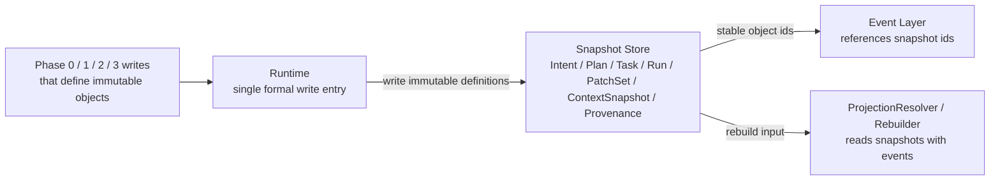

这张图只回答 `Snapshot`：哪些对象是不可变定义、由谁写入，以及它们如何成为 Event 和 rebuild 的稳定引用锚点。

#### Event Architecture

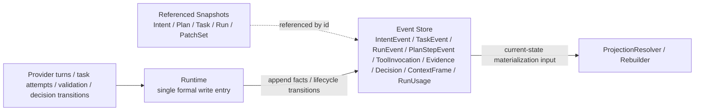

这张图只回答 `Event`：哪些事实和状态迁移进入 append-only event 流，它们如何引用 Snapshot，并成为投影和恢复的主要驱动输入。

#### Projection Architecture

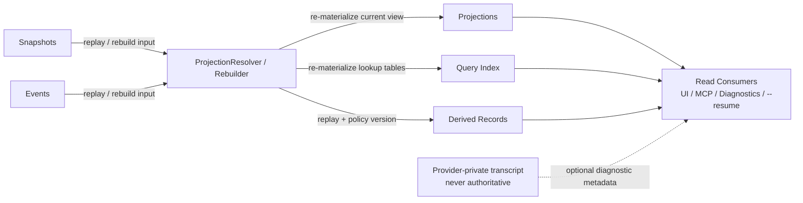

这张图只回答 `Projection`：当前运行视图、query index 和 derived records 如何从 `Snapshot + Event` rebuild，并被 UI / MCP / diagnostics / `--resume` 读取。

1. `Snapshot` 表达“定义了什么”，必须不可变，不能原地覆写。
2. `Event` 表达“后来发生了什么”，是状态转移、执行事实和审计链的主要记录形式。
3. `Projection`、query index 和 Phase 3 / Phase 4 derived records 都是读模型；它们可以被直接消费，但缺失时必须能由 `Snapshot + Event` rebuild。
4. `Runtime` 是唯一正式写入口：一边写 Snapshot / Event，一边推进 SQLite 中的当前视图和派生产物。
5. provider transcript 最多只能作为诊断元数据存在，不能替代 Snapshot / Event / Projection 中任何一层。

补充约束：

1. Phase 0 / Phase 1 的 provider readonly analysis 也属于 Event，应落到 `ToolInvocation[E]` / `ContextFrame[E]`，而不是藏在 provider-private transcript。
2. `Intent` / `Plan` / `Task` 只表达不可变定义；review、confirm、cancel、replan 等关键状态转移必须至少落一条 Event（projection 仅作当前视图缓存），而不是回写旧 snapshot。
3. `ValidationReport`、`RiskScoreBreakdown`、`DecisionProposal` 属于 Phase 3 / Phase 4 的 runtime-owned structured outputs：持久化到 runtime-owned derived-record tables，供 UI / MCP / diagnostics 直接消费，但不回退成 provider-private transcript，也不强行塞进通用 Snapshot / Event 二分表述。
4. 这些 structured outputs 不是独立真相源；其可重建来源仍是对应 thread 的 Snapshot + Event，再加记录下来的 validator / decision policy version。targeted rebuild 必须能够重新 materialize 它们，或至少返回 stale 标记并触发重算，不能因其缺失阻塞 Phase 3 / Phase 4 的读取与恢复。

## Workflow Contract

Codex 集成和通用 provider 集成都必须服从 `docs/agent/agent-workflow.md` 定义的 Phase 0-4 工作流，而不是各自维护一套 provider 层状态机。系统真相必须落在 Libra 定义的 Snapshot / Event / Projection 三层边界内。

这个章节紧跟整体流程图，作为整份改进计划的第一层约束。后文所有模块改造、步骤顺序、测试矩阵都必须满足这里定义的 phase 边界和对象边界。

### Phase Boundary Summary

| Phase | 必须完成什么 | 明确禁止什么 |
|---|---|---|
| Phase 0 | 把原始输入收敛成本地 `IntentSpec Draft`，通过 provider + readonly tools 生成可审查 `IntentSpec`，完成 developer review / revise / cancel，确认当前 `Intent`、thread bootstrap、风险基线、可选 `ContextSnapshot`、projection seed | 不允许生成 `Plan` / `Task` / `Run`，不允许调用任何会修改当前 `working directory` / `main worktree`、VCS 或外部状态的 tool，不允许跳过 IntentSpec review 直接进入计划阶段 |
| Phase 1 | 基于已确认 `IntentSpec` 发起 provider-facing planning 调用，允许 readonly tools，固定生成并审查两个 `Plan`：`execution`（执行计划）和 `test`（测试计划），以及它们对应的 `Task`；处理 `Execute / Modify Plan / Revise Intent / Cancel`，并把当前 dual-plan heads 写回 Scheduler projection | 不允许开始 task execution，不允许写 `Run` / `PatchSet` / `Provenance`，不允许调用任何 mutating tool，不允许跳过 plan review 直接执行 |
| Phase 2 | 由 Scheduler 按保守 barrier 策略执行两个已批准 plan heads：先编译并运行 `execution_dag`，仅当执行阶段 required task 全部收口后才启动 `test_dag`；记录 run/patch/evidence/context 等执行事实 | 不允许 provider 自行推进整条计划，不允许 UI 旁路 formal writes |
| Phase 3 | 运行系统级验证与审计，消费 execution/test plan artifacts，形成 release candidate 视图和结构化验证结果；测试计划不足时把流程送回 Phase 2 rework loop | 不允许把 system validation 混回 provider tool loop，不允许跳过审计直接发布 |
| Phase 4 | 基于风险和证据形成最终决策，并推进 thread / scheduler projection | 不允许通过重写旧 Snapshot 表达决策，不允许用 provider-specific 状态代替 `Decision` |

### Phase-to-Layer Mapping

| Phase | 目标 | Snapshot 写入 | Event 写入 | Libra runtime / projection |
|---|---|---|---|---|
| Phase 0 | IntentSpec 起草、意图分析与审查 | `Intent`（draft / revision / confirmed），必要时 `ContextSnapshot` | `ToolInvocation`、`ContextFrame`、可选 terminal `Decision` / `IntentEvent` | Thread 初始化 / 恢复、当前 Intent revision、IntentSpec 审查 UI、live context bootstrap |
| Phase 1 | 双计划构建与审查 | `Plan`、`Task` | `ToolInvocation`、`ContextFrame`、可选 terminal `Decision` / `IntentEvent` | `selected_plan_ids`、`current_plan_heads`、plan-set review UI、ready queue preview |
| Phase 2 | `execution_dag -> barrier -> test_dag` 两阶段执行与过程事实 | `Run`、`PatchSet`、`Provenance` | `TaskEvent`、`RunEvent`、`PlanStepEvent`、`ToolInvocation`、`Evidence`、`ContextFrame`、`RunUsage` | `active_run_id`、live_context_window、active DAG stage / staging 状态 |
| Phase 3 | 验证与审计 | 可选 `ContextSnapshot` | `Evidence`、可选 routing `Decision`、terminal `TaskEvent` / `RunEvent` / `IntentEvent` | 审计视图、release candidate 视图、`ValidationReport`、test-plan sufficiency 路由 |
| Phase 4 | 决策与释放 | none | final `Decision`、可选 terminal `IntentEvent` | Thread / Scheduler 投影推进、`RiskScoreBreakdown`、`DecisionProposal` |

### Phase 0 Detailed Analysis

Phase 0 的职责是把原始输入收敛成可审查的 `IntentSpec`，而不是直接生成计划。它先按本地规则组装 `IntentSpec Draft`，再通过 provider 做意图细化，并允许只读工具读取仓库/文档/历史信息，最终把结果转换成 Markdown review 交给开发者确认。

#### Phase 0 目标

1. 归一化原始输入，生成本地 `IntentSpec Draft` 和风险初判。
2. 决定当前是“新 thread”还是“恢复既有 thread”，并建立可追踪的 Intent revision 链。
3. 调用 provider 细化 `IntentSpec`，且只允许 readonly tools。
4. 把 provider 返回的 `IntentSpec` 转换成 Markdown review，并支持 `Confirm / Modify / Cancel` 循环。
5. 在 IntentSpec 确认后，判定是否需要冻结初始 `ContextSnapshot[S]`（见后文“ContextSnapshot 冻结操作定义”），并初始化或刷新 `ThreadProjection`、`SchedulerState`、`live_context_window` 和 query index seed。

#### Phase 0 路径规则

| 场景 | `Intent` 写入 | `thread_id` 规则 | `ContextSnapshot` |
|---|---|---|---|
| 新请求，未指定 `--resume` | 先写 root draft `Intent[S]`，provider 细化或用户修改时继续写 `Intent` revision | `thread_id = root_intent_id` | 在确认当前 IntentSpec 后按条件写 |
| `--resume <thread_id>` 且仅继续既有已确认 `Intent` | 可跳过新的 draft loop，直接复用当前 confirmed intent | 复用传入 `thread_id` | 通常不写 |
| `--resume <thread_id>` 且用户追加新要求/修订 | 先写新的 draft `Intent` revision，provider 细化或用户修改时继续写 revision | 复用原 `thread_id`，不新建 thread | 在确认当前 revision 后视需要写 |
| 用户在 review 中 `Cancel` | 不再写新的 `Intent` revision；追加 terminal `Decision`，必要时 `IntentEvent` | thread 保留历史但立即结束 | 不写 |

#### Phase 0 详细时序：`new <thread>`

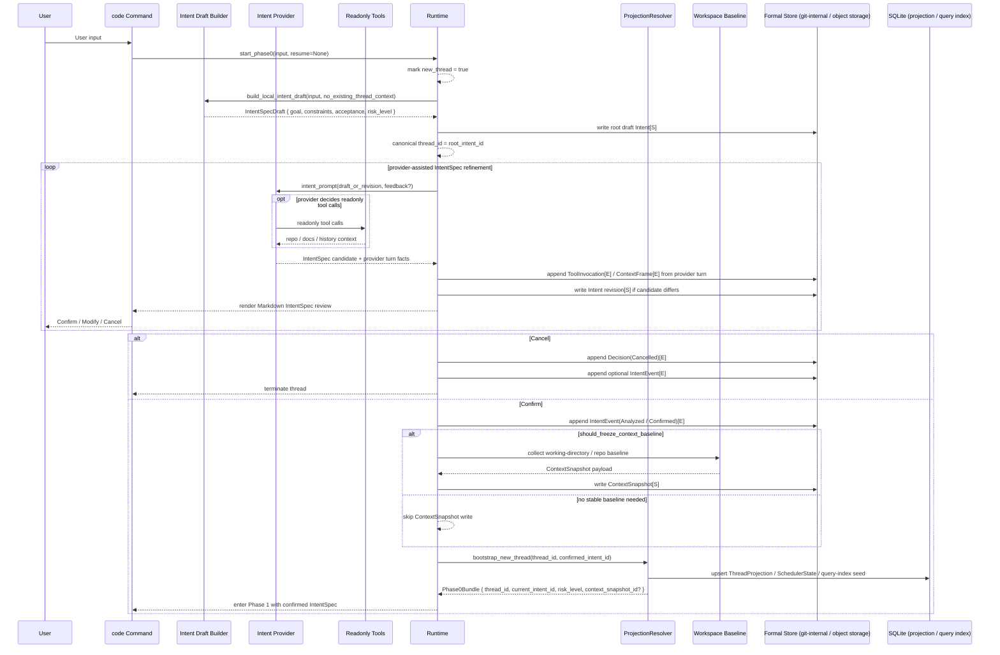

#### Phase 0 详细时序：`resume <thread>`

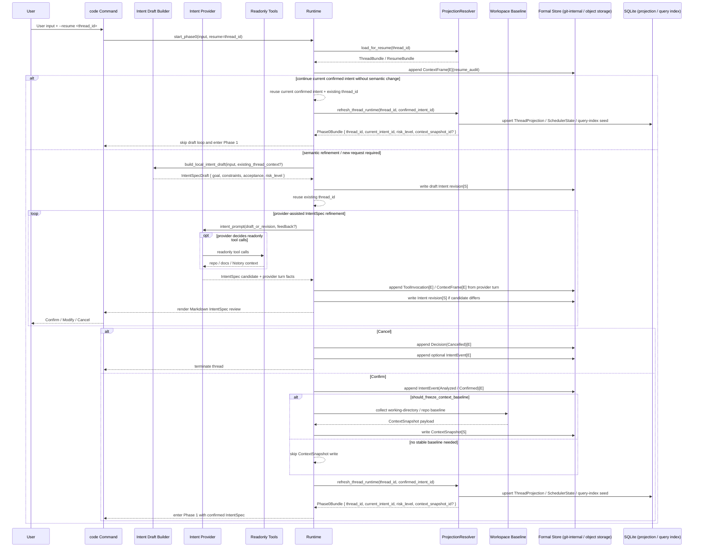

#### Phase 0 子步骤拆解

| 子步骤 | 输入 | 输出 | 说明 |
|---|---|---|---|
| 输入归一化 | CLI 参数、用户文本、可选 `--resume <thread_id>` | `Phase0Input` | 统一入口，不让 provider 直接读取原始 CLI 语义 |
| 本地 draft 组装 | `Phase0Input`、可选既有 thread 上下文 | `IntentSpecDraft` | 规则式提取 goal、constraints、acceptance、risk_level |
| root / revision bootstrap | `IntentSpecDraft`、resume 信息 | root draft intent 或 draft revision | 新 thread 先写 root draft 以锚定 canonical `thread_id` |
| provider 细化 | draft intent、反馈、可选 readonly context 查询 | candidate `IntentSpec` | provider 只允许做意图细化和只读分析；readonly tools 是否调用由 provider turn 自行决定 |
| Phase 0 tool/event 收口 | provider tool/use 流 | `ToolInvocation[E]`、`ContextFrame[E]` | 只记录只读分析事实，不写 `Run` |
| Markdown review loop | candidate `IntentSpec`、用户反馈 | `Confirm` / `Modify` / `Cancel` | `Modify` 留在 Phase 0；若 UI 需要“重来一版”，按不改变语义边界的 `Modify` 处理，不单列 `Regenerate` 状态 |
| `ContextSnapshot` 判定 | confirmed intent、当前 `working directory` / 仓库状态、risk | snapshot write or skip | 只有稳定基线值得保留时才写 |
| projection 初始化 | confirmed intent、thread / snapshot 结果 | `ThreadProjection`、`SchedulerState`、query-index seed | 形成进入 Phase 1 的 runtime bundle |

#### `Phase0Input` 数据结构

`Phase0Input` 是 Phase 0 的唯一入口 `contract` 。它只承载 “当前已经知道的事实”，用于把原始入口统一成稳定内部输入；它**不承载**已经推导出的 `IntentSpecDraft`，也不提前塞入 `goal` / `constraints` / `acceptance` / `risk_level` 这类后续阶段才生成的字段。

| 字段 | 类型 | 必填 | 来源 | 说明 |
|---|---|---|---|---|
| `entrypoint` | `CodeEntrypoint` | 是 | CLI / TUI / MCP adapter | 标识这次请求来自哪个入口，用来消除不同交互层的 transport 差异；provider 不应直接读取原始 CLI/UI 协议细节 |
| `raw_user_text` | `String` | 是 | 用户输入 | 原始任务文本；后续本地 draft 组装和审计都以它为起点 |
| `requested_resume_thread_id` | `Option<ThreadId>` | 否 | `--resume <thread_id>` 或等价 UI 参数 | 表达“用户想恢复哪个 canonical thread”；新 thread 为 `None` |
| `resume_bundle` | `Option<ResumeBundle>` | 否 | `ProjectionResolver.load_for_resume()` | 已解析出的 thread / projection / current intent / freshness 上下文；只有在 resume 成功解析后才存在 |
| `working_directory` | `PathBuf` | 是 | invocation context | 本次会话的工作目录；`ContextSnapshot` 判定和仓库基线收集都从这里出发 |
| `repo_root` | `Option<PathBuf>` | 否 | repo discovery | 若当前目录位于仓库中，这里记录 canonical repo root；非 repo 场景允许为空 |
| `principal` | `PrincipalContext` | 是 | controller / session | 当前操作者身份；用于 audit、决策归属和后续 approval / ownership 语义 |
| `approval_policy` | `ApprovalPolicySnapshot` | 是 | policy layer | 当前工具边界和审批策略快照；Phase 0 / Phase 1 只能 readonly，后续 Phase 2 也必须继续受它约束 |
| `environment_metadata` | `EnvironmentMetadataSnapshot` | 是 | runtime/env probe | 记录 sandbox、network、OS、git/worktree 能力等运行环境元数据，供 prompt builder、diagnostics 和 snapshot 判定使用 |
| `received_at` | `DateTime<Utc>` | 是 | runtime clock | 记录归一化输入形成的时间点，供审计、恢复排序和事件关联使用 |

补充约束：

1. `Phase0Input` 只允许包含 Phase 0 进入点已经确定的事实；`IntentSpecDraft`、confirmed `Intent`、`risk_level`、`Phase0Bundle` 都不属于它。
2. `requested_resume_thread_id` 和 `resume_bundle` 必须分开表达：前者是用户请求，后者是系统解析结果；如果 resume 解析失败，应该在生成 `Phase0Input` 时就报错，而不是带着半残输入继续进入 draft 组装。
3. `working_directory` 是调用时的当前位置，`repo_root` 是归一化后的仓库锚点；两者不能混用。
4. `approval_policy` 和 `environment_metadata` 必须是归一化后的快照，而不是让 provider 自行再去猜测当前环境能力或审批边界。
5. 如果后续 `write_context_snapshot_if_needed()`、prompt builder、projection bootstrap 需要额外输入，应先把字段收敛进 `Phase0Input`，而不是重新回读原始 CLI 参数。

#### Input Normalization And Initial Risk Heuristics

这里的“输入归一化”与“风险初判”都属于 **Phase 0 本地规则层**；它们发生在 provider 生成 / 修订 `IntentSpec` 之前，用于先把原始请求收敛成稳定输入，再给出一个可审查的风险基线。

##### Input normalization 的含义

“输入归一化”不是在做 planning，也不是让 provider 直接理解裸入口协议；它的目标是把不同入口、不同 transport 形式下的原始请求统一收敛为 `Phase0Input`，供后续本地 draft 组装和 provider intent refinement 共用。

| 动作 | 输入 | 输出 | 目的 |
|---|---|---|---|
| transport 解析 | CLI / TUI / MCP 原始参数与消息 | 统一字段草案 | 消除不同入口的协议差异，不让 provider 直接读取裸 CLI / UI 语义 |
| resume 解析 | `requested_resume_thread_id` | `resume_bundle` 或显式错误 | 把“用户请求恢复哪个 thread”和“系统实际恢复出了什么上下文”分开表达 |
| 环境归一化 | 当前 cwd、repo 探测结果、principal、policy、环境能力探测 | `working_directory`、`repo_root`、`principal`、`approval_policy`、`environment_metadata` | 固定本次 Phase 0 进入点的环境事实，避免后续重新回读原始入口 |
| 时间与审计锚定 | runtime clock | `received_at` | 为审计、恢复排序和后续事件关联提供稳定时间锚点 |

归一化后的 `Phase0Input` 仍然只是“已经知道的事实”，它**不包含**：

1. `IntentSpecDraft`
2. confirmed `Intent`
3. `risk_level`
4. `Phase0Bundle`
5. 任何 `Plan` / `Task` / `Run` 级产物

也就是说，归一化回答的是“这次请求到底是什么输入、从哪里来、在什么环境里发生”，而不是“系统已经理解出了什么目标”。

##### 风险初判的含义

Phase 0 的 `risk_level` 是 **base risk**，是后续 Phase 4 风险聚合的输入基线，而不是最终风险分。Phase 4 才会把它与 `diff_scope`、执行 `Evidence`、policy penalty 一起聚合成最终风险结果。

因此，Phase 0 风险初判只能依据：

1. `Phase0Input` 中已经确定的事实
2. 本地 draft 组装时提取出的 `goal / constraints / acceptance`
3. 可选 `resume_bundle` 中已有的当前 thread / intent 上下文

Phase 0 风险初判**不能**依据：

1. 尚未产生的代码 diff
2. 尚未执行的测试或 validator 结果
3. Phase 2 / Phase 3 才会写入的 `Evidence`
4. provider 私有 transcript 中未进入 formal 流的隐式状态

##### 风险初判的规则维度

`risk_level` 必须由本地规则式逻辑给出，至少覆盖下列维度：

| 维度 | 低风险信号 | 提升风险的信号 |
|---|---|---|
| 请求类型 | 只读分析、解释、文档整理 | 代码修改、配置变更、VCS 变更、外部副作用 |
| 目标域 | 普通局部代码、非敏感文档 | `auth`、`security`、`config`、`migration`、`release`、secret、权限边界 |
| 作用范围 | 单文件、小范围局部修改 | 跨模块、跨仓库边界、大范围重构、可能影响运行时行为 |
| 环境能力 | 只读、受限环境 | 允许写工作区、允许 mutating tool、允许网络写或外部系统交互 |
| 需求清晰度 | goal / constraints / acceptance 明确 | 目标模糊、约束缺失、验收条件不清、存在多义解释 |
| resume 语义 | 仅继续既有 confirmed intent | 在既有 thread 上追加新要求、改变成功标准、修订目标边界 |

##### 风险初判的最低行为要求

1. 新 thread 必须在生成本地 `IntentSpecDraft` 时同步给出 `risk_level`。
2. `--resume <thread_id>` 且仅继续既有 confirmed intent 时，可以直接复用当前风险基线，不要求重新抬高风险。
3. `--resume <thread_id>` 且存在语义修订时，必须根据新的 draft 重新计算 `risk_level`，不能盲目沿用旧值。
4. 风险初判必须偏保守；当请求命中敏感域、外部副作用或高不确定性时，应上调而不是下调。
5. `risk_level` 的作用是控制后续 review / decision 路径，而不是替代 Phase 4 的最终风险聚合。

#### Phase 0 产物与约束

1. Phase 0 可以调用 provider，但只能用于 `IntentSpec` 细化；任何会产生代码变更、文件写入、VCS 变更或外部副作用的 tool 都禁止。
2. 新 thread 的 root draft `Intent[S]` 锚定 canonical `thread_id`；后续 provider 细化和用户反馈都通过 `Intent` revision 表达，不覆写旧对象。
3. `risk_level` 是 Phase 0 的输出之一，后续 Phase 4 只在此基础上叠加 evidence / diff 风险，不重新定义基线。
4. Phase 0 的 provider 只读分析会产出 `ToolInvocation[E]` 和 `ContextFrame[E]`，但不会产出 `Run[S]` / `PatchSet[S]` / `Provenance[S]`。
5. `ContextSnapshot[S]` 来源是 Runtime 对工作区/仓库状态的冻结，不是 provider tool loop 的原始输出。
6. Phase 0 结束时必须已经有当前已确认 `Intent`、可恢复的 `thread_id` 语义，以及最小可用的 `ThreadProjection` / `SchedulerState`。

### Phase 0 / Phase 1 Boundary

Phase 0 和 Phase 1 的边界不再以“是否已经调用过 provider”为准，而是以“当前 `IntentSpec` 是否已确认，以及 provider 调用的目标是不是生成 `Plan`”为准。

#### 边界判定

1. **Phase 0 的结束条件**：系统已经得到 `Phase0Bundle`，其中至少包含可用的 `thread_id`、当前已确认 `Intent` 引用、`risk_level`、可选 `ContextSnapshot` 引用，以及已初始化的 `ThreadProjection` / `SchedulerState`。
2. **Phase 1 的开始条件**：系统把“已确认 `IntentSpec`”发给 Codex 或通用 completion provider，请它生成 `Plan` / `Task` 候选、步骤候选或等价 planning 结果。
3. **因此**：发送 draft + feedback 给 provider 生成 / 修改 `IntentSpec` 属于 Phase 0；发送 confirmed intent 给 provider 生成 / 修改 `Plan` 属于 Phase 1。

#### Phase 划分规则

| 动作 | 归属 |
|---|---|
| 解析 CLI 输入、读取 `--resume <thread_id>`、加载 resume bundle | Phase 0 |
| 按规则组装本地 `IntentSpec Draft`、提取 goal / constraints / acceptance / risk_level | Phase 0 |
| 向 provider 发送 draft / feedback，请它生成或修订 `IntentSpec` | Phase 0 |
| Phase 0 只读工具分析，并记录 `ToolInvocation` / `ContextFrame` | Phase 0 |
| 展示 `IntentSpec` Markdown review，并等待 `Confirm / Modify / Cancel` | Phase 0 |
| 判定并写入初始 `ContextSnapshot` | Phase 0 |
| 初始化 / 恢复 `ThreadProjection`、`SchedulerState`、query-index seed | Phase 0 |
| 向 provider 发送 confirmed `IntentSpec` 生成 `Plan` / `Task` | Phase 1 |
| Phase 1 只读工具分析，并记录 `ToolInvocation` / `ContextFrame` | Phase 1 |
| 根据 provider 返回结果生成 `Plan` / `Task` | Phase 1 |
| 展示 `Plan` review UI 并等待 `Execute / Modify Plan / Revise Intent / Cancel` | Phase 1 |

#### 额外约束

1. Phase 0 和 Phase 1 都允许 provider 调用，但两者都只允许 readonly tools；任何 mutating tool 必须等到 Phase 2 的 `TaskExecutor`。
2. Phase 0 只负责形成“当前可执行目标的定义”；只要调用目标已经变成“给出执行计划 / 步骤 / task 拆解”，它就属于 Phase 1。
3. Phase 1 中如果开发者判断 `IntentSpec` 本身需要调整，必须回到 Phase 0 写新的 `Intent` revision，再重新进入 Phase 1。
4. 文档、代码和测试都应以“Phase 0 先确认 IntentSpec，Phase 1 再确认 Plan”作为统一边界，不允许把两层 review 混成一个循环。

#### Readonly Tool Boundary

Phase 0 / Phase 1 的 readonly tools 至少分为 4 类：

1. repo read：读取文件、目录枚举、全文搜索、只读 VCS 查询（如 status/log/show/diff 摘要）。
2. docs / knowledge read：读取仓库文档、外部只读资料、MCP resource 查询。
3. thread / projection read：读取当前 thread history、projection、diagnostics summary、query index。
4. policy / metadata read：读取 tool capability、principal、approval policy、环境元数据。

Phase 0 / Phase 1 明确禁止：

1. 任何会修改 `working directory` / `main worktree` 的文件操作。
2. 任何 mutating VCS 命令。
3. 任何外部副作用操作（网络写、MCP tool mutating call、部署、通知、发帖等）。
4. 任何需要 approval 才能继续的执行型工具调用。

与 Phase 2 的衔接规则：

1. 一旦进入 Phase 2，provider 不再拥有“自由工具调用”语义，而是只能在 `TaskExecutor` + `ExecutionEnvironmentProvider` + `ToolBoundaryPolicy` 边界内执行单 task attempt。
2. 同一个工具若在 Phase 0 / Phase 1 被归类为 readonly query，在 Phase 2 也必须继续经由 `ToolBoundaryPolicy` 明确标注为 readonly，而不是绕过 policy 直接执行。

### Phase 1 Detailed Analysis

Phase 1 的职责是把 Phase 0 已确认的 `IntentSpec` 转成可审查的 dual-plan set，并在任何执行发生之前完成计划层的强制 review gate。这个 contract 固定只包含两个 `Plan`：一份 `execution` plan 和一份 `test` plan。前者定义代码与变更执行路径，后者定义测试与验证路径。它与 Phase 0 的区别不是“有没有 LLM”，而是“LLM 当前是在细化目标，还是在生成计划”。

#### Phase 1 目标

1. 基于已确认 `IntentSpec` 组装 planning prompt，并发起 provider-facing plan generation 调用。
2. 允许 provider 使用 readonly tools 收集计划所需的仓库 / 文档 / 历史信息。
3. 把 planning 结果规范化为不可变 `Plan[S]` / `Task[S]` revision，并固定产出 `execution` 与 `test` 两类 plan。
4. 展示 plan set Markdown review，并等待 `Execute / Modify Plan / Revise Intent / Cancel`。
5. 只在 plan review 完成后决定进入 Phase 2、留在 Phase 1 revision loop、回到 Phase 0，或直接终止。

#### Phase 1 路径规则

下表拆成两个维度表达：前四行共享同一前提，即 planning 已成功生成可审查的 plan set；它们的差异只来自 review 阶段的用户决策。

补充说明：

1. `Modify Plan` 的“只改一类”不等于 single-plan 写入：`Runtime` 仍只接收完整 dual-plan pair；未修改的一类必须沿用当前 head 透传。
2. `Execute` 默认只允许执行当前 `current_plan_heads`；历史 head 若要重用，必须先显式生成新的 current head 并重新过 review gate。
3. 下文 Phase 1 / 2 / 3 / 4 中的“新建路径”，指当前会话在同一控制流内连续从上一 phase 进入；只有 `resume <thread>` 图才表示通过 `load_for_resume(thread_id)` 进入该 phase 的恢复路径。

| planning 结果 | review 决策 | `Plan` / `Task` 写入 | projection 更新 | 下一步 |
|---|---|---|---|---|
| 成功，已生成可审查的 execution/test dual plan | `Execute` | 选定当前 `current_plan_heads` 对应的 execution/test `Plan[S]` / `Task[S]` | `selected_plan_ids = current_plan_heads`，且逻辑顺序固定为 `[execution_plan_id, test_plan_id]` | 进入 Phase 2 |
| 成功，已生成可审查的 execution/test dual plan | `Modify Plan` | 写新的 execution/test `Plan[S]` / `Task[S]` revision（可只改一类；若只改一类，另一类必须透传当前 head 组成完整 dual-plan pair） | 刷新 `current_plan_heads`（不提前写 `selected_plan_ids`） | 留在 Phase 1 |
| 成功，已生成可审查的 execution/test dual plan | `Revise Intent` | 不继续推进当前 plan head；回写新的 `Intent` revision 请求 | 清理当前 plan 选择或保留为历史 head | 回到 Phase 0 |
| 成功，已生成可审查的 execution/test dual plan | `Cancel` | 不进入执行；写 terminal `Decision[E]`，必要时写 `IntentEvent[E]` | Scheduler 清空 active 选择 | 终止 |
| 失败，或候选计划质量不足以进入 review | 不适用 | 不推进不完整的 execution/test `Plan` / `Task` 为选中 head；保留只读 analysis events | 保持上一可用 projection | 留在 Phase 1 重试或报错 |

#### Phase 1 详细时序：新建路径（当前会话连续进入）

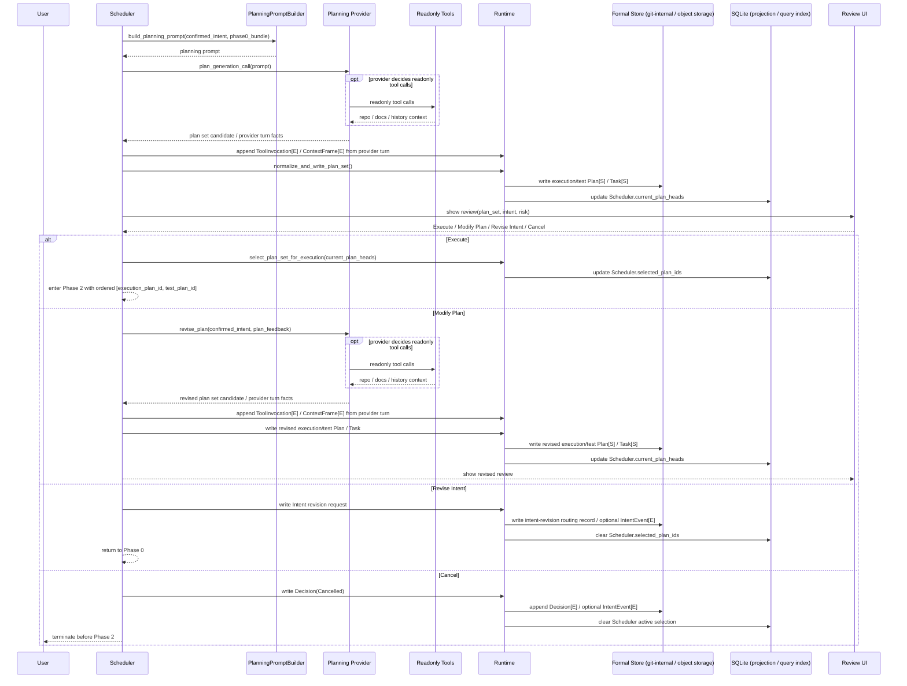

#### Phase 1 详细时序：`resume <thread>`

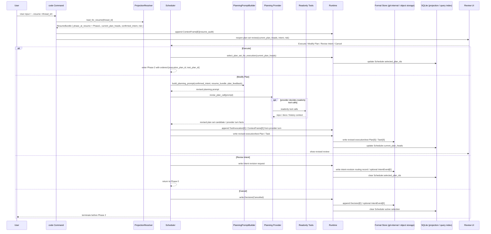

#### Phase 1 子步骤拆解

| 子步骤 | 输入 | 输出 | 说明 |
|---|---|---|---|
| planning prompt 组装 | confirmed `Intent`、`Phase0Bundle`、上下文策略 | provider-facing planning prompt | 这是 Phase 1 的起点，不属于 Phase 0 |
| planning 调用 | planning prompt | plan set candidate / plan text | Codex 与通用 provider 都在这里进入 plan generation |
| Phase 1 tool/event 收口 | provider tool/use 流 | `ToolInvocation[E]`、`ContextFrame[E]` | 只记录只读分析事实，不写 `Run` |
| plan set 规范化 | provider 结果 | canonical `PlanSpec(role=execution|test)` / `TaskSpec[]` | 收敛不同 provider 的 planning 结果结构 |
| `Plan[S]` / `Task[S]` 写入 | canonical plan/task spec | `Plan` / `Task` snapshot | 只写不可变结构，不写 runtime 状态 |
| review gate | confirmed `IntentSpec`、plan set summary、risk | `Execute` / `Modify Plan` / `Revise Intent` / `Cancel` | 所有 provider 复用同一 review loop |
| branch 解析 | review 结果 | Phase 2 entry / 新 plan set revision / 回 Phase 0 / terminal cancel | Phase 1 的出口控制点 |

#### Phase 1 产物与约束

1. 把 confirmed `IntentSpec` 发给 provider 生成 / 修改 plan set，明确属于 Phase 1，不属于 Phase 0。
2. Phase 1 允许 readonly tool analysis，并产出 `ToolInvocation[E]` / `ContextFrame[E]`；但仍不允许写 `Run[S]`、`PatchSet[S]`、`Provenance[S]`。
3. Phase 1 必须且只能产出一份 `Plan(role=execution)` 和一份 `Plan(role=test)`；后者负责定义测试 / 验证任务，不允许省略，也不允许再追加第三类 plan role。
4. `Plan[S]` / `Task[S]` 是不可变结构定义；mutable 状态只能进入 projection 或 event。
5. `Modify Plan` 不允许原地改写既有 `Plan` / `Task`，必须走 revision chain。
6. `Modify Plan` 只改一类时，写入仍必须提交完整 dual-plan pair；未修改的一类沿用当前 head 透传，不因此放开 single-plan 写入接口。
7. `Execute` 时必须同时选定 execution/test 两类 plan head，形成 `selected_plan_ids`，且顺序固定为 `[execution_plan_id, test_plan_id]`。
8. `Execute` 默认只允许当前 `current_plan_heads`；历史 head 不得绕过 review 直接执行。如需回退到旧 revision，必须先显式提升为新的 current head 并重新进入 review。
9. `Revise Intent` 必须回到 Phase 0；不允许在 Phase 1 内部偷偷修改当前 `Intent` 后继续计划。
10. `Execute` 必须发生在 plan review gate 之后，不允许跳过 review。
11. 通用 provider 与 Codex provider 必须共享同一 Phase 1 review loop 实现。
12. `selected_plan_ids` 只能在 `Execute` 分支写入；`Modify Plan` 只能推进 `current_plan_heads`，不得提前标记为已选执行计划。

### Phase 2 Detailed Analysis

Phase 2 的职责是由 Libra Scheduler 按保守的两阶段 barrier 策略执行当前 plan set（固定为 `execution` plan 和 `test` plan）：先运行 `execution_dag`，只有当 execution 阶段的 required task 全部收口后，才启动 `test_dag`。这里的推荐实现明确收敛到 `dagrs 0.8.1`：Libra 负责从 `Plan` / `Task` snapshot 构建当前 stage 的 DAG、订阅 DAG 事件、把 DAG 结果翻译成 formal writes，并把 provider 限定为单个 task node 的执行器。它的核心是“执行控制权归 Libra + DAG runtime”，不是“让 provider 自己跑完整条计划”。

#### Phase 2 目标

1. 从当前 `selected_plan_ids` 先派生 `execution_dag`，并在 execution 阶段通过 barrier 后再派生 `test_dag`。
2. 组装每个 DAG node 的 task execution context，包括 prerequisite patchsets、context frames 和执行边界。
3. 由 Libra 为每个 DAG node 提供受控的 `Sandbox` / `Worktree` 执行环境，而不是由 provider 自己创建隔离环境。
4. 通过 `TaskExecutor` 执行单个 DAG node 对应的 task attempt。
5. 订阅 `dagrs` runtime 事件，把 node progress / checkpoint / termination 翻译成 Libra projection 与 formal events。
6. 读取 `Sandbox` / `Worktree` 的执行数据、文件变更和同步结果，并按对象模型写入 formal object 层。
7. 把调度策略收紧为 `execution_dag -> barrier -> test_dag`，先保证主路径稳定，再考虑后续并行优化。
8. 当 Phase 3 指出 test-plan 缺口或可自动修复的验证不足时，能够在 Phase 2 内分析并追加新的 execution/test plan revision，然后重新执行 `execution_dag -> test_dag`。
9. 决定下一步是继续 Phase 2、回到 Phase 1 replan，还是进入 Phase 3。

#### Phase 2 路径规则

| 场景 | formal writes | projection 更新 | 下一步 |
|---|---|---|---|
| active DAG node 成功 | `Run[S]`、可选 `PatchSet[S]`、`Provenance[S]`、执行 events | 标记 node 对应 task 完成，推进当前 active DAG progress | 留在当前 stage，或在 execution 阶段完成后切到 test stage，或在 test 阶段完成后进 Phase 3 |
| retryable failure | `Run[S]`、失败 events / evidence | 递增 retry 计数，按 policy 重建 node attempt | 留在 Phase 2 |
| validation feedback rework required | 当前执行证据、Phase 3 validator 反馈、追加 `Plan[S]` / `Task[S]` revision | 刷新 `selected_plan_ids`，重建 `execution_dag -> test_dag` 两阶段执行链 | 留在 Phase 2 |
| broader replan required | 当前 attempt 的 events / evidence | `active_run_id = None`，终止当前 active DAG runtime，准备新 plan set head | 回到 Phase 1 |
| cancel / timeout / disconnect / permanent failure | terminal run/task events | 清理 active run/task，终止 DAG runtime | 进入终态或按策略进入 Phase 4 |

#### Phase 2 详细时序：新建路径（首次进入执行）

```mermaid
sequenceDiagram
    participant S as Scheduler
    participant D as DagrsRuntime(0.8.1)
    participant C as Context Loader
    participant X as Sandbox/Worktree Manager
    participant E as TaskExecutor
    participant R as Runtime
    participant F as Formal Store (git-internal / object storage)
    participant Q as SQLite (projection / query index)

    S->>D: build_stage_dag(stage=execution, execution_plan)
    D-->>S: Graph ready
    S->>D: async_start()

    loop until execution_dag terminates
        D-->>S: GraphEvent(node_ready / node_started / checkpoint / node_finished)
        S->>R: translate dagrs event into projection + control-state updates
        R->>Q: update SchedulerState / live_context_window / ready_queue metadata

        alt next ready DAG node exists
            D->>C: load prerequisite patchsets / context frames
            C-->>D: TaskExecutionContext
            D->>X: provision sandbox + task worktree
            X-->>D: execution environment + runtime metadata
            D->>R: start_task_attempt(task_id)
            R->>F: write Run[S] / Provenance[S]
            R->>Q: update active_task_id / active_run_id
            D->>E: execute_task(context)
            E-->>D: TaskExecutionResult
            D->>X: collect sandbox output + sync worktree back
            X-->>D: exec facts + file changes + sync result
            D->>R: record_task_attempt(result)
            R->>F: write PatchSet[S]
            R->>F: append TaskEvent / RunEvent / PlanStepEvent
            R->>F: append ToolInvocation / Evidence / ContextFrame / RunUsage
            R->>Q: update SchedulerState / live_context_window / ready_queue metadata
        end
    end

    D-->>S: StageExecutionReport(stage=execution)

    alt execution stage success
        S->>R: record stage barrier reached(active_stage = test)
        R->>Q: update SchedulerState / ready_queue metadata
        S->>D: build_stage_dag(stage=test, test_plan)
        D-->>S: Graph ready
        S->>D: async_start()

        loop until test_dag terminates
            D-->>S: GraphEvent(node_ready / node_started / checkpoint / node_finished)
            S->>R: translate dagrs event into projection + control-state updates
            R->>Q: update SchedulerState / live_context_window / ready_queue metadata

            alt next ready DAG node exists
                D->>C: load prerequisite patchsets / context frames
                C-->>D: TaskExecutionContext
                D->>X: provision sandbox + task worktree
                X-->>D: execution environment + runtime metadata
                D->>R: start_task_attempt(task_id)
                R->>F: write Run[S] / Provenance[S]
                R->>Q: update active_task_id / active_run_id
                D->>E: execute_task(context)
                E-->>D: TaskExecutionResult
                D->>X: collect sandbox output + sync worktree back
                X-->>D: exec facts + file changes + sync result
                D->>R: record_task_attempt(result)
                R->>F: write PatchSet[S]
                R->>F: append TaskEvent / RunEvent / PlanStepEvent
                R->>F: append ToolInvocation / Evidence / ContextFrame / RunUsage
                R->>Q: update SchedulerState / live_context_window / ready_queue metadata
            end
        end

        D-->>S: StageExecutionReport(stage=test)

        alt test stage success
            S-->>S: mark test_dag complete and enter Phase 3
        else retryable
            S->>R: record retry routing and schedule next attempt
            R->>F: append routing Evidence[E] / RunEvent[E]
            R->>Q: update retry metadata
            S-->>S: rebuild retry path inside current DAG policy
        else validation feedback rework required
            S->>R: append plan/task revision and restart execution_dag -> test_dag
            R->>F: write revised Plan[S] / Task[S]
            R->>Q: update selected_plan_ids / current_plan_heads
            S-->>S: stay in Phase 2 rework loop
        else broader replan required
            S->>R: append routing evidence and clear active run
            R->>F: append Evidence[E] / ContextFrame[E]
            R->>Q: update SchedulerState(active_run_id = None)
            S-->>S: terminate DAG runtime and return to Phase 1
        else terminal failure / cancel
            S->>R: write terminal run/task events and clear active state
            R->>F: append terminal TaskEvent[E] / RunEvent[E] / Evidence[E]
            R->>Q: clear active run / active task
            S-->>S: stop DAG per policy
        end
    else retryable
        S->>R: record retry routing and schedule next attempt
        R->>F: append routing Evidence[E] / RunEvent[E]
        R->>Q: update retry metadata
        S-->>S: rebuild retry path inside current DAG policy
    else validation feedback rework required
        S->>R: append plan/task revision and restart execution_dag -> test_dag
        R->>F: write revised Plan[S] / Task[S]
        R->>Q: update selected_plan_ids / current_plan_heads
        S-->>S: stay in Phase 2 rework loop
    else broader replan required
        S->>R: append routing evidence and clear active run
        R->>F: append Evidence[E] / ContextFrame[E]
        R->>Q: update SchedulerState(active_run_id = None)
        S-->>S: terminate DAG runtime and return to Phase 1
    else terminal failure / cancel
        S->>R: write terminal run/task events and clear active state
        R->>F: append terminal TaskEvent[E] / RunEvent[E] / Evidence[E]
        R->>Q: clear active run / active task
        S-->>S: stop DAG per policy
    end
```

#### Phase 2 详细时序：`resume <thread>`

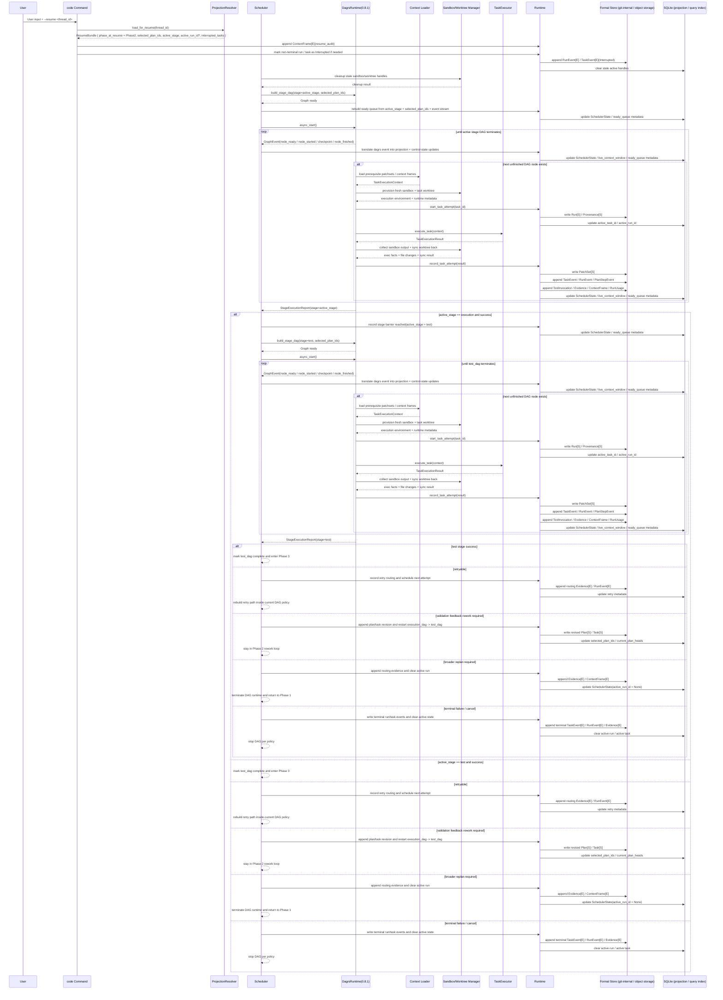

#### Phase 2 子步骤拆解

| 子步骤 | 输入 | 输出 | 说明 |
|---|---|---|---|
| DAG 物化 | `selected_plan_ids`、当前 `active_stage`、`Plan.steps`、`Task.dependencies` | `StageDag(stage=execution|test)` | Scheduler 每次只物化当前 stage 的一个 DAG；execution 完成后再切到 test |
| prerequisite context 加载 | `PatchSet`、`ContextFrame`、`ContextSnapshot` | `TaskExecutionContext` | 每个 ready DAG node 的执行输入 |
| execution environment provisioning | task、policy、main working directory baseline | `Sandbox` + task `Worktree` + runtime metadata | `Sandbox` / `Worktree` 必须由 Libra 提供和管理 |
| node attempt 启动 | task、context、provider metadata | `Run[S]`、`Provenance[S]` | 每次 node attempt 都有独立 immutable envelope |
| provider 执行 | `TaskExecutionContext` | `TaskExecutionResult` | provider 只负责单次 task node attempt |
| sandbox/worktree 数据采集 | sandbox stdout/stderr、tool exec output、worktree diff、sync result | structured exec facts | Libra 读取执行环境数据，而不是依赖 provider 私有 transcript |
| result materialization | `TaskExecutionResult` | `PatchSet`、events、usage、evidence | 全部通过 `Runtime` 写入 |
| DAG runtime 事件收口 | `GraphEvent`、`ExecutionReport` | projection progress / checkpoint / termination | 用 `dagrs 0.8.1` 事件和报告驱动 Scheduler 状态 |
| control-state 更新 | node 结果、retry policy、replan policy | next ready node / stage barrier / retry / replan / plan-set rework | Phase 2 的 mutable 控制状态归 Scheduler |

#### Phase 2 产物与约束

1. Phase 2 的 canonical runtime 明确采用 `dagrs 0.8.1`，但执行策略收敛为两阶段 barrier：先从 execution `Plan` / `Task` snapshot 构建并运行 `execution_dag`，成功后再构建并运行 `test_dag`。
2. `TaskExecutor` 只执行单个 DAG node 对应的 task attempt，不得自行推进整个计划。
3. `Sandbox` 和 task `Worktree` 必须由 Libra 提供与管理；provider 只能消费 Libra 下发的执行环境句柄和边界，不能自行创建旁路隔离环境。
4. Libra 必须能够读取 `Sandbox` 的执行数据和 `Worktree` 的文件变更 / sync 结果，并把这些事实写成 `ToolInvocation[E]`、`ContextFrame[E]`、`RunEvent[E]`、`Evidence[E]` 与 `PatchSet[S]`。
5. 所有 formal writes 都必须通过 `Runtime`，UI 不得旁路写 `create_*` / `append_*`。
6. `live_context_window` 只能由 `ContextFrame[E]` 和 projection 驱动，不得由 provider-specific history 直接决定。
7. Codex 和通用 provider 都必须走同一个 Scheduler + dagrs 主循环，不允许一条路径绕过 Phase 2 contract。
8. 调度策略固定为 `execution_dag -> barrier -> test_dag`；不允许跨 DAG 同时激活两个 stage，也不允许把两个 stage 交错执行。
9. `test_dag` 的唯一启动条件是 execution stage required task 全部收口；不再允许 planner 或 `DagRuntimeBuilder` 定义跨 plan 依赖边。
10. 同一时刻只允许一个 active stage DAG；若 DAG 内部存在独立 node，可在该 stage 内并行，但 projection 更新必须维持单写者序列化提交。
11. 若 required execution node 发生 permanent failure，则 test stage 不得启动；若 required test node 发生 permanent failure，Scheduler 可以 early-stop 并进入 retry / Phase 2 rework / Phase 1 replan；两种情况都不得直接进入 Phase 3。
12. 针对 `dagrs 0.8.1`，实现必须显式吸收三个 API 变化：`Graph::add_node` / `Graph::add_edge` 返回 `Result`，`Graph::async_start()` 返回 `ExecutionReport`，终止事件以 `GraphEvent::ExecutionTerminated` 为准。
13. 当 Phase 3 指出 test-plan 缺口时，Phase 2 必须能够在当前 confirmed intent 下追加新的 execution/test `Plan` / `Task` revision，并重新执行完整的 `execution_dag -> test_dag` 链路，而不是直接跳过到决策阶段。
14. 只有当 execution stage 已成功跨过 barrier，且 test stage 的 required task 全部收口后，Phase 2 才能进入 Phase 3。

#### Phase 2 / Phase 3 Boundary

这两个阶段的边界必须按“是否仍在生成候选执行结果”来判定，而不是按“是否已经跑了测试”这种表面动作来判定。

1. **属于 Phase 2 的内容**：
   - provider 在当前 active stage DAG node 中执行任务
   - `Sandbox` / `Worktree` 中产生代码修改、命令输出、工具调用、局部验证结果
   - execution plan 和 test plan 中的测试任务、lint、局部回归检查
   - per-task `PatchSet`、per-task `Evidence`、`RunEvent`、`ToolInvocation`、`ContextFrame`
   - 任何仍然服务于“让某个 task 完成并产出候选结果”的行为
2. **属于 Phase 3 的内容**：
   - 以全部 execution/test task artifacts 为输入构造 release candidate
   - 面向整个候选结果的 integration / security / release 级验证，以及 test-plan sufficiency 判断
   - `ValidationReport`、system-level `Evidence`、final `ContextSnapshot`
   - 任何回答“这份候选结果是否可进入最终决策”的行为
3. **判定规则**：
   - 如果动作的直接目标是“完成某个 task / node，并产出或修正候选 diff”，它属于 Phase 2。
   - 如果动作的直接目标是“评估所有 task 产物汇总后的 release candidate 是否通过系统级验证”，它属于 Phase 3。
4. **特别约束**：
   - task 内部的局部测试、lint、命令检查，如果是该 task 自身执行的一部分，仍属于 Phase 2。
   - 只有在 `execution_dag -> test_dag` 两阶段链路全部完成、release candidate 已可构造后，system-level validator 才能启动，这才进入 Phase 3。
   - 如果 Phase 3 认定“测试计划本身不足”，必须返回 Phase 2 追加或修改 test plan，而不是把这类补救工作塞进 Phase 3。

### Phase 3 Detailed Analysis

Phase 3 的职责是把 Phase 2 产出的候选结果提升为“系统级可发布候选”，执行独立于 provider tool loop 的固定验证与审计流水线，并给出结构化验证结论。它的核心不是再跑一轮代码生成，也不是再物化一层 DAG，而是验证、归档和路由。

#### Phase 3 目标

1. 从 Phase 2 的 execution/test per-task artifacts 构造 release candidate 视图。
2. 运行固定顺序的 `integration -> security -> release` 验证流水线。
3. 产出结构化 `Evidence`、`ValidationReport` 和可选 final `ContextSnapshot`。
4. 决定下一步是进入 Phase 4、回到 Phase 2 test-plan rework、回到 Phase 1 replan，还是挂起等待人工处理。
5. 保证任何 validator failure 都不会被静默降级为“通过”。

#### Phase 3 路径规则

| 场景 | formal writes | projection 更新 | 下一步 |
|---|---|---|---|
| 全部验证通过 | `Evidence[E]`、`ValidationReport`、可选 final `ContextSnapshot[S]` | release candidate 视图 ready | 进入 Phase 4 |
| test-plan gap / auto-fixable validation deficiency | fail `Evidence[E]`、Phase 2 rework routing 信息、必要时新的 plan revision 请求 | 清理 active run，刷新 `selected_plan_ids`，准备重新执行 `execution_dag -> test_dag` | 回到 Phase 2 |
| broader replan required | fail `Evidence[E]`、replan routing 信息 | `active_run_id = None`，准备新 plan set head | 回到 Phase 1 |
| blocking failure 需人工介入 | fail `Evidence[E]`、blocking 状态 | 保留当前 candidate 供审查 | 进入 Phase 4 human review |
| validator 基础设施失败 | infra failure evidence / decision | 不允许伪装为 pass | 重试或显式失败 |

#### Phase 3 详细时序：新建路径（连续进入系统验证）

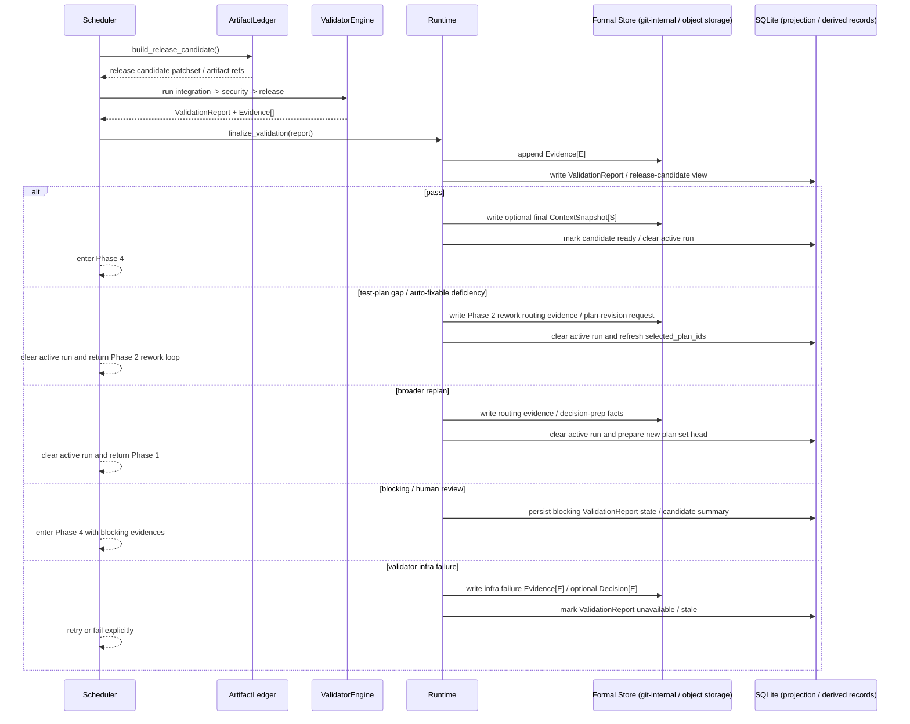

#### Phase 3 详细时序：`resume <thread>`

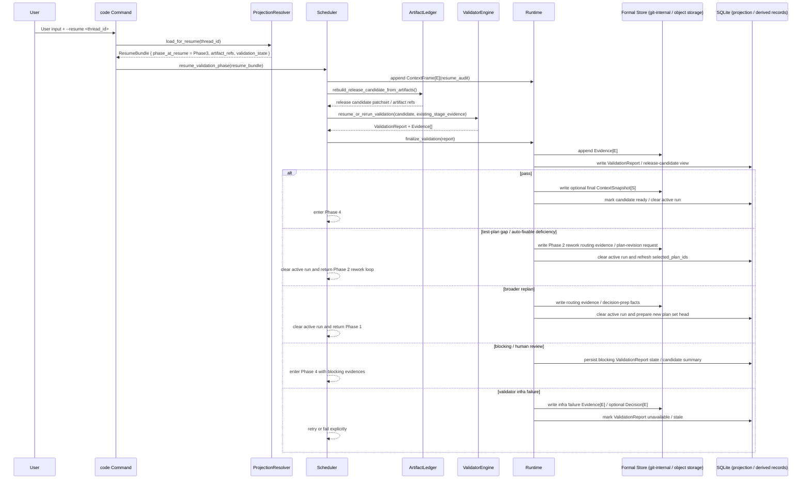

#### Phase 3 子步骤拆解

| 子步骤 | 输入 | 输出 | 说明 |
|---|---|---|---|
| candidate 聚合 | execution/test task artifacts、patchsets、usage、evidence | release candidate 视图 | 从执行产物构造系统级候选 |
| validator 执行 | release candidate、validation policy | stage results | `integration`、`security`、`release` 是固定 pipeline stage，不是 planner-defined DAG |
| evidence 规范化 | stage results | structured `Evidence[E]` / `ValidationReport` | 形成可查询、可审计的结果 |
| final context freeze 判定 | release candidate、当前 `working directory` / 仓库状态 | optional `ContextSnapshot[S]` | 只有稳定候选值得冻结 |
| test-plan sufficiency 判定 | validation outcome、test coverage facts、policy | Phase 2 rework / broader replan / pass | 明确区分“测试计划不足”和“整体计划错误” |
| 路由决策 | validation outcome、policy | enter Phase 4 / back to Phase 2 / back to Phase 1 / retry infra | Phase 3 的出口控制点 |

#### Phase 3 产物与约束

1. system-level validation 明确属于 Phase 3，不得混入 provider execution tool loop。
2. Phase 3 不得物化、调度或执行任何 planner-defined DAG；`dagrs` 与 task DAG 只属于 Phase 2。
3. `Evidence[E]` 和 `ValidationReport` 必须结构化，不允许只保留文本日志。
4. `ValidationReport` 持久化时必须携带生成它的 validator / policy version，保证后续 replay / rebuild 有确定输入。
5. validator failure 不得静默吞掉；至少要写 evidence 或 terminal failure 记录。
6. final `ContextSnapshot[S]` 只用于冻结稳定候选，不作为运行时增量上下文容器。
7. Phase 3 可以把流程路由回 Phase 2（test-plan / execution rework）或 Phase 1（broader replan），但不能直接绕过 Scheduler 重新启动 provider execution。

### Phase 4 Detailed Analysis

Phase 4 的职责是把 Phase 0 的风险基线与 Phase 2/3 的执行证据汇总成最终发布决策，并把结果投影回 thread / scheduler 的当前视图。它的核心不是再生成内容，而是做最终选择和状态推进。

#### Phase 4 目标

1. 计算最终风险分和 `DecisionProposal`。
2. 决定是自动合并、人工批准、人工拒绝、请求修改还是取消/放弃。
3. 写入 final `Decision[E]` 和可选 terminal `IntentEvent[E]`。
4. 推进 `ThreadProjection` / `SchedulerState` 到完成态、待修订态或空闲态。
5. 保证最终 `chosen_patchset_id` 和决策理由可审计、可回放。

#### Phase 4 路径规则

| 场景 | formal writes | projection 更新 | 下一步 |
|---|---|---|---|
| low risk auto-merge | `Decision(AutoMerge)` | `current_intent_id` 前进，Scheduler 置 idle | 完成 |
| human approve | `Decision(HumanApprove)` | 与 auto-merge 同步推进 | 完成 |
| human reject | `Decision(HumanReject)` | 清理 active 选择，保留 thread 历史 | 终止或回到 Phase 1 |
| request changes（plan-level） | `Decision(RequestChanges)`，随后写 replan 请求 / 新的 execution/test `Plan` revision | 指向新的 plan set head | 回到 Phase 1 |
| request changes（intent-level） | `Decision(RequestChanges)`，随后写新的 `Intent` revision | 指向新的 intent head，并清理当前 plan 选择 | 回到 Phase 0 |
| cancel | `Decision(Cancelled)` | Scheduler 置 idle | 终止 |
| abandon | `Decision(Abandon)` | Scheduler 置 idle | 终止 |

#### Phase 4 详细时序：新建路径（连续进入最终决策）

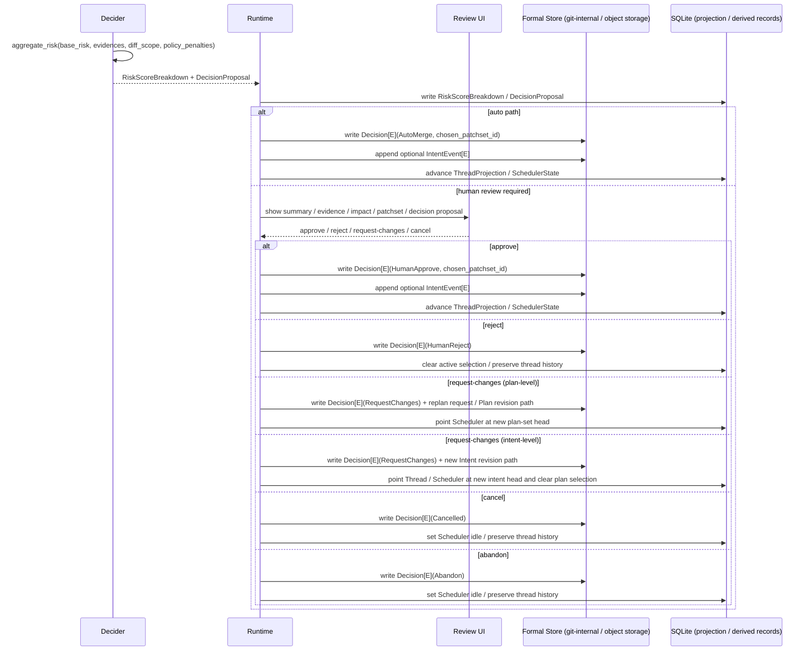

#### Phase 4 详细时序：`resume <thread>`

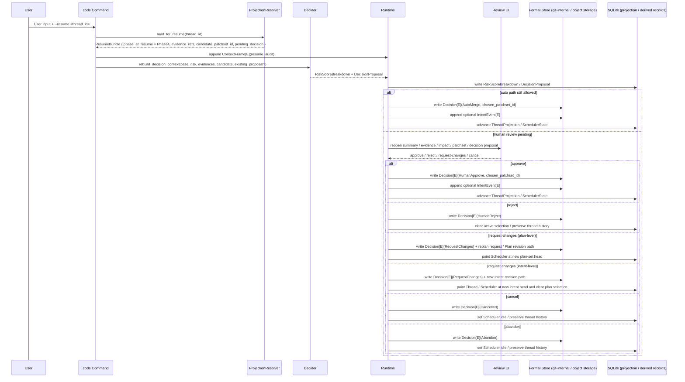

#### Phase 4 子步骤拆解

| 子步骤 | 输入 | 输出 | 说明 |
|---|---|---|---|
| 风险聚合 | Phase 0 risk、Evidence、diff scope、policy | `RiskScoreBreakdown` | 形成最终决策输入 |
| 决策提案生成 | `RiskScoreBreakdown`、validation outcome | 已持久化的 `DecisionProposal` | 区分 auto path 与 human review path |
| review / approval | `DecisionProposal`、candidate summary | approve / reject / request-changes(plan-level or intent-level) | 高风险路径的人类控制点 |
| final decision 写入 | decision 结果、chosen patchset | `Decision[E]`、可选 `IntentEvent[E]` | 最终不可变审计记录 |
| projection 推进 | final decision、intent / plan refs | idle / next revision / terminal state | Phase 4 的状态收口 |

#### Phase 4 产物与约束

1. 最终发布选择必须通过 `Decision[E]` 表达，不能通过覆写旧 Snapshot 表达。
2. `chosen_patchset_id` 必须显式记录，避免“最后到底发布了哪份候选”不可追踪。
3. `RiskScoreBreakdown` 和 `DecisionProposal` 持久化时必须携带生成它们的 decision policy version，保证缺失后可以 replay / rebuild。
4. Phase 4 不能自行生成新的 `Plan` / `Task`；若需要改动，必须根据变更层级回到 Phase 1（plan-level）或 Phase 0（intent-level）review loop。
5. 只有在 final `Decision[E]` 成功写入后，`ThreadProjection` / `SchedulerState` 才能推进到完成态或空闲态。
6. Phase 4 的风险分必须以 Phase 0 的 `risk_level` 为基线，再叠加 evidence 和 diff scope，而不是重新定义一个平行风险体系。

### SQLite Schema And Storage Placement

本计划明确采用“双层持久化”：

1. **对象存储 + git-internal history branch**：保存不可变 formal objects，是 `Intent` / `Plan` / `Task` / `Run` / `PatchSet` / `ContextSnapshot` / `Provenance` 以及全部 append-only Event 的真相源。
2. **SQLite (`sql/sqlite_20260309_init.sql`)**：保存当前运行视图、可重建 query index、live context window，以及 Phase 3 / Phase 4 的 runtime-owned derived records。SQLite 不是 formal snapshot / event 的主真相源。

这一章是对前文 “Snapshot / Event / Projection Design” 的落地化约束。实施时，`sql/sqlite_20260309_init.sql` 的 AI schema 必须与这里保持一致；对象存储与 SQLite 的职责边界也必须按这里执行。

#### Code 过程产生的数据：对象存储 vs SQL

| 数据族 | 对象存储 / git-internal | SQLite | 说明 |
|---|---|---|---|
| `Intent` / `IntentEvent` | **是** | 仅存 `ai_thread`、`ai_thread_intent` 中的当前 thread 视图与 membership | `Intent` revision chain、confirmed/cancelled lifecycle 是 formal history；SQL 只缓存当前 thread 视图，不复制完整 payload |
| `Plan` / `Task` / `PlanStepEvent` | **是** | `ai_scheduler_plan_head`、`ai_index_intent_plan`、`ai_index_intent_task`、`ai_index_plan_step_task` | `Plan` / `Task` 本体不可变，SQL 只保存“当前 head 是谁”“某个 intent 下有哪些 plan/task”等查找结果 |
| `Run` / `RunEvent` / `PatchSet` / `Evidence` / `ToolInvocation` / `ContextFrame` / `RunUsage` / `Provenance` | **是** | `ai_scheduler_state.active_run_id`、`ai_index_task_run`、`ai_index_run_event`、`ai_index_run_patchset`、`ai_live_context_window` | 执行事实、证据、上下文增量、补丁候选都必须进入 formal object/event 层；SQL 只保留当前活动执行指针与查找索引 |
| `ContextSnapshot` | **是** | 仅以 `context_snapshot_id` 形式被 thread/scheduler/derived records 间接引用 | `ContextSnapshot` 是冻结点，不落 SQL payload；SQLite 只保存引用关系或派生状态 |
| `Decision` / `IntentEvent` terminal state | **是** | thread / scheduler projection 仅缓存当前完成态、待修订态或 idle 态 | 最终决策必须回写 formal `Decision[E]`，不得只更新 SQL |
| `ThreadProjection` / `SchedulerState` / live context window | 否 | **是** | 这些是 Libra runtime 的当前视图，可重建，不应该反向写成 formal snapshot |
| Query Index（intent->plans、task->runs、run->patchsets 等） | 否 | **是** | 全部来自 formal history rebuild；缺失时允许 targeted rebuild 或全量扫描重建 |
| `ValidationReport` / `RiskScoreBreakdown` / `DecisionProposal` | 否，作为 formal history 的**派生产物**存在 | **是** | 它们是 Phase 3 / 4 runtime-owned derived records：直接供 UI / MCP / diagnostics 消费，但可由 Snapshot + Event + policy version replay / rebuild |

补充约束：

1. SQLite 中出现的 `intent_id` / `plan_id` / `task_id` / `run_id` / `patchset_id` / `context_frame_id` / `decision_id` 等字段，默认都只是**文本引用**，指向对象存储里的 formal object；除 `thread_id` 外，不要求也不允许把这些对象完整复制成 SQL 主表。
2. `IntentSpec Draft`、confirmed `IntentSpec`、review markdown、execution/test dual plan、per-task execution facts、validator evidence 和 final decision，最终都必须能从对象存储的 formal objects + events 重建；SQL 只缓存当前视图、查找结果或派生结果。
3. 不允许为 provider-specific transcript 再引入一套 shadow SQL tables；provider 私有 session/thread id 只能进入 metadata / mapping 字段，不能成为 SQL 主键语义。
4. Phase 3 / 4 的 derived record 缺失、过期或版本漂移时，必须允许 replay / rebuild；SQL 行丢失不能阻塞 thread 读取或 `--resume`。

#### 当前 SQLite 基线（摘自 `sql/sqlite_20260309_init.sql` 的 AI projection schema）

下面这些 DDL 是当前仓库已经存在的 AI projection / index 基线；`code` 改造必须建立在这个基线上，而不是重新发明一套平行 schema：

```sql
CREATE TABLE IF NOT EXISTS `ai_thread` (
    `thread_id` TEXT PRIMARY KEY,
    `title` TEXT,
    `owner_kind` TEXT NOT NULL,
    `owner_id` TEXT NOT NULL,
    `owner_display_name` TEXT,
    `current_intent_id` TEXT,
    `latest_intent_id` TEXT,
    `metadata_json` TEXT,
    `archived` INTEGER NOT NULL DEFAULT 0 CHECK (`archived` IN (0, 1)),
    `version` INTEGER NOT NULL DEFAULT 0,
    `created_at` INTEGER NOT NULL,
    `updated_at` INTEGER NOT NULL
);

CREATE TABLE IF NOT EXISTS `ai_thread_participant` (
    `thread_id` TEXT NOT NULL,
    `actor_kind` TEXT NOT NULL,
    `actor_id` TEXT NOT NULL,
    `actor_display_name` TEXT,
    `role` TEXT NOT NULL,
    `joined_at` INTEGER NOT NULL,
    PRIMARY KEY (`thread_id`, `actor_kind`, `actor_id`),
    FOREIGN KEY (`thread_id`) REFERENCES `ai_thread`(`thread_id`) ON DELETE CASCADE
);

CREATE TABLE IF NOT EXISTS `ai_thread_intent` (
    `thread_id` TEXT NOT NULL,
    `intent_id` TEXT NOT NULL,
    `ordinal` INTEGER NOT NULL,
    `is_head` INTEGER NOT NULL DEFAULT 0 CHECK (`is_head` IN (0, 1)),
    `linked_at` INTEGER NOT NULL,
    `link_reason` TEXT NOT NULL,
    PRIMARY KEY (`thread_id`, `intent_id`),
    FOREIGN KEY (`thread_id`) REFERENCES `ai_thread`(`thread_id`) ON DELETE CASCADE
);

CREATE TABLE IF NOT EXISTS `ai_scheduler_state` (
    `thread_id` TEXT PRIMARY KEY,
    `selected_plan_id` TEXT,
    `active_task_id` TEXT,
    `active_run_id` TEXT,
    `metadata_json` TEXT,
    `version` INTEGER NOT NULL DEFAULT 0,
    `updated_at` INTEGER NOT NULL,
    FOREIGN KEY (`thread_id`) REFERENCES `ai_thread`(`thread_id`) ON DELETE CASCADE
);

CREATE TABLE IF NOT EXISTS `ai_scheduler_plan_head` (
    `thread_id` TEXT NOT NULL,
    `plan_id` TEXT NOT NULL,
    `ordinal` INTEGER NOT NULL,
    PRIMARY KEY (`thread_id`, `plan_id`),
    FOREIGN KEY (`thread_id`) REFERENCES `ai_thread`(`thread_id`) ON DELETE CASCADE
);

CREATE TABLE IF NOT EXISTS `ai_live_context_window` (
    `thread_id` TEXT NOT NULL,
    `context_frame_id` TEXT NOT NULL,
    `position` INTEGER NOT NULL,
    `source_kind` TEXT NOT NULL,
    `pin_kind` TEXT,
    `inserted_at` INTEGER NOT NULL,
    PRIMARY KEY (`thread_id`, `context_frame_id`),
    FOREIGN KEY (`thread_id`) REFERENCES `ai_thread`(`thread_id`) ON DELETE CASCADE
);

CREATE TABLE IF NOT EXISTS `ai_index_intent_plan` (
    `intent_id` TEXT NOT NULL,
    `plan_id` TEXT NOT NULL,
    `created_at` INTEGER NOT NULL,
    PRIMARY KEY (`intent_id`, `plan_id`)
);

CREATE TABLE IF NOT EXISTS `ai_index_intent_task` (
    `intent_id` TEXT NOT NULL,
    `task_id` TEXT NOT NULL,
    `parent_task_id` TEXT,
    `origin_step_id` TEXT,
    `created_at` INTEGER NOT NULL,
    PRIMARY KEY (`intent_id`, `task_id`)
);

CREATE TABLE IF NOT EXISTS `ai_index_plan_step_task` (
    `plan_id` TEXT NOT NULL,
    `task_id` TEXT NOT NULL,
    `step_id` TEXT NOT NULL,
    `created_at` INTEGER NOT NULL,
    PRIMARY KEY (`plan_id`, `task_id`)
);

CREATE TABLE IF NOT EXISTS `ai_index_task_run` (
    `task_id` TEXT NOT NULL,
    `run_id` TEXT NOT NULL,
    `is_latest` INTEGER NOT NULL DEFAULT 0 CHECK (`is_latest` IN (0, 1)),
    `created_at` INTEGER NOT NULL,
    PRIMARY KEY (`task_id`, `run_id`)
);

CREATE TABLE IF NOT EXISTS `ai_index_run_event` (
    `run_id` TEXT NOT NULL,
    `event_id` TEXT NOT NULL,
    `event_kind` TEXT NOT NULL,
    `is_latest` INTEGER NOT NULL DEFAULT 0 CHECK (`is_latest` IN (0, 1)),
    `created_at` INTEGER NOT NULL,
    PRIMARY KEY (`run_id`, `event_id`)
);

CREATE TABLE IF NOT EXISTS `ai_index_run_patchset` (
    `run_id` TEXT NOT NULL,
    `patchset_id` TEXT NOT NULL,
    `sequence` INTEGER NOT NULL,
    `is_latest` INTEGER NOT NULL DEFAULT 0 CHECK (`is_latest` IN (0, 1)),
    `created_at` INTEGER NOT NULL,
    PRIMARY KEY (`run_id`, `patchset_id`)
);

CREATE TABLE IF NOT EXISTS `ai_index_intent_context_frame` (
    `intent_id` TEXT NOT NULL,
    `context_frame_id` TEXT NOT NULL,
    `relation_kind` TEXT NOT NULL,
    `created_at` INTEGER NOT NULL,
    PRIMARY KEY (`intent_id`, `context_frame_id`, `relation_kind`)
);
```

说明：

1. 这套基线已经足够表达 `ThreadProjection`、`current_plan_heads`、`live_context_window` 和主要 query index。
2. 它**还不足以**完整表达 `selected_plan_ids`（当前只有单值 `selected_plan_id`）以及 Phase 3 / Phase 4 的 derived records。
3. 因此，本计划不要求把 formal objects 搬进 SQL，而是要求在现有 projection schema 上做**定向补洞**。

#### 本计划要求追加到 SQLite bootstrap 与 migration 的 DDL

这些 DDL 必须同时出现在两个位置：

1. `sql/sqlite_20260309_init.sql`：服务新初始化 repo。
2. `sql/sqlite_YYYYMMDD_ai_runtime_contract.sql`：服务已有 `.libra/libra.db` 的幂等升级。

如果当前仓库尚未提供完整 migration runner，Phase 0 至少必须先提交独立 migration SQL、dry-run preview 设计和 verify checklist；Phase 2 identity cutover 前再接入实际执行入口。不允许只更新 bootstrap 后假设老用户数据库自然可用。

首先，`selected_plan_id` 是当前 schema 的单值遗留字段，只能表达“一个被选中的 plan”，无法表达 Phase 1 / Phase 2 所需的 execution/test `selected_plan_ids`。目标态必须追加 dedicated table，并把 `ai_scheduler_state.selected_plan_id` 视为迁移兼容字段：

```sql
CREATE TABLE IF NOT EXISTS `ai_scheduler_selected_plan` (
    `thread_id` TEXT NOT NULL,
    `plan_id` TEXT NOT NULL,
    `ordinal` INTEGER NOT NULL,
    PRIMARY KEY (`thread_id`, `plan_id`),
    FOREIGN KEY (`thread_id`) REFERENCES `ai_thread`(`thread_id`) ON DELETE CASCADE
);
CREATE UNIQUE INDEX IF NOT EXISTS idx_ai_scheduler_selected_plan_thread_ordinal
    ON `ai_scheduler_selected_plan`(`thread_id`, `ordinal`);
```

目标 contract：每个 `thread_id` 在 `ai_scheduler_selected_plan` 中必须恰好存在两行，`ordinal = 0` 表示 `execution_plan_id`，`ordinal = 1` 表示 `test_plan_id`。

其次，Phase 3 / Phase 4 的 runtime-owned derived records 需要独立 SQL tables；这些表直接服务 UI / MCP / diagnostics，但不是 formal history 真相源：

```sql
CREATE TABLE IF NOT EXISTS `ai_validation_report` (
    `report_id` TEXT PRIMARY KEY,
    `thread_id` TEXT NOT NULL,
    `candidate_patchset_id` TEXT,
    `status` TEXT NOT NULL,
    `validator_name` TEXT NOT NULL,
    `validator_version` TEXT NOT NULL,
    `policy_version` TEXT NOT NULL,
    `summary_json` TEXT NOT NULL,
    `stale` INTEGER NOT NULL DEFAULT 0 CHECK (`stale` IN (0, 1)),
    `is_latest` INTEGER NOT NULL DEFAULT 0 CHECK (`is_latest` IN (0, 1)),
    `created_at` INTEGER NOT NULL,
    `updated_at` INTEGER NOT NULL,
    FOREIGN KEY (`thread_id`) REFERENCES `ai_thread`(`thread_id`) ON DELETE CASCADE
);
CREATE INDEX IF NOT EXISTS idx_ai_validation_report_thread_created
    ON `ai_validation_report`(`thread_id`, `created_at`);
CREATE UNIQUE INDEX IF NOT EXISTS idx_ai_validation_report_latest
    ON `ai_validation_report`(`thread_id`) WHERE `is_latest` = 1;

CREATE TABLE IF NOT EXISTS `ai_risk_score_breakdown` (
    `breakdown_id` TEXT PRIMARY KEY,
    `thread_id` TEXT NOT NULL,
    `candidate_patchset_id` TEXT,
    `policy_version` TEXT NOT NULL,
    `total_score` REAL NOT NULL,
    `breakdown_json` TEXT NOT NULL,
    `stale` INTEGER NOT NULL DEFAULT 0 CHECK (`stale` IN (0, 1)),
    `is_latest` INTEGER NOT NULL DEFAULT 0 CHECK (`is_latest` IN (0, 1)),
    `created_at` INTEGER NOT NULL,
    FOREIGN KEY (`thread_id`) REFERENCES `ai_thread`(`thread_id`) ON DELETE CASCADE
);
CREATE INDEX IF NOT EXISTS idx_ai_risk_score_breakdown_thread_created
    ON `ai_risk_score_breakdown`(`thread_id`, `created_at`);
CREATE UNIQUE INDEX IF NOT EXISTS idx_ai_risk_score_breakdown_latest
    ON `ai_risk_score_breakdown`(`thread_id`) WHERE `is_latest` = 1;

CREATE TABLE IF NOT EXISTS `ai_decision_proposal` (
    `proposal_id` TEXT PRIMARY KEY,
    `thread_id` TEXT NOT NULL,
    `candidate_patchset_id` TEXT,
    `chosen_patchset_id` TEXT,
    `recommended_action` TEXT NOT NULL,
    `requires_human_review` INTEGER NOT NULL DEFAULT 0 CHECK (`requires_human_review` IN (0, 1)),
    `policy_version` TEXT NOT NULL,
    `summary_json` TEXT NOT NULL,
    `stale` INTEGER NOT NULL DEFAULT 0 CHECK (`stale` IN (0, 1)),
    `is_latest` INTEGER NOT NULL DEFAULT 0 CHECK (`is_latest` IN (0, 1)),
    `created_at` INTEGER NOT NULL,
    `updated_at` INTEGER NOT NULL,
    FOREIGN KEY (`thread_id`) REFERENCES `ai_thread`(`thread_id`) ON DELETE CASCADE
);
CREATE INDEX IF NOT EXISTS idx_ai_decision_proposal_thread_created
    ON `ai_decision_proposal`(`thread_id`, `created_at`);
CREATE UNIQUE INDEX IF NOT EXISTS idx_ai_decision_proposal_latest
    ON `ai_decision_proposal`(`thread_id`) WHERE `is_latest` = 1;
```

设计说明：

1. 这些新表都只以 `thread_id` 建立 SQL foreign key；`patchset_id` / `plan_id` / `run_id` 等 formal object id 保持为文本引用，因为对应对象的真相源仍在对象存储中，不在 SQLite 中。
2. `summary_json` / `breakdown_json` 是 UI / MCP 直接消费的结构化 payload；缺失时可以 replay / rebuild，不得作为新的独立真相源。
3. `is_latest` + partial unique index 用来表达“每个 thread 当前最新的一份 derived record”；历史版本仍然保留，方便审计与回放。
4. `stale` 用于降级读与 targeted rebuild：派生结果版本漂移时先标 stale，再重算，不允许因一条 derived row 缺失而阻塞线程读取或 `--resume`。

#### 对 `sql/sqlite_20260309_init.sql` 的实施约束

1. `sql/sqlite_20260309_init.sql` 中**不新增** `ai_intent` / `ai_plan` / `ai_task` / `ai_run` / `ai_patchset` 这类 formal snapshot 主表；这些对象继续留在对象存储 + git-internal history branch。
2. `sql/sqlite_20260309_init.sql` 中**允许新增** projection、query index、runtime-owned derived record 表，因为它们本身就是可重建的运行时视图或派生产物。
3. `ai_scheduler_state.selected_plan_id` 在迁移期仅作兼容读写字段；目标实现必须切到 `ai_scheduler_selected_plan`，并以该表表达顺序固定的 `selected_plan_ids = [execution_plan_id, test_plan_id]`。
4. 任一 SQL 行丢失都不能破坏 formal history；系统必须允许通过 Snapshot + Event rebuild SQL projection / index / derived records。
5. 任何 provider-specific shadow schema、provider transcript 主表或把 provider session 直接变成 SQL 主键的设计，都违反本计划。
6. migration 必须幂等、非破坏性；不 drop 旧 `selected_plan_id`，至少保留到 identity/projection cutover 后一个 release。
7. `legacy_session_id` / `provider_thread_id` 只能进入 `metadata_json` 或一次性 mapping / verify 报告；不得成为新的 SQL 主键语义。

### ContextSnapshot 写入条件

下列情形写入 `ContextSnapshot`；不满足条件时不写：
- Phase 0 新 thread 首次冻结，且当前 `working directory` / `main worktree` 存在未提交变更。
- Phase 0 `--resume` 且用户追加新要求，或当前 repo baseline 相对上次冻结发生实质变化；在确认当前 revision 后判定需要重新冻结。
- Phase 3 验证通过后确认为 release candidate。
- 人工请求冻结当前上下文。

`ContextSnapshot` 的来源约束：

1. Phase 0 的 `ContextSnapshot` 由 Runtime 基于当前 `working directory` / repo baseline 采集和冻结。
2. 它不是 Codex 或通用大模型 tool loop 的原始输出容器。
3. provider 在 Phase 0 / Phase 1 / Phase 2 期间产生的增量上下文都应进入 `ContextFrame[E]`，不是反向回填 `ContextSnapshot[S]`。
4. 若 Phase 0 没有值得冻结的未提交基线，可以不写 `ContextSnapshot`；这不会阻塞 projection seed。`ThreadProjection` / `SchedulerState` 的最小 seed 来自 confirmed `Intent`、canonical `thread_id` 和 thread bootstrap / refresh 结果，而不是强依赖 snapshot。

### ContextSnapshot 冻结操作定义

这里的“冻结”不是只做一个标记，而是一组原子化操作：把某一时刻可复现的上下文基线采集、归一化、落盘并建立可追踪引用。

| 步骤 | Runtime 执行操作 | 输出 |
|---|---|---|
| 1. 采集基线 | 读取当前 `working directory` / `main worktree` 状态（tracked/untracked/modified 摘要）、HEAD/ref、必要的索引与配置摘要、当前 thread/intent 关联信息 | 内存态 baseline payload |
| 2. 归一化与脱敏 | 对路径/时间戳/环境差异字段做规范化；按 redaction 规则去除敏感信息；剔除不可重放噪声字段 | canonical snapshot payload |
| 3. 内容寻址写入 | 通过 Runtime 写入不可变 `ContextSnapshot[S]`，生成 `context_snapshot_id`（内容变化才产生新快照） | `ContextSnapshot[S]` |
| 4. 建立引用关系 | 在当前 phase 结果中记录 `context_snapshot_id`，并把 thread/scheduler 当前视图指向该快照作为恢复锚点 | projection 引用更新 |
| 5. 审计记录 | 追加一条 `ContextFrame[E]`（kind 可为 snapshot_freeze），记录触发原因、来源 phase、快照 id | `ContextFrame[E]` |

补充约束：

1. 冻结必须经由 `Runtime` 完成，不允许 UI 或 provider 直接写 `ContextSnapshot`。
2. 冻结是“时间点快照”，不是增量日志容器；后续增量上下文继续写 `ContextFrame[E]`。
3. 同一基线重复冻结应幂等（可复用同一 `context_snapshot_id` 或产生等价内容哈希），不得制造语义重复快照。
4. 若冻结失败：不得阻塞线程读取；需写入失败 evidence（如 `Evidence(kind=ContextSnapshotFreezeFailed)`）并把 projection 标记为可恢复的 stale 状态，等待重试或人工介入。

---

## Context

本计划把 `libra code` 作为一个完整命令来收敛，目标有五项：

1. 建立共享 `Runtime`、`TaskExecutor`、prompt assembly 和事件契约，让 Scheduler 成为唯一控制面。
2. 统一 `thread_id` 语义，使 Libra `thread_id` 成为唯一的用户可见恢复标识，并补齐 targeted rebuild / resume 合同。
3. 把 Code UI 收敛到共享 read model，让 TUI、Web、CLI controller 不再维护各自独立的运行时真相。
4. 为所有 provider 建立共享的 `ArtifactLedger`、`ValidatorEngine` 和 `DecisionProposal`，把验证与决策从 provider 内存态提升为 formal object 流。
5. 收口安全、权限、诊断、性能与测试体系，并清理遗留的 provider-specific managed surface（含 `claudecode` runtime）。

本计划采用"先定义上位契约，再说明当前基线，最后给出按顺序执行的实施步骤"的结构。阅读顺序和执行顺序保持一致，避免实现者在多个章节之间来回跳读。

### Hard Constraints

1. Libra 是版本管理核心，Codex 是接入到 Libra 工作流中的托管 provider/runtime。
2. provider 的 VCS 操作必须通过 Libra 能力完成，禁止直接使用 `git`、`jj` 或其它版本管理工具。
3. Codex 路径中的 `approvalPolicy` 只有在 Libra 完整接管工具边界与审批语义后才收敛为 `never`；实施过程中不得提前强制到尚未受 `Runtime` 控制的路径。
4. Phase 0 和 Phase 1 中 provider 只允许调用 readonly tools；任何会修改当前 `working directory` / `main worktree`、VCS 或外部状态的 tool 都必须等到 Phase 2 由 Scheduler 驱动执行。
5. 所有阶段划分、对象写入和运行时投影，都必须遵循 `docs/agent/agent-workflow.md` 和 `docs/agent/ai-object-model-reference.md`。
6. 合成出的 `IntentSpec` 和 `Plan` 都必须以易读的 Markdown review 形式展示给开发者确认，不能以原始 JSON 或难以审阅的结构化对象替代审查界面。
7. Libra `thread_id` 是 `code` 命令唯一的用户可见恢复 ID；provider-specific ID 只允许作为内部映射字段存在。
8. `claudecode` 不是过渡期保留组件；删除必须在 `Implementation Phase 1 / Wave 1C` 的同一合入波次中完成：切完最后一个调用点后立即一次性删除其全部运行时代码、CLI 标志、文档说明和测试，不允许跨 phase 保留可发布的双栈、feature flag、deprecated path、兼容别名或中间运行态。`Wave 1A / 1B` 可以先引入共享 contract、mock 和薄适配层，但不得新增或延长任何用户可见 `claudecode` 兼容契约。唯一允许的兼容只限本地 `thread_id` 数据迁移时一次性读取旧字段，不能反向保留旧的用户可见契约。
9. Libra Scheduler 拥有 Phase 2 的控制权：Codex 不能自主跑完整个计划；Libra 按 Task 驱动所有 provider（包括 Codex），而不是 provider 告诉 Libra 执行到了哪一步。
10. 持久化统一：所有 provider 路径只允许通过共享 `Runtime` 层写入 formal objects，禁止再写 provider-specific shadow snapshot/event 家族。
11. Projection 字段直接对应：代码中的 `pending_plan_revision` 必须重构为 `Scheduler.selected_plan_ids` / `current_plan_heads` 直接映射，不允许在 `code` 命令专有状态中另造独立变量。
12. 通用方案对等原则：凡是 Codex 路径具备的 formal 能力（review loop、revision chain、formal writes、projection 更新），通用 provider 路径必须具备相同能力，不允许降级为 placeholder 或 stub。
13. Query Index 可重建契约：`Thread`、`Scheduler`、Query Index 的丢失不能阻塞读访问；必须能从 Snapshot + Event 完整重建，重建入口必须有显式触发条件和降级读路径定义。

## Recommended Reading Order

建议按下面顺序阅读本计划：

1. `Workflow Contract`：先建立上位模型、Phase 0-4 的边界，重点理解 Phase 0 输入合同、Phase 3/4 状态机和控制权归属。
2. `Context`：再看本轮改造的目标和硬约束。
3. `Terminology`：先统一本计划中的专用词义，避免把 `CAS`、`thread_id`、`DecisionProposal` 等读成别的概念。
4. `Query Index And Rebuild/Read Contract`：理解投影层的可重建承诺。
5. `Current Baseline`：理解当前代码已经做到什么、哪些是核心缺陷（而非中性事实陈述）。
6. `Implementation-Level Spec`：理解 trait 形状、状态流、事件模型和代码映射。
7. `Delivery Order`：理解这批改造为什么必须先做 `Implementation Phase 0: Contract Stabilization`，再按 `Implementation Phase 1` → `Implementation Phase 5` 执行。
8. `Implementation Phase 0 / 1 / 2 / 3 / 4 / 5`：按执行顺序阅读实施内容、影响模块、完成定义和用户影响。
9. `Shared Function Boundary`：理解哪些函数必须共享，哪些仅 provider 适配层可实现。
10. `Appendix A / Appendix B`：最后再看当前 prompt assembly、ContextFrame、provider mapping 等实现细节。
11. `Validation`：最终看验收标准和完整测试策略。

---

## Terminology

本节只定义本计划中的用词，不试图覆盖这些词在其他系统里的通用含义。凡遇到歧义，以这里的定义为准。

| 术语 | 在本文中的含义 | 明确不是 |
|---|---|---|
| `Workflow Phase 0-4` | Libra runtime 中真实发生的 workflow 阶段：Intent、Planning、Execution、Validation、Decision | 不是实施顺序，不等于 `Implementation Phase 0-5` |
| `Implementation Phase 0-5` | 这份重构计划的交付顺序，用来描述先做哪一批改造 | 不是运行时状态机，不参与 formal object 写入 |
| `Implementation Phase 0: Contract Stabilization` | 真正切主路径前的工程底座补丁：dagrs spike、mock、benchmark baseline、schema migration plan、核心 enum / mutation / freshness contract | 不是运行时 Phase 0 Intent workflow，也不是可跳过的准备工作 |
| `Wave 1A / 1B / 1C` | `Implementation Phase 1` 内的三个可独立审查波次：contract only、scheduler/environment cutover、provider surface cleanup | 不是长期双栈策略，也不是 feature flag 发布路线 |
| `CAS` | `Compare-And-Swap`，即基于 `version` 的乐观并发更新模式 | 不是 `Content-Addressable Storage` |
| canonical `thread_id` | Libra 唯一对用户可见的恢复 ID，定义为 root intent UUID | 不是 provider session/thread ID，也不是旧 `session_id` |
| `provider_thread_id` | provider 原生 thread/session 标识，仅存 metadata 供诊断、查询映射使用 | 不参与 `--resume`、Web `/threads`、MCP `list_threads` 的主键语义 |
| targeted rebuild | 仅针对指定 `thread_id` 的 projection / query index 重建，而不是全量重扫整个库 | 不是 latest-thread 启发式恢复，也不是每次读都全量 rebuild |
| degraded read | projection 缺失或过期时，先返回从 immutable history 直接构造的轻量视图，并标记 stale | 不是 silently fallback 到旧 session/private cache |
| plan set | Phase 1 产出的固定双计划，且只能包含 `execution` 与 `test` 两类 `Plan` | 不是单个 `Plan`，也不是 provider 随手返回的一段 plan text |
| `current_plan_heads` | 当前 revision 链上最新、可继续修改或审查的 plan heads | 不表示“已批准执行” |
| `selected_plan_ids` | 已经在 `Execute` 分支被批准、将进入 Phase 2 执行的 plan heads；固定顺序为 `[execution_plan_id, test_plan_id]` | 不等于所有历史 plan heads，也不等于 draft review 中的候选集合 |
| `ExecutionEnvironmentProvider` | Libra 提供的 Phase 2 执行环境边界：`Sandbox`、task `Worktree`、sync back、cleanup | 不是泛化的 workspace manager，也不是 provider 自己的运行时沙箱 |
| controller lease | TUI / Web 之间的单写者输入控制权协议；谁持有 lease，谁可以提交交互输入 | 不是整条 thread 的独占锁，也不改变 immutable history 的可读性 |
| typed delta | 带类型、带序号、支持 gap recovery 的 UI 事件增量流 | 不是原始 transcript 追加流，也不是 provider-native websocket payload 原样透传 |
| `ContextFrame` | 用于 live context window 的结构化 Event 摘要，记录上下文事实与压缩行为 | 不是原始日志容器，也不替代 `ToolInvocation` |
| `ArtifactLedger` | Phase 3 用来汇总 per-task patch/evidence/usage/context 并形成 release candidate 输入的正式聚合层 | 不是另一个 shadow store，也不是替代 immutable formal objects 的真相源 |
| `ValidationReport` | Phase 3 产出的结构化验证结果；作为 runtime-owned derived record 持久化，供 UI / MCP / diagnostics / Phase 4 直接消费 | 不是 provider transcript，也不是旧 `SystemReport` 内存态 |
| `DecisionProposal` | Phase 4 基于风险与验证结果生成的“待执行/待审批决策提案”；缺失时可按 Snapshot + Event + policy version replay | 不是 final `Decision`，也不等于用户已经 approve/reject |
| release candidate patchset | 进入 Phase 3/4 系统验证与决策的候选补丁集合视图 | 不是自动已发布结果，也不保证一定进入 auto-merge |
| `approvalPolicy=never` | 目标态下 provider 侧可采用的“Libra 已完全接管 tool boundary”配置 | 不是当前默认前提，也不能在 boundary 未收口前提前假定成立 |
| `LegacyInteractive` | `Wave 1A` 前的现状审批语义，provider / UI 仍可能直接承载交互审批 | 不是目标态，也不能在 Wave 1B 后继续作为主路径 |
| `RuntimeMediatedInteractive` | `Wave 1B` 到 Phase 5 之间的中间态：Runtime / ToolBoundaryPolicy 接管 readonly / mutating 边界，但 mutating approval 仍通过共享 interaction 明确展示 | 不是 `approvalPolicy=never` |
| `RuntimeMediatedNever` | Phase 5 完成 tool boundary、audit、redaction、policy tests 后才允许启用的终态 | 不是 Phase 1 删除 `claudecode` 时可以提前假定的配置 |
| `Cancelled` | 用户或 operator 在 review / execution 未完成前主动取消 workflow | 不是已经评估候选结果后决定不发布 |
| `Abandon` | 系统或人类在已有执行 / 验证事实后决定不发布候选结果 | 不是普通用户取消 |

---

## Query Index And Rebuild/Read Contract

对应 `docs/agent/ai-object-model-reference.md` 第 213-330 行要求。

### 可重建承诺

| 可重建对象 | 可重建来源 | 触发条件 |
|---|---|---|
| `ThreadProjection` | `Intent` + `Intent.parents` + `IntentEvent.next_intent_id` | Thread 行缺失或 version 不一致时 |
| `SchedulerState` | `Plan` + `Task` + `Run` + `PlanStepEvent` + `RunEvent` | Scheduler 行缺失或 active_run_id 指向已终止 Run 时 |
| Query Index | 扫描全量 Snapshot + Event | 索引行缺失或查询结果与 Snapshot 不一致时 |
| Phase 3/4 structured outputs（`ValidationReport` / `RiskScoreBreakdown` / `DecisionProposal`） | thread 相关 Snapshot + Event + 记录下来的 validator / decision policy version | runtime-owned output row 缺失、版本漂移，或 diagnostics / UI 读路径命中 stale 标记时 |

### 读路径降级规则

```text
读 Thread：
  1. 优先 Libra projection（DB ThreadProjection 行）
  2. 若缺失：触发 rebuild，异步填充，同步返回重建结果
  3. 若重建失败：返回从 Intent history 直接构造的轻量视图，标记为"projection stale"

读 Scheduler：
  1. 优先 Libra projection（DB SchedulerState 行）
  2. 若缺失：从 Plan + Task + Run 事件流重建，同步返回
  3. 不允许因 Scheduler 缺失而阻塞 Phase 2 执行

读 Query Index（intent->plans 等）：
  1. 优先内存 / DB index
  2. 若缺失：全量扫描 Snapshot + Event 生成
  3. Index 扫描不影响主路径正确性，只影响读性能

读 Phase 3/4 structured outputs：
  1. 优先 runtime-owned record（`ValidationReport` / `RiskScoreBreakdown` / `DecisionProposal`）
  2. 若缺失或 stale：按 Snapshot + Event + recorded policy version targeted replay / rebuild
  3. 若 replay 失败：返回带 stale / unavailable 标记的视图，并写诊断 evidence；不得阻塞 thread 读取或 `--resume`
```

### 重建策略

- Thread / Scheduler rebuild 仅触发一次，结果落库；不在每次请求时重建。
- Phase 3/4 structured outputs 允许独立 replay / materialize；它们是可丢弃并可重算的 derived records，不是独立真相源。
- rebuild 期间读取允许返回"stale"标记，不允许返回错误（保证可用性）。
- rebuild 失败时记录 `Evidence(kind=ProjectionRebuildFailed)`，人工介入。

### Projection Freshness SLA

所有 read / resume / Phase 3/4 derived-record 读取都必须返回显式 freshness，而不是只返回数据或错误：

| Freshness | 允许行为 | 禁止行为 |
|---|---|---|
| `Fresh` | 正常读取、`--resume`、scheduler mutation、Phase 3/4 推进、final decision 写入 | none |
| `StaleReadOnly` | UI / MCP / diagnostics 读取、`--resume` 触发 targeted rebuild、展示 degraded view | 写 final `Decision`、推进 Scheduler、auto-merge |
| `Unavailable` | 返回 degraded view、写 `Evidence(kind=ProjectionRebuildFailed)`、允许 diagnostics / 人工修复 | 自动恢复执行、auto-merge、静默降级为 provider transcript |

补充规则：

1. `ValidationReport` / `RiskScoreBreakdown` / `DecisionProposal` stale 时，Phase 4 不能 auto-merge；必须先 replay / recompute，失败则进入 human review 或 validator infrastructure failure。
2. `ProjectionResolver::load_for_resume(thread_id)` 必须先处理 projection freshness，再做 phase-specific resume；不允许在 stale scheduler 上直接推进执行。
3. 同一 thread 连续 CAS conflict 或 rebuild failure 必须写 diagnostics evidence，并暴露给 diagnostics CLI。

### `--resume <thread_id>` 跨阶段恢复合同（Phase 0 / 1 / 2 / 3 / 4）

恢复入口统一为 `ProjectionResolver::load_for_resume(thread_id)`。解析 `ThreadProjection`、`SchedulerState`、最近 `Run` / `TaskEvent` / `RunEvent` / `Decision` 后，必须先判定恢复时刻属于哪个 phase，再执行对应恢复动作。

| 恢复时刻 | 判定条件（最小集合） | 恢复动作 | 禁止行为 |
|---|---|---|---|
| Phase 0 review 待完成 | 存在当前 draft / revision `Intent`，但无 confirmed current intent；或存在未决 `Confirm / Modify / Cancel` review 状态 | 1) 重建当前 intent draft / review markdown；2) 重新打开 IntentSpec review；3) 仅在用户显式选择时重新触发 provider 细化 | 不允许把上次 provider 暂存输出当作已确认 `Intent`；不允许跳过 Intent review 直接进入 Phase 1 |
| Phase 1 plan review 待完成 | 已有当前 `current_plan_heads`，但 `selected_plan_ids` 为空，且无 active run；或存在未决 `Execute / Modify Plan / Revise Intent / Cancel` review 状态 | 1) 基于当前 plan heads 重建 plan-set review；2) 恢复 review 选择入口；3) 仅在用户显式要求 `Modify Plan` 时重新进入 planning 调用 | 不允许隐式 auto-execute；不允许把 `current_plan_heads` 直接视为已批准 `selected_plan_ids` |
| Phase 2 执行中断 | `SchedulerState.active_run_id != None` 且该 run 无 terminal `RunEvent` / `TaskEvent`；或存在 ready/running task 未收口 | 1) 将 non-terminal run 标记为 `Interrupted` 并写事件；2) 清理旧 sandbox/worktree 句柄并重新 provision；3) 依据 `selected_plan_ids` + 事件流重建 ready queue；4) 从未完成 task 继续（必要时按 policy 重试当前 attempt） | 不允许复用中断前的 provider 私有会话作为系统真相；不允许跳过 `Runtime` 直接改 projection |
| Phase 3 验证中断 | 已有 release candidate artifacts，但无 final validation completion 记录；或 validation stage 仅部分落库 | 1) 以当前 artifacts 重新构造 release candidate；2) 对未完成/不完整 stage 重新执行 `integration -> security -> release`；3) 仅当 stage evidence 完整且校验通过时复用已完成 stage 结果 | 不允许把“内存中的 stage 进度”视为已完成；不允许跳过失败 stage 直接进入 Phase 4 |
| Phase 4 决策待完成 | 存在 `DecisionRequested` 或 human-review waiting 状态，但无 final `Decision` | 1) 重建 decision context（risk breakdown + evidence + chosen patchset candidate）；2) 重新打开 human review 或继续 auto path 判定；3) 写入 final `Decision` 后再推进 projection | 不允许重复执行 Phase 2/3 来“覆盖”待决策状态；不允许在无 final `Decision` 时推进 `ThreadProjection` 完成态 |
| Phase 4 已完成 | 已有 final `Decision`（AutoMerge、HumanApprove、HumanReject、Cancelled、Abandon） | 返回只读恢复视图（summary + audit chain），并允许用户显式发起新 revision（回 Phase 0/1） | 不允许隐式重放执行或重复写 final `Decision` |

补充规则：

1. `load_for_resume()` 的输出必须包含 `phase_at_resume`、`resume_reason`、`resume_actions`，并写入 `ContextFrame[E]` 作为审计轨迹。
2. 只要发现 projection 缺失/过期，先按 Snapshot + Event targeted rebuild，再执行 phase-specific resume；不允许因 projection 缺失阻塞恢复。
3. 恢复过程中的任何状态修复（如 interrupted 标记、queue 重建、review reopening）都必须事件化；projection 只缓存“当前视图”。
4. Phase 0 / Phase 1 的恢复默认是“重开 review gate”，不是“自动重放 provider 输出”；只有执行阶段和系统验证阶段才允许进入 phase-aware rerun / resume 逻辑。

---

## Current Baseline

### 已成立的事实

| 能力 | 现状 |
|---|---|
| Native plan collaboration mode | Codex `turn/start` 已携带 `collaborationMode: {"mode":"plan"}` |
| 强制 Plan 审查入口 | Codex TUI 可在 Codex 响应后进入 `Execute Plan / Modify Plan / Cancel` 审查流 |
| Early intercept | `response_text >= 100` 或已有 plan summary 时可提前合成 IntentSpec |
| Timeout fallback | 30 秒无有效响应时，可从 prompt 合成 IntentSpec |
| IntentSpec 合成 | Codex 响应可转为以易读 Markdown 展示的 IntentSpec review，进入现有审查工作流 |
| Plan 修订 | 支持基于现有 IntentSpec 发起多轮 plan revision；当前待修订链由 Libra runtime 状态维护 |
| 局部 MCP 跟踪 | 当前已写入 prompt 提交和 post-plan 选择对应的 `ContextFrame` |
| 交互桥接雏形 | `request_user_input` 与 sandbox approval 已能进入统一 `CodeUiInteraction` / TUI 交互链路 |
| Shared Code UI runtime 雏形 | 已有 `CodeUiSession`、`CodeUiProviderAdapter`、`CodeUiRuntimeHandle` 与 browser controller lease 机制 |
| DAG 执行底座 | `Orchestrator<M>` 已接入 `dagrs`，当前 `Cargo.toml` 版本为 `0.6.0` |
| 隔离 task worktree + 变更回写 | 执行器已可为 task 准备 isolated `Worktree`，并在成功后把变更串行同步回当前 `main worktree` / `working directory` |
| ThreadProjection / SchedulerState | Projection 类型已完整定义（`projection/thread.rs`、`projection/scheduler.rs`） |
| Projection rebuild / materialization 雏形 | 已有 `ProjectionRebuilder`，可从 formal objects 重建并 materialize latest-thread projection |
| Legacy resume 入口 | `--resume` 当前仍按 working directory 加载最近 session；虽然还不是 canonical `thread_id`，但恢复入口已存在 |
| Orchestrator\<M\> | 通用路径已有完整 Phase 0-4 骨架 |

### 已落地的主路径

```text
用户 Prompt
  -> Codex native plan mode
  -> PostPlanChoice 或 early intercept
  -> IntentSpec review
  -> TUI: [Execute] [Modify] [Cancel]
```

其中，`Modify` 走 generic planner 路径，继续使用现有 `submit_intent_draft` 工作流；`Execute` 走 Codex runtime 直连执行，不经过 generic `Orchestrator<M>`。

### 初始基线的核心缺陷（Phase 0 前）

本小节记录的是开始 `Implementation Timeline` 前的施工基线，用于解释后续 phase 的来源；每个 wave 合入后，实际代码状态以对应提交和验证结果为准。

| 缺陷 | 严重性 | 说明 |
|---|---|---|
| **通用 provider 方案无可实施闭环** | 高 | 改进计划当前仍明显偏向 Codex，通用 `Orchestrator<M>` 的 review loop、revision chain、共享 Code UI 接入和 formal phase 行为都还不能与 Codex 路径对等落地 |
| **Phase 0 / Phase 1 仍是单轮 plan-first 流** | 高 | 当前首轮路径仍是 `request -> plan text -> 本地 resolve IntentSpec`，没有“IntentSpec 先确认、Plan 后确认”的双 review 合同 |
| **Execute 走 Codex 直连，不走 Scheduler** | 高 | 控制权在 Codex，Libra 退化为 Logger，违反 Workflow Contract |
| **两套执行引擎共存** | 高 | `Orchestrator<M>` 与 Codex TUI turn loop 完全分离，持久化、控制流、resume 和审计语义已经分叉 |
| **McpExecutionTracker 旁路写入** | 高 | TUI 层监听 Codex 事件并写 formal objects，UI 与核心模型严重耦合，formal writes 无法统一收口到共享 `Runtime` |
| **Phase 3/4 formal pipeline 未落地** | 高 | 系统验证仍主要依赖 planner / gate task 与现有 Orchestrator 路径，`ArtifactLedger`、`ValidatorEngine`、`DecisionProposal` 尚未形成可重放、可恢复、可供 UI/MCP 直接消费的正式闭环 |
| **`--resume` / phase-aware recovery 合同未落地** | 高 | 还没有围绕 canonical `thread_id` 的 `load_for_resume()`、phase 判定、interrupted run 恢复、degraded read 与恢复审计轨迹，恢复行为仍缺正式 contract |
| **Query Index / Rebuild 合同未落地** | 高 | 对象模型要求明确，但 targeted rebuild 的显式触发条件、降级读路径、projection freshness 与 rebuild failure 行为仍未正式定义 |
| **Phase 2 的 DAG runtime 版本与合同未收敛** | 高 | 当前实现虽然已接入 `dagrs`，但依赖仍为 `0.6.0`，且 graph build / event / report / retry 语义尚未收敛到 `dagrs 0.8.1` contract |
| **Code UI 尚未收敛到共享 read model / interaction state / controller lease** | 高 | TUI / Web 仍各自维护 session snapshot 与交互状态，`pending_post_plan`、`pending_plan_revision`、approval、`request_user_input` 等还未进入共享 schema |
| **安全 / 审批 / tool boundary 仍未由 Runtime 接管** | 高 | `approvalPolicy`、readonly tool 边界、鉴权、secret redaction 与 durable audit 仍以 provider-specific / ad hoc 方式存在，尚未形成共享执行边界 |
| **prompt assembly 仍是 Codex / generic 双入口** | 中 | Intent / Planning / Task prompt 组装尚未统一到共享 `PromptPackage` / `IntentPromptBuilder` / `PlanningPromptBuilder` / `TaskPromptBuilder`，Phase 语义容易继续漂移 |
| **共享函数边界未定义** | 中 | plan review、revision chain、formal write、projection update、interaction handling 哪些必须共享未说明 |
| `claudecode` provider 仍存在 | 中 | `code.rs` 仍有 Claudecode provider 和相关分支；删除路径已由本文 [Implementation Phase 1: Runtime Foundation + Execution Contract](#implementation-phase-1-runtime-foundation--execution-contract) 中的 `Wave 1C: Provider Surface Cleanup + claudecode Hard Delete` 明确（同时见本文设计原则 #8）：cutover 完成后同一 PR 一次性删除 `CodeProvider::Claudecode` / flags / 帮助文本 / 文档 / 测试 / `src/internal/ai/claudecode/`，不保留 feature flag 或兼容别名 |
| 多套 thread/session 标识并存 | 中 | `SessionState.id`、Code UI `session_id`、`provider_session_resume`、Codex `threadId` |
| provider-specific history 仍为主真相源 | 中 | `codex/history.rs` 仍驱动 thread summary / rebuild |
| `pending_plan_revision` 游离于 Scheduler 投影外 | 中 | 未映射到 `Scheduler.selected_plan_ids` / `current_plan_heads` |
| **Phase 2 执行环境仍是 executor 内部细节** | 中 | `orchestrator/workspace.rs` 与 `sandbox/*` 已提供 task worktree、变更回写和 sandbox 能力，但尚未作为共享 `ExecutionEnvironmentProvider` 被正式收敛和约束 |
| Web UI 通用路径仅有 placeholder | 中 | `--web-only` 下非 Codex provider 无真实 Code UI 支持 |

---

## Implementation-Level Spec

这一节把前面的 gap analysis 收敛成可落地的实现规格。目标不是重复愿景，而是明确 trait 形状、状态流、事件模型和现有代码映射关系。

### Baseline Corrections

1. `CodeUiProviderAdapter` 已经存在；缺口不是"新增一个 adapter"，而是把现有 adapter 拆成命令面和读模型面，并让通用 provider 真正接入共享 read model。
2. TUI 当前不是纯渲染器；`pending_post_plan`、`pending_plan_revision` 等状态仍在本地维护，必须迁移到共享 interaction / projection。
3. `SessionState.id`、`CodeUiSessionSnapshot.session_id`、`provider_session_resume`、Codex `threadId` 仍在混用，当前恢复模型还没有收敛到 canonical `thread_id`。
4. `ExecutionAuditSession` 已经是共享写入层前身；目标不是凭空发明新抽象，而是把现有持久化与 formal writes 收敛成 `Runtime` facade。
5. Phase 3 系统验证当前仍被 planner 注入为 gate task；目标态必须把它提升为独立的 `ValidatorEngine`，而不是继续塞在 Phase 2 DAG 内。
6. 当前代码已经接入 `dagrs`，但依赖仍是 `0.6.0`；目标态要把 Phase 2 明确收敛到 `dagrs 0.8.1` 语义，并同步更新 error / event / report 合同。
7. 当前 `orchestrator/workspace.rs` 和 `sandbox/*` 已经提供 task worktree、变更回写与 sandbox 基础能力；目标态需要把它们正式提升为 Libra 统一的 Phase 2 执行环境层，而不是 executor 内部实现细节。

### Core Contracts

#### Execution Contract

```rust
pub enum WorkflowPhase {
    Phase0,
    Phase1,
    Phase2,
    Phase3,
    Phase4,
}

pub struct PromptPackage {
    pub mode: PromptMode,
    pub system: String,
    pub user: String,
    pub context_frame_ids: Vec<Uuid>,
    pub patchset_ids: Vec<Uuid>,
}

pub struct TaskExecutionContext {
    pub thread_id: Uuid,
    pub intent_id: Uuid,
    pub plan_id: Uuid,
    pub task_id: Uuid,
    pub step_id: Uuid,
    pub attempt: u32,
    pub prompt: PromptPackage,
    pub tool_runtime: ToolRuntimeContext,
    pub cancellation: CancellationToken,
    pub deadlines: ExecutionDeadlines,
    pub provider_session: Option<ProviderSessionRef>,
}

pub struct TaskExecutionResult {
    pub status: TaskAttemptStatus,
    pub assistant_summary: Option<String>,
    pub tool_calls: Vec<ToolCallRecord>,
    pub patch: Option<PatchArtifact>,
    pub evidence: Vec<EvidenceArtifact>,
    pub usage: Option<CompletionUsageSummary>,
    pub follow_up: TaskFollowUp,
}

#[async_trait]
pub trait TaskExecutor: Send + Sync {
    async fn execute_task(
        &self,
        ctx: TaskExecutionContext,
        events: WorkflowEventSink,
    ) -> Result<TaskExecutionResult, TaskExecutionError>;

    async fn cancel(
        &self,
        run: &ProviderRunHandle,
        reason: CancellationReason,
    ) -> Result<(), TaskExecutionError>;
}
```

关键约束：

1. `TaskExecutor` 只负责一次 task attempt，不负责 formal write、retry、replan、phase 推进。
2. prompt assembly 统一收敛到 `PromptPackage` 族，拆成 `IntentPromptBuilder`、`PlanningPromptBuilder` 和 `TaskPromptBuilder` 三条共享入口。
3. Codex 与通用 provider 都只能返回 `TaskExecutionResult`，不能直接写 `Run` / `PatchSet` / `Evidence`。

#### Phase 0 Bundle Contract

```rust
pub struct Phase0Bundle {
    pub thread_id: ThreadId,
    pub current_intent_id: Uuid,
    pub risk_level: RiskLevel,
    pub context_snapshot_id: Option<Uuid>,
}
```

关键约束：

1. `context_snapshot_id` 必须是 `Option<Uuid>`；Phase 0 没有值得冻结的稳定基线时允许为 `None`。
2. `PlanningPromptBuilder`、`ThreadProjection` seed、`SchedulerState` seed 不得把 `context_snapshot_id` 当必填前置条件。
3. `Phase0Bundle` 的最小可用语义是：只要 confirmed `Intent`、canonical `thread_id`、`risk_level` 与 thread bootstrap / refresh 已完成，就可以进入 Phase 1。

#### Phase 2 DAG Runtime Contract

```rust
pub struct PlanSetSpec {
    pub execution: ExecutionPlanSpec,
    pub test: ExecutionPlanSpec,
}

pub struct PlanSetWriteInput {
    pub execution: PlanRevisionSource,
    pub test: PlanRevisionSource,
}

pub enum PlanRevisionSource {
    Existing { plan_id: Uuid },
    New { spec: ExecutionPlanSpec, tasks: Vec<TaskSpec> },
}

pub struct SelectedPlanSet {
    pub execution_plan_id: Uuid,
    pub test_plan_id: Uuid,
}

pub struct DagRuntimeHandle {
    pub graph: dagrs::Graph,
    pub subscription: tokio::sync::broadcast::Receiver<dagrs::event::GraphEvent>,
}

#[async_trait]
pub trait DagRuntimeBuilder {
    async fn build_for_selected_plan_set(
        &self,
        selected: &SelectedPlanSet,
        tasks: &[TaskSpec],
        ctx: DagRuntimeBuildContext,
    ) -> Result<DagRuntimeHandle>;
}
```

关键约束：

1. `PlanSetSpec` / `SelectedPlanSet` 是 Phase 1 / Phase 2 的唯一主 contract：必须且只能同时包含 `execution` 与 `test` 两类 plan；缺一、多一或 role 不明都属于非法输入，不允许退化成 single-plan shortcut。
2. `PlanSetSpec` 必须保持 named-field 结构（`execution` / `test`），而不是 `Vec<Plan>` / roleless collection；这样 role completeness 能在类型层被表达。
3. `Runtime::write_plan_set(intent_id, PlanSetWriteInput)` 是唯一写入入口：`Existing` 只验证 plan 存在、intent 匹配、role 匹配，不写新 snapshot；`New` 才写新的 `Plan` / `Task` revision。
4. 若 `Modify Plan` 只改一类，未修改的一类必须用 `PlanRevisionSource::Existing { plan_id }` 引用当前 head；不得为了凑齐 `PlanSetSpec` 再伪造一份内容等价的新 revision。
5. `write_plan_set()` 返回 `SelectedPlanSet { execution_plan_id, test_plan_id }`；任何缺 role、多 role、role 不明或复制等价 revision 的输入都必须被拒绝。
6. `DagRuntimeBuilder` 只接受 `SelectedPlanSet`，负责按阶段分别把 `execution` 与 `test` 两类 `Plan.steps` + `Task.dependencies` 编译成 `execution_dag` 和 `test_dag`；调度策略固定为先 execution 后 test，不允许 provider 自己组 DAG。
7. v1 明确禁止跨 plan DAG 边：`Task.dependencies` 仅表示同一 plan 内 task UUID；`DagRuntimeBuilder` 必须验证 dependency 全部属于当前 stage plan 的 task set。未来若要支持跨 plan 边，必须新增 `TaskDependencyRef { plan_id, task_id }`，不得用启发式推断。
8. Scheduler 进入 Phase 2 时只能携带 `SelectedPlanSet`；任何缺少任一 role 的候选 plan 都必须在 review gate 或 scheduler mutation 校验阶段被拒绝。
9. `dagrs` 只是 Phase 2 的 runtime engine，不替代 `Runtime`、`ProjectionResolver` 或 formal object store。
10. `ExecutionReport`、`GraphEvent::Progress`、`GraphEvent::ExecutionTerminated` 必须被 Scheduler 映射成统一 `WorkflowEvent`。

#### Phase 2 Execution Environment Contract

```rust
pub enum TaskAttemptTerminalStatus {
    Succeeded,
    Failed,
    Cancelled,
    TimedOut,
}

pub enum SyncBackDisposition {
    Require,
    Forbid,
}

pub struct TaskExecutionOutcome {
    pub terminal: TaskAttemptTerminalStatus,
    pub sync_back: SyncBackDisposition,
}

#[async_trait]
pub trait ExecutionEnvironmentProvider {
    async fn provision_for_task(
        &self,
        task: &TaskSpec,
        ctx: &TaskExecutionContext,
    ) -> Result<ExecutionEnvironmentHandle>;

    async fn finalize_for_task(
        &self,
        handle: &ExecutionEnvironmentHandle,
        outcome: &TaskExecutionOutcome,
    ) -> Result<ExecutionEnvironmentArtifacts>;
}
```

关键约束：

1. `ExecutionEnvironmentProvider` 由 Libra 实现，负责为 task 提供 `Sandbox`、task `Worktree`、将 task `Worktree` 的变更同步回当前 `main worktree` / `working directory`，以及 cleanup。
2. provider 只消费 `ToolRuntimeContext` / worktree root / policy 边界，不直接管理隔离环境生命周期。
3. `finalize_for_task()` 是唯一允许执行 sync-back 与 cleanup 的出口；executor 和 provider 不允许在它之外 ad hoc 回写主工作目录或跳过 cleanup。
4. outcome matrix 必须写死：`Succeeded => sync_back = Require`；`Failed` / `Cancelled` / `TimedOut` => `sync_back = Forbid`。任何偏离默认矩阵的特殊恢复路径，都必须先有显式 policy 决策并写入审计事件。
5. 无论成功还是失败，cleanup 都必须被尝试；cleanup failure、mount failure、sync failure 都必须进入 `ExecutionEnvironmentArtifacts`，并最终持久化为可诊断事实。
6. `ExecutionEnvironmentArtifacts` 至少要覆盖 sandbox stdout/stderr、tool exec metadata、worktree diff、sync result、cleanup / mount failure 等可持久化事实。
7. 上述事实必须进入 `Runtime`，映射到 `ToolInvocation`、`ContextFrame`、`RunEvent`、`Evidence` 和 `PatchSet`，不能只停留在内存态或 stderr。

#### Runtime Contract

```rust
pub enum FinalDecisionVerdict {
    AutoMerge,
    HumanApprove,
    HumanReject,
    RequestPlanChanges,
    RequestIntentChanges,
    Abandon,
    Cancelled,
}

pub struct FinalDecisionInput {
    pub proposal_id: Uuid,
    pub verdict: FinalDecisionVerdict,
    pub chosen_patchset_id: Option<Uuid>,
    pub actor: PrincipalContext,
}

pub struct Runtime {
    mcp: Arc<LibraMcpServer>,
    thread_id: ThreadId,
    audit: Arc<dyn AuditSink>,
}

impl Runtime {
    pub async fn write_intent(&self, spec: &IntentSpec) -> Result<Uuid>;
    pub async fn write_context_snapshot_if_needed(&self, input: &Phase0Input) -> Result<Option<Uuid>>;
    pub async fn write_plan_set(&self, intent_id: Uuid, input: PlanSetWriteInput) -> Result<SelectedPlanSet>;
    pub async fn start_task_attempt(&self, task_id: Uuid, meta: &AttemptMeta) -> Result<RunHandle>;
    pub async fn record_task_attempt(&self, run: &RunHandle, result: &TaskExecutionResult) -> Result<TaskArtifacts>;
    pub async fn finalize_validation(&self, report: &ValidationReport) -> Result<()>;
    pub async fn build_decision_proposal(&self, report: &ValidationReport) -> Result<DecisionProposal>;
    pub async fn write_final_decision(&self, input: &FinalDecisionInput) -> Result<Uuid>;
    pub async fn advance_scheduler(&self, mutation: SchedulerMutation) -> Result<()>;
}
```

关键约束：

1. `Runtime` 是唯一 formal write 入口，统一持有 object write、projection update、audit flush。
2. `Runtime` 内部允许拆 phase 文件，但对上层暴露一个稳定 facade。
3. `Runtime` 负责写入顺序和 durability；provider 与 UI 都不能旁路写 object。
4. `write_plan_set()` 必须一次性接收 execution/test 双 plan 的 `PlanSetWriteInput`；不得暴露 single-plan 写入入口。
5. `Modify Plan` 若只改一类，调用者仍必须构造完整 `PlanSetWriteInput`：变更的一类使用 `New`，未变更的一类使用 `Existing` 透传当前 head；这里的“透传”指引用既有 revision，而不是复制出新的等价 revision；不因此放开 single-plan 写入入口。
6. `build_decision_proposal()` 不是纯内存 helper：它必须 materialize / update runtime-owned derived record，并返回带稳定 `proposal_id` 的 `DecisionProposal`，供 UI / diagnostics 读取以及 `write_final_decision()` 引用。
7. `build_decision_proposal()` 和 `write_final_decision()` 必须严格分离；final write 必须显式携带 verdict、actor 与 `chosen_patchset_id`，禁止直接把 `DecisionProposal` 当 terminal `Decision` 写入。
8. `Cancelled` 与 `Abandon` 的序列化值必须分别固定为 `cancelled` 和 `abandon`；文档、schema、UI 不得再把二者合并成同一条混合路径。
9. `Cancelled` 仅表示用户或 operator 在 review / execution 未完成前主动取消；`Abandon` 表示已有执行 / 验证事实后决定不发布候选结果。

#### Scheduler Mutation Contract

```rust
pub enum SchedulerMutation {
    SeedThread { expected: ProjectionVersions, bundle: Phase0Bundle },
    SetCurrentPlanHeads { expected: ProjectionVersions, execution_plan_id: Uuid, test_plan_id: Uuid },
    SelectPlanSet { expected: ProjectionVersions, selected: SelectedPlanSet },
    StartStage { expected: ProjectionVersions, stage: DagStage },
    MarkTaskActive { expected: ProjectionVersions, task_id: Uuid, run_id: Option<Uuid> },
    ClearActiveRun { expected: ProjectionVersions, reason: SchedulerClearReason },
    MarkProjectionStale { expected: ProjectionVersions, reason: ProjectionStaleReason },
    ApplyRebuild { expected: ProjectionVersions, materialized: MaterializedProjection },
}
```

关键约束：

1. 所有 scheduler mutation 都必须携带 `expected: ProjectionVersions`；无 expected version 的 mutation 不允许进入 repository。
2. CAS conflict 只允许 `reload once + re-evaluate once`，禁止无界重试。
3. `SetCurrentPlanHeads` 和 `SelectPlanSet` 都必须同时携带 execution/test 两个 plan id，不提供 single-plan mutation。
4. `MarkProjectionStale` 必须写 diagnostics evidence；不能只在内存里打 stale flag。
5. `ApplyRebuild` 必须是 scan/apply 双阶段：先从 Snapshot + Event 构造 `MaterializedProjection`，再用 expected version 比较后落库。

#### Evidence Kind Contract

```rust
pub enum EvidenceKind {
    Test,
    Lint,
    Build,
    Security,
    Performance,
    ContextSnapshotFreezeFailed,
    ProjectionRebuildFailed,
    ValidationBlockingFailed,
    ValidatorInfrastructureFailed,
    ToolPolicyViolation,
    SandboxProvisionFailed,
    SyncBackFailed,
    CleanupFailed,
    AuditPersistFailed,
    ProviderDisconnected,
    Timeout,
    Other(String),
}
```

所有 `Evidence(kind=...)` 必须来自该 enum 或显式 `Other(String)`；不得在 phase 文档、validator、diagnostics 或 UI 中散落自由字符串。

#### Projection / Recovery Contract

```rust
pub struct ThreadBundle {
    pub thread: ThreadProjection,
    pub scheduler: SchedulerState,
    pub freshness: ProjectionFreshness,
}

#[async_trait]
pub trait ProjectionResolver {
    async fn load_for_read(&self, thread_id: ThreadId) -> Result<ThreadBundle>;
    async fn load_for_resume(&self, thread_id: ThreadId) -> Result<ResumeBundle>;
    async fn rebuild_thread(&self, thread_id: ThreadId) -> Result<MaterializedProjection>;
    async fn apply_rebuild(
        &self,
        expected: ProjectionVersions,
        rebuild: MaterializedProjection,
    ) -> Result<ThreadBundle>;
}
```

关键约束：

1. canonical `thread_id` 定义为 root intent UUID。
2. 允许 task 执行并发，但 `ThreadProjection` / `SchedulerState` / query index 更新必须单写者串行提交。
3. `advance_scheduler()`、`apply_rebuild()` 与任何 scheduler mutation 都必须携带 expected version；发生 stale version 时只允许“reload once + re-evaluate once”，禁止无界重试。
4. 在单写者设计下，CAS 冲突应是低频异常而非常态；同一 thread 连续冲突必须记录诊断事件并暴露给 diagnostics，而不是静默吞掉。
5. 恢复只接受 canonical `thread_id`；provider-native session 只能作为内部诊断元数据。

#### UI Contract

```rust
#[async_trait]
pub trait CodeUiCommandAdapter {
    async fn submit_message(&self, req: SubmitMessage) -> Result<AcceptedTurn>;
    async fn respond_interaction(&self, id: &str, resp: CodeUiInteractionResponse) -> Result<()>;
    async fn cancel(&self, scope: CancelScope) -> Result<()>;
    async fn request_controller_lease(&self, req: ControllerLeaseRequest) -> Result<ControllerLeaseGrant>;
    async fn release_controller_lease(&self, lease_id: &str) -> Result<()>;
}

#[async_trait]
pub trait CodeUiReadModel {
    async fn snapshot(&self) -> CodeUiSessionSnapshot;
    fn subscribe(&self) -> broadcast::Receiver<CodeUiEvent>;
}
```

关键约束：

1. 现有 `CodeUiProviderAdapter` 不再作为最终抽象保留原样，而是拆成 `CodeUiCommandAdapter + CodeUiReadModel`。
2. `CodeUiSessionSnapshot` 只作为 UI cache，不再是业务真相。
3. `pending_plan_revision`、post-plan choice、tool approval、`request_user_input` 都要收敛成共享 interaction state。
4. Web 必须能展示与 TUI 相同的 snapshot + typed delta，并可通过 controller lease 正式接管输入控制权；接管后 TUI 自动降级为 observer。
5. controller lease 的申请、转移、释放都必须走共享 schema，而不是 Web / TUI 各自维护私有状态。

#### Security / Audit Contract

```rust
pub trait McpAuthorizer {
    fn authorize(&self, principal: &PrincipalContext, op: McpOperation<'_>)
        -> Result<AuthzDecision, AuthzError>;
}

pub trait ToolBoundaryPolicy {
    fn preflight(&self, principal: &PrincipalContext, call: &ToolCallRequest)
        -> Result<BoundaryDecision, PolicyViolation>;
    fn postflight(&self, principal: &PrincipalContext, record: &ToolCallRecord)
        -> Result<(), PolicyViolation>;
}

pub trait SecretRedactor {
    fn redact_value(&self, scope: RedactionScope, input: &str) -> Cow<'_, str>;
}

#[async_trait]
pub trait AuditSink {
    async fn append(&self, record: AuditRecord) -> Result<()>;
    async fn flush(&self, mode: FlushMode) -> Result<()>;
}
```

#### Operational Semantics

**Approval 中间态**

| 状态 | 适用窗口 | 行为 |
|---|---|---|
| `LegacyInteractive` | `Wave 1A` 前 | 保持现状兼容，provider / UI 仍可能直接承载交互审批 |
| `RuntimeMediatedInteractive` | `Wave 1B` 到 Phase 5 前 | Runtime / `ToolBoundaryPolicy` 接管 readonly / mutating 边界，mutating approval 仍通过共享 interaction 明确展示 |
| `RuntimeMediatedNever` | Phase 5 完成后 | Libra 完整接管 tool boundary、audit、redaction、policy tests 后才允许 provider 侧使用 `approvalPolicy=never` |

**并发实例与背压**

1. 同一 repo + thread 必须使用 advisory lock；SQLite 设置 `busy_timeout`，projection mutation 进入单写者队列。
2. task execution 可以并发，projection commit 必须串行；慢写超过阈值时写 `ProjectionBackpressure` diagnostics event。
3. 同一 task worktree 只能被一个 run handle 持有；冲突时 Scheduler 将 task 标记为 blocked，而不是抢占。
4. CAS conflict 不是常态控制流；连续 conflict 必须进入 diagnostics。

**Rollback / Failure Response**

1. 不引入长期 feature flag 或旧 provider 双栈。
2. 每个 wave 都必须可通过 PR revert 回到上一稳定版本。
3. migration 不做破坏性 drop；旧 `selected_plan_id` 保留到 identity/projection cutover 后至少一个 release。
4. `claudecode` 删除 PR 的失败处置是 revert PR + 恢复上一 release；不提供新版本内的旧 flag fallback。

**Tracing**

1. `trace_id = thread_id`。
2. span 层级固定为 `phase -> plan_set -> dag_stage -> task -> run -> tool_call / validation_stage`。
3. 必填 attributes：`provider`、`principal`、`plan_role`、`dag_stage`、`run_id`、`task_id`、`policy_version`。
4. diagnostics CLI 同时读取 `WorkflowEvent`、audit 和 tracing correlation id，避免排障数据源分叉。

### State Flow

1. Phase 0 先按规则组装本地 `IntentSpec Draft`；新 thread 写 root draft `Intent` 并把其 UUID 固化为 canonical `thread_id`，resume thread 则在语义变化时写新的 draft `Intent` revision。
2. Phase 0 把 draft + feedback 发给 provider 生成 / 修改 `IntentSpec`，provider 可调用 readonly tools，并把对应 `ToolInvocation` / `ContextFrame` 写入 formal events；开发者在 Markdown review 中执行 `Confirm / Modify / Cancel`。
3. Phase 0 `Confirm` 后才 materialize / refresh `ThreadProjection + SchedulerState` 并进入 Phase 1；`Cancel` 直接写 terminal `Decision` / `IntentEvent`。
4. Phase 1 把 confirmed `IntentSpec` 发给 provider 生成 plan set（固定为 execution/test 两类 `Plan` / `Task`），provider 仍只允许 readonly tools；开发者在 Markdown review 中执行 `Execute / Modify Plan / Revise Intent / Cancel`。
5. Phase 1 `Modify Plan` 写新的 execution/test `Plan` / `Task` revision 并回到 review；若只改一类，另一类必须沿用当前 head 组成完整 dual-plan pair。`Revise Intent` 回 Phase 0 写新的 `Intent` revision；`Cancel` 直接写 terminal `Decision` / `IntentEvent`。
6. Phase 2 由 Scheduler 按 `execution_dag -> barrier -> test_dag` 执行 `selected_plan_ids`；每个 node 的 `Sandbox` / `Worktree` 执行环境都由 Libra provision，并通过 `finalize_for_task()` 统一完成 sync / cleanup。
7. Phase 2 失败分流：`Retryable` 进入新 attempt；`ValidationReworkRequired` 追加 execution/test `Plan` revision 并重启 `execution_dag -> test_dag`；`BroaderReplanRequired` 终止当前 DAG 并回 Phase 1；`Cancelled` / `TimedOut` / `ProviderDisconnected` / `PermanentFailure` 写 terminal event 并交给 Phase 4。
8. Phase 3 先汇总 execution/test per-task patchset 形成 `release_candidate patchset`，再执行 `ValidatorEngine(integration -> security -> release)`。
9. Phase 3 失败不会直接回到 provider loop；test-plan deficiency 必须先写 Phase 2 rework routing，再通过 Scheduler 回到 Phase 2；broader replan 才回到 Phase 1。
10. Phase 4 基于 `RiskScoreBreakdown` 先产出 `DecisionProposal`（auto path / human review / request-changes / abandon / cancel route），再写 final `Decision`（`AutoMerge` / `HumanApprove` / `HumanReject` / `RequestPlanChanges` / `RequestIntentChanges` / `Abandon` / `Cancelled`）。

### Event Model

统一事件流收敛为 `WorkflowEvent`，最少包含：

- `PhaseChanged`
- `PlanSetSelected`
- `TaskActivated`
- `TaskStream`
- `RetryScheduled`
- `ReplanScheduled`
- `ControllerLeaseChanged`
- `ValidationRecorded`
- `DecisionRequested`
- `DecisionRecorded`
- `ApprovalRequested`
- `ApprovalResolved`
- `PolicyViolationRecorded`
- `AuditPersistFailed`

设计约束：

1. `TaskRuntimeEvent` 和 `CodeUiEventEnvelope` 可以作为兼容层保留，但最终都要映射成 typed delta。
2. 事件流必须支持 `snapshot seed + typed delta + seq gap recovery`。
3. UI 订阅事件，Runtime 写事件，provider 只产生原始 attempt stream。

### Current Code Mapping

| 当前代码 | 目标角色 |
|---|---|
| `src/internal/ai/orchestrator/persistence.rs` 的 `ExecutionAuditSession` | `Runtime` 前身 |
| `src/internal/ai/orchestrator/mod.rs` + `executor.rs` | `Scheduler` + `DagRuntimeBuilder` + `ExecutionEnvironmentProvider` + `CompletionTaskExecutor` 前身 |
| `src/internal/ai/orchestrator/run_state.rs` | `dagrs` progress / checkpoint / report bridge 前身 |
| `src/internal/ai/orchestrator/workspace.rs` + `src/internal/ai/sandbox/*` | Libra Phase 2 `Sandbox` / `Worktree` 执行环境前身 |
| `src/internal/ai/codex/mod.rs` | `CodexTaskExecutor` 前身，需要剥离主循环和 UI 状态 |
| `src/internal/ai/projection/thread.rs` | 可复用的 Compare-And-Swap（基于 `version` 的乐观并发更新）模式，扩展到 scheduler repository |
| `src/internal/ai/projection/rebuild.rs` | 收敛为 targeted rebuild / `ProjectionResolver` |
| `src/internal/ai/web/code_ui.rs` | 现有 UI transport / lease / snapshot-stream 外壳，需改成共享 read model |
| `src/internal/ai/session/state.rs` + `store.rs` | legacy session 兼容层，不再承载 canonical runtime identity |
| `src/internal/tui/app.rs` | 当前本地真相源，需要退化为 shared interaction / read model consumer |
| `src/internal/ai/codex/history.rs` + `view.rs` | 从 runtime 主路径退出，保留为 diagnostics backend |

---

## Delivery Order

本批次按"先补工程底座，再切共享契约，再收口 identity / projection，再替换 UI 真相源，再补系统验证 / 决策，最后收紧安全和工程保障"的顺序推进，不采用长期双栈并存。

0. `Implementation Phase 0: Contract Stabilization`
1. `Implementation Phase 1: Runtime Foundation + Execution Contract`
2. `Implementation Phase 2: Thread ID Unification + Projection Resolver`
3. `Implementation Phase 3: Code UI Source Of Truth Unification`
4. `Implementation Phase 4: ArtifactLedger + ValidatorEngine + DecisionProposal`
5. `Implementation Phase 5: Security / Permission / Diagnostics / Testing Hardening`

执行约束：

- `Implementation Phase 0` 必须先于主路径 cutover，否则 Phase 1 的 gate 会缺少 dagrs API 事实、mock provider、schema migration、benchmark baseline 和核心 contract。
- `Implementation Phase 1` 必须先于其余所有阶段，否则没有稳定的共享 contract 可供 Codex、通用 provider、TUI、Web 复用。
- `Implementation Phase 2` 必须先于 `Implementation Phase 3` / `Implementation Phase 4`，否则 UI 和验证链路都会继续挂在多套 `session_id` / `thread_id` 语义上。
- `Implementation Phase 3` 必须先于真正的 `--web-only` 通用 provider 支持，否则 Web 仍然只能消费 provider-specific snapshot。
- `Implementation Phase 4` 必须晚于 `Implementation Phase 1` / `Implementation Phase 2` / `Implementation Phase 3`，否则 `ArtifactLedger`、`ValidationReport`、`DecisionProposal` 仍然会依赖内存态。
- `Implementation Phase 5` 放在最后收口，但 `McpAuthorizer`、`ToolBoundaryPolicy`、`SecretRedactor` 的接口形状应在 `Implementation Phase 1` 就预留。

### Execution Runbook

正式施工必须把上面的 Delivery Order 转换成可审计的 git save point。每个 Phase / Wave 都要能独立 revert，且不能把前一阶段的未决改动混进下一阶段。

1. 分支：所有施工在短生命周期 `codex/*` feature branch 上完成；push 目标固定为 `origin`，不推 `upstream`。
2. 基线：开始 `Implementation Phase 0` 前必须先让工作区干净。若存在本计划文档修订，应先作为 docs-only preparatory commit 固化；若存在无关改动，必须排除在后续 Phase commit 之外。
3. 提交顺序：每个 Phase 完成后先执行 `git add <new-or-changed-files>`，再运行对应 gate，最后执行 `git commit -a -s -S -m "<type(scope): summary>"`。`git commit -a` 不会自动纳入新文件，因此缺少 `git add` 视为流程错误。
4. push 顺序：每个 Phase commit 创建成功后立即 `git push origin <branch>`。若 GPG signing、DCO、hook、测试或 push 失败，停止进入下一 Phase，先修复或报告阻塞。
5. Phase 粒度：`Implementation Phase 0` 作为一个完整 baseline commit；`Implementation Phase 1` 的 `Wave 1A / 1B / 1C` 是三个可审查 cutover save point，允许并建议各自 commit / push，避免重新压成 monolithic PR；Phase B/C/D/E 按 Timeline Summary 独立 commit / push。
6. 记录：每个 Phase commit message 或 PR note 必须记录实际运行的 gate，包括 `cargo check`、相关 `cargo test` filter、migration test、benchmark baseline 和本地 provider 验收结果。
7. 失败处置：本计划不引入长期 feature flag 或旧 provider fallback；Phase 失败的标准处置是修复当前 wave，或 revert 到上一已 push 且 gate 通过的 save point。

### Local Ollama Validation Gate

功能验收必须覆盖本地 Ollama provider，但不能让正常 CI 依赖特定开发机模型。

1. 本地 live provider gate 使用 `gemma4:31b`，默认 endpoint 为 `http://127.0.0.1:11434`；若用户设置了 `OLLAMA_HOST`，测试 harness 应尊重该值。
2. 每次运行 live gate 前先检查 `ollama list` 中存在 `gemma4:31b`，并确认 Ollama 服务可达；模型缺失或服务不可达属于环境阻塞，不能用 mock 测试替代宣称 live gate 通过。
3. `MockCodexServer` / `MockCompletionModel` 仍是 Phase 0 的 deterministic gate；本地 Ollama 只作为 acceptance gate，用来验证真实 streaming / timeout / tool boundary / prompt package 兼容性。
4. live Ollama 测试必须用显式 feature、环境变量或 test filter 隔离，例如 `LIBRA_AI_LIVE_OLLAMA=1`，避免普通 `cargo test` 在 CI 或无模型机器上失败。
5. Phase 0 只需要证明 live gate harness 可发现模型并执行最小 completion / health check；Phase 1A 起再把 `Runtime + TaskExecutor` attempt 接入 Ollama 验收；Phase 1C 之后旧 `claudecode` flags 的错误文案也必须在本地命令测试中覆盖。

---

## Implementation Phase 0: Contract Stabilization

### Goal

在任何主路径切换前，先把会反向卡住 Phase 1 的工程底座补齐：`dagrs 0.8.1` API 事实、mock provider、benchmark baseline、schema migration 节奏，以及核心 enum / mutation / freshness contract。

### Scope

1. 做 `dagrs 0.8.1` spike，最小编译样例必须覆盖 `Graph::add_node` / `Graph::add_edge` 返回 `Result`、`Graph::async_start()` 返回 `ExecutionReport`、终止事件 `GraphEvent::ExecutionTerminated`。
2. 新增 `MockCodexServer` 与 `MockCompletionModel`，先服务 `ai_runtime_contract_test`、`ai_isomorphism_test`、断连 / timeout / malformed event / tool approval 测试。
3. 新增 benchmark harness，覆盖 100 task DAG build、10k Snapshot+Event targeted rebuild、live context compaction、audit append+flush / diagnostics query。
4. 定义 schema migration 节奏：新增幂等 `sql/sqlite_YYYYMMDD_ai_runtime_contract.sql`，并同步更新 fresh bootstrap 和 SeaORM entity。不能只改 `sql/sqlite_20260309_init.sql`。
5. 补齐 `PlanSetWriteInput`、`SchedulerMutation`、`EvidenceKind`、`ProjectionFreshness`、`FinalDecisionVerdict` 语义和 Task dependency 规则。

### Hard Gates

1. `dagrs 0.8.1` spike 未通过时，不得合入 Phase 1 主路径 cutover；必须先回修本文档和 contract。
2. mock 基础设施未合入时，不得要求 Codex / 通用 provider 共享 runtime contract 测试通过。
3. benchmark baseline 未建立时，Phase E 的 P95 budget 只能作为目标，不能作为 release gate。
4. schema migration 文件、bootstrap、entity 三者必须同批更新；缺任一项都视为 Phase 0 未完成。

---

## Implementation Phase 1: Runtime Foundation + Execution Contract

### Goal

先定义共享 `Runtime`、`TaskExecutor`、`DagRuntimeBuilder`、`PromptPackage` 和 `WorkflowEvent`，把 Scheduler 固化为唯一控制面，并把 Phase 2 的 DAG runtime 正式收敛到 `dagrs 0.8.1`。这一阶段拆成 `Wave 1A / 1B / 1C` 三个可审查波次；`claudecode` 的用户可见 surface 只在 `Wave 1C` 最后硬删除，不允许长期双栈。

### Scope

**Wave 1A: Runtime Contract Only**

1. 新建 `src/internal/ai/runtime/`，把 `ExecutionAuditSession` 收敛成最小 `Runtime` facade。
2. 定义 `TaskExecutionContext` / `TaskExecutionResult` / `TaskExecutionError` / `CancellationReason`、`PromptPackage`、`WorkflowEvent`、`PlanSetWriteInput`、`SchedulerMutation`。
3. 抽出 `IntentPromptBuilder`、`PlanningPromptBuilder` 和 `TaskPromptBuilder`，旧调用点只能作为薄适配层继续调用共享 builder。
4. 不切外部行为，不删除 `claudecode`，不启用 `approvalPolicy=never`。

**Wave 1B: Scheduler / dagrs / Environment Cutover**

1. 把 Phase 2 DAG runtime 正式收敛到 `dagrs 0.8.1`，升级 `Cargo.toml` 与 `execute_dag()` 的 graph build / event / report / error 接口。
2. 把 `sandbox/*` 与 `orchestrator/workspace.rs` 收敛成 Libra 官方 `ExecutionEnvironmentProvider`，统一 provision / finalize（含 sync / cleanup）。
3. 把 Codex 主循环改造成 `CodexTaskExecutor`，把通用 provider 改造成 `CompletionTaskExecutor<M>`。
4. Scheduler 开始通过 `TaskExecutor` 驱动单 task attempt；formal writes 只走 `Runtime`。

**Wave 1C: Provider Surface Cleanup + `claudecode` Hard Delete**

1. 在最后一个调用点完成 cutover 后，同一 PR 删除 `CodeProvider::Claudecode`、相关 flags、帮助文本、文档、测试和 `src/internal/ai/claudecode/`。
2. 旧 flags 必须给出明确错误与替代 provider / canonical `thread_id` 指引。
3. 不提供 feature flag、deprecated alias、旧 provider fallback 或发布态双栈。

### `dagrs 0.8.1` Migration Notes

实施时至少要显式吸收下面 3 个 API 变化，不允许把它们留到 executor 内部“边写边看”：

1. `Graph::add_node(...)` / `Graph::add_edge(...)` 从旧版的直接插入改为返回 `Result`；graph build 失败必须转成结构化 build error，而不是 `unwrap()`。
2. `Graph::async_start().await` 返回 `ExecutionReport`；Scheduler 必须消费 report，而不是只看“有没有 panic / 有没有最后一个事件”。
3. 终止判定以 `GraphEvent::ExecutionTerminated` 和 `ExecutionReport` 为准；旧版按零散 progress/complete 信号推断结束的逻辑必须删除。

最低适配形态示意：

```rust
let mut graph = dagrs::Graph::new();
graph.add_node(node)?;
graph.add_edge(from, to)?;

let report = graph.async_start().await?;
match report.status() {
    ExecutionStatus::Succeeded => { /* map to WorkflowEvent / terminal writes */ }
    ExecutionStatus::Failed => { /* map to structured failure */ }
}
```

### Affected Modules

| 模块 / 文件 | 调整内容 |
|---|---|
| `src/internal/ai/runtime/mod.rs` | 新建 `Runtime` facade |
| `src/internal/ai/runtime/contracts.rs` | `WorkflowPhase`、`PromptPackage`、`TaskExecution*`、`WorkflowEvent`、`PlanRole`、`selected_plan_ids` contract |
| `src/internal/ai/runtime/phase0.rs` | `write_intent`、`write_context_snapshot_if_needed` |
| `src/internal/ai/runtime/phase1.rs` | `write_plan_set`、`advance_scheduler` |
| `src/internal/ai/runtime/phase2.rs` | attempt 生命周期与 formal writes |
| `Cargo.toml` | `dagrs` 升级到 `0.8.1` |
| `src/internal/ai/orchestrator/mod.rs` | 固定 Scheduler 主循环与 phase 转移 |
| `src/internal/ai/orchestrator/executor.rs` | `dagrs 0.8.1` graph build / event bridge / `CompletionTaskExecutor<M>` |
| `src/internal/ai/orchestrator/workspace.rs` | 收敛为 task worktree provision / sync / cleanup 的官方实现 |
| `src/internal/ai/sandbox/mod.rs` + `runtime.rs` + `policy.rs` | 收敛为 Phase 2 sandbox provision / exec data collect 的官方实现 |
| `src/internal/ai/codex/mod.rs` | `CodexTaskExecutor` 实现 `TaskExecutor` |
| `src/command/code.rs` | 删除 `claudecode` surface；统一启动 `Runtime` + Scheduler |
| `src/internal/ai/claudecode/` | 整体删除 |

### Definition Of Done

1. `TaskExecutor` trait 存在，Codex 与通用 provider 都只通过它执行单 task attempt。
2. 所有 formal object 写入只通过 `Runtime` 完成。
3. Phase 2 DAG runtime 已统一到 `dagrs 0.8.1`，并正确吸收 `ExecutionReport`、`ExecutionTerminated`、structured error model。
4. Phase 2 的 `Sandbox` / `Worktree` 执行环境已统一由 Libra 提供，且 sandbox/worktree 数据可以被 `Runtime` 读取并落对象。
5. `WorkflowEvent` 已覆盖 phase、attempt、retry、replan、approval、audit failure 等一阶事件。
6. Phase 1 形成的 selected plan set 必须且只能包含 execution/test 两类 plan head，Phase 2 会将它们分别编译为 `execution_dag` 与 `test_dag`。
7. `claudecode` runtime、flags、docs、tests 从主路径消失。
8. `codex/history.rs` 不再承担主路径 formal write 职责。

---

## Implementation Phase 2: Thread ID Unification + Projection Resolver

### Goal

把 canonical identity 收敛为 root intent UUID，并为 resume / rebuild / projection freshness 建立正式合同，让 `thread_id` 成为 CLI、Web、MCP、UI 的唯一用户可见恢复标识。

### Canonical Rules

1. normal thread 必须有且仅有一个 root intent，`thread_id == root_intent_id`。
2. Codex `threadId` 只允许作为 `provider_thread_id` 存入 metadata，不参与对外恢复语义。
3. `SessionState.id`、`CodeUiSessionSnapshot.session_id`、`provider_session_resume` 只保留一次性兼容读取，不再作为对外 contract。
4. rebuild 不允许再从 latest task 或 history 启发式派生新的 canonical thread。
5. projection 更新采用 immutable-first、projection-later；projection 失败只标记 stale 并 rebuild，不回滚 immutable history。

### Scope

1. 新建 `ProjectionResolver` 与 `ThreadBundle`。
2. 为 `SchedulerState` 增加 repository / CAS / version / watermark。
3. `--resume` 只接受 canonical `thread_id`。
4. 把旧 session 数据 backfill 到 `legacy_session_id` metadata。
5. 为 targeted rebuild、degraded read、resume interrupted run 制定正式逻辑。
6. 明确 `--resume <thread_id>` 在 Phase 0 / 1 / 2 / 3 / 4 的恢复判定、动作与禁止行为，并固化为可测试合同。

### Migration / Backfill Plan

1. 先提供只读 preview：扫描旧 `SessionState.id` / `session_id` / provider-native `threadId` 分布，生成 dry-run 迁移报告，不在预览阶段写库。
2. backfill 必须幂等：把 legacy 字段一次性收口到 canonical `thread_id` + `legacy_session_id` metadata；重复执行只允许补齐缺失映射，不允许生成新的 canonical ID。
3. 迁移后必须执行 verify：校验行数、抽样 `--resume <thread_id>`、Web `threadId` 展示、MCP list/query 返回值和 diagnostics 输出是否一致。
4. 不提供“回退到旧用户可见 `session_id` 契约”的 rollback；安全策略是 preview + idempotent backfill + verify。若 backfill 发现规则错误，应修正规则后重新执行迁移，而不是重新暴露旧 contract。

### Affected Modules

| 模块 / 文件 | 调整内容 |
|---|---|
| `src/internal/ai/projection/resolver.rs` | 新建 `ProjectionResolver`、`ThreadBundle` |
| `src/internal/ai/projection/scheduler.rs` | 从纯类型扩展为 store / repository |
| `src/internal/ai/projection/rebuild.rs` | `rebuild_thread(thread_id)` + scan/apply 双阶段 |
| `src/internal/ai/session/state.rs` | `id -> thread_id`，保留 `legacy_session_id` |
| `src/internal/ai/session/store.rs` | keyed by canonical `thread_id` |
| `src/command/code.rs` | `--resume [THREAD_ID]` 只接受 canonical `thread_id` |
| `src/internal/ai/web/code_ui.rs` | 对外字段 `threadId`，不再暴露 `session_id` |
| `src/internal/ai/mcp/resource.rs` | list / query path 返回 canonical `threadId` |

### Definition Of Done

1. `--resume <thread_id>` 成为唯一恢复入口。
2. `threadId` 成为 Web / MCP / Code UI / CLI 统一主字段。
3. 多 root / 无 root 历史不会被静默归并成合法 thread；必须显式 degraded read 或诊断失败。
4. `ProjectionResolver::load_for_resume()` 能把 non-terminal run 标记为 interrupted 并重新入队。
5. targeted rebuild 不再依赖 provider-specific history。
6. 对于恢复到 Phase 2 / 3 / 4 的 thread，系统能按合同正确恢复并产生对应事件审计轨迹。

---

## Implementation Phase 3: Code UI Source Of Truth Unification

### Goal

把 UI 的真相源从 TUI 本地状态和 Codex session snapshot 收敛到共享 workflow projection。这个步骤不是"新增 Web UI adapter"，而是重构现有 `CodeUiProviderAdapter` 的责任边界，并把 Web 展示 / 输入接管都纳入同一 controller lease 协议。

> 交叉依赖：本文 Part C 引入的 `Automation` lease 与 control token 是本阶段统一的子集。后续 typed delta 迁移时不要破坏其语义（如 `TuiControlCommand` 独立于 `AppEvent`、turn id 由 App 独占等）。

### Scope

1. 将现有 `CodeUiProviderAdapter` 拆成 `CodeUiCommandAdapter + CodeUiReadModel`。
2. 保留单写者、多观察者模型；controller lease 继续存在，但读模型统一来自 shared projection。
3. `pending_plan_revision`、`pending_post_plan`、approval、`request_user_input` 改为 formal interaction state。
4. 事件流升级为 `snapshot seed + typed delta + seq gap recovery`。
5. 增加 Web controller lease takeover 协议：Web 可申请接管 TUI 当前 thread 的输入控制权，TUI 收到事件后切为只读 observer。
6. 消灭非 Codex `--web-only` placeholder，让通用 provider 使用同一 read model。

### Affected Modules

| 模块 / 文件 | 调整内容 |
|---|---|
| `src/internal/ai/web/code_ui.rs` | 拆分命令面与读模型面；事件改为 typed delta；controller lease 接管由共享协议驱动 |
| `src/internal/ai/web/mod.rs` | `/session`、`/events`、`/controller/*`、Web takeover 输入入口基于 shared read model |
| `src/internal/tui/app.rs` | 去掉本地 plan revision 真相；只消费 shared interaction |
| `src/internal/tui/app_event.rs` | interaction / review 事件收敛 |
| `src/internal/ai/codex/mod.rs` | browser snapshot 从 workflow projection 派生，不再从 CodexSession 直出 |

### Definition Of Done

1. `CodeUiSessionSnapshot` 以 `threadId` 为主键，`session_id` 仅作为兼容反序列化字段。
2. TUI 与 Web 同时连接同一 thread 时，看到的是同一 interaction / plan-set / task / patchset 事实。
3. `pending_plan_revision` 等 TUI 私有状态从代码库中消失。
4. `--web-only` 通用 provider 不再是 placeholder。
5. review / modify / cancel / approval 都使用共享 interaction schema。
6. Web 可以显示与 TUI 相同的 thread / interaction / plan-set / patchset 视图，并能通过 controller lease 接管当前 thread 输入控制权。

---

## Implementation Phase 4: ArtifactLedger + ValidatorEngine + DecisionProposal

### Goal

把 Phase 3/4 从"内存态的 gate task + 简单 if/else"提升为 formal object 驱动的共享流水线，让验证、风险聚合和发布决策都可以重放、审计和重建。

### Scope

1. 引入 `ArtifactLedger`，串起 per-task `PatchSet`、`ContextFrame`、`Evidence`、usage 和 release candidate。
2. 把 `integration / security / release` 从 planner gate task 迁到 `ValidatorEngine`。
3. 增加 `ValidationReport`、`RiskScoreBreakdown`、`DecisionProposal`。
4. 给 `ContextFrame` 加 token budget 和 compaction contract。
5. 明确 `PlanStep.step_id` 稳定性与跨 revision 对齐规则。

### Validation / Decision Rules

1. `live_context_window` 双阈值：`max_frames = 64`、`max_tokens = 8000`，只允许在 task 边界或 Phase 0 / Phase 1 的 review-turn 边界压缩，禁止在 provider stream 中途改写上下文。
2. `ContextCompaction` 作为正式 `ContextFrame` event 写入。
3. `ValidatorEngine` 顺序执行 `integration -> security -> release`，每个 stage 产出结构化 `Evidence`。
4. 风险分公式收敛为 `base_risk + diff_scope + evidence_weight + review/policy penalties`，输出 `0..100`。
5. `security` / `release` blocking fail 不允许 auto-merge；`auto_fixable=true` 才允许走 replan / retry。

### Affected Modules

| 模块 / 文件 | 调整内容 |
|---|---|
| `src/internal/ai/runtime/phase3.rs` | `ArtifactLedger`、`TaskArtifactRefs`、release candidate builder、`ValidatorEngine`、`ValidationReport` |
| `src/internal/ai/runtime/phase4.rs` | `RiskScoreBreakdown`、`DecisionProposal`、final decision write helpers |
| `src/internal/ai/orchestrator/planner.rs` | 删除 integration / security / release gate 注入 |
| `src/internal/ai/orchestrator/verifier.rs` | 升级为 validation report builder |
| `src/internal/ai/orchestrator/decider.rs` | 风险聚合和 decision proposal |
| `src/internal/ai/workflow_objects.rs` | 扩展 patchset / evidence / decision builders |
| `src/internal/ai/mcp/resource.rs` | 扩展 evidence / decision schema |
| `src/internal/ai/projection/rebuild.rs` | live context rebuild 改为 budget-aware |

### Definition Of Done

1. Phase 3/4 不再依赖 `TaskResult` / `SystemReport` 内存态。
2. `ArtifactLedger` 能重建每个 task attempt 的 patch / evidence / usage / context。
3. `ValidationReport` 和 `DecisionProposal` 能被 UI、MCP、diagnostics 直接消费。
4. `PlanStep.step_id` 在 replan 后保持稳定。
5. Codex 与通用 provider 都通过同一 validator / decision pipeline。

---

## Implementation Phase 5: Security / Permission / Diagnostics / Testing Hardening

### Goal

在共享 contract 稳定后，统一 ACL、tool boundary、secret redaction、durable audit、诊断入口和性能基线，防止 Runtime 只是"更统一但仍可旁路"。

### Scope

1. 引入 `PrincipalContext`、`McpAuthorizer`、`ToolBoundaryPolicy`、`SecretRedactor`、`AuditSink`。
2. 把 `shell` 的 VCS 拦截从单点规则提升到统一 tool boundary。
3. 规范 Codex / generic provider 的 approval semantics，并把 `approvalPolicy=never` 作为终态，而不是先验假设。
4. 提供 diagnostics CLI 与 rebuild / acl / audit 调试入口。
5. 补齐 authz、redaction、durability、fault injection、perf release gate；mock 设施必须已在 Phase 0 前置完成。

### Performance Budgets

这些预算是 release gate，不是“尽量优化”的软目标。Phase 0 必须先建立 benchmark harness 与 baseline commit；Phase E 的预算以 baseline 为比较对象，不能在无基线时直接宣称达标或退化。

1. single-stage DAG build：对 100 个 task 的当前 active stage（execution 或 test），P95 `<= 250ms`。
2. targeted rebuild：单 thread、`<= 10k` 条相关 Snapshot + Event 时，P95 `<= 1.0s`。
3. `live_context_window` compaction：在 `max_frames = 64`、`max_tokens = 8000` 条件下，P95 `<= 100ms`。
4. audit append + flush：正常主路径 P95 `<= 50ms`；diagnostics 按 `thread_id` / `run_id` / `task_id` 查询 P95 `<= 200ms`。

baseline harness 必须至少包含：

1. 100 task `execution` 或 `test` stage DAG build。
2. 10k Snapshot + Event 的 single-thread targeted rebuild。
3. `max_frames = 64`、`max_tokens = 8000` 的 compaction。
4. audit append+flush 与 diagnostics query。

### Affected Modules

| 模块 / 文件 | 调整内容 |
|---|---|
| `src/internal/ai/mcp/authz.rs` | 新建授权层 |
| `src/internal/ai/mcp/resource.rs` | list / tool 调用前接入 authz 过滤 |
| `src/internal/ai/tools/handlers/shell.rs` | VCS interception + boundary preflight |
| `src/internal/ai/tools/handlers/mcp_bridge.rs` | 标记 `ProviderBridge` principal，禁止 ACL bypass |
| `src/internal/ai/runtime/mod.rs` | 接入 `AuditSink`、redaction、durability flush |
| `src/internal/ai/codex/history.rs` / `view.rs` | 主路径退出，保留为 diagnostics backend |
| `src/command/code.rs` | 新增 diagnostics subcommand / flags（如采用） |

### Definition Of Done

1. 外部 MCP client 默认只拿到 `workflow.read` / `diagnostics.read`；写操作按 principal 显式授权。
2. `shell` 的 VCS 和高危 mutating path 不能绕开 boundary policy。
3. audit 持久化要么 durable flush，要么显式失败；不允许 silently best-effort。
4. diagnostics CLI 能按 `thread_id` / `run_id` / `task_id` 排障。
5. 新测试矩阵覆盖 authz、redaction、durability、perf、fault injection。
6. perf baseline、benchmark harness 和上述 4 个预算必须进入 CI / release gate；预算超标时不得以“功能正确”替代性能回归结论。

---

## src/internal/ai 模块重构建议

基于新的 5 步实施顺序，模块调整按"共享 contract -> identity/projection -> UI -> validation/decision -> hardening"组织，而不是按 provider 划分。

### 删除

| 路径 | 原因 |
|---|---|
| `src/internal/ai/claudecode/` | `Implementation Phase 1`：完整删除 `claudecode` managed runtime 和对外 surface |

### 新建

| 路径 | 职责 |
|---|---|
| `src/internal/ai/runtime/mod.rs` | 对外暴露稳定的 `Runtime` facade，统一承载 formal object 写入、projection mutation、audit flush 与 phase 内部 helper 的编排入口；上层只能依赖这里，不直接拼接底层 writer。 |
| `src/internal/ai/runtime/contracts.rs` | 放置 runtime 共享协议层：`WorkflowPhase`、`PromptPackage`、`TaskExecutionContext/Result`、`WorkflowEvent`、`PlanRole`、`selected_plan_ids` 等跨 `Scheduler` / `Runtime` / `TaskExecutor` / UI 共用的类型与语义约束，并收口 `IntentPromptBuilder`、`PlanningPromptBuilder`、`TaskPromptBuilder` 的公共输入输出形状。 |
| `src/internal/ai/runtime/phase0.rs` | 承载 Phase 0 的 formal write 与状态推进：root / revision `Intent` 写入、Phase 0 readonly analysis facts 收口、`ContextSnapshot` 冻结判定、thread bootstrap，以及进入 `Phase0Bundle` 所需的 projection seed。 |
| `src/internal/ai/runtime/phase1.rs` | 承载 Phase 1 的 plan-set 生命周期：execution/test 两类 `Plan` / `Task` revision 写入、`current_plan_heads` / `selected_plan_ids` 更新、plan review gate 相关 mutation，以及从 `Modify Plan` / `Revise Intent` / `Execute` 分支回写 Scheduler 所需的 helper。 |
| `src/internal/ai/runtime/phase2.rs` | 承载 Phase 2 的 attempt 生命周期与 formal writes：`Run` / `PatchSet` / `Provenance`、`TaskEvent` / `RunEvent` / `PlanStepEvent`、`ToolInvocation` / `Evidence` / `ContextFrame` / `RunUsage` 的落盘顺序，以及 retry / cancel / terminal failure 的统一记录逻辑。 |
| `src/internal/ai/runtime/environment.rs` | `ExecutionEnvironmentProvider` 的共享实现；负责为 task provision `Sandbox` 与 isolated `Worktree`、采集 stdout/stderr / diff / sync result / cleanup failure 等执行环境产物、将 task `Worktree` 变更同步回当前 `main worktree` / `working directory`，并在结束后统一 cleanup。 |
| `src/internal/ai/runtime/phase3.rs` | 承载 Phase 3 的系统验证流水线：`ArtifactLedger`、`TaskArtifactRefs`、release candidate builder、`ValidatorEngine`、`ValidationReport` 与 system-level `Evidence` 写入，明确区分“通过”“回到 Phase 2 rework”“回到 Phase 1 replan”“进入 Phase 4 human review”等路由输入。 |
| `src/internal/ai/runtime/phase4.rs` | 承载 Phase 4 的最终决策逻辑：`RiskScoreBreakdown`、`DecisionProposal`、final `Decision` / terminal `IntentEvent` 写入、auto path / human review path 分支处理，以及 `ThreadProjection` / `SchedulerState` 的最终推进或清理。 |
| `src/internal/ai/runtime/revision.rs` | 放置跨 phase 共享的 revision-chain helper，例如 `handle_modify_request()`、stable `step_id` 复用、plan/test-plan rework 对齐规则，以及从已有对象派生下一版 revision skeleton 的公共逻辑。 |
| `src/internal/ai/projection/resolver.rs` | 承载 `ProjectionResolver`、`ThreadBundle`、`ResumeBundle`、targeted rebuild / degraded read / phase-aware resume 的统一入口；对上层隐藏 projection freshness、CAS/version 校验和 rebuild apply 细节。 |
| `src/internal/ai/mcp/authz.rs` | 实现 `McpAuthorizer` 与 principal model，统一描述 CLI / TUI / Web / provider bridge / 外部 MCP client 的身份、权限域和可访问 capability，并在 MCP resource / tool 调用前执行 authz 过滤。 |
| `tests/helpers/mock_codex.rs` | `Implementation Phase 0`：提供可脚本化的 `MockCodexServer`，用于覆盖 Codex transport、plan/review loop、tool stream、approval、disconnect、timeout、malformed event 等测试场景，而不依赖真实 Codex app-server。 |
| `tests/helpers/mock_completion_model.rs` | `Implementation Phase 0`：提供可脚本化的 `MockCompletionModel`，用于通用 provider 路径的单元/集成测试，覆盖 planning、task attempt、tool loop 输出、retry、validation deficiency、broader replan 等分支。 |

### 重构（结构性变化）

**`src/internal/ai/codex/mod.rs`**

- 移除：provider-specific 主循环、旁路 formal writes、主路径 history 依赖
- 改为：`CodexTaskExecutor` + transport adapter
- `provider_thread_id` 仅写 metadata，不再污染 UI / resume 契约

**`src/internal/ai/orchestrator/executor.rs`**

- 改为：`CompletionTaskExecutor<M: CompletionModel>`
- 不再直接决定 retry / replan / decision
- 所有 writes 通过 `Runtime`

**`src/internal/ai/orchestrator/mod.rs`**

- 固化 Scheduler 主循环
- Phase 2 / 3 / 4 状态推进统一由 Scheduler 驱动

**`src/internal/ai/orchestrator/planner.rs`**

- 保留 plan compilation
- 删除 integration / security / release gate 注入

**`src/internal/ai/orchestrator/verifier.rs`**

- 升级为 validation builder / validator orchestration glue

**`src/internal/ai/runtime/phase4.rs`**

- 新增 `aggregate_risk_score()`、`build_decision_proposal()` 与 final decision write helpers

**`src/internal/ai/projection/scheduler.rs`**

- 从纯类型升级为带 CAS / version / watermark 的 repository

**`src/internal/ai/projection/rebuild.rs`**

- `rebuild_thread(thread_id)` 替代 latest-thread 启发式 rebuild
- 引入 degraded read 与 stale 标记

**`src/internal/ai/session/state.rs` / `store.rs`**

- `id -> thread_id`
- 只保留 legacy 兼容，不再承载 canonical runtime identity

**`src/internal/ai/web/code_ui.rs`**

- 现有 `CodeUiProviderAdapter` 拆成 `CodeUiCommandAdapter + CodeUiReadModel`
- event stream 从 snapshot-stream 升级为 typed delta
- `session_id` 收敛到 `thread_id`

**`src/internal/tui/app.rs`**

- 移除本地 `pending_plan_revision` / `pending_post_plan` 真相
- 改为 shared interaction consumer

**`src/internal/ai/codex/history.rs` / `view.rs`**

- 退出 runtime 主路径
- 保留为 diagnostics backend

### 扩展

| 路径 | 新增内容 |
|---|---|
| `src/internal/ai/intentspec/review.rs` | review markdown builder / interaction schema |
| `src/internal/ai/workflow_objects.rs` | patchset / evidence / decision / provenance builders |
| `src/internal/ai/tools/handlers/shell.rs` | VCS interception + policy preflight |
| `src/internal/ai/tools/handlers/mcp_bridge.rs` | principal tagging / authz enforcement |
| `src/internal/ai/mcp/resource.rs` | workflow object schema、evidence / decision 扩展字段 |
| `src/internal/ai/web/mod.rs` | thread list / session feed 基于 shared projection |

### 目标态模块树（重构后）

```text
src/internal/ai/
├── runtime/
│   ├── mod.rs
│   ├── contracts.rs
│   ├── phase0.rs
│   ├── phase1.rs
│   ├── phase2.rs
│   ├── environment.rs
│   ├── phase3.rs
│   ├── phase4.rs
│   └── revision.rs
├── projection/
│   ├── mod.rs
│   ├── resolver.rs
│   ├── rebuild.rs
│   ├── scheduler.rs
│   └── thread.rs
├── codex/
│   ├── mod.rs
│   ├── protocol.rs
│   ├── schema_v2.rs
│   ├── schema_v2_generated.rs
│   ├── types.rs
│   ├── model.rs
│   ├── history.rs
│   └── view.rs
├── orchestrator/
│   ├── mod.rs
│   ├── executor.rs
│   ├── planner.rs
│   ├── verifier.rs
│   ├── decider.rs
│   └── ...
├── mcp/
│   ├── mod.rs
│   ├── authz.rs
│   ├── resource.rs
│   └── server.rs
├── session/
│   ├── state.rs
│   └── store.rs
├── web/
│   ├── mod.rs
│   └── code_ui.rs
├── tools/
│   └── handlers/
│       ├── shell.rs
│       └── mcp_bridge.rs
└── intentspec/
    └── review.rs
```

### 关键依赖关系图

```text
libra code (CLI / TUI / Web / MCP)
  │
  ├─ CodeUiReadModel / CodeUiCommandAdapter
  │    └─ 共享 projection + interaction state
  │
  └─ Scheduler
       ├─ CodexTaskExecutor
       ├─ CompletionTaskExecutor<M>
       ├─ DagRuntimeBuilder
       ├─ Runtime
       ├─ ProjectionResolver
       └─ Phase3 / Phase4 runtime
            │
            ▼
       LibraMcpServer → git-internal Snapshot / Event
            │
            ▼
       SQLite Projection
       ThreadProjection · SchedulerState · QueryIndex · live_context_window
```

## Shared Function Boundary

以下函数**必须共享**（Codex 和通用 provider 不允许各自实现）：

| 功能 | 共享函数 | 位置 |
|---|---|---|
| IntentSpec review markdown / interaction schema | `build_intentspec_review()` | `src/internal/ai/intentspec/review.rs` |
| Plan set review markdown / interaction schema | `build_plan_set_review()` | `src/internal/ai/intentspec/review.rs` |
| Phase 0 intent prompt assembly | `IntentPromptBuilder` | `src/internal/ai/runtime/contracts.rs` |
| Planning prompt assembly | `PlanningPromptBuilder` | `src/internal/ai/runtime/contracts.rs` |
| Task prompt assembly | `TaskPromptBuilder` | `src/internal/ai/runtime/contracts.rs` |
| Phase 2 DAG graph build / event bridge | `DagRuntimeBuilder` | `src/internal/ai/orchestrator/executor.rs` |
| Phase 2 sandbox / worktree provision / finalize | `ExecutionEnvironmentProvider` | `src/internal/ai/runtime/environment.rs` |
| TUI / Web controller lease 协调 | `ControllerLeaseCoordinator` | `src/internal/ai/web/code_ui.rs` |
| Intent revision chain | `handle_modify_request()` | `src/internal/ai/runtime/revision.rs` |
| Scheduler 投影更新 | `Runtime::advance_scheduler()` | `src/internal/ai/runtime/` |
| 全部 formal object 写入 | `Runtime::write_* / record_*` | `src/internal/ai/runtime/` |
| Validation pipeline | `ValidatorEngine` | `src/internal/ai/runtime/phase3.rs` |
| Phase 4 风险聚合 / 决策 | `aggregate_risk_score()` / `build_decision_proposal()` | `src/internal/ai/runtime/phase4.rs` |
| Thread / Scheduler 重建 | `ProjectionResolver::*` | `src/internal/ai/projection/resolver.rs` |
| MCP 授权与 tool boundary | `McpAuthorizer` / `ToolBoundaryPolicy` / `SecretRedactor` | `src/internal/ai/mcp/authz.rs` / `src/internal/ai/tools/handlers/` |
| VCS shell 拦截 | `check_vcs_interception()` | `src/internal/ai/tools/handlers/shell.rs` |

以下功能**仅 provider 适配层可实现**（不需要共享）：

| 功能 | 说明 |
|---|---|
| WebSocket 协议与 Codex app-server 通信 | `CodexTaskExecutor` 内部 |
| Completion API 请求与响应解析 | `CompletionTaskExecutor<M>` 内部 |
| `provider_thread_id` 映射（仅 Codex） | `thread.metadata["provider_thread_id"]` |
| Codex `collaborationMode` 发送 | `CodexTaskExecutor` 内部 |

---

## Appendix A: Current Prompt Assembly

本节记录当前实现细节，便于对照新的 Phase 0 / Phase 1 / Phase 2 prompt assembly 边界理解现状。它不是上位契约，真正的上位契约以前文 `Workflow Contract`、`Implementation-Level Spec` 和各 Phase 为准。

### Entry Point

Codex TUI 运行时在 `run_tui_turn_with_revision()` 中调用 `runtime_handle.adapter().submit_message(prompt)`。实际的 prompt assembly 发生在 `CodexCodeUiAdapter::submit_message()` 与 `submit_thread_message()` 中。

最终发给 Codex app-server 的 `turn/start` 请求：

```json
{
  "input": [{ "type": "text", "text": "<request_text>" }],
  "threadId": "...",
  "approvalPolicy": "...",
  "collaborationMode": { "mode": "plan", ... }
}
```

### Current Branches

| 分支 | 判定条件 | 发送内容 |
|---|---|---|
| 计划修订 | 当前线程存在 `pending_plan_revision` | 使用 `codex_revise_plan_prompt(plan_text, user_request)`，且 `plan_first = false` |
| 默认提交 | 不存在 `pending_plan_revision` | 先保留用户输入 `text`，再在 `submit_thread_message()` 中按 `plan_first = true` 包装 |
| 执行已批准计划（Code UI 交互） | `respond_interaction()` 收到 `selected_option == "execute"` | 使用 `codex_execute_approved_plan_prompt(plan.text)`，且 `plan_first = false` |

### Current Prompt Templates

1. 首轮 / 普通消息：`codex_plan_first_prompt(request)`。
2. 计划修订：`codex_revise_plan_prompt(plan_text, request)`。
3. 执行已批准计划：`codex_execute_approved_plan_prompt(plan_text)`。

目标态按 Phase 拆成三条共享入口：

1. `IntentPromptBuilder`：Phase 0 生成 / 修订 `IntentSpec`。
2. `PlanningPromptBuilder`：Phase 1 生成 / 修订 `Plan`。
3. `TaskPromptBuilder`：Phase 2 执行单 task attempt。

### First Turn And IntentSpec

当前实现与目标态的关键偏差在于：首轮仍是 `plan-first`，而不是新的 Phase 0 IntentSpec review loop。

当前路径：

`用户原始输入 -> codex_plan_first_prompt(request) -> turn/start -> Codex 返回 plan text / response text -> Libra 本地 resolve_intentspec(...) -> Markdown review`

目标路径：

`本地 IntentSpec Draft -> Phase 0 intent prompt -> provider readonly analysis -> IntentSpec Markdown review -> Confirm -> Phase 1 planning prompt`

因此为了满足新的 Phase 0 / Phase 1 / Phase 2 边界，需要显式修正这三个点：

1. 首轮 provider 调用必须先服务于 Phase 0 的 `IntentSpec` 细化，而不是直接生成 `Plan`。
2. `IntentSpec` review 和 `Plan` review 必须拆成两个独立 gate，不能继续沿用单轮 `plan-first` 近似实现。
3. Phase 0 / Phase 1 的 readonly tool analysis 都必须进入 formal `ToolInvocation` / `ContextFrame`，不能只存在于 Codex transcript。

### Current Generic TUI Phase 1 Transitional Path

通用 completion provider 的 TUI 路径当前先进入 Phase 0 `IntentSpec` review，再进入 Phase 1 planning review；但 Phase 1 仍是 single execution-plan transitional path，尚未完成 execution/test dual-plan Scheduler cutover。

该过渡路径的对象边界如下：

1. provider 只能通过 `submit_plan_draft` 返回 planning draft；draft 只包含 `explanation` 和有序 `steps[].title`，不包含 runtime status。
2. Libra 本地 planner 把 draft 规范化为正式 `Plan(role=execution)` 和对应 `Task` snapshots；`PlanStep` 仍是 `Plan` 内部步骤，不是独立 snapshot。
3. 每个 `Task.origin_step_id` 必须指向已持久化 `Plan.steps[*].step_id`。
4. Phase 1 review UI 只展示正式编译后的 execution plan / task 表；provider draft 不再作为 `update_plan` checkbox transcript 展示。
5. `update_plan` 保留为普通多步任务进度工具，不再承担 Phase 1 provider planning draft 的语义。

---

## Appendix B: ContextFrame And Provider Mapping

### ContextFrame Contract

`ContextFrame` 是 Event，不是原始日志容器。它的目标是维护 live context window，而不是复制 provider 的所有原始输出。

#### ContextFrame 类型 Schema

```rust
pub enum ContextFrameKind {
    /// tool/shell 执行事实（摘要，不含完整输出）
    CommandExecution {
        tool_name: String,
        exit_code: Option<i32>,
        cwd: String,
        produced_file_changes: bool,
    },
    /// agent 思考/意图摘要（不含完整 assistant 输出）
    AgentMessage {
        summary: String,
        phase: String,  // "planning" / "execution" / "validation"
    },
    /// 上下文压缩事件
    ContextCompaction {
        frames_compacted: u32,
        tokens_before: u64,
        tokens_after: u64,
    },
}
```

#### commandExecution

1. `commandExecution` 继续作为 `ToolInvocation` 记录执行事实。
2. 同时产出摘要型 `ContextFrame`，包括命令、exit code、cwd、是否产生文件变更。
3. `ContextFrame` 是 live context window 的增量事实，不替代 `ToolInvocation`。

#### agentMessage

1. `agentMessage` 只产出 commentary / intent-analysis 风格的摘要型 `ContextFrame`。
2. 不写入完整原文副本，避免把 provider 输出无界灌入上下文窗口。

#### contextCompaction

`contextCompaction` 也应纳入 `ContextFrame` 体系，作为 Event 记录压缩/收敛行为。

### Provider Thread Mapping

目标态语义：
```rust
thread.metadata.insert("provider_thread_id", codex_thread_id);
```

该字段只用于恢复、查询和诊断，不替代 Libra 自身的 `thread_id`。

补充约束：

1. `provider_thread_id` 不参与 `--resume`、Web `/threads`、MCP `list_threads` 的主键返回。
2. `live_context_window` 预算固定为 `max_frames = 64`、`max_tokens = 8000`。
3. `ContextCompaction` 只允许在 task 边界或 Phase 0 / Phase 1 的 review-turn 边界写入，避免在 provider stream 中途改写上下文。
4. Phase 0 / Phase 1 若预计写入新 frame 后会超出预算，Scheduler 不得静默截断；必须在下一次 provider 调用前先写一条 `ContextCompaction`，把旧 readonly-analysis frames 收敛为摘要后再继续。
5. 若单条 frame 自身已超过 token budget，必须在生成时摘要化；不允许把原始 transcript 直接塞进 live context window。

### TUI Display Goal

TUI 的目标是"线程标识可追踪"：默认在可见位置展示线程标识；窄终端允许截断；宽终端或详情视图可以展示完整值；不破坏现有 cwd / branch badge 的显示。

---

## Documentation Follow-ups

本计划文档调整后，后续实现落地时还需要同步更新：

1. `docs/commands/code.md`
2. `docs/improvement/README.md` 的状态描述
3. README 和帮助文本中的 provider / flags / 恢复说明
4. `docs/agent/agent-workflow.md` 与 `docs/agent/ai-object-model-reference.md` 中关于 `selected_plan_ids` 的单复数和 Phase 3/4 结构化输出归属说明

尤其需要同步的是：

1. Codex provider 的 `approvalPolicy` 说明。
2. native plan mode 语义。
3. Libra VCS 工具与 `shell` 约束。
4. MCP 能力暴露方式。
5. `thread_id` 统一后的 CLI / Web / MCP 对外字段。
6. `claudecode` 移除后的 provider / flag / 帮助文本。
7. 通用 provider 两阶段流程（`IntentSpec` review -> `Plan` review）说明。
8. 现有 `claudecode` 用户迁移指引：旧 flags 删除、替代 provider 选择、canonical `thread_id` / `--resume` 新语义，以及典型报错与替代命令示例。

这些 follow-up 不是 `Implementation Phase 5` 的收尾项，至少要按下面 gate 完成：

1. `Implementation Phase 1` 合入前：同步上面第 1、3 项，以及下面第 1、2、3、6、7、8 项。
2. `Implementation Phase 2` 合入前：同步上面第 4 项中与 `selected_plan_ids`、canonical `thread_id`、`--resume` 字段语义相关的部分，以及下面第 5 项。
3. `Implementation Phase 3` 合入前：同步下面第 4 项中与 MCP 能力暴露、shared interaction schema、controller lease 相关的部分。
4. `Implementation Phase 4` 合入前：同步上面第 4 项中关于 Phase 3/4 structured outputs 归属的部分，以及下面第 4 项中关于 `ValidationReport` / `DecisionProposal` read model 和 diagnostics 消费方式的部分。

责任归属：

1. CLI / README / 帮助文本 / 用户迁移指引由 `Implementation Phase 1` 的 command/runtime cutover owner 在同一波 PR 中完成，不允许留到后续阶段补文档。
2. canonical `thread_id`、`--resume`、CLI / Web / MCP 对外字段说明由 `Implementation Phase 2` 的 identity/projection owner 负责，并与字段切换同批落地。
3. shared interaction schema、controller lease、MCP 暴露说明由 `Implementation Phase 3` 的 UI/read-model owner 负责。
4. Phase 3/4 structured outputs、`ValidationReport` / `DecisionProposal` 消费方式和 diagnostics 文档由 `Implementation Phase 4` 的 validator/decision owner 负责。

---

## Validation

验证按实现 Phase 0 → Phase 5 的顺序组织。测试策略从"验收条目"升级为分层测试矩阵。

### 测试分层

**Layer 1：单元测试（Unit）**

| 测试内容 | 位置 |
|---|---|
| `PromptPackage` / `TaskExecutionResult` / `WorkflowEvent` 契约 | `runtime/contracts.rs` tests |
| formal object builder 与 attempt write 顺序 | `runtime/` tests |
| `ProjectionResolver` rebuild / resume / degraded read | `projection/resolver.rs` / `projection/rebuild.rs` tests |
| Code UI snapshot + delta schema | `web/code_ui.rs` tests |
| `ArtifactLedger` / `ValidationReport` / `DecisionProposal` | `runtime/phase3.rs` / `runtime/phase4.rs` tests |
| `aggregate_risk_score()` 风险聚合 | `runtime/phase4.rs` tests |
| `PlanStep.step_id` 稳定性（replan 复用 step_id） | `workflow_objects.rs` tests |
| `McpAuthorizer` / `SecretRedactor` / `check_vcs_interception()` | `mcp/authz.rs` / `tools/handlers/shell.rs` tests |
| legacy `session_id` → `thread_id` backfill | `session/state.rs` tests |

**Layer 2：集成测试（Integration）**

| 测试文件 | 覆盖内容 |
|---|---|
| `tests/command/code_test.rs`（扩展） | Implementation Phase 1: `claudecode` 拒绝、统一启动路径、旧 flags 拒绝 |
| `tests/ai_schema_migration_test.rs`（新建） | Implementation Phase 0: fresh bootstrap、已部署 DB migration、重复执行幂等、legacy backfill dry-run/verify contract |
| `tests/ai_runtime_contract_test.rs`（新建） | Implementation Phase 1: Codex 与通用 provider 都通过 `Runtime + TaskExecutor` 完成 attempt |
| `tests/command/code_thread_id_test.rs`（新建） | Implementation Phase 2: thread_id 统一、legacy backfill、provider_thread_id 仅内部 |
| `tests/ai_code_ui_projection_test.rs`（新建） | Implementation Phase 3: TUI/Web 共享 interaction、typed delta、controller lease 与 Web takeover |
| `tests/ai_validation_decision_flow_test.rs`（新建） | Implementation Phase 4: `ArtifactLedger`、`ValidatorEngine`、`DecisionProposal` 闭环 |
| `tests/ai_storage_flow_test.rs`（扩展） | `Runtime` 集成，formal write 顺序和最小对象集 |
| `tests/intent_flow_test.rs`（扩展） | Phase 0 thread bootstrap、ContextSnapshot 条件写入 |
| `tests/ai_security_runtime_test.rs`（新建） | Implementation Phase 5: authz、redaction、shell boundary、durable audit |
| `tests/ai_concurrency_lock_test.rs`（新建） | Implementation Phase 0/2: repo+thread advisory lock、CAS conflict、SQLite busy、worktree reservation |

**Layer 3：E2E 测试**

| 测试文件 | 覆盖内容 |
|---|---|
| `tests/ai_isomorphism_test.rs`（新建） | DAG 同构：同一需求分别用 Codex 和通用 provider 执行，断言对象图在深度、引用关系和 Phase 推进上同构 |
| `tests/ai_rebuild_recovery_test.rs`（新建） | Rebuild 恢复：中断后仅凭 thread_id 重建 SchedulerState 并继续执行 |
| `tests/ai_web_multi_observer_test.rs`（新建） | 同一 thread 上 TUI + Web 并发观察时事件一致性与 gap recovery |
| `benches/ai_runtime_baseline.rs`（新建） | Phase 0 benchmark baseline：DAG build、targeted rebuild、compaction、audit/query |

**Layer 4：失败注入测试（Failure Injection）**

| 测试场景 | 验证内容 |
|---|---|
| Codex WebSocket 断连 | run 标记 `Interrupted`，Scheduler 重新入队，不继续依赖 provider-native session |
| Tool 执行失败（非致命） | retry 计数递增，`RetryScheduled` 写入，重试后继续 |
| Phase 3 validator blocking fail | 正确写 blocking `Evidence` / `DecisionProposal` 输入，并进入 Phase 4 human review |
| Projection 丢失（DB 清空） | 从 Snapshot + Event targeted rebuild，不阻塞读 |
| Audit flush 失败 | `AuditPersistFailed` 可见，流程显式失败而非静默吞掉 |
| 权限拒绝 / policy violation | `ApprovalRequested` / `PolicyViolationRecorded` 事件正确出现 |
| Timeout（provider 无响应） | cancellation / timeout 状态进入 terminal class，不伪装成成功 |

### Mock 基础设施

`MockCodexServer` 与 `MockCompletionModel` 属于 `Implementation Phase 0` 硬 gate，而不是 Phase 5 收尾项。没有 mock 时，Phase 1 runtime contract tests 不得依赖 live provider。

```rust
// tests/helpers/mock_codex.rs（新建）
pub struct MockCodexServer { addr: SocketAddr, handle: JoinHandle<()> }
impl MockCodexServer {
    pub async fn start(script: Vec<MockCodexTurn>) -> Self;
    pub fn ws_url(&self) -> String;
}
pub struct MockCodexTurn {
    pub plan_text: Option<String>,
    pub patch_diff: Option<String>,
    pub tool_calls: Vec<MockToolCall>,
}

// tests/helpers/mock_completion_model.rs（新建）
pub struct MockCompletionModel { /* scripted responses */ }
```

### Implementation Phase 0 Validation: Contract Stabilization

1. `dagrs 0.8.1` spike 编译通过，并把实际 API 结论同步回 `dagrs 0.8.1 Migration Notes`。
2. `MockCodexServer` 与 `MockCompletionModel` 能脚本化 success、disconnect、timeout、malformed event、tool approval 场景。
3. `sql/sqlite_YYYYMMDD_ai_runtime_contract.sql`、`sql/sqlite_20260309_init.sql` 和 SeaORM entity 同步覆盖 `ai_scheduler_selected_plan`、`ai_validation_report`、`ai_risk_score_breakdown`、`ai_decision_proposal`。
4. benchmark harness 已记录 baseline commit；Phase E budget 以此为比较基线。
5. `PlanSetWriteInput`、`SchedulerMutation`、`EvidenceKind`、`ProjectionFreshness`、`FinalDecisionVerdict` 有 contract tests。

### Formal Object / Projection 覆盖矩阵

| Phase | 对象 / 视图 | Codex 路径 | 通用路径 | 有测试 |
|---|---|---|---|---|
| Phase 0 | `Intent` / `ContextSnapshot` | 需验证 | 需验证 | 需验证 |
| Phase 0 | `ToolInvocation` / `ContextFrame` / terminal `Decision` / `IntentEvent` | 需验证 | 需验证 | 需验证 |
| Phase 1 | `Plan(role=execution|test)` / `Task` / `Scheduler.selected_plan_ids` | 需验证 | 需验证 | 需验证 |
| Phase 1 | `ToolInvocation` / `ContextFrame` / terminal `Decision` / `IntentEvent` | 需验证 | 需验证 | 需验证 |
| Phase 2 | `Run` / `PatchSet` / `Provenance` | 需验证 | 需验证 | 需验证 |
| Phase 2 | `TaskEvent` / `RunEvent` / `PlanStepEvent` / `RunUsage` | 需验证 | 需验证 | 需验证 |
| Phase 2 | `ToolInvocation` / `ContextFrame` / per-task `Evidence` | 需验证 | 需验证 | 需验证 |
| Phase 3 | `ArtifactLedger` / `release_candidate patchset` / `ValidationReport` | 需验证 | 需验证 | 需验证 |
| Phase 4 | `DecisionProposal` / final `Decision` / terminal `IntentEvent` | 需验证 | 需验证 | 需验证 |
| Projection | `ThreadProjection` / `SchedulerState` / `live_context_window` | 需验证 | 需验证 | 需验证 |
| UI | `CodeUiSessionSnapshot` / typed delta / interaction state | 需验证 | 需验证 | 需验证 |

### Implementation Phase 1 Validation: Runtime Foundation + Execution Contract

1. `TaskExecutor`、`PromptPackage`、`WorkflowEvent`、`Runtime` 契约存在且被 Codex 与通用 provider 共用。
2. Scheduler 主循环控制 Phase 2 推进，provider 不再自行推进计划。
3. formal writes 只走 `Runtime`。
4. `claudecode` runtime、flags、文档、测试从主路径消失。
5. `codex/history.rs` 不再承担主路径写入职责。

### Implementation Phase 2 Validation: Thread ID Unification + Projection Resolver

1. `--resume <THREAD_ID>` 是唯一恢复入口。
2. `threadId` 成为 CLI、Web、MCP、Code UI 统一主字段。
3. `provider_thread_id` 只作为诊断元数据存在。
4. targeted rebuild / degraded read / interrupted resume 逻辑都可测试复现。
5. 用户可见接口和文档中不再出现泛化 `session_id` 作为主术语。

### Implementation Phase 3 Validation: Code UI Source Of Truth Unification

1. TUI 和 Web 共享同一 interaction / plan-set / task / patchset 真相。
2. `pending_plan_revision`、`pending_post_plan` 等本地真相从代码库中消失。
3. Web 可以通过 controller lease 接管当前 thread 的输入控制权，TUI 自动退化为 observer。
4. `--web-only` 通用 provider 不再是 placeholder。
5. typed delta 事件流支持 reconnect + gap recovery。

### Implementation Phase 4 Validation: ArtifactLedger + ValidatorEngine + DecisionProposal

1. Phase 3 / 4 不再依赖内存态 `TaskResult` / `SystemReport`。
2. `ArtifactLedger` 可回放每个 task attempt 的 patch / evidence / usage / context。
3. `ValidatorEngine` 的 `integration -> security -> release` 顺序固定且有结构化输出。
4. `DecisionProposal` 能为 UI、MCP、diagnostics 直接消费。
5. `PlanStep.step_id` 在 replan 后保持稳定。

### Implementation Phase 5 Validation: Security / Permission / Diagnostics / Testing Hardening

1. `McpAuthorizer`、`ToolBoundaryPolicy`、`SecretRedactor`、`AuditSink` 接入主路径。
2. `shell` 的 VCS 与高危 mutating path 不能绕开 boundary policy。
3. audit flush 失败可见且会中止流程，不再 best-effort 静默吞掉。
4. diagnostics CLI 能按 `thread_id` / `run_id` / `task_id` 排障。
5. perf、fault injection、authz、redaction 测试全部纳入 CI。

### Cross-cutting Validation

1. 文档对 Phase 0-4 的描述与 `docs/agent/agent-workflow.md` 一致。
2. 文档对 Snapshot / Event / Projection 的分层与 `docs/agent/ai-object-model-reference.md` 一致。
3. 文档明确区分 revision chain 的 Snapshot 语义和 `Scheduler.selected_plan_ids` / `current_plan_heads` 的 Libra runtime 语义。
4. 文档明确区分 canonical `thread_id` 与可选 `provider_thread_id` 的边界。
5. provider 可见 Libra VCS 工具，`shell` 中的 `git` / `jj` / 其他 VCS 命令会被拦截并提示改用 Libra 工具。
6. `approvalPolicy=never` 只在 Libra 完整接管 tool boundary 后作为终态落地。
7. thread 标识在 UI 中可见且可追踪，窄终端截断策略不破坏 cwd / branch 显示，宽终端或详情视图可展示完整值。
8. Formal Object / Projection 覆盖矩阵中的所有项都有对应测试。
9. 失败注入测试全部通过。

---

## Implementation Timeline

这一节给的是建议实施顺序，不是人天估算。目标是把大改造拆成可以逐步合入、逐步验证、逐步收口的执行计划。

### Timeline Summary

| 阶段 | 对应实现阶段 | 核心目标 | 进入条件 | 退出条件 |
|---|---|---|---|---|
| Phase 0（contract stabilization） | Implementation Phase 0 | 固定 dagrs spike、mock、benchmark baseline、schema migration、核心 contract | Phase 0-4 workflow contract 已稳定 | Phase 1 cutover 的测试、schema、benchmark 和 contract gate 可运行 |
| Phase A（共享 contract） | Implementation Phase 1 | 分三波固定 `Runtime`、`TaskExecutor`、prompt/event contract、execution environment 边界，并删除 `claudecode` 主路径 | Implementation Phase 0 已完成 | Codex / 通用 provider 统一走 `Runtime + TaskExecutor`；formal writes 不再分散；`claudecode` surface 删除 |
| Phase B（identity / projection） | Implementation Phase 2 | 收敛 canonical `thread_id`、`ProjectionResolver`、resume / rebuild / degraded read 合同 | Phase A 的 runtime / write path 已稳定；新的 `thread_id` contract 已定稿 | `--resume <thread_id>` 成为唯一恢复入口；projection 可 targeted rebuild；UI / MCP / CLI 统一使用 `threadId` |
| Phase C（UI 收敛） | Implementation Phase 3 | 把 TUI / Web 的真相源切到 shared projection 和 shared interaction schema | Phase B 的 `thread_id` / projection read contract 已可复用 | TUI / Web 共享同一 interaction / plan-set / patchset 事实；typed delta 和 controller lease 可用 |
| Phase D（validation / decision） | Implementation Phase 4 | 把 Phase 3 / 4 提升为 `ArtifactLedger + ValidatorEngine + DecisionProposal` formal pipeline | Phase A-C 已提供统一 runtime、projection、UI read model | validator / decision 不再依赖内存态；`ValidationReport` / `DecisionProposal` 可重放、可审计、可投影 |
| Phase E（hardening） | Implementation Phase 5 | 收口 authz、tool boundary、redaction、audit、diagnostics、perf、fault injection | Phase A-D 的主路径合同已稳定；主对象和事件已成型 | release gate 测试通过；无主要旁路；diagnostics / audit / policy 进入可运维状态 |

### Phase A（Implementation Phase 1）

前置条件：
Implementation Phase 0 已完成：`dagrs 0.8.1` spike 通过、mock 基础设施可用、schema migration 节奏明确、benchmark baseline 已建立、核心 contract 已冻结。否则不应开始大面积切换调用点。

建议拆分为 3 个连续波次：

1. `Wave 1A: Runtime Contract Only`：引入 `runtime/contracts.rs`、`runtime/mod.rs`、最小 `Runtime` facade、三类 prompt builder、`TaskExecutor` 输入输出类型和 `WorkflowEvent`；旧调用点只作为薄适配层，外部行为不变。
2. `Wave 1B: Scheduler / dagrs / Environment Cutover`：把 Phase 2 DAG runtime 收敛到 `dagrs 0.8.1`，统一 graph build、execution report、termination、retry / cancel 错误模型；引入 `ExecutionEnvironmentProvider`；Codex / 通用 provider 都通过 `TaskExecutor` 执行单 task attempt。
3. `Wave 1C: Provider Surface Cleanup + claudecode Hard Delete`：最后一个调用点完成 cutover 后，同一 PR 删除 `CodeProvider::Claudecode`、CLI flags、帮助文本、文档、测试和 `src/internal/ai/claudecode/` 目录。

这一阶段的合入门槛：
1. Codex 和通用 provider 都只通过 `TaskExecutor` 执行单次 attempt。
2. formal object 写入只经过 `Runtime`，`codex/history.rs` 不再承担主路径写入职责。
3. `claudecode` 已从主路径、CLI surface、文档和测试中移除。
4. 每个 wave 都有可验证行为差异和可 revert 边界；不得把 1A/1B/1C 压成单个 monolithic PR。

不要在这一阶段并行推进：
`thread_id` 迁移、UI 真相源切换、validator/decision 正式化都依赖这里的 contract 稳定，最多只能先做只读准备，不能提前切主路径。

### Phase B（Implementation Phase 2）

前置条件：
Phase A 已把 immutable writes、workflow event、attempt 生命周期和 execution environment 固定下来，否则 projection / rebuild 的输入仍会漂移。

建议拆分为 4 个连续子任务：
1. 实现 `ProjectionResolver`、`ThreadBundle`、`SchedulerState` repository 和 version-based compare-and-swap，先把 read path / rebuild path 建起来。
2. 以 root intent UUID 固化 canonical `thread_id` 规则，把 `SessionState.id`、旧 `session_id`、provider-native `threadId` 都降为兼容字段或 metadata。
3. 重写 `--resume` 入口和 session store 索引：CLI、Web、MCP、Code UI 全部改成 `threadId`，并把 legacy 数据一次性 backfill 到 `legacy_session_id` metadata。
4. 落地 targeted rebuild、degraded read、interrupted run recovery，并把恢复到 Phase 2 / 3 / 4 的动作、禁止行为和审计事件做成明确合同。

这一阶段的合入门槛：
1. `--resume <thread_id>` 是唯一恢复入口。
2. projection 丢失或过期时能基于 immutable history targeted rebuild，而不是 latest-thread 启发式拼接。
3. 用户可见接口不再把 `session_id` 当主标识。

可并行的低风险工作：
在主路径切换前，可以先补 projection repository tests、backfill tests、resume diagnostics；但对外字段改名和 CLI 语义切换必须在同一波完成。

### Phase C（Implementation Phase 3）

前置条件：
Phase B 已经提供稳定的 `threadId`、`ThreadBundle`、shared projection 读取接口，否则 UI 收敛只能继续挂在 provider session 或本地状态上。

建议拆分为 4 个连续子任务：
1. 把 `CodeUiProviderAdapter` 按命令面 / 读模型面拆成 `CodeUiCommandAdapter + CodeUiReadModel`，先让只读展示消费 shared projection。
2. 把 `pending_plan_revision`、`pending_post_plan`、approval、`request_user_input` 等本地状态收敛成 formal interaction schema，并从 TUI 本地状态中移除。
3. 把事件流升级成 `snapshot seed + typed delta + seq gap recovery`，保证 reconnect 和多观察者一致性。
4. 落地 controller lease takeover：Web 可申请接管当前 thread 的输入控制权，TUI 收到事件后降级为 observer，同时补齐非 Codex `--web-only` 通用 provider 路径。

这一阶段的合入门槛：
1. TUI / Web 同时连接同一 thread 时，看到的是同一 interaction / plan-set / task / patchset 事实。
2. Web takeover 不再依赖 provider-specific snapshot。
3. `--web-only` 通用 provider 不再是 placeholder。

不要在这一阶段新增：
新的 UI 私有状态或 provider-specific snapshot contract。所有新交互都必须先写成 shared interaction schema，再进入 TUI / Web 展示层。

### Phase D（Implementation Phase 4）

前置条件：
Phase A-C 已经把 attempt 写入、projection rebuild、UI read model 稳定下来，否则 validation / decision 仍然会依赖内存态或 provider transcript。

建议拆分为 4 个连续子任务：
1. 先引入 `ArtifactLedger` 和 `TaskArtifactRefs`，把 per-task patch、evidence、usage、context、release candidate 关联起来。
2. 把现有 planner gate task 和 verifier 逻辑抽离成 `ValidatorEngine`，固定 `integration -> security -> release` 顺序和结构化 `Evidence` 输出。
3. 引入 `ValidationReport`、`RiskScoreBreakdown`、`DecisionProposal` 与 final decision write helpers，明确 proposal 和最终人类决策的边界。
4. 补上 `ContextFrame` token budget / compaction contract 以及 `PlanStep.step_id` 跨 revision 稳定性规则，并同步更新 projection rebuild。

这一阶段的合入门槛：
1. Phase 3 / 4 不再依赖 `TaskResult` / `SystemReport` 内存态。
2. `ValidationReport`、`DecisionProposal`、release candidate patchset 能被 UI、MCP、diagnostics 直接消费。
3. Codex 与通用 provider 共用同一 validator / decision pipeline。

这一阶段不应推迟的测试：
golden validation tests、risk score regression tests、replan 后 `PlanStep.step_id` 稳定性测试、human approve / reject 终态测试。

### Phase E（Implementation Phase 5）

前置条件：
Phase A-D 主路径已经稳定，否则 authz / redaction / audit 很容易被不断变化的 contract 反复打断。

建议拆分为 4 个连续子任务：
1. 先引入 `PrincipalContext`、`McpAuthorizer`、`ToolBoundaryPolicy`、`SecretRedactor`、`AuditSink`，把 ACL、tool boundary、redaction、audit flush 接到 runtime 主路径。
2. 把 `shell` 的 VCS interception 和高危 mutating path 管控提升为统一 boundary policy，不再依赖零散 if/else。
3. 提供 diagnostics CLI、rebuild / acl / audit 调试入口，并把 `codex/history.rs` / `view.rs` 降为 diagnostics backend，而不是主路径写入面。
4. 最后补齐 perf、fault injection、authz、redaction、durability、policy failure 测试，并以这些测试作为 release gate。

这一阶段的合入门槛：
1. 外部 principal 默认最小权限，写操作显式授权。
2. audit 持久化失败必须可见且阻断流程。
3. `approvalPolicy=never` 只在 Libra 完整接管 tool boundary 后作为终态启用。

最终发布前检查：
1. `Validation` 一节的 Formal Object / Projection 覆盖矩阵全部有测试对应。
2. 失败注入测试全部通过。
3. 文档、CLI 帮助文本、MCP schema、Web / TUI 展示字段全部完成一次术语清理。

## Risk Assessment

下面列的是实施风险，不是"当前缺陷"复述。关注点是哪些因素最可能导致 implementation phase 返工、回退到旧模型，或者在 cutover 时引入高成本回归。

| 风险 | 触发场景 | 概率 | 影响 | 主要后果 | 缓解措施 |
|---|---|---|---|---|---|
| Phase 1 单 PR 体积不可控，code review 无法承载 | 把 Runtime facade、dagrs 升级、execution environment、Codex executor、`claudecode` 删除压进同一 PR | 中 | 高 | 审查质量下降，回滚只能 revert 超大变更，团队可能私下拆分并破坏硬约束 | Phase 1 强制拆为 Wave 1A / 1B / 1C；共享 trait 可以早到，用户可见 `claudecode` surface 只在 1C 同波硬删除 |
| `dagrs 0.8.1` spike 失败后继续切主路径 | 上游 API 与本文假设不符，但实现直接在 executor 内边写边改 | 低 | 高 | Phase 1 空转或形成错误 runtime abstraction | `dagrs` spike 升格为 Implementation Phase 0 硬 gate；未通过时先回修文档和 contract，不得合入主路径 cutover |
| 已部署 SQLite schema 缺升级路径 | 只更新 `sql/sqlite_20260309_init.sql`，老用户 `.libra/libra.db` 没有 `ai_scheduler_selected_plan` 或 derived tables | 中 | 中 | `--resume`、Phase 3/4 read model、scheduler selected plan 读取失败 | Phase 0 必须新增幂等 migration SQL、bootstrap 和 SeaORM entity，并提供 dry-run preview / verify checklist |
| `Runtime` / `TaskExecutor` / prompt contract 漂移，旧入口回流 | 在 Implementation Phase 1 为了赶进度继续允许 provider / UI / orchestrator 直接写对象或直接组 prompt | 中 | 高 | 后续 `thread_id`、UI、validator、audit 都会建立在不稳定边界上，导致多次返工 | 先冻结 `Runtime` facade、`TaskExecutor`、三类 prompt builder；formal writes 禁止旁路；用 runtime contract tests 和 Codex / 通用 provider 共用测试守住单入口 |
| Phase 0 / Phase 1 被实现回退成 `plan-first` 或单 `Plan` shortcut | 为了兼容现状，把 `IntentSpec` review 和 `Plan` review 重新压成单轮，或把 plan set 降成单 plan | 中 | 高 | 新 workflow contract 名义存在，但行为仍是旧系统；后续 Phase 2/3/4 都失去正确输入 | 把主 contract 收紧为 `PlanSetSpec` / `SelectedPlanSet`，让 `Runtime` 与 `DagRuntimeBuilder` 在类型层只接受 execution/test 固定双 plan 输入；Scheduler 进入 Phase 2 前必须做 role-completeness 校验；再用 Phase 0/1 golden tests 和 plan-set contract tests 守住行为 |
| canonical `thread_id` 迁移导致恢复语义不一致 | `SessionState.id`、`session_id`、provider-native `threadId`、root intent UUID 在切换期混用 | 中 | 高 | `--resume` 行为不稳定，用户看见错误 thread，Web / CLI / MCP 标识分裂 | 固化 `thread_id == root_intent_id`；一次性 backfill `legacy_session_id`；所有对外接口统一 `threadId`；用 targeted rebuild + interrupted resume tests 覆盖 |
| projection CAS / rebuild apply 设计错误，覆盖真实 scheduler 状态 | repository 没有 version-based compare-and-swap，或 rebuild / materialize 在 stale 数据上直接覆盖 | 中 | 高 | thread / scheduler read model 被静默污染，resume、UI、diagnostics 读到错误状态 | `SchedulerState` 引入 CAS/version/watermark；scan/apply 双阶段 rebuild；增加 stale-version、projection-loss、interrupted-run recovery tests |
| `ExecutionEnvironmentProvider` cutover 造成 patch 丢失、主工作目录污染或 cleanup 不完整 | task `Worktree` sync back、sandbox artifact finalize、cleanup contract 在新旧执行路径切换时不一致 | 中 | 高 | 代码改动回写不完整、脏文件残留、重试语义失真，严重时造成数据丢失感知 | 把执行环境出口收紧为 `finalize_for_task(handle, outcome)` 单一 contract，并写死 success/failure/cancel/timeout 的 sync-back / cleanup matrix；禁止 executor/provider 在 contract 外 ad hoc 回写或跳过 cleanup；再用 sync-back matrix tests、cleanup failure injection、dirty main worktree invariants 验证 |
| UI 真相源切换导致交互丢失、事件乱序或 controller lease 异常 | TUI 本地状态移除后，typed delta、gap recovery、Web takeover 没有一次性补齐 | 中 | 中 | `pending_plan_revision` / approval / `request_user_input` 消失或重复，TUI/Web 观察到不同事实 | shared interaction schema 先行；`snapshot seed + typed delta + seq gap recovery` 一起落地；补 multi-observer、reconnect、controller lease tests |
| Phase 3 / 4 pipeline 误判，或把 `DecisionProposal` 当最终 `Decision` | validation / decision 从 gate task 切换到 formal pipeline 时，没有分清 proposal、human decision、final write | 中 | 高 | 错误 auto path、人类审批结果被覆盖、审计轨迹不可信 | 在 API 层强制拆成 `build_decision_proposal()` + `write_final_decision(FinalDecisionInput)`；final write 必须显式携带 verdict、actor、`chosen_patchset_id`，禁止直接序列化 `DecisionProposal` 作为终态；再用 approve / reject / request-changes golden tests 与 risk score regression suite 固化输出 |
| Codex 与通用 provider 在共享 contract 下重新分叉 | 虽然表面共用 `Runtime`，但 prompt builder、task result、event mapping、UI interaction 在两个 provider 上继续各写一套 | 中 | 中 | "同构"目标失败，后续 bug 只能 provider-specific 修补，维护成本重新抬升 | 共享 prompt builders、shared `TaskExecutor` contract、统一 `WorkflowEvent`；增加 cross-provider `ai_isomorphism_test` 作为硬 gate |
| authz / tool boundary / approval semantics 收口不完整 | `approvalPolicy=never` 提前启用，或 MCP / shell / provider bridge 仍可绕开统一 policy | 中 | 高 | 高危工具调用绕过 Libra 边界，审计与权限模型失真 | `McpAuthorizer`、`ToolBoundaryPolicy`、`SecretRedactor`、`AuditSink` 统一接主路径；principal matrix、policy failure、golden redaction tests 进入 release gate |
| formal writes、projection、audit 叠加后出现性能退化 | immutable writes 增加、projection rebuild 更频繁、audit durable flush 拉高主路径延迟 | 低 | 中 | `code` 命令响应变慢、SQLite 压力上升、恢复和 diagnostics 成本变高 | 建 perf baseline；给 projection / audit 建索引与预算；跟踪 rebuild latency、audit append P95、UI snapshot payload 大小 |
| 单条 ContextFrame 过大导致 Phase 0/1 长 readonly 分析破坏预算 | provider 一次 tool result 或 assistant 摘要超过 `live_context_window` token budget，且 compaction 只能在 review-turn 边界执行 | 低 | 中 | 下次 provider 调用上下文过大或被静默截断 | 单 frame 生成时必须先摘要化；新增 golden tests 覆盖 oversized frame、review-turn compaction 和禁止静默截断 |
| Runtime facade 膨胀为巨文件 | 所有 phase helper、audit、projection、validator、decision 都塞进 `runtime/mod.rs` | 中 | 中 | Rust 模块边界失效，后续难以审查和维护 | `Runtime` 对上暴露窄 facade，内部按 `phase0.rs..phase4.rs`、`environment.rs`、`revision.rs` 拆分；禁止上层直接依赖 phase 内部 helper |
| 多个 `libra code` 实例竞争同一 repo/thread | 两个 CLI / Web controller 同时推进同一 thread 或抢同一 task worktree | 中 | 中 | SQLite busy、projection CAS 冲突、worktree 争用、ready queue 污染 | repo+thread advisory lock、SQLite `busy_timeout`、单写者 projection queue、task worktree reservation 和 diagnostics backpressure event |


---

# Part C：Local TUI Automation Control（原 tui.md 合入）

> **来源**：原 `docs/improvement/tui.md`（2026-05-02 合入本文档）。本节定义 `libra code` TUI 的本地自动化控制能力——让本机自动化脚本、测试 harness、调试工具可以观察并受控驱动当前 TUI 会话。
>
> **代码基线（2026-05-04）**：Part C 的核心控制面已经进入可用基线——`ControlMode` enum（`src/command/code.rs`）、`--control` / `--control-token-file` / `--control-info-file` CLI 参数、`code_control_files.rs` 与 `code_control.rs` 模块、`CodeUiControllerKind::Automation`、`X-Libra-Control-Token` 校验、`TuiControlCommand`、`TuiCodeUiAdapter`、`/api/code/control/cancel`、`/api/code/diagnostics`、control audit 与 automation approval scope 隔离均已存在；Phase 6A 的 fake provider + PTY harness + scenario tests 也已落地。剩余重点是更复杂的 Phase 0/1 automation scenario，归 Phase 6B 未来扩展。

# TUI 改进计划：Local TUI Automation Control

> **本文档面向本地自动化执行（Codex / Claude Code / harness）。**
> 每个 Phase 给出文件路径、改动锚点与验收命令；执行者按 Phase 顺序推进，每完成一个 Task 即跑相应验收命令。"当前实现现状" 段落已标注既有代码位置以避免重复探索。当某个 Task 与列出的代码位置不一致时，以代码现状为准并在 PR 描述中说明。

## Context

`libra code` 默认启动 TUI，并同时启动本地 Web API 与 MCP HTTP server（参见 [src/command/code.rs:485-632](src/command/code.rs)）。Web 侧已有 `/api/code/*` snapshot / SSE / browser controller lease 雏形（[src/internal/ai/web/mod.rs:106-114](src/internal/ai/web/mod.rs)），但普通 provider 的 TUI 仍由终端事件循环独占输入；`libra code --stdio` 是 MCP stdio tool server，不驱动正在运行的 TUI 会话。

本计划定义一个 **Local TUI Automation Control** 能力：让本机自动化脚本、测试 harness、调试工具可以观察并受控驱动当前 TUI 会话。它不是远程 headless server，也不是 thin client 协作协议；v1 只面向 loopback、本地 token 和当前 snapshot SSE。

## Goals

- 为正在运行的 TUI session 提供本地自动化入口：提交消息、响应 pending interaction、取消当前 turn、读取 session snapshot 和 diagnostics。
- 把 Codex 执行后端接入默认 Libra TUI，移除 `libra code --provider codex` 的 Codex 单独 TUI / stdin 交互路径，并移除相关的代码。
- 复用现有 Code UI snapshot / SSE / controller lease 基础设施，不在 v1 引入 typed delta + gap recovery。
- 明确区分新 `libra code-control --stdio` shim 与现有 `libra code --stdio` MCP 模式。
- 本计划新增的 automation 写操作受 loopback、token、controller lease、redaction、audit 约束。

## Non-Goals

- 不支持远程控制、共享公网 API、跨机器协作或持久后台 daemon。
- 不替代 `libra code --web-only`，也不把普通 provider 的 Web-only placeholder 一次性重构掉。
- 不在 v1 承诺 typed delta、Last-Event-ID gap recovery 或完整 Code UI source-of-truth unification；这些属于本文 Part B 的 Implementation Phase 3。
- 不允许自动化通道绕过 TUI/App/Runtime 状态机直接写 Snapshot / Event / Projection。
- 不复用 `libra code --stdio`；该模式继续表示 MCP stdio server。

## Boundary With Existing Plans

| 文档 | 本计划关系 |
|------|------------|
| 本文 Part B（原 `docs/improvement/code.md`） | 主归属。controller lease、Code UI read model、future typed delta 和 Web takeover 最终应收敛到 Part B 的 Implementation Phase 3 "Code UI Source Of Truth Unification"。 |
| 本文 Part A（agent.md Step 1.x / Step 2.x） | 交叉依赖。复用 Step 1.1 安全边界、Step 1.6 approval scope、Step 1.8 / 1.9 session/event 记录、Step 1.10 source/client 隔离原则；不把本计划并入 Agent 主线。 |
| `docs/commands/code.md` | 用户命令文档（用户面向，不是改进计划）。说明 `code --stdio` 与 `code-control --stdio` 的区别。 |

## 可行性审查结论（本轮修订）

当前版本的主方向合理：它复用现有 snapshot/SSE、loopback gate、controller lease 和 `CodeUiCommandAdapter`，没有提前承诺 typed delta，也把 `code-control --stdio` 与 MCP stdio 分开。落地前必须修正以下实现边界，否则会引入难以调试的状态双写或兼容性回归：

1. **不要扩展 `AppEvent` 承载自动化控制命令。** 现有 `AppEvent::turn_id()` 明确要求每个 variant 都是 turn-scoped；automation respond/cancel/reclaim 不是同一类事件。新增独立 `TuiControlCommand` channel，让 App 主循环在自己的上下文中处理。
2. **turn id 只能由 App 持有。** Adapter 不共享 `next_turn_id`，不生成 turn id，不直接 mutate snapshot；它只发控制命令并等待 App ack。
3. **保留现有 browser controller 兼容性。** `X-Libra-Control-Token` 只约束 automation write/control 路径；既有 browser lease 继续使用 `X-Code-Controller-Token`，除非后续 Part B / Part C 明确升级浏览器鉴权。
4. **`--control write` 在 `libra code --stdio` 下必须拒绝。** MCP stdio 独占 stdin/stdout，warning 可能污染协议；需要作为 command usage error。
5. **`--control write` 必须拒绝非 loopback bind host。** 不能只靠 handler 检查 remote addr；启动参数中 `--host 0.0.0.0` / 非 loopback 地址应直接失败。
6. **token 每次进程启动重新生成。** 不能复用崩溃遗留 token；已有 0600 常规文件可覆盖写入新 token，symlink/宽权限拒绝。退出清理只是 best-effort。
7. **`control.json` 必须在 web server 绑定成功后写。** 需要真实 `baseUrl`/端口；若 MCP server 后续启动失败，要清理或删除已写出的 info 文件。
8. **TUI controller 不能继续用不可让渡的 `FixedController` 表示。** 当前 fixed controller 会拒绝所有 attach；`--control write` 需要一个可被 automation lease 临时覆盖、reclaim 后回到 TUI 的本地 controller 状态。
9. **验收命令必须符合当前 CLI 校验。** 当前 `--web-only --provider codex` 会被 `validate_mode_args` 拒绝；Phase 1 冒烟用默认 provider，或先单独修复 web-only provider 校验。
10. **Codex 不能继续维护第二套交互式 TUI。** `--provider codex` 的执行后端可以特殊，但输入、approval、渲染和控制权必须统一进入默认 Libra TUI。
11. **同仓库多实例必须显式拒绝。** 默认 token/info 路径固定（`.libra/code/control-token` 与 `.libra/code/control.json`）；若同一仓库已存在另一个 `--control write` 进程，第二个进程**不能默默覆盖**前者的文件而把它的 lease 静默劫持掉。需要在写文件前先获取 advisory file lock 并做 PID liveness 检查，冲突时 fail-fast 并报告既有 PID/URL；显式自定义 `--control-token-file` + `--control-info-file` 到不同路径是允许并发的唯一逃生口（由调用方自行管理冲突）。
12. **跨进程 TUI e2e 必须跑在 PTY 中。** `cargo test` 子进程默认没有交互终端；Phase 6 如果直接 `Command` 启动 `libra code`，会在 CI 中失败或卡住。harness 必须使用 pseudo-terminal（例如 dev-dependency `portable-pty`）启动真实 TUI，并设置固定终端尺寸与 `TERM`。
13. **fake provider 不能直接伪造 approval / user input。** 测试 provider 只能返回 provider-native `CompletionResponse`（text / tool call / error / optional stream delta）；审批、`request_user_input`、plan review 必须由现有 tool loop、sandbox 与 TUI App 真实触发，否则 e2e 覆盖不到生产路径。
14. **control audit 必须贴合现有 `AuditEvent` 结构。** 当前 `AuditEvent` 字段是 `{ trace_id, principal_id, action, policy_version, redacted_summary, at }`；Phase 4 不应假设可以直接写 `{ thread_id, controller_kind, client_id, result }` 字段。需要用 `ControlAuditRecord` 组装 redacted JSON summary，或先显式迁移 `AuditEvent` 并更新所有调用点。
15. **测试 harness 不能依赖 `Drop` 完成断言清理。** 子进程关闭要提供显式 `shutdown()`；`Drop` 只作 best-effort 兜底，测试必须主动调用 shutdown 以保证 PTY、日志与临时 control 文件被收口。
16. **Phase 6 的直接聊天场景必须显式走 `/chat` 或专用测试入口。** 当前普通 provider 的 plain message 会先进入 IntentSpec / Plan review workflow；若场景期望“一次 submit 后立刻得到 assistant 文本”，测试输入必须使用 `/chat ...`，或把 fixture 写成完整 Phase 0/1 计划流程。

## 当前实现现状（Pre-Flight Reference）

### 已具备的能力（直接复用，不重复实现）

| 能力 | 位置 | 说明 |
|------|------|------|
| `/api/code/session` snapshot | [src/internal/ai/web/mod.rs:108, 197](src/internal/ai/web/mod.rs) | loopback-only 读取已就绪 |
| `/api/code/events` SSE | [src/internal/ai/web/mod.rs:109, 206](src/internal/ai/web/mod.rs) | broadcast channel + KeepAlive |
| `/api/code/messages` POST | [src/internal/ai/web/mod.rs:112, 258](src/internal/ai/web/mod.rs) | 已校验 controller token |
| `/api/code/interactions/{id}` POST | [src/internal/ai/web/mod.rs:113, 273](src/internal/ai/web/mod.rs) | 同上 |
| `/api/code/controller/attach`/`detach` | [src/internal/ai/web/mod.rs:110-111, 227-244](src/internal/ai/web/mod.rs) | 仅 browser kind |
| Loopback gate | [src/internal/ai/web/mod.rs:305](src/internal/ai/web/mod.rs) `ensure_loopback_api_request` | 已应用全部 7 个 handler |
| `BrowserControllerLease` 结构 | [src/internal/ai/web/code_ui.rs:570-714](src/internal/ai/web/code_ui.rs) | UUID token, 120s TTL |
| `ensure_browser_write_access` | [src/internal/ai/web/code_ui.rs:745](src/internal/ai/web/code_ui.rs) | controller token 校验逻辑 |
| `CodeUiCommandAdapter` trait | [src/internal/ai/web/code_ui.rs:532](src/internal/ai/web/code_ui.rs) | 写通道抽象（已被 codex / read-only 实现） |
| `CodexCodeUiAdapter` 实现 | [src/internal/ai/codex/mod.rs:1473](src/internal/ai/codex/mod.rs) | 仅 codex 后端走此路径 |
| `ReadOnlyCodeUiAdapter` | [src/internal/ai/web/code_ui.rs:914](src/internal/ai/web/code_ui.rs) | 非 codex provider 占位 |
| Snapshot mutate + broadcast | [src/internal/ai/web/code_ui.rs:362-504](src/internal/ai/web/code_ui.rs) | `mutate`, `broadcast_snapshot` |
| Pending interaction model | [src/internal/ai/web/code_ui.rs:131-167](src/internal/ai/web/code_ui.rs) | id/kind/status/resolved_at |
| `CodeUiControllerKind` 枚举 | [src/internal/ai/web/code_ui.rs:66](src/internal/ai/web/code_ui.rs) | 当前 None/Browser/Tui/Cli |
| AppEvent bus | [src/internal/tui/app_event.rs:136-276](src/internal/tui/app_event.rs) | 只承载 turn-scoped event；不要加入无 turn 的 control command |
| Pending interaction helpers | [src/internal/tui/app.rs:1285-1895](src/internal/tui/app.rs) | user input / approval / managed interaction 可抽 helper 复用 |
| `SecretRedactor` / `AuditEvent` / `AuditSink` | [src/internal/ai/runtime/hardening.rs:145-260](src/internal/ai/runtime/hardening.rs) | 含可直接复用的 `TracingAuditSink` |
| `resolve_storage_root` | [src/command/code.rs:2046](src/command/code.rs) | 解析 `.libra/` 路径 |

### v1 基线与剩余缺口（2026-05-02）

1. ✅ `CodeUiControllerKind::Automation` 变体已存在（[code_ui.rs](src/internal/ai/web/code_ui.rs)）。
2. ✅ `--control` / `--control-token-file` / `--control-info-file` CLI 参数已存在（`CodeArgs` 在 [src/command/code.rs](src/command/code.rs)）。
3. ✅ control token 文件创建/校验（含 0600 权限、symlink 拒绝、每进程重建）已存在；默认路径 `.libra/code/control-token`。
4. ✅ control info 文件写入（`.libra/code/control.json`，无 token）已存在。
5. ✅ `X-Libra-Control-Token` HTTP 校验层已存在，且独立于 `X-Code-Controller-Token`。
6. ✅ Automation controller lease 已存在，复用并参数化既有 browser controller lease 机制。
7. ✅ TUI 端 `CodeUiCommandAdapter` 已由 `TuiCodeUiAdapter` 实现，HTTP write 请求经独立 `TuiControlCommand` channel 进入 App-owned helper。
8. ✅ TUI 输入只读化、`/control reclaim` 抢回入口、controller change snapshot/SSE 已存在。
9. ✅ `POST /api/code/control/cancel` 端点已存在，并复用 TUI cancel path。
10. ✅ `GET /api/code/diagnostics` 端点 + `CodeUiDiagnostics` 已存在，已有 redaction test；control audit release gate 已具备基础覆盖。
11. ✅ Audit event 接入已完成：attach/detach/submit/respond/cancel 会统一写入 `AuditSink`，以 `ControlAuditRecord` redacted JSON 填入 `AuditEvent.redacted_summary`。
12. ✅ `libra code-control --stdio` 命令已存在，NDJSON JSON-RPC 2.0 shim 转发到 loopback `/api/code/*` 控制面。
13. ✅ `--provider codex` 默认 TUI 路由已有源码级 guard；legacy `agent_codex::execute` 仍保留 deprecated 入口，但默认 `libra code --provider codex` 不应再进入 standalone stdin loop。

### 架构关键点（执行前必须理解）

1. **Codex 执行后端与 TUI 解耦**：`CodexCodeUiAdapter`（[codex/mod.rs:1473](src/internal/ai/codex/mod.rs)）只服务 web-only codex，把 HTTP submit/respond 直接发到 codex websocket。TUI 模式下 `--provider codex` 必须启动默认 Libra TUI，并把 Codex app-server 当作 managed execution backend；不能再进入 `agent_codex::execute` 的 stdin/stdout 主循环或 Codex 单独 TUI。TUI 模式下所有 provider 的本地自动化都应走 `TuiCodeUiAdapter` → `TuiControlCommand` → App-owned helper；不要绕过 TUI 状态机，也不要把无 turn 的控制命令塞进 `AppEvent`。
2. **两层鉴权语义**：
   - `X-Libra-Control-Token` = **进程级**"是否允许参与 write 控制面"（长期，进程生命周期）。
   - `X-Code-Controller-Token` = **lease 级**"当前 lease 持有者"（120s TTL）。
   - Phase 1 实现前者，Phase 2 扩展后者覆盖 automation。
3. **observe 默认向后兼容**：今天 `/api/code/session` 在 loopback 上无 token 即可读，`--control observe`（默认值）必须保持此行为；`--control write` 才引入 token 强制。
4. **interaction id 必须当前 active**：自动化 respond 时校验该 id 在 `snapshot.interactions` 中状态为 `Pending`；`Resolved`/`Cancelled` 或不存在时返回 `INTERACTION_NOT_ACTIVE`。
5. **Approval scope 隔离**：已落地。automation turn 会在启动 tool loop 前设置 `scope_key_prefix = automation:<turn_id>`，不继承交互式 session 的 once-allow / allow-all cache；`scoped_approval_does_not_inherit_interactive_session_cache` 覆盖该隔离语义。后续新增 approval surface 必须继续携带 controller / turn scope。
6. **Browser 兼容性边界**：automation 是新增 writer kind，不改变缺省 browser attach/body 语义；`kind` 缺省仍为 `"browser"`，旧浏览器客户端不需要读取 control token。
7. **同仓库单实例边界**：默认路径下，`.libra/code/control-token` 与 `.libra/code/control.json` 是单实例 owner contract；通过 advisory file lock `.libra/code/control.lock` + 既有 `control.json.pid` 的 liveness 检查保证 fail-fast。崩溃遗留（lock 已释放、PID 已不在）视为 stale，新实例可清理后接管。要并发跑多个 `--control write` 必须显式提供互不重合的 `--control-token-file` 与 `--control-info-file`；锁文件路径与 info 文件同目录、同 stem，自动跟随用户自定义路径。

## User-Facing Contract

### `libra code` flags

| Flag | 默认值 | 说明 |
|------|--------|------|
| `--control <observe\|write>` | `observe` | `observe` 等价当前默认行为；`write` 启用 token 强制并允许自动化 attach。 |
| `--control-token-file <PATH>` | `.libra/code/control-token` | 写控制 token 文件。Unix / macOS 下必须 `0600`，否则拒绝启用 `--control write`。 |
| `--control-info-file <PATH>` | `.libra/code/control.json` | 本地连接信息文件。**不得**包含 token、token hash、API key、provider request body 或环境变量全集。 |

`control.json` schema：

```json
{
  "version": 1,
  "mode": "write",
  "pid": 12345,
  "baseUrl": "http://127.0.0.1:3000",
  "mcpUrl": "http://127.0.0.1:6789",
  "workingDir": "/path/to/repo",
  "threadId": "11111111-1111-4111-8111-111111111111",
  "startedAt": "2026-04-28T00:00:00Z"
}
```

`threadId` 在新会话尚未持久化时可为 `null`，后续 snapshot/SSE 才是权威来源；`control.json` 只用于发现本地 endpoint。

禁止写入：control token 原文/hash、token 文件路径、provider API key、auth header、credential ref secret、环境变量全集、完整 provider request/response body、未经 redaction 的 shell stdout/stderr。

### New stdio shim

```bash
libra code-control --stdio --url http://127.0.0.1:3000 --token-file .libra/code/control-token
```

约束：
- 本地控制 shim，转发到 HTTP/SSE 控制面。
- NDJSON JSON-RPC 2.0；不是 MCP server，不暴露 MCP tools。
- `libra code --stdio` 继续是 MCP stdio transport，语义不变。

v1 JSON-RPC methods：

| Method | 等价 HTTP |
|--------|-----------|
| `session.get` | `GET /api/code/session` |
| `events.subscribe` | `GET /api/code/events` (SSE → JSON-RPC notification) |
| `controller.attach` | `POST /api/code/controller/attach` |
| `controller.detach` | `POST /api/code/controller/detach` |
| `message.submit` | `POST /api/code/messages` |
| `interaction.respond` | `POST /api/code/interactions/{id}` |
| `turn.cancel` | `POST /api/code/control/cancel` |
| `diagnostics.get` | `GET /api/code/diagnostics` |

## HTTP / SSE API Contract

v1 复用当前 `/api/code/*` 风格，不引入 `/api/v1/threads/*` typed-delta contract。

| Endpoint | Auth Layer | Phase | 说明 |
|----------|-----------|-------|------|
| `GET /api/code/session` | loopback | exists | 当前 snapshot |
| `GET /api/code/events` | loopback | exists | snapshot SSE |
| `POST /api/code/controller/attach` | browser: loopback；automation: loopback + control-token | 2 | 申请 lease；body 可含 `kind: "automation"` |
| `POST /api/code/controller/detach` | browser: loopback + controller-token；automation: loopback + control-token + controller-token | 2 | 主动释放 |
| `POST /api/code/messages` | browser: loopback + controller-token；automation: loopback + control-token + controller-token | 2 | 转 TUI control command |
| `POST /api/code/interactions/{id}` | browser: loopback + controller-token；automation: loopback + control-token + controller-token | 2 | 转 TUI control command |
| `POST /api/code/control/cancel` | automation only: loopback + control-token + controller-token | 2 | 转 TUI control command |
| `GET /api/code/diagnostics` | loopback | 4 | redacted Diagnostics |

## Controller Takeover Semantics

新增 controller kind：

```text
none | tui | browser | automation | cli
```

v1 行为：
- TUI 启动后默认持有 `tui` controller。
- 实现上 `tui` controller 必须是可恢复的本地 owner，不应使用会永久拒绝 attach 的 `FixedController`；automation lease 生效时临时覆盖它，reclaim/lease 过期后回到 `tui`。
- `--control observe` 下自动化只读，不可 attach write。
- `--control write` 下，automation 凭 control token 申请 takeover。
- 自动化持有 lease 时：
  - TUI 输入框只读（参考 [app.rs:800-1000](src/internal/tui/app.rs) 主事件循环），Enter 不再提交。
  - TUI 仍渲染事件、pending interaction、tool progress、diagnostics 摘要。
  - `Ctrl-C` / `/quit` 可结束本地 session（最终控制权）。
  - 提供人工抢回入口 `/control reclaim`；抢回会撤销 automation lease 并 broadcast controller change snapshot。
  - automation 只能响应 active interaction；id 不匹配或已过期返回 `INTERACTION_NOT_ACTIVE`。
- lease TTL 120 秒（沿用 [code_ui.rs:25](src/internal/ai/web/code_ui.rs) `DEFAULT_BROWSER_CONTROLLER_LEASE_SECS`）；写操作刷新 lease。
- 同一时刻只允许一个 writer controller；其他客户端可 observe。

错误码：

| Code | 场景 |
|------|------|
| `CONTROL_DISABLED` | 未启用 `--control write` |
| `LOOPBACK_REQUIRED` | 非 loopback 请求 |
| `MISSING_CONTROL_TOKEN` | 缺 `X-Libra-Control-Token` |
| `INVALID_CONTROL_TOKEN` | control token 不匹配 |
| `MISSING_CONTROLLER_TOKEN` | 缺 `X-Code-Controller-Token` |
| `INVALID_CONTROLLER_TOKEN` | controller token 失效或过期 |
| `CONTROLLER_CONFLICT` | 已有 writer controller |
| `SESSION_BUSY` | 当前状态不接受新 message |
| `INTERACTION_NOT_ACTIVE` | interaction 不存在或已 resolved/cancelled |

## Diagnostics & Audit

### Redaction 规则表

| 字段 / 来源 | v1 处理 |
|-------------|--------|
| Authorization / X-* / Cookie 头 | 全部丢弃 |
| 环境变量字典 | 不输出；仅输出按白名单过滤后的 key 计数 |
| Provider request body | 不输出；输出 `model`、`max_tokens`、`tool_count` |
| Provider response body | 不输出；输出 `finish_reason`、`usage` |
| Shell stdout/stderr | 输出 sha256 + 行数 + 头/尾各 256 字节 redacted excerpt |
| Tool result payload | 经 `redact_workspace_paths_in_output` + `SecretRedactor` |
| API key / token / bearer | 经 `SecretRedactor` 标记替换 |
| control token 原文/hash | 永不输出（既不在 control.json，也不在 logs） |
| token 文件路径 | 不写 control.json / diagnostics；audit 默认不记录 |

### Diagnostics JSON 形态

```json
{
  "pid": 12345,
  "provider": "ollama",
  "model": "gemma4:31b",
  "threadId": "11111111-1111-4111-8111-111111111111",
  "status": "awaiting_interaction",
  "controller": {
    "kind": "automation",
    "ownerLabel": "local-script",
    "leaseExpiresAt": "2026-04-28T00:02:00Z"
  },
  "ports": { "web": 3000, "mcp": 6789 },
  "logFile": "/tmp/libra-code.log",
  "activeInteractionId": "interaction-7",
  "lastError": null
}
```

### Audit Event Schema

沿用 [hardening.rs:178](src/internal/ai/runtime/hardening.rs) `AuditEvent` 与 `TracingAuditSink`（[hardening.rs:256](src/internal/ai/runtime/hardening.rs)），但不要假设 `AuditEvent` 有 control 专属字段。新增一个内部 `ControlAuditRecord`，序列化成 redacted JSON 后写入 `AuditEvent.redacted_summary`；`AuditEvent` 的其它字段按下列规则填充：

- `trace_id`：优先用当前 session/thread trace id；没有 canonical thread 时用启动时生成的 trace id。
- `principal_id`：`local-tui-control:<controller_kind>:<client_id>`，client id 先经长度限制与 redaction。
- `action`：`controller.attach` / `controller.detach` / `message.submit` / `interaction.respond` / `turn.cancel`。
- `policy_version`：`local-tui-control/v1`。
- `redacted_summary`：JSON string，形态为 `{ "thread_id": "...", "controller_kind": "automation", "client_id": "...", "result": "accepted|error", "error_code": null }`，不得包含 token、headers、provider body 或 env dump。

如果后续决定扩展 `AuditEvent` 本身，必须作为独立 migration/refactor 处理，并同步更新 tool-boundary audit 的所有调用点和测试；Phase 4 默认不做该扩展。

## Implementation Phases

### Phase 0 — Contract（已交付）

本文档即 Phase 0 输出。后续阶段不应再修改 v1 contract（Goals/Non-Goals/HTTP 表/Controller Semantics）。如需修订须先更新本文。

---

### Phase 1 — Security Envelope

**目标**：CLI 参数、token 文件、`X-Libra-Control-Token` 校验 helper 落地；`Automation` 枚举变体加入但 lease 仍仅支持 browser。完成后 automation control 的安全 envelope 有单测保障，现有 browser 行为不变；真正的 automation write 拒绝链在 Phase 2 接入。`--control observe`（默认）行为与今天等价。

#### Task 1.1 — 加 `Automation` 变体

- File: [src/internal/ai/web/code_ui.rs:66](src/internal/ai/web/code_ui.rs)
- 在 `CodeUiControllerKind` 加 `Automation`，序列化字符串 `"automation"`。
- 用 `cargo build` 报错驱动找全所有 match arm（含 codex/mod.rs、mod.rs handler、tests）。
- 不改变已有行为：browser/tui 路径仍走旧函数。

#### Task 1.2 — CLI 参数

- File: [src/command/code.rs:350](src/command/code.rs) `CodeArgs`
- 新增字段：
  ```rust
  #[arg(long, value_enum, default_value_t = ControlMode::Observe)]
  pub control: ControlMode,
  #[arg(long)]
  pub control_token_file: Option<PathBuf>,
  #[arg(long)]
  pub control_info_file: Option<PathBuf>,
  ```
- 在同文件靠近 `CodeArgs` 定义 `pub enum ControlMode { Observe, Write }`（含 clap `ValueEnum`、serde 派生）。
- 与 `--web-only` 不冲突；observe 是 always-on；write 仅在 TUI / web-only 启动 server 的路径生效。
- 与 `--stdio` 的关系：`--control write` 必须被 `validate_mode_args` 拒绝，错误说明 `libra code --stdio` 是 MCP stdio；`--control observe` 可接受但不创建文件、不输出 warning。
- 与 `--host` 的关系：`--control write` 必须要求 `args.host` 是 loopback IP address（例如 `127.0.0.1` / `::1`）；非 loopback bind host 直接 command usage error。
- 单元测试覆盖：
  - `validate_mode_args` 拒绝 `--control write --stdio`。
  - `validate_mode_args` 拒绝 `--control write --host 0.0.0.0`。
  - `validate_mode_args` 接受 `--control write` 的默认 TUI 与默认 web-only 模式。

#### Task 1.3 — Token / info 文件 lifecycle

- New file: `src/command/code_control_files.rs`
- File: [src/command/mod.rs](src/command/mod.rs)，新增 `pub mod code_control_files;`
- 暴露：
  ```rust
  pub struct ControlInfo { /* 与 control.json schema 对应 */ }
  pub struct ControlPaths { pub token: PathBuf, pub info: PathBuf, pub lock: PathBuf }
  pub struct ControlLockGuard { /* RAII：drop 时释放 flock 并 best-effort 删除 lock 文件 */ }
  pub struct LiveInstanceInfo { pub pid: u32, pub base_url: Option<String>, pub started_at: Option<DateTime<Utc>> }

  pub async fn ensure_control_token_file(path: &Path) -> Result<String>;
  pub fn write_control_info(path: &Path, info: &ControlInfo) -> Result<()>;
  pub fn validate_token_file_perms(path: &Path) -> Result<()>; // unix 上 lstat 校验 0600，windows no-op

  pub fn resolve_control_paths(working_dir: &Path, token_override: Option<&Path>, info_override: Option<&Path>) -> ControlPaths;
  pub fn acquire_control_lock(lock_path: &Path) -> Result<ControlLockGuard, ControlLockError>;
  pub fn inspect_existing_instance(info_path: &Path) -> Result<Option<LiveInstanceInfo>>;
  pub fn pid_is_live(pid: u32) -> bool; // pid 0/out-of-range false；unix: kill(pid, 0)；windows: OpenProcess + GetExitCodeProcess
  ```
- `ControlLockError` 至少包含 `AlreadyHeld { existing: Option<LiveInstanceInfo>, info_path: PathBuf, lock_path: PathBuf }` 与 `Io(std::io::Error)`；`AlreadyHeld` 必须可格式化成可操作的 stderr 消息（含 PID、`baseUrl`、修复建议）。
- 实现细节：
  - `resolve_control_paths`：默认 token 路径 `.libra/code/control-token`；默认 info 路径 `.libra/code/control.json`；lock 路径默认与 info 同目录、同 stem，扩展名换为 `.lock`（默认即 `.libra/code/control.lock`）。当用户显式传 `--control-info-file` 自定义路径时，lock 路径同步跟随；这是上文 Option B 并发逃生口的实现基础——不同实例必须落在不同 info 目录或 stem，否则共用 lock 文件即冲突。
  - `acquire_control_lock`：`OpenOptions::new().create(true).read(true).write(true).truncate(false)` 打开 lock 文件；调用 `fs2::FileExt::try_lock_exclusive()`（或等价 advisory lock：`fd-lock` / 直接 `libc::flock(LOCK_EX | LOCK_NB)`；若 `Cargo.toml` 还没相应依赖，需在本任务中添加）。锁失败时尝试 `inspect_existing_instance(info_path)` 填充 `AlreadyHeld.existing` 以提升错误可读性，再返回错误。锁成功后把当前 PID 写入 lock 文件方便人工排查（仅 PID，**不写 token**）。`ControlLockGuard::drop` 释放锁、best-effort 删除 lock 文件；删除失败仅 redacted debug log。
  - `inspect_existing_instance`：读 info JSON，缺字段 / 解析失败时返回 `Ok(None)` 并记 debug log（防止半截文件阻塞新实例）；解析成功且 `pid_is_live(pid)` 为 true 时返回 `Some(...)`，否则视为 stale 返回 `Ok(None)`。
  - `pid_is_live`：先拒绝 `pid == 0`；unix 还必须拒绝 `pid > i32::MAX as u32`，避免 `u32::MAX` cast 成 `-1` 触发进程组/全局探测语义。合法 PID 再用 `nix::sys::signal::kill(Pid::from_raw(pid as i32), None)`，`Ok(())` 视为存活，`ESRCH` 视为已退出，其他错误（`EPERM`）保守视为存活；windows 用 `OpenProcess(PROCESS_QUERY_LIMITED_INFORMATION, ...)` + `GetExitCodeProcess`，`STILL_ACTIVE` 才视为存活。
  - `ensure_control_token_file`：父目录不存在时 `create_dir_all`；每次 `--control write` 启动都生成新的 32 字节随机 token（base64），不复用旧文件内容。**调用方必须先成功 `acquire_control_lock`**，本函数不再二次防并发，避免活跃实例的 token 被覆盖。
  - token 文件不存在时用 `OpenOptions::new().create_new(true).mode(0o600)` 创建。
  - token 文件已存在时先 `symlink_metadata` 校验：必须是 regular file 且权限正好 `0600`；通过后用 `OpenOptions::write(true).truncate(true).mode(0o600)` 覆盖写入新 token。
  - perm 宽松时返回错误（不自动修复），错误信息包含 `chmod 0600 <path>` 建议。
  - 不允许 follow symlink：unix open 使用 `OpenOptions::custom_flags(libc::O_NOFOLLOW)`；若 open 因 symlink 失败，返回安全错误。
  - 进程正常退出时 best-effort 删除 token 文件、info 文件，再 drop lock guard；崩溃遗留文件在下次启动时被新 token + 新 info 覆盖（lock 自动随 FD 关闭释放）。
- 单元测试覆盖：
  - 全新创建 → token 0600；lock 文件存在但内容仅 PID（无 token）。
  - 已存在 0600 → 覆盖为新 token，旧 token 失效。
  - 已存在 0644 → 拒绝（错误信息包含修复建议 `chmod 0600 <path>`）。
  - symlink → 拒绝且不写 symlink 目标。
  - control.json fixture 不含 token / token hash（golden test）。
  - **多实例 fail-fast**：手动持有 `acquire_control_lock` 返回的 guard，再次调用应返回 `AlreadyHeld`；当 info 文件存在且 PID 存活时，错误消息含 PID 与 `baseUrl`。
  - **stale 接管**：模拟既有 info 文件指向已退出 PID（写一个稳定不存在的 PID，例如 `u32::MAX`）+ lock 文件未被锁 → 新实例可正常 acquire；接管后旧 control.json 被新实例值覆盖。
  - **自定义路径并发**：传两组互不重合的 `--control-token-file` / `--control-info-file`（lock 路径自动分离）→ 两个 guard 都能 acquire 各自 lock；测试明确演示 Option B 逃生口可用。
  - `pid_is_live(0)` / `pid_is_live(u32::MAX)` 返回 false 且不 panic。

#### Task 1.4 — Web 层 control token 校验

- File: [src/internal/ai/web/mod.rs](src/internal/ai/web/mod.rs)
- 在 `WebAppState` 加字段 `automation_control_token: Option<Arc<str>>`（None 表示 automation write disabled；既有 browser write 语义不变）。
- 新 helper：
  ```rust
  fn ensure_automation_control_token(headers: &HeaderMap, expected: Option<&Arc<str>>) -> Result<(), WebApiError>;
  ```
  - `expected` 为 `None` → `CONTROL_DISABLED`。
  - 缺 `X-Libra-Control-Token` → `MISSING_CONTROL_TOKEN`。
  - 不匹配 → `INVALID_CONTROL_TOKEN`。
- 串接顺序：`ensure_loopback_api_request` → 判断请求/lease kind → automation 路径调用 `ensure_automation_control_token` → controller-token 检查。
- Phase 1 只落 helper、state、单测，不改变现有 browser attach/message/respond 行为；Phase 2 在 automation kind 分支接入。
- observe 端点（session/events/diagnostics）**不**接入。

#### Task 1.5 — 启动时把 control 配置接入 runtime

- File: [src/command/code.rs](src/command/code.rs) `execute_tui`（~lines 799）和 `execute_web_only`（~lines 548）
- 流程：
  1. 用 `resolve_control_paths(working_dir, args.control_token_file.as_deref(), args.control_info_file.as_deref())` 算出 `ControlPaths { token, info, lock }`；`code` 子目录不存在时 `create_dir_all`。
  2. 若 `control == Write`：
     - **先**调 `acquire_control_lock(&paths.lock)`：
       - `Err(AlreadyHeld { existing: Some(info), .. })` → 打印一条人类可读 stderr 错误，至少包含既有 PID、`baseUrl`、`info_path`、`lock_path`，并提示 "Stop the existing instance (Ctrl-C / kill <pid>) or pass `--control-token-file` and `--control-info-file` to use separate paths."；返回非零退出码（沿用 `CliError`/`anyhow::bail!` 风格，不 panic）。
       - `Err(AlreadyHeld { existing: None, .. })` → 同样 fail-fast，但消息只能引用 lock 路径与 info 路径，不要伪造 PID。
       - `Err(Io(_))` → 透传错误；不要 fallback 到无锁路径（否则破坏单实例契约）。
       - `Ok(guard)` → 把 guard 持有到进程结束（同生命周期；通过 `tokio::signal::ctrl_c` / shutdown handler 触发 drop）。
     - 调 `ensure_control_token_file(&paths.token)` 取得 token（lock 已成立，覆盖旧 0600 文件即可）。
     - 把 token 注入 `WebServerOptions`（新增字段 `automation_control_token: Option<Arc<str>>`）→ `WebAppState`。
     - web server 启动成功后，用实际 bound addr 调 `write_control_info(&paths.info, &info)` 写 `control.json`（含 `pid = std::process::id()`，**不含** token / token hash / token path）。TUI 模式当前允许 web server 启动失败后继续运行；`--control write` 下必须改为 fail-hard，因为没有 Web endpoint 就没有可用控制面。
     - MCP server 启动成功后更新或重写 `mcpUrl`；若 MCP 启动失败，先删除 `paths.info` 与 `paths.token` 再返回错误（lock guard 在错误返回时一并 drop，自动释放）。
  3. 若 `control == Observe`：不创建 token、不获取 lock；只有显式传 `--control-info-file` 时才写 `mode: "observe"` 的 info 文件，但**不**附带 lock（observe 实例间不互斥）。
  4. 进程退出前 best-effort 清理 control-token 与 control.json，再 drop lock guard 释放 `.lock` 文件；清理失败只写 redacted debug log，不影响退出。
  5. `WebServerOptions` 字段命名为 `automation_control_token`，避免误导 browser controller 必须使用该 token。
- 集成测试覆盖（`tests/code_control_startup_test.rs`，与 Task 1.3 单测互补）：
  - 同一 working dir 启动两个 `--control write` → 第二个进程在标准错误上输出含 PID 的 `CONTROL_INSTANCE_CONFLICT` 类信息并以非零码退出。
  - 第一个实例 SIGKILL 模拟（直接 drop guard 不删除文件） → 第二个实例视为 stale，正常接管，新 control.json 的 PID 与旧不同。
  - 自定义 `--control-info-file=/tmp/a.json` 与 `--control-info-file=/tmp/b.json`（lock 路径分别为 `/tmp/a.lock` 与 `/tmp/b.lock`）→ 双实例并发 OK。
  - `--control observe` 启动两次 → 不互斥（无锁）。

#### Phase 1 验收

```bash
cargo +nightly fmt --all
cargo clippy --all-targets --all-features -- -D warnings
cargo test --all
# 端到端冒烟（脚本化）：
# 1) cargo run -- code --control write --port 0 --web-only &
# 2) 检查 .libra/code/control-token 权限 0600（stat）
# 3) 检查 .libra/code/control.json 不含 token / token-hash 字段
# 4) 检查 .libra/code/control.lock 存在（lsof / fuser 可见被首个进程持有）
# 5) 在同一 working dir 再次 cargo run -- code --control write --port 0 --web-only
#    → 立即非零退出，stderr 含既有 PID 与 baseUrl 提示
# 6) 杀掉首个进程后，第三次启动可成功接管（视为 stale）
# 7) cargo test code_control_files code_control_auth code_control_startup
# 8) 说明：不要在 Phase 1 冒烟使用 --web-only --provider codex；当前 validate_mode_args 会拒绝该组合。
```

---

### Phase 2 — TUI Automation Adapter

**目标**：HTTP write 请求经 `TuiCodeUiAdapter` 翻译成独立 control command；`Automation` lease 全功能；TUI 输入只读 + reclaim；`/api/code/control/cancel` 端点上线。

#### Task 2.1 — 新增 `TuiControlCommand` channel（不要改 `AppEvent`）

- New file: `src/internal/tui/control.rs`
- File: [src/internal/tui/mod.rs](src/internal/tui/mod.rs)，新增 `mod control;`，只按需要 re-export 给 `code.rs` / adapter。
- 新增 domain type，避免 TUI 层依赖 WebApiError：
  ```rust
  pub enum TuiControlCommand {
      SubmitMessage {
          text: String,
          ack: oneshot::Sender<Result<(), TuiControlError>>,
      },
      RespondInteraction {
          interaction_id: String,
          response: CodeUiInteractionResponse,
          ack: oneshot::Sender<Result<(), TuiControlError>>,
      },
      CancelCurrentTurn {
          ack: oneshot::Sender<Result<(), TuiControlError>>,
      },
      ReclaimController {
          ack: oneshot::Sender<Result<(), TuiControlError>>,
      },
  }
  ```
- `TuiControlError` 至少覆盖：`Busy`、`InteractionNotActive`、`UnsupportedInteractionKind`、`ControllerConflict`、`Internal(String)`；由 adapter 映射到 `CodeUiApiError` code。
- 新增 `CancelSource { Esc, SlashQuit, Automation }`，用于 audit、MCP turn decision 和 UI 文案；不需要暴露到 HTTP response。
- File: [src/internal/tui/app.rs](src/internal/tui/app.rs)
  - `AppConfig` 增加 `code_control_rx: Option<UnboundedReceiver<TuiControlCommand>>`。
  - 主 `tokio::select!` 增加 `Some(command) = code_control_rx.recv()` 分支，调用 `handle_tui_control_command(command).await`。
  - `SubmitMessage` 处理必须在 App 内部调用现有 `submit_message(text).await`，让 slash command、plain-message planning workflow、pending revision guard 都走同一入口；App 继续独占 `begin_turn()` / `next_turn_id`。v1 HTTP `CodeUiMessageRequest` 只承载 `text`，不新增 `allowedTools` 字段。
  - 提交前校验本地状态：非 `AgentStatus::Idle`、存在 pending interaction、或正在 revision/plan gate 时返回 `Busy`（HTTP 映射 `SESSION_BUSY`）。
  - `RespondInteraction` 校验 `interaction_id` 与当前 pending state 匹配且 snapshot 中仍为 `Pending`；不匹配返回 `InteractionNotActive`。
  - 抽出 helper：`respond_pending_interaction_from_code_ui(interaction_id, response)`，复用 `submit_user_input_answer`、`submit_exec_approval_decision`、`submit_phase_confirmation_decision`、`submit_managed_interaction_decision` 的底层发送逻辑。不要通过模拟键盘事件实现。
  - 抽出 helper：`cancel_current_turn(source: CancelSource)`，复用 `interrupt_agent_task`、pending interaction cleanup、Code UI status 更新、MCP turn decision 记录。Esc、automation cancel 共用该 helper。
- File: [src/internal/tui/app_event.rs](src/internal/tui/app_event.rs)
  - 不新增 automation/control variant。
  - 保留 `turn_id_is_exposed_for_turn_scoped_events` 测试；该测试应继续证明 `AppEvent` 只承载 turn-scoped events。

#### Task 2.2 — `TuiCodeUiAdapter` 实现

- New file: `src/internal/tui/code_ui_adapter.rs`
- File: [src/internal/tui/mod.rs](src/internal/tui/mod.rs)，新增 `mod code_ui_adapter;` 并 re-export `TuiCodeUiAdapter` 构造函数。
- `impl CodeUiCommandAdapter`（trait 在 [code_ui.rs:532](src/internal/ai/web/code_ui.rs)）
- 内部持有：
  - `control_tx: UnboundedSender<TuiControlCommand>`
  - `snapshot_handle: Arc<CodeUiSession>` 用于读 interaction 状态。
- 方法：
  - `submit_message(text)` → 创建 oneshot → 发 `TuiControlCommand::SubmitMessage` → 等待 App ack（默认 30s timeout）。HTTP 返回只表示 App 已接受/拒绝，不等待 agent 完成。
  - `respond_interaction(id, response)` → 先用 snapshot 快速检查 id 是否 pending（降低无效请求进入 App），再发 command，以 App ack 为准。
  - `cancel_turn()` → 需要先扩展 `CodeUiCommandAdapter` trait 增加默认方法 `cancel_turn()`；默认返回 unsupported，TUI adapter 实现为 command + ack。
- 启动接线：[code.rs:execute_tui](src/command/code.rs) 创建 control channel；`rx` 注入 `AppConfig`，`tx` 注入 `TuiCodeUiAdapter`，再构建 TUI 模式的 `CodeUiRuntimeHandle`。
- TUI 模式下 automation write 永远走 `TuiCodeUiAdapter`；web-only codex 继续用 `CodexCodeUiAdapter`。Codex provider 的默认 TUI 合并由 Task 2.7 完成，不能作为 stretch goal，也不能绕过本地 App 状态机。

#### Task 2.3 — 参数化 lease

- File: [src/internal/ai/web/code_ui.rs:570-714](src/internal/ai/web/code_ui.rs)
- 重命名 `BrowserControllerLease` → `ControllerLease { kind, client_id, token, expires_at }`。
- 调整 `CodeUiControllerRuntimeState`：
  - 保留真正不可让渡的 `fixed`（例如 CLI/web-only 固定 owner）。
  - 新增 `local_tui_owner: Option<FixedController>` 或等价字段；当没有 active automation lease 时，snapshot controller 显示 `Tui`。
  - `--control write` 的 TUI runtime 使用 `local_tui_owner`，不能使用会阻止 attach 的 `fixed`。
- 函数签名调整：
  - `attach_browser_controller` 保留为 browser wrapper。
  - 新增 `attach_controller(kind, client_id, owner_label)`；`kind == Automation` 时要求 runtime 的 automation control 已启用。
  - `detach_browser_controller` 保留为 browser wrapper。
  - 新增 `detach_controller(kind, client_id, token, force)`；`force` 只给本地 TUI reclaim 用。
  - `ensure_browser_write_access` 保留为 browser wrapper。
  - 新增 `ensure_controller_write_access(token)`，返回 active `ControllerLease`，供 HTTP handler 判断是否需要 control token。
- 保留 thin wrapper 以减少 web/mod.rs 改动量；wrapper 内部 hard-code kind。
- attach 冲突：已有 active lease（任何 kind）且 client_id 不同 → `CONTROLLER_CONFLICT`；同 client_id 视为续约。
- 同步 `WebAppState` 与 `code_router`：`POST /api/code/controller/attach` body 接受 `{ "clientId": "...", "kind": "automation" | "browser" }`，缺省保留 `"browser"` 以向后兼容。
- web handler 规则：
  - `kind` 缺省或 `"browser"`：走旧 browser wrapper，不要求 `X-Libra-Control-Token`。
  - `kind == "automation"`：先 `ensure_automation_control_token`，再 `attach_controller(Automation, ...)`。
  - `/messages` / `/interactions/{id}`：先用 controller token 找 lease；若 lease.kind == Automation，再要求 control token；若 lease.kind == Browser，保持旧行为。

#### Task 2.4 — TUI 输入只读 + 抢回

- File: [src/internal/tui/app.rs](src/internal/tui/app.rs)
- 在 `handle_key_event` 中通过 `code_ui_session.snapshot().await` 或 App 内缓存的 controller state 判断 `controller.kind == Automation && lease 未过期`：
  - `Ctrl-C`、`/quit`、`/control reclaim`、滚动与 mux 浏览不受限。
  - 普通 freeform Enter 不提交 message；字符输入只作为本地 slash-command buffer 使用，不进入 agent turn。
  - 状态栏渲染 "Automation in control · /control reclaim"。
- 新增 `/control reclaim` slash command：
  - File: [src/internal/tui/slash_command.rs](src/internal/tui/slash_command.rs)，新增 `BuiltinCommand::Control`，`/control reclaim` 作为 args 分支处理。
  - 行为：调 `runtime.reclaim_local_tui_controller()`（或等价的专用 force-detach helper）。不要把 `force=true` 暴露成通用 HTTP detach 参数；force 只允许 App 内部调用，理由是 TUI 物理同机用户是最终控制方。
  - detach 后 broadcast snapshot（kind 回 `Tui`），下一次 automation 写请求拿不到匹配 token → `INVALID_CONTROLLER_TOKEN`。

#### Task 2.5 — `POST /api/code/control/cancel`

- File: [src/internal/ai/web/mod.rs](src/internal/ai/web/mod.rs)
- 加路由：`.route("/control/cancel", post(code_cancel_handler))`。
- handler 鉴权链：loopback → control-token → controller-token → 调 adapter `cancel_turn()`。
- adapter 翻译为 `TuiControlCommand::CancelCurrentTurn`。

#### Task 2.6 — 写请求大小限制

- File: [src/internal/ai/web/mod.rs](src/internal/ai/web/mod.rs)
- 对 `POST /api/code/messages`、`POST /api/code/interactions/{id}`、`POST /api/code/control/cancel` 配置 256KiB body limit；超过返回 `413 PAYLOAD_TOO_LARGE`，错误 body 使用现有 `{ code, message }` 格式。
- 单测覆盖超长 message 不会进入 adapter。

#### Task 2.7 — Codex 执行接入默认 TUI，移除 Codex 单独 TUI

- Files:
  - [src/command/code.rs](src/command/code.rs) `CodeProvider::Codex` 分支、`start_codex_code_ui_runtime`、`run_tui_with_managed_code_runtime`。
  - [src/internal/ai/codex/mod.rs](src/internal/ai/codex/mod.rs) `start_code_ui_runtime` 与旧 `execute` stdin 主循环。
  - [src/internal/tui/app.rs](src/internal/tui/app.rs) managed runtime event / interaction 处理。
- 用户可见 contract：
  - `libra code --provider codex` 总是启动默认 Libra TUI（同一套 composer、bottom pane、status、slash commands、history cells）。
  - Codex app-server 只作为 managed execution backend；不得再由 Codex 侧读取 stdin、打印 approval prompt、或渲染自己的 TUI。
  - `--web-only --provider codex` 仍可保留 `CodexCodeUiAdapter` 路径；本任务只移除交互式 TUI 模式下的 Codex 单独 UI。
- 实现步骤：
  1. 在 `execute_tui` 的 `CodeProvider::Codex` 分支中保留 managed Codex app-server lifecycle，但明确走 `run_tui_with_managed_code_runtime` 和默认 `App`；不调用 `agent_codex::execute`。
  2. 调整 `start_codex_code_ui_runtime` 的 `ui_mode`：TUI 模式传递显式 backend mode（建议 `"managed-tui"`；若 Codex app-server 暂不支持，则使用现有非终端模式并在代码注释说明），避免触发 Codex 自己的 terminal UI / stdin loop。
  3. 在 `agent_codex::start_code_ui_runtime` 保持 WebSocket writer/reader、snapshot publish、approval request 转发；禁止在该 runtime 内直接读 stdin 或写用户可见 stdout。
  4. 将 Codex approval / request-user-input 全部转换为 `CodeUiInteractionRequest`，由默认 TUI 的 pending interaction UI 处理；响应通过 `CodeUiInteractionResponse` / existing codex adapter 写回 app-server。
  5. 若 `agent_codex::execute` 仍保留给 legacy/internal 用途，标记为非 `libra code` 路径，迁移或删除其 stdin approval loop；不得由 `src/command/code.rs` 引用。
  6. 移除 Codex 专属 TUI 文案、提示和测试假设；provider 差异只显示为 provider/model/capabilities。
- 验收：
  - `cargo run -- code --provider codex` 展示默认 Libra TUI chrome；输入框、`/help`、`/quit`、状态栏与其他 provider 一致。
  - 提交消息后只出现一套 transcript 渲染；没有 Codex 侧 stdout prompt、重复 streaming 文本或第二套输入循环。
  - Codex tool approval 在默认 bottom pane 中出现，人工选择后能写回 Codex app-server。
  - `/api/code/session` 和 `/api/code/events` 仍能观察 Codex run snapshot。
  - `rg "agent_codex::execute|stdin_rx|std::io::stdin" src/command src/internal/tui src/internal/ai/codex` 的结果证明 `libra code --provider codex` 路径不再进入 stdin 主循环（legacy 函数若保留需有明确注释和测试隔离）。
- 测试：
  - 新增 `tests/code_codex_default_tui_test.rs` 源码级 routing guard：`libra code --provider codex` 不调用 legacy `agent_codex::execute`，Codex 分支走 `run_tui_with_managed_code_runtime`，TUI/command 路径无 `std::io::stdin` 主循环。
  - 回归测试覆盖 `--web-only --provider codex` 不受默认 TUI 合并影响。

#### Phase 2 验收

```bash
cargo +nightly fmt --all
cargo clippy --all-targets --all-features -- -D warnings
cargo test --all
# 端到端：以 ollama provider 启动 TUI（避免 codex 依赖）
# 1) cargo run -- code --control write --provider ollama
# 2) 另一终端：attach + submit + 观察 TUI 中出现 transcript user 消息 + agent 开始处理
# 3) 在 TUI 内按 Enter 输入文字 → 不提交，状态栏提示 "Automation in control"
# 4) TUI 内输入 /control reclaim → 自动化 lease 失效；下一次 automation 写请求 → INVALID_CONTROLLER_TOKEN
# 5) attach 后再 cancel → TUI 看到 turn 中断（与 Esc 行为一致）
# Codex 默认 TUI：
# 6) cargo run -- code --provider codex
# 7) 确认只出现默认 Libra TUI；Codex execution、approval、snapshot 都经默认 TUI / Code UI runtime。
```

自动化覆盖目标（由 `src/internal/ai/web/code_ui.rs` / `src/internal/tui/code_ui_adapter.rs` 单测与 `tests/code_ui_scenarios.rs` 跨进程场景共同覆盖）：
- attach automation → submit → snapshot.transcript 含新消息。
- attach automation → respond approval → orchestrator 收到 oneshot 回应。
- attach automation → reclaim → 旧 token 失效。
- interaction id 不存在 / 已 resolved → `INTERACTION_NOT_ACTIVE`。
- Codex provider → 默认 TUI routing guard 成功，无 legacy stdin loop。

---

### Phase 3 — `code-control --stdio` Shim

**实现状态（2026-04-30）**：已落地。`libra code-control --stdio` 提供本地 NDJSON JSON-RPC 2.0 bridge；`libra code --stdio` 仍是 MCP stdio transport。

- New file: `src/command/code_control.rs` + 在 [src/command/mod.rs](src/command/mod.rs) 新增 `pub mod code_control;` + 在 [src/cli.rs](src/cli.rs) 新增 `Commands::CodeControl(...)` 分支。
- NDJSON JSON-RPC 2.0 dispatcher 自实现（rmcp 是 MCP-specific，不复用）。
- HTTP backend 用 `reqwest`；SSE notification 由 `src/command/code_control.rs` 内的轻量 parser 读取 `/api/code/events` byte stream。
- Method ↔ HTTP 映射见上文表。
- 错误映射：HTTP 4xx/5xx → JSON-RPC error.data 含 HTTP status + libra error code。
- 验收：
  - mock backend 集成测试覆盖 attach → subscribe → submit → detach。
  - malformed JSON / unknown method / 403 / 409 都有稳定错误。
  - 既有 `libra code --stdio` MCP 测试不变（`tests/e2e_mcp_flow.rs`）。

---

### Phase 4 — Diagnostics & Audit

**实现状态（2026-05-04）**：Task 4.1 / 4.2 / 4.3 / 4.4 已落地。`src/internal/ai/web/mod.rs` 已持有 `AuditSink`，并通过 `append_control_audit(...)` 为 automation attach / detach / submit / respond / cancel 写入 redacted audit summary；`tests/diagnostics_redaction_test.rs` 和 `src/internal/ai/web/mod.rs` 内的 control-audit 单测覆盖基础 redaction 与 audit 写入。automation approval scope 由 TUI turn 启动路径设置 `automation:<turn_id>` 前缀，避免复用交互式 approval memo。

#### Task 4.1 — `GET /api/code/diagnostics`

- File: [src/internal/ai/web/mod.rs](src/internal/ai/web/mod.rs)
- 加路由（observe，仅 loopback）；handler 调 `runtime.diagnostics()` 返回 `CodeUiDiagnostics`。
- New type: `CodeUiDiagnostics` in [src/internal/ai/web/code_ui.rs](src/internal/ai/web/code_ui.rs)，按 redaction 规则表填充（含 controller 信息）。

#### Task 4.2 — Audit event 接入

- File: [src/internal/ai/web/mod.rs](src/internal/ai/web/mod.rs)
- `WebAppState` 加 `audit_sink: Arc<dyn AuditSink>`（启动时默认 `Arc::new(TracingAuditSink)`，复用 [hardening.rs:256](src/internal/ai/runtime/hardening.rs)）。
- 新增 `ControlAuditRecord` + `append_control_audit(...)` helper，把 control 专属字段 redacted 后写入 `AuditEvent.redacted_summary`；不要直接改 `AuditEvent` 字段结构。
- 在 5 个 write handler 入口/出口 await `append_control_audit(...)`。
- 失败也写 audit（`result: "error", error_code: "..."`）。

#### Task 4.3 — Redaction 规则覆盖与 golden test

- 扩充 `SecretRedactor` markers（[hardening.rs:153-161](src/internal/ai/runtime/hardening.rs)）补 control token 模式。
- 新增 `tests/diagnostics_redaction_test.rs` golden-style integration test，覆盖 diagnostics 中 controller owner / active interaction 等字符串字段会经 `SecretRedactor` 过滤。
- 单测覆盖：env dump / provider body / shell excerpt 全部经规则表过滤。

#### Task 4.4 — Approval scope 隔离

- 已落地：automation turn 启动 provider tool loop 前调用 `apply_automation_approval_scope(...)`，将 approval context 的 `scope_key_prefix` 设置为 `automation:<turn_id>`；TUI/Browser 保持原行为。
- 自动化 response 只影响当前 `interaction_id`，不写全局 session approval cache。
- 单测验证：`scoped_approval_does_not_inherit_interactive_session_cache` 覆盖交互式 session 的 once allow / allow-all cache 不被 automation scope 继承。

#### Phase 4 验收

```bash
cargo +nightly fmt --all
cargo clippy --all-targets --all-features -- -D warnings
cargo test --all
cargo test diagnostics_redaction_test
# 手工验证：
# - curl GET /api/code/diagnostics → JSON 不含 token、API key、env dump、provider body
# - tracing 日志中可按 thread_id grep 到 5 类 audit 行
```

---

### Phase 5 — Documentation Deliverables

**目标**：把已完成的 Phase 1–4 行为产出对外契约文档与开发者注释；不接受"代码合入但文档缺失"的 PR。每个文档章节随对应 Phase 一起提交，避免最后一次性补文。

文档语言原则：以仓库内同类文档主语言为准（当前 `docs/` 既有中文也有英文，新文档与最近相邻文件对齐；如新建独立文件，默认中文为主、技术名词保留英文，并允许后续单独 PR 翻译）。

#### Task 5.1 — 用户文档清单

按 audience 分三类文档，落地为下述具体文件：

| 文件 | 类别 | 状态 | 内容要点 |
|------|------|------|---------|
| `docs/commands/code.md` | CLI 参考（既有） | 增补 | 新增 `--control` / `--control-token-file` / `--control-info-file` 三 flag 表；`.libra/code/{control-token,control.json,control.lock}` 文件契约；observe 默认 vs write 显式开启的语义；与 `--stdio`、`--web-only`、`--host` 的互斥规则；`/control reclaim` 内置命令；进程退出 stale 接管行为。 |
| `docs/commands/code-control.md` | CLI 参考（新建） | Phase 3 上线时合并 | 新 subcommand 用法、flag 表、JSON-RPC 2.0 method ↔ HTTP 映射、错误映射、最小 NDJSON 端到端示例。 |
| `docs/automation/local-tui-control.md` | 主指南（新建） | 必交付 | 单一入口主文档，章节见下。 |
| 本文 Part B | 改进计划（既有） | 已整合 | 在 Phase 3 "Code UI Source Of Truth Unification" 段落保留 cross-link：本计划引入的 `Automation` lease 与 control token 是该统一的子集，typed delta 迁移时不要破坏其语义。 |

`docs/automation/local-tui-control.md` 章节骨架：

1. **Overview** — 一段说明这是 *本机* 自动化控制面，不是远程 API；列出三个使用场景（脚本、harness、调试）。
2. **Security Model** — loopback 约束、token 文件 0600、两层鉴权（control vs controller）、redaction 规则、多实例锁与 stale 接管；显式不防御项（root、ptrace、同用户进程）。
3. **HTTP / SSE API Reference** — 八个端点表 + 鉴权矩阵 + 每端点 request/response/error JSON schema + curl 端到端 attach → submit → respond → cancel → detach 示例（与 `tui.md` 主表逐项一致）。
4. **JSON-RPC 2.0 Reference**（Phase 3 上线后填充；之前显式标注 "deferred to v1.1"） — method 表、payload schema、与 HTTP 错误的映射。
5. **Error Code Reference** — `CONTROL_DISABLED` / `LOOPBACK_REQUIRED` / `MISSING_CONTROL_TOKEN` / `INVALID_CONTROL_TOKEN` / `MISSING_CONTROLLER_TOKEN` / `INVALID_CONTROLLER_TOKEN` / `CONTROLLER_CONFLICT` / `SESSION_BUSY` / `INTERACTION_NOT_ACTIVE` 一栏一码：触发条件 + 修复建议；启动期错误（多实例冲突、非 loopback host、--stdio + write 互斥）单独一节。
6. **Quickstart Recipes** — bash + curl 最小自动化、Python `requests` + `sseclient-py` 订阅事件、`libra code-control --stdio` 在 Phase 3 后的 NDJSON 客户端示例。
7. **Troubleshooting** — `INVALID_CONTROL_TOKEN`（token 过期或被 reclaim）、`CONTROLLER_CONFLICT`（已有 writer）、多实例冲突 stderr 解读、redaction 后 diagnostics 字段为空的合理性。

#### Task 5.2 — 开发者文档清单

新模块顶部加 `//!` module doc，公共类型/方法补 `///`：

| 位置 | 必须说明 |
|------|---------|
| `src/command/code_control_files.rs` 模块 doc | 文件 lifecycle、lock 契约、stale 接管策略、跨平台权限差异。 |
| `src/internal/tui/control.rs` 模块 doc | `TuiControlCommand` 为何独立于 `AppEvent`（无 turn 上下文）、与 App 主循环的 `tokio::select!` 接线方式、`oneshot` ack 的超时假设。 |
| `src/internal/tui/code_ui_adapter.rs` 模块 doc | TUI 模式 `CodeUiCommandAdapter` 的桥接职责；与 `CodexCodeUiAdapter`（web-only codex）的边界。 |
| `CodeUiControllerKind::Automation` 的 `///` | 双 token 鉴权契约（process-level + lease-level）、与 browser kind 的兼容边界。 |
| `attach_controller` / `detach_controller` / `ensure_controller_write_access` 的 `///` | 失败错误码、TTL、`force` 参数语义、wrapper 与底层函数的对应。 |
| `code_router` 注册块附近注释 | 八端点的 auth layer 与 phase 映射（与 HTTP 表保持一致）。 |
| `command/code_control.rs` 模块 doc（Phase 3 时） | NDJSON dispatcher 设计；为何不复用 rmcp。 |

`cargo doc --no-deps --all-features` 必须无 broken intra-doc link warning。

#### Task 5.3 — Phase ↔ 文档时序对齐

随 Phase 同步交付，避免文档滞后：

| Phase | 用户文档动作 | 开发者文档动作 |
|-------|---------|------------|
| 1 | `docs/commands/code.md` 增补 `--control*` 段；`local-tui-control.md` 写 Overview + Security Model（含多实例锁、stale 接管） | `code_control_files.rs` 模块 doc |
| 2 | `local-tui-control.md` HTTP API 段落（端点、鉴权、curl 示例、错误码 7 项）；`docs/commands/code.md` 加 `/control reclaim` 段；本文 Part B 保留 cross-link | `tui/control.rs` + `tui/code_ui_adapter.rs` 模块 doc；`attach_controller` 等方法 `///`；`code_router` 注释 |
| 3 | `code-control.md` 新建；`local-tui-control.md` JSON-RPC 段填充；Quickstart 加 stdio 例 | `command/code_control.rs` 模块 doc |
| 4 | `local-tui-control.md` 加 `/diagnostics` + Audit Schema 段、redaction 规则示例；Troubleshooting 加最后两项 | `runtime/hardening.rs` 新增 marker / sink 注释 |
| 6 | `local-tui-control.md` 加 "Writing your own scenario"、PTY harness 复现步骤、artifact 解读 | `tests/harness/` 模块 doc；fake provider 模块 doc；scenario fixture schema 注释 |

#### Task 5.4 — 文档与代码一致性 Lint

新增脚本（建议 `scripts/check_docs_consistency.sh`，CI 可选）或 PR checklist 项，至少覆盖：

- `cargo doc --no-deps --all-features` 无 warning。
- HTTP 路径双向 grep：`rg "/api/code/" docs/automation/local-tui-control.md src/internal/ai/web/mod.rs` 两侧端点列表一致。
- 错误码双向 grep：`rg "CONTROL_DISABLED|LOOPBACK_REQUIRED|MISSING_CONTROL_TOKEN|INVALID_CONTROL_TOKEN|MISSING_CONTROLLER_TOKEN|INVALID_CONTROLLER_TOKEN|CONTROLLER_CONFLICT|SESSION_BUSY|INTERACTION_NOT_ACTIVE" docs/ src/`。
- Header 名双向 grep：`rg "X-Libra-Control-Token|X-Code-Controller-Token" docs/ src/`。
- CLI flag 双向 grep：`cargo run -- code --help` 输出包含的 `--control*` flag 必须在 `docs/commands/code.md` 中出现。
- JSON 字段双向 grep（Phase 3 / 4）：`baseUrl`、`mcpUrl`、`controller.kind`、`leaseExpiresAt`、`activeInteractionId` 在 schema 文档与 Rust 序列化结构一致。

#### Phase 5 验收

```bash
# 文档构建
cargo doc --no-deps --all-features

# 文档 / 代码一致性（可放进 PR checklist）
bash scripts/check_docs_consistency.sh   # 若已落地脚本
# 或人工跑：
rg "/api/code/(session|events|messages|interactions|controller|control/cancel|diagnostics)" docs/ src/internal/ai/web/
rg "X-Libra-Control-Token" docs/ src/

# Markdown lint（如仓库已有配置则跑；无则跳过）
# markdownlint docs/

# CLI 帮助与文档 spot check
cargo run -- code --help | rg -- '--control'
# Phase 3 之后追加：
# cargo run -- code-control --help
```

---

### Phase 6 — Automation-Driven TUI Test Harness

**目标**：把 Phase 1–4 的 control surface 包装成可复用的端到端测试 harness。测试必须启动真实 `libra code` TUI 子进程，通过 HTTP control endpoints 执行 attach / submit / respond / cancel / reclaim，并断言 snapshot、controller、interaction、transcript、diagnostics 与 audit 日志。

**实现状态（2026-04-30）**：Phase 6A 已落地。交付包括 `test-provider` feature、hidden fake provider、`portable-pty` harness、轻量 `Scenario` DSL（`tests/harness/scenario.rs`）、`tests/harness_self_test.rs`、`tests/code_ui_scenarios.rs`（6 个 scenario：basic chat / reclaim / cancel / oversize / unknown interaction / multi-instance conflict）、`tests/fixtures/code_ui/{basic_chat,delayed_chat}.json`、`--port 0` 真实端口写回修复，以及 `tests/code_codex_default_tui_test.rs`（Phase 2 Task 2.7 的源码级 routing guard，无需启动真实 Codex backend）。CI 已通过 `.github/workflows/base.yml` 的 "Run TUI automation scenarios" step 跑这套 scenario + harness 自检 + Codex routing guard，并在失败时上传 `target/code-ui-scenarios/**` 工件。6B 的 Phase 0/1、approval full-flow 和 transcript-level redaction e2e 是未来扩展项，不属于当前 v1 验收；Phase 4 的 diagnostics redaction 已由 `tests/diagnostics_redaction_test.rs` 覆盖。

执行前置：Phase 1（control token + lock）与 Phase 2（automation lease + `TuiCodeUiAdapter`）必须先 land；Phase 4 完成后才启用 audit / diagnostics / redaction 场景。Phase 6 不替代 Phase 2 的 in-process adapter 单测；它只补跨进程、真实 CLI、真实 TUI runtime 的回归覆盖。

#### 关键决策

1. **真实 TUI 必须跑在 PTY 中**：`cargo test` 没有交互终端。harness 使用 dev-dependency `portable-pty` 启动 `libra code --control write --port 0`，设置 `TERM=xterm-256color` 与固定尺寸（建议 120x40），并把 PTY 输出写入 `pty.log`。
2. **直接走 HTTP，不依赖 stdio shim**：Phase 3 的 `code-control --stdio` 可以推迟；harness 的底层 client 直接请求 `/api/code/*` 并轮询 snapshot，避免把两个新系统互相绑定。
3. **fake provider 只模拟 provider 输出**：test-only provider 返回 `CompletionResponse` 的 text / tool_call / error / optional stream delta。它不得直接创建 approval、user input 或 plan-review interaction；这些必须由现有 tool loop、sandbox、App 状态机真实触发。
4. **直接聊天场景显式用 `/chat`**：当前普通 provider 的 plain message 会进入 IntentSpec / Plan workflow。期望“一次 submit 后立刻出现 assistant 文本”的 scenario 必须提交 `/chat ...`；plain message scenario 必须按 Phase 0/1 workflow 编写 fixture。
5. **路径默认隔离，冲突场景例外**：普通 scenario 显式传独立 `--control-token-file` / `--control-info-file` 到 `TempDir`；只有多实例冲突 scenario 使用同一 working dir 的默认路径。
6. **日志由 harness 显式配置**：每个 session 设置 `LIBRA_LOG_FILE=<logs_dir>/libra.log` 与合适的 `LIBRA_LOG`，再从 `libra.log` 断言 audit substring；不要假设存在单独 `audit.log` 或 JSON tracing 格式。
7. **显式 shutdown**：`CodeSession::shutdown()` 负责 graceful quit、等待子进程、收口 PTY reader；`Drop` 只作兜底，测试断言不得依赖 Drop。

#### Task 6.1 — PTY harness 基础库 `CodeSession`

- New file: `tests/harness/mod.rs`
- New file: `tests/harness/code_session.rs`
- `Cargo.toml` dev-dependency：`portable-pty`（仅测试使用）。
- 关键类型：
  ```rust
  pub struct CodeSessionOptions {
      pub fixture: PathBuf,
      pub name: String,
      pub use_default_control_paths: bool,
  }

  pub struct CodeSession {
      child: Option<Box<dyn portable_pty::Child + Send + Sync>>,
      writer: Option<Box<dyn Write + Send>>,
      reader_thread: Option<std::thread::JoinHandle<()>>,
      base_url: String,
      control_token: String,
      controller_token: Option<String>,
      client: reqwest::blocking::Client,
      logs_dir: PathBuf,
      info_path: PathBuf,
      token_path: PathBuf,
  }
  ```
- `spawn(builder)` 流程：
  1. 用 `assert_cmd::cargo::cargo_bin("libra")` 或 `CARGO_BIN_EXE_libra` 找当前测试 binary。
  2. 通过 `portable-pty` openpty，设置 env：`TERM=xterm-256color`、`LIBRA_ENABLE_TEST_PROVIDER=1`、`LIBRA_LOG_FILE=<logs_dir>/libra.log`、`LIBRA_LOG=info,libra::internal::ai::web=debug`。
  3. 启动命令：`libra code --provider fake --fake-fixture <fixture> --control write --port 0 --mcp-port 0 --control-token-file <tmp>/control-token --control-info-file <tmp>/control.json`；多实例冲突 scenario 使用同一 working dir 的默认 control paths。
  4. 轮询 `control.json`（30s 超时、100ms 间隔），解析真实 `baseUrl`；读取 token 文件。
  5. PTY reader 持续写 `logs_dir/pty.log`，失败时保留最近输出供 panic message 使用；`debug_context()` 会同时 dump snapshot、`control.json`、`pty.log` tail 与 `libra.log` tail，并脱敏 token。
- 公开方法：
  - `attach_automation(client_id)`：自动注入 `X-Libra-Control-Token` 并保存返回的 `X-Code-Controller-Token`。
  - `submit_message(text)` / `respond_interaction_expect_error(interaction_id)` / `cancel_turn()` / `write_tui_line("/control reclaim")`。
  - `snapshot()` / `diagnostics()`。
  - `wait_for_snapshot(predicate, timeout)`；超时 dump 最后 snapshot、`pty.log` tail、`libra.log` tail 与 `control.json`。
  - `submit_message_expect_error(text)`、`submit_large_message(bytes)`、`run_default_control_conflict()`。
  - `shutdown()`：先尝试在 PTY 输入 `/quit\r`，5s 内未退出则 kill，随后等待 reader thread 收口。
- 自检测试：
  - `tests/harness_self_test.rs` 用 fake provider + PTY 启动 TUI，等待 `control.json`，获取 snapshot 与 diagnostics，调用 `shutdown()`，断言子进程退出且临时 token/info 文件被清理。

#### Task 6.2 — Fake provider（test-provider feature）

- `Cargo.toml` features 新增 `test-provider = []`。
- New files: `src/internal/ai/providers/fake/{mod.rs, completion.rs, fixture.rs}`。
- File: [src/internal/ai/providers/mod.rs](src/internal/ai/providers/mod.rs) 新增 `#[cfg(feature = "test-provider")] mod fake;`。
- File: [src/command/code.rs](src/command/code.rs)：在 `CodeProvider` 加 hidden `Fake` variant（`#[cfg(feature = "test-provider")]` + clap hidden value），`CodeArgs` 加 hidden `--fake-fixture <PATH>`。
- 安全边界：
  - `validate_mode_args` 中要求 `--provider fake` 必须同时满足 `cfg(feature = "test-provider")`、`--fake-fixture` 存在、`LIBRA_ENABLE_TEST_PROVIDER=1`。缺任一项返回 command usage error。
  - fake provider 不进默认 features；即便 `--all-features` 编译出来，也必须由显式 env 才能运行。
- Fixture schema（provider-native，不直接造 TUI interaction）：
  ```json
  {
    "version": 1,
    "responses": [
      {
        "match": { "last_user_regex": "^hello", "phase": "chat" },
        "events": [
          { "type": "stream_text", "text": "hi " },
          { "type": "text", "text": "there" }
        ]
      },
      {
        "match": { "phase": "phase0" },
        "events": [
          {
            "type": "tool_call",
            "id": "call-input-1",
            "name": "request_user_input",
            "arguments": {
              "questions": [{
                "id": "risk_profile",
                "header": "Risk",
                "question": "Risk level?",
                "options": ["Low", "Medium", "High"]
              }]
            }
          },
          {
            "type": "tool_call",
            "id": "call-intent-1",
            "name": "submit_intent_draft",
            "arguments": { "draft": { "...": "valid IntentDraft fixture" } }
          }
        ]
      }
    ],
    "fallback": { "type": "error", "message": "no fake provider response matched" }
  }
  ```
- 支持 event：`stream_text`、`thinking`、`text`、`tool_call`、`error`、`delay_ms`。`tool_call` 组装为 `AssistantContent::ToolCall`；`stream_text` 只通过 `CompletionRequest.stream_events` 发 delta，最终 response 仍必须包含完整 text 或 tool calls。
- 匹配维度至少包括：`last_user_regex`、`phase`（由 prompt/preamble 分类：`chat` / `phase0` / `phase1` / `execution` / `repair`）、`after_tool_result`（可选，匹配最近 tool result 名称）。不要按全 prompt 字符串精确匹配，避免 prompt 文案微调导致 fixture 全量失效。
- 单测：fixture 解析、fallback、stream delta + final text 一致、tool_call 参数 round-trip、`request_user_input` fixture 经真实 handler 阻塞并由测试释放。

#### Task 6.3 — Scenario DSL

> **状态（2026-04-30）**：已落地轻量 v1。`tests/harness/scenario.rs` 包装 `CodeSession` 的常用 step / assertion，并在失败上下文中追加 scenario 名、step 名、最新 snapshot、`pty.log` tail、`libra.log` tail 与 `control.json`。当前 basic chat scenario 已使用该 DSL；更复杂的 Phase 0/1 / approval builder 留作未来扩展。

- New file: `tests/harness/scenario.rs`
- API 示例：
  ```rust
  let mut scenario = Scenario::new("basic_chat", &mut session);
  scenario
      .step("attach")
      .attach_automation("scenario-basic")?
      .expect_controller_kind("automation")?;
  scenario
      .step("submit direct chat")
      .submit("/chat hello")?
      .expect_transcript_contains("hi there")?
      .expect_status_eq("idle")?;
  ```
- 失败时 error context 必须包含：scenario 名、step 名、最近 snapshot、`pty.log` tail、`libra.log` tail、control.json 内容（确认不含 token）。完整 artifact 保留在 `target/code-ui-scenarios/<scenario>/`。
- Assertion 不解析不存在的 `audit.log`；Phase 4 后使用 `log_contains("action=...")` 或 `redacted_summary` substring 验证 control audit。

#### Task 6.4 — 标准 scenario 套件

- New file: `tests/code_ui_scenarios.rs`
- New dir: `tests/fixtures/code_ui/`
- 每个 scenario 使用 `#[tokio::test(flavor = "multi_thread")] #[serial]`；后续若证明完全隔离再放宽。

| 场景 | Fixture | 阶段 | 主要断言 |
|------|---------|------|---------|
| direct chat submit | `basic_chat.json` | 6A | attach automation → submit `/chat hello` → transcript 含 fake 文本 → status 回 idle |
| automation reclaim | `basic_chat.json` | 6A | attach 后通过 PTY 输入 `/control reclaim` → controller.kind 回 `tui` → 旧 controller token 写请求返回 `INVALID_CONTROLLER_TOKEN` |
| cancel running turn | `delayed_chat.json` | 6A | fake provider delay 中调用 cancel → TUI 回 idle / interrupted 文案出现；不要断言不存在的 `cancelled` status |
| unknown interaction id | `basic_chat.json` | 6A | attach 后 respond 不存在 id → `INTERACTION_NOT_ACTIVE`，session 状态不变 |
| payload too large | 无 fixture | 6A | submit 300KiB body → `PAYLOAD_TOO_LARGE`，adapter 未收到 message |
| multi-instance conflict | `basic_chat.json` | 6A | 同一 working dir + 默认 control paths 启动第二个实例 → 非零退出，stderr/pty log 含 PID 与 `baseUrl` |

6A 是当前 v1 的稳定跨进程 suite。Phase 4 diagnostics redaction 由 `tests/diagnostics_redaction_test.rs` 覆盖；不要求普通 assistant transcript/SSE 文本被 redacted。

未来扩展（不属于当前 v1 验收）：

| 场景 | Fixture | 主要断言 |
|------|---------|---------|
| phase0 user input | `phase0_user_input.json` | plain message 进入 Phase 0 → fake tool_call `request_user_input` → automation respond → fake `submit_intent_draft` → snapshot 出现 `IntentReviewChoice` |
| intent review confirm | `phase1_plan.json` | respond Confirm → fake `submit_plan_draft` → snapshot 出现 post-plan choice |
| approval allow full flow | `approval_allow_plan.json` | Execute Plan 后 fake execution 发 shell tool_call → sandbox approval interaction → automation Allow → tool result recorded |

#### Task 6.5 — CI 接入

- File: `.github/workflows/base.yml`
- 在普通 `cargo test --all` 之后追加独立 step：
  ```yaml
  - name: Run TUI automation scenarios
    env:
      LIBRA_ENABLE_TEST_PROVIDER: "1"
    run: |
      cargo test --features test-provider \
        --test code_ui_scenarios \
        --test harness_self_test \
        --test code_codex_default_tui_test \
        -- --test-threads=1
  - name: Upload scenario artifacts on failure
    if: failure()
    uses: actions/upload-artifact@v4
    with:
      name: code-ui-scenarios
      path: target/code-ui-scenarios/**
      if-no-files-found: ignore
  ```
- harness 自己为每个子进程设置 `LIBRA_LOG_FILE`；CI 不全局设置 `RUST_LOG`，避免日志写进 PTY 干扰 TUI。
- `--test-threads=1` 是保守默认：PTY、临时端口、子进程清理和默认-path conflict scenario 都更容易稳定。若后续并行，必须先把 conflict scenario 单独 serial，并证明普通 scenario 使用 isolated control paths。

#### Task 6.6 — 文档与本地复现

- File: `docs/automation/local-tui-control.md`
  - "Quickstart Recipes" 增 "Writing your own scenario"：fixture schema、Scenario DSL、PTY 注意事项、本地命令。
  - "Troubleshooting" 增 "如何复现 CI scenario 失败"：`LIBRA_ENABLE_TEST_PROVIDER=1 cargo test --test code_ui_scenarios --features test-provider -- basic_chat --nocapture`，并说明查看 `target/code-ui-scenarios/<scenario>/pty.log` 与 `libra.log`。
- File: 本文 Part C：Verification Matrix、Risks、Changelog 同步增补。
- 不新增 `libra code-test` subcommand；v1 通过 cargo integration tests 运行。社区需要无 cargo fixture runner 时留 v1.1。

#### 与既有计划的边界

- **Phase 2 单测**：继续覆盖 in-process `TuiControlCommand` / adapter / App ack；Phase 6 只覆盖真实 CLI/TUI/HTTP 跨进程链路。
- **Phase 4 redaction golden**：锁定 diagnostics/control-audit 结构；Phase 6 只验证跨进程暴露面没有泄露，不把 assistant transcript redaction 作为 v1 contract。
- **Phase 5 文档**：Task 5.3 时序表新增 Phase 6 行：用户文档写 scenario/复现段，开发者文档写 `tests/harness/` 与 fake provider module doc。

#### Phase 6 验收

```bash
cargo +nightly fmt --all
cargo clippy --all-targets --all-features -- -D warnings
# fake provider 单测
LIBRA_ENABLE_TEST_PROVIDER=1 cargo test --features test-provider fake
# 基础 PTY harness 自检
LIBRA_ENABLE_TEST_PROVIDER=1 cargo test --test harness_self_test --features test-provider
# Phase 6A 稳定 scenario
LIBRA_ENABLE_TEST_PROVIDER=1 cargo test --test code_ui_scenarios --features test-provider -- --test-threads=1
# 单独跑某个 scenario 调试
LIBRA_ENABLE_TEST_PROVIDER=1 cargo test --test code_ui_scenarios --features test-provider -- basic_chat --nocapture
```

---

## Verification Matrix

| 测试 | 命令 | 覆盖 |
|------|------|------|
| 格式 | `cargo +nightly fmt --all --check` | 风格 |
| Lint | `cargo clippy --all-targets --all-features -- -D warnings` | warning-free |
| 全量 | `cargo test --all` | 所有测试 |
| Phase 1 单测 | `cargo test code_control_files` | token 文件 lifecycle |
| Phase 2 集成 | `cargo test code_ui_automation` | attach/submit/respond/reclaim/cancel |
| Codex 默认 TUI | `cargo test --test code_codex_default_tui_test` | Phase 2 Task 2.7 的源码级 routing guard：`agent_codex::execute` 不被 `libra code` 调用、Codex 分支走 `run_tui_with_managed_code_runtime`、TUI/command 路径无 `std::io::stdin` |
| Phase 3 集成 | `cargo test code_control_stdio` | NDJSON shim（如执行） |
| Phase 4 redactor | `cargo test --test ai_hardening_contract_test secret_redactor_removes_common_token_shapes`；`cargo test --test diagnostics_redaction_test` | `SecretRedactor::default_runtime()` 覆盖 OpenAI key / bearer / password / generic token / control-token 五类 marker；diagnostics controller owner / active interaction 字段脱敏 |
| Phase 5 文档构建 | `cargo doc --no-deps --all-features` | intra-doc link、模块文档无 warning |
| Phase 5 一致性 | `rg "/api/code/" docs/ src/internal/ai/web/`、`rg "X-Libra-Control-Token" docs/ src/`、`cargo run -- code --help \| rg -- '--control'` | HTTP 路径、header、CLI flag 双向一致 |
| Phase 6 fake provider | `LIBRA_ENABLE_TEST_PROVIDER=1 cargo test --features test-provider fake` | provider-native fixture 解析、stream/text/tool_call/error 回放 |
| Phase 6 PTY harness 自检 | `LIBRA_ENABLE_TEST_PROVIDER=1 cargo test --test harness_self_test --features test-provider` | PTY spawn、control.json 发现、sync shutdown、临时文件清理 |
| Phase 6 scenario | `LIBRA_ENABLE_TEST_PROVIDER=1 cargo test --features test-provider --test code_ui_scenarios --test harness_self_test --test code_codex_default_tui_test -- --test-threads=1` | Phase 6A submit/respond/cancel/reclaim/oversize/多实例 + harness 自检 + Codex routing guard；Phase 4 后补 transcript-level redaction e2e |
| Phase 6 CI | `.github/workflows/base.yml` 的 "Run TUI automation scenarios" step | CI 自动跑上一行命令；失败时 upload `target/code-ui-scenarios/**` 工件 |
| 回归 | `cargo test command_test e2e_mcp_flow` | 既有命令、MCP stdio |

## Risks And Mitigations

| Risk | Impact | Mitigation |
|------|--------|------------|
| 自动化控制被误认为远程 API | 用户暴露本地控制面 | 名称 Local TUI Automation Control；默认 observe；automation write 强制 loopback + token。 |
| token 泄露到 control.json / diagnostics | 本地权限边界失效 | control.json schema 白名单字段；diagnostics golden test。 |
| stdio 语义和 MCP stdio 混淆 | client 配置错误、协议不兼容 | 新命令 `code-control --stdio`；文档显式区分。 |
| v1 event contract 过度承诺 | 后续 Code UI Phase 3 迁移被绑定 | v1 复用 snapshot SSE，typed delta 显式 deferred。 |
| automation lease 抢占人工输入 | 用户失去本地控制感 | TUI 保留 Ctrl-C / /quit / reclaim；lease 短 TTL；snapshot 显示 owner。 |
| 写通道绕过 Runtime | session/projection 不一致 | 所有 automation write 必经 `TuiControlCommand` → App helper；adapter 不直接 mutate snapshot、不共享 turn id。 |
| **Adapter 抽象错位** | 普通 provider TUI 模式下 HTTP write 找不到出口 | 显式新增 `TuiCodeUiAdapter`，TUI 模式 automation 均走 App；Phase 2 验收强制 ollama provider。 |
| Codex 默认 TUI 合并后出现双输入循环 | 用户看到重复输出、approval 被错误消费 | `--provider codex` 只允许默认 App 读输入；Codex runtime 禁止 stdin/stdout 用户交互；源码级 routing guard 覆盖默认 TUI 路径不会进入 legacy stdin loop。 |
| TUI 继续使用不可让渡 fixed controller | automation attach 永远 `CONTROLLER_CONFLICT` | Phase 2 把 TUI owner 从 fixed state 拆成可恢复 `local_tui_owner`。 |
| symlink 攻击 token 文件 | 任意文件被覆盖/读取 | `O_NOFOLLOW` + 权限 lstat 校验；已有 0600 regular file 只覆盖写入新 token。 |
| 同仓库多实例覆盖 token/info | 前一个实例的 lease 被静默劫持，原自动化客户端突然 401 或被路由到错进程 | 默认路径下 `acquire_control_lock` advisory lock + `control.json.pid` liveness 检查；冲突时 fail-fast 报告既有 PID/`baseUrl`；并发场景必须显式给出互不重合的 `--control-token-file` + `--control-info-file`（lock 路径自动跟随 info 路径分离）。 |
| approval memo 跨 controller 泄露 | automation 触发 once-allow 被人工继承（反向亦然） | scope key 加 controller kind 前缀（Phase 4） |
| 文档滞后导致契约漂移 | 用户用错 flag、客户端 hardcode 错路径或错 header、错误码语义不可发现 | Phase 5 把文档作为强约束交付：随 Phase 同步上线，`cargo doc` 无 warning，HTTP/header/flag/错误码双向 grep 一致；不接受"代码合入但文档缺失"的 PR。 |
| e2e harness flake（PTY、端口、子进程时序、临时文件竞争） | Phase 6 scenario 间歇性失败，CI 信号被噪音稀释 | scenario 串行（`--test-threads=1`）；每 scenario 独立 `TempDir` + `--port 0`；`spawn` 30s 超时 + 100ms 轮询；失败 dump snapshot/`control.json`/`pty.log`/`libra.log` 到 artifact；harness 自检测试覆盖 PTY spawn 与 sync shutdown。 |
| fake provider 与真实 provider 行为漂移 | scenario 全绿但真实 provider 上线后回归 | fake provider 只输出 provider-native `CompletionResponse` text/tool_call/error，不直接伪造 App interaction；Phase 2 端到端冒烟仍用 ollama provider；Phase 6 不替代手工冒烟。 |
| test-provider 被误用于真实会话 | 隐藏测试 provider 在 `--all-features` binary 中可被解析 | `Fake` provider 和 `--fake-fixture` clap hidden；`validate_mode_args` 强制 `LIBRA_ENABLE_TEST_PROVIDER=1` + fixture；默认 features 不包含该 provider。 |

## Open Questions

执行过程中如答案与下文假设冲突，先在 PR 描述说明再调整代码：

1. **Lease slot 共享 vs 分离**：v1 采用单 slot（同一时刻一个 writer，简化 takeover）。如需 browser-观察 + automation-写并存，留 v2。
2. **`/control reclaim` 二次确认**：v1 不需要（同机用户已物理控制键盘）。
3. **control token rotate**：v1 不提供在线 rotate；每次进程启动生成新 token 并覆盖旧文件，退出清理 best-effort。
4. **Windows 权限**：v1 unix-only enforce 0600；windows 上仅 best-effort（NTFS ACL 复杂，留 issue）。
5. **observe SSE 节流**：v1 不加；依赖 broadcast channel 默认 backpressure。
6. **Codex legacy `agent_codex::execute` 是否删除**：v1 至少从 `libra code --provider codex` 路径移除；若仍保留给内部/legacy 用途，必须标记 deprecated 并有测试证明默认 TUI 路径不引用它。
7. **Browser 写通道是否也升级 control token**：v1 不升级；保持旧 browser controller 兼容性，后续若要加强浏览器鉴权应进入本文 Part B / Part C。
8. **多实例策略**：v1 采用 Option A——默认路径下单仓库单实例，advisory lock + PID liveness 检查 fail-fast。Option B（per-PID 文件名）作为客户端发现复杂度的反例不进 v1；用户要并发跑必须显式提供互不重合的 `--control-token-file` + `--control-info-file`，由调用方自己决定如何让自动化客户端找到正确端口。

## Changelog

| 日期 | 作者 | 变更摘要 |
|------|------|----------|
| 2026-04-28 | Codex | 新建 Local TUI Automation Control 独立改进计划；收口命名、loopback-only write、token 文件权限、stdio shim、snapshot SSE v1、controller takeover、diagnostics redaction / audit 边界。 |
| 2026-04-28 | Claude Code | 重写为可执行版本：补充"当前实现现状"映射表、架构关键点（adapter 抽象错位）、两层鉴权语义、redaction 规则表、Audit Schema、每 Phase 拆分到文件级 Task + 验收命令、Open Questions、symlink/approval memo 风险条目。 |
| 2026-04-28 | Codex | 本轮可行性修订：新增审查结论；将自动化控制从 `AppEvent` 改为 `TuiControlCommand`；明确 App 独占 turn id、browser 兼容、stdio write 拒绝、token 每进程重建、TUI controller 可让渡、Phase 1 冒烟命令修正。 |
| 2026-04-28 | Codex | 加入 Codex 默认 TUI 合并任务：`--provider codex` 使用默认 Libra TUI，Codex app-server 仅作执行后端，移除交互式路径中的 Codex 单独 TUI / stdin approval loop。 |
| 2026-04-28 | Claude Code | 修复多实例并发冲突：默认路径下加 `.libra/code/control.lock` advisory file lock + `control.json.pid` liveness 检查 fail-fast；扩 Task 1.3 helpers / 测试、Task 1.5 启动流程、Phase 1 冒烟、Risks、Open Questions；显式自定义 token/info 路径作为 Option B 并发逃生口。 |
| 2026-04-28 | Claude Code | 新增 Phase 5 — Documentation Deliverables：用户文档清单（`code.md` 增补、`code-control.md` 新建、`local-tui-control.md` 主指南、`code.md` cross-link）、开发者文档清单（模块/方法 docstring）、Phase ↔ 文档时序对齐表、文档与代码一致性 lint；同步更新 Verification Matrix 与 Risks。 |
| 2026-04-29 | Claude Code | 新增并收敛 Phase 6：跨进程 e2e 改为 PTY 启动真实 TUI；fake provider 只返回 provider-native text/tool_call/error，不直接伪造 approval/user input；补 `LIBRA_ENABLE_TEST_PROVIDER` 安全门、显式 shutdown、`pty.log`/`libra.log` artifact、6A/6B scenario 分层；同步更新 Verification Matrix 与 Risks。 |
| 2026-04-30 | Codex | 完成 Phase 6A：新增 hidden fake provider、PTY `CodeSession` harness、harness self-test、direct chat/reclaim/cancel/oversize scenarios；修复 `--port 0` 写回真实端口、raw PTY Enter 写入、fake fixture `delayMs` 解析与超限 body 稳定 413。 |
| 2026-04-30 | Claude Code | 闭环 doc↔code gap：(1) `.github/workflows/base.yml` 新增 "Run TUI automation scenarios" step + 失败工件上传，CI 实际跑 `--features test-provider` scenario+harness 自检+Codex routing guard；(2) 新增 `tests/code_codex_default_tui_test.rs`（4 个源码级 routing guard：`agent_codex::execute` 不被 `libra code` 调用、Codex 分支走 `run_tui_with_managed_code_runtime`、`#[deprecated]` marker 保留、TUI/command 路径无 `std::io::stdin`），无需启动真实 Codex backend；(3) Phase 6 实现状态段落补完整 scenario 清单与 CI 现状；(4) Verification Matrix 修正 Codex / Phase 4 redactor 行指向真实测试名，新增 Phase 6 CI 行；(5) 不改动 Phase 1/2/4 已落地代码。 |
| 2026-04-30 | Codex | 补齐剩余 TUI doc↔code gap：`CodeUiDiagnostics` 字符串字段接入 `SecretRedactor` 并新增 `tests/diagnostics_redaction_test.rs`；新增轻量 `tests/harness/scenario.rs` DSL 并接入 basic chat scenario；CI scenario step 移除全局 `RUST_LOG`；文档同步改为当前 v1 已落地范围，6B scenario 明确为未来扩展。 |
| 2026-05-03 | Codex | Step 1.9 CEX-13b core：新增 `ContextFrameEvent` / `CompactionEvent` JSONL replay、session attachment store、tool-loop per-request prompt frame recording、大 tool result attachment 化和 deterministic compaction gate；同步更新 CEX-13b 验收与剩余 CEX-13c MemoryAnchor 范围。 |
| 2026-05-03 | Codex | Step 1.9 CEX-13c core：新增 `MemoryAnchorEvent` / replay projection、`SystemPromptBuilder::with_memory_anchors()`、TUI `/anchors list|draft|confirm|revoke|supersede`，confirmed active anchors 注入 provider preamble；project-scope automation auto-promotion 保持未开放并归 Step 1.10。 |
| 2026-05-03 | Codex | Step 1.7 Skill core：新增 `src/internal/ai/skills/` loader/parser/scanner/dispatcher、TOML frontmatter、`allowed-tools` enforcement、checksum/version metadata、Handlebars-style argument rendering和 TUI `/skill <name>` activation；未声明工具的 skill 传空 allow-list，不继承 mutating tools。 |
| 2026-05-03 | Codex | CEX-14 Source Pool Phase A core：新增 `src/internal/ai/sources/`、`CapabilityManifest` / trust tier / `SourcePool` / session namespace / source call log、`McpSource` shared adapter，并把 legacy `McpBridgeHandler` 改为委托同一 MCP schema + dispatch path；新增 `tests/ai_source_pool_test.rs`，旧 `run_libra_vcs` mutability / MCP e2e 兼容测试通过。 |
| 2026-05-03 | Codex | CEX-15 Automation MVP core：新增 `src/internal/ai/automation/` config/events/scheduler/executor/history、`.libra/automations.toml` parser、cron simulation、prompt/webhook/shell action execution、shell safety preflight fail-closed、`automation_log` builtin migration 和 CLI `automation list|run|history`；新增 `tests/ai_automation_test.rs` 覆盖 failure isolation 与 migration-backed history。 |
| 2026-05-03 | Codex | CEX-16 Usage Stats core + first follow-up：新增 `src/internal/ai/usage/` recorder/query/format、`agent_usage_stats` built-in migration、`libra usage report --by=model`，并把 `ToolLoopConfig` / `libra code` 接入 provider/model/session/thread usage context；provider response 后写入 prompt/completion/cached/reasoning/total token、tool-call count、wall-clock 和可选 cost，provider 缺 usage 写 estimated row，provider error 写 failure row，写入失败只 warn 不打断 agent loop。OpenAI-compatible / Anthropic / Gemini usage metadata 已映射；TUI 通过 `ToolLoopObserver::on_model_usage_recorded()` 累加 session usage，并在 bottom pane status 上方显示 compact usage line；built-in `/usage` 可把当前 session usage 渲染成 transcript cell。`libra usage report` 新增 `--since` / `--until` / `--session` / `--thread` / `--include-failed` / `--format human|json|csv`；`libra usage prune --retention-days` 删除 cutoff 前 usage rows。新增 `tests/ai_usage_stats_test.rs` 与 `tests/ai_usage_tui_test.rs`，并补 bottom-pane layout、slash-command 与 usage-report parser 单测；full L1 header badge、SQLite-backed modal detail panel、streaming 增量、pricing 和 cancel/timeout rows 仍标为 follow-up。 |
