# Code 命令改进详细计划

## Phase Workflow Design

```
User Input / --resume <thread_id>
         │
         ▼
╔══════════════════════════════════════════════════════════════════════════════════════╗
║  PHASE 0  Intent Drafting & Review                                                   ║
║  ─────────────────────────────────────────────────────────────────────────────────── ║
║  Input normalize  ·  local IntentSpec Draft  ·  thread bootstrap (new / resume)      ║
║                                                                                      ║
║   ┌─────────────────────────────────┐    ┌─────────────────────────────────────┐     ║
║   │  Codex  (intent elaboration)    │    │  Generic Provider (completion)      │     ║
║   │  draft + prompt → IntentSpec    │    │  draft + prompt → IntentSpec        │     ║
║   │  readonly tools only            │    │  readonly tools only                │     ║
║   └────────────────┬────────────────┘    └──────────────────┬──────────────────┘     ║
║                    └──────────────────┬──────────────────────┘                       ║
║                                       ▼                                              ║
║                    ┌──────────────────────────────────────────┐                      ║
║                    │ Shared IntentSpec Review UI (TUI / Web)  │                      ║
║                    │      Confirm / Modify / Cancel           │                      ║
║                    └═══════╤═════════════╤═════════╤══════════╝                      ║
║                            │             │         └──→ Decision(Cancelled)[E]       ║
║                            │             │              optional IntentEvent[E]      ║
║                            │             │                                           ║
║                            │             └──→ new Intent[S] revision → Return Review ║
║                            │                                                         ║
║                            └──→ optional ContextSnapshot[S] · projection seed        ║
║                                                                                      ║
║  → writes: Intent[S]  ToolInvocation[E]  ContextFrame[E]                             ║
║            optional ContextSnapshot[S]  optional terminal Decision[E]                ║
╚══════════════════════════════════════════════════════════════════════════════════════╝
         │ Confirm IntentSpec
         ▼
╔══════════════════════════════════════════════════════════════════════════════════════╗
║  PHASE 1  Plan Set Drafting & Review                                                 ║
║  ─────────────────────────────────────────────────────────────────────────────────── ║
║  confirmed IntentSpec  ·  planning prompt assembly  ·  execution/test dual plan      ║
║                                                                                      ║
║   ┌─────────────────────────────────┐    ┌─────────────────────────────────────┐     ║
║   │  Codex  (plan generation)       │    │  Generic Provider (CompletionModel) │     ║
║   │  confirmed Intent → Plan Set    │    │  confirmed Intent → Plan Set        │     ║
║   │  readonly tools only            │    │  readonly tools only                │     ║
║   └────────────────┬────────────────┘    └──────────────────┬──────────────────┘     ║
║                    └──────────────────┬─────────────────────┘                        ║
║                                       ▼                                              ║
║                    ┌──────────────────────────────────────────┐                      ║
║                    │ Shared Plan Set Review UI (TUI / Web)    │                      ║
║                    │ Execute / Modify Plan / Revise Intent    │                      ║
║                    │                / Cancel                  │                      ║
║                    └════════╪══════════╪═══════════╪══════════┘                      ║
║                             │          │           └──→ Return to Phase 0            ║
║                             │          │                (new Intent revision)        ║
║                             │          └──→ Decision(Cancelled)[E]                   ║
║                             │                                                        ║
║                             │   new Plan[S] · Task[S]                                ║
║                             │   Scheduler.current_plan_heads ← reviewed Plan Set     ║
║                             │   After Execute:                                       ║
║                             │   Scheduler.selected_plan_ids ← approved               ║
║                             │   (Return Review loop)                                 ║
║  → writes: Plan[S]  Task[S] │  ToolInvocation[E]  ContextFrame[E]                    ║
╚═════════════════════════════╪════════════════════════════════════════════════════════╝
                              │ Execute
                              ▼
╔══════════════════════════════════════════════════════════════════════════════════════╗
║  PHASE 2  Execution   [Controlled by Libra Scheduler]                                ║
║  ─────────────────────────────────────────────────────────────────────────────────── ║
║                                                                                      ║
║  Libra Scheduler                                                                     ║
║  │  stage gate: run execution_dag, then test_dag after execution barrier             ║
║  │  build active DAG from selected_plan_ids + current stage                          ║
║  │  load prerequisite context (ContextFrame / PatchSet)                              ║
║  │                                                                                   ║
║  │          ┌──────────────────────────┐   ┌──────────────────────────────────┐      ║
║  │          │   CodexTaskExecutor      │   │   CompletionTaskExecutor<M>      │      ║
║  │          │   impl TaskExecutor      │   │   impl TaskExecutor              │      ║
║  │          │  ──────────────────────  │   │  ──────────────────────────────  │      ║
║  │          │  WS → Codex app-server   │   │  CompletionModel API             │      ║
║  │          │  collaborationMode:plan  │   │  tool_loop                       │      ║
║  │          │  approvalPolicy=Runtime  │   │  retry / replan                  │      ║
║  │          └────────────┬─────────────┘   └──────────────────┬───────────────┘      ║
║  │                       └────────────────────────────────────┘                      ║
║  │                                  │ TaskExecutionResult                            ║
║  │                                  │ (PatchSet diff · tool calls · usage)           ║
║  │                                  ▼                                                ║
║  │          ┌─────────────────────────────────────────────────────────────┐          ║
║  │          │   Runtime  [Shared formal write layer for all providers]    │          ║
║  │          │  ─────────────────────────────────────────────────────────  │          ║
║  │          │  write_run · write_patchset · write_provenance              │          ║
║  │          │  append_task_event · run_event · plan_step_event            │          ║
║  │          │  append_tool_invocation · evidence · context_frame          │          ║
║  │          │  append_run_usage                                           │          ║
║  │          └─────────────────────────────────────────────────────────────┘          ║
║  │  mark_task_complete()                                                             ║
║  └─ advance within active DAG; switch to test_dag after execution complete           ║
║                                                                                      ║
║  → writes: Run[S]  PatchSet[S]  Provenance[S]                                        ║
║            TaskEvent[E]  RunEvent[E]  PlanStepEvent[E]  ToolInvocation[E]            ║
║            Evidence[E]  ContextFrame[E]  RunUsage[E]                                 ║
╚══════════════════════════════════════════════════════════════════════════════════════╝
                              │ execution stage done -> test stage done
                              ▼
╔══════════════════════════════════════════════════════════════════════════════════════╗
║  PHASE 3  System-level Validation & Audit                                            ║
║  ─────────────────────────────────────────────────────────────────────────────────── ║
║  consume execution/test DAG artifacts  →  release candidate                          ║
║  E2E tests · Performance · Compatibility  →  Evidence[E]                             ║
║  SAST · SCA · Compliance                  →  Evidence[E]                             ║
║  system-level validation only; no task DAG execution in this phase                   ║
║                                                                                      ║
║  fail (test-plan gap)  ─→ Phase 2  (revise execution/test dual plan) → rerun         ║
║  fail (broader replan) ─→ Phase 1  (new dual-plan revision) → Phase 2                ║
║  pass                  ─→ terminal TaskEvent[E] / RunEvent[E]                        ║
║                           optional ContextSnapshot[S]                                ║
╚══════════════════════════════════════════════════════════════════════════════════════╝
                              │
                              ▼
╔══════════════════════════════════════════════════════════════════════════════════════╗
║  PHASE 4  Decision & Release                                                         ║
║  ─────────────────────────────────────────────────────────────────────────────────── ║
║  risk = base_risk(Phase0.risk_level) + diff_scope + evidence_weight + policy_penalty ║
║                                                                                      ║
║  low risk  ──→ Decision(AutoMerge, chosen_patchset_id)                               ║
║                Advance Thread.current_intent_id · Scheduler → idle                   ║
║                                                                                      ║
║  high risk ──→ Human Review UI (change summary · audit chain · impact)               ║
║                approve         → Decision(HumanApprove) · advance projections        ║
║                reject          → Decision(HumanReject)  · Scheduler → Phase 1        ║
║                request-changes → replan / revise intent · Scheduler → Phase 1 / 0    ║
║                                                                                      ║
║  → writes: Decision[E]  optional IntentEvent[E](terminal)                            ║
╚══════════════════════════════════════════════════════════════════════════════════════╝
                              │
                              ▼
╔══════════════════════════════════════════════════════════════════════════════════════╗
║  git-internal  (Libra object store)                                                  ║
║  Snapshot[S]  Intent · Plan · Task · Run · PatchSet · ContextSnapshot · Provenance   ║
║  Event[E]     TaskEvent · RunEvent · PlanStepEvent · RunUsage · ToolInvocation       ║
║               Evidence · Decision · ContextFrame · IntentEvent                       ║
╠══════════════════════════════════════════════════════════════════════════════════════╣
║  Libra Projection  (SQLite · rebuildable from Snapshot + Event)                      ║
║  Thread · Scheduler · QueryIndex · live_context_window                               ║
╚══════════════════════════════════════════════════════════════════════════════════════╝
```

## Snapshot / Event / Projection Design

根据 `docs/agent/ai-object-model-reference.md`：

- Snapshot 只存"定义了什么"：`Intent`、`Plan`、`Task`、`Run`、`PatchSet`、`ContextSnapshot`、`Provenance`
- Event 只存"后来发生了什么"：`IntentEvent`、`TaskEvent`、`RunEvent`、`PlanStepEvent`、`RunUsage`、`ToolInvocation`、`Evidence`、`Decision`、`ContextFrame`
- Libra projection 只存当前运行视图：`Thread`、`Scheduler`、live context window、query index、UI-facing current view

实现约束：不能把 provider 运行态事实塞回 Snapshot，也不能把线程/调度视图固化成历史对象，更不能让 provider-specific history 继续成为 `code` 命令运行时的主真相源。

### Architecture

为了降低单张图的信息密度，这里按 `Snapshot`、`Event`、`Projection` 三层分别画 3 张图；每张图只解释这一层“是什么、从哪里来、被谁使用”。

#### Snapshot Architecture

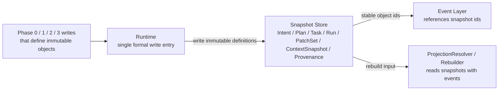

这张图只回答 `Snapshot`：哪些对象是不可变定义、由谁写入，以及它们如何成为 Event 和 rebuild 的稳定引用锚点。

#### Event Architecture

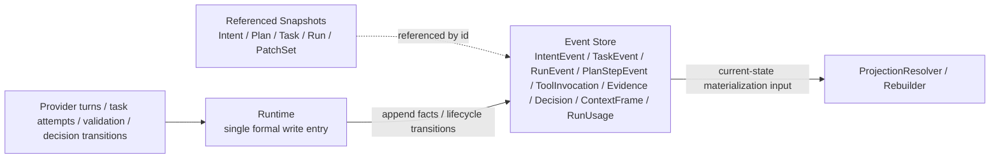

这张图只回答 `Event`：哪些事实和状态迁移进入 append-only event 流，它们如何引用 Snapshot，并成为投影和恢复的主要驱动输入。

#### Projection Architecture

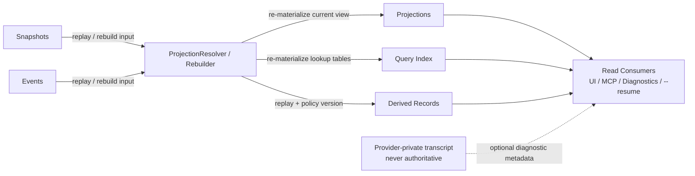

这张图只回答 `Projection`：当前运行视图、query index 和 derived records 如何从 `Snapshot + Event` rebuild，并被 UI / MCP / diagnostics / `--resume` 读取。

1. `Snapshot` 表达“定义了什么”，必须不可变，不能原地覆写。
2. `Event` 表达“后来发生了什么”，是状态转移、执行事实和审计链的主要记录形式。
3. `Projection`、query index 和 Phase 3 / Phase 4 derived records 都是读模型；它们可以被直接消费，但缺失时必须能由 `Snapshot + Event` rebuild。
4. `Runtime` 是唯一正式写入口：一边写 Snapshot / Event，一边推进 SQLite 中的当前视图和派生产物。
5. provider transcript 最多只能作为诊断元数据存在，不能替代 Snapshot / Event / Projection 中任何一层。

补充约束：

1. Phase 0 / Phase 1 的 provider readonly analysis 也属于 Event，应落到 `ToolInvocation[E]` / `ContextFrame[E]`，而不是藏在 provider-private transcript。
2. `Intent` / `Plan` / `Task` 只表达不可变定义；review、confirm、cancel、replan 等关键状态转移必须至少落一条 Event（projection 仅作当前视图缓存），而不是回写旧 snapshot。
3. `ValidationReport`、`RiskScoreBreakdown`、`DecisionProposal` 属于 Phase 3 / Phase 4 的 runtime-owned structured outputs：持久化到 runtime-owned derived-record tables，供 UI / MCP / diagnostics 直接消费，但不回退成 provider-private transcript，也不强行塞进通用 Snapshot / Event 二分表述。
4. 这些 structured outputs 不是独立真相源；其可重建来源仍是对应 thread 的 Snapshot + Event，再加记录下来的 validator / decision policy version。targeted rebuild 必须能够重新 materialize 它们，或至少返回 stale 标记并触发重算，不能因其缺失阻塞 Phase 3 / Phase 4 的读取与恢复。

## Workflow Contract

Codex 集成和通用 provider 集成都必须服从 `docs/agent/agent-workflow.md` 定义的 Phase 0-4 工作流，而不是各自维护一套 provider 层状态机。系统真相必须落在 Libra 定义的 Snapshot / Event / Projection 三层边界内。

这个章节紧跟整体流程图，作为整份改进计划的第一层约束。后文所有模块改造、步骤顺序、测试矩阵都必须满足这里定义的 phase 边界和对象边界。

### Phase Boundary Summary

| Phase | 必须完成什么 | 明确禁止什么 |
|---|---|---|
| Phase 0 | 把原始输入收敛成本地 `IntentSpec Draft`，通过 provider + readonly tools 生成可审查 `IntentSpec`，完成 developer review / revise / cancel，确认当前 `Intent`、thread bootstrap、风险基线、可选 `ContextSnapshot`、projection seed | 不允许生成 `Plan` / `Task` / `Run`，不允许调用任何会修改当前 `working directory` / `main worktree`、VCS 或外部状态的 tool，不允许跳过 IntentSpec review 直接进入计划阶段 |
| Phase 1 | 基于已确认 `IntentSpec` 发起 provider-facing planning 调用，允许 readonly tools，固定生成并审查两个 `Plan`：`execution`（执行计划）和 `test`（测试计划），以及它们对应的 `Task`；处理 `Execute / Modify Plan / Revise Intent / Cancel`，并把当前 dual-plan heads 写回 Scheduler projection | 不允许开始 task execution，不允许写 `Run` / `PatchSet` / `Provenance`，不允许调用任何 mutating tool，不允许跳过 plan review 直接执行 |
| Phase 2 | 由 Scheduler 按保守 barrier 策略执行两个已批准 plan heads：先编译并运行 `execution_dag`，仅当执行阶段 required task 全部收口后才启动 `test_dag`；记录 run/patch/evidence/context 等执行事实 | 不允许 provider 自行推进整条计划，不允许 UI 旁路 formal writes |
| Phase 3 | 运行系统级验证与审计，消费 execution/test plan artifacts，形成 release candidate 视图和结构化验证结果；测试计划不足时把流程送回 Phase 2 rework loop | 不允许把 system validation 混回 provider tool loop，不允许跳过审计直接发布 |
| Phase 4 | 基于风险和证据形成最终决策，并推进 thread / scheduler projection | 不允许通过重写旧 Snapshot 表达决策，不允许用 provider-specific 状态代替 `Decision` |

### Phase-to-Layer Mapping

| Phase | 目标 | Snapshot 写入 | Event 写入 | Libra runtime / projection |
|---|---|---|---|---|
| Phase 0 | IntentSpec 起草、意图分析与审查 | `Intent`（draft / revision / confirmed），必要时 `ContextSnapshot` | `ToolInvocation`、`ContextFrame`、可选 terminal `Decision` / `IntentEvent` | Thread 初始化 / 恢复、当前 Intent revision、IntentSpec 审查 UI、live context bootstrap |
| Phase 1 | 双计划构建与审查 | `Plan`、`Task` | `ToolInvocation`、`ContextFrame`、可选 terminal `Decision` / `IntentEvent` | `selected_plan_ids`、`current_plan_heads`、plan-set review UI、ready queue preview |
| Phase 2 | `execution_dag -> barrier -> test_dag` 两阶段执行与过程事实 | `Run`、`PatchSet`、`Provenance` | `TaskEvent`、`RunEvent`、`PlanStepEvent`、`ToolInvocation`、`Evidence`、`ContextFrame`、`RunUsage` | `active_run_id`、live_context_window、active DAG stage / staging 状态 |
| Phase 3 | 验证与审计 | 可选 `ContextSnapshot` | `Evidence`、可选 routing `Decision`、terminal `TaskEvent` / `RunEvent` / `IntentEvent` | 审计视图、release candidate 视图、`ValidationReport`、test-plan sufficiency 路由 |
| Phase 4 | 决策与释放 | none | final `Decision`、可选 terminal `IntentEvent` | Thread / Scheduler 投影推进、`RiskScoreBreakdown`、`DecisionProposal` |

### Phase 0 Detailed Analysis

Phase 0 的职责是把原始输入收敛成可审查的 `IntentSpec`，而不是直接生成计划。它先按本地规则组装 `IntentSpec Draft`，再通过 provider 做意图细化，并允许只读工具读取仓库/文档/历史信息，最终把结果转换成 Markdown review 交给开发者确认。

#### Phase 0 目标

1. 归一化原始输入，生成本地 `IntentSpec Draft` 和风险初判。
2. 决定当前是“新 thread”还是“恢复既有 thread”，并建立可追踪的 Intent revision 链。
3. 调用 provider 细化 `IntentSpec`，且只允许 readonly tools。
4. 把 provider 返回的 `IntentSpec` 转换成 Markdown review，并支持 `Confirm / Modify / Cancel` 循环。
5. 在 IntentSpec 确认后，判定是否需要冻结初始 `ContextSnapshot[S]`（见后文“ContextSnapshot 冻结操作定义”），并初始化或刷新 `ThreadProjection`、`SchedulerState`、`live_context_window` 和 query index seed。

#### Phase 0 路径规则

| 场景 | `Intent` 写入 | `thread_id` 规则 | `ContextSnapshot` |
|---|---|---|---|
| 新请求，未指定 `--resume` | 先写 root draft `Intent[S]`，provider 细化或用户修改时继续写 `Intent` revision | `thread_id = root_intent_id` | 在确认当前 IntentSpec 后按条件写 |
| `--resume <thread_id>` 且仅继续既有已确认 `Intent` | 可跳过新的 draft loop，直接复用当前 confirmed intent | 复用传入 `thread_id` | 通常不写 |
| `--resume <thread_id>` 且用户追加新要求/修订 | 先写新的 draft `Intent` revision，provider 细化或用户修改时继续写 revision | 复用原 `thread_id`，不新建 thread | 在确认当前 revision 后视需要写 |
| 用户在 review 中 `Cancel` | 不再写新的 `Intent` revision；追加 terminal `Decision`，必要时 `IntentEvent` | thread 保留历史但立即结束 | 不写 |

#### Phase 0 详细时序：`new <thread>`

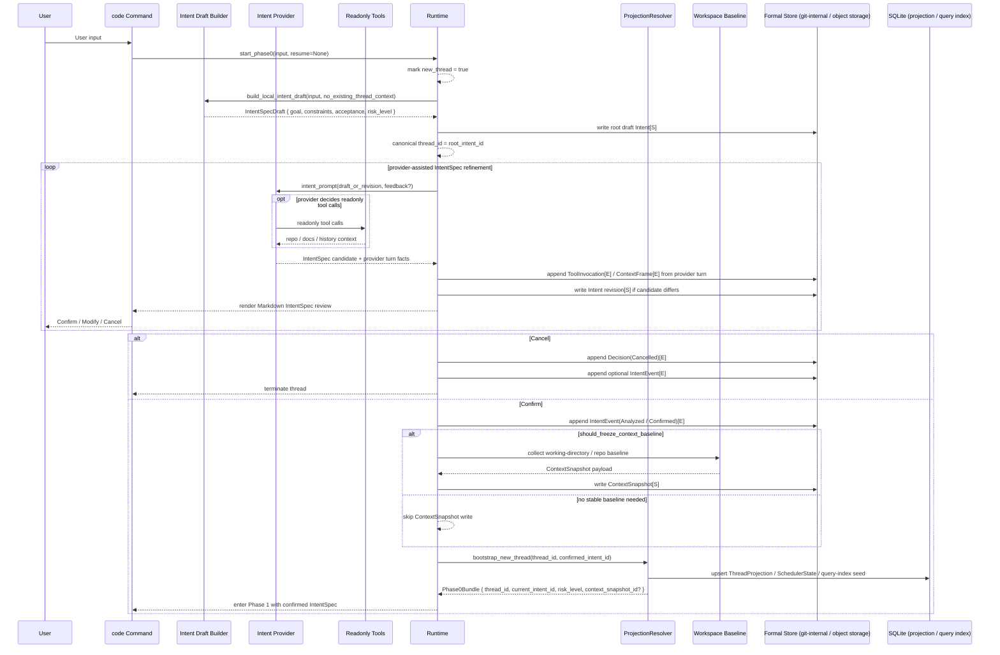

#### Phase 0 详细时序：`resume <thread>`

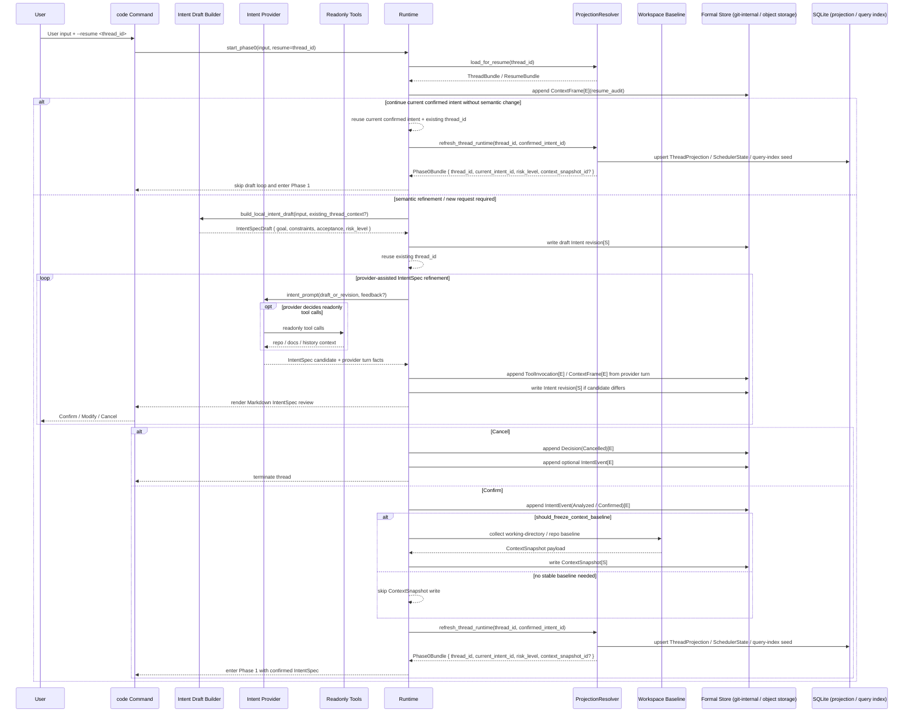

#### Phase 0 子步骤拆解

| 子步骤 | 输入 | 输出 | 说明 |
|---|---|---|---|
| 输入归一化 | CLI 参数、用户文本、可选 `--resume <thread_id>` | `Phase0Input` | 统一入口，不让 provider 直接读取原始 CLI 语义 |
| 本地 draft 组装 | `Phase0Input`、可选既有 thread 上下文 | `IntentSpecDraft` | 规则式提取 goal、constraints、acceptance、risk_level |
| root / revision bootstrap | `IntentSpecDraft`、resume 信息 | root draft intent 或 draft revision | 新 thread 先写 root draft 以锚定 canonical `thread_id` |
| provider 细化 | draft intent、反馈、可选 readonly context 查询 | candidate `IntentSpec` | provider 只允许做意图细化和只读分析；readonly tools 是否调用由 provider turn 自行决定 |
| Phase 0 tool/event 收口 | provider tool/use 流 | `ToolInvocation[E]`、`ContextFrame[E]` | 只记录只读分析事实，不写 `Run` |
| Markdown review loop | candidate `IntentSpec`、用户反馈 | `Confirm` / `Modify` / `Cancel` | `Modify` 留在 Phase 0；若 UI 需要“重来一版”，按不改变语义边界的 `Modify` 处理，不单列 `Regenerate` 状态 |
| `ContextSnapshot` 判定 | confirmed intent、当前 `working directory` / 仓库状态、risk | snapshot write or skip | 只有稳定基线值得保留时才写 |
| projection 初始化 | confirmed intent、thread / snapshot 结果 | `ThreadProjection`、`SchedulerState`、query-index seed | 形成进入 Phase 1 的 runtime bundle |

#### `Phase0Input` 数据结构

`Phase0Input` 是 Phase 0 的唯一入口 `contract` 。它只承载 “当前已经知道的事实”，用于把原始入口统一成稳定内部输入；它**不承载**已经推导出的 `IntentSpecDraft`，也不提前塞入 `goal` / `constraints` / `acceptance` / `risk_level` 这类后续阶段才生成的字段。

| 字段 | 类型 | 必填 | 来源 | 说明 |
|---|---|---|---|---|
| `entrypoint` | `CodeEntrypoint` | 是 | CLI / TUI / MCP adapter | 标识这次请求来自哪个入口，用来消除不同交互层的 transport 差异；provider 不应直接读取原始 CLI/UI 协议细节 |
| `raw_user_text` | `String` | 是 | 用户输入 | 原始任务文本；后续本地 draft 组装和审计都以它为起点 |
| `requested_resume_thread_id` | `Option<ThreadId>` | 否 | `--resume <thread_id>` 或等价 UI 参数 | 表达“用户想恢复哪个 canonical thread”；新 thread 为 `None` |
| `resume_bundle` | `Option<ResumeBundle>` | 否 | `ProjectionResolver.load_for_resume()` | 已解析出的 thread / projection / current intent / freshness 上下文；只有在 resume 成功解析后才存在 |
| `working_directory` | `PathBuf` | 是 | invocation context | 本次会话的工作目录；`ContextSnapshot` 判定和仓库基线收集都从这里出发 |
| `repo_root` | `Option<PathBuf>` | 否 | repo discovery | 若当前目录位于仓库中，这里记录 canonical repo root；非 repo 场景允许为空 |
| `principal` | `PrincipalContext` | 是 | controller / session | 当前操作者身份；用于 audit、决策归属和后续 approval / ownership 语义 |
| `approval_policy` | `ApprovalPolicySnapshot` | 是 | policy layer | 当前工具边界和审批策略快照；Phase 0 / Phase 1 只能 readonly，后续 Phase 2 也必须继续受它约束 |
| `environment_metadata` | `EnvironmentMetadataSnapshot` | 是 | runtime/env probe | 记录 sandbox、network、OS、git/worktree 能力等运行环境元数据，供 prompt builder、diagnostics 和 snapshot 判定使用 |
| `received_at` | `DateTime<Utc>` | 是 | runtime clock | 记录归一化输入形成的时间点，供审计、恢复排序和事件关联使用 |

补充约束：

1. `Phase0Input` 只允许包含 Phase 0 进入点已经确定的事实；`IntentSpecDraft`、confirmed `Intent`、`risk_level`、`Phase0Bundle` 都不属于它。
2. `requested_resume_thread_id` 和 `resume_bundle` 必须分开表达：前者是用户请求，后者是系统解析结果；如果 resume 解析失败，应该在生成 `Phase0Input` 时就报错，而不是带着半残输入继续进入 draft 组装。
3. `working_directory` 是调用时的当前位置，`repo_root` 是归一化后的仓库锚点；两者不能混用。
4. `approval_policy` 和 `environment_metadata` 必须是归一化后的快照，而不是让 provider 自行再去猜测当前环境能力或审批边界。
5. 如果后续 `write_context_snapshot_if_needed()`、prompt builder、projection bootstrap 需要额外输入，应先把字段收敛进 `Phase0Input`，而不是重新回读原始 CLI 参数。

#### Input Normalization And Initial Risk Heuristics

这里的“输入归一化”与“风险初判”都属于 **Phase 0 本地规则层**；它们发生在 provider 生成 / 修订 `IntentSpec` 之前，用于先把原始请求收敛成稳定输入，再给出一个可审查的风险基线。

##### Input normalization 的含义

“输入归一化”不是在做 planning，也不是让 provider 直接理解裸入口协议；它的目标是把不同入口、不同 transport 形式下的原始请求统一收敛为 `Phase0Input`，供后续本地 draft 组装和 provider intent refinement 共用。

| 动作 | 输入 | 输出 | 目的 |
|---|---|---|---|
| transport 解析 | CLI / TUI / MCP 原始参数与消息 | 统一字段草案 | 消除不同入口的协议差异，不让 provider 直接读取裸 CLI / UI 语义 |
| resume 解析 | `requested_resume_thread_id` | `resume_bundle` 或显式错误 | 把“用户请求恢复哪个 thread”和“系统实际恢复出了什么上下文”分开表达 |
| 环境归一化 | 当前 cwd、repo 探测结果、principal、policy、环境能力探测 | `working_directory`、`repo_root`、`principal`、`approval_policy`、`environment_metadata` | 固定本次 Phase 0 进入点的环境事实，避免后续重新回读原始入口 |
| 时间与审计锚定 | runtime clock | `received_at` | 为审计、恢复排序和后续事件关联提供稳定时间锚点 |

归一化后的 `Phase0Input` 仍然只是“已经知道的事实”，它**不包含**：

1. `IntentSpecDraft`
2. confirmed `Intent`
3. `risk_level`
4. `Phase0Bundle`
5. 任何 `Plan` / `Task` / `Run` 级产物

也就是说，归一化回答的是“这次请求到底是什么输入、从哪里来、在什么环境里发生”，而不是“系统已经理解出了什么目标”。

##### 风险初判的含义

Phase 0 的 `risk_level` 是 **base risk**，是后续 Phase 4 风险聚合的输入基线，而不是最终风险分。Phase 4 才会把它与 `diff_scope`、执行 `Evidence`、policy penalty 一起聚合成最终风险结果。

因此，Phase 0 风险初判只能依据：

1. `Phase0Input` 中已经确定的事实
2. 本地 draft 组装时提取出的 `goal / constraints / acceptance`
3. 可选 `resume_bundle` 中已有的当前 thread / intent 上下文

Phase 0 风险初判**不能**依据：

1. 尚未产生的代码 diff
2. 尚未执行的测试或 validator 结果
3. Phase 2 / Phase 3 才会写入的 `Evidence`
4. provider 私有 transcript 中未进入 formal 流的隐式状态

##### 风险初判的规则维度

`risk_level` 必须由本地规则式逻辑给出，至少覆盖下列维度：

| 维度 | 低风险信号 | 提升风险的信号 |
|---|---|---|
| 请求类型 | 只读分析、解释、文档整理 | 代码修改、配置变更、VCS 变更、外部副作用 |
| 目标域 | 普通局部代码、非敏感文档 | `auth`、`security`、`config`、`migration`、`release`、secret、权限边界 |
| 作用范围 | 单文件、小范围局部修改 | 跨模块、跨仓库边界、大范围重构、可能影响运行时行为 |
| 环境能力 | 只读、受限环境 | 允许写工作区、允许 mutating tool、允许网络写或外部系统交互 |
| 需求清晰度 | goal / constraints / acceptance 明确 | 目标模糊、约束缺失、验收条件不清、存在多义解释 |
| resume 语义 | 仅继续既有 confirmed intent | 在既有 thread 上追加新要求、改变成功标准、修订目标边界 |

##### 风险初判的最低行为要求

1. 新 thread 必须在生成本地 `IntentSpecDraft` 时同步给出 `risk_level`。
2. `--resume <thread_id>` 且仅继续既有 confirmed intent 时，可以直接复用当前风险基线，不要求重新抬高风险。
3. `--resume <thread_id>` 且存在语义修订时，必须根据新的 draft 重新计算 `risk_level`，不能盲目沿用旧值。
4. 风险初判必须偏保守；当请求命中敏感域、外部副作用或高不确定性时，应上调而不是下调。
5. `risk_level` 的作用是控制后续 review / decision 路径，而不是替代 Phase 4 的最终风险聚合。

#### Phase 0 产物与约束

1. Phase 0 可以调用 provider，但只能用于 `IntentSpec` 细化；任何会产生代码变更、文件写入、VCS 变更或外部副作用的 tool 都禁止。
2. 新 thread 的 root draft `Intent[S]` 锚定 canonical `thread_id`；后续 provider 细化和用户反馈都通过 `Intent` revision 表达，不覆写旧对象。
3. `risk_level` 是 Phase 0 的输出之一，后续 Phase 4 只在此基础上叠加 evidence / diff 风险，不重新定义基线。
4. Phase 0 的 provider 只读分析会产出 `ToolInvocation[E]` 和 `ContextFrame[E]`，但不会产出 `Run[S]` / `PatchSet[S]` / `Provenance[S]`。
5. `ContextSnapshot[S]` 来源是 Runtime 对工作区/仓库状态的冻结，不是 provider tool loop 的原始输出。
6. Phase 0 结束时必须已经有当前已确认 `Intent`、可恢复的 `thread_id` 语义，以及最小可用的 `ThreadProjection` / `SchedulerState`。

### Phase 0 / Phase 1 Boundary

Phase 0 和 Phase 1 的边界不再以“是否已经调用过 provider”为准，而是以“当前 `IntentSpec` 是否已确认，以及 provider 调用的目标是不是生成 `Plan`”为准。

#### 边界判定

1. **Phase 0 的结束条件**：系统已经得到 `Phase0Bundle`，其中至少包含可用的 `thread_id`、当前已确认 `Intent` 引用、`risk_level`、可选 `ContextSnapshot` 引用，以及已初始化的 `ThreadProjection` / `SchedulerState`。
2. **Phase 1 的开始条件**：系统把“已确认 `IntentSpec`”发给 Codex 或通用 completion provider，请它生成 `Plan` / `Task` 候选、步骤候选或等价 planning 结果。
3. **因此**：发送 draft + feedback 给 provider 生成 / 修改 `IntentSpec` 属于 Phase 0；发送 confirmed intent 给 provider 生成 / 修改 `Plan` 属于 Phase 1。

#### Phase 划分规则

| 动作 | 归属 |
|---|---|
| 解析 CLI 输入、读取 `--resume <thread_id>`、加载 resume bundle | Phase 0 |
| 按规则组装本地 `IntentSpec Draft`、提取 goal / constraints / acceptance / risk_level | Phase 0 |
| 向 provider 发送 draft / feedback，请它生成或修订 `IntentSpec` | Phase 0 |
| Phase 0 只读工具分析，并记录 `ToolInvocation` / `ContextFrame` | Phase 0 |
| 展示 `IntentSpec` Markdown review，并等待 `Confirm / Modify / Cancel` | Phase 0 |
| 判定并写入初始 `ContextSnapshot` | Phase 0 |
| 初始化 / 恢复 `ThreadProjection`、`SchedulerState`、query-index seed | Phase 0 |
| 向 provider 发送 confirmed `IntentSpec` 生成 `Plan` / `Task` | Phase 1 |
| Phase 1 只读工具分析，并记录 `ToolInvocation` / `ContextFrame` | Phase 1 |
| 根据 provider 返回结果生成 `Plan` / `Task` | Phase 1 |
| 展示 `Plan` review UI 并等待 `Execute / Modify Plan / Revise Intent / Cancel` | Phase 1 |

#### 额外约束

1. Phase 0 和 Phase 1 都允许 provider 调用，但两者都只允许 readonly tools；任何 mutating tool 必须等到 Phase 2 的 `TaskExecutor`。
2. Phase 0 只负责形成“当前可执行目标的定义”；只要调用目标已经变成“给出执行计划 / 步骤 / task 拆解”，它就属于 Phase 1。
3. Phase 1 中如果开发者判断 `IntentSpec` 本身需要调整，必须回到 Phase 0 写新的 `Intent` revision，再重新进入 Phase 1。
4. 文档、代码和测试都应以“Phase 0 先确认 IntentSpec，Phase 1 再确认 Plan”作为统一边界，不允许把两层 review 混成一个循环。

#### Readonly Tool Boundary

Phase 0 / Phase 1 的 readonly tools 至少分为 4 类：

1. repo read：读取文件、目录枚举、全文搜索、只读 VCS 查询（如 status/log/show/diff 摘要）。
2. docs / knowledge read：读取仓库文档、外部只读资料、MCP resource 查询。
3. thread / projection read：读取当前 thread history、projection、diagnostics summary、query index。
4. policy / metadata read：读取 tool capability、principal、approval policy、环境元数据。

Phase 0 / Phase 1 明确禁止：

1. 任何会修改 `working directory` / `main worktree` 的文件操作。
2. 任何 mutating VCS 命令。
3. 任何外部副作用操作（网络写、MCP tool mutating call、部署、通知、发帖等）。
4. 任何需要 approval 才能继续的执行型工具调用。

与 Phase 2 的衔接规则：

1. 一旦进入 Phase 2，provider 不再拥有“自由工具调用”语义，而是只能在 `TaskExecutor` + `ExecutionEnvironmentProvider` + `ToolBoundaryPolicy` 边界内执行单 task attempt。
2. 同一个工具若在 Phase 0 / Phase 1 被归类为 readonly query，在 Phase 2 也必须继续经由 `ToolBoundaryPolicy` 明确标注为 readonly，而不是绕过 policy 直接执行。

### Phase 1 Detailed Analysis

Phase 1 的职责是把 Phase 0 已确认的 `IntentSpec` 转成可审查的 dual-plan set，并在任何执行发生之前完成计划层的强制 review gate。这个 contract 固定只包含两个 `Plan`：一份 `execution` plan 和一份 `test` plan。前者定义代码与变更执行路径，后者定义测试与验证路径。它与 Phase 0 的区别不是“有没有 LLM”，而是“LLM 当前是在细化目标，还是在生成计划”。

#### Phase 1 目标

1. 基于已确认 `IntentSpec` 组装 planning prompt，并发起 provider-facing plan generation 调用。
2. 允许 provider 使用 readonly tools 收集计划所需的仓库 / 文档 / 历史信息。
3. 把 planning 结果规范化为不可变 `Plan[S]` / `Task[S]` revision，并固定产出 `execution` 与 `test` 两类 plan。
4. 展示 plan set Markdown review，并等待 `Execute / Modify Plan / Revise Intent / Cancel`。
5. 只在 plan review 完成后决定进入 Phase 2、留在 Phase 1 revision loop、回到 Phase 0，或直接终止。

#### Phase 1 路径规则

下表拆成两个维度表达：前四行共享同一前提，即 planning 已成功生成可审查的 plan set；它们的差异只来自 review 阶段的用户决策。

补充说明：

1. `Modify Plan` 的“只改一类”不等于 single-plan 写入：`Runtime` 仍只接收完整 dual-plan pair；未修改的一类必须沿用当前 head 透传。
2. `Execute` 默认只允许执行当前 `current_plan_heads`；历史 head 若要重用，必须先显式生成新的 current head 并重新过 review gate。
3. 下文 Phase 1 / 2 / 3 / 4 中的“新建路径”，指当前会话在同一控制流内连续从上一 phase 进入；只有 `resume <thread>` 图才表示通过 `load_for_resume(thread_id)` 进入该 phase 的恢复路径。

| planning 结果 | review 决策 | `Plan` / `Task` 写入 | projection 更新 | 下一步 |
|---|---|---|---|---|
| 成功，已生成可审查的 execution/test dual plan | `Execute` | 选定当前 `current_plan_heads` 对应的 execution/test `Plan[S]` / `Task[S]` | `selected_plan_ids = current_plan_heads`，且逻辑顺序固定为 `[execution_plan_id, test_plan_id]` | 进入 Phase 2 |
| 成功，已生成可审查的 execution/test dual plan | `Modify Plan` | 写新的 execution/test `Plan[S]` / `Task[S]` revision（可只改一类；若只改一类，另一类必须透传当前 head 组成完整 dual-plan pair） | 刷新 `current_plan_heads`（不提前写 `selected_plan_ids`） | 留在 Phase 1 |
| 成功，已生成可审查的 execution/test dual plan | `Revise Intent` | 不继续推进当前 plan head；回写新的 `Intent` revision 请求 | 清理当前 plan 选择或保留为历史 head | 回到 Phase 0 |
| 成功，已生成可审查的 execution/test dual plan | `Cancel` | 不进入执行；写 terminal `Decision[E]`，必要时写 `IntentEvent[E]` | Scheduler 清空 active 选择 | 终止 |
| 失败，或候选计划质量不足以进入 review | 不适用 | 不推进不完整的 execution/test `Plan` / `Task` 为选中 head；保留只读 analysis events | 保持上一可用 projection | 留在 Phase 1 重试或报错 |

#### Phase 1 详细时序：新建路径（当前会话连续进入）

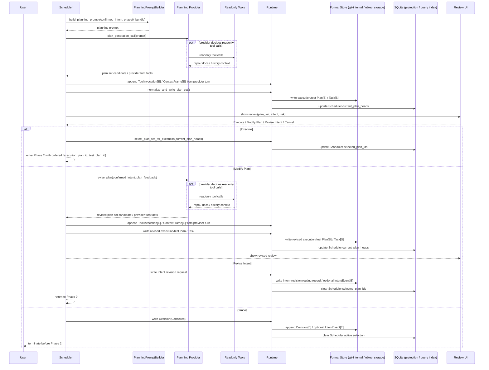

#### Phase 1 详细时序：`resume <thread>`

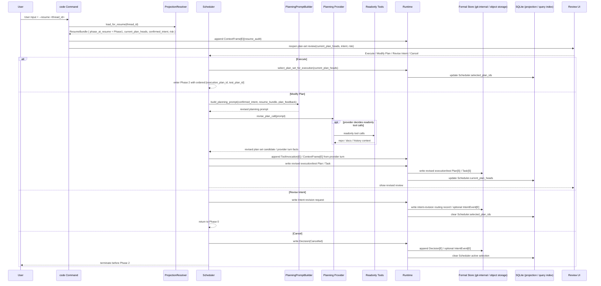

#### Phase 1 子步骤拆解

| 子步骤 | 输入 | 输出 | 说明 |
|---|---|---|---|
| planning prompt 组装 | confirmed `Intent`、`Phase0Bundle`、上下文策略 | provider-facing planning prompt | 这是 Phase 1 的起点，不属于 Phase 0 |
| planning 调用 | planning prompt | plan set candidate / plan text | Codex 与通用 provider 都在这里进入 plan generation |
| Phase 1 tool/event 收口 | provider tool/use 流 | `ToolInvocation[E]`、`ContextFrame[E]` | 只记录只读分析事实，不写 `Run` |
| plan set 规范化 | provider 结果 | canonical `PlanSpec(role=execution|test)` / `TaskSpec[]` | 收敛不同 provider 的 planning 结果结构 |
| `Plan[S]` / `Task[S]` 写入 | canonical plan/task spec | `Plan` / `Task` snapshot | 只写不可变结构，不写 runtime 状态 |
| review gate | confirmed `IntentSpec`、plan set summary、risk | `Execute` / `Modify Plan` / `Revise Intent` / `Cancel` | 所有 provider 复用同一 review loop |
| branch 解析 | review 结果 | Phase 2 entry / 新 plan set revision / 回 Phase 0 / terminal cancel | Phase 1 的出口控制点 |

#### Phase 1 产物与约束

1. 把 confirmed `IntentSpec` 发给 provider 生成 / 修改 plan set，明确属于 Phase 1，不属于 Phase 0。
2. Phase 1 允许 readonly tool analysis，并产出 `ToolInvocation[E]` / `ContextFrame[E]`；但仍不允许写 `Run[S]`、`PatchSet[S]`、`Provenance[S]`。
3. Phase 1 必须且只能产出一份 `Plan(role=execution)` 和一份 `Plan(role=test)`；后者负责定义测试 / 验证任务，不允许省略，也不允许再追加第三类 plan role。
4. `Plan[S]` / `Task[S]` 是不可变结构定义；mutable 状态只能进入 projection 或 event。
5. `Modify Plan` 不允许原地改写既有 `Plan` / `Task`，必须走 revision chain。
6. `Modify Plan` 只改一类时，写入仍必须提交完整 dual-plan pair；未修改的一类沿用当前 head 透传，不因此放开 single-plan 写入接口。
7. `Execute` 时必须同时选定 execution/test 两类 plan head，形成 `selected_plan_ids`，且顺序固定为 `[execution_plan_id, test_plan_id]`。
8. `Execute` 默认只允许当前 `current_plan_heads`；历史 head 不得绕过 review 直接执行。如需回退到旧 revision，必须先显式提升为新的 current head 并重新进入 review。
9. `Revise Intent` 必须回到 Phase 0；不允许在 Phase 1 内部偷偷修改当前 `Intent` 后继续计划。
10. `Execute` 必须发生在 plan review gate 之后，不允许跳过 review。
11. 通用 provider 与 Codex provider 必须共享同一 Phase 1 review loop 实现。
12. `selected_plan_ids` 只能在 `Execute` 分支写入；`Modify Plan` 只能推进 `current_plan_heads`，不得提前标记为已选执行计划。

### Phase 2 Detailed Analysis

Phase 2 的职责是由 Libra Scheduler 按保守的两阶段 barrier 策略执行当前 plan set（固定为 `execution` plan 和 `test` plan）：先运行 `execution_dag`，只有当 execution 阶段的 required task 全部收口后，才启动 `test_dag`。这里的推荐实现明确收敛到 `dagrs 0.8.1`：Libra 负责从 `Plan` / `Task` snapshot 构建当前 stage 的 DAG、订阅 DAG 事件、把 DAG 结果翻译成 formal writes，并把 provider 限定为单个 task node 的执行器。它的核心是“执行控制权归 Libra + DAG runtime”，不是“让 provider 自己跑完整条计划”。

#### Phase 2 目标

1. 从当前 `selected_plan_ids` 先派生 `execution_dag`，并在 execution 阶段通过 barrier 后再派生 `test_dag`。
2. 组装每个 DAG node 的 task execution context，包括 prerequisite patchsets、context frames 和执行边界。
3. 由 Libra 为每个 DAG node 提供受控的 `Sandbox` / `Worktree` 执行环境，而不是由 provider 自己创建隔离环境。
4. 通过 `TaskExecutor` 执行单个 DAG node 对应的 task attempt。
5. 订阅 `dagrs` runtime 事件，把 node progress / checkpoint / termination 翻译成 Libra projection 与 formal events。
6. 读取 `Sandbox` / `Worktree` 的执行数据、文件变更和同步结果，并按对象模型写入 formal object 层。
7. 把调度策略收紧为 `execution_dag -> barrier -> test_dag`，先保证主路径稳定，再考虑后续并行优化。
8. 当 Phase 3 指出 test-plan 缺口或可自动修复的验证不足时，能够在 Phase 2 内分析并追加新的 execution/test plan revision，然后重新执行 `execution_dag -> test_dag`。
9. 决定下一步是继续 Phase 2、回到 Phase 1 replan，还是进入 Phase 3。

#### Phase 2 路径规则

| 场景 | formal writes | projection 更新 | 下一步 |
|---|---|---|---|
| active DAG node 成功 | `Run[S]`、可选 `PatchSet[S]`、`Provenance[S]`、执行 events | 标记 node 对应 task 完成，推进当前 active DAG progress | 留在当前 stage，或在 execution 阶段完成后切到 test stage，或在 test 阶段完成后进 Phase 3 |
| retryable failure | `Run[S]`、失败 events / evidence | 递增 retry 计数，按 policy 重建 node attempt | 留在 Phase 2 |
| validation feedback rework required | 当前执行证据、Phase 3 validator 反馈、追加 `Plan[S]` / `Task[S]` revision | 刷新 `selected_plan_ids`，重建 `execution_dag -> test_dag` 两阶段执行链 | 留在 Phase 2 |
| broader replan required | 当前 attempt 的 events / evidence | `active_run_id = None`，终止当前 active DAG runtime，准备新 plan set head | 回到 Phase 1 |
| cancel / timeout / disconnect / permanent failure | terminal run/task events | 清理 active run/task，终止 DAG runtime | 进入终态或按策略进入 Phase 4 |

#### Phase 2 详细时序：新建路径（首次进入执行）

```mermaid
sequenceDiagram
    participant S as Scheduler
    participant D as DagrsRuntime(0.8.1)
    participant C as Context Loader
    participant X as Sandbox/Worktree Manager
    participant E as TaskExecutor
    participant R as Runtime
    participant F as Formal Store (git-internal / object storage)
    participant Q as SQLite (projection / query index)

    S->>D: build_stage_dag(stage=execution, execution_plan)
    D-->>S: Graph ready
    S->>D: async_start()

    loop until execution_dag terminates
        D-->>S: GraphEvent(node_ready / node_started / checkpoint / node_finished)
        S->>R: translate dagrs event into projection + control-state updates
        R->>Q: update SchedulerState / live_context_window / ready_queue metadata

        alt next ready DAG node exists
            D->>C: load prerequisite patchsets / context frames
            C-->>D: TaskExecutionContext
            D->>X: provision sandbox + task worktree
            X-->>D: execution environment + runtime metadata
            D->>R: start_task_attempt(task_id)
            R->>F: write Run[S] / Provenance[S]
            R->>Q: update active_task_id / active_run_id
            D->>E: execute_task(context)
            E-->>D: TaskExecutionResult
            D->>X: collect sandbox output + sync worktree back
            X-->>D: exec facts + file changes + sync result
            D->>R: record_task_attempt(result)
            R->>F: write PatchSet[S]
            R->>F: append TaskEvent / RunEvent / PlanStepEvent
            R->>F: append ToolInvocation / Evidence / ContextFrame / RunUsage
            R->>Q: update SchedulerState / live_context_window / ready_queue metadata
        end
    end

    D-->>S: StageExecutionReport(stage=execution)

    alt execution stage success
        S->>R: record stage barrier reached(active_stage = test)
        R->>Q: update SchedulerState / ready_queue metadata
        S->>D: build_stage_dag(stage=test, test_plan)
        D-->>S: Graph ready
        S->>D: async_start()

        loop until test_dag terminates
            D-->>S: GraphEvent(node_ready / node_started / checkpoint / node_finished)
            S->>R: translate dagrs event into projection + control-state updates
            R->>Q: update SchedulerState / live_context_window / ready_queue metadata

            alt next ready DAG node exists
                D->>C: load prerequisite patchsets / context frames
                C-->>D: TaskExecutionContext
                D->>X: provision sandbox + task worktree
                X-->>D: execution environment + runtime metadata
                D->>R: start_task_attempt(task_id)
                R->>F: write Run[S] / Provenance[S]
                R->>Q: update active_task_id / active_run_id
                D->>E: execute_task(context)
                E-->>D: TaskExecutionResult
                D->>X: collect sandbox output + sync worktree back
                X-->>D: exec facts + file changes + sync result
                D->>R: record_task_attempt(result)
                R->>F: write PatchSet[S]
                R->>F: append TaskEvent / RunEvent / PlanStepEvent
                R->>F: append ToolInvocation / Evidence / ContextFrame / RunUsage
                R->>Q: update SchedulerState / live_context_window / ready_queue metadata
            end
        end

        D-->>S: StageExecutionReport(stage=test)

        alt test stage success
            S-->>S: mark test_dag complete and enter Phase 3
        else retryable
            S->>R: record retry routing and schedule next attempt
            R->>F: append routing Evidence[E] / RunEvent[E]
            R->>Q: update retry metadata
            S-->>S: rebuild retry path inside current DAG policy
        else validation feedback rework required
            S->>R: append plan/task revision and restart execution_dag -> test_dag
            R->>F: write revised Plan[S] / Task[S]
            R->>Q: update selected_plan_ids / current_plan_heads
            S-->>S: stay in Phase 2 rework loop
        else broader replan required
            S->>R: append routing evidence and clear active run
            R->>F: append Evidence[E] / ContextFrame[E]
            R->>Q: update SchedulerState(active_run_id = None)
            S-->>S: terminate DAG runtime and return to Phase 1
        else terminal failure / cancel
            S->>R: write terminal run/task events and clear active state
            R->>F: append terminal TaskEvent[E] / RunEvent[E] / Evidence[E]
            R->>Q: clear active run / active task
            S-->>S: stop DAG per policy
        end
    else retryable
        S->>R: record retry routing and schedule next attempt
        R->>F: append routing Evidence[E] / RunEvent[E]
        R->>Q: update retry metadata
        S-->>S: rebuild retry path inside current DAG policy
    else validation feedback rework required
        S->>R: append plan/task revision and restart execution_dag -> test_dag
        R->>F: write revised Plan[S] / Task[S]
        R->>Q: update selected_plan_ids / current_plan_heads
        S-->>S: stay in Phase 2 rework loop
    else broader replan required
        S->>R: append routing evidence and clear active run
        R->>F: append Evidence[E] / ContextFrame[E]
        R->>Q: update SchedulerState(active_run_id = None)
        S-->>S: terminate DAG runtime and return to Phase 1
    else terminal failure / cancel
        S->>R: write terminal run/task events and clear active state
        R->>F: append terminal TaskEvent[E] / RunEvent[E] / Evidence[E]
        R->>Q: clear active run / active task
        S-->>S: stop DAG per policy
    end
```

#### Phase 2 详细时序：`resume <thread>`

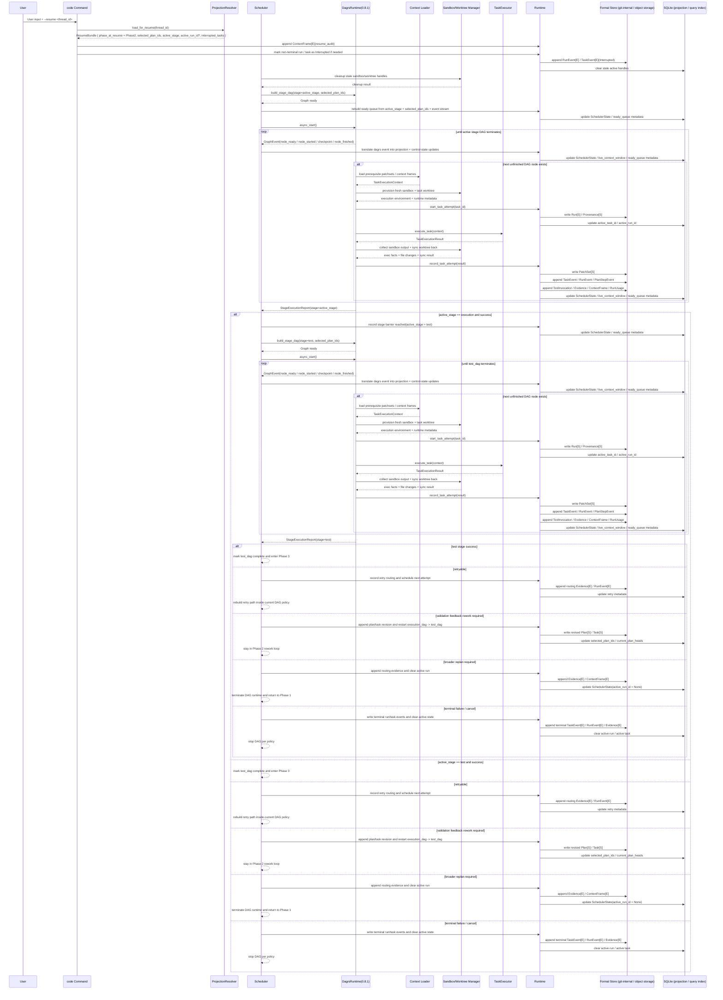

#### Phase 2 子步骤拆解

| 子步骤 | 输入 | 输出 | 说明 |
|---|---|---|---|
| DAG 物化 | `selected_plan_ids`、当前 `active_stage`、`Plan.steps`、`Task.dependencies` | `StageDag(stage=execution|test)` | Scheduler 每次只物化当前 stage 的一个 DAG；execution 完成后再切到 test |
| prerequisite context 加载 | `PatchSet`、`ContextFrame`、`ContextSnapshot` | `TaskExecutionContext` | 每个 ready DAG node 的执行输入 |
| execution environment provisioning | task、policy、main working directory baseline | `Sandbox` + task `Worktree` + runtime metadata | `Sandbox` / `Worktree` 必须由 Libra 提供和管理 |
| node attempt 启动 | task、context、provider metadata | `Run[S]`、`Provenance[S]` | 每次 node attempt 都有独立 immutable envelope |
| provider 执行 | `TaskExecutionContext` | `TaskExecutionResult` | provider 只负责单次 task node attempt |
| sandbox/worktree 数据采集 | sandbox stdout/stderr、tool exec output、worktree diff、sync result | structured exec facts | Libra 读取执行环境数据，而不是依赖 provider 私有 transcript |
| result materialization | `TaskExecutionResult` | `PatchSet`、events、usage、evidence | 全部通过 `Runtime` 写入 |
| DAG runtime 事件收口 | `GraphEvent`、`ExecutionReport` | projection progress / checkpoint / termination | 用 `dagrs 0.8.1` 事件和报告驱动 Scheduler 状态 |
| control-state 更新 | node 结果、retry policy、replan policy | next ready node / stage barrier / retry / replan / plan-set rework | Phase 2 的 mutable 控制状态归 Scheduler |

#### Phase 2 产物与约束

1. Phase 2 的 canonical runtime 明确采用 `dagrs 0.8.1`，但执行策略收敛为两阶段 barrier：先从 execution `Plan` / `Task` snapshot 构建并运行 `execution_dag`，成功后再构建并运行 `test_dag`。
2. `TaskExecutor` 只执行单个 DAG node 对应的 task attempt，不得自行推进整个计划。
3. `Sandbox` 和 task `Worktree` 必须由 Libra 提供与管理；provider 只能消费 Libra 下发的执行环境句柄和边界，不能自行创建旁路隔离环境。
4. Libra 必须能够读取 `Sandbox` 的执行数据和 `Worktree` 的文件变更 / sync 结果，并把这些事实写成 `ToolInvocation[E]`、`ContextFrame[E]`、`RunEvent[E]`、`Evidence[E]` 与 `PatchSet[S]`。
5. 所有 formal writes 都必须通过 `Runtime`，UI 不得旁路写 `create_*` / `append_*`。
6. `live_context_window` 只能由 `ContextFrame[E]` 和 projection 驱动，不得由 provider-specific history 直接决定。
7. Codex 和通用 provider 都必须走同一个 Scheduler + dagrs 主循环，不允许一条路径绕过 Phase 2 contract。
8. 调度策略固定为 `execution_dag -> barrier -> test_dag`；不允许跨 DAG 同时激活两个 stage，也不允许把两个 stage 交错执行。
9. `test_dag` 的唯一启动条件是 execution stage required task 全部收口；不再允许 planner 或 `DagRuntimeBuilder` 定义跨 plan 依赖边。
10. 同一时刻只允许一个 active stage DAG；若 DAG 内部存在独立 node，可在该 stage 内并行，但 projection 更新必须维持单写者序列化提交。
11. 若 required execution node 发生 permanent failure，则 test stage 不得启动；若 required test node 发生 permanent failure，Scheduler 可以 early-stop 并进入 retry / Phase 2 rework / Phase 1 replan；两种情况都不得直接进入 Phase 3。
12. 针对 `dagrs 0.8.1`，实现必须显式吸收三个 API 变化：`Graph::add_node` / `Graph::add_edge` 返回 `Result`，`Graph::async_start()` 返回 `ExecutionReport`，终止事件以 `GraphEvent::ExecutionTerminated` 为准。
13. 当 Phase 3 指出 test-plan 缺口时，Phase 2 必须能够在当前 confirmed intent 下追加新的 execution/test `Plan` / `Task` revision，并重新执行完整的 `execution_dag -> test_dag` 链路，而不是直接跳过到决策阶段。
14. 只有当 execution stage 已成功跨过 barrier，且 test stage 的 required task 全部收口后，Phase 2 才能进入 Phase 3。

#### Phase 2 / Phase 3 Boundary

这两个阶段的边界必须按“是否仍在生成候选执行结果”来判定，而不是按“是否已经跑了测试”这种表面动作来判定。

1. **属于 Phase 2 的内容**：
   - provider 在当前 active stage DAG node 中执行任务
   - `Sandbox` / `Worktree` 中产生代码修改、命令输出、工具调用、局部验证结果
   - execution plan 和 test plan 中的测试任务、lint、局部回归检查
   - per-task `PatchSet`、per-task `Evidence`、`RunEvent`、`ToolInvocation`、`ContextFrame`
   - 任何仍然服务于“让某个 task 完成并产出候选结果”的行为
2. **属于 Phase 3 的内容**：
   - 以全部 execution/test task artifacts 为输入构造 release candidate
   - 面向整个候选结果的 integration / security / release 级验证，以及 test-plan sufficiency 判断
   - `ValidationReport`、system-level `Evidence`、final `ContextSnapshot`
   - 任何回答“这份候选结果是否可进入最终决策”的行为
3. **判定规则**：
   - 如果动作的直接目标是“完成某个 task / node，并产出或修正候选 diff”，它属于 Phase 2。
   - 如果动作的直接目标是“评估所有 task 产物汇总后的 release candidate 是否通过系统级验证”，它属于 Phase 3。
4. **特别约束**：
   - task 内部的局部测试、lint、命令检查，如果是该 task 自身执行的一部分，仍属于 Phase 2。
   - 只有在 `execution_dag -> test_dag` 两阶段链路全部完成、release candidate 已可构造后，system-level validator 才能启动，这才进入 Phase 3。
   - 如果 Phase 3 认定“测试计划本身不足”，必须返回 Phase 2 追加或修改 test plan，而不是把这类补救工作塞进 Phase 3。

### Phase 3 Detailed Analysis

Phase 3 的职责是把 Phase 2 产出的候选结果提升为“系统级可发布候选”，执行独立于 provider tool loop 的固定验证与审计流水线，并给出结构化验证结论。它的核心不是再跑一轮代码生成，也不是再物化一层 DAG，而是验证、归档和路由。

#### Phase 3 目标

1. 从 Phase 2 的 execution/test per-task artifacts 构造 release candidate 视图。
2. 运行固定顺序的 `integration -> security -> release` 验证流水线。
3. 产出结构化 `Evidence`、`ValidationReport` 和可选 final `ContextSnapshot`。
4. 决定下一步是进入 Phase 4、回到 Phase 2 test-plan rework、回到 Phase 1 replan，还是挂起等待人工处理。
5. 保证任何 validator failure 都不会被静默降级为“通过”。

#### Phase 3 路径规则

| 场景 | formal writes | projection 更新 | 下一步 |
|---|---|---|---|
| 全部验证通过 | `Evidence[E]`、`ValidationReport`、可选 final `ContextSnapshot[S]` | release candidate 视图 ready | 进入 Phase 4 |
| test-plan gap / auto-fixable validation deficiency | fail `Evidence[E]`、Phase 2 rework routing 信息、必要时新的 plan revision 请求 | 清理 active run，刷新 `selected_plan_ids`，准备重新执行 `execution_dag -> test_dag` | 回到 Phase 2 |
| broader replan required | fail `Evidence[E]`、replan routing 信息 | `active_run_id = None`，准备新 plan set head | 回到 Phase 1 |
| blocking failure 需人工介入 | fail `Evidence[E]`、blocking 状态 | 保留当前 candidate 供审查 | 进入 Phase 4 human review |
| validator 基础设施失败 | infra failure evidence / decision | 不允许伪装为 pass | 重试或显式失败 |

#### Phase 3 详细时序：新建路径（连续进入系统验证）

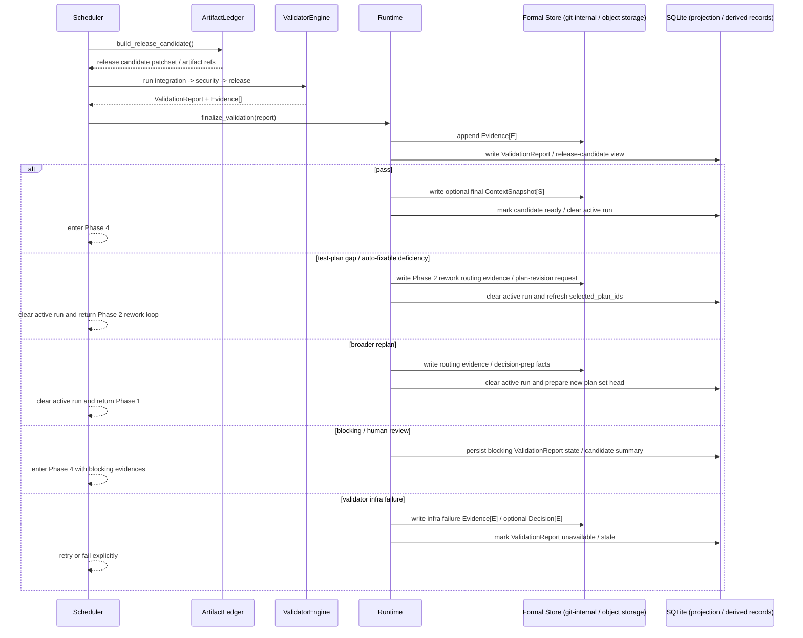

#### Phase 3 详细时序：`resume <thread>`

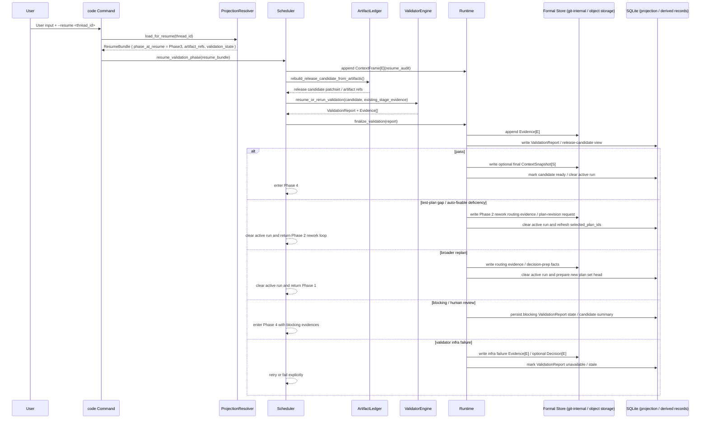

#### Phase 3 子步骤拆解

| 子步骤 | 输入 | 输出 | 说明 |
|---|---|---|---|
| candidate 聚合 | execution/test task artifacts、patchsets、usage、evidence | release candidate 视图 | 从执行产物构造系统级候选 |
| validator 执行 | release candidate、validation policy | stage results | `integration`、`security`、`release` 是固定 pipeline stage，不是 planner-defined DAG |
| evidence 规范化 | stage results | structured `Evidence[E]` / `ValidationReport` | 形成可查询、可审计的结果 |
| final context freeze 判定 | release candidate、当前 `working directory` / 仓库状态 | optional `ContextSnapshot[S]` | 只有稳定候选值得冻结 |
| test-plan sufficiency 判定 | validation outcome、test coverage facts、policy | Phase 2 rework / broader replan / pass | 明确区分“测试计划不足”和“整体计划错误” |
| 路由决策 | validation outcome、policy | enter Phase 4 / back to Phase 2 / back to Phase 1 / retry infra | Phase 3 的出口控制点 |

#### Phase 3 产物与约束

1. system-level validation 明确属于 Phase 3，不得混入 provider execution tool loop。
2. Phase 3 不得物化、调度或执行任何 planner-defined DAG；`dagrs` 与 task DAG 只属于 Phase 2。
3. `Evidence[E]` 和 `ValidationReport` 必须结构化，不允许只保留文本日志。
4. `ValidationReport` 持久化时必须携带生成它的 validator / policy version，保证后续 replay / rebuild 有确定输入。
5. validator failure 不得静默吞掉；至少要写 evidence 或 terminal failure 记录。
6. final `ContextSnapshot[S]` 只用于冻结稳定候选，不作为运行时增量上下文容器。
7. Phase 3 可以把流程路由回 Phase 2（test-plan / execution rework）或 Phase 1（broader replan），但不能直接绕过 Scheduler 重新启动 provider execution。

### Phase 4 Detailed Analysis

Phase 4 的职责是把 Phase 0 的风险基线与 Phase 2/3 的执行证据汇总成最终发布决策，并把结果投影回 thread / scheduler 的当前视图。它的核心不是再生成内容，而是做最终选择和状态推进。

#### Phase 4 目标

1. 计算最终风险分和 `DecisionProposal`。
2. 决定是自动合并、人工批准、人工拒绝、请求修改还是取消/放弃。
3. 写入 final `Decision[E]` 和可选 terminal `IntentEvent[E]`。
4. 推进 `ThreadProjection` / `SchedulerState` 到完成态、待修订态或空闲态。
5. 保证最终 `chosen_patchset_id` 和决策理由可审计、可回放。

#### Phase 4 路径规则

| 场景 | formal writes | projection 更新 | 下一步 |
|---|---|---|---|
| low risk auto-merge | `Decision(AutoMerge)` | `current_intent_id` 前进，Scheduler 置 idle | 完成 |
| human approve | `Decision(HumanApprove)` | 与 auto-merge 同步推进 | 完成 |
| human reject | `Decision(HumanReject)` | 清理 active 选择，保留 thread 历史 | 终止或回到 Phase 1 |
| request changes（plan-level） | `Decision(RequestChanges)`，随后写 replan 请求 / 新的 execution/test `Plan` revision | 指向新的 plan set head | 回到 Phase 1 |
| request changes（intent-level） | `Decision(RequestChanges)`，随后写新的 `Intent` revision | 指向新的 intent head，并清理当前 plan 选择 | 回到 Phase 0 |
| cancel | `Decision(Cancelled)` | Scheduler 置 idle | 终止 |
| abandon | `Decision(Abandon)` | Scheduler 置 idle | 终止 |

#### Phase 4 详细时序：新建路径（连续进入最终决策）

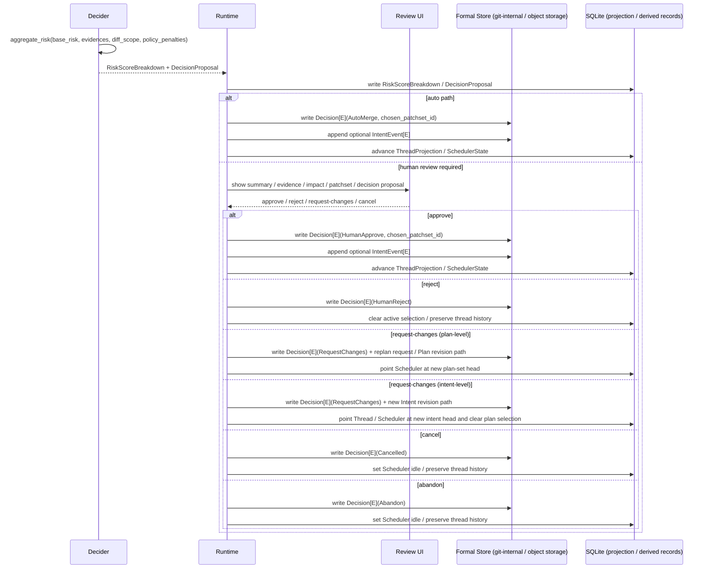

#### Phase 4 详细时序：`resume <thread>`

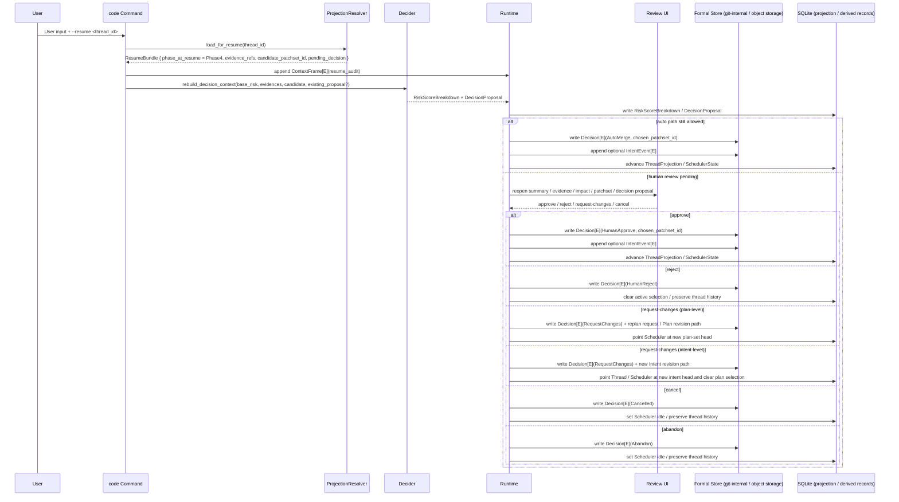

#### Phase 4 子步骤拆解

| 子步骤 | 输入 | 输出 | 说明 |
|---|---|---|---|
| 风险聚合 | Phase 0 risk、Evidence、diff scope、policy | `RiskScoreBreakdown` | 形成最终决策输入 |
| 决策提案生成 | `RiskScoreBreakdown`、validation outcome | 已持久化的 `DecisionProposal` | 区分 auto path 与 human review path |
| review / approval | `DecisionProposal`、candidate summary | approve / reject / request-changes(plan-level or intent-level) | 高风险路径的人类控制点 |
| final decision 写入 | decision 结果、chosen patchset | `Decision[E]`、可选 `IntentEvent[E]` | 最终不可变审计记录 |
| projection 推进 | final decision、intent / plan refs | idle / next revision / terminal state | Phase 4 的状态收口 |

#### Phase 4 产物与约束

1. 最终发布选择必须通过 `Decision[E]` 表达，不能通过覆写旧 Snapshot 表达。
2. `chosen_patchset_id` 必须显式记录，避免“最后到底发布了哪份候选”不可追踪。
3. `RiskScoreBreakdown` 和 `DecisionProposal` 持久化时必须携带生成它们的 decision policy version，保证缺失后可以 replay / rebuild。
4. Phase 4 不能自行生成新的 `Plan` / `Task`；若需要改动，必须根据变更层级回到 Phase 1（plan-level）或 Phase 0（intent-level）review loop。
5. 只有在 final `Decision[E]` 成功写入后，`ThreadProjection` / `SchedulerState` 才能推进到完成态或空闲态。
6. Phase 4 的风险分必须以 Phase 0 的 `risk_level` 为基线，再叠加 evidence 和 diff scope，而不是重新定义一个平行风险体系。

### SQLite Schema And Storage Placement

本计划明确采用“双层持久化”：

1. **对象存储 + git-internal history branch**：保存不可变 formal objects，是 `Intent` / `Plan` / `Task` / `Run` / `PatchSet` / `ContextSnapshot` / `Provenance` 以及全部 append-only Event 的真相源。
2. **SQLite (`sql/sqlite_20260309_init.sql`)**：保存当前运行视图、可重建 query index、live context window，以及 Phase 3 / Phase 4 的 runtime-owned derived records。SQLite 不是 formal snapshot / event 的主真相源。

这一章是对前文 “Snapshot / Event / Projection Design” 的落地化约束。实施时，`sql/sqlite_20260309_init.sql` 的 AI schema 必须与这里保持一致；对象存储与 SQLite 的职责边界也必须按这里执行。

#### Code 过程产生的数据：对象存储 vs SQL

| 数据族 | 对象存储 / git-internal | SQLite | 说明 |
|---|---|---|---|
| `Intent` / `IntentEvent` | **是** | 仅存 `ai_thread`、`ai_thread_intent` 中的当前 thread 视图与 membership | `Intent` revision chain、confirmed/cancelled lifecycle 是 formal history；SQL 只缓存当前 thread 视图，不复制完整 payload |
| `Plan` / `Task` / `PlanStepEvent` | **是** | `ai_scheduler_plan_head`、`ai_index_intent_plan`、`ai_index_intent_task`、`ai_index_plan_step_task` | `Plan` / `Task` 本体不可变，SQL 只保存“当前 head 是谁”“某个 intent 下有哪些 plan/task”等查找结果 |
| `Run` / `RunEvent` / `PatchSet` / `Evidence` / `ToolInvocation` / `ContextFrame` / `RunUsage` / `Provenance` | **是** | `ai_scheduler_state.active_run_id`、`ai_index_task_run`、`ai_index_run_event`、`ai_index_run_patchset`、`ai_live_context_window` | 执行事实、证据、上下文增量、补丁候选都必须进入 formal object/event 层；SQL 只保留当前活动执行指针与查找索引 |
| `ContextSnapshot` | **是** | 仅以 `context_snapshot_id` 形式被 thread/scheduler/derived records 间接引用 | `ContextSnapshot` 是冻结点，不落 SQL payload；SQLite 只保存引用关系或派生状态 |
| `Decision` / `IntentEvent` terminal state | **是** | thread / scheduler projection 仅缓存当前完成态、待修订态或 idle 态 | 最终决策必须回写 formal `Decision[E]`，不得只更新 SQL |
| `ThreadProjection` / `SchedulerState` / live context window | 否 | **是** | 这些是 Libra runtime 的当前视图，可重建，不应该反向写成 formal snapshot |
| Query Index（intent->plans、task->runs、run->patchsets 等） | 否 | **是** | 全部来自 formal history rebuild；缺失时允许 targeted rebuild 或全量扫描重建 |
| `ValidationReport` / `RiskScoreBreakdown` / `DecisionProposal` | 否，作为 formal history 的**派生产物**存在 | **是** | 它们是 Phase 3 / 4 runtime-owned derived records：直接供 UI / MCP / diagnostics 消费，但可由 Snapshot + Event + policy version replay / rebuild |

补充约束：

1. SQLite 中出现的 `intent_id` / `plan_id` / `task_id` / `run_id` / `patchset_id` / `context_frame_id` / `decision_id` 等字段，默认都只是**文本引用**，指向对象存储里的 formal object；除 `thread_id` 外，不要求也不允许把这些对象完整复制成 SQL 主表。
2. `IntentSpec Draft`、confirmed `IntentSpec`、review markdown、execution/test dual plan、per-task execution facts、validator evidence 和 final decision，最终都必须能从对象存储的 formal objects + events 重建；SQL 只缓存当前视图、查找结果或派生结果。
3. 不允许为 provider-specific transcript 再引入一套 shadow SQL tables；provider 私有 session/thread id 只能进入 metadata / mapping 字段，不能成为 SQL 主键语义。
4. Phase 3 / 4 的 derived record 缺失、过期或版本漂移时，必须允许 replay / rebuild；SQL 行丢失不能阻塞 thread 读取或 `--resume`。

#### 当前 SQLite 基线（摘自 `sql/sqlite_20260309_init.sql` 的 AI projection schema）

下面这些 DDL 是当前仓库已经存在的 AI projection / index 基线；`code` 改造必须建立在这个基线上，而不是重新发明一套平行 schema：

```sql
CREATE TABLE IF NOT EXISTS `ai_thread` (
    `thread_id` TEXT PRIMARY KEY,
    `title` TEXT,
    `owner_kind` TEXT NOT NULL,
    `owner_id` TEXT NOT NULL,
    `owner_display_name` TEXT,
    `current_intent_id` TEXT,
    `latest_intent_id` TEXT,
    `metadata_json` TEXT,
    `archived` INTEGER NOT NULL DEFAULT 0 CHECK (`archived` IN (0, 1)),
    `version` INTEGER NOT NULL DEFAULT 0,
    `created_at` INTEGER NOT NULL,
    `updated_at` INTEGER NOT NULL
);

CREATE TABLE IF NOT EXISTS `ai_thread_participant` (
    `thread_id` TEXT NOT NULL,
    `actor_kind` TEXT NOT NULL,
    `actor_id` TEXT NOT NULL,
    `actor_display_name` TEXT,
    `role` TEXT NOT NULL,
    `joined_at` INTEGER NOT NULL,
    PRIMARY KEY (`thread_id`, `actor_kind`, `actor_id`),
    FOREIGN KEY (`thread_id`) REFERENCES `ai_thread`(`thread_id`) ON DELETE CASCADE
);

CREATE TABLE IF NOT EXISTS `ai_thread_intent` (
    `thread_id` TEXT NOT NULL,
    `intent_id` TEXT NOT NULL,
    `ordinal` INTEGER NOT NULL,
    `is_head` INTEGER NOT NULL DEFAULT 0 CHECK (`is_head` IN (0, 1)),
    `linked_at` INTEGER NOT NULL,
    `link_reason` TEXT NOT NULL,
    PRIMARY KEY (`thread_id`, `intent_id`),
    FOREIGN KEY (`thread_id`) REFERENCES `ai_thread`(`thread_id`) ON DELETE CASCADE
);

CREATE TABLE IF NOT EXISTS `ai_scheduler_state` (
    `thread_id` TEXT PRIMARY KEY,
    `selected_plan_id` TEXT,
    `active_task_id` TEXT,
    `active_run_id` TEXT,
    `metadata_json` TEXT,
    `version` INTEGER NOT NULL DEFAULT 0,
    `updated_at` INTEGER NOT NULL,
    FOREIGN KEY (`thread_id`) REFERENCES `ai_thread`(`thread_id`) ON DELETE CASCADE
);

CREATE TABLE IF NOT EXISTS `ai_scheduler_plan_head` (
    `thread_id` TEXT NOT NULL,
    `plan_id` TEXT NOT NULL,
    `ordinal` INTEGER NOT NULL,
    PRIMARY KEY (`thread_id`, `plan_id`),
    FOREIGN KEY (`thread_id`) REFERENCES `ai_thread`(`thread_id`) ON DELETE CASCADE
);

CREATE TABLE IF NOT EXISTS `ai_live_context_window` (
    `thread_id` TEXT NOT NULL,
    `context_frame_id` TEXT NOT NULL,
    `position` INTEGER NOT NULL,
    `source_kind` TEXT NOT NULL,
    `pin_kind` TEXT,
    `inserted_at` INTEGER NOT NULL,
    PRIMARY KEY (`thread_id`, `context_frame_id`),
    FOREIGN KEY (`thread_id`) REFERENCES `ai_thread`(`thread_id`) ON DELETE CASCADE
);

CREATE TABLE IF NOT EXISTS `ai_index_intent_plan` (
    `intent_id` TEXT NOT NULL,
    `plan_id` TEXT NOT NULL,
    `created_at` INTEGER NOT NULL,
    PRIMARY KEY (`intent_id`, `plan_id`)
);

CREATE TABLE IF NOT EXISTS `ai_index_intent_task` (
    `intent_id` TEXT NOT NULL,
    `task_id` TEXT NOT NULL,
    `parent_task_id` TEXT,
    `origin_step_id` TEXT,
    `created_at` INTEGER NOT NULL,
    PRIMARY KEY (`intent_id`, `task_id`)
);

CREATE TABLE IF NOT EXISTS `ai_index_plan_step_task` (
    `plan_id` TEXT NOT NULL,
    `task_id` TEXT NOT NULL,
    `step_id` TEXT NOT NULL,
    `created_at` INTEGER NOT NULL,
    PRIMARY KEY (`plan_id`, `task_id`)
);

CREATE TABLE IF NOT EXISTS `ai_index_task_run` (
    `task_id` TEXT NOT NULL,
    `run_id` TEXT NOT NULL,
    `is_latest` INTEGER NOT NULL DEFAULT 0 CHECK (`is_latest` IN (0, 1)),
    `created_at` INTEGER NOT NULL,
    PRIMARY KEY (`task_id`, `run_id`)
);

CREATE TABLE IF NOT EXISTS `ai_index_run_event` (
    `run_id` TEXT NOT NULL,
    `event_id` TEXT NOT NULL,
    `event_kind` TEXT NOT NULL,
    `is_latest` INTEGER NOT NULL DEFAULT 0 CHECK (`is_latest` IN (0, 1)),
    `created_at` INTEGER NOT NULL,
    PRIMARY KEY (`run_id`, `event_id`)
);

CREATE TABLE IF NOT EXISTS `ai_index_run_patchset` (
    `run_id` TEXT NOT NULL,
    `patchset_id` TEXT NOT NULL,
    `sequence` INTEGER NOT NULL,
    `is_latest` INTEGER NOT NULL DEFAULT 0 CHECK (`is_latest` IN (0, 1)),
    `created_at` INTEGER NOT NULL,
    PRIMARY KEY (`run_id`, `patchset_id`)
);

CREATE TABLE IF NOT EXISTS `ai_index_intent_context_frame` (
    `intent_id` TEXT NOT NULL,
    `context_frame_id` TEXT NOT NULL,
    `relation_kind` TEXT NOT NULL,
    `created_at` INTEGER NOT NULL,
    PRIMARY KEY (`intent_id`, `context_frame_id`, `relation_kind`)
);
```

说明：

1. 这套基线已经足够表达 `ThreadProjection`、`current_plan_heads`、`live_context_window` 和主要 query index。
2. 它**还不足以**完整表达 `selected_plan_ids`（当前只有单值 `selected_plan_id`）以及 Phase 3 / Phase 4 的 derived records。
3. 因此，本计划不要求把 formal objects 搬进 SQL，而是要求在现有 projection schema 上做**定向补洞**。

#### 本计划要求追加到 SQLite bootstrap 与 migration 的 DDL

这些 DDL 必须同时出现在两个位置：

1. `sql/sqlite_20260309_init.sql`：服务新初始化 repo。
2. `sql/sqlite_YYYYMMDD_ai_runtime_contract.sql`：服务已有 `.libra/libra.db` 的幂等升级。

如果当前仓库尚未提供完整 migration runner，Phase 0 至少必须先提交独立 migration SQL、dry-run preview 设计和 verify checklist；Phase 2 identity cutover 前再接入实际执行入口。不允许只更新 bootstrap 后假设老用户数据库自然可用。

首先，`selected_plan_id` 是当前 schema 的单值遗留字段，只能表达“一个被选中的 plan”，无法表达 Phase 1 / Phase 2 所需的 execution/test `selected_plan_ids`。目标态必须追加 dedicated table，并把 `ai_scheduler_state.selected_plan_id` 视为迁移兼容字段：

```sql
CREATE TABLE IF NOT EXISTS `ai_scheduler_selected_plan` (
    `thread_id` TEXT NOT NULL,
    `plan_id` TEXT NOT NULL,
    `ordinal` INTEGER NOT NULL,
    PRIMARY KEY (`thread_id`, `plan_id`),
    FOREIGN KEY (`thread_id`) REFERENCES `ai_thread`(`thread_id`) ON DELETE CASCADE
);
CREATE UNIQUE INDEX IF NOT EXISTS idx_ai_scheduler_selected_plan_thread_ordinal
    ON `ai_scheduler_selected_plan`(`thread_id`, `ordinal`);
```

目标 contract：每个 `thread_id` 在 `ai_scheduler_selected_plan` 中必须恰好存在两行，`ordinal = 0` 表示 `execution_plan_id`，`ordinal = 1` 表示 `test_plan_id`。

其次，Phase 3 / Phase 4 的 runtime-owned derived records 需要独立 SQL tables；这些表直接服务 UI / MCP / diagnostics，但不是 formal history 真相源：

```sql
CREATE TABLE IF NOT EXISTS `ai_validation_report` (
    `report_id` TEXT PRIMARY KEY,
    `thread_id` TEXT NOT NULL,
    `candidate_patchset_id` TEXT,
    `status` TEXT NOT NULL,
    `validator_name` TEXT NOT NULL,
    `validator_version` TEXT NOT NULL,
    `policy_version` TEXT NOT NULL,
    `summary_json` TEXT NOT NULL,
    `stale` INTEGER NOT NULL DEFAULT 0 CHECK (`stale` IN (0, 1)),
    `is_latest` INTEGER NOT NULL DEFAULT 0 CHECK (`is_latest` IN (0, 1)),
    `created_at` INTEGER NOT NULL,
    `updated_at` INTEGER NOT NULL,
    FOREIGN KEY (`thread_id`) REFERENCES `ai_thread`(`thread_id`) ON DELETE CASCADE
);
CREATE INDEX IF NOT EXISTS idx_ai_validation_report_thread_created
    ON `ai_validation_report`(`thread_id`, `created_at`);
CREATE UNIQUE INDEX IF NOT EXISTS idx_ai_validation_report_latest
    ON `ai_validation_report`(`thread_id`) WHERE `is_latest` = 1;

CREATE TABLE IF NOT EXISTS `ai_risk_score_breakdown` (
    `breakdown_id` TEXT PRIMARY KEY,
    `thread_id` TEXT NOT NULL,
    `candidate_patchset_id` TEXT,
    `policy_version` TEXT NOT NULL,
    `total_score` REAL NOT NULL,
    `breakdown_json` TEXT NOT NULL,
    `stale` INTEGER NOT NULL DEFAULT 0 CHECK (`stale` IN (0, 1)),
    `is_latest` INTEGER NOT NULL DEFAULT 0 CHECK (`is_latest` IN (0, 1)),
    `created_at` INTEGER NOT NULL,
    FOREIGN KEY (`thread_id`) REFERENCES `ai_thread`(`thread_id`) ON DELETE CASCADE
);
CREATE INDEX IF NOT EXISTS idx_ai_risk_score_breakdown_thread_created
    ON `ai_risk_score_breakdown`(`thread_id`, `created_at`);
CREATE UNIQUE INDEX IF NOT EXISTS idx_ai_risk_score_breakdown_latest
    ON `ai_risk_score_breakdown`(`thread_id`) WHERE `is_latest` = 1;

CREATE TABLE IF NOT EXISTS `ai_decision_proposal` (
    `proposal_id` TEXT PRIMARY KEY,
    `thread_id` TEXT NOT NULL,
    `candidate_patchset_id` TEXT,
    `chosen_patchset_id` TEXT,
    `recommended_action` TEXT NOT NULL,
    `requires_human_review` INTEGER NOT NULL DEFAULT 0 CHECK (`requires_human_review` IN (0, 1)),
    `policy_version` TEXT NOT NULL,
    `summary_json` TEXT NOT NULL,
    `stale` INTEGER NOT NULL DEFAULT 0 CHECK (`stale` IN (0, 1)),
    `is_latest` INTEGER NOT NULL DEFAULT 0 CHECK (`is_latest` IN (0, 1)),
    `created_at` INTEGER NOT NULL,
    `updated_at` INTEGER NOT NULL,
    FOREIGN KEY (`thread_id`) REFERENCES `ai_thread`(`thread_id`) ON DELETE CASCADE
);
CREATE INDEX IF NOT EXISTS idx_ai_decision_proposal_thread_created
    ON `ai_decision_proposal`(`thread_id`, `created_at`);
CREATE UNIQUE INDEX IF NOT EXISTS idx_ai_decision_proposal_latest
    ON `ai_decision_proposal`(`thread_id`) WHERE `is_latest` = 1;
```

设计说明：

1. 这些新表都只以 `thread_id` 建立 SQL foreign key；`patchset_id` / `plan_id` / `run_id` 等 formal object id 保持为文本引用，因为对应对象的真相源仍在对象存储中，不在 SQLite 中。
2. `summary_json` / `breakdown_json` 是 UI / MCP 直接消费的结构化 payload；缺失时可以 replay / rebuild，不得作为新的独立真相源。
3. `is_latest` + partial unique index 用来表达“每个 thread 当前最新的一份 derived record”；历史版本仍然保留，方便审计与回放。
4. `stale` 用于降级读与 targeted rebuild：派生结果版本漂移时先标 stale，再重算，不允许因一条 derived row 缺失而阻塞线程读取或 `--resume`。

#### 对 `sql/sqlite_20260309_init.sql` 的实施约束

1. `sql/sqlite_20260309_init.sql` 中**不新增** `ai_intent` / `ai_plan` / `ai_task` / `ai_run` / `ai_patchset` 这类 formal snapshot 主表；这些对象继续留在对象存储 + git-internal history branch。
2. `sql/sqlite_20260309_init.sql` 中**允许新增** projection、query index、runtime-owned derived record 表，因为它们本身就是可重建的运行时视图或派生产物。
3. `ai_scheduler_state.selected_plan_id` 在迁移期仅作兼容读写字段；目标实现必须切到 `ai_scheduler_selected_plan`，并以该表表达顺序固定的 `selected_plan_ids = [execution_plan_id, test_plan_id]`。
4. 任一 SQL 行丢失都不能破坏 formal history；系统必须允许通过 Snapshot + Event rebuild SQL projection / index / derived records。
5. 任何 provider-specific shadow schema、provider transcript 主表或把 provider session 直接变成 SQL 主键的设计，都违反本计划。
6. migration 必须幂等、非破坏性；不 drop 旧 `selected_plan_id`，至少保留到 identity/projection cutover 后一个 release。
7. `legacy_session_id` / `provider_thread_id` 只能进入 `metadata_json` 或一次性 mapping / verify 报告；不得成为新的 SQL 主键语义。

### ContextSnapshot 写入条件

下列情形写入 `ContextSnapshot`；不满足条件时不写：
- Phase 0 新 thread 首次冻结，且当前 `working directory` / `main worktree` 存在未提交变更。
- Phase 0 `--resume` 且用户追加新要求，或当前 repo baseline 相对上次冻结发生实质变化；在确认当前 revision 后判定需要重新冻结。
- Phase 3 验证通过后确认为 release candidate。
- 人工请求冻结当前上下文。

`ContextSnapshot` 的来源约束：

1. Phase 0 的 `ContextSnapshot` 由 Runtime 基于当前 `working directory` / repo baseline 采集和冻结。
2. 它不是 Codex 或通用大模型 tool loop 的原始输出容器。
3. provider 在 Phase 0 / Phase 1 / Phase 2 期间产生的增量上下文都应进入 `ContextFrame[E]`，不是反向回填 `ContextSnapshot[S]`。
4. 若 Phase 0 没有值得冻结的未提交基线，可以不写 `ContextSnapshot`；这不会阻塞 projection seed。`ThreadProjection` / `SchedulerState` 的最小 seed 来自 confirmed `Intent`、canonical `thread_id` 和 thread bootstrap / refresh 结果，而不是强依赖 snapshot。

### ContextSnapshot 冻结操作定义

这里的“冻结”不是只做一个标记，而是一组原子化操作：把某一时刻可复现的上下文基线采集、归一化、落盘并建立可追踪引用。

| 步骤 | Runtime 执行操作 | 输出 |
|---|---|---|
| 1. 采集基线 | 读取当前 `working directory` / `main worktree` 状态（tracked/untracked/modified 摘要）、HEAD/ref、必要的索引与配置摘要、当前 thread/intent 关联信息 | 内存态 baseline payload |
| 2. 归一化与脱敏 | 对路径/时间戳/环境差异字段做规范化；按 redaction 规则去除敏感信息；剔除不可重放噪声字段 | canonical snapshot payload |
| 3. 内容寻址写入 | 通过 Runtime 写入不可变 `ContextSnapshot[S]`，生成 `context_snapshot_id`（内容变化才产生新快照） | `ContextSnapshot[S]` |
| 4. 建立引用关系 | 在当前 phase 结果中记录 `context_snapshot_id`，并把 thread/scheduler 当前视图指向该快照作为恢复锚点 | projection 引用更新 |
| 5. 审计记录 | 追加一条 `ContextFrame[E]`（kind 可为 snapshot_freeze），记录触发原因、来源 phase、快照 id | `ContextFrame[E]` |

补充约束：

1. 冻结必须经由 `Runtime` 完成，不允许 UI 或 provider 直接写 `ContextSnapshot`。
2. 冻结是“时间点快照”，不是增量日志容器；后续增量上下文继续写 `ContextFrame[E]`。
3. 同一基线重复冻结应幂等（可复用同一 `context_snapshot_id` 或产生等价内容哈希），不得制造语义重复快照。
4. 若冻结失败：不得阻塞线程读取；需写入失败 evidence（如 `Evidence(kind=ContextSnapshotFreezeFailed)`）并把 projection 标记为可恢复的 stale 状态，等待重试或人工介入。

---

## Context

本计划把 `libra code` 作为一个完整命令来收敛，目标有五项：

1. 建立共享 `Runtime`、`TaskExecutor`、prompt assembly 和事件契约，让 Scheduler 成为唯一控制面。
2. 统一 `thread_id` 语义，使 Libra `thread_id` 成为唯一的用户可见恢复标识，并补齐 targeted rebuild / resume 合同。
3. 把 Code UI 收敛到共享 read model，让 TUI、Web、CLI controller 不再维护各自独立的运行时真相。
4. 为所有 provider 建立共享的 `ArtifactLedger`、`ValidatorEngine` 和 `DecisionProposal`，把验证与决策从 provider 内存态提升为 formal object 流。
5. 收口安全、权限、诊断、性能与测试体系，并清理遗留的 provider-specific managed surface（含 `claudecode` runtime）。

本计划采用"先定义上位契约，再说明当前基线，最后给出按顺序执行的实施步骤"的结构。阅读顺序和执行顺序保持一致，避免实现者在多个章节之间来回跳读。

### Hard Constraints

1. Libra 是版本管理核心，Codex 是接入到 Libra 工作流中的托管 provider/runtime。
2. provider 的 VCS 操作必须通过 Libra 能力完成，禁止直接使用 `git`、`jj` 或其它版本管理工具。
3. Codex 路径中的 `approvalPolicy` 只有在 Libra 完整接管工具边界与审批语义后才收敛为 `never`；实施过程中不得提前强制到尚未受 `Runtime` 控制的路径。
4. Phase 0 和 Phase 1 中 provider 只允许调用 readonly tools；任何会修改当前 `working directory` / `main worktree`、VCS 或外部状态的 tool 都必须等到 Phase 2 由 Scheduler 驱动执行。
5. 所有阶段划分、对象写入和运行时投影，都必须遵循 `docs/agent/agent-workflow.md` 和 `docs/agent/ai-object-model-reference.md`。
6. 合成出的 `IntentSpec` 和 `Plan` 都必须以易读的 Markdown review 形式展示给开发者确认，不能以原始 JSON 或难以审阅的结构化对象替代审查界面。
7. Libra `thread_id` 是 `code` 命令唯一的用户可见恢复 ID；provider-specific ID 只允许作为内部映射字段存在。
8. `claudecode` 不是过渡期保留组件；删除必须在 `Implementation Phase 1 / Wave 1C` 的同一合入波次中完成：切完最后一个调用点后立即一次性删除其全部运行时代码、CLI 标志、文档说明和测试，不允许跨 phase 保留可发布的双栈、feature flag、deprecated path、兼容别名或中间运行态。`Wave 1A / 1B` 可以先引入共享 contract、mock 和薄适配层，但不得新增或延长任何用户可见 `claudecode` 兼容契约。唯一允许的兼容只限本地 `thread_id` 数据迁移时一次性读取旧字段，不能反向保留旧的用户可见契约。
9. Libra Scheduler 拥有 Phase 2 的控制权：Codex 不能自主跑完整个计划；Libra 按 Task 驱动所有 provider（包括 Codex），而不是 provider 告诉 Libra 执行到了哪一步。
10. 持久化统一：所有 provider 路径只允许通过共享 `Runtime` 层写入 formal objects，禁止再写 provider-specific shadow snapshot/event 家族。
11. Projection 字段直接对应：代码中的 `pending_plan_revision` 必须重构为 `Scheduler.selected_plan_ids` / `current_plan_heads` 直接映射，不允许在 `code` 命令专有状态中另造独立变量。
12. 通用方案对等原则：凡是 Codex 路径具备的 formal 能力（review loop、revision chain、formal writes、projection 更新），通用 provider 路径必须具备相同能力，不允许降级为 placeholder 或 stub。
13. Query Index 可重建契约：`Thread`、`Scheduler`、Query Index 的丢失不能阻塞读访问；必须能从 Snapshot + Event 完整重建，重建入口必须有显式触发条件和降级读路径定义。

## Recommended Reading Order

建议按下面顺序阅读本计划：

1. `Workflow Contract`：先建立上位模型、Phase 0-4 的边界，重点理解 Phase 0 输入合同、Phase 3/4 状态机和控制权归属。
2. `Context`：再看本轮改造的目标和硬约束。
3. `Terminology`：先统一本计划中的专用词义，避免把 `CAS`、`thread_id`、`DecisionProposal` 等读成别的概念。
4. `Query Index And Rebuild/Read Contract`：理解投影层的可重建承诺。
5. `Current Baseline`：理解当前代码已经做到什么、哪些是核心缺陷（而非中性事实陈述）。
6. `Implementation-Level Spec`：理解 trait 形状、状态流、事件模型和代码映射。
7. `Delivery Order`：理解这批改造为什么必须先做 `Implementation Phase 0: Contract Stabilization`，再按 `Implementation Phase 1` → `Implementation Phase 5` 执行。
8. `Implementation Phase 0 / 1 / 2 / 3 / 4 / 5`：按执行顺序阅读实施内容、影响模块、完成定义和用户影响。
9. `Shared Function Boundary`：理解哪些函数必须共享，哪些仅 provider 适配层可实现。
10. `Appendix A / Appendix B`：最后再看当前 prompt assembly、ContextFrame、provider mapping 等实现细节。
11. `Validation`：最终看验收标准和完整测试策略。

---

## Terminology

本节只定义本计划中的用词，不试图覆盖这些词在其他系统里的通用含义。凡遇到歧义，以这里的定义为准。

| 术语 | 在本文中的含义 | 明确不是 |
|---|---|---|
| `Workflow Phase 0-4` | Libra runtime 中真实发生的 workflow 阶段：Intent、Planning、Execution、Validation、Decision | 不是实施顺序，不等于 `Implementation Phase 0-5` |
| `Implementation Phase 0-5` | 这份重构计划的交付顺序，用来描述先做哪一批改造 | 不是运行时状态机，不参与 formal object 写入 |
| `Implementation Phase 0: Contract Stabilization` | 真正切主路径前的工程底座补丁：dagrs spike、mock、benchmark baseline、schema migration plan、核心 enum / mutation / freshness contract | 不是运行时 Phase 0 Intent workflow，也不是可跳过的准备工作 |
| `Wave 1A / 1B / 1C` | `Implementation Phase 1` 内的三个可独立审查波次：contract only、scheduler/environment cutover、provider surface cleanup | 不是长期双栈策略，也不是 feature flag 发布路线 |
| `CAS` | `Compare-And-Swap`，即基于 `version` 的乐观并发更新模式 | 不是 `Content-Addressable Storage` |
| canonical `thread_id` | Libra 唯一对用户可见的恢复 ID，定义为 root intent UUID | 不是 provider session/thread ID，也不是旧 `session_id` |
| `provider_thread_id` | provider 原生 thread/session 标识，仅存 metadata 供诊断、查询映射使用 | 不参与 `--resume`、Web `/threads`、MCP `list_threads` 的主键语义 |
| targeted rebuild | 仅针对指定 `thread_id` 的 projection / query index 重建，而不是全量重扫整个库 | 不是 latest-thread 启发式恢复，也不是每次读都全量 rebuild |
| degraded read | projection 缺失或过期时，先返回从 immutable history 直接构造的轻量视图，并标记 stale | 不是 silently fallback 到旧 session/private cache |
| plan set | Phase 1 产出的固定双计划，且只能包含 `execution` 与 `test` 两类 `Plan` | 不是单个 `Plan`，也不是 provider 随手返回的一段 plan text |
| `current_plan_heads` | 当前 revision 链上最新、可继续修改或审查的 plan heads | 不表示“已批准执行” |
| `selected_plan_ids` | 已经在 `Execute` 分支被批准、将进入 Phase 2 执行的 plan heads；固定顺序为 `[execution_plan_id, test_plan_id]` | 不等于所有历史 plan heads，也不等于 draft review 中的候选集合 |
| `ExecutionEnvironmentProvider` | Libra 提供的 Phase 2 执行环境边界：`Sandbox`、task `Worktree`、sync back、cleanup | 不是泛化的 workspace manager，也不是 provider 自己的运行时沙箱 |
| controller lease | TUI / Web 之间的单写者输入控制权协议；谁持有 lease，谁可以提交交互输入 | 不是整条 thread 的独占锁，也不改变 immutable history 的可读性 |
| typed delta | 带类型、带序号、支持 gap recovery 的 UI 事件增量流 | 不是原始 transcript 追加流，也不是 provider-native websocket payload 原样透传 |
| `ContextFrame` | 用于 live context window 的结构化 Event 摘要，记录上下文事实与压缩行为 | 不是原始日志容器，也不替代 `ToolInvocation` |
| `ArtifactLedger` | Phase 3 用来汇总 per-task patch/evidence/usage/context 并形成 release candidate 输入的正式聚合层 | 不是另一个 shadow store，也不是替代 immutable formal objects 的真相源 |
| `ValidationReport` | Phase 3 产出的结构化验证结果；作为 runtime-owned derived record 持久化，供 UI / MCP / diagnostics / Phase 4 直接消费 | 不是 provider transcript，也不是旧 `SystemReport` 内存态 |
| `DecisionProposal` | Phase 4 基于风险与验证结果生成的“待执行/待审批决策提案”；缺失时可按 Snapshot + Event + policy version replay | 不是 final `Decision`，也不等于用户已经 approve/reject |
| release candidate patchset | 进入 Phase 3/4 系统验证与决策的候选补丁集合视图 | 不是自动已发布结果，也不保证一定进入 auto-merge |
| `approvalPolicy=never` | 目标态下 provider 侧可采用的“Libra 已完全接管 tool boundary”配置 | 不是当前默认前提，也不能在 boundary 未收口前提前假定成立 |
| `LegacyInteractive` | `Wave 1A` 前的现状审批语义，provider / UI 仍可能直接承载交互审批 | 不是目标态，也不能在 Wave 1B 后继续作为主路径 |
| `RuntimeMediatedInteractive` | `Wave 1B` 到 Phase 5 之间的中间态：Runtime / ToolBoundaryPolicy 接管 readonly / mutating 边界，但 mutating approval 仍通过共享 interaction 明确展示 | 不是 `approvalPolicy=never` |
| `RuntimeMediatedNever` | Phase 5 完成 tool boundary、audit、redaction、policy tests 后才允许启用的终态 | 不是 Phase 1 删除 `claudecode` 时可以提前假定的配置 |
| `Cancelled` | 用户或 operator 在 review / execution 未完成前主动取消 workflow | 不是已经评估候选结果后决定不发布 |
| `Abandon` | 系统或人类在已有执行 / 验证事实后决定不发布候选结果 | 不是普通用户取消 |

---

## Query Index And Rebuild/Read Contract

对应 `docs/agent/ai-object-model-reference.md` 第 213-330 行要求。

### 可重建承诺

| 可重建对象 | 可重建来源 | 触发条件 |
|---|---|---|
| `ThreadProjection` | `Intent` + `Intent.parents` + `IntentEvent.next_intent_id` | Thread 行缺失或 version 不一致时 |
| `SchedulerState` | `Plan` + `Task` + `Run` + `PlanStepEvent` + `RunEvent` | Scheduler 行缺失或 active_run_id 指向已终止 Run 时 |
| Query Index | 扫描全量 Snapshot + Event | 索引行缺失或查询结果与 Snapshot 不一致时 |
| Phase 3/4 structured outputs（`ValidationReport` / `RiskScoreBreakdown` / `DecisionProposal`） | thread 相关 Snapshot + Event + 记录下来的 validator / decision policy version | runtime-owned output row 缺失、版本漂移，或 diagnostics / UI 读路径命中 stale 标记时 |

### 读路径降级规则

```text
读 Thread：
  1. 优先 Libra projection（DB ThreadProjection 行）
  2. 若缺失：触发 rebuild，异步填充，同步返回重建结果
  3. 若重建失败：返回从 Intent history 直接构造的轻量视图，标记为"projection stale"

读 Scheduler：
  1. 优先 Libra projection（DB SchedulerState 行）
  2. 若缺失：从 Plan + Task + Run 事件流重建，同步返回
  3. 不允许因 Scheduler 缺失而阻塞 Phase 2 执行

读 Query Index（intent->plans 等）：
  1. 优先内存 / DB index
  2. 若缺失：全量扫描 Snapshot + Event 生成
  3. Index 扫描不影响主路径正确性，只影响读性能

读 Phase 3/4 structured outputs：
  1. 优先 runtime-owned record（`ValidationReport` / `RiskScoreBreakdown` / `DecisionProposal`）
  2. 若缺失或 stale：按 Snapshot + Event + recorded policy version targeted replay / rebuild
  3. 若 replay 失败：返回带 stale / unavailable 标记的视图，并写诊断 evidence；不得阻塞 thread 读取或 `--resume`
```

### 重建策略

- Thread / Scheduler rebuild 仅触发一次，结果落库；不在每次请求时重建。
- Phase 3/4 structured outputs 允许独立 replay / materialize；它们是可丢弃并可重算的 derived records，不是独立真相源。
- rebuild 期间读取允许返回"stale"标记，不允许返回错误（保证可用性）。
- rebuild 失败时记录 `Evidence(kind=ProjectionRebuildFailed)`，人工介入。

### Projection Freshness SLA

所有 read / resume / Phase 3/4 derived-record 读取都必须返回显式 freshness，而不是只返回数据或错误：

| Freshness | 允许行为 | 禁止行为 |
|---|---|---|
| `Fresh` | 正常读取、`--resume`、scheduler mutation、Phase 3/4 推进、final decision 写入 | none |
| `StaleReadOnly` | UI / MCP / diagnostics 读取、`--resume` 触发 targeted rebuild、展示 degraded view | 写 final `Decision`、推进 Scheduler、auto-merge |
| `Unavailable` | 返回 degraded view、写 `Evidence(kind=ProjectionRebuildFailed)`、允许 diagnostics / 人工修复 | 自动恢复执行、auto-merge、静默降级为 provider transcript |

补充规则：

1. `ValidationReport` / `RiskScoreBreakdown` / `DecisionProposal` stale 时，Phase 4 不能 auto-merge；必须先 replay / recompute，失败则进入 human review 或 validator infrastructure failure。
2. `ProjectionResolver::load_for_resume(thread_id)` 必须先处理 projection freshness，再做 phase-specific resume；不允许在 stale scheduler 上直接推进执行。
3. 同一 thread 连续 CAS conflict 或 rebuild failure 必须写 diagnostics evidence，并暴露给 diagnostics CLI。

### `--resume <thread_id>` 跨阶段恢复合同（Phase 0 / 1 / 2 / 3 / 4）

恢复入口统一为 `ProjectionResolver::load_for_resume(thread_id)`。解析 `ThreadProjection`、`SchedulerState`、最近 `Run` / `TaskEvent` / `RunEvent` / `Decision` 后，必须先判定恢复时刻属于哪个 phase，再执行对应恢复动作。

| 恢复时刻 | 判定条件（最小集合） | 恢复动作 | 禁止行为 |
|---|---|---|---|
| Phase 0 review 待完成 | 存在当前 draft / revision `Intent`，但无 confirmed current intent；或存在未决 `Confirm / Modify / Cancel` review 状态 | 1) 重建当前 intent draft / review markdown；2) 重新打开 IntentSpec review；3) 仅在用户显式选择时重新触发 provider 细化 | 不允许把上次 provider 暂存输出当作已确认 `Intent`；不允许跳过 Intent review 直接进入 Phase 1 |
| Phase 1 plan review 待完成 | 已有当前 `current_plan_heads`，但 `selected_plan_ids` 为空，且无 active run；或存在未决 `Execute / Modify Plan / Revise Intent / Cancel` review 状态 | 1) 基于当前 plan heads 重建 plan-set review；2) 恢复 review 选择入口；3) 仅在用户显式要求 `Modify Plan` 时重新进入 planning 调用 | 不允许隐式 auto-execute；不允许把 `current_plan_heads` 直接视为已批准 `selected_plan_ids` |
| Phase 2 执行中断 | `SchedulerState.active_run_id != None` 且该 run 无 terminal `RunEvent` / `TaskEvent`；或存在 ready/running task 未收口 | 1) 将 non-terminal run 标记为 `Interrupted` 并写事件；2) 清理旧 sandbox/worktree 句柄并重新 provision；3) 依据 `selected_plan_ids` + 事件流重建 ready queue；4) 从未完成 task 继续（必要时按 policy 重试当前 attempt） | 不允许复用中断前的 provider 私有会话作为系统真相；不允许跳过 `Runtime` 直接改 projection |
| Phase 3 验证中断 | 已有 release candidate artifacts，但无 final validation completion 记录；或 validation stage 仅部分落库 | 1) 以当前 artifacts 重新构造 release candidate；2) 对未完成/不完整 stage 重新执行 `integration -> security -> release`；3) 仅当 stage evidence 完整且校验通过时复用已完成 stage 结果 | 不允许把“内存中的 stage 进度”视为已完成；不允许跳过失败 stage 直接进入 Phase 4 |
| Phase 4 决策待完成 | 存在 `DecisionRequested` 或 human-review waiting 状态，但无 final `Decision` | 1) 重建 decision context（risk breakdown + evidence + chosen patchset candidate）；2) 重新打开 human review 或继续 auto path 判定；3) 写入 final `Decision` 后再推进 projection | 不允许重复执行 Phase 2/3 来“覆盖”待决策状态；不允许在无 final `Decision` 时推进 `ThreadProjection` 完成态 |
| Phase 4 已完成 | 已有 final `Decision`（AutoMerge、HumanApprove、HumanReject、Cancelled、Abandon） | 返回只读恢复视图（summary + audit chain），并允许用户显式发起新 revision（回 Phase 0/1） | 不允许隐式重放执行或重复写 final `Decision` |

补充规则：

1. `load_for_resume()` 的输出必须包含 `phase_at_resume`、`resume_reason`、`resume_actions`，并写入 `ContextFrame[E]` 作为审计轨迹。
2. 只要发现 projection 缺失/过期，先按 Snapshot + Event targeted rebuild，再执行 phase-specific resume；不允许因 projection 缺失阻塞恢复。
3. 恢复过程中的任何状态修复（如 interrupted 标记、queue 重建、review reopening）都必须事件化；projection 只缓存“当前视图”。
4. Phase 0 / Phase 1 的恢复默认是“重开 review gate”，不是“自动重放 provider 输出”；只有执行阶段和系统验证阶段才允许进入 phase-aware rerun / resume 逻辑。

---

## Current Baseline

### 已成立的事实

| 能力 | 现状 |
|---|---|
| Native plan collaboration mode | Codex `turn/start` 已携带 `collaborationMode: {"mode":"plan"}` |
| 强制 Plan 审查入口 | Codex TUI 可在 Codex 响应后进入 `Execute Plan / Modify Plan / Cancel` 审查流 |
| Early intercept | `response_text >= 100` 或已有 plan summary 时可提前合成 IntentSpec |
| Timeout fallback | 30 秒无有效响应时，可从 prompt 合成 IntentSpec |
| IntentSpec 合成 | Codex 响应可转为以易读 Markdown 展示的 IntentSpec review，进入现有审查工作流 |
| Plan 修订 | 支持基于现有 IntentSpec 发起多轮 plan revision；当前待修订链由 Libra runtime 状态维护 |
| 局部 MCP 跟踪 | 当前已写入 prompt 提交和 post-plan 选择对应的 `ContextFrame` |
| 交互桥接雏形 | `request_user_input` 与 sandbox approval 已能进入统一 `CodeUiInteraction` / TUI 交互链路 |
| Shared Code UI runtime 雏形 | 已有 `CodeUiSession`、`CodeUiProviderAdapter`、`CodeUiRuntimeHandle` 与 browser controller lease 机制 |
| DAG 执行底座 | `Orchestrator<M>` 已接入 `dagrs`，当前 `Cargo.toml` 版本为 `0.6.0` |
| 隔离 task worktree + 变更回写 | 执行器已可为 task 准备 isolated `Worktree`，并在成功后把变更串行同步回当前 `main worktree` / `working directory` |
| ThreadProjection / SchedulerState | Projection 类型已完整定义（`projection/thread.rs`、`projection/scheduler.rs`） |
| Projection rebuild / materialization 雏形 | 已有 `ProjectionRebuilder`，可从 formal objects 重建并 materialize latest-thread projection |
| Legacy resume 入口 | `--resume` 当前仍按 working directory 加载最近 session；虽然还不是 canonical `thread_id`，但恢复入口已存在 |
| Orchestrator\<M\> | 通用路径已有完整 Phase 0-4 骨架 |

### 已落地的主路径

```text
用户 Prompt
  -> Codex native plan mode
  -> PostPlanChoice 或 early intercept
  -> IntentSpec review
  -> TUI: [Execute] [Modify] [Cancel]
```

其中，`Modify` 走 generic planner 路径，继续使用现有 `submit_intent_draft` 工作流；`Execute` 走 Codex runtime 直连执行，不经过 generic `Orchestrator<M>`。

### 初始基线的核心缺陷（Phase 0 前）

本小节记录的是开始 `Implementation Timeline` 前的施工基线，用于解释后续 phase 的来源；每个 wave 合入后，实际代码状态以对应提交和验证结果为准。

| 缺陷 | 严重性 | 说明 |
|---|---|---|
| **通用 provider 方案无可实施闭环** | 高 | 改进计划当前仍明显偏向 Codex，通用 `Orchestrator<M>` 的 review loop、revision chain、共享 Code UI 接入和 formal phase 行为都还不能与 Codex 路径对等落地 |
| **Phase 0 / Phase 1 仍是单轮 plan-first 流** | 高 | 当前首轮路径仍是 `request -> plan text -> 本地 resolve IntentSpec`，没有“IntentSpec 先确认、Plan 后确认”的双 review 合同 |
| **Execute 走 Codex 直连，不走 Scheduler** | 高 | 控制权在 Codex，Libra 退化为 Logger，违反 Workflow Contract |
| **两套执行引擎共存** | 高 | `Orchestrator<M>` 与 Codex TUI turn loop 完全分离，持久化、控制流、resume 和审计语义已经分叉 |
| **McpExecutionTracker 旁路写入** | 高 | TUI 层监听 Codex 事件并写 formal objects，UI 与核心模型严重耦合，formal writes 无法统一收口到共享 `Runtime` |
| **Phase 3/4 formal pipeline 未落地** | 高 | 系统验证仍主要依赖 planner / gate task 与现有 Orchestrator 路径，`ArtifactLedger`、`ValidatorEngine`、`DecisionProposal` 尚未形成可重放、可恢复、可供 UI/MCP 直接消费的正式闭环 |
| **`--resume` / phase-aware recovery 合同未落地** | 高 | 还没有围绕 canonical `thread_id` 的 `load_for_resume()`、phase 判定、interrupted run 恢复、degraded read 与恢复审计轨迹，恢复行为仍缺正式 contract |
| **Query Index / Rebuild 合同未落地** | 高 | 对象模型要求明确，但 targeted rebuild 的显式触发条件、降级读路径、projection freshness 与 rebuild failure 行为仍未正式定义 |
| **Phase 2 的 DAG runtime 版本与合同未收敛** | 高 | 当前实现虽然已接入 `dagrs`，但依赖仍为 `0.6.0`，且 graph build / event / report / retry 语义尚未收敛到 `dagrs 0.8.1` contract |
| **Code UI 尚未收敛到共享 read model / interaction state / controller lease** | 高 | TUI / Web 仍各自维护 session snapshot 与交互状态，`pending_post_plan`、`pending_plan_revision`、approval、`request_user_input` 等还未进入共享 schema |
| **安全 / 审批 / tool boundary 仍未由 Runtime 接管** | 高 | `approvalPolicy`、readonly tool 边界、鉴权、secret redaction 与 durable audit 仍以 provider-specific / ad hoc 方式存在，尚未形成共享执行边界 |
| **prompt assembly 仍是 Codex / generic 双入口** | 中 | Intent / Planning / Task prompt 组装尚未统一到共享 `PromptPackage` / `IntentPromptBuilder` / `PlanningPromptBuilder` / `TaskPromptBuilder`，Phase 语义容易继续漂移 |
| **共享函数边界未定义** | 中 | plan review、revision chain、formal write、projection update、interaction handling 哪些必须共享未说明 |
| `claudecode` provider 仍存在 | 中 | `code.rs` 仍有 Claudecode provider 和相关分支 |
| 多套 thread/session 标识并存 | 中 | `SessionState.id`、Code UI `session_id`、`provider_session_resume`、Codex `threadId` |
| provider-specific history 仍为主真相源 | 中 | `codex/history.rs` 仍驱动 thread summary / rebuild |
| `pending_plan_revision` 游离于 Scheduler 投影外 | 中 | 未映射到 `Scheduler.selected_plan_ids` / `current_plan_heads` |
| **Phase 2 执行环境仍是 executor 内部细节** | 中 | `orchestrator/workspace.rs` 与 `sandbox/*` 已提供 task worktree、变更回写和 sandbox 能力，但尚未作为共享 `ExecutionEnvironmentProvider` 被正式收敛和约束 |
| Web UI 通用路径仅有 placeholder | 中 | `--web-only` 下非 Codex provider 无真实 Code UI 支持 |

---

## Implementation-Level Spec

这一节把前面的 gap analysis 收敛成可落地的实现规格。目标不是重复愿景，而是明确 trait 形状、状态流、事件模型和现有代码映射关系。

### Baseline Corrections

1. `CodeUiProviderAdapter` 已经存在；缺口不是"新增一个 adapter"，而是把现有 adapter 拆成命令面和读模型面，并让通用 provider 真正接入共享 read model。
2. TUI 当前不是纯渲染器；`pending_post_plan`、`pending_plan_revision` 等状态仍在本地维护，必须迁移到共享 interaction / projection。
3. `SessionState.id`、`CodeUiSessionSnapshot.session_id`、`provider_session_resume`、Codex `threadId` 仍在混用，当前恢复模型还没有收敛到 canonical `thread_id`。
4. `ExecutionAuditSession` 已经是共享写入层前身；目标不是凭空发明新抽象，而是把现有持久化与 formal writes 收敛成 `Runtime` facade。
5. Phase 3 系统验证当前仍被 planner 注入为 gate task；目标态必须把它提升为独立的 `ValidatorEngine`，而不是继续塞在 Phase 2 DAG 内。
6. 当前代码已经接入 `dagrs`，但依赖仍是 `0.6.0`；目标态要把 Phase 2 明确收敛到 `dagrs 0.8.1` 语义，并同步更新 error / event / report 合同。
7. 当前 `orchestrator/workspace.rs` 和 `sandbox/*` 已经提供 task worktree、变更回写与 sandbox 基础能力；目标态需要把它们正式提升为 Libra 统一的 Phase 2 执行环境层，而不是 executor 内部实现细节。

### Core Contracts

#### Execution Contract

```rust
pub enum WorkflowPhase {
    Phase0,
    Phase1,
    Phase2,
    Phase3,
    Phase4,
}

pub struct PromptPackage {
    pub mode: PromptMode,
    pub system: String,
    pub user: String,
    pub context_frame_ids: Vec<Uuid>,
    pub patchset_ids: Vec<Uuid>,
}

pub struct TaskExecutionContext {
    pub thread_id: Uuid,
    pub intent_id: Uuid,
    pub plan_id: Uuid,
    pub task_id: Uuid,
    pub step_id: Uuid,
    pub attempt: u32,
    pub prompt: PromptPackage,
    pub tool_runtime: ToolRuntimeContext,
    pub cancellation: CancellationToken,
    pub deadlines: ExecutionDeadlines,
    pub provider_session: Option<ProviderSessionRef>,
}

pub struct TaskExecutionResult {
    pub status: TaskAttemptStatus,
    pub assistant_summary: Option<String>,
    pub tool_calls: Vec<ToolCallRecord>,
    pub patch: Option<PatchArtifact>,
    pub evidence: Vec<EvidenceArtifact>,
    pub usage: Option<CompletionUsageSummary>,
    pub follow_up: TaskFollowUp,
}

#[async_trait]
pub trait TaskExecutor: Send + Sync {
    async fn execute_task(
        &self,
        ctx: TaskExecutionContext,
        events: WorkflowEventSink,
    ) -> Result<TaskExecutionResult, TaskExecutionError>;

    async fn cancel(
        &self,
        run: &ProviderRunHandle,
        reason: CancellationReason,
    ) -> Result<(), TaskExecutionError>;
}
```

关键约束：

1. `TaskExecutor` 只负责一次 task attempt，不负责 formal write、retry、replan、phase 推进。
2. prompt assembly 统一收敛到 `PromptPackage` 族，拆成 `IntentPromptBuilder`、`PlanningPromptBuilder` 和 `TaskPromptBuilder` 三条共享入口。
3. Codex 与通用 provider 都只能返回 `TaskExecutionResult`，不能直接写 `Run` / `PatchSet` / `Evidence`。

#### Phase 0 Bundle Contract

```rust
pub struct Phase0Bundle {
    pub thread_id: ThreadId,
    pub current_intent_id: Uuid,
    pub risk_level: RiskLevel,
    pub context_snapshot_id: Option<Uuid>,
}
```

关键约束：

1. `context_snapshot_id` 必须是 `Option<Uuid>`；Phase 0 没有值得冻结的稳定基线时允许为 `None`。
2. `PlanningPromptBuilder`、`ThreadProjection` seed、`SchedulerState` seed 不得把 `context_snapshot_id` 当必填前置条件。
3. `Phase0Bundle` 的最小可用语义是：只要 confirmed `Intent`、canonical `thread_id`、`risk_level` 与 thread bootstrap / refresh 已完成，就可以进入 Phase 1。

#### Phase 2 DAG Runtime Contract

```rust
pub struct PlanSetSpec {
    pub execution: ExecutionPlanSpec,
    pub test: ExecutionPlanSpec,
}

pub struct PlanSetWriteInput {
    pub execution: PlanRevisionSource,
    pub test: PlanRevisionSource,
}

pub enum PlanRevisionSource {
    Existing { plan_id: Uuid },
    New { spec: ExecutionPlanSpec, tasks: Vec<TaskSpec> },
}

pub struct SelectedPlanSet {
    pub execution_plan_id: Uuid,
    pub test_plan_id: Uuid,
}

pub struct DagRuntimeHandle {
    pub graph: dagrs::Graph,
    pub subscription: tokio::sync::broadcast::Receiver<dagrs::event::GraphEvent>,
}

#[async_trait]
pub trait DagRuntimeBuilder {
    async fn build_for_selected_plan_set(
        &self,
        selected: &SelectedPlanSet,
        tasks: &[TaskSpec],
        ctx: DagRuntimeBuildContext,
    ) -> Result<DagRuntimeHandle>;
}
```

关键约束：

1. `PlanSetSpec` / `SelectedPlanSet` 是 Phase 1 / Phase 2 的唯一主 contract：必须且只能同时包含 `execution` 与 `test` 两类 plan；缺一、多一或 role 不明都属于非法输入，不允许退化成 single-plan shortcut。
2. `PlanSetSpec` 必须保持 named-field 结构（`execution` / `test`），而不是 `Vec<Plan>` / roleless collection；这样 role completeness 能在类型层被表达。
3. `Runtime::write_plan_set(intent_id, PlanSetWriteInput)` 是唯一写入入口：`Existing` 只验证 plan 存在、intent 匹配、role 匹配，不写新 snapshot；`New` 才写新的 `Plan` / `Task` revision。
4. 若 `Modify Plan` 只改一类，未修改的一类必须用 `PlanRevisionSource::Existing { plan_id }` 引用当前 head；不得为了凑齐 `PlanSetSpec` 再伪造一份内容等价的新 revision。
5. `write_plan_set()` 返回 `SelectedPlanSet { execution_plan_id, test_plan_id }`；任何缺 role、多 role、role 不明或复制等价 revision 的输入都必须被拒绝。
6. `DagRuntimeBuilder` 只接受 `SelectedPlanSet`，负责按阶段分别把 `execution` 与 `test` 两类 `Plan.steps` + `Task.dependencies` 编译成 `execution_dag` 和 `test_dag`；调度策略固定为先 execution 后 test，不允许 provider 自己组 DAG。
7. v1 明确禁止跨 plan DAG 边：`Task.dependencies` 仅表示同一 plan 内 task UUID；`DagRuntimeBuilder` 必须验证 dependency 全部属于当前 stage plan 的 task set。未来若要支持跨 plan 边，必须新增 `TaskDependencyRef { plan_id, task_id }`，不得用启发式推断。
8. Scheduler 进入 Phase 2 时只能携带 `SelectedPlanSet`；任何缺少任一 role 的候选 plan 都必须在 review gate 或 scheduler mutation 校验阶段被拒绝。
9. `dagrs` 只是 Phase 2 的 runtime engine，不替代 `Runtime`、`ProjectionResolver` 或 formal object store。
10. `ExecutionReport`、`GraphEvent::Progress`、`GraphEvent::ExecutionTerminated` 必须被 Scheduler 映射成统一 `WorkflowEvent`。

#### Phase 2 Execution Environment Contract

```rust
pub enum TaskAttemptTerminalStatus {
    Succeeded,
    Failed,
    Cancelled,
    TimedOut,
}

pub enum SyncBackDisposition {
    Require,
    Forbid,
}

pub struct TaskExecutionOutcome {
    pub terminal: TaskAttemptTerminalStatus,
    pub sync_back: SyncBackDisposition,
}

#[async_trait]
pub trait ExecutionEnvironmentProvider {
    async fn provision_for_task(
        &self,
        task: &TaskSpec,
        ctx: &TaskExecutionContext,
    ) -> Result<ExecutionEnvironmentHandle>;

    async fn finalize_for_task(
        &self,
        handle: &ExecutionEnvironmentHandle,
        outcome: &TaskExecutionOutcome,
    ) -> Result<ExecutionEnvironmentArtifacts>;
}
```

关键约束：

1. `ExecutionEnvironmentProvider` 由 Libra 实现，负责为 task 提供 `Sandbox`、task `Worktree`、将 task `Worktree` 的变更同步回当前 `main worktree` / `working directory`，以及 cleanup。
2. provider 只消费 `ToolRuntimeContext` / worktree root / policy 边界，不直接管理隔离环境生命周期。
3. `finalize_for_task()` 是唯一允许执行 sync-back 与 cleanup 的出口；executor 和 provider 不允许在它之外 ad hoc 回写主工作目录或跳过 cleanup。
4. outcome matrix 必须写死：`Succeeded => sync_back = Require`；`Failed` / `Cancelled` / `TimedOut` => `sync_back = Forbid`。任何偏离默认矩阵的特殊恢复路径，都必须先有显式 policy 决策并写入审计事件。
5. 无论成功还是失败，cleanup 都必须被尝试；cleanup failure、mount failure、sync failure 都必须进入 `ExecutionEnvironmentArtifacts`，并最终持久化为可诊断事实。
6. `ExecutionEnvironmentArtifacts` 至少要覆盖 sandbox stdout/stderr、tool exec metadata、worktree diff、sync result、cleanup / mount failure 等可持久化事实。
7. 上述事实必须进入 `Runtime`，映射到 `ToolInvocation`、`ContextFrame`、`RunEvent`、`Evidence` 和 `PatchSet`，不能只停留在内存态或 stderr。

#### Runtime Contract

```rust
pub enum FinalDecisionVerdict {
    AutoMerge,
    HumanApprove,
    HumanReject,
    RequestPlanChanges,
    RequestIntentChanges,
    Abandon,
    Cancelled,
}

pub struct FinalDecisionInput {
    pub proposal_id: Uuid,
    pub verdict: FinalDecisionVerdict,
    pub chosen_patchset_id: Option<Uuid>,
    pub actor: PrincipalContext,
}

pub struct Runtime {
    mcp: Arc<LibraMcpServer>,
    thread_id: ThreadId,
    audit: Arc<dyn AuditSink>,
}

impl Runtime {
    pub async fn write_intent(&self, spec: &IntentSpec) -> Result<Uuid>;
    pub async fn write_context_snapshot_if_needed(&self, input: &Phase0Input) -> Result<Option<Uuid>>;
    pub async fn write_plan_set(&self, intent_id: Uuid, input: PlanSetWriteInput) -> Result<SelectedPlanSet>;
    pub async fn start_task_attempt(&self, task_id: Uuid, meta: &AttemptMeta) -> Result<RunHandle>;
    pub async fn record_task_attempt(&self, run: &RunHandle, result: &TaskExecutionResult) -> Result<TaskArtifacts>;
    pub async fn finalize_validation(&self, report: &ValidationReport) -> Result<()>;
    pub async fn build_decision_proposal(&self, report: &ValidationReport) -> Result<DecisionProposal>;
    pub async fn write_final_decision(&self, input: &FinalDecisionInput) -> Result<Uuid>;
    pub async fn advance_scheduler(&self, mutation: SchedulerMutation) -> Result<()>;
}
```

关键约束：

1. `Runtime` 是唯一 formal write 入口，统一持有 object write、projection update、audit flush。
2. `Runtime` 内部允许拆 phase 文件，但对上层暴露一个稳定 facade。
3. `Runtime` 负责写入顺序和 durability；provider 与 UI 都不能旁路写 object。
4. `write_plan_set()` 必须一次性接收 execution/test 双 plan 的 `PlanSetWriteInput`；不得暴露 single-plan 写入入口。
5. `Modify Plan` 若只改一类，调用者仍必须构造完整 `PlanSetWriteInput`：变更的一类使用 `New`，未变更的一类使用 `Existing` 透传当前 head；这里的“透传”指引用既有 revision，而不是复制出新的等价 revision；不因此放开 single-plan 写入入口。
6. `build_decision_proposal()` 不是纯内存 helper：它必须 materialize / update runtime-owned derived record，并返回带稳定 `proposal_id` 的 `DecisionProposal`，供 UI / diagnostics 读取以及 `write_final_decision()` 引用。
7. `build_decision_proposal()` 和 `write_final_decision()` 必须严格分离；final write 必须显式携带 verdict、actor 与 `chosen_patchset_id`，禁止直接把 `DecisionProposal` 当 terminal `Decision` 写入。
8. `Cancelled` 与 `Abandon` 的序列化值必须分别固定为 `cancelled` 和 `abandon`；文档、schema、UI 不得再把二者合并成同一条混合路径。
9. `Cancelled` 仅表示用户或 operator 在 review / execution 未完成前主动取消；`Abandon` 表示已有执行 / 验证事实后决定不发布候选结果。

#### Scheduler Mutation Contract

```rust
pub enum SchedulerMutation {
    SeedThread { expected: ProjectionVersions, bundle: Phase0Bundle },
    SetCurrentPlanHeads { expected: ProjectionVersions, execution_plan_id: Uuid, test_plan_id: Uuid },
    SelectPlanSet { expected: ProjectionVersions, selected: SelectedPlanSet },
    StartStage { expected: ProjectionVersions, stage: DagStage },
    MarkTaskActive { expected: ProjectionVersions, task_id: Uuid, run_id: Option<Uuid> },
    ClearActiveRun { expected: ProjectionVersions, reason: SchedulerClearReason },
    MarkProjectionStale { expected: ProjectionVersions, reason: ProjectionStaleReason },
    ApplyRebuild { expected: ProjectionVersions, materialized: MaterializedProjection },
}
```

关键约束：

1. 所有 scheduler mutation 都必须携带 `expected: ProjectionVersions`；无 expected version 的 mutation 不允许进入 repository。
2. CAS conflict 只允许 `reload once + re-evaluate once`，禁止无界重试。
3. `SetCurrentPlanHeads` 和 `SelectPlanSet` 都必须同时携带 execution/test 两个 plan id，不提供 single-plan mutation。
4. `MarkProjectionStale` 必须写 diagnostics evidence；不能只在内存里打 stale flag。
5. `ApplyRebuild` 必须是 scan/apply 双阶段：先从 Snapshot + Event 构造 `MaterializedProjection`，再用 expected version 比较后落库。

#### Evidence Kind Contract

```rust
pub enum EvidenceKind {
    Test,
    Lint,
    Build,
    Security,
    Performance,
    ContextSnapshotFreezeFailed,
    ProjectionRebuildFailed,
    ValidationBlockingFailed,
    ValidatorInfrastructureFailed,
    ToolPolicyViolation,
    SandboxProvisionFailed,
    SyncBackFailed,
    CleanupFailed,
    AuditPersistFailed,
    ProviderDisconnected,
    Timeout,
    Other(String),
}
```

所有 `Evidence(kind=...)` 必须来自该 enum 或显式 `Other(String)`；不得在 phase 文档、validator、diagnostics 或 UI 中散落自由字符串。

#### Projection / Recovery Contract

```rust
pub struct ThreadBundle {
    pub thread: ThreadProjection,
    pub scheduler: SchedulerState,
    pub freshness: ProjectionFreshness,
}

#[async_trait]
pub trait ProjectionResolver {
    async fn load_for_read(&self, thread_id: ThreadId) -> Result<ThreadBundle>;
    async fn load_for_resume(&self, thread_id: ThreadId) -> Result<ResumeBundle>;
    async fn rebuild_thread(&self, thread_id: ThreadId) -> Result<MaterializedProjection>;
    async fn apply_rebuild(
        &self,
        expected: ProjectionVersions,
        rebuild: MaterializedProjection,
    ) -> Result<ThreadBundle>;
}
```

关键约束：

1. canonical `thread_id` 定义为 root intent UUID。
2. 允许 task 执行并发，但 `ThreadProjection` / `SchedulerState` / query index 更新必须单写者串行提交。
3. `advance_scheduler()`、`apply_rebuild()` 与任何 scheduler mutation 都必须携带 expected version；发生 stale version 时只允许“reload once + re-evaluate once”，禁止无界重试。
4. 在单写者设计下，CAS 冲突应是低频异常而非常态；同一 thread 连续冲突必须记录诊断事件并暴露给 diagnostics，而不是静默吞掉。
5. 恢复只接受 canonical `thread_id`；provider-native session 只能作为内部诊断元数据。

#### UI Contract

```rust
#[async_trait]
pub trait CodeUiCommandAdapter {
    async fn submit_message(&self, req: SubmitMessage) -> Result<AcceptedTurn>;
    async fn respond_interaction(&self, id: &str, resp: CodeUiInteractionResponse) -> Result<()>;
    async fn cancel(&self, scope: CancelScope) -> Result<()>;
    async fn request_controller_lease(&self, req: ControllerLeaseRequest) -> Result<ControllerLeaseGrant>;
    async fn release_controller_lease(&self, lease_id: &str) -> Result<()>;
}

#[async_trait]
pub trait CodeUiReadModel {
    async fn snapshot(&self) -> CodeUiSessionSnapshot;
    fn subscribe(&self) -> broadcast::Receiver<CodeUiEvent>;
}
```

关键约束：

1. 现有 `CodeUiProviderAdapter` 不再作为最终抽象保留原样，而是拆成 `CodeUiCommandAdapter + CodeUiReadModel`。
2. `CodeUiSessionSnapshot` 只作为 UI cache，不再是业务真相。
3. `pending_plan_revision`、post-plan choice、tool approval、`request_user_input` 都要收敛成共享 interaction state。
4. Web 必须能展示与 TUI 相同的 snapshot + typed delta，并可通过 controller lease 正式接管输入控制权；接管后 TUI 自动降级为 observer。
5. controller lease 的申请、转移、释放都必须走共享 schema，而不是 Web / TUI 各自维护私有状态。

#### Security / Audit Contract

```rust
pub trait McpAuthorizer {
    fn authorize(&self, principal: &PrincipalContext, op: McpOperation<'_>)
        -> Result<AuthzDecision, AuthzError>;
}

pub trait ToolBoundaryPolicy {
    fn preflight(&self, principal: &PrincipalContext, call: &ToolCallRequest)
        -> Result<BoundaryDecision, PolicyViolation>;
    fn postflight(&self, principal: &PrincipalContext, record: &ToolCallRecord)
        -> Result<(), PolicyViolation>;
}

pub trait SecretRedactor {
    fn redact_value(&self, scope: RedactionScope, input: &str) -> Cow<'_, str>;
}

#[async_trait]
pub trait AuditSink {
    async fn append(&self, record: AuditRecord) -> Result<()>;
    async fn flush(&self, mode: FlushMode) -> Result<()>;
}
```

#### Operational Semantics

**Approval 中间态**

| 状态 | 适用窗口 | 行为 |
|---|---|---|
| `LegacyInteractive` | `Wave 1A` 前 | 保持现状兼容，provider / UI 仍可能直接承载交互审批 |
| `RuntimeMediatedInteractive` | `Wave 1B` 到 Phase 5 前 | Runtime / `ToolBoundaryPolicy` 接管 readonly / mutating 边界，mutating approval 仍通过共享 interaction 明确展示 |
| `RuntimeMediatedNever` | Phase 5 完成后 | Libra 完整接管 tool boundary、audit、redaction、policy tests 后才允许 provider 侧使用 `approvalPolicy=never` |

**并发实例与背压**

1. 同一 repo + thread 必须使用 advisory lock；SQLite 设置 `busy_timeout`，projection mutation 进入单写者队列。
2. task execution 可以并发，projection commit 必须串行；慢写超过阈值时写 `ProjectionBackpressure` diagnostics event。
3. 同一 task worktree 只能被一个 run handle 持有；冲突时 Scheduler 将 task 标记为 blocked，而不是抢占。
4. CAS conflict 不是常态控制流；连续 conflict 必须进入 diagnostics。

**Rollback / Failure Response**

1. 不引入长期 feature flag 或旧 provider 双栈。
2. 每个 wave 都必须可通过 PR revert 回到上一稳定版本。
3. migration 不做破坏性 drop；旧 `selected_plan_id` 保留到 identity/projection cutover 后至少一个 release。
4. `claudecode` 删除 PR 的失败处置是 revert PR + 恢复上一 release；不提供新版本内的旧 flag fallback。

**Tracing**

1. `trace_id = thread_id`。
2. span 层级固定为 `phase -> plan_set -> dag_stage -> task -> run -> tool_call / validation_stage`。
3. 必填 attributes：`provider`、`principal`、`plan_role`、`dag_stage`、`run_id`、`task_id`、`policy_version`。
4. diagnostics CLI 同时读取 `WorkflowEvent`、audit 和 tracing correlation id，避免排障数据源分叉。

### State Flow

1. Phase 0 先按规则组装本地 `IntentSpec Draft`；新 thread 写 root draft `Intent` 并把其 UUID 固化为 canonical `thread_id`，resume thread 则在语义变化时写新的 draft `Intent` revision。
2. Phase 0 把 draft + feedback 发给 provider 生成 / 修改 `IntentSpec`，provider 可调用 readonly tools，并把对应 `ToolInvocation` / `ContextFrame` 写入 formal events；开发者在 Markdown review 中执行 `Confirm / Modify / Cancel`。
3. Phase 0 `Confirm` 后才 materialize / refresh `ThreadProjection + SchedulerState` 并进入 Phase 1；`Cancel` 直接写 terminal `Decision` / `IntentEvent`。
4. Phase 1 把 confirmed `IntentSpec` 发给 provider 生成 plan set（固定为 execution/test 两类 `Plan` / `Task`），provider 仍只允许 readonly tools；开发者在 Markdown review 中执行 `Execute / Modify Plan / Revise Intent / Cancel`。
5. Phase 1 `Modify Plan` 写新的 execution/test `Plan` / `Task` revision 并回到 review；若只改一类，另一类必须沿用当前 head 组成完整 dual-plan pair。`Revise Intent` 回 Phase 0 写新的 `Intent` revision；`Cancel` 直接写 terminal `Decision` / `IntentEvent`。
6. Phase 2 由 Scheduler 按 `execution_dag -> barrier -> test_dag` 执行 `selected_plan_ids`；每个 node 的 `Sandbox` / `Worktree` 执行环境都由 Libra provision，并通过 `finalize_for_task()` 统一完成 sync / cleanup。
7. Phase 2 失败分流：`Retryable` 进入新 attempt；`ValidationReworkRequired` 追加 execution/test `Plan` revision 并重启 `execution_dag -> test_dag`；`BroaderReplanRequired` 终止当前 DAG 并回 Phase 1；`Cancelled` / `TimedOut` / `ProviderDisconnected` / `PermanentFailure` 写 terminal event 并交给 Phase 4。
8. Phase 3 先汇总 execution/test per-task patchset 形成 `release_candidate patchset`，再执行 `ValidatorEngine(integration -> security -> release)`。
9. Phase 3 失败不会直接回到 provider loop；test-plan deficiency 必须先写 Phase 2 rework routing，再通过 Scheduler 回到 Phase 2；broader replan 才回到 Phase 1。
10. Phase 4 基于 `RiskScoreBreakdown` 先产出 `DecisionProposal`（auto path / human review / request-changes / abandon / cancel route），再写 final `Decision`（`AutoMerge` / `HumanApprove` / `HumanReject` / `RequestPlanChanges` / `RequestIntentChanges` / `Abandon` / `Cancelled`）。

### Event Model

统一事件流收敛为 `WorkflowEvent`，最少包含：

- `PhaseChanged`
- `PlanSetSelected`
- `TaskActivated`
- `TaskStream`
- `RetryScheduled`
- `ReplanScheduled`
- `ControllerLeaseChanged`
- `ValidationRecorded`
- `DecisionRequested`
- `DecisionRecorded`
- `ApprovalRequested`
- `ApprovalResolved`
- `PolicyViolationRecorded`
- `AuditPersistFailed`

设计约束：

1. `TaskRuntimeEvent` 和 `CodeUiEventEnvelope` 可以作为兼容层保留，但最终都要映射成 typed delta。
2. 事件流必须支持 `snapshot seed + typed delta + seq gap recovery`。
3. UI 订阅事件，Runtime 写事件，provider 只产生原始 attempt stream。

### Current Code Mapping

| 当前代码 | 目标角色 |
|---|---|
| `src/internal/ai/orchestrator/persistence.rs` 的 `ExecutionAuditSession` | `Runtime` 前身 |
| `src/internal/ai/orchestrator/mod.rs` + `executor.rs` | `Scheduler` + `DagRuntimeBuilder` + `ExecutionEnvironmentProvider` + `CompletionTaskExecutor` 前身 |
| `src/internal/ai/orchestrator/run_state.rs` | `dagrs` progress / checkpoint / report bridge 前身 |
| `src/internal/ai/orchestrator/workspace.rs` + `src/internal/ai/sandbox/*` | Libra Phase 2 `Sandbox` / `Worktree` 执行环境前身 |
| `src/internal/ai/codex/mod.rs` | `CodexTaskExecutor` 前身，需要剥离主循环和 UI 状态 |
| `src/internal/ai/projection/thread.rs` | 可复用的 Compare-And-Swap（基于 `version` 的乐观并发更新）模式，扩展到 scheduler repository |
| `src/internal/ai/projection/rebuild.rs` | 收敛为 targeted rebuild / `ProjectionResolver` |
| `src/internal/ai/web/code_ui.rs` | 现有 UI transport / lease / snapshot-stream 外壳，需改成共享 read model |
| `src/internal/ai/session/state.rs` + `store.rs` | legacy session 兼容层，不再承载 canonical runtime identity |
| `src/internal/tui/app.rs` | 当前本地真相源，需要退化为 shared interaction / read model consumer |
| `src/internal/ai/codex/history.rs` + `view.rs` | 从 runtime 主路径退出，保留为 diagnostics backend |

---

## Delivery Order

本批次按"先补工程底座，再切共享契约，再收口 identity / projection，再替换 UI 真相源，再补系统验证 / 决策，最后收紧安全和工程保障"的顺序推进，不采用长期双栈并存。

0. `Implementation Phase 0: Contract Stabilization`
1. `Implementation Phase 1: Runtime Foundation + Execution Contract`
2. `Implementation Phase 2: Thread ID Unification + Projection Resolver`
3. `Implementation Phase 3: Code UI Source Of Truth Unification`
4. `Implementation Phase 4: ArtifactLedger + ValidatorEngine + DecisionProposal`
5. `Implementation Phase 5: Security / Permission / Diagnostics / Testing Hardening`

执行约束：

- `Implementation Phase 0` 必须先于主路径 cutover，否则 Phase 1 的 gate 会缺少 dagrs API 事实、mock provider、schema migration、benchmark baseline 和核心 contract。
- `Implementation Phase 1` 必须先于其余所有阶段，否则没有稳定的共享 contract 可供 Codex、通用 provider、TUI、Web 复用。
- `Implementation Phase 2` 必须先于 `Implementation Phase 3` / `Implementation Phase 4`，否则 UI 和验证链路都会继续挂在多套 `session_id` / `thread_id` 语义上。
- `Implementation Phase 3` 必须先于真正的 `--web-only` 通用 provider 支持，否则 Web 仍然只能消费 provider-specific snapshot。
- `Implementation Phase 4` 必须晚于 `Implementation Phase 1` / `Implementation Phase 2` / `Implementation Phase 3`，否则 `ArtifactLedger`、`ValidationReport`、`DecisionProposal` 仍然会依赖内存态。
- `Implementation Phase 5` 放在最后收口，但 `McpAuthorizer`、`ToolBoundaryPolicy`、`SecretRedactor` 的接口形状应在 `Implementation Phase 1` 就预留。

### Execution Runbook

正式施工必须把上面的 Delivery Order 转换成可审计的 git save point。每个 Phase / Wave 都要能独立 revert，且不能把前一阶段的未决改动混进下一阶段。

1. 分支：所有施工在短生命周期 `codex/*` feature branch 上完成；push 目标固定为 `origin`，不推 `upstream`。
2. 基线：开始 `Implementation Phase 0` 前必须先让工作区干净。若存在本计划文档修订，应先作为 docs-only preparatory commit 固化；若存在无关改动，必须排除在后续 Phase commit 之外。
3. 提交顺序：每个 Phase 完成后先执行 `git add <new-or-changed-files>`，再运行对应 gate，最后执行 `git commit -a -s -S -m "<type(scope): summary>"`。`git commit -a` 不会自动纳入新文件，因此缺少 `git add` 视为流程错误。
4. push 顺序：每个 Phase commit 创建成功后立即 `git push origin <branch>`。若 GPG signing、DCO、hook、测试或 push 失败，停止进入下一 Phase，先修复或报告阻塞。
5. Phase 粒度：`Implementation Phase 0` 作为一个完整 baseline commit；`Implementation Phase 1` 的 `Wave 1A / 1B / 1C` 是三个可审查 cutover save point，允许并建议各自 commit / push，避免重新压成 monolithic PR；Phase B/C/D/E 按 Timeline Summary 独立 commit / push。
6. 记录：每个 Phase commit message 或 PR note 必须记录实际运行的 gate，包括 `cargo check`、相关 `cargo test` filter、migration test、benchmark baseline 和本地 provider 验收结果。
7. 失败处置：本计划不引入长期 feature flag 或旧 provider fallback；Phase 失败的标准处置是修复当前 wave，或 revert 到上一已 push 且 gate 通过的 save point。

### Local Ollama Validation Gate

功能验收必须覆盖本地 Ollama provider，但不能让正常 CI 依赖特定开发机模型。

1. 本地 live provider gate 使用 `gemma4:31b`，默认 endpoint 为 `http://127.0.0.1:11434`；若用户设置了 `OLLAMA_HOST`，测试 harness 应尊重该值。
2. 每次运行 live gate 前先检查 `ollama list` 中存在 `gemma4:31b`，并确认 Ollama 服务可达；模型缺失或服务不可达属于环境阻塞，不能用 mock 测试替代宣称 live gate 通过。
3. `MockCodexServer` / `MockCompletionModel` 仍是 Phase 0 的 deterministic gate；本地 Ollama 只作为 acceptance gate，用来验证真实 streaming / timeout / tool boundary / prompt package 兼容性。
4. live Ollama 测试必须用显式 feature、环境变量或 test filter 隔离，例如 `LIBRA_AI_LIVE_OLLAMA=1`，避免普通 `cargo test` 在 CI 或无模型机器上失败。
5. Phase 0 只需要证明 live gate harness 可发现模型并执行最小 completion / health check；Phase 1A 起再把 `Runtime + TaskExecutor` attempt 接入 Ollama 验收；Phase 1C 之后旧 `claudecode` flags 的错误文案也必须在本地命令测试中覆盖。

---

## Implementation Phase 0: Contract Stabilization

### Goal

在任何主路径切换前，先把会反向卡住 Phase 1 的工程底座补齐：`dagrs 0.8.1` API 事实、mock provider、benchmark baseline、schema migration 节奏，以及核心 enum / mutation / freshness contract。

### Scope

1. 做 `dagrs 0.8.1` spike，最小编译样例必须覆盖 `Graph::add_node` / `Graph::add_edge` 返回 `Result`、`Graph::async_start()` 返回 `ExecutionReport`、终止事件 `GraphEvent::ExecutionTerminated`。
2. 新增 `MockCodexServer` 与 `MockCompletionModel`，先服务 `ai_runtime_contract_test`、`ai_isomorphism_test`、断连 / timeout / malformed event / tool approval 测试。
3. 新增 benchmark harness，覆盖 100 task DAG build、10k Snapshot+Event targeted rebuild、live context compaction、audit append+flush / diagnostics query。
4. 定义 schema migration 节奏：新增幂等 `sql/sqlite_YYYYMMDD_ai_runtime_contract.sql`，并同步更新 fresh bootstrap 和 SeaORM entity。不能只改 `sql/sqlite_20260309_init.sql`。
5. 补齐 `PlanSetWriteInput`、`SchedulerMutation`、`EvidenceKind`、`ProjectionFreshness`、`FinalDecisionVerdict` 语义和 Task dependency 规则。

### Hard Gates

1. `dagrs 0.8.1` spike 未通过时，不得合入 Phase 1 主路径 cutover；必须先回修本文档和 contract。
2. mock 基础设施未合入时，不得要求 Codex / 通用 provider 共享 runtime contract 测试通过。
3. benchmark baseline 未建立时，Phase E 的 P95 budget 只能作为目标，不能作为 release gate。
4. schema migration 文件、bootstrap、entity 三者必须同批更新；缺任一项都视为 Phase 0 未完成。

---

## Implementation Phase 1: Runtime Foundation + Execution Contract

### Goal

先定义共享 `Runtime`、`TaskExecutor`、`DagRuntimeBuilder`、`PromptPackage` 和 `WorkflowEvent`，把 Scheduler 固化为唯一控制面，并把 Phase 2 的 DAG runtime 正式收敛到 `dagrs 0.8.1`。这一阶段拆成 `Wave 1A / 1B / 1C` 三个可审查波次；`claudecode` 的用户可见 surface 只在 `Wave 1C` 最后硬删除，不允许长期双栈。

### Scope

**Wave 1A: Runtime Contract Only**

1. 新建 `src/internal/ai/runtime/`，把 `ExecutionAuditSession` 收敛成最小 `Runtime` facade。
2. 定义 `TaskExecutionContext` / `TaskExecutionResult` / `TaskExecutionError` / `CancellationReason`、`PromptPackage`、`WorkflowEvent`、`PlanSetWriteInput`、`SchedulerMutation`。
3. 抽出 `IntentPromptBuilder`、`PlanningPromptBuilder` 和 `TaskPromptBuilder`，旧调用点只能作为薄适配层继续调用共享 builder。
4. 不切外部行为，不删除 `claudecode`，不启用 `approvalPolicy=never`。

**Wave 1B: Scheduler / dagrs / Environment Cutover**

1. 把 Phase 2 DAG runtime 正式收敛到 `dagrs 0.8.1`，升级 `Cargo.toml` 与 `execute_dag()` 的 graph build / event / report / error 接口。
2. 把 `sandbox/*` 与 `orchestrator/workspace.rs` 收敛成 Libra 官方 `ExecutionEnvironmentProvider`，统一 provision / finalize（含 sync / cleanup）。
3. 把 Codex 主循环改造成 `CodexTaskExecutor`，把通用 provider 改造成 `CompletionTaskExecutor<M>`。
4. Scheduler 开始通过 `TaskExecutor` 驱动单 task attempt；formal writes 只走 `Runtime`。

**Wave 1C: Provider Surface Cleanup + `claudecode` Hard Delete**

1. 在最后一个调用点完成 cutover 后，同一 PR 删除 `CodeProvider::Claudecode`、相关 flags、帮助文本、文档、测试和 `src/internal/ai/claudecode/`。
2. 旧 flags 必须给出明确错误与替代 provider / canonical `thread_id` 指引。
3. 不提供 feature flag、deprecated alias、旧 provider fallback 或发布态双栈。

### `dagrs 0.8.1` Migration Notes

实施时至少要显式吸收下面 3 个 API 变化，不允许把它们留到 executor 内部“边写边看”：

1. `Graph::add_node(...)` / `Graph::add_edge(...)` 从旧版的直接插入改为返回 `Result`；graph build 失败必须转成结构化 build error，而不是 `unwrap()`。
2. `Graph::async_start().await` 返回 `ExecutionReport`；Scheduler 必须消费 report，而不是只看“有没有 panic / 有没有最后一个事件”。
3. 终止判定以 `GraphEvent::ExecutionTerminated` 和 `ExecutionReport` 为准；旧版按零散 progress/complete 信号推断结束的逻辑必须删除。

最低适配形态示意：

```rust
let mut graph = dagrs::Graph::new();
graph.add_node(node)?;
graph.add_edge(from, to)?;

let report = graph.async_start().await?;
match report.status() {
    ExecutionStatus::Succeeded => { /* map to WorkflowEvent / terminal writes */ }
    ExecutionStatus::Failed => { /* map to structured failure */ }
}
```

### Affected Modules

| 模块 / 文件 | 调整内容 |
|---|---|
| `src/internal/ai/runtime/mod.rs` | 新建 `Runtime` facade |
| `src/internal/ai/runtime/contracts.rs` | `WorkflowPhase`、`PromptPackage`、`TaskExecution*`、`WorkflowEvent`、`PlanRole`、`selected_plan_ids` contract |
| `src/internal/ai/runtime/phase0.rs` | `write_intent`、`write_context_snapshot_if_needed` |
| `src/internal/ai/runtime/phase1.rs` | `write_plan_set`、`advance_scheduler` |
| `src/internal/ai/runtime/phase2.rs` | attempt 生命周期与 formal writes |
| `Cargo.toml` | `dagrs` 升级到 `0.8.1` |
| `src/internal/ai/orchestrator/mod.rs` | 固定 Scheduler 主循环与 phase 转移 |
| `src/internal/ai/orchestrator/executor.rs` | `dagrs 0.8.1` graph build / event bridge / `CompletionTaskExecutor<M>` |
| `src/internal/ai/orchestrator/workspace.rs` | 收敛为 task worktree provision / sync / cleanup 的官方实现 |
| `src/internal/ai/sandbox/mod.rs` + `runtime.rs` + `policy.rs` | 收敛为 Phase 2 sandbox provision / exec data collect 的官方实现 |
| `src/internal/ai/codex/mod.rs` | `CodexTaskExecutor` 实现 `TaskExecutor` |
| `src/command/code.rs` | 删除 `claudecode` surface；统一启动 `Runtime` + Scheduler |
| `src/internal/ai/claudecode/` | 整体删除 |

### Definition Of Done

1. `TaskExecutor` trait 存在，Codex 与通用 provider 都只通过它执行单 task attempt。
2. 所有 formal object 写入只通过 `Runtime` 完成。
3. Phase 2 DAG runtime 已统一到 `dagrs 0.8.1`，并正确吸收 `ExecutionReport`、`ExecutionTerminated`、structured error model。
4. Phase 2 的 `Sandbox` / `Worktree` 执行环境已统一由 Libra 提供，且 sandbox/worktree 数据可以被 `Runtime` 读取并落对象。
5. `WorkflowEvent` 已覆盖 phase、attempt、retry、replan、approval、audit failure 等一阶事件。
6. Phase 1 形成的 selected plan set 必须且只能包含 execution/test 两类 plan head，Phase 2 会将它们分别编译为 `execution_dag` 与 `test_dag`。
7. `claudecode` runtime、flags、docs、tests 从主路径消失。
8. `codex/history.rs` 不再承担主路径 formal write 职责。

---

## Implementation Phase 2: Thread ID Unification + Projection Resolver

### Goal

把 canonical identity 收敛为 root intent UUID，并为 resume / rebuild / projection freshness 建立正式合同，让 `thread_id` 成为 CLI、Web、MCP、UI 的唯一用户可见恢复标识。

### Canonical Rules

1. normal thread 必须有且仅有一个 root intent，`thread_id == root_intent_id`。
2. Codex `threadId` 只允许作为 `provider_thread_id` 存入 metadata，不参与对外恢复语义。
3. `SessionState.id`、`CodeUiSessionSnapshot.session_id`、`provider_session_resume` 只保留一次性兼容读取，不再作为对外 contract。
4. rebuild 不允许再从 latest task 或 history 启发式派生新的 canonical thread。
5. projection 更新采用 immutable-first、projection-later；projection 失败只标记 stale 并 rebuild，不回滚 immutable history。

### Scope

1. 新建 `ProjectionResolver` 与 `ThreadBundle`。
2. 为 `SchedulerState` 增加 repository / CAS / version / watermark。
3. `--resume` 只接受 canonical `thread_id`。
4. 把旧 session 数据 backfill 到 `legacy_session_id` metadata。
5. 为 targeted rebuild、degraded read、resume interrupted run 制定正式逻辑。
6. 明确 `--resume <thread_id>` 在 Phase 0 / 1 / 2 / 3 / 4 的恢复判定、动作与禁止行为，并固化为可测试合同。

### Migration / Backfill Plan

1. 先提供只读 preview：扫描旧 `SessionState.id` / `session_id` / provider-native `threadId` 分布，生成 dry-run 迁移报告，不在预览阶段写库。
2. backfill 必须幂等：把 legacy 字段一次性收口到 canonical `thread_id` + `legacy_session_id` metadata；重复执行只允许补齐缺失映射，不允许生成新的 canonical ID。
3. 迁移后必须执行 verify：校验行数、抽样 `--resume <thread_id>`、Web `threadId` 展示、MCP list/query 返回值和 diagnostics 输出是否一致。
4. 不提供“回退到旧用户可见 `session_id` 契约”的 rollback；安全策略是 preview + idempotent backfill + verify。若 backfill 发现规则错误，应修正规则后重新执行迁移，而不是重新暴露旧 contract。

### Affected Modules

| 模块 / 文件 | 调整内容 |
|---|---|
| `src/internal/ai/projection/resolver.rs` | 新建 `ProjectionResolver`、`ThreadBundle` |
| `src/internal/ai/projection/scheduler.rs` | 从纯类型扩展为 store / repository |
| `src/internal/ai/projection/rebuild.rs` | `rebuild_thread(thread_id)` + scan/apply 双阶段 |
| `src/internal/ai/session/state.rs` | `id -> thread_id`，保留 `legacy_session_id` |
| `src/internal/ai/session/store.rs` | keyed by canonical `thread_id` |
| `src/command/code.rs` | `--resume [THREAD_ID]` 只接受 canonical `thread_id` |
| `src/internal/ai/web/code_ui.rs` | 对外字段 `threadId`，不再暴露 `session_id` |
| `src/internal/ai/mcp/resource.rs` | list / query path 返回 canonical `threadId` |

### Definition Of Done

1. `--resume <thread_id>` 成为唯一恢复入口。
2. `threadId` 成为 Web / MCP / Code UI / CLI 统一主字段。
3. 多 root / 无 root 历史不会被静默归并成合法 thread；必须显式 degraded read 或诊断失败。
4. `ProjectionResolver::load_for_resume()` 能把 non-terminal run 标记为 interrupted 并重新入队。
5. targeted rebuild 不再依赖 provider-specific history。
6. 对于恢复到 Phase 2 / 3 / 4 的 thread，系统能按合同正确恢复并产生对应事件审计轨迹。

---

## Implementation Phase 3: Code UI Source Of Truth Unification

### Goal

把 UI 的真相源从 TUI 本地状态和 Codex session snapshot 收敛到共享 workflow projection。这个步骤不是"新增 Web UI adapter"，而是重构现有 `CodeUiProviderAdapter` 的责任边界，并把 Web 展示 / 输入接管都纳入同一 controller lease 协议。

### Scope

1. 将现有 `CodeUiProviderAdapter` 拆成 `CodeUiCommandAdapter + CodeUiReadModel`。
2. 保留单写者、多观察者模型；controller lease 继续存在，但读模型统一来自 shared projection。
3. `pending_plan_revision`、`pending_post_plan`、approval、`request_user_input` 改为 formal interaction state。
4. 事件流升级为 `snapshot seed + typed delta + seq gap recovery`。
5. 增加 Web controller lease takeover 协议：Web 可申请接管 TUI 当前 thread 的输入控制权，TUI 收到事件后切为只读 observer。
6. 消灭非 Codex `--web-only` placeholder，让通用 provider 使用同一 read model。

### Affected Modules

| 模块 / 文件 | 调整内容 |
|---|---|
| `src/internal/ai/web/code_ui.rs` | 拆分命令面与读模型面；事件改为 typed delta；controller lease 接管由共享协议驱动 |
| `src/internal/ai/web/mod.rs` | `/session`、`/events`、`/controller/*`、Web takeover 输入入口基于 shared read model |
| `src/internal/tui/app.rs` | 去掉本地 plan revision 真相；只消费 shared interaction |
| `src/internal/tui/app_event.rs` | interaction / review 事件收敛 |
| `src/internal/ai/codex/mod.rs` | browser snapshot 从 workflow projection 派生，不再从 CodexSession 直出 |

### Definition Of Done

1. `CodeUiSessionSnapshot` 以 `threadId` 为主键，`session_id` 仅作为兼容反序列化字段。
2. TUI 与 Web 同时连接同一 thread 时，看到的是同一 interaction / plan-set / task / patchset 事实。
3. `pending_plan_revision` 等 TUI 私有状态从代码库中消失。
4. `--web-only` 通用 provider 不再是 placeholder。
5. review / modify / cancel / approval 都使用共享 interaction schema。
6. Web 可以显示与 TUI 相同的 thread / interaction / plan-set / patchset 视图，并能通过 controller lease 接管当前 thread 输入控制权。

---

## Implementation Phase 4: ArtifactLedger + ValidatorEngine + DecisionProposal

### Goal

把 Phase 3/4 从"内存态的 gate task + 简单 if/else"提升为 formal object 驱动的共享流水线，让验证、风险聚合和发布决策都可以重放、审计和重建。

### Scope

1. 引入 `ArtifactLedger`，串起 per-task `PatchSet`、`ContextFrame`、`Evidence`、usage 和 release candidate。
2. 把 `integration / security / release` 从 planner gate task 迁到 `ValidatorEngine`。
3. 增加 `ValidationReport`、`RiskScoreBreakdown`、`DecisionProposal`。
4. 给 `ContextFrame` 加 token budget 和 compaction contract。
5. 明确 `PlanStep.step_id` 稳定性与跨 revision 对齐规则。

### Validation / Decision Rules

1. `live_context_window` 双阈值：`max_frames = 64`、`max_tokens = 8000`，只允许在 task 边界或 Phase 0 / Phase 1 的 review-turn 边界压缩，禁止在 provider stream 中途改写上下文。
2. `ContextCompaction` 作为正式 `ContextFrame` event 写入。
3. `ValidatorEngine` 顺序执行 `integration -> security -> release`，每个 stage 产出结构化 `Evidence`。
4. 风险分公式收敛为 `base_risk + diff_scope + evidence_weight + review/policy penalties`，输出 `0..100`。
5. `security` / `release` blocking fail 不允许 auto-merge；`auto_fixable=true` 才允许走 replan / retry。

### Affected Modules

| 模块 / 文件 | 调整内容 |
|---|---|
| `src/internal/ai/runtime/phase3.rs` | `ArtifactLedger`、`TaskArtifactRefs`、release candidate builder、`ValidatorEngine`、`ValidationReport` |
| `src/internal/ai/runtime/phase4.rs` | `RiskScoreBreakdown`、`DecisionProposal`、final decision write helpers |
| `src/internal/ai/orchestrator/planner.rs` | 删除 integration / security / release gate 注入 |
| `src/internal/ai/orchestrator/verifier.rs` | 升级为 validation report builder |
| `src/internal/ai/orchestrator/decider.rs` | 风险聚合和 decision proposal |
| `src/internal/ai/workflow_objects.rs` | 扩展 patchset / evidence / decision builders |
| `src/internal/ai/mcp/resource.rs` | 扩展 evidence / decision schema |
| `src/internal/ai/projection/rebuild.rs` | live context rebuild 改为 budget-aware |

### Definition Of Done

1. Phase 3/4 不再依赖 `TaskResult` / `SystemReport` 内存态。
2. `ArtifactLedger` 能重建每个 task attempt 的 patch / evidence / usage / context。
3. `ValidationReport` 和 `DecisionProposal` 能被 UI、MCP、diagnostics 直接消费。
4. `PlanStep.step_id` 在 replan 后保持稳定。
5. Codex 与通用 provider 都通过同一 validator / decision pipeline。

---

## Implementation Phase 5: Security / Permission / Diagnostics / Testing Hardening

### Goal

在共享 contract 稳定后，统一 ACL、tool boundary、secret redaction、durable audit、诊断入口和性能基线，防止 Runtime 只是"更统一但仍可旁路"。

### Scope

1. 引入 `PrincipalContext`、`McpAuthorizer`、`ToolBoundaryPolicy`、`SecretRedactor`、`AuditSink`。
2. 把 `shell` 的 VCS 拦截从单点规则提升到统一 tool boundary。
3. 规范 Codex / generic provider 的 approval semantics，并把 `approvalPolicy=never` 作为终态，而不是先验假设。
4. 提供 diagnostics CLI 与 rebuild / acl / audit 调试入口。
5. 补齐 authz、redaction、durability、fault injection、perf release gate；mock 设施必须已在 Phase 0 前置完成。

### Performance Budgets

这些预算是 release gate，不是“尽量优化”的软目标。Phase 0 必须先建立 benchmark harness 与 baseline commit；Phase E 的预算以 baseline 为比较对象，不能在无基线时直接宣称达标或退化。

1. single-stage DAG build：对 100 个 task 的当前 active stage（execution 或 test），P95 `<= 250ms`。
2. targeted rebuild：单 thread、`<= 10k` 条相关 Snapshot + Event 时，P95 `<= 1.0s`。
3. `live_context_window` compaction：在 `max_frames = 64`、`max_tokens = 8000` 条件下，P95 `<= 100ms`。
4. audit append + flush：正常主路径 P95 `<= 50ms`；diagnostics 按 `thread_id` / `run_id` / `task_id` 查询 P95 `<= 200ms`。

baseline harness 必须至少包含：

1. 100 task `execution` 或 `test` stage DAG build。
2. 10k Snapshot + Event 的 single-thread targeted rebuild。
3. `max_frames = 64`、`max_tokens = 8000` 的 compaction。
4. audit append+flush 与 diagnostics query。

### Affected Modules

| 模块 / 文件 | 调整内容 |
|---|---|
| `src/internal/ai/mcp/authz.rs` | 新建授权层 |
| `src/internal/ai/mcp/resource.rs` | list / tool 调用前接入 authz 过滤 |
| `src/internal/ai/tools/handlers/shell.rs` | VCS interception + boundary preflight |
| `src/internal/ai/tools/handlers/mcp_bridge.rs` | 标记 `ProviderBridge` principal，禁止 ACL bypass |
| `src/internal/ai/runtime/mod.rs` | 接入 `AuditSink`、redaction、durability flush |
| `src/internal/ai/codex/history.rs` / `view.rs` | 主路径退出，保留为 diagnostics backend |
| `src/command/code.rs` | 新增 diagnostics subcommand / flags（如采用） |

### Definition Of Done

1. 外部 MCP client 默认只拿到 `workflow.read` / `diagnostics.read`；写操作按 principal 显式授权。
2. `shell` 的 VCS 和高危 mutating path 不能绕开 boundary policy。
3. audit 持久化要么 durable flush，要么显式失败；不允许 silently best-effort。
4. diagnostics CLI 能按 `thread_id` / `run_id` / `task_id` 排障。
5. 新测试矩阵覆盖 authz、redaction、durability、perf、fault injection。
6. perf baseline、benchmark harness 和上述 4 个预算必须进入 CI / release gate；预算超标时不得以“功能正确”替代性能回归结论。

---

## src/internal/ai 模块重构建议

基于新的 5 步实施顺序，模块调整按"共享 contract -> identity/projection -> UI -> validation/decision -> hardening"组织，而不是按 provider 划分。

### 删除

| 路径 | 原因 |
|---|---|
| `src/internal/ai/claudecode/` | `Implementation Phase 1`：完整删除 `claudecode` managed runtime 和对外 surface |

### 新建

| 路径 | 职责 |
|---|---|
| `src/internal/ai/runtime/mod.rs` | 对外暴露稳定的 `Runtime` facade，统一承载 formal object 写入、projection mutation、audit flush 与 phase 内部 helper 的编排入口；上层只能依赖这里，不直接拼接底层 writer。 |
| `src/internal/ai/runtime/contracts.rs` | 放置 runtime 共享协议层：`WorkflowPhase`、`PromptPackage`、`TaskExecutionContext/Result`、`WorkflowEvent`、`PlanRole`、`selected_plan_ids` 等跨 `Scheduler` / `Runtime` / `TaskExecutor` / UI 共用的类型与语义约束，并收口 `IntentPromptBuilder`、`PlanningPromptBuilder`、`TaskPromptBuilder` 的公共输入输出形状。 |
| `src/internal/ai/runtime/phase0.rs` | 承载 Phase 0 的 formal write 与状态推进：root / revision `Intent` 写入、Phase 0 readonly analysis facts 收口、`ContextSnapshot` 冻结判定、thread bootstrap，以及进入 `Phase0Bundle` 所需的 projection seed。 |
| `src/internal/ai/runtime/phase1.rs` | 承载 Phase 1 的 plan-set 生命周期：execution/test 两类 `Plan` / `Task` revision 写入、`current_plan_heads` / `selected_plan_ids` 更新、plan review gate 相关 mutation，以及从 `Modify Plan` / `Revise Intent` / `Execute` 分支回写 Scheduler 所需的 helper。 |
| `src/internal/ai/runtime/phase2.rs` | 承载 Phase 2 的 attempt 生命周期与 formal writes：`Run` / `PatchSet` / `Provenance`、`TaskEvent` / `RunEvent` / `PlanStepEvent`、`ToolInvocation` / `Evidence` / `ContextFrame` / `RunUsage` 的落盘顺序，以及 retry / cancel / terminal failure 的统一记录逻辑。 |
| `src/internal/ai/runtime/environment.rs` | `ExecutionEnvironmentProvider` 的共享实现；负责为 task provision `Sandbox` 与 isolated `Worktree`、采集 stdout/stderr / diff / sync result / cleanup failure 等执行环境产物、将 task `Worktree` 变更同步回当前 `main worktree` / `working directory`，并在结束后统一 cleanup。 |
| `src/internal/ai/runtime/phase3.rs` | 承载 Phase 3 的系统验证流水线：`ArtifactLedger`、`TaskArtifactRefs`、release candidate builder、`ValidatorEngine`、`ValidationReport` 与 system-level `Evidence` 写入，明确区分“通过”“回到 Phase 2 rework”“回到 Phase 1 replan”“进入 Phase 4 human review”等路由输入。 |
| `src/internal/ai/runtime/phase4.rs` | 承载 Phase 4 的最终决策逻辑：`RiskScoreBreakdown`、`DecisionProposal`、final `Decision` / terminal `IntentEvent` 写入、auto path / human review path 分支处理，以及 `ThreadProjection` / `SchedulerState` 的最终推进或清理。 |
| `src/internal/ai/runtime/revision.rs` | 放置跨 phase 共享的 revision-chain helper，例如 `handle_modify_request()`、stable `step_id` 复用、plan/test-plan rework 对齐规则，以及从已有对象派生下一版 revision skeleton 的公共逻辑。 |
| `src/internal/ai/projection/resolver.rs` | 承载 `ProjectionResolver`、`ThreadBundle`、`ResumeBundle`、targeted rebuild / degraded read / phase-aware resume 的统一入口；对上层隐藏 projection freshness、CAS/version 校验和 rebuild apply 细节。 |
| `src/internal/ai/mcp/authz.rs` | 实现 `McpAuthorizer` 与 principal model，统一描述 CLI / TUI / Web / provider bridge / 外部 MCP client 的身份、权限域和可访问 capability，并在 MCP resource / tool 调用前执行 authz 过滤。 |
| `tests/helpers/mock_codex.rs` | `Implementation Phase 0`：提供可脚本化的 `MockCodexServer`，用于覆盖 Codex transport、plan/review loop、tool stream、approval、disconnect、timeout、malformed event 等测试场景，而不依赖真实 Codex app-server。 |
| `tests/helpers/mock_completion_model.rs` | `Implementation Phase 0`：提供可脚本化的 `MockCompletionModel`，用于通用 provider 路径的单元/集成测试，覆盖 planning、task attempt、tool loop 输出、retry、validation deficiency、broader replan 等分支。 |

### 重构（结构性变化）

**`src/internal/ai/codex/mod.rs`**

- 移除：provider-specific 主循环、旁路 formal writes、主路径 history 依赖
- 改为：`CodexTaskExecutor` + transport adapter
- `provider_thread_id` 仅写 metadata，不再污染 UI / resume 契约

**`src/internal/ai/orchestrator/executor.rs`**

- 改为：`CompletionTaskExecutor<M: CompletionModel>`
- 不再直接决定 retry / replan / decision
- 所有 writes 通过 `Runtime`

**`src/internal/ai/orchestrator/mod.rs`**

- 固化 Scheduler 主循环
- Phase 2 / 3 / 4 状态推进统一由 Scheduler 驱动

**`src/internal/ai/orchestrator/planner.rs`**

- 保留 plan compilation
- 删除 integration / security / release gate 注入

**`src/internal/ai/orchestrator/verifier.rs`**

- 升级为 validation builder / validator orchestration glue

**`src/internal/ai/runtime/phase4.rs`**

- 新增 `aggregate_risk_score()`、`build_decision_proposal()` 与 final decision write helpers

**`src/internal/ai/projection/scheduler.rs`**

- 从纯类型升级为带 CAS / version / watermark 的 repository

**`src/internal/ai/projection/rebuild.rs`**

- `rebuild_thread(thread_id)` 替代 latest-thread 启发式 rebuild
- 引入 degraded read 与 stale 标记

**`src/internal/ai/session/state.rs` / `store.rs`**

- `id -> thread_id`
- 只保留 legacy 兼容，不再承载 canonical runtime identity

**`src/internal/ai/web/code_ui.rs`**

- 现有 `CodeUiProviderAdapter` 拆成 `CodeUiCommandAdapter + CodeUiReadModel`
- event stream 从 snapshot-stream 升级为 typed delta
- `session_id` 收敛到 `thread_id`

**`src/internal/tui/app.rs`**

- 移除本地 `pending_plan_revision` / `pending_post_plan` 真相
- 改为 shared interaction consumer

**`src/internal/ai/codex/history.rs` / `view.rs`**

- 退出 runtime 主路径
- 保留为 diagnostics backend

### 扩展

| 路径 | 新增内容 |
|---|---|
| `src/internal/ai/intentspec/review.rs` | review markdown builder / interaction schema |
| `src/internal/ai/workflow_objects.rs` | patchset / evidence / decision / provenance builders |
| `src/internal/ai/tools/handlers/shell.rs` | VCS interception + policy preflight |
| `src/internal/ai/tools/handlers/mcp_bridge.rs` | principal tagging / authz enforcement |
| `src/internal/ai/mcp/resource.rs` | workflow object schema、evidence / decision 扩展字段 |
| `src/internal/ai/web/mod.rs` | thread list / session feed 基于 shared projection |

### 目标态模块树（重构后）

```text
src/internal/ai/
├── runtime/
│   ├── mod.rs
│   ├── contracts.rs
│   ├── phase0.rs
│   ├── phase1.rs
│   ├── phase2.rs
│   ├── environment.rs
│   ├── phase3.rs
│   ├── phase4.rs
│   └── revision.rs
├── projection/
│   ├── mod.rs
│   ├── resolver.rs
│   ├── rebuild.rs
│   ├── scheduler.rs
│   └── thread.rs
├── codex/
│   ├── mod.rs
│   ├── protocol.rs
│   ├── schema_v2.rs
│   ├── schema_v2_generated.rs
│   ├── types.rs
│   ├── model.rs
│   ├── history.rs
│   └── view.rs
├── orchestrator/
│   ├── mod.rs
│   ├── executor.rs
│   ├── planner.rs
│   ├── verifier.rs
│   ├── decider.rs
│   └── ...
├── mcp/
│   ├── mod.rs
│   ├── authz.rs
│   ├── resource.rs
│   └── server.rs
├── session/
│   ├── state.rs
│   └── store.rs
├── web/
│   ├── mod.rs
│   └── code_ui.rs
├── tools/
│   └── handlers/
│       ├── shell.rs
│       └── mcp_bridge.rs
└── intentspec/
    └── review.rs
```

### 关键依赖关系图

```text
libra code (CLI / TUI / Web / MCP)
  │
  ├─ CodeUiReadModel / CodeUiCommandAdapter
  │    └─ 共享 projection + interaction state
  │
  └─ Scheduler
       ├─ CodexTaskExecutor
       ├─ CompletionTaskExecutor<M>
       ├─ DagRuntimeBuilder
       ├─ Runtime
       ├─ ProjectionResolver
       └─ Phase3 / Phase4 runtime
            │
            ▼
       LibraMcpServer → git-internal Snapshot / Event
            │
            ▼
       SQLite Projection
       ThreadProjection · SchedulerState · QueryIndex · live_context_window
```

## Shared Function Boundary

以下函数**必须共享**（Codex 和通用 provider 不允许各自实现）：

| 功能 | 共享函数 | 位置 |
|---|---|---|
| IntentSpec review markdown / interaction schema | `build_intentspec_review()` | `src/internal/ai/intentspec/review.rs` |
| Plan set review markdown / interaction schema | `build_plan_set_review()` | `src/internal/ai/intentspec/review.rs` |
| Phase 0 intent prompt assembly | `IntentPromptBuilder` | `src/internal/ai/runtime/contracts.rs` |
| Planning prompt assembly | `PlanningPromptBuilder` | `src/internal/ai/runtime/contracts.rs` |
| Task prompt assembly | `TaskPromptBuilder` | `src/internal/ai/runtime/contracts.rs` |
| Phase 2 DAG graph build / event bridge | `DagRuntimeBuilder` | `src/internal/ai/orchestrator/executor.rs` |
| Phase 2 sandbox / worktree provision / finalize | `ExecutionEnvironmentProvider` | `src/internal/ai/runtime/environment.rs` |
| TUI / Web controller lease 协调 | `ControllerLeaseCoordinator` | `src/internal/ai/web/code_ui.rs` |
| Intent revision chain | `handle_modify_request()` | `src/internal/ai/runtime/revision.rs` |
| Scheduler 投影更新 | `Runtime::advance_scheduler()` | `src/internal/ai/runtime/` |
| 全部 formal object 写入 | `Runtime::write_* / record_*` | `src/internal/ai/runtime/` |
| Validation pipeline | `ValidatorEngine` | `src/internal/ai/runtime/phase3.rs` |
| Phase 4 风险聚合 / 决策 | `aggregate_risk_score()` / `build_decision_proposal()` | `src/internal/ai/runtime/phase4.rs` |
| Thread / Scheduler 重建 | `ProjectionResolver::*` | `src/internal/ai/projection/resolver.rs` |
| MCP 授权与 tool boundary | `McpAuthorizer` / `ToolBoundaryPolicy` / `SecretRedactor` | `src/internal/ai/mcp/authz.rs` / `src/internal/ai/tools/handlers/` |
| VCS shell 拦截 | `check_vcs_interception()` | `src/internal/ai/tools/handlers/shell.rs` |

以下功能**仅 provider 适配层可实现**（不需要共享）：

| 功能 | 说明 |
|---|---|
| WebSocket 协议与 Codex app-server 通信 | `CodexTaskExecutor` 内部 |
| Completion API 请求与响应解析 | `CompletionTaskExecutor<M>` 内部 |
| `provider_thread_id` 映射（仅 Codex） | `thread.metadata["provider_thread_id"]` |
| Codex `collaborationMode` 发送 | `CodexTaskExecutor` 内部 |

---

## Appendix A: Current Prompt Assembly

本节记录当前实现细节，便于对照新的 Phase 0 / Phase 1 / Phase 2 prompt assembly 边界理解现状。它不是上位契约，真正的上位契约以前文 `Workflow Contract`、`Implementation-Level Spec` 和各 Phase 为准。

### Entry Point

Codex TUI 运行时在 `run_tui_turn_with_revision()` 中调用 `runtime_handle.adapter().submit_message(prompt)`。实际的 prompt assembly 发生在 `CodexCodeUiAdapter::submit_message()` 与 `submit_thread_message()` 中。

最终发给 Codex app-server 的 `turn/start` 请求：

```json
{
  "input": [{ "type": "text", "text": "<request_text>" }],
  "threadId": "...",
  "approvalPolicy": "...",
  "collaborationMode": { "mode": "plan", ... }
}
```

### Current Branches

| 分支 | 判定条件 | 发送内容 |
|---|---|---|
| 计划修订 | 当前线程存在 `pending_plan_revision` | 使用 `codex_revise_plan_prompt(plan_text, user_request)`，且 `plan_first = false` |
| 默认提交 | 不存在 `pending_plan_revision` | 先保留用户输入 `text`，再在 `submit_thread_message()` 中按 `plan_first = true` 包装 |
| 执行已批准计划（Code UI 交互） | `respond_interaction()` 收到 `selected_option == "execute"` | 使用 `codex_execute_approved_plan_prompt(plan.text)`，且 `plan_first = false` |

### Current Prompt Templates

1. 首轮 / 普通消息：`codex_plan_first_prompt(request)`。
2. 计划修订：`codex_revise_plan_prompt(plan_text, request)`。
3. 执行已批准计划：`codex_execute_approved_plan_prompt(plan_text)`。

目标态按 Phase 拆成三条共享入口：

1. `IntentPromptBuilder`：Phase 0 生成 / 修订 `IntentSpec`。
2. `PlanningPromptBuilder`：Phase 1 生成 / 修订 `Plan`。
3. `TaskPromptBuilder`：Phase 2 执行单 task attempt。

### First Turn And IntentSpec

当前实现与目标态的关键偏差在于：首轮仍是 `plan-first`，而不是新的 Phase 0 IntentSpec review loop。

当前路径：

`用户原始输入 -> codex_plan_first_prompt(request) -> turn/start -> Codex 返回 plan text / response text -> Libra 本地 resolve_intentspec(...) -> Markdown review`

目标路径：

`本地 IntentSpec Draft -> Phase 0 intent prompt -> provider readonly analysis -> IntentSpec Markdown review -> Confirm -> Phase 1 planning prompt`

因此为了满足新的 Phase 0 / Phase 1 / Phase 2 边界，需要显式修正这三个点：

1. 首轮 provider 调用必须先服务于 Phase 0 的 `IntentSpec` 细化，而不是直接生成 `Plan`。
2. `IntentSpec` review 和 `Plan` review 必须拆成两个独立 gate，不能继续沿用单轮 `plan-first` 近似实现。
3. Phase 0 / Phase 1 的 readonly tool analysis 都必须进入 formal `ToolInvocation` / `ContextFrame`，不能只存在于 Codex transcript。

---

## Appendix B: ContextFrame And Provider Mapping

### ContextFrame Contract

`ContextFrame` 是 Event，不是原始日志容器。它的目标是维护 live context window，而不是复制 provider 的所有原始输出。

#### ContextFrame 类型 Schema

```rust
pub enum ContextFrameKind {
    /// tool/shell 执行事实（摘要，不含完整输出）
    CommandExecution {
        tool_name: String,
        exit_code: Option<i32>,
        cwd: String,
        produced_file_changes: bool,
    },
    /// agent 思考/意图摘要（不含完整 assistant 输出）
    AgentMessage {
        summary: String,
        phase: String,  // "planning" / "execution" / "validation"
    },
    /// 上下文压缩事件
    ContextCompaction {
        frames_compacted: u32,
        tokens_before: u64,
        tokens_after: u64,
    },
}
```

#### commandExecution

1. `commandExecution` 继续作为 `ToolInvocation` 记录执行事实。
2. 同时产出摘要型 `ContextFrame`，包括命令、exit code、cwd、是否产生文件变更。
3. `ContextFrame` 是 live context window 的增量事实，不替代 `ToolInvocation`。

#### agentMessage

1. `agentMessage` 只产出 commentary / intent-analysis 风格的摘要型 `ContextFrame`。
2. 不写入完整原文副本，避免把 provider 输出无界灌入上下文窗口。

#### contextCompaction

`contextCompaction` 也应纳入 `ContextFrame` 体系，作为 Event 记录压缩/收敛行为。

### Provider Thread Mapping

目标态语义：
```rust
thread.metadata.insert("provider_thread_id", codex_thread_id);
```

该字段只用于恢复、查询和诊断，不替代 Libra 自身的 `thread_id`。

补充约束：

1. `provider_thread_id` 不参与 `--resume`、Web `/threads`、MCP `list_threads` 的主键返回。
2. `live_context_window` 预算固定为 `max_frames = 64`、`max_tokens = 8000`。
3. `ContextCompaction` 只允许在 task 边界或 Phase 0 / Phase 1 的 review-turn 边界写入，避免在 provider stream 中途改写上下文。
4. Phase 0 / Phase 1 若预计写入新 frame 后会超出预算，Scheduler 不得静默截断；必须在下一次 provider 调用前先写一条 `ContextCompaction`，把旧 readonly-analysis frames 收敛为摘要后再继续。
5. 若单条 frame 自身已超过 token budget，必须在生成时摘要化；不允许把原始 transcript 直接塞进 live context window。

### TUI Display Goal

TUI 的目标是"线程标识可追踪"：默认在可见位置展示线程标识；窄终端允许截断；宽终端或详情视图可以展示完整值；不破坏现有 cwd / branch badge 的显示。

---

## Documentation Follow-ups

本计划文档调整后，后续实现落地时还需要同步更新：

1. `docs/commands/code.md`
2. `docs/improvement/README.md` 的状态描述
3. README 和帮助文本中的 provider / flags / 恢复说明
4. `docs/agent/agent-workflow.md` 与 `docs/agent/ai-object-model-reference.md` 中关于 `selected_plan_ids` 的单复数和 Phase 3/4 结构化输出归属说明

尤其需要同步的是：

1. Codex provider 的 `approvalPolicy` 说明。
2. native plan mode 语义。
3. Libra VCS 工具与 `shell` 约束。
4. MCP 能力暴露方式。
5. `thread_id` 统一后的 CLI / Web / MCP 对外字段。
6. `claudecode` 移除后的 provider / flag / 帮助文本。
7. 通用 provider 两阶段流程（`IntentSpec` review -> `Plan` review）说明。
8. 现有 `claudecode` 用户迁移指引：旧 flags 删除、替代 provider 选择、canonical `thread_id` / `--resume` 新语义，以及典型报错与替代命令示例。

这些 follow-up 不是 `Implementation Phase 5` 的收尾项，至少要按下面 gate 完成：

1. `Implementation Phase 1` 合入前：同步上面第 1、3 项，以及下面第 1、2、3、6、7、8 项。
2. `Implementation Phase 2` 合入前：同步上面第 4 项中与 `selected_plan_ids`、canonical `thread_id`、`--resume` 字段语义相关的部分，以及下面第 5 项。
3. `Implementation Phase 3` 合入前：同步下面第 4 项中与 MCP 能力暴露、shared interaction schema、controller lease 相关的部分。
4. `Implementation Phase 4` 合入前：同步上面第 4 项中关于 Phase 3/4 structured outputs 归属的部分，以及下面第 4 项中关于 `ValidationReport` / `DecisionProposal` read model 和 diagnostics 消费方式的部分。

责任归属：

1. CLI / README / 帮助文本 / 用户迁移指引由 `Implementation Phase 1` 的 command/runtime cutover owner 在同一波 PR 中完成，不允许留到后续阶段补文档。
2. canonical `thread_id`、`--resume`、CLI / Web / MCP 对外字段说明由 `Implementation Phase 2` 的 identity/projection owner 负责，并与字段切换同批落地。
3. shared interaction schema、controller lease、MCP 暴露说明由 `Implementation Phase 3` 的 UI/read-model owner 负责。
4. Phase 3/4 structured outputs、`ValidationReport` / `DecisionProposal` 消费方式和 diagnostics 文档由 `Implementation Phase 4` 的 validator/decision owner 负责。

---

## Validation

验证按实现 Phase 0 → Phase 5 的顺序组织。测试策略从"验收条目"升级为分层测试矩阵。

### 测试分层

**Layer 1：单元测试（Unit）**

| 测试内容 | 位置 |
|---|---|
| `PromptPackage` / `TaskExecutionResult` / `WorkflowEvent` 契约 | `runtime/contracts.rs` tests |
| formal object builder 与 attempt write 顺序 | `runtime/` tests |
| `ProjectionResolver` rebuild / resume / degraded read | `projection/resolver.rs` / `projection/rebuild.rs` tests |
| Code UI snapshot + delta schema | `web/code_ui.rs` tests |
| `ArtifactLedger` / `ValidationReport` / `DecisionProposal` | `runtime/phase3.rs` / `runtime/phase4.rs` tests |
| `aggregate_risk_score()` 风险聚合 | `runtime/phase4.rs` tests |
| `PlanStep.step_id` 稳定性（replan 复用 step_id） | `workflow_objects.rs` tests |
| `McpAuthorizer` / `SecretRedactor` / `check_vcs_interception()` | `mcp/authz.rs` / `tools/handlers/shell.rs` tests |
| legacy `session_id` → `thread_id` backfill | `session/state.rs` tests |

**Layer 2：集成测试（Integration）**

| 测试文件 | 覆盖内容 |
|---|---|
| `tests/command/code_test.rs`（扩展） | Implementation Phase 1: `claudecode` 拒绝、统一启动路径、旧 flags 拒绝 |
| `tests/ai_schema_migration_test.rs`（新建） | Implementation Phase 0: fresh bootstrap、已部署 DB migration、重复执行幂等、legacy backfill dry-run/verify contract |
| `tests/ai_runtime_contract_test.rs`（新建） | Implementation Phase 1: Codex 与通用 provider 都通过 `Runtime + TaskExecutor` 完成 attempt |
| `tests/command/code_thread_id_test.rs`（新建） | Implementation Phase 2: thread_id 统一、legacy backfill、provider_thread_id 仅内部 |
| `tests/ai_code_ui_projection_test.rs`（新建） | Implementation Phase 3: TUI/Web 共享 interaction、typed delta、controller lease 与 Web takeover |
| `tests/ai_validation_decision_flow_test.rs`（新建） | Implementation Phase 4: `ArtifactLedger`、`ValidatorEngine`、`DecisionProposal` 闭环 |
| `tests/ai_storage_flow_test.rs`（扩展） | `Runtime` 集成，formal write 顺序和最小对象集 |
| `tests/intent_flow_test.rs`（扩展） | Phase 0 thread bootstrap、ContextSnapshot 条件写入 |
| `tests/ai_security_runtime_test.rs`（新建） | Implementation Phase 5: authz、redaction、shell boundary、durable audit |
| `tests/ai_concurrency_lock_test.rs`（新建） | Implementation Phase 0/2: repo+thread advisory lock、CAS conflict、SQLite busy、worktree reservation |

**Layer 3：E2E 测试**

| 测试文件 | 覆盖内容 |
|---|---|
| `tests/ai_isomorphism_test.rs`（新建） | DAG 同构：同一需求分别用 Codex 和通用 provider 执行，断言对象图在深度、引用关系和 Phase 推进上同构 |
| `tests/ai_rebuild_recovery_test.rs`（新建） | Rebuild 恢复：中断后仅凭 thread_id 重建 SchedulerState 并继续执行 |
| `tests/ai_web_multi_observer_test.rs`（新建） | 同一 thread 上 TUI + Web 并发观察时事件一致性与 gap recovery |
| `benches/ai_runtime_baseline.rs`（新建） | Phase 0 benchmark baseline：DAG build、targeted rebuild、compaction、audit/query |

**Layer 4：失败注入测试（Failure Injection）**

| 测试场景 | 验证内容 |
|---|---|
| Codex WebSocket 断连 | run 标记 `Interrupted`，Scheduler 重新入队，不继续依赖 provider-native session |
| Tool 执行失败（非致命） | retry 计数递增，`RetryScheduled` 写入，重试后继续 |
| Phase 3 validator blocking fail | 正确写 blocking `Evidence` / `DecisionProposal` 输入，并进入 Phase 4 human review |
| Projection 丢失（DB 清空） | 从 Snapshot + Event targeted rebuild，不阻塞读 |
| Audit flush 失败 | `AuditPersistFailed` 可见，流程显式失败而非静默吞掉 |
| 权限拒绝 / policy violation | `ApprovalRequested` / `PolicyViolationRecorded` 事件正确出现 |
| Timeout（provider 无响应） | cancellation / timeout 状态进入 terminal class，不伪装成成功 |

### Mock 基础设施

`MockCodexServer` 与 `MockCompletionModel` 属于 `Implementation Phase 0` 硬 gate，而不是 Phase 5 收尾项。没有 mock 时，Phase 1 runtime contract tests 不得依赖 live provider。

```rust
// tests/helpers/mock_codex.rs（新建）
pub struct MockCodexServer { addr: SocketAddr, handle: JoinHandle<()> }
impl MockCodexServer {
    pub async fn start(script: Vec<MockCodexTurn>) -> Self;
    pub fn ws_url(&self) -> String;
}
pub struct MockCodexTurn {
    pub plan_text: Option<String>,
    pub patch_diff: Option<String>,
    pub tool_calls: Vec<MockToolCall>,
}

// tests/helpers/mock_completion_model.rs（新建）
pub struct MockCompletionModel { /* scripted responses */ }
```

### Implementation Phase 0 Validation: Contract Stabilization

1. `dagrs 0.8.1` spike 编译通过，并把实际 API 结论同步回 `dagrs 0.8.1 Migration Notes`。
2. `MockCodexServer` 与 `MockCompletionModel` 能脚本化 success、disconnect、timeout、malformed event、tool approval 场景。
3. `sql/sqlite_YYYYMMDD_ai_runtime_contract.sql`、`sql/sqlite_20260309_init.sql` 和 SeaORM entity 同步覆盖 `ai_scheduler_selected_plan`、`ai_validation_report`、`ai_risk_score_breakdown`、`ai_decision_proposal`。
4. benchmark harness 已记录 baseline commit；Phase E budget 以此为比较基线。
5. `PlanSetWriteInput`、`SchedulerMutation`、`EvidenceKind`、`ProjectionFreshness`、`FinalDecisionVerdict` 有 contract tests。

### Formal Object / Projection 覆盖矩阵

| Phase | 对象 / 视图 | Codex 路径 | 通用路径 | 有测试 |
|---|---|---|---|---|
| Phase 0 | `Intent` / `ContextSnapshot` | 需验证 | 需验证 | 需验证 |
| Phase 0 | `ToolInvocation` / `ContextFrame` / terminal `Decision` / `IntentEvent` | 需验证 | 需验证 | 需验证 |
| Phase 1 | `Plan(role=execution|test)` / `Task` / `Scheduler.selected_plan_ids` | 需验证 | 需验证 | 需验证 |
| Phase 1 | `ToolInvocation` / `ContextFrame` / terminal `Decision` / `IntentEvent` | 需验证 | 需验证 | 需验证 |
| Phase 2 | `Run` / `PatchSet` / `Provenance` | 需验证 | 需验证 | 需验证 |
| Phase 2 | `TaskEvent` / `RunEvent` / `PlanStepEvent` / `RunUsage` | 需验证 | 需验证 | 需验证 |
| Phase 2 | `ToolInvocation` / `ContextFrame` / per-task `Evidence` | 需验证 | 需验证 | 需验证 |
| Phase 3 | `ArtifactLedger` / `release_candidate patchset` / `ValidationReport` | 需验证 | 需验证 | 需验证 |
| Phase 4 | `DecisionProposal` / final `Decision` / terminal `IntentEvent` | 需验证 | 需验证 | 需验证 |
| Projection | `ThreadProjection` / `SchedulerState` / `live_context_window` | 需验证 | 需验证 | 需验证 |
| UI | `CodeUiSessionSnapshot` / typed delta / interaction state | 需验证 | 需验证 | 需验证 |

### Implementation Phase 1 Validation: Runtime Foundation + Execution Contract

1. `TaskExecutor`、`PromptPackage`、`WorkflowEvent`、`Runtime` 契约存在且被 Codex 与通用 provider 共用。
2. Scheduler 主循环控制 Phase 2 推进，provider 不再自行推进计划。
3. formal writes 只走 `Runtime`。
4. `claudecode` runtime、flags、文档、测试从主路径消失。
5. `codex/history.rs` 不再承担主路径写入职责。

### Implementation Phase 2 Validation: Thread ID Unification + Projection Resolver

1. `--resume <THREAD_ID>` 是唯一恢复入口。
2. `threadId` 成为 CLI、Web、MCP、Code UI 统一主字段。
3. `provider_thread_id` 只作为诊断元数据存在。
4. targeted rebuild / degraded read / interrupted resume 逻辑都可测试复现。
5. 用户可见接口和文档中不再出现泛化 `session_id` 作为主术语。

### Implementation Phase 3 Validation: Code UI Source Of Truth Unification

1. TUI 和 Web 共享同一 interaction / plan-set / task / patchset 真相。
2. `pending_plan_revision`、`pending_post_plan` 等本地真相从代码库中消失。
3. Web 可以通过 controller lease 接管当前 thread 的输入控制权，TUI 自动退化为 observer。
4. `--web-only` 通用 provider 不再是 placeholder。
5. typed delta 事件流支持 reconnect + gap recovery。

### Implementation Phase 4 Validation: ArtifactLedger + ValidatorEngine + DecisionProposal

1. Phase 3 / 4 不再依赖内存态 `TaskResult` / `SystemReport`。
2. `ArtifactLedger` 可回放每个 task attempt 的 patch / evidence / usage / context。
3. `ValidatorEngine` 的 `integration -> security -> release` 顺序固定且有结构化输出。
4. `DecisionProposal` 能为 UI、MCP、diagnostics 直接消费。
5. `PlanStep.step_id` 在 replan 后保持稳定。

### Implementation Phase 5 Validation: Security / Permission / Diagnostics / Testing Hardening

1. `McpAuthorizer`、`ToolBoundaryPolicy`、`SecretRedactor`、`AuditSink` 接入主路径。
2. `shell` 的 VCS 与高危 mutating path 不能绕开 boundary policy。
3. audit flush 失败可见且会中止流程，不再 best-effort 静默吞掉。
4. diagnostics CLI 能按 `thread_id` / `run_id` / `task_id` 排障。
5. perf、fault injection、authz、redaction 测试全部纳入 CI。

### Cross-cutting Validation

1. 文档对 Phase 0-4 的描述与 `docs/agent/agent-workflow.md` 一致。
2. 文档对 Snapshot / Event / Projection 的分层与 `docs/agent/ai-object-model-reference.md` 一致。
3. 文档明确区分 revision chain 的 Snapshot 语义和 `Scheduler.selected_plan_ids` / `current_plan_heads` 的 Libra runtime 语义。
4. 文档明确区分 canonical `thread_id` 与可选 `provider_thread_id` 的边界。
5. provider 可见 Libra VCS 工具，`shell` 中的 `git` / `jj` / 其他 VCS 命令会被拦截并提示改用 Libra 工具。
6. `approvalPolicy=never` 只在 Libra 完整接管 tool boundary 后作为终态落地。
7. thread 标识在 UI 中可见且可追踪，窄终端截断策略不破坏 cwd / branch 显示，宽终端或详情视图可展示完整值。
8. Formal Object / Projection 覆盖矩阵中的所有项都有对应测试。
9. 失败注入测试全部通过。

---

## Implementation Timeline

这一节给的是建议实施顺序，不是人天估算。目标是把大改造拆成可以逐步合入、逐步验证、逐步收口的执行计划。

### Timeline Summary

| 阶段 | 对应实现阶段 | 核心目标 | 进入条件 | 退出条件 |
|---|---|---|---|---|
| Phase 0（contract stabilization） | Implementation Phase 0 | 固定 dagrs spike、mock、benchmark baseline、schema migration、核心 contract | Phase 0-4 workflow contract 已稳定 | Phase 1 cutover 的测试、schema、benchmark 和 contract gate 可运行 |
| Phase A（共享 contract） | Implementation Phase 1 | 分三波固定 `Runtime`、`TaskExecutor`、prompt/event contract、execution environment 边界，并删除 `claudecode` 主路径 | Implementation Phase 0 已完成 | Codex / 通用 provider 统一走 `Runtime + TaskExecutor`；formal writes 不再分散；`claudecode` surface 删除 |
| Phase B（identity / projection） | Implementation Phase 2 | 收敛 canonical `thread_id`、`ProjectionResolver`、resume / rebuild / degraded read 合同 | Phase A 的 runtime / write path 已稳定；新的 `thread_id` contract 已定稿 | `--resume <thread_id>` 成为唯一恢复入口；projection 可 targeted rebuild；UI / MCP / CLI 统一使用 `threadId` |
| Phase C（UI 收敛） | Implementation Phase 3 | 把 TUI / Web 的真相源切到 shared projection 和 shared interaction schema | Phase B 的 `thread_id` / projection read contract 已可复用 | TUI / Web 共享同一 interaction / plan-set / patchset 事实；typed delta 和 controller lease 可用 |
| Phase D（validation / decision） | Implementation Phase 4 | 把 Phase 3 / 4 提升为 `ArtifactLedger + ValidatorEngine + DecisionProposal` formal pipeline | Phase A-C 已提供统一 runtime、projection、UI read model | validator / decision 不再依赖内存态；`ValidationReport` / `DecisionProposal` 可重放、可审计、可投影 |
| Phase E（hardening） | Implementation Phase 5 | 收口 authz、tool boundary、redaction、audit、diagnostics、perf、fault injection | Phase A-D 的主路径合同已稳定；主对象和事件已成型 | release gate 测试通过；无主要旁路；diagnostics / audit / policy 进入可运维状态 |

### Phase A（Implementation Phase 1）

前置条件：
Implementation Phase 0 已完成：`dagrs 0.8.1` spike 通过、mock 基础设施可用、schema migration 节奏明确、benchmark baseline 已建立、核心 contract 已冻结。否则不应开始大面积切换调用点。

建议拆分为 3 个连续波次：

1. `Wave 1A: Runtime Contract Only`：引入 `runtime/contracts.rs`、`runtime/mod.rs`、最小 `Runtime` facade、三类 prompt builder、`TaskExecutor` 输入输出类型和 `WorkflowEvent`；旧调用点只作为薄适配层，外部行为不变。
2. `Wave 1B: Scheduler / dagrs / Environment Cutover`：把 Phase 2 DAG runtime 收敛到 `dagrs 0.8.1`，统一 graph build、execution report、termination、retry / cancel 错误模型；引入 `ExecutionEnvironmentProvider`；Codex / 通用 provider 都通过 `TaskExecutor` 执行单 task attempt。
3. `Wave 1C: Provider Surface Cleanup + claudecode Hard Delete`：最后一个调用点完成 cutover 后，同一 PR 删除 `CodeProvider::Claudecode`、CLI flags、帮助文本、文档、测试和 `src/internal/ai/claudecode/` 目录。

这一阶段的合入门槛：
1. Codex 和通用 provider 都只通过 `TaskExecutor` 执行单次 attempt。
2. formal object 写入只经过 `Runtime`，`codex/history.rs` 不再承担主路径写入职责。
3. `claudecode` 已从主路径、CLI surface、文档和测试中移除。
4. 每个 wave 都有可验证行为差异和可 revert 边界；不得把 1A/1B/1C 压成单个 monolithic PR。

不要在这一阶段并行推进：
`thread_id` 迁移、UI 真相源切换、validator/decision 正式化都依赖这里的 contract 稳定，最多只能先做只读准备，不能提前切主路径。

### Phase B（Implementation Phase 2）

前置条件：
Phase A 已把 immutable writes、workflow event、attempt 生命周期和 execution environment 固定下来，否则 projection / rebuild 的输入仍会漂移。

建议拆分为 4 个连续子任务：
1. 实现 `ProjectionResolver`、`ThreadBundle`、`SchedulerState` repository 和 version-based compare-and-swap，先把 read path / rebuild path 建起来。
2. 以 root intent UUID 固化 canonical `thread_id` 规则，把 `SessionState.id`、旧 `session_id`、provider-native `threadId` 都降为兼容字段或 metadata。
3. 重写 `--resume` 入口和 session store 索引：CLI、Web、MCP、Code UI 全部改成 `threadId`，并把 legacy 数据一次性 backfill 到 `legacy_session_id` metadata。
4. 落地 targeted rebuild、degraded read、interrupted run recovery，并把恢复到 Phase 2 / 3 / 4 的动作、禁止行为和审计事件做成明确合同。

这一阶段的合入门槛：
1. `--resume <thread_id>` 是唯一恢复入口。
2. projection 丢失或过期时能基于 immutable history targeted rebuild，而不是 latest-thread 启发式拼接。
3. 用户可见接口不再把 `session_id` 当主标识。

可并行的低风险工作：
在主路径切换前，可以先补 projection repository tests、backfill tests、resume diagnostics；但对外字段改名和 CLI 语义切换必须在同一波完成。

### Phase C（Implementation Phase 3）

前置条件：
Phase B 已经提供稳定的 `threadId`、`ThreadBundle`、shared projection 读取接口，否则 UI 收敛只能继续挂在 provider session 或本地状态上。

建议拆分为 4 个连续子任务：
1. 把 `CodeUiProviderAdapter` 按命令面 / 读模型面拆成 `CodeUiCommandAdapter + CodeUiReadModel`，先让只读展示消费 shared projection。
2. 把 `pending_plan_revision`、`pending_post_plan`、approval、`request_user_input` 等本地状态收敛成 formal interaction schema，并从 TUI 本地状态中移除。
3. 把事件流升级成 `snapshot seed + typed delta + seq gap recovery`，保证 reconnect 和多观察者一致性。
4. 落地 controller lease takeover：Web 可申请接管当前 thread 的输入控制权，TUI 收到事件后降级为 observer，同时补齐非 Codex `--web-only` 通用 provider 路径。

这一阶段的合入门槛：
1. TUI / Web 同时连接同一 thread 时，看到的是同一 interaction / plan-set / task / patchset 事实。
2. Web takeover 不再依赖 provider-specific snapshot。
3. `--web-only` 通用 provider 不再是 placeholder。

不要在这一阶段新增：
新的 UI 私有状态或 provider-specific snapshot contract。所有新交互都必须先写成 shared interaction schema，再进入 TUI / Web 展示层。

### Phase D（Implementation Phase 4）

前置条件：
Phase A-C 已经把 attempt 写入、projection rebuild、UI read model 稳定下来，否则 validation / decision 仍然会依赖内存态或 provider transcript。

建议拆分为 4 个连续子任务：
1. 先引入 `ArtifactLedger` 和 `TaskArtifactRefs`，把 per-task patch、evidence、usage、context、release candidate 关联起来。
2. 把现有 planner gate task 和 verifier 逻辑抽离成 `ValidatorEngine`，固定 `integration -> security -> release` 顺序和结构化 `Evidence` 输出。
3. 引入 `ValidationReport`、`RiskScoreBreakdown`、`DecisionProposal` 与 final decision write helpers，明确 proposal 和最终人类决策的边界。
4. 补上 `ContextFrame` token budget / compaction contract 以及 `PlanStep.step_id` 跨 revision 稳定性规则，并同步更新 projection rebuild。

这一阶段的合入门槛：
1. Phase 3 / 4 不再依赖 `TaskResult` / `SystemReport` 内存态。
2. `ValidationReport`、`DecisionProposal`、release candidate patchset 能被 UI、MCP、diagnostics 直接消费。
3. Codex 与通用 provider 共用同一 validator / decision pipeline。

这一阶段不应推迟的测试：
golden validation tests、risk score regression tests、replan 后 `PlanStep.step_id` 稳定性测试、human approve / reject 终态测试。

### Phase E（Implementation Phase 5）

前置条件：
Phase A-D 主路径已经稳定，否则 authz / redaction / audit 很容易被不断变化的 contract 反复打断。

建议拆分为 4 个连续子任务：
1. 先引入 `PrincipalContext`、`McpAuthorizer`、`ToolBoundaryPolicy`、`SecretRedactor`、`AuditSink`，把 ACL、tool boundary、redaction、audit flush 接到 runtime 主路径。
2. 把 `shell` 的 VCS interception 和高危 mutating path 管控提升为统一 boundary policy，不再依赖零散 if/else。
3. 提供 diagnostics CLI、rebuild / acl / audit 调试入口，并把 `codex/history.rs` / `view.rs` 降为 diagnostics backend，而不是主路径写入面。
4. 最后补齐 perf、fault injection、authz、redaction、durability、policy failure 测试，并以这些测试作为 release gate。

这一阶段的合入门槛：
1. 外部 principal 默认最小权限，写操作显式授权。
2. audit 持久化失败必须可见且阻断流程。
3. `approvalPolicy=never` 只在 Libra 完整接管 tool boundary 后作为终态启用。

最终发布前检查：
1. `Validation` 一节的 Formal Object / Projection 覆盖矩阵全部有测试对应。
2. 失败注入测试全部通过。
3. 文档、CLI 帮助文本、MCP schema、Web / TUI 展示字段全部完成一次术语清理。

## Risk Assessment

下面列的是实施风险，不是"当前缺陷"复述。关注点是哪些因素最可能导致 implementation phase 返工、回退到旧模型，或者在 cutover 时引入高成本回归。

| 风险 | 触发场景 | 概率 | 影响 | 主要后果 | 缓解措施 |
|---|---|---|---|---|---|
| Phase 1 单 PR 体积不可控，code review 无法承载 | 把 Runtime facade、dagrs 升级、execution environment、Codex executor、`claudecode` 删除压进同一 PR | 中 | 高 | 审查质量下降，回滚只能 revert 超大变更，团队可能私下拆分并破坏硬约束 | Phase 1 强制拆为 Wave 1A / 1B / 1C；共享 trait 可以早到，用户可见 `claudecode` surface 只在 1C 同波硬删除 |
| `dagrs 0.8.1` spike 失败后继续切主路径 | 上游 API 与本文假设不符，但实现直接在 executor 内边写边改 | 低 | 高 | Phase 1 空转或形成错误 runtime abstraction | `dagrs` spike 升格为 Implementation Phase 0 硬 gate；未通过时先回修文档和 contract，不得合入主路径 cutover |
| 已部署 SQLite schema 缺升级路径 | 只更新 `sql/sqlite_20260309_init.sql`，老用户 `.libra/libra.db` 没有 `ai_scheduler_selected_plan` 或 derived tables | 中 | 中 | `--resume`、Phase 3/4 read model、scheduler selected plan 读取失败 | Phase 0 必须新增幂等 migration SQL、bootstrap 和 SeaORM entity，并提供 dry-run preview / verify checklist |
| `Runtime` / `TaskExecutor` / prompt contract 漂移，旧入口回流 | 在 Implementation Phase 1 为了赶进度继续允许 provider / UI / orchestrator 直接写对象或直接组 prompt | 中 | 高 | 后续 `thread_id`、UI、validator、audit 都会建立在不稳定边界上，导致多次返工 | 先冻结 `Runtime` facade、`TaskExecutor`、三类 prompt builder；formal writes 禁止旁路；用 runtime contract tests 和 Codex / 通用 provider 共用测试守住单入口 |
| Phase 0 / Phase 1 被实现回退成 `plan-first` 或单 `Plan` shortcut | 为了兼容现状，把 `IntentSpec` review 和 `Plan` review 重新压成单轮，或把 plan set 降成单 plan | 中 | 高 | 新 workflow contract 名义存在，但行为仍是旧系统；后续 Phase 2/3/4 都失去正确输入 | 把主 contract 收紧为 `PlanSetSpec` / `SelectedPlanSet`，让 `Runtime` 与 `DagRuntimeBuilder` 在类型层只接受 execution/test 固定双 plan 输入；Scheduler 进入 Phase 2 前必须做 role-completeness 校验；再用 Phase 0/1 golden tests 和 plan-set contract tests 守住行为 |
| canonical `thread_id` 迁移导致恢复语义不一致 | `SessionState.id`、`session_id`、provider-native `threadId`、root intent UUID 在切换期混用 | 中 | 高 | `--resume` 行为不稳定，用户看见错误 thread，Web / CLI / MCP 标识分裂 | 固化 `thread_id == root_intent_id`；一次性 backfill `legacy_session_id`；所有对外接口统一 `threadId`；用 targeted rebuild + interrupted resume tests 覆盖 |
| projection CAS / rebuild apply 设计错误，覆盖真实 scheduler 状态 | repository 没有 version-based compare-and-swap，或 rebuild / materialize 在 stale 数据上直接覆盖 | 中 | 高 | thread / scheduler read model 被静默污染，resume、UI、diagnostics 读到错误状态 | `SchedulerState` 引入 CAS/version/watermark；scan/apply 双阶段 rebuild；增加 stale-version、projection-loss、interrupted-run recovery tests |
| `ExecutionEnvironmentProvider` cutover 造成 patch 丢失、主工作目录污染或 cleanup 不完整 | task `Worktree` sync back、sandbox artifact finalize、cleanup contract 在新旧执行路径切换时不一致 | 中 | 高 | 代码改动回写不完整、脏文件残留、重试语义失真，严重时造成数据丢失感知 | 把执行环境出口收紧为 `finalize_for_task(handle, outcome)` 单一 contract，并写死 success/failure/cancel/timeout 的 sync-back / cleanup matrix；禁止 executor/provider 在 contract 外 ad hoc 回写或跳过 cleanup；再用 sync-back matrix tests、cleanup failure injection、dirty main worktree invariants 验证 |
| UI 真相源切换导致交互丢失、事件乱序或 controller lease 异常 | TUI 本地状态移除后，typed delta、gap recovery、Web takeover 没有一次性补齐 | 中 | 中 | `pending_plan_revision` / approval / `request_user_input` 消失或重复，TUI/Web 观察到不同事实 | shared interaction schema 先行；`snapshot seed + typed delta + seq gap recovery` 一起落地；补 multi-observer、reconnect、controller lease tests |
| Phase 3 / 4 pipeline 误判，或把 `DecisionProposal` 当最终 `Decision` | validation / decision 从 gate task 切换到 formal pipeline 时，没有分清 proposal、human decision、final write | 中 | 高 | 错误 auto path、人类审批结果被覆盖、审计轨迹不可信 | 在 API 层强制拆成 `build_decision_proposal()` + `write_final_decision(FinalDecisionInput)`；final write 必须显式携带 verdict、actor、`chosen_patchset_id`，禁止直接序列化 `DecisionProposal` 作为终态；再用 approve / reject / request-changes golden tests 与 risk score regression suite 固化输出 |
| Codex 与通用 provider 在共享 contract 下重新分叉 | 虽然表面共用 `Runtime`，但 prompt builder、task result、event mapping、UI interaction 在两个 provider 上继续各写一套 | 中 | 中 | "同构"目标失败，后续 bug 只能 provider-specific 修补，维护成本重新抬升 | 共享 prompt builders、shared `TaskExecutor` contract、统一 `WorkflowEvent`；增加 cross-provider `ai_isomorphism_test` 作为硬 gate |
| authz / tool boundary / approval semantics 收口不完整 | `approvalPolicy=never` 提前启用，或 MCP / shell / provider bridge 仍可绕开统一 policy | 中 | 高 | 高危工具调用绕过 Libra 边界，审计与权限模型失真 | `McpAuthorizer`、`ToolBoundaryPolicy`、`SecretRedactor`、`AuditSink` 统一接主路径；principal matrix、policy failure、golden redaction tests 进入 release gate |
| formal writes、projection、audit 叠加后出现性能退化 | immutable writes 增加、projection rebuild 更频繁、audit durable flush 拉高主路径延迟 | 低 | 中 | `code` 命令响应变慢、SQLite 压力上升、恢复和 diagnostics 成本变高 | 建 perf baseline；给 projection / audit 建索引与预算；跟踪 rebuild latency、audit append P95、UI snapshot payload 大小 |
| 单条 ContextFrame 过大导致 Phase 0/1 长 readonly 分析破坏预算 | provider 一次 tool result 或 assistant 摘要超过 `live_context_window` token budget，且 compaction 只能在 review-turn 边界执行 | 低 | 中 | 下次 provider 调用上下文过大或被静默截断 | 单 frame 生成时必须先摘要化；新增 golden tests 覆盖 oversized frame、review-turn compaction 和禁止静默截断 |
| Runtime facade 膨胀为巨文件 | 所有 phase helper、audit、projection、validator、decision 都塞进 `runtime/mod.rs` | 中 | 中 | Rust 模块边界失效，后续难以审查和维护 | `Runtime` 对上暴露窄 facade，内部按 `phase0.rs..phase4.rs`、`environment.rs`、`revision.rs` 拆分；禁止上层直接依赖 phase 内部 helper |
| 多个 `libra code` 实例竞争同一 repo/thread | 两个 CLI / Web controller 同时推进同一 thread 或抢同一 task worktree | 中 | 中 | SQLite busy、projection CAS 冲突、worktree 争用、ready queue 污染 | repo+thread advisory lock、SQLite `busy_timeout`、单写者 projection queue、task worktree reservation 和 diagnostics backpressure event |
