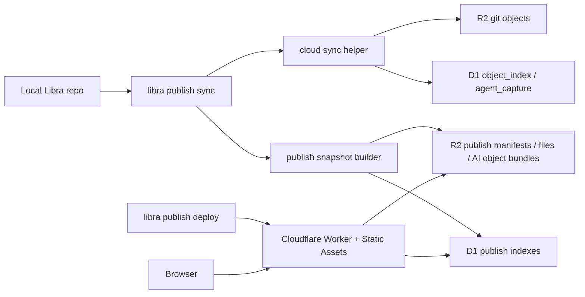

# Libra Publish 发布功能落地计划

## Review 修正摘要

本文档经过几轮修改后出现了范围膨胀和自相矛盾，已经按可执行 MVP 重新收敛。修正原则如下：

- v1 交付一个可发布、可浏览、只读的 Cloudflare Worker 页面，并同步交付一个可从 Cloudflare D1/R2 恢复完整仓库的 `libra clone libra+cloud://...` 路径；不交付 Git server、远程编辑、`publish` 子命令下载入口或本文未定义的扩展后台能力。
- Cloudflare 下载/恢复不作为 `libra publish` 的命令或参数设计；实现本 publish 方案时，必须同步完成 [clone.md](clone.md) 中新增的 Cloudflare source scheme（例如 `libra clone libra+cloud://<clone-domain>/<slug>`），让 `publish` 只负责发布展示，`clone` 负责恢复仓库。
- v1 必须发布所有本地分支和 tag：`libra publish sync` 默认提交 `refs/heads/*` 与 `refs/tags/*` 指向的所有可达发布快照；`--ref <branch|tag|full-ref>` 进入 v1 作为定向同步/调试入口，但不能替代完整发布验收。
- 不再要求“SQL 与代码一字不差”这种脆弱约束。改为提供单一 schema 源文件和一致性测试。
- Claude Design 前端设计包已经启动，v1 必须把前端实现纳入任务包：Next.js + React 前端要按设计产物实现 branch/tag 浏览、代码展示、AI object model 和发布状态视图。
- v1 的 “所有 AI 版本信息”以 [docs/agent/ai-object-model-reference.md](../agent/ai-object-model-reference.md) 为完整对象契约：snapshot objects、event objects 和 Libra projection/runtime objects 都必须发布；visibility 只决定字段级 redaction，不改变对象类型覆盖范围。
- Worker 随 Libra 分发：源码仓库根目录 `worker/` 是 Worker 模板来源，Libra release 必须把该模板作为 source-only 资源嵌入或打包；`libra publish init` 从该模板生成目标仓库根目录 `worker/`，不依赖用户本机存在 Libra 源码 checkout。

## Context

当前代码库已有 Cloudflare 备份基础：

- `libra cloud sync` 会把本地 `object_index` 中的 Git 对象上传到 R2，并把对象索引写入 D1。
- R2 Git 对象按 `repo_id` 隔离，路径形如 `{repo_id}/objects/aa/bb...`。
- D1 侧已有 `repositories`、`object_index`、`agent_session`、`agent_checkpoint` 表。
- `src/utils/d1_client.rs` 已提供 Cloudflare D1 REST API 客户端。
- `src/utils/storage/remote.rs` 已提供 Git object 专用 R2/S3 存储封装，但它会写入 Git zlib/header 格式，不适合直接存任意发布 JSON 或代码预览文件。
- 本地 `web/` 是 `libra code` loopback UI，不能直接公网发布。

Cloudflare 侧使用当前官方能力：

- Worker 通过 D1 binding 使用 prepared statements 读取 D1。
- Worker 通过 R2 bucket binding 读取 R2 对象。
- `worker/` 是根目录下的 Next.js + React 项目，通过 Cloudflare OpenNext adapter 部署到 Workers。
- OpenNext 生成的 Worker 负责 Next route handlers、server-side modules 和静态资源；D1/R2 读取只发生在服务端代码中。
- Wrangler 配置使用 `wrangler.jsonc`，包含 OpenNext `main` / `assets`、`d1_databases`、`r2_buckets`、`compatibility_flags: ["nodejs_compat"]` 和 observability。

参考文档：

- [Cloudflare D1 Worker Binding API](https://developers.cloudflare.com/d1/worker-api/)
- [Cloudflare D1 prepared statements](https://developers.cloudflare.com/d1/worker-api/prepared-statements/)
- [Cloudflare R2 Workers API](https://developers.cloudflare.com/r2/get-started/workers-api/)
- [Cloudflare Workers Static Assets binding](https://developers.cloudflare.com/workers/static-assets/binding/)
- [Cloudflare Workers routes and domains](https://developers.cloudflare.com/workers/configuration/routing/)
- [Cloudflare Workers custom domains](https://developers.cloudflare.com/workers/configuration/routing/custom-domains/)
- [Cloudflare Workers Next.js guide](https://developers.cloudflare.com/pages/framework-guides/nextjs/ssr/bindings/)
- [OpenNext Cloudflare bindings](https://opennext.js.org/cloudflare/bindings)
- [Wrangler configuration](https://developers.cloudflare.com/workers/wrangler/configuration/)
- [Cloudflare Access JWT validation](https://developers.cloudflare.com/cloudflare-one/access-controls/applications/http-apps/authorization-cookie/validating-json/)

## v1 目标

v1 要交付一个最小但完整的发布闭环：

1. 本地执行 `libra publish init`，生成本地发布配置和 Worker 项目骨架。
2. 本地执行 `libra publish sync`，把所有本地分支和 tag 的代码预览快照、refs metadata 和完整 AI object model 同步到 D1/R2。
3. 本地执行 `libra publish status`，确认本地 `refs/heads/*`、`refs/tags/*` 与 D1 published refs、R2 manifest 和 Worker 配置状态一致。
4. 本地执行 `libra publish deploy`，通过 Wrangler 部署只读 Worker 页面。
5. 浏览器访问 Worker 页面，能看到按 Claude Design 设计包实现的前端，并按 branch/tag 查看仓库目录、文件内容、发布 revision 元信息和 AI object model。
6. 开发者执行 `libra clone libra+cloud://<clone-domain>/<slug> [local_path]`，能从 Cloudflare D1/R2 恢复当前发布仓库的完整 Libra repo、所有已发布 branch/tag refs、Git objects、refs metadata 和完整 AI object model。

## v1 非目标

- 不实现 Git 协议层的 `clone` / `fetch` / `push` 服务；`libra+cloud://...` 是 Libra CLI 从 D1/R2 恢复本地仓库的特殊 source scheme，不是 Git remote protocol。
- 不发布 uncommitted 工作区内容。
- 不发布 remote-tracking refs（`refs/remotes/*`）作为一等页面入口；v1 只发布本地 branch refs（`refs/heads/*`）和 tag refs（`refs/tags/*`）。
- 不让 Worker 动态解析 Git 对象。
- 不发布未规范化、未 redacted 的 provider raw payload、环境变量、绝对本机路径或 secrets；AI 内容必须先落入 object model，再按 visibility 做字段级 redaction。
- 不复用本机 `libra code` Web UI。
- 不在 Worker 中保存 Cloudflare API token。
- 不自动配置 Cloudflare Access；Worker 只验证已有 Access JWT 并提供部署提示。
- 不实现本文未定义的导出、导入或搜索扩展；从 Cloudflare 恢复仓库由本计划的 Cloudflare clone source phase 承载。

## 核心决策

### 顶层命令

新增顶层命令，不塞进 `libra cloud`：

```bash
libra publish init
libra publish sync
libra publish status
libra publish deploy
libra publish unpublish
```

原因：

- `cloud` 是私有备份/恢复语义。
- `publish` 是对外只读展示语义，必须有独立安全预检、redaction、visibility 和部署流程。
- 仓库恢复/下载不是 `publish` 子命令。实现本方案时必须同步让 `libra clone` 的 `<remote_repo>` 位置参数支持 `libra+cloud://...`，而不是增加 `libra publish download`。

`unpublish` v1 只做安全下线：标记站点 disabled，撤销或提示撤销 Worker route，不删除 D1/R2 数据。删除云端数据不在本文范围内设计。

### 数据写入分层

同步分两层：

1. 复用 `cloud sync` helper，把 Git objects、refs metadata、agent capture 基线同步到 D1/R2。
2. 新增 publish snapshot builder，把可展示代码和完整 AI object model 物化为发布专用 D1/R2 结构。

Worker 只读取 publish 专用结构，不直接读取或解析 Git object zlib/header。

### Worker / Next / React 架构

`worker/` 使用 Next.js + React，并通过 `@opennextjs/cloudflare` 部署到 Cloudflare Workers。

项目边界：

- React Client Components 只负责 UI、交互状态和调用同源 `/api/*`。
- Next route handlers、Server Components 或 server-only modules 才能读取 Cloudflare bindings。
- 浏览器端不得直接接触 D1/R2 binding、R2 key、Cloudflare account id、API token 或 Access 配置。
- Worker API 是前端唯一数据入口；所有 D1/R2 读取都先经过输入校验、visibility/access 校验和 typed error mapping。

建议目录：

```text
worker/
  app/
    api/sites/[slug]/.../route.ts
    sites/[slug]/page.tsx
    sites/[slug]/[...path]/page.tsx
  components/
  lib/
    api-client.ts          # browser fetch wrapper
    server/
      cloudflare.ts        # getCloudflareContext wrapper
      d1.ts                # prepared D1 queries
      r2.ts                # R2 object reads
      response.ts          # typed JSON/error responses
  open-next.config.ts
  next.config.ts
  wrangler.jsonc
```

`wrangler.jsonc` 由 `libra publish init` 生成或 patch，核心配置形态：

```jsonc
{
  "$schema": "./node_modules/wrangler/config-schema.json",
  "name": "libra-publish",
  "main": ".open-next/worker.js",
  "compatibility_date": "2026-05-07",
  "compatibility_flags": ["nodejs_compat"],
  "assets": {
    "directory": ".open-next/assets",
    "binding": "ASSETS"
  },
  "d1_databases": [
    {
      "binding": "LIBRA_PUBLISH_DB",
      "database_name": "libra-publish",
      "database_id": "<d1-database-id>"
    }
  ],
  "r2_buckets": [
    {
      "binding": "LIBRA_PUBLISH_BUCKET",
      "bucket_name": "libra-publish"
    }
  ],
  "observability": {
    "enabled": true,
    "head_sampling_rate": 1
  }
}
```

Build/deploy scripts：

```json
{
  "scripts": {
    "dev": "next dev",
    "next:build": "next build",
    "preview": "pnpm build && opennextjs-cloudflare preview",
    "build": "pnpm cf-typegen && opennextjs-cloudflare build",
    "deploy": "pnpm build && opennextjs-cloudflare deploy",
    "cf-typegen": "wrangler types --env-interface CloudflareEnv cloudflare-env.d.ts"
  }
}
```

`wrangler types` 生成的 `CloudflareEnv` 是 binding 类型来源；不要手写漂移的 `Env` interface。`open-next.config.ts` 必须设置 OpenNext `buildCommand` 为 `pnpm next:build`，让外层 `pnpm build` 可以执行 `cf-typegen` 和 OpenNext build，同时避免 OpenNext 内部再次调用 `pnpm build` 造成递归。

### Worker 分发与打包

`worker/` 是 Libra 源码仓库中的 Worker 模板源码，也是前端和 Worker API 的开发目录。v1 分发必须满足：用户只安装 Libra CLI 后，也能在任意 Libra repo 中执行 `libra publish init` 生成根目录 `worker/` 项目，而不是要求用户下载 Libra 源码或手工复制前端包。

分发决策：

- Libra source distribution / crates.io package 必须包含 root `worker/` 的 source-only 文件：`app/`、`components/`、`lib/`、`public/`、`migrations/`、`package.json`、`pnpm-lock.yaml`、`next.config.*`、`open-next.config.*`、`playwright.config.*`、`wrangler.jsonc`、`tsconfig.json`、测试和必要静态资源。
- Libra binary release 必须嵌入同一份 Worker 模板 manifest 和文件内容；v1 可使用 `rust-embed` 或构建期生成的 manifest module，但运行时必须从二进制内置模板读取，不能依赖 sidecar archive、`CARGO_MANIFEST_DIR` 或相对源码路径。
- 模板只分发源码、配置、lockfile 和 migrations；不得包含 `worker/node_modules/`、`worker/.next/`、`worker/.open-next/`、`worker/.wrangler/`、`.turbo/`、`.next-types/`、`test-results/`、`playwright-report/`、coverage、日志、`.env*` 或 Cloudflare 凭据。
- Cargo build 只嵌入 Worker 模板文件，不执行 `pnpm --dir worker build`。Worker 的 Next/OpenNext build 只在 `libra publish deploy` 阶段运行，避免普通 CLI 安装和编译依赖 Cloudflare/Node 构建产物。
- `Cargo.toml` package include/exclude、`.gitignore` 和模板 manifest 的 exclude 规则必须一致；新增生成目录或敏感文件模式时，三处同步更新。

模板 manifest 至少记录：

```json
{
  "template_schema_version": 1,
  "template_version": "<libra-version-or-worker-template-version>",
  "files": [
    {
      "path": "worker/wrangler.jsonc",
      "sha256": "<source-template-sha256>",
      "mode": "0644",
      "render_policy": "managed-template"
    }
  ],
  "excluded_patterns": [
    "worker/node_modules/**",
    "worker/.next/**",
    "worker/.open-next/**",
    "worker/.wrangler/**",
    "worker/.next-types/**",
    "worker/test-results/**",
    "worker/playwright-report/**",
    "worker/.env*"
  ]
}
```

`libra publish init` 的物化规则：

- 目标目录固定为当前仓库根目录 `worker/`。
- 缺失文件直接从嵌入模板写入。
- v0.17.9 已落地的首版只写入缺失文件、对 byte-identical 模板文件 no-op，并在用户修改或 symlink 路径上 fail closed；manifest-aware patch/upgrade 仍是后续 `status/deploy` 切片的任务。
- 用户已修改的文件不得静默覆盖；后续只能更新 `LIBRA MANAGED` 标记块，或输出冲突和 diff 提示用户处理。
- `wrangler.jsonc`、`.dev.vars.example` 等环境相关文件使用模板变量渲染 `worker_name`、D1 database、R2 bucket、clone domain、visibility 和 Access 占位配置；禁止把 Cloudflare API token 写入模板文件。
- 物化后写入 `.libra/publish/worker-template-manifest.json`，记录已生成模板版本、文件 hash 和用户修改检测基线。

`libra publish status` 必须展示 Worker 模板状态：

- `missing`：目标仓库没有 `worker/`。
- `current`：目标 `worker/` 与当前 Libra 嵌入模板版本兼容。
- `modified`：存在用户修改，但不阻塞 deploy。
- `outdated`：模板版本低于当前 Libra，提示重新运行 `libra publish init`。
- `conflicted`：关键配置文件无法自动 patch，`publish deploy` 必须失败并提示处理。

`libra publish deploy` 只读取目标仓库根目录 `worker/`，并在 build 前检查模板状态、`worker/package.json`、`worker/pnpm-lock.yaml`、`worker/wrangler.jsonc` 和 `worker/migrations/0001_publish.sql`。缺失时提示运行 `libra publish init`，不得回退到旧嵌套目录或 Libra 源码目录。

### R2 任意对象封装

不要把任意 key 写入加到 `Storage` trait。该 trait 是 Git object abstraction。

新增 `src/utils/storage/publish_storage.rs`：

- 持有 `Arc<dyn ObjectStore>`。
- 使用 base prefix `{repo_id}/publish/sites/{site_id}/`。
- 提供 `put_json`、`get_json`、`put_bytes`、`get_bytes`、`head`。
- 所有 key 由 publish 模块构造并校验，禁止 `..`、空 segment 和绝对路径。

### Schema 单一来源

发布 schema 源文件放在：

```text
sql/publish/0001_publish.sql
```

落地要求：

- `D1Client::ensure_publish_schema()` 使用 `include_str!` 读取该 SQL，按 statement 顺序执行。
- `worker/migrations/0001_publish.sql` 是该文件的部署副本。
- 新增测试验证两个文件 byte-for-byte 一致。
- Worker 运行时不迁移 schema，只读 D1；迁移由 CLI/Wrangler deploy 阶段执行。

### ID 与站点模型

v1 简化为：

- 一个 Libra repo 默认对应一个 publish site。
- `site_id` 使用 `Uuid::new_v4()`，匹配当前代码常用方式。
- `slug` 是用户可读路径标识，可改名；在同一个 `clone_domain` 内唯一。
- R2 key 使用 `repo_id` + `site_id`，不使用 `slug`，避免 rename 后搬对象。

### Clone domain 方案

`libra+cloud://` 的 authority 不再直接等同于站点 `slug`。v1 使用 domain-qualified source，把“在哪里解析这个 Cloudflare 发布源”和“解析哪个站点”拆开：

```text
libra+cloud://<clone-domain>/<slug>
libra+cloud://<clone-domain>/repo/<repo_id>
libra+cloud://<clone-domain>/<slug>?ref=<branch|tag|full-ref>
libra+cloud://<clone-domain>/<slug>?revision=<oid|latest>
```

定义：

- `clone-domain` 是 clone source namespace 和信任边界，用于让 CLI 在本地 Cloudflare/Libra 配置中选择 D1 database、R2 bucket、account 和凭据。它通常等于 Worker 的公开 host，例如 `code.example.com` 或 `<worker>.<account>.workers.dev`，但语义上不是 Git remote，也不是下载 API。
- `slug` 是 clone-domain 下的站点路径段，只允许 URL-safe 单段值：`[a-z0-9][a-z0-9-]{0,62}`。不要使用 `org/repo` 这种带 `/` 的 slug；如需表达组织名，使用 `org-repo` 或 D1 中的 display name。
- `repo/<repo_id>` 是稳定机器入口，避免 slug rename 后脚本失效。
- `ref` 只决定 checkout 目标，不裁剪恢复的 refs 集合；默认 clone 恢复所有已发布 branch/tag refs，并 checkout default ref。
- `revision` 只接受 `latest` 或完整 object id；`ref` 和 `revision` 互斥。

示例：

```bash
libra clone libra+cloud://code.example.com/kepler-ledger
libra clone libra+cloud://code.example.com/repo/rp_8f4c1b
libra clone "libra+cloud://code.example.com/kepler-ledger?ref=refs/tags/v0.4.2"
libra clone "libra+cloud://code.example.com/kepler-ledger?revision=9a1f3e2c..."
```

解析流程：

1. `execute_clone()` 在普通 Git remote discovery 前解析 `libra+cloud://`。
2. 解析并规范化 `clone-domain`：lowercase，禁止 userinfo、port 和额外 path 注入，禁止空 label；`workers.dev` 和用户自有 custom domain/route 都允许。
3. CLI 在本地配置中查找 `clone_domains.<clone-domain>`，解析 `account_id`、D1 database、R2 bucket、region/endpoint 和凭据来源。找不到时返回 `CliInvalidArguments` 或配置类错误，并提示用户运行 publish/cloud 配置流程，而不是尝试访问 Worker 下载端点。
4. CLI 通过 D1 查询 `(clone_domain, slug)` 或 `(clone_domain, repo_id)` 对应的 `site_id`、`repo_id`、visibility、default ref 和 refs generation。
5. CLI 继续按 D1 `object_index`、`publish_refs`、refs metadata 和 R2 Git objects 恢复仓库。Worker 页面只展示 clone 命令和只读 API，不承担仓库恢复权限。

本地配置新增：

```text
publish.clone_domain        # 例如 code.example.com
publish.display_origin      # 例如 https://code.example.com，浏览器访问用
publish.slug                # 例如 kepler-ledger
cloud.clone_domains.<domain>.account_id
cloud.clone_domains.<domain>.d1_database_id
cloud.clone_domains.<domain>.r2_bucket
cloud.clone_domains.<domain>.credential_profile
```

D1 映射要求：

- `publish_sites` 增加 `clone_domain`，并对 `(clone_domain, slug)` 建唯一约束。
- `publish_sites.slug` 可改名；改名不搬 R2 对象，也不改变 `site_id` 或 `repo_id`。
- `publish_sites.clone_domain` 改变时，`libra publish status` 必须提示旧 clone URL 失效风险；`repo/<repo_id>` 入口仍可用于自动化迁移。
- UI 和 `publish deploy` 输出必须同时给出浏览 URL 与 clone URL，例如：

```text
Browse: https://code.example.com/sites/kepler-ledger
Clone:  libra clone libra+cloud://code.example.com/kepler-ledger
Stable: libra clone libra+cloud://code.example.com/repo/rp_8f4c1b
```

Cloudflare routing 说明：

- 生产发布推荐使用 Cloudflare Workers route 或 custom domain；`workers.dev` 可作为开发/预览默认值。
- `publish deploy` 可以读取/patch `wrangler.jsonc` 中的 `routes` 或 custom domain 配置，但 v1 不自动购买域名、不自动迁移 DNS，也不把 custom domain 当成权限边界。
- private visibility 仍由 Cloudflare Access JWT 校验保护 Worker 页面；clone 恢复仍依赖本地 Cloudflare/Libra 凭据，不因页面可访问而自动可恢复。

### Visibility

v1 支持两种 visibility：

- `public`：页面公开可读，AI object model 仍完整发布对象 envelope、类型、id、关系和可公开字段；敏感字段必须按 redaction policy 移除或替换。
- `private`：Worker 要求并验证 Cloudflare Access 注入的 `Cf-Access-Jwt-Assertion`。只检查 identity header 不安全，容易被直连 Worker URL 的请求伪造。

`publish deploy` 不自动创建 Access policy。自动配置 Access 需要额外 Cloudflare API 权限，不在本文范围内设计。v1 只生成 Wrangler 环境变量占位和部署提示；private 站点缺少 `CF_ACCESS_TEAM_DOMAIN` 或 `CF_ACCESS_AUD` 时 fail closed。

## 用户流程

### `libra publish init`

```bash
libra publish init --slug libra-demo --clone-domain code.example.com --visibility private
```

行为：

- 确认当前目录是 Libra repo。
- 复用或生成 `libra.repoid`。
- 写入 `ConfigKv`：
  - `publish.site_id`
  - `publish.slug`
  - `publish.clone_domain`
  - `publish.display_origin`
  - `publish.name`
  - `publish.visibility`
  - `publish.worker_name`
  - `publish.max_preview_bytes`
- 检查 D1/R2 配置是否可解析，但不要求连通性成功才能写本地配置。
- 从 Libra 二进制内置 Worker 模板生成根目录下的 `worker/` 项目骨架，已存在时按 manifest patch，不覆盖用户修改。

### `libra publish sync`

```bash
libra publish sync
libra publish sync --ref main
libra publish sync --ref v1.0.0
libra publish sync --dry-run
libra publish sync --ai-redaction strict
```

行为：

- 默认发布所有本地 branch 和 tag：扫描 `refs/heads/*` 与 `refs/tags/*`，按目标 revision 去重生成 snapshot，并为每个 ref 写入发布索引。
- `--ref <branch|tag|full-ref>` 进入 v1，只同步指定 ref，支持 branch/tag 简写和 `refs/heads/...`、`refs/tags/...` 完整 ref；若 branch 和 tag 同名，必须报 ambiguous ref 并提示使用完整 ref。
- 生产发布完成态以无 `--ref` 的完整 sync 为准；定向 `--ref` 适合修复、调试和局部 dry-run，不能让站点声明“所有分支/tag 已发布”。
- 工作区 dirty 时 warning；`--fail-on-dirty` 时失败。
- `--dry-run` 只做本地扫描和计划输出，不写 D1/R2。
- 运行安全预检：`.librapublishignore`、内置 deny 规则、二进制/大文件、secret-like 文件名。
- 调用 cloud sync helper 同步底层 Git objects 和 agent capture。
- 为每个唯一 revision 构建代码 manifest、文件预览内容、AI object bundle。
- 写入顺序：R2 文件和 AI object bundle -> D1 revision/files/ai object rows -> D1 refs rows -> CAS 更新 `publish_sites.latest_revision_oid` 和 refs generation。

`--ai-redaction` v1 只控制字段级 redaction，不改变 AI object model 的对象覆盖范围：

- `default`：默认，按 visibility 和内置敏感字段规则 redaction。
- `strict`：更保守地移除 prompt-like、tool payload-like、path-like 和 provider detail-like 字段，同时保留对象 envelope、关系和索引。

未 redacted 的 raw provider payload 不实现。

### `libra publish status`

展示：

- 本地 repo id、site id、slug、visibility。
- clone domain、display origin、当前生成的 clone URL 和 stable repo clone URL。
- 本地 branch/tag refs 与 D1 published refs 是否一致，包括新增、删除、移动和缺失 snapshot。
- 最近一次 sync run 状态、warning、file count、AI object count、AI bundle count。
- Worker project 是否存在、模板状态是否 current/modified/outdated/conflicted、Wrangler 配置是否包含 D1/R2/assets binding。

### `libra publish deploy`

行为：

- 运行 Worker 前端 build。
- 确认 Worker 模板状态不是 conflicted，并确认 `worker/wrangler.jsonc` 的 D1/R2/assets binding。
- 应用 D1 migrations。
- 调用 `wrangler deploy`。
- 输出浏览 URL、domain-qualified clone URL 和 stable repo clone URL。

`deploy` 失败必须保留本地和云端 publish data，不回滚 `sync`。

## 架构



## 模块边界

| 模块 | 职责 |
|------|------|
| `src/command/publish.rs` | CLI 参数、执行/渲染拆分、错误码映射 |
| `src/command/cloud.rs` | 抽出结构化 cloud sync helper，保留原命令输出兼容 |
| `src/internal/publish/` | 发布配置、preflight、snapshot builder、AI export、manifest |
| `src/utils/storage/publish_storage.rs` | R2 任意 publish object 读写 |
| `src/utils/d1_client.rs` | publish schema ensure、upsert、list/query 方法 |
| `sql/publish/0001_publish.sql` | publish D1 schema 源文件 |
| `src/internal/publish/worker_template.rs` | 嵌入 Worker 模板、manifest 校验、`publish init` 物化和 patch 规则 |
| `worker/` | Next.js + React 前端、Worker API route handlers、OpenNext 配置、Wrangler 配置、D1 migration 副本和 source-only 分发模板 |
| `tests/data/publish/` | 跨 Rust/Worker 的契约 fixture |

## D1 数据模型

v1 表：

| 表 | 主键 | 用途 |
|----|------|------|
| `publish_sites` | `site_id` | 站点配置，关联 repo、clone domain、slug、visibility、enabled 状态、latest revision |
| `publish_revisions` | `(site_id, revision_oid)` | 一次发布快照 |
| `publish_refs` | `(site_id, ref_name)` | 已发布 branch/tag ref 到 revision 的映射 |
| `publish_files` | `(site_id, revision_oid, path)` | 目录树和文件预览索引 |
| `publish_ai_objects` | `(site_id, revision_oid, object_type, object_id)` | [AI object model](../agent/ai-object-model-reference.md) 对象索引 |
| `publish_ai_versions` | `(site_id, ai_version_id)` | AI object bundle 版本索引，聚合一次 revision 下的对象集合 |
| `publish_sync_runs` | `sync_run_id` | 同步审计和失败记录 |

字段要求：

- 所有表必须包含 `site_id`。
- `publish_sites.status` 至少支持 `active`、`disabled`；disabled 站点的 Worker API 返回 410。
- `publish_sites.clone_domain` 保存规范化后的 clone namespace；`(clone_domain, slug)` 必须唯一。
- `publish_sites.display_origin` 保存浏览器访问 origin，例如 `https://code.example.com` 或 `https://<worker>.<account>.workers.dev`；它可以等于 clone domain 的 HTTPS origin，但不能被 CLI 当作下载端点。
- `publish_sites.latest_revision_oid` 指向默认 ref 在最近一次完整 sync 中的 published revision；默认 ref 优先使用当前 HEAD 指向的 branch，其次使用配置的 `publish.default_ref`。
- `publish_refs.ref_name` 只允许 `refs/heads/*` 和 `refs/tags/*`；短名只用于 CLI/UI 展示，D1 内必须存完整 ref name。
- `publish_refs` 至少包含 `ref_type`（`branch` / `tag`）、`target_oid`、`revision_oid`、`is_default`、`updated_at`、`sync_run_id`。
- annotated tag 的 `target_oid` 保存 tag object，`revision_oid` 保存 peel 后用于生成 snapshot 的 commit oid；轻量 tag 两者可相同。
- `publish_files.r2_key` 对 `binary`、`too_large`、`ignored` 可以为空。
- `publish_ai_objects.object_type` 必须覆盖 `Intent`、`Plan`、`Task`、`Run`、`PatchSet`、`ContextSnapshot`、`Provenance`、`IntentEvent`、`TaskEvent`、`RunEvent`、`PlanStepEvent`、`RunUsage`、`ToolInvocation`、`Evidence`、`Decision`、`ContextFrame`、`Thread`、`Scheduler`、`QueryIndex`、`LiveContextWindow`、`ReadyQueue`、`ParallelGroup`、`Checkpoint`、`RetryRoute` 和 `UiCurrentView`。
- `publish_ai_objects.layer` 至少支持 `snapshot`、`event`、`projection`；`r2_key` 指向 redacted 后的规范化对象 JSON。
- `publish_ai_versions.bundle_key` 指向 R2 JSON bundle，bundle 内必须包含对象清单、关系图索引和 redaction manifest。
- `publish_revisions.status` 至少支持 `syncing`、`published`、`failed`。
- `publish_revisions` 按 revision oid 去重；多个 branch/tag 指向同一个 commit 时共享同一套 snapshot。

一致性要求：

- D1 写入不能让页面读到半成品。
- 每个新 revision 先以 `syncing` 写入。
- 所有 R2 对象和 D1 子表写完后，把相关 revision 改为 `published`。
- 完整 sync 最后在同一事务中更新 `publish_refs`、ref 删除标记、`publish_sites.latest_revision_oid` 和 refs generation。
- `--ref` 定向 sync 只更新目标 ref 与其 revision，不删除其他云端 refs，也不能推进“完整 refs 已同步”的 generation。
- 失败时写 `publish_sync_runs.status = failed`，不更新 refs generation，不让页面读到部分新 refs。

## R2 对象布局

现有 Git object 布局不变：

```text
{repo_id}/objects/aa/bb...
{repo_id}/metadata.json
```

新增 publish 布局：

```text
{repo_id}/publish/sites/{site_id}/latest.json
{repo_id}/publish/sites/{site_id}/refs.json
{repo_id}/publish/sites/{site_id}/revisions/{revision_oid}/code-manifest.json
{repo_id}/publish/sites/{site_id}/revisions/{revision_oid}/files/{content_sha256}.txt
{repo_id}/publish/sites/{site_id}/revisions/{revision_oid}/ai/index.json
{repo_id}/publish/sites/{site_id}/revisions/{revision_oid}/ai/objects/{layer}/{object_type}/{object_id}.json
{repo_id}/publish/sites/{site_id}/revisions/{revision_oid}/ai/bundles/{ai_version_id}.json
{repo_id}/publish/sites/{site_id}/sync-runs/{sync_run_id}.json
```

文件规则：

- 文本文件必须是 UTF-8。
- 二进制、非 UTF-8 和超过 `publish.max_preview_bytes` 的文件不写内容，只写 metadata。
- R2 content key 使用 sha256，不使用原始 path。
- manifest 保存原始 path、display mode、content sha256、R2 key、size、language。

## AI Object Model 同步策略

v1 的 AI 发布范围以 [AI Object Model Reference](../agent/ai-object-model-reference.md) 为准，必须覆盖全部对象层：

- snapshot objects：`Intent`、`Plan`、`Task`、`Run`、`PatchSet`、`ContextSnapshot`、`Provenance`。
- event objects：`IntentEvent`、`TaskEvent`、`RunEvent`、`PlanStepEvent`、`RunUsage`、`ToolInvocation`、`Evidence`、`Decision`、`ContextFrame`。
- Libra projection/runtime objects：`Thread`、`Scheduler`、UI-facing current view、query indexes / reverse indexes、live context window、ready queue、parallel groups、checkpoints、retry routing。

发布规则：

- AI exporter 必须优先导出规范化 object model，而不是 `agent_session` / `agent_checkpoint` 的摘要视图。
- `agent_session`、`agent_checkpoint` 和 provider runtime 数据只能作为对象重建来源；发布结果必须落成上述对象类型、关系和索引。
- projection loss 不能阻断发布：缺失或过期的 `Thread`、`Scheduler`、query index 必须按 reference 中的 rebuild/read contract 从 snapshot/event history 重建，或在 sync run 中记录明确失败原因。
- public/private 都必须保留对象 envelope、`objectType`、`objectId`、`layer`、关系边、revision/source 指针和 redaction manifest；visibility 只影响字段级 redaction。
- provider 原始 session payload 不作为 AI object model 的一部分发布，除非已经被规范化成 `ToolInvocation`、`Evidence`、`ContextFrame` 等对象，并通过 redaction policy。

每个 AI object JSON 必须包含：

- `schemaVersion`
- `objectType`
- `objectId`
- `layer`
- `revisionOid`
- `sourceRefs`
- `relationships`
- `payload`
- `redaction.mode`
- `redaction.rulesVersion`
- `removedFields`

每个 AI bundle 必须包含：

- `schemaVersion`
- `aiObjectModelReference`：固定指向 `docs/agent/ai-object-model-reference.md`
- `objects`：按 `layer/objectType/objectId` 列出的对象清单和 R2 key
- `relationships`：对象关系图索引
- `indexes`：thread、intent、plan、task、run、patchset、event、context 的查询索引
- `redaction`：mode、rulesVersion、removedFields 统计
- 关联 ids：`sessionId`、`checkpointId`、`threadId`、`treeOid`、`tracesCommit`

## Worker API

所有 API 只读。

### D1 / R2 读取方案

Cloudflare Worker 不通过 Cloudflare REST API 读取 D1/R2；只能使用部署时注入的 bindings：

- D1 binding：`LIBRA_PUBLISH_DB`
- R2 bucket binding：`LIBRA_PUBLISH_BUCKET`

Next route handler 中通过 OpenNext Cloudflare context 获取 bindings：

```ts
import { getCloudflareContext } from "@opennextjs/cloudflare";

export function getBindings() {
  const { env } = getCloudflareContext();
  return {
    db: env.LIBRA_PUBLISH_DB,
    bucket: env.LIBRA_PUBLISH_BUCKET,
  };
}
```

D1 读取规则：

- 只使用 `prepare(...).bind(...)`，禁止把 URL 参数拼进 SQL 字符串。
- D1 只存站点、refs、revision、file metadata、AI object index、R2 key 和状态字段。
- list 接口必须分页，`limit` 有上限，cursor 必须由服务端生成或验证。
- `slug`、`ref`、`revision`、`path`、`objectType`、`objectId` 都必须先解析成 D1 记录，再进入 R2 读取。

示例：

```ts
type SiteRow = {
  site_id: string;
  repo_id: string;
  visibility: "public" | "private";
  status: "active" | "disabled";
  latest_revision_oid: string | null;
};

export async function findSite(slug: string) {
  const { db } = getBindings();
  return db
    .prepare(
      `SELECT site_id, repo_id, visibility, status, latest_revision_oid
       FROM publish_sites
       WHERE slug = ?`
    )
    .bind(slug)
    .first<SiteRow>();
}
```

R2 读取规则：

- R2 key 只能来自 D1 中已发布记录的 `r2_key` / `bundle_key`，不能直接使用 URL 参数。
- R2 miss 返回 typed 404，并且响应中不暴露 bucket name 或内部 key。
- 代码预览内容受 `publish.max_preview_bytes` 限制，可以读取为 text；大对象和未知大小对象必须走 streaming 或分页索引。
- JSON object 读取必须先检查 object 是否存在，再解析，并把解析错误映射为 `PublishCorruptObject` 类错误。

示例：

```ts
type PublishedFileRow = {
  display_mode: "text" | "binary" | "too_large" | "ignored";
  r2_key: string | null;
  content_type: string | null;
};

export async function readPublishedTextFile(row: PublishedFileRow) {
  if (row.display_mode !== "text" || !row.r2_key) {
    return { kind: row.display_mode };
  }

  const { bucket } = getBindings();
  const object = await bucket.get(row.r2_key);
  if (!object) {
    throw new PublishApiError("R2_OBJECT_MISSING", 404);
  }

  return {
    kind: "text" as const,
    contentType: row.content_type ?? "text/plain; charset=utf-8",
    body: await object.text(),
  };
}
```

API 请求流：

```text
Browser React component
  -> fetch("/api/sites/:slug/file?ref=main&path=README.md")
  -> Next route handler
  -> validate input
  -> verify Cloudflare Access when private
  -> D1 prepared query resolves site/ref/file metadata
  -> R2 get using D1-owned r2_key
  -> typed JSON response
```

| Endpoint | 用途 | Cache |
|----------|------|-------|
| `GET /api/sites/:slug` | 站点元信息、default ref 和 latest revision | `no-store` |
| `GET /api/sites/:slug/refs?type=branch|tag` | 已发布 branch/tag refs 列表 | short cache + ETag |
| `GET /api/sites/:slug/revisions?limit&cursor` | revision 列表 | short cache + ETag |
| `GET /api/sites/:slug/tree?ref=<ref>&revision=<oid>&path=<path>` | 目录树；`ref` 和 `revision` 二选一 | revision-scoped long cache |
| `GET /api/sites/:slug/file?ref=<ref>&revision=<oid>&path=<path>` | 文件内容或 metadata；`ref` 和 `revision` 二选一 | revision-scoped long cache |
| `GET /api/sites/:slug/ai/versions?ref&revision&limit&cursor` | AI object bundle 版本列表 | short cache + ETag |
| `GET /api/sites/:slug/ai/versions/:id` | AI object bundle 详情、对象清单和关系图索引 | revision-scoped long cache |
| `GET /api/sites/:slug/ai/objects?ref&revision&type&layer&limit&cursor` | AI object model 对象列表 | revision-scoped long cache |
| `GET /api/sites/:slug/ai/objects/:type/:id?ref&revision` | 单个 AI object JSON | revision-scoped long cache |
| `GET /api/sites/:slug/ai/graph?ref&revision&rootType&rootId` | AI object 关系图切片 | revision-scoped long cache |
| `GET /api/sites/:slug/status` | 最近 sync 状态 | `no-store` |

Worker 规则：

- D1 查询必须使用 prepared statement + bind 参数。
- R2 miss 返回 typed 404，不泄漏 bucket key。
- API 错误统一为 `{ "ok": false, "code": "...", "message": "...", "detail": ... }`。
- `ref` 查询参数接受完整 ref name 或唯一短名；branch/tag 同名时返回 409 ambiguous ref，提示使用 `refs/heads/...` 或 `refs/tags/...`。
- public 站点返回完整 AI object model 的对象 envelope、关系和可公开字段；敏感字段必须按 redaction manifest 移除或替换。
- private 站点要求 `Cf-Access-Jwt-Assertion`，并用 `CF_ACCESS_TEAM_DOMAIN` + `CF_ACCESS_AUD` 校验 issuer、audience 和 signature，否则 403。
- disabled 站点返回 410，不读取 R2 bundle。
- 非 `/api/*` 请求交给 OpenNext 生成的 Next.js route/static assets 处理。

## `.librapublishignore`

v1 使用 gitignore 子集：

- 支持空行、注释、glob、目录后缀 `/`、否定 `!pattern`。
- 不支持嵌套 include。
- 默认 deny 规则优先级高于用户 allowlist，除非用户显式传 `--allow-sensitive-path <path>` 且 visibility 为 private。

内置 deny 规则至少包括：

- `.env`, `.env.*`
- `*.pem`, `*.key`, `id_rsa`, `id_ed25519`
- `*token*`, `*secret*`, `*credential*`
- `.libra/config.db`
- `.git/`
- Cloud provider credential files

## 分阶段实施

### Phase 0：契约和 schema 基线

**Description:** 建立 publish 的最小契约，让 Rust CLI、D1 schema、Worker API 和 fixture 有共同基准。

**Acceptance criteria:**

- [x] (v0.17.10) 新增 `docs/commands/publish.md` 草案。
- [x] (v0.17.10) 新增 `sql/publish/0001_publish.sql`。
- [x] (v0.17.10) 新增 `worker/migrations/0001_publish.sql`，并有测试验证与源 SQL 一致。
- [x] (v0.17.10) 新增 publish JSON fixture：site、refs、revision、manifest、file metadata、AI objects、AI bundle、AI graph、sync run。
- [x] (v0.17.10) 新增 Rust serde contract 类型或测试 fixture 解析路径。

**Verification:**

- [x] `cargo test publish_schema_contract`
- [x] `cargo test publish_contract_round_trip`

**Dependencies:** None

**Estimated scope:** M

### Phase 1：抽出 cloud sync helper

**Description:** 让 publish 能复用 `libra cloud sync` 的对象同步能力，同时不破坏 `cloud sync` 现有人类输出。

**Acceptance criteria:**

- [x] (v0.17.10) `src/command/cloud.rs` 新增结构化 helper，例如 `run_cloud_sync(ctx) -> CloudSyncReport`。
- [x] (v0.17.10) `execute_sync()` 只负责调用 helper 和渲染现有输出。
- [x] (v0.17.10) helper 返回对象数量、失败数量、metadata 状态、agent capture 状态。
- [x] (v0.17.10) helper 不直接 `println!`。
- [x] (v0.17.10) 现有 cloud 测试和文档输出不回归。

**Verification:**

- [x] `cargo test --test cloud_storage_backup_test`
- [x] `cargo test --test command_test cloud`

**Dependencies:** Phase 0

**Estimated scope:** M

### Phase 2：publish storage 和 D1 client

**Description:** 增加 publish 专用 R2 arbitrary object wrapper 和 D1 publish query/upsert 方法。

**Acceptance criteria:**

- [x] (v0.17.10) 新增 `src/utils/storage/publish_storage.rs`。
- [x] (v0.17.10) `PublishStorage` 支持 JSON 和 bytes round-trip，key 有路径安全校验。
- [x] (v0.17.10) `D1Client::ensure_publish_schema()` 能执行 `sql/publish/0001_publish.sql`。
- [x] (v0.17.10) `D1Client` 增加 upsert/list 方法：site、revision、files、AI objects、AI versions、sync runs。
- [x] (v0.17.10) 所有新增错误都有可读 context，不使用生产路径 `unwrap()` / `expect()`。

**Verification:**

- [x] `cargo test publish_storage`
- [x] `cargo test publish_migration`
- [x] `cargo clippy --all-targets --all-features -- -D warnings`

**Dependencies:** Phase 0

**Estimated scope:** M

### Phase 3：snapshot builder 和 AI object model exporter

**Description:** 从所有本地 branch/tag 指向的唯一 revision 生成代码 manifest、文件预览和完整 AI object model bundle。

**Acceptance criteria:**

- [x] (v0.17.53 dry-run planner) `sync --dry-run` 扫描 `refs/heads/*` 和 `refs/tags/*`，解析每个 ref 的目标 revision，并按 revision oid 去重；完整 upload 路径仍由本 Phase 后续 snapshot/upload 项承载。
- [x] (v0.17.53 dry-run planner) `sync --dry-run --ref <branch|tag|full-ref>` 支持定向解析；branch/tag 短名冲突时失败并提示使用完整 ref。非 dry-run 的定向同步仍归 Phase 4 未完成项。
- [x] (v0.17.54) `sync --dry-run` 读取每个 planned revision 中已提交的 `.librapublishignore`，并应用内置 deny 规则；命中项以 warning 输出路径和 `builtin_credential` / `user_ignore` reason。
- [x] (v0.17.120) 非 dry-run snapshot upload 路径读取 committed `.librapublishignore` 和内置 deny 规则；public site 拒绝 `--allow-sensitive-path`，private site 精确 allowlist，命中 deny 的文件保持 metadata-only D1 rows。
- [x] (v0.17.113) `Preflight::for_visibility()` 拒绝 public site 使用 `--allow-sensitive-path`，并只在 private site 精确匹配 repo-relative allowlist path；完整 snapshot upload 仍由上方未完成项承载。
- [x] (v0.17.114) `build_revision_artifact_plan()` 生成单 revision 的 `code-manifest.json` payload、文本 R2 blob 上传清单，并将 binary、too-large、ignored path 保持为 metadata-only；完整非 dry-run sync/D1 写入仍由后续 Phase 4 项承载。
- [x] (v0.17.115) `publish sync` 命令层可从 committed revision tree materialize repo-relative path + blob bytes 为 `RevisionFileInput`，供后续非 dry-run sync 写入 artifact/D1/R2。
- [x] (v0.17.116) `upload_revision_artifacts()` 将单 revision 的 `code-manifest.json` 和文本预览 blob 写入 `PublishStorage`，并保持 binary、too-large、ignored path 不产生 R2 blob；D1 `publish_files` metadata rows 仍由后续 sync sink 承载。
- [x] (v0.17.118) `build_revision_d1_rows()` 为单 revision 生成 `publish_revisions` 和 `publish_files` rows；text rows 保留 `content_sha256`/`r2_key`，binary、too-large、ignored rows 保持 metadata-only。
- [x] (v0.17.120) 非 dry-run `publish sync` 对每个唯一 revision 上传文本预览和 `code-manifest.json` 到 R2，并将 binary、too_large、ignored 文件写为 D1 metadata-only `publish_files` rows。
- [x] (v0.17.111) `SnapshotPlan::to_refs_index()` 生成 `refs.json` payload 和 R2 key；完整 sync upload 仍由后续非 dry-run sync 项承载。
- [x] (v0.17.119) `build_site_index_artifacts()` 从全量 `SnapshotPlan` 生成 `publish_refs` rows、`refs.json` 和 `latest.json` payload，并可写入 `PublishStorage`；实际 D1 upsert/CAS 仍由后续 sync sink 承载。
- [x] (v0.17.120) 全量非 dry-run `publish sync` 上传 `refs.json`、`latest.json`，并为每个唯一 revision 上传 `code-manifest.json`。
- [x] (v0.17.124) `upload_ai_export_artifacts()` 可将 `AiExportPlan` 写入 `ai/index.json`、AI object JSON、AI graph index 和 AI bundle，并生成 `publish_ai_objects` / `publish_ai_versions` D1 rows；重复调用默认跳过已存在对象，`--force` 可重写。
- [x] (v0.17.126) `publish sync` orchestration 对每个唯一 revision 调用 AI export planner，生成并上传 `ai/index.json`、AI object JSON、AI graph index 和 AI bundle，并写入 `publish_ai_objects` / `publish_ai_versions` rows 与 revision/sync-run 计数；默认 planner 暂时输出空 AI bundle，完整对象来源覆盖见下方未完成项。
- [ ] AI exporter 覆盖 [AI Object Model Reference](../agent/ai-object-model-reference.md) 的全部 snapshot objects、event objects 和 Libra projection/runtime objects。
- [ ] projection/runtime 对象缺失时，按 reference 的 rebuild/read contract 从 snapshot/event history 重建；无法重建时 sync 失败并记录缺失对象类型。
- [x] (v0.17.110) redaction manifest 覆盖对象级和字段级 redaction，包含 `removedFields`、`rulesVersion`、object counts 和 type counts。

**Verification:**

- [x] (v0.17.97) `cargo test publish_snapshot_test`
- [x] (v0.17.98) `cargo test publish_preflight_test`
- [x] (v0.17.99) `cargo test publish_ai_object_model_contract_test`
- [x] (v0.17.100) `cargo test publish_ai_export_test`

**Dependencies:** Phase 1, Phase 2

**Estimated scope:** L，建议拆为 code snapshot 和 AI export 两个 PR

### Phase 4：`libra publish sync/status`

**Description:** 先提供可用的数据发布链路，不等待 Worker UI。

**Acceptance criteria:**

- [x] (v0.17.120) `src/command/publish.rs` 新增 `status`、离线 `sync --dry-run` 和首个非 dry-run D1/R2 code snapshot sync 路径。
- [x] (v0.17.51) 顶层 CLI 注册 `Publish` 命令。
- [x] (v0.17.53) `sync --dry-run` 默认规划所有本地 branch/tag refs；`sync --ref` 只做定向规划，并在 JSON 中标记不会更新完整 refs generation。
- [x] (v0.17.121) `sync` 非 dry-run 默认发布所有本地 branch/tag refs，通过 CAS 推进完整 refs generation，并在 CAS 成功后删除同 site 下旧 sync run 遗留的 stale `publish_refs`；`sync --ref` 只写目标 ref/revision，不上传 `refs.json`/`latest.json`，也不更新完整 refs generation。
- [x] (v0.17.53) `sync --dry-run` 不写 D1/R2，也不创建 `.libra/publish` 本地发布状态。
- [x] (v0.17.53) `sync --dry-run --json` 输出 site id、refs count、revision count、default ref、latest revision oid、file count、AI object count、AI bundle count、warnings。
- [x] (v0.17.95) `status --json` 能对比本地 branch/tag refs 和 D1 published refs。
- [x] (v0.17.53) dirty 工作区 warning 和 `--fail-on-dirty` 语义有测试。

**Verification:**

- [x] (v0.17.94) `cargo test --test command_test publish`
- [x] (v0.17.94) `cargo test publish`

**Dependencies:** Phase 3

**Estimated scope:** M

### Phase 5：Cloudflare clone source scheme

**Description:** 按本文 clone domain 方案和 [clone.md](clone.md) 中新增的 Cloudflare D1/R2 source scheme，实现 `libra clone libra+cloud://<clone-domain>/<slug>` 从云端恢复完整本地 Libra 仓库。该 phase 是 publish 交付的一部分，但 CLI 入口归属 `clone`，不得新增 `libra publish download`。

**Acceptance criteria:**

- [x] (v0.17.52) `src/command/clone.rs` 在 remote discovery 前识别并校验 `libra+cloud://<clone-domain>/<slug>`、`libra+cloud://<clone-domain>/repo/<repo_id>`、`?ref=<branch|tag|full-ref>` 和 `?revision=<oid|latest>`；完整 D1/R2 restore 仍返回 Phase 5 not-implemented。
- [x] (v0.17.52) scheme parser 对非法 clone domain、非法 slug/repo_id、非法 ref、非法 revision、缺失 slug/repo_id、`ref` 与 `revision` 同时出现返回 `CliInvalidArguments`，并给出可行动 hint；非 `libra+cloud://` scheme 仍归普通 clone remote 解析。
- [x] (v0.17.77) scheme parser 保留后续 restore 需要的 target selector：`Slug(<slug>)`、`RepoId(<repo_id>)`、可选 `Ref(<ref>)` / `Revision(<oid|latest>)`，避免只校验 URL 但丢弃 D1 lookup 输入。
- [x] (v0.17.55) Cloudflare clone 在 restore stub 前检查 `cloud.clone_domains.<clone-domain>.account_id`、`.d1_database_id`、`.r2_bucket`；未配置该 domain 时返回 `LBR-AUTH-001`，提示配置 keys，并且不创建目标目录。
- [x] (v0.17.78) Cloudflare clone 复用 cascaded local/global config 读取 `cloud.clone_domains.<clone-domain>.account_id`、`.d1_database_id`、`.r2_bucket` 和可选 `.credential_profile`，配置存在后进入 D1/R2 restore stub 并在结构化错误中保留已解析的 D1/R2 参数。
- [x] (v0.17.109) 通过 D1 用 `(clone_domain, slug)` 或 `(clone_domain, repo_id)` 解析 site；slug rename 不影响 `repo/<repo_id>` 稳定入口。
- [x] (v0.17.125) Cloudflare clone restore stub 前通过 D1 解析 `repositories`、`publish_refs`、default/latest/指定 ref 或 revision、`publish_revisions` 和 `object_index` 基线；branch/tag 短名冲突要求完整 ref。
- [ ] 通过 R2 校验并读取完整 Git object 集合；refs metadata 仍需接入实际本地 restore 写入。
- [ ] 使用 `run_init()` 初始化本地仓库，再恢复 objects、refs、HEAD、remote config，并完成 non-bare checkout。
- [ ] 缺失 R2 object、refs metadata 不完整或 checkout 失败时，命令必须失败并清理本次 clone 创建的目标目录，不得输出成功。
- [ ] 恢复完整 AI object model 到本地 AI 版本索引和 projection/query indexes；不得从 redaction 后的 publish payload 反推被移除字段。
- [x] (v0.17.56) `--branch`、`--depth`、`--single-branch`、`--bare` 与 `libra+cloud://` 的首版兼容策略按 [clone.md](clone.md) 执行：这些首版未支持组合在 clone-domain config 读取和目标目录创建前返回 `LBR-CLI-002`，不得静默降级。
- [ ] `--json` / `--machine` 输出仍只有一个 clone envelope；Cloudflare 字段使用可选加法字段，不破坏普通 Git clone schema。
- [x] (v0.17.112) publish 实现完成前，Cloudflare clone source 的测试必须纳入同一交付检查，不能移出 v1 范围。

**Verification:**

- [x] (v0.17.102) `cargo test cloud_clone_source_parse_test`
- [x] (v0.17.101) `cargo test cloud_clone_domain_resolve_test`
- [ ] `cargo test cloud_clone_restore_test`
- [x] (v0.17.102) `cargo test --test command_test clone_cloud`
- [x] (v0.17.105) `cargo test --test command_test publish`

**Dependencies:** Phase 1, Phase 2, Phase 4, and the clone output/error baseline in [clone.md](clone.md)

**Estimated scope:** L，建议独立 PR，但必须在 publish 功能宣布完成前合入

### Phase 6：Worker API

**Description:** 实现 Next route handlers / Worker 只读 API，先让发布数据可通过 Cloudflare bindings 从 D1/R2 读回。

**Acceptance criteria:**

- [x] (v0.17.11) 新建根目录 `worker/` Next.js + React + TypeScript 项目，并接入 `@opennextjs/cloudflare`。
- [x] (v0.17.11) `wrangler.jsonc` 包含 OpenNext `main` / `assets`、D1/R2 bindings、`nodejs_compat` 和 observability。
- [x] (v0.17.57) 运行 `wrangler types --env-interface CloudflareEnv cloudflare-env.d.ts`，服务端代码使用生成类型：`worker/tsconfig.json` 不再引用 `@cloudflare/workers-types`，`worker/env.d.ts` 只为 Wrangler 不生成的 Cloudflare Access secrets 做最小 augmentation。
- [x] (v0.17.11) 新增 Worker 模板 manifest，确认 root `worker/` source-only 文件能被 Libra package/binary 嵌入，且生成目录、`.env*` 和凭据文件被排除。
- [x] (v0.17.11) server-only helper 通过 `getCloudflareContext()` 读取 `LIBRA_PUBLISH_DB` 和 `LIBRA_PUBLISH_BUCKET`。
- [x] (v0.17.11) API endpoints 按本文 Worker API 表实现。
- [x] (v0.17.11) Worker API 支持 refs 列表，以及按 `ref` 或 `revision` 浏览 tree/file；同名 branch/tag 必须返回 ambiguous ref 错误。
- [x] (v0.17.11) Worker API 支持 AI object list/detail/graph 查询，并按 object type、layer、revision/ref 分页过滤。
- [x] (v0.17.11) 所有 SQL 使用 prepared statement。
- [x] (v0.17.11) 所有 R2 key 都来自 D1 published rows，禁止从 URL 参数直接拼接 R2 key。
- [x] (v0.17.11) React client components 只能调用 `/api/*`，不得导入 server-only binding helper。
- [x] (v0.17.11) private visibility 缺少或无法验证 `Cf-Access-Jwt-Assertion` 时返回 403。
- [x] (v0.17.11) disabled site 返回 410，不读取 R2 bundle。
- [x] (v0.17.11) FakeD1/FakeR2 route fixture 能通过 API round-trip。
- [x] (v0.17.93) Miniflare D1/R2 fixture round-trip 使用专用 workers-pool Vitest config 覆盖 site、refs、tree、file、AI versions、AI objects 和 AI graph。

**Verification:**

- [x] (v0.17.57) `pnpm --dir worker install`
- [x] (v0.17.14) `pnpm --dir worker lint`
- [x] (v0.17.57) `pnpm --dir worker cf-typegen`
- [x] (v0.17.14) `pnpm --dir worker test`
- [x] (v0.17.14) `pnpm --dir worker exec tsc --noEmit`
- [x] (v0.17.9) `cargo test --test publish_worker_template_embed_test`
- [x] (v0.17.60) `cargo package --allow-dirty --list | rg '^worker/(app|components|lib|public|migrations|package.json|pnpm-lock.yaml|next.config|open-next.config|playwright.config|wrangler.jsonc|tsconfig.json)'`

**Dependencies:** Phase 0, Phase 2

**Estimated scope:** M

### Phase 7：Claude Design 前端实现和 deploy/init

**Description:** 将 Claude Design 已启动的前端设计包落地为 Next.js + React on Cloudflare Workers，并把 `init/deploy` 接入 Wrangler/OpenNext。前端实现是 v1 必交付任务包，不作为验收后的补充工作。

**Acceptance criteria:**

- [ ] 接收 Claude Design 设计产物，并在根目录 `worker/` 中落地路由、组件、样式、状态和静态资源；实现偏差必须记录在 PR 说明中。
- [x] (v0.17.9) `libra publish init` 从 Libra 嵌入模板生成目标仓库根目录 `worker/`，不依赖 Libra 源码 checkout；当前实现写入缺失文件、保留 byte-identical 文件，遇到用户修改或 symlink 路径 fail closed，不覆盖，并写入 `.libra/publish/worker-template-manifest.json`。
- [x] (v0.17.51) `libra publish status` 展示本地 Worker 模板 `missing/current/modified/outdated/conflicted` 状态；完整云端 sync/status 对比仍归 Phase 4。
- [x] (v0.17.14) Next.js + React 前端能展示 repo、branch/tag 切换、tree、file viewer、AI object model 浏览、AI versions list/detail、sync status 和 visibility 状态。
- [x] (v0.17.60) 长路径、空仓库、无 AI 数据、binary/too_large 文件都有空态。
- [x] (v0.17.14) 前端通过 Worker API client 读取真实 API/fixture，不保留 mock-only 数据路径。
- [x] (v0.17.60) 桌面和移动视口都通过截图或 e2e 断言验证主要页面无文本溢出、遮挡和不可达操作。
- [x] (v0.17.61) `libra publish deploy` 执行 Worker build、D1 migrations、`wrangler deploy`/OpenNext deploy；`--skip-deploy` 只跑本地 build，跳过 Cloudflare 远端变更。
- [x] (v0.17.61) deploy 解析并输出部署 URL；deploy 成功但无 URL 时失败。
- [x] (v0.17.62) `libra publish unpublish --yes` 通过 Wrangler D1 execute 将 `publish_sites.status` 标记为 `disabled`，不删除 D1/R2 数据；Worker API 已覆盖 disabled site 返回 410。

**Verification:**

- [x] (v0.17.59) `pnpm --dir worker build`
- [x] (v0.17.60) `pnpm --dir worker e2e`
- [x] (v0.17.61) `cargo test --test command_test publish_deploy`
- [x] (v0.17.62) `cargo test --test command_test publish_unpublish`

**Dependencies:** Phase 4, Phase 6

**Estimated scope:** L，建议拆为 UI 和 deploy 两个 PR

### Phase 8：hardening 和 live gate

**Description:** 补齐安全、幂等和真实 Cloudflare 环境验证。

**Acceptance criteria:**

- [x] (v0.17.122) 重复 sync 会跳过已存在的 revision `code-manifest.json` 和文本预览 R2 objects；`--force` 会重新上传这些 code snapshot artifacts。
- [x] (v0.17.124) AI artifact upload helper 默认跳过已存在的 AI object JSON、AI graph、AI index 和 AI bundle，`--force` 可重写。
- [x] (v0.17.126) `publish sync` 接入 AI artifact 幂等上传，重复 sync 不重复上传未变化的 AI objects 和 AI bundle，`--force` 复用同一路径强制重写。
- [x] (v0.17.106) CAS latest revision 冲突有清晰错误和 `--force` 路径。
- [x] (v0.17.90) public visibility 下 secret/redaction fixture 无泄漏；Worker public AI object/bundle responses strip known sensitive fields, secret-like values and local absolute paths, with API + page fixture coverage.
- [ ] live cloud gate 能完成 all-refs sync -> `libra clone libra+cloud://<clone-domain>/<slug>` restore -> Worker API refs/tree/file -> deploy smoke。
- [x] (v0.17.63) `docs/commands/publish.md` 更新为用户可读文档，覆盖当前 init/status/sync dry-run/deploy/unpublish 能力和剩余边界。
- [x] (v0.17.52) `docs/commands/clone.md` 更新 Cloudflare source scheme 用户文档，并明确这不是 `publish` 子命令。

**Verification:**

- [x] (v0.17.103) `cargo test publish_incremental_test`
- [x] (v0.17.92) `cargo test publish_redaction_contract_test`
- [ ] `LIBRA_ENABLE_TEST_LIVE_CLOUD=1 cargo test --features test-live-cloud publish_live -- --test-threads=1`

**Dependencies:** Phase 5, Phase 7

**Estimated scope:** M

## Checkpoints

### Checkpoint A：本地 dry-run 可用

- [x] (v0.17.53) `libra publish sync --dry-run` 能输出将发布的本地 refs、revision、file counts 和 AI count/bundle count 计划；完整 AI exporter 仍归 Phase 3。
- [x] (v0.17.53) 不需要 Cloudflare 凭据也能跑完 preflight。
- [x] (v0.17.54) 高风险文件能 warning：dry-run 对 committed tree 的 `.librapublishignore` 与内置 deny 规则命中项输出 warning。

### Checkpoint B：云端数据闭环

- [x] (v0.17.107) mock R2 + D1 下，snapshot 能 round-trip。
- [x] (v0.17.108) `publish_refs_test` 固化 all-refs、同 revision 去重和 default-ref latest 的 D1 写入规划契约；完整 D1 写入仍由非 dry-run sync 项承载。
- [x] (v0.17.121) D1 `publish_refs` 覆盖所有本地 branch/tag refs，多个 ref 指向同一 commit 时复用同一 revision snapshot；全量 sync 成功后删除旧 sync run 遗留的 stale refs。
- [x] (v0.17.123) D1 latest 只指向默认 ref 的完整 published revision；命令层非 dry-run 测试覆盖 branch/tag 指向不同 revision 时 latest 仍选择默认 ref。
- [x] (v0.17.96) `publish status` 能发现本地 branch/tag 与云端 refs 的新增、删除、移动和 snapshot 缺失。

### Checkpoint C：Cloudflare clone 可恢复

- [ ] mock R2 + D1 下，`libra clone libra+cloud://code.example.com/kepler-ledger` 能恢复完整本地仓库。
- [ ] 恢复后的所有 branch/tag refs、HEAD、checkout 文件和源 revision 一致。
- [ ] `libra clone "libra+cloud://code.example.com/kepler-ledger?ref=refs/tags/v1.0.0"` 能 checkout 指定 tag 对应 revision；同名短 ref 必须要求完整 ref。
- [ ] `libra clone libra+cloud://code.example.com/repo/<repo_id>` 在 slug rename 后仍能恢复同一 repo。
- [x] (v0.17.55/v0.17.78, verified v0.17.91) 未配置 `clone_domains.code.example.com` 时 clone 失败并给出配置 hint，不尝试从 Worker 页面下载。
- [ ] AI object model、关系图和 projection/query indexes 能从 cloud baseline 恢复，且不依赖 publish redacted 字段。
- [ ] 缺失 object 或 refs metadata 不完整时 clone 失败并清理目标目录。
- [ ] `libra clone libra+cloud://code.example.com/kepler-ledger --json` 输出一个 clone envelope，包含可选 Cloudflare source 字段。

### Checkpoint D：Worker 可读

- [x] (v0.17.93) Miniflare 能通过 API 读回 site、refs、tree、file、AI versions、AI objects 和 AI graph。
- [x] (v0.17.63) private 缺 Access JWT 或 JWT 校验失败返回 403。
- [x] (v0.17.63) disabled site 返回 410。
- [x] (v0.17.63) R2 miss 和 D1 miss 返回 typed 404。

### Checkpoint E：页面可发布

- [x] (v0.17.112) `libra publish deploy` 输出可访问 URL。
- [x] (v0.17.87 fixture/local e2e) 页面能按 branch/tag 浏览对应 revision 的目录、文件、AI versions 和 AI object model。
- [x] (v0.17.90 API + local e2e fixture) public 页面不出现未 redacted 的敏感 AI 字段、secret-like 值或本机绝对路径。

## 风险与缓解

| 风险 | 影响 | 缓解 |
|------|------|------|
| 误发布 secrets 或敏感 AI 字段 | 高 | 默认 private；public 做字段级 redaction；内置 deny；redaction fixture；public 禁止未 redacted payload |
| D1/R2 半成品被 latest 指向 | 高 | revision `syncing -> published`；最后 CAS 更新 latest；失败写 sync run |
| Worker 解析 Git 对象成本和正确性风险 | 中 | Worker 只读物化 manifest 和文件预览 |
| Cloudflare clone 错把 publish snapshot 当源码真相 | 高 | clone 只能基于 D1 `object_index`、refs metadata 和 R2 Git objects 恢复；snapshot 只用于页面展示 |
| clone domain 解析到错误 Cloudflare 账号或站点 | 高 | `libra+cloud://<clone-domain>/<slug>` 必须先命中本地 `clone_domains.<domain>` 配置，再用 D1 `(clone_domain, slug)` / `(clone_domain, repo_id)` 唯一解析；缺失或歧义即失败 |
| 全分支/tag 发布导致重复 snapshot 或成本放大 | 中 | 按 revision oid 去重；同一 commit 的多个 refs 只生成一份 manifest/files/AI object bundle |
| branch/tag 同名导致浏览或 clone 指向错误 | 高 | D1 保存完整 ref name；短名冲突时 API/CLI 返回 ambiguous ref，要求使用 `refs/heads/...` 或 `refs/tags/...` |
| 大仓库同步太慢 | 中 | 默认大文件 metadata-only；增量 sha256 跳过；status 显示 skipped |
| AI object model schema 漂移 | 高 | bundle `schemaVersion`；以 `docs/agent/ai-object-model-reference.md` 为契约；fixture round-trip；新增对象类型必须更新 exporter、D1/R2 fixture、Worker API 和前端 |
| projection/runtime 对象不完整 | 高 | 按 reference rebuild/read contract 从 snapshot/event history 重建；无法重建时 sync 失败而不是静默漏对象 |
| Claude Design 到实现存在偏差 | 中 | Phase 7 要求记录设计偏差，并用 e2e/screenshot 验证核心页面 |
| private visibility 误以为自动受保护 | 高 | deploy 明确提示 Cloudflare Access 要求；Worker 无有效 Access JWT 即 403 |
| Wrangler 配置被覆盖 | 中 | init patch 模式；dry-run 输出 diff；不强行覆盖用户文件 |
| Libra release 漏带 Worker 模板或带入构建产物/凭据 | 高 | Worker 模板 source-only 嵌入；`cargo package --list` 和 embed test 校验；manifest exclude 规则覆盖 generated dirs、`.env*` 和凭据 |
| 多机器同时发布覆盖 latest | 中 | CAS latest；冲突时失败并提示 rerun/force |

## 验收命令矩阵

```bash
cargo +nightly fmt --all --check
cargo clippy --all-targets --all-features -- -D warnings
cargo test publish_schema_contract
cargo test publish_contract_round_trip
cargo test publish_storage
cargo test publish_migration
cargo test publish_refs_test
cargo test publish_snapshot_test
cargo test publish_ai_object_model_contract_test
cargo test publish_ai_export_test
cargo test publish_redaction_contract_test
cargo test publish_worker_template_embed_test
cargo test --test command_test publish
cargo test cloud_clone_source_parse_test
cargo test cloud_clone_restore_test
cargo test --test command_test clone_cloud
cargo test cloud_storage_backup_test
pnpm --dir worker cf-typegen
pnpm --dir worker lint
pnpm --dir worker test
pnpm --dir worker test:miniflare
pnpm --dir worker exec tsc --noEmit
pnpm --dir worker build
cargo package --allow-dirty --list | rg '^worker/(app|components|lib|public|migrations|package.json|pnpm-lock.yaml|next.config|open-next.config|playwright.config|wrangler.jsonc|tsconfig.json)'
```

Live cloud gate：

```bash
LIBRA_ENABLE_TEST_LIVE_CLOUD=1 \
cargo test --features test-live-cloud publish_live -- --test-threads=1
```

## 范围管理

本文只维护 v1 发布闭环，不列出下一阶段功能清单。任何超出本文 v1 目标、非目标、Phase 和 Checkpoint 的能力，都必须等 v1 完整实现并通过验收后，再另起设计文档和任务拆分。

## 文档维护

- 修改目标或非目标时，必须同步更新 Phase、Checkpoint 和验收命令矩阵。
- 修改 D1 schema 或 refs 语义时，必须同步 `sql/publish/0001_publish.sql`、Worker migration 副本、schema consistency test 和 refs fixture。
- 修改 Worker API 时，必须同步 Rust/TypeScript fixture。
- 修改 `worker/` 模板、Worker package 配置或生成目录规则时，必须同步 Worker template manifest、`Cargo.toml` package include/exclude、`.gitignore`、`publish_worker_template_embed_test` 和 Phase 6/7 验收命令。
- 修改 [AI Object Model Reference](../agent/ai-object-model-reference.md) 时，必须同步 AI exporter、`publish_ai_objects` schema/fixture、Worker AI object API、前端 AI object model 视图和 `publish_ai_object_model_contract_test`。
- 修改 Cloudflare clone source scheme 时，必须同步 [clone.md](clone.md)、`docs/commands/clone.md` 和 publish Phase 5 验收项。
- 每个 PR 只认对应 Phase 的 acceptance criteria；不要在本文追加 v1 之外的未来功能列表。
