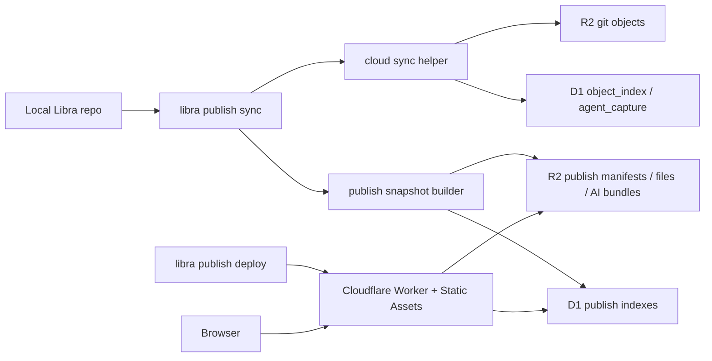

# Libra Publish 发布功能落地计划

## Review 修正摘要

本文档经过几轮修改后出现了范围膨胀和自相矛盾，已经按可执行 MVP 重新收敛。修正原则如下：

- v1 交付一个可发布、可浏览、只读的 Cloudflare Worker 页面，并同步交付一个可从 Cloudflare D1/R2 恢复完整仓库的 `libra clone libra+cloud://...` 路径；不交付 Git server、远程编辑、`publish` 子命令下载入口、全文搜索或完整多租户后台。
- Cloudflare 下载/恢复不作为 `libra publish` 的命令或参数设计；实现本 publish 方案时，必须同步完成 [clone.md](clone.md) 中新增的 Cloudflare source scheme（例如 `libra clone libra+cloud://<slug>`），让 `publish` 只负责发布展示，`clone` 负责恢复仓库。
- `libra publish sync --ref <branch|tag>` 不进入 v1。v1 只发布当前 `HEAD`，降低工作区、branch 选择和历史快照一致性风险。
- 不再要求“SQL 与代码一字不差”这种脆弱约束。改为提供单一 schema 源文件和一致性测试。
- 不再把 Claude Design 提示词、完整前端设计包和 10 个 PR 的大任务包放进 v1 计划。设计和 UI 实现放在独立 Phase，先保证 API 和数据链路闭环。
- v1 的 “所有 AI 版本信息”解释为：发布当前本地可查询的 agent session/checkpoint 索引和可重建的 thread/plan/patchset 摘要。完整 AI object model 覆盖是后续增强，不阻塞首次可用发布。

## Context

当前代码库已有 Cloudflare 备份基础：

- `libra cloud sync` 会把本地 `object_index` 中的 Git 对象上传到 R2，并把对象索引写入 D1。
- R2 Git 对象按 `repo_id` 隔离，路径形如 `{repo_id}/objects/aa/bb...`。
- D1 侧已有 `repositories`、`object_index`、`agent_session`、`agent_checkpoint` 表。
- `src/utils/d1_client.rs` 已提供 Cloudflare D1 REST API 客户端。
- `src/utils/storage/remote.rs` 已提供 Git object 专用 R2/S3 存储封装，但它会写入 Git zlib/header 格式，不适合直接存任意发布 JSON 或代码预览文件。
- 本地 `web/` 是 `libra code` loopback UI，不能直接公网发布。

Cloudflare 侧使用当前官方能力：

- Worker 通过 D1 binding 使用 prepared statements 读取 D1。
- Worker 通过 R2 bucket binding 读取 R2 对象。
- Worker Static Assets 负责前端静态产物；`run_worker_first` 只用于 `/api/*`。
- Wrangler 配置使用 `wrangler.jsonc`，包含 `d1_databases`、`r2_buckets` 和 `assets`。

参考文档：

- [Cloudflare D1 Worker Binding API](https://developers.cloudflare.com/d1/worker-api/)
- [Cloudflare D1 prepared statements](https://developers.cloudflare.com/d1/worker-api/prepared-statements/)
- [Cloudflare R2 Workers API](https://developers.cloudflare.com/r2/get-started/workers-api/)
- [Cloudflare Workers Static Assets binding](https://developers.cloudflare.com/workers/static-assets/binding/)
- [Wrangler configuration](https://developers.cloudflare.com/workers/wrangler/configuration/)
- [Cloudflare Access JWT validation](https://developers.cloudflare.com/cloudflare-one/access-controls/applications/http-apps/authorization-cookie/validating-json/)

## v1 目标

v1 要交付一个最小但完整的发布闭环：

1. 本地执行 `libra publish init`，生成本地发布配置和 Worker 项目骨架。
2. 本地执行 `libra publish sync`，把当前 `HEAD` 的代码预览快照和 AI 版本摘要同步到 D1/R2。
3. 本地执行 `libra publish status`，确认本地 `HEAD`、D1 latest revision、R2 manifest 和 Worker 配置状态。
4. 本地执行 `libra publish deploy`，通过 Wrangler 部署只读 Worker 页面。
5. 浏览器访问 Worker 页面，能查看仓库目录、文件内容、发布 revision 元信息和 AI version 摘要。
6. 开发者执行 `libra clone libra+cloud://<slug> [local_path]`，能从 Cloudflare D1/R2 恢复当前发布仓库的完整 Libra repo、Git objects、refs metadata 和可用 AI 版本索引。

## v1 非目标

- 不实现 Git 协议层的 `clone` / `fetch` / `push` 服务；`libra+cloud://...` 是 Libra CLI 从 D1/R2 恢复本地仓库的特殊 source scheme，不是 Git remote protocol。
- 不发布 uncommitted 工作区内容。
- 不支持 `--ref <branch|tag>`。
- 不让 Worker 动态解析 Git 对象。
- 不发布 raw transcript、raw prompt、tool input、环境变量、绝对本机路径或 secrets。
- 不复用本机 `libra code` Web UI。
- 不在 Worker 中保存 Cloudflare API token。
- 不自动配置 Cloudflare Access；Worker 只验证已有 Access JWT 并提供部署提示。
- 不实现归档下载、Worker streaming zip/tar、导入归档或站点全文搜索；从 Cloudflare 恢复仓库由本计划的 Cloudflare clone source phase 承载。

## 核心决策

### 顶层命令

新增顶层命令，不塞进 `libra cloud`：

```bash
libra publish init
libra publish sync
libra publish status
libra publish deploy
libra publish unpublish
```

原因：

- `cloud` 是私有备份/恢复语义。
- `publish` 是对外只读展示语义，必须有独立安全预检、redaction、visibility 和部署流程。
- 仓库恢复/下载不是 `publish` 子命令。实现本方案时必须同步让 `libra clone` 的 `<remote_repo>` 位置参数支持 `libra+cloud://...`，而不是增加 `libra publish download`。

`unpublish` v1 只做安全下线：标记站点 disabled，撤销或提示撤销 Worker route，不删除 D1/R2 数据。删除云端数据进入 v2。

### 数据写入分层

同步分两层：

1. 复用 `cloud sync` helper，把 Git objects、refs metadata、agent capture 基线同步到 D1/R2。
2. 新增 publish snapshot builder，把可展示代码和 AI 摘要物化为发布专用 D1/R2 结构。

Worker 只读取 publish 专用结构，不直接读取或解析 Git object zlib/header。

### R2 任意对象封装

不要把任意 key 写入加到 `Storage` trait。该 trait 是 Git object abstraction。

新增 `src/utils/storage/publish_storage.rs`：

- 持有 `Arc<dyn ObjectStore>`。
- 使用 base prefix `{repo_id}/publish/sites/{site_id}/`。
- 提供 `put_json`、`get_json`、`put_bytes`、`get_bytes`、`head`。
- 所有 key 由 publish 模块构造并校验，禁止 `..`、空 segment 和绝对路径。

### Schema 单一来源

发布 schema 源文件放在：

```text
sql/publish/0001_publish.sql
```

落地要求：

- `D1Client::ensure_publish_schema()` 使用 `include_str!` 读取该 SQL，按 statement 顺序执行。
- `publish/worker/migrations/0001_publish.sql` 是该文件的部署副本。
- 新增测试验证两个文件 byte-for-byte 一致。
- Worker 运行时不迁移 schema，只读 D1；迁移由 CLI/Wrangler deploy 阶段执行。

### ID 与站点模型

v1 简化为：

- 一个 Libra repo 默认对应一个 publish site。
- `site_id` 使用 `Uuid::new_v4()`，匹配当前代码常用方式。
- `slug` 是用户可读路径标识，可改名；D1 中全局唯一。
- R2 key 使用 `repo_id` + `site_id`，不使用 `slug`，避免 rename 后搬对象。

### Visibility

v1 支持两种 visibility：

- `public`：页面公开可读，只允许 redacted summary AI 信息。
- `private`：Worker 要求并验证 Cloudflare Access 注入的 `Cf-Access-Jwt-Assertion`。只检查 identity header 不安全，容易被直连 Worker URL 的请求伪造。

`publish deploy` 不自动创建 Access policy。自动配置 Access 需要额外 Cloudflare API 权限，放入 v2。v1 只生成 Wrangler 环境变量占位和部署提示；private 站点缺少 `CF_ACCESS_TEAM_DOMAIN` 或 `CF_ACCESS_AUD` 时 fail closed。

## 用户流程

### `libra publish init`

```bash
libra publish init --slug libra-demo --visibility private
```

行为：

- 确认当前目录是 Libra repo。
- 复用或生成 `libra.repoid`。
- 写入 `ConfigKv`：
  - `publish.site_id`
  - `publish.slug`
  - `publish.name`
  - `publish.visibility`
  - `publish.worker_name`
  - `publish.max_preview_bytes`
- 检查 D1/R2 配置是否可解析，但不要求连通性成功才能写本地配置。
- 生成 `publish/worker/` 项目骨架，已存在时 patch，不覆盖用户修改。

### `libra publish sync`

```bash
libra publish sync
libra publish sync --dry-run
libra publish sync --ai-detail summary
```

行为：

- 默认发布当前 `HEAD`。
- 工作区 dirty 时 warning；`--fail-on-dirty` 时失败。
- `--dry-run` 只做本地扫描和计划输出，不写 D1/R2。
- 运行安全预检：`.librapublishignore`、内置 deny 规则、二进制/大文件、secret-like 文件名。
- 调用 cloud sync helper 同步底层 Git objects 和 agent capture。
- 构建代码 manifest、文件预览内容、AI version summary bundle。
- 写入顺序：R2 文件和 bundle -> D1 revision/files/ai rows -> CAS 更新 `publish_sites.latest_revision_oid`。

`--ai-detail` v1 只支持：

- `summary`：默认，适用于 public/private。
- `full-redacted`：仅 private；发布 redacted transcript 摘要，不发布 raw tool input。

`raw` 不实现。

### `libra publish status`

展示：

- 本地 repo id、site id、slug、visibility。
- 本地 `HEAD` 与 D1 latest revision 是否一致。
- 最近一次 sync run 状态、warning、file count、AI version count。
- Worker project 是否存在，Wrangler 配置是否包含 D1/R2/assets binding。

### `libra publish deploy`

行为：

- 运行 Worker 前端 build。
- 确认 `publish/worker/wrangler.jsonc` 的 D1/R2/assets binding。
- 应用 D1 migrations。
- 调用 `wrangler deploy`。
- 输出 workers.dev URL 或用户配置 route。

`deploy` 失败必须保留本地和云端 publish data，不回滚 `sync`。

## 架构



## 模块边界

| 模块 | 职责 |
|------|------|
| `src/command/publish.rs` | CLI 参数、执行/渲染拆分、错误码映射 |
| `src/command/cloud.rs` | 抽出结构化 cloud sync helper，保留原命令输出兼容 |
| `src/internal/publish/` | 发布配置、preflight、snapshot builder、AI export、manifest |
| `src/utils/storage/publish_storage.rs` | R2 任意 publish object 读写 |
| `src/utils/d1_client.rs` | publish schema ensure、upsert、list/query 方法 |
| `sql/publish/0001_publish.sql` | publish D1 schema 源文件 |
| `publish/worker/` | Worker API、静态前端、Wrangler 配置、D1 migration 副本 |
| `tests/data/publish/` | 跨 Rust/Worker 的契约 fixture |

## D1 数据模型

v1 表：

| 表 | 主键 | 用途 |
|----|------|------|
| `publish_sites` | `site_id` | 站点配置，关联 repo、slug、visibility、enabled 状态、latest revision |
| `publish_revisions` | `(site_id, revision_oid)` | 一次发布快照 |
| `publish_files` | `(site_id, revision_oid, path)` | 目录树和文件预览索引 |
| `publish_ai_versions` | `(site_id, ai_version_id)` | AI version 摘要索引 |
| `publish_sync_runs` | `sync_run_id` | 同步审计和失败记录 |

字段要求：

- 所有表必须包含 `site_id`。
- `publish_sites.status` 至少支持 `active`、`disabled`；disabled 站点的 Worker API 返回 410。
- `publish_files.r2_key` 对 `binary`、`too_large`、`ignored` 可以为空。
- `publish_ai_versions.bundle_key` 指向 R2 JSON bundle。
- `publish_revisions.status` 至少支持 `syncing`、`published`、`failed`。
- `publish_sites.latest_revision_oid` 只指向 `published` revision。

一致性要求：

- D1 写入不能让页面读到半成品。
- 新 revision 先以 `syncing` 写入。
- 所有 R2 对象和 D1 子表写完后，把 revision 改为 `published`。
- 最后用 CAS 更新 `publish_sites.latest_revision_oid`。
- 失败时写 `publish_sync_runs.status = failed`，不更新 latest。

## R2 对象布局

现有 Git object 布局不变：

```text
{repo_id}/objects/aa/bb...
{repo_id}/metadata.json
```

新增 publish 布局：

```text
{repo_id}/publish/sites/{site_id}/latest.json
{repo_id}/publish/sites/{site_id}/revisions/{revision_oid}/code-manifest.json
{repo_id}/publish/sites/{site_id}/revisions/{revision_oid}/files/{content_sha256}.txt
{repo_id}/publish/sites/{site_id}/revisions/{revision_oid}/ai/index.json
{repo_id}/publish/sites/{site_id}/revisions/{revision_oid}/ai/{ai_version_id}.json
{repo_id}/publish/sites/{site_id}/sync-runs/{sync_run_id}.json
```

文件规则：

- 文本文件必须是 UTF-8。
- 二进制、非 UTF-8 和超过 `publish.max_preview_bytes` 的文件不写内容，只写 metadata。
- R2 content key 使用 sha256，不使用原始 path。
- manifest 保存原始 path、display mode、content sha256、R2 key、size、language。

## AI 版本同步策略

v1 必须覆盖：

- `agent_session` 列表和状态。
- `agent_checkpoint` 列表和 checkpoint metadata 摘要。
- 可通过 projection resolver 加载的 thread title、current/latest intent、plan/task/patchset 摘要。

v1 不承诺发布：

- raw transcript。
- raw tool input/output。
- provider 原始 session payload。
- 完整所有 `ai_*` 表字段。

每个 AI bundle 必须包含：

- `schemaVersion`
- `sourceKind`
- `summary`
- `redaction.mode`
- `redaction.rulesVersion`
- `removedFields`
- 关联 ids：`sessionId`、`checkpointId`、`threadId`、`treeOid`、`tracesCommit`

## Worker API

所有 API 只读。

| Endpoint | 用途 | Cache |
|----------|------|-------|
| `GET /api/sites/:slug` | 站点元信息和 latest revision | `no-store` |
| `GET /api/sites/:slug/revisions?limit&cursor` | revision 列表 | short cache + ETag |
| `GET /api/sites/:slug/tree?revision=<oid>&path=<path>` | 目录树 | revision-scoped long cache |
| `GET /api/sites/:slug/file?revision=<oid>&path=<path>` | 文件内容或 metadata | revision-scoped long cache |
| `GET /api/sites/:slug/ai/versions?limit&cursor` | AI version 列表 | short cache + ETag |
| `GET /api/sites/:slug/ai/versions/:id` | AI bundle 详情 | revision-scoped long cache |
| `GET /api/sites/:slug/status` | 最近 sync 状态 | `no-store` |

Worker 规则：

- D1 查询必须使用 prepared statement + bind 参数。
- R2 miss 返回 typed 404，不泄漏 bucket key。
- API 错误统一为 `{ "ok": false, "code": "...", "message": "...", "detail": ... }`。
- public 站点只返回 summary bundle。
- private 站点要求 `Cf-Access-Jwt-Assertion`，并用 `CF_ACCESS_TEAM_DOMAIN` + `CF_ACCESS_AUD` 校验 issuer、audience 和 signature，否则 403。
- disabled 站点返回 410，不读取 R2 bundle。
- 非 `/api/*` 请求交给 Static Assets SPA。

## `.librapublishignore`

v1 使用 gitignore 子集：

- 支持空行、注释、glob、目录后缀 `/`、否定 `!pattern`。
- 不支持嵌套 include。
- 默认 deny 规则优先级高于用户 allowlist，除非用户显式传 `--allow-sensitive-path <path>` 且 visibility 为 private。

内置 deny 规则至少包括：

- `.env`, `.env.*`
- `*.pem`, `*.key`, `id_rsa`, `id_ed25519`
- `*token*`, `*secret*`, `*credential*`
- `.libra/config.db`
- `.git/`
- Cloud provider credential files

## 分阶段实施

### Phase 0：契约和 schema 基线

**Description:** 建立 publish 的最小契约，让 Rust CLI、D1 schema、Worker API 和 fixture 有共同基准。

**Acceptance criteria:**

- [ ] 新增 `docs/commands/publish.md` 草案。
- [ ] 新增 `sql/publish/0001_publish.sql`。
- [ ] 新增 `publish/worker/migrations/0001_publish.sql`，并有测试验证与源 SQL 一致。
- [ ] 新增 publish JSON fixture：site、revision、manifest、file metadata、AI bundle、sync run。
- [ ] 新增 Rust serde contract 类型或测试 fixture 解析路径。

**Verification:**

- [ ] `cargo test publish_schema_contract`
- [ ] `cargo test publish_contract_round_trip`

**Dependencies:** None

**Estimated scope:** M

### Phase 1：抽出 cloud sync helper

**Description:** 让 publish 能复用 `libra cloud sync` 的对象同步能力，同时不破坏 `cloud sync` 现有人类输出。

**Acceptance criteria:**

- [ ] `src/command/cloud.rs` 新增结构化 helper，例如 `run_cloud_sync(ctx) -> CloudSyncReport`。
- [ ] `execute_sync()` 只负责调用 helper 和渲染现有输出。
- [ ] helper 返回对象数量、失败数量、metadata 状态、agent capture 状态。
- [ ] helper 不直接 `println!`。
- [ ] 现有 cloud 测试和文档输出不回归。

**Verification:**

- [ ] `cargo test cloud_storage_backup_test`
- [ ] `cargo test --test command_test cloud`

**Dependencies:** Phase 0

**Estimated scope:** M

### Phase 2：publish storage 和 D1 client

**Description:** 增加 publish 专用 R2 arbitrary object wrapper 和 D1 publish query/upsert 方法。

**Acceptance criteria:**

- [ ] 新增 `src/utils/storage/publish_storage.rs`。
- [ ] `PublishStorage` 支持 JSON 和 bytes round-trip，key 有路径安全校验。
- [ ] `D1Client::ensure_publish_schema()` 能执行 `sql/publish/0001_publish.sql`。
- [ ] `D1Client` 增加 upsert/list 方法：site、revision、files、AI versions、sync runs。
- [ ] 所有新增错误都有可读 context，不使用生产路径 `unwrap()` / `expect()`。

**Verification:**

- [ ] `cargo test publish_storage_test`
- [ ] `cargo test publish_d1_client_test`
- [ ] `cargo clippy --all-targets --all-features -- -D warnings`

**Dependencies:** Phase 0

**Estimated scope:** M

### Phase 3：snapshot builder 和 AI summary exporter

**Description:** 从当前 `HEAD` 生成代码 manifest、文件预览和 AI summary bundle。

**Acceptance criteria:**

- [ ] 只解析当前 `HEAD`。
- [ ] 支持 `.librapublishignore` 和内置 deny 规则。
- [ ] 文本文件写入 R2，二进制/超大/ignored 文件只写 D1 metadata。
- [ ] 生成 `code-manifest.json` 和 `ai/index.json`。
- [ ] AI exporter 覆盖 agent session/checkpoint，能尽量关联 projection thread/plan/patchset 摘要。
- [ ] redaction bundle 中包含 `removedFields` 和 `rulesVersion`。

**Verification:**

- [ ] `cargo test publish_snapshot_test`
- [ ] `cargo test publish_preflight_test`
- [ ] `cargo test publish_ai_export_test`

**Dependencies:** Phase 1, Phase 2

**Estimated scope:** L，建议拆为 code snapshot 和 AI export 两个 PR

### Phase 4：`libra publish sync/status`

**Description:** 先提供可用的数据发布链路，不等待 Worker UI。

**Acceptance criteria:**

- [ ] `src/command/publish.rs` 新增 `sync`、`status`。
- [ ] 顶层 CLI 注册 `Publish` 命令。
- [ ] `sync --dry-run` 不写 D1/R2。
- [ ] `sync --json` 输出 site id、revision oid、file count、AI version count、warnings。
- [ ] `status --json` 能对比本地 HEAD 和 D1 latest。
- [ ] dirty 工作区 warning 和 `--fail-on-dirty` 语义有测试。

**Verification:**

- [ ] `cargo test --test command_test publish`
- [ ] `cargo test publish`

**Dependencies:** Phase 3

**Estimated scope:** M

### Phase 5：Cloudflare clone source scheme

**Description:** 按 [clone.md](clone.md) 中新增的 Cloudflare D1/R2 source scheme，实现 `libra clone libra+cloud://...` 从云端恢复完整本地 Libra 仓库。该 phase 是 publish 交付的一部分，但 CLI 入口归属 `clone`，不得新增 `libra publish download`。

**Acceptance criteria:**

- [ ] `src/command/clone.rs` 在 remote discovery 前识别 `libra+cloud://<slug>`、`libra+cloud://repo/<repo_id>` 和 `?revision=<oid|latest>`。
- [ ] scheme parser 对非法 scheme、非法 revision、缺失 slug/repo_id 返回 `CliInvalidArguments`，并给出可行动 hint。
- [ ] Cloudflare clone 复用 publish/cloud 的本地配置和 vault 读取策略，能解析 D1/R2 访问参数。
- [ ] 通过 D1 解析 `repositories`、`object_index`、refs metadata 和 latest revision；通过 R2 读取完整 Git object 集合。
- [ ] 使用 `run_init()` 初始化本地仓库，再恢复 objects、refs、HEAD、remote config，并完成 non-bare checkout。
- [ ] 缺失 R2 object、refs metadata 不完整或 checkout 失败时，命令必须失败并清理本次 clone 创建的目标目录，不得输出成功。
- [ ] 若 D1 中存在 agent session/checkpoint 数据，恢复到本地 AI 版本索引；不得从 redaction 后的 publish summary 反推原始 AI 记录。
- [ ] `--branch`、`--depth`、`--single-branch`、`--bare` 与 `libra+cloud://` 的首版兼容策略按 [clone.md](clone.md) 执行：未支持的组合必须明确报错，不得静默降级。
- [ ] `--json` / `--machine` 输出仍只有一个 clone envelope；Cloudflare 字段使用可选加法字段，不破坏普通 Git clone schema。
- [ ] publish 实现完成前，Cloudflare clone source 的测试必须纳入同一交付检查，不能留作 v2 backlog。

**Verification:**

- [ ] `cargo test cloud_clone_source_parse_test`
- [ ] `cargo test cloud_clone_restore_test`
- [ ] `cargo test --test command_test clone_cloud`
- [ ] `cargo test --test command_test publish`

**Dependencies:** Phase 1, Phase 2, Phase 4, and the clone output/error baseline in [clone.md](clone.md)

**Estimated scope:** L，建议独立 PR，但必须在 publish 功能宣布完成前合入

### Phase 6：Worker API

**Description:** 实现只读 API，先让发布数据可通过 Worker 读回。

**Acceptance criteria:**

- [ ] 新建 `publish/worker` TypeScript Worker 项目。
- [ ] `wrangler.jsonc` 包含 D1/R2/assets bindings。
- [ ] API endpoints 按本文 Worker API 表实现。
- [ ] 所有 SQL 使用 prepared statement。
- [ ] private visibility 缺少或无法验证 `Cf-Access-Jwt-Assertion` 时返回 403。
- [ ] disabled site 返回 410，不读取 R2 bundle。
- [ ] fixture 能写入 Miniflare D1/R2 并通过 API round-trip。

**Verification:**

- [ ] `pnpm --dir publish/worker install`
- [ ] `pnpm --dir publish/worker lint`
- [ ] `pnpm --dir publish/worker test`
- [ ] `pnpm --dir publish/worker exec tsc --noEmit`

**Dependencies:** Phase 0, Phase 2

**Estimated scope:** M

### Phase 7：发布前端和 deploy/init

**Description:** 构建只读 SPA，并把 `init/deploy` 接入 Wrangler。

**Acceptance criteria:**

- [ ] `libra publish init` 生成/patch Worker 项目，不覆盖用户修改。
- [ ] SPA 能展示 repo、tree、file、AI versions、status。
- [ ] 长路径、空仓库、无 AI 数据、binary/too_large 文件都有空态。
- [ ] `libra publish deploy` 执行 build、D1 migrations、`wrangler deploy`。
- [ ] deploy 输出 URL。
- [ ] `libra publish unpublish` 将 `publish_sites.status` 标记为 `disabled`，不删除 D1/R2 数据；后续 Worker API 返回 410。

**Verification:**

- [ ] `pnpm --dir publish/worker build`
- [ ] `pnpm --dir publish/worker e2e`
- [ ] `cargo test --test command_test publish_deploy`

**Dependencies:** Phase 4, Phase 6

**Estimated scope:** L，建议拆为 UI 和 deploy 两个 PR

### Phase 8：hardening 和 live gate

**Description:** 补齐安全、幂等和真实 Cloudflare 环境验证。

**Acceptance criteria:**

- [ ] 重复 sync 不重复上传未变化文件和 AI bundle。
- [ ] CAS latest revision 冲突有清晰错误和 `--force` 路径。
- [ ] public visibility 下 secret/redaction fixture 无泄漏。
- [ ] live cloud gate 能完成 sync -> `libra clone libra+cloud://...` restore -> Worker API -> deploy smoke。
- [ ] `docs/commands/publish.md` 更新为用户可读文档。
- [ ] `docs/commands/clone.md` 更新 Cloudflare source scheme 用户文档，并明确这不是 `publish` 子命令。

**Verification:**

- [ ] `cargo test publish_incremental_test`
- [ ] `cargo test publish_redaction_contract_test`
- [ ] `LIBRA_ENABLE_TEST_LIVE_CLOUD=1 cargo test --features test-live-cloud publish_live -- --test-threads=1`

**Dependencies:** Phase 5, Phase 7

**Estimated scope:** M

## Checkpoints

### Checkpoint A：本地 dry-run 可用

- [ ] `libra publish sync --dry-run` 能输出将发布的 code/AI 计划。
- [ ] 不需要 Cloudflare 凭据也能跑完 preflight。
- [ ] 高风险文件能阻断或 warning。

### Checkpoint B：云端数据闭环

- [ ] mock R2 + D1 下，snapshot 能 round-trip。
- [ ] D1 latest 只指向完整 published revision。
- [ ] `publish status` 能发现本地 HEAD 和云端 latest 不一致。

### Checkpoint C：Cloudflare clone 可恢复

- [ ] mock R2 + D1 下，`libra clone libra+cloud://<slug>` 能恢复完整本地仓库。
- [ ] 恢复后的 refs、HEAD、checkout 文件和源 revision 一致。
- [ ] AI session/checkpoint 索引能从 cloud baseline 恢复，且不依赖 publish redacted summary。
- [ ] 缺失 object 或 refs metadata 不完整时 clone 失败并清理目标目录。
- [ ] `libra clone libra+cloud://<slug> --json` 输出一个 clone envelope，包含可选 Cloudflare source 字段。

### Checkpoint D：Worker 可读

- [ ] Miniflare 能通过 API 读回 site、tree、file、AI version。
- [ ] private 缺 Access JWT 或 JWT 校验失败返回 403。
- [ ] disabled site 返回 410。
- [ ] R2 miss 和 D1 miss 返回 typed 404。

### Checkpoint E：页面可发布

- [ ] `libra publish deploy` 输出可访问 URL。
- [ ] 页面能浏览最新 revision 的目录、文件和 AI version。
- [ ] public 页面不出现 raw transcript、secret-like 值或本机绝对路径。

## 风险与缓解

| 风险 | 影响 | 缓解 |
|------|------|------|
| 误发布 secrets 或 AI prompt | 高 | 默认 private；public 仅 summary；内置 deny；redaction fixture；public 禁止 full-redacted |
| D1/R2 半成品被 latest 指向 | 高 | revision `syncing -> published`；最后 CAS 更新 latest；失败写 sync run |
| Worker 解析 Git 对象成本和正确性风险 | 中 | Worker 只读物化 manifest 和文件预览 |
| Cloudflare clone 错把 publish snapshot 当源码真相 | 高 | clone 只能基于 D1 `object_index`、refs metadata 和 R2 Git objects 恢复；snapshot 只用于页面展示 |
| 大仓库同步太慢 | 中 | 默认大文件 metadata-only；增量 sha256 跳过；status 显示 skipped |
| AI projection schema 漂移 | 中 | bundle `schemaVersion`；fixture round-trip；完整覆盖放后续增强 |
| private visibility 误以为自动受保护 | 高 | deploy 明确提示 Cloudflare Access 要求；Worker 无有效 Access JWT 即 403 |
| Wrangler 配置被覆盖 | 中 | init patch 模式；dry-run 输出 diff；不强行覆盖用户文件 |
| 多机器同时发布覆盖 latest | 中 | CAS latest；冲突时失败并提示 rerun/force |

## 验收命令矩阵

```bash
cargo +nightly fmt --all --check
cargo clippy --all-targets --all-features -- -D warnings
cargo test publish_schema_contract
cargo test publish_contract_round_trip
cargo test publish_storage_test
cargo test publish_snapshot_test
cargo test publish_ai_export_test
cargo test --test command_test publish
cargo test cloud_clone_source_parse_test
cargo test cloud_clone_restore_test
cargo test --test command_test clone_cloud
cargo test cloud_storage_backup_test
pnpm --dir publish/worker lint
pnpm --dir publish/worker test
pnpm --dir publish/worker build
```

Live cloud gate：

```bash
LIBRA_ENABLE_TEST_LIVE_CLOUD=1 \
cargo test --features test-live-cloud publish_live -- --test-threads=1
```

## v2+ Backlog

- `libra publish sync --ref <branch|tag>`。
- Cloudflare clone source 的真实浅克隆、指定 branch、single branch 和 bare clone 支持；首版只要求未支持组合明确报错。
- 自动配置 Cloudflare Access policy。
- per-site 自定义域和 route 自动绑定。
- 多 revision diff viewer。
- 站点全文搜索。
- 完整 `ai_*` object model 发布和更细粒度 redaction policy。

## 文档维护

- 修改目标或非目标时，必须同步更新 Phase 和 backlog。
- 修改 D1 schema 时，必须同步 `sql/publish/0001_publish.sql`、Worker migration 副本和 schema consistency test。
- 修改 Worker API 时，必须同步 Rust/TypeScript fixture。
- 修改 Cloudflare clone source scheme 时，必须同步 [clone.md](clone.md)、`docs/commands/clone.md` 和 publish Phase 5 验收项。
- 每个 PR 只认对应 Phase 的 acceptance criteria，不把 v2 backlog 当作 v1 阻塞项。
